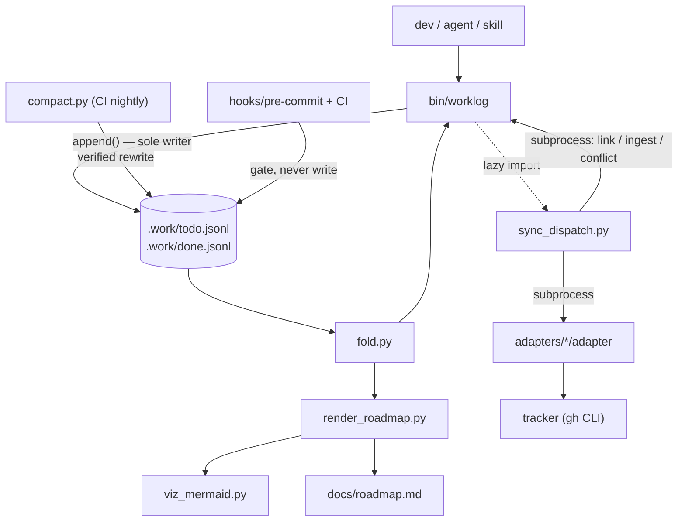

# Worklog — Code Walkthrough

The guided tour a new team member reads on day one. Every claim is anchored in
the code at the commit above. The companion design document is
`docs/designs/current_design_doc.md`; where this walkthrough and that document
disagree with the code, the code wins (drift is reported in §6).

## 1. Orientation

Three sentences: **Worklog tracks work as an append-only JSONL event log inside
the git repo; item state is a fold over the events, and git's union merge makes
concurrent writes compose instead of conflict.** Everything human-readable — the
roadmap, status reports, Mermaid diagrams — is generated from the log, and
everything remote — tickets, wiki pages — is a mirror driven through a typed
dispatcher or a skill. The rules that matter are enforced by hooks and CI, not by
memory.

Directory map:

| Path | What lives there and why |
|---|---|
| `bin/worklog` | The CLI and the **only** writer of `.work/*.jsonl` (942 lines). |
| `bin/fold.py` | The only code allowed to decide what the log *means*. |
| `bin/ulid.py` | IDs. Includes the deterministic form that makes ingest idempotent across clones. |
| `bin/canonical.py` | THE canonical hash (sync change detection). 34 lines, high blast radius. |
| `bin/sync_dispatch.py` | Every ticket-sync invariant, in one place. |
| `bin/compact.py` | The only file rewriter. CI-only, verification-gated. |
| `bin/render_roadmap.py`, `bin/viz_mermaid.py` | Byte-deterministic roadmap + diagrams. |
| `bin/plan_capture.py`, `bin/adr.py` | Pure helpers: plan parsing, ADR tooling. |
| `.work/` | The log (`todo.jsonl`, `done.jsonl`), `config.yml`, ledgers. |
| `adapters/` | `github` (worked example), `fake` (CI double), authoring rules. |
| `hooks/` | git pre-commit/pre-merge-commit + four Claude Code hooks. |
| `plugin/` | Claude Code packaging; `plugin/scripts/` mirrors `bin/` + `hooks/`. |
| `tests/` | 19 stdlib-unittest suites; the executable spec. |
| `docs/` | Generated roadmap, frozen plans/status/ADRs, the spec (v1.8). |

The one diagram (derived from actual imports and subprocess calls):



## 2. Execution-order tour

### 2.1 The write path: `worklog add` → one line in the log

Entry: argparse dispatches to `cmd_add` (`bin/worklog`, lines 809–821 wiring,
81–105 body). Validation happens **before** any write — `--unplanned` requires
`--discovered-during` (lines 82–83), and taxonomy rules are hard here even though
the fold is lenient:

```python
def check_taxonomy(level, kind, milestone):
    """Write-time rules, taxonomy spec §2. The fold is lenient; this is not."""
    if level == "epic":
        if kind in ("bug", "triage"):
            sys.exit(f"worklog: an epic cannot be kind:{kind} — epics are "
                     "feature or ops (taxonomy §2.2)")
        if milestone is not None:
            sys.exit("worklog: milestone lives on leaves; epic milestones are "
                     "derived (taxonomy §2.5)")
```
— `bin/worklog — check_taxonomy(), lines 70–79`

Note line 95's comment: *"kind is only written when given: an omitted kind folds
to triage (§2.3), never silently to feature."* Unclassified must look
unclassified.

Every event then funnels through the single writer:

```python
def append(event):
    """The only writer. Single O_APPEND write, always newline-terminated. ..."""
    if len(event.get("set", {}).get("body", "")) > MAX_BODY:
        sys.exit(f"worklog: body exceeds {MAX_BODY}B; put prose in the plan doc")
    line = json.dumps(event, separators=(",", ":"), sort_keys=True) + "\n"
    fd = os.open(LOG, os.O_WRONLY | os.O_APPEND | os.O_CREAT, 0o644)
    try:
        if os.fstat(fd).st_size:
            rfd = os.open(LOG, os.O_RDONLY)
            try:
                os.lseek(rfd, -1, os.SEEK_END)
                if os.read(rfd, 1) != b"\n":
                    line = "\n" + line
            finally:
                os.close(rfd)
        os.write(fd, line.encode())   # atomic under PIPE_BUF
    finally:
        os.close(fd)
    return event
```
— `bin/worklog — append(), lines 35–58`

What it receives: a finished event dict. What it returns: the event. What can
fail: an oversized body exits before the write; everything else is one atomic
`write()`. Why it is written this way: the self-heal (`lseek -1; read 1`) repairs
a hand-edited file missing its trailing newline — without it, `O_APPEND` would
fuse two events into one unparseable line and lose both (spec §8.2). `MAX_BODY =
2048` (line 31) is "derived from PIPE_BUF … Not a setting."

### 2.2 The read path: `fold()` decides what the log means

Every read command (`list`, `show`, `fold`, roadmap, status, sync scope) calls
`fold([todo, done])`. Four stages, each load-bearing:

**Parse tolerantly** — `read_lines()` (`bin/fold.py`, lines 82–116): a bad line
is reported into `result.errors` and skipped. The docstring explains why this is
not politeness: union merge plus a missing newline "can fuse two valid lines into
one invalid one, and that must cost two events, not the entire history."

**Dedupe and sort deterministically**:

```python
    return sorted(
        seen.values(),
        key=lambda e: (
            e["ev"],
            e.get("actor", ""),
            hashlib.sha256(e["_line"].encode()).hexdigest(),
        ),
    )
```
— `bin/fold.py — dedupe_and_sort(), lines 134–141`

ULIDs sort lexicographically by time, so ordering is a string sort; the
`(actor, line-hash)` tiebreak makes two machines fold the same bag of lines
identically — the property union merge depends on.

**Apply the watermark** — `apply_watermark()` (lines 144–157) drops everything
the compactor already folded, *except* `snapshot` events, which carry the state
those events produced.

**Replay** — `fold()` (lines 189–247). The subtleties that bite naive
implementations, each with a guarding test (§4): `snapshot` replaces state
entirely (never merges); a duplicate `create` degrades to an update; `close`
takes its status from `set` (only defaulting to `done` when nothing closed was
set — lines 229–235); `conflict` records without changing state; and a later
write to a conflicted field clears the conflict while an *earlier* one does not,
because events apply in `ev` order (`_apply_mutations()`, lines 177–186).

Orphans (lines 217–221): an event for an item with no create/snapshot creates
`{"id": iid, "_orphan": True}` — "Report it; never crash, never silently invent
an item." Legitimate mid-rebase.

### 2.3 Plan capture: one command, one epic, N tasks, one frozen doc

`cmd_plan_capture()` (`bin/worklog`, lines 309–349). It parses the draft with
`plan_capture.parse_tasks()` — checkboxes under a `## Tasks` heading only, with
the regex `TASK_RE` (`bin/plan_capture.py`, line 18) where a leading indent means
"subtask of the task above". It refuses to overwrite an existing plan path:

```python
    if os.path.exists(path):
        sys.exit(f"worklog: {path} exists; plans are never rewritten "
                 "(invariant 15.8) — pick a new slug to supersede")
```
— `bin/worklog — cmd_plan_capture(), lines 317–319`

Then it appends the epic create, then each task/subtask create (subtasks parent
to `last_task`, lines 329–342), and finally writes the plan doc with front
matter linking every item ID (`plan_capture.front_matter()`). Captured items get
explicit `kind:feature`: "a plan is deliberate feature work, not a triage
candidate" (line 322 comment). The whole flow is *forced* by
`hooks/exit-plan-capture.sh`, which fires on `PostToolUse: ExitPlanMode` and
injects a non-optional instruction — "Hooks, not hope" (spec §12).

### 2.4 The roadmap: a pure function, gated by diff

`render_roadmap.render()` (lines 121–232) folds the log and emits markdown. Two
non-obvious choices: `generated-at` comes from the newest event's ULID timestamp,
not the wall clock — "wall clock here would fail every commit" (module docstring,
lines 5–8) because `hooks/pre-commit` regenerates and diffs:

```sh
if [ -f bin/render_roadmap.py ] && [ -f docs/roadmap.md ]; then
  tmp=$(mktemp)
  python3 bin/render_roadmap.py > "$tmp"
  if ! diff -q "$tmp" docs/roadmap.md >/dev/null; then
    rm -f "$tmp"
    fail "docs/roadmap.md is stale or hand-edited. Run: worklog roadmap-render"
  fi
```
— `hooks/pre-commit, lines 53–59`

And the default `--viz deps,hierarchy` in `cmd_roadmap_render` **must** match
`render()`'s default (comments at `bin/worklog` lines 285–287 and
`render_roadmap.py` lines 122–124), because the hook runs the bare script and
diffs against the file the CLI wrote. `viz_mermaid.py` keeps output deterministic
the same way ("now" is the max event timestamp, never wall clock — docstring,
lines 6–9), caps nodes at `MAX_NODES = 40` with a `_+K more items not shown_`
suffix (`_graph()`, lines 114–117), and strips Mermaid-breaking characters
(`_safe()`, lines 25–26).

`hooks/pre-merge-commit` is a one-line `exec` of the same script, because "git
runs THIS hook (not pre-commit) when a merge auto-commits" — otherwise merging
two PRs that each carried a fresh roadmap lands a stale one on main.

### 2.5 Ticket sync: the dispatcher owns everything

`worklog sync` runs `sync_dispatch.main()` in-process (`cmd_sync()`, lines
684–697). Order inside `Dispatcher.sync()` (lines 451–464): capabilities gate,
push, pull, save state, report.

**The gate runs first, every run** (lines 197–208): adapter `capabilities`
output is parsed, validated against the embedded schema mirror
(`CAPABILITIES_SCHEMA`, lines 34–65) by a 28-line mini JSON Schema validator
(`validate()`, lines 83–110), plus one check the schema subset cannot express:

```python
        if "{ulid}" not in caps["marker"]["template"]:
            raise ContractError("$.marker.template: must contain '{ulid}'")
```
— `bin/sync_dispatch.py — capabilities(), lines 206–207`

**Push scope** (`push_items()`, lines 294–368): open ∪ hash-dirty ∪ `--keys`.
The canonical hash is computed over the *outbound* shape — after type
degradation — so "the degraded echo coming back on pull still suppresses"
(`outbound()` docstring, lines 213–216). A closed item that never went remote is
inert (lines 310–314: "pushing it would file tickets for long-dead work");
orphans and titleless items are drift, never pushes (lines 299–303). On a
successful create, external identity enters the log the only way it can:

```python
                link = ["link", iid, "--system", caps["system"],
                        "--key", str(resp["key"])]
                ...
                self.worklog(*link)
```
— `bin/sync_dispatch.py — push_items(), lines 358–364`

— a subprocess back into `bin/worklog`, preserving invariant 15.4 (nothing but
`worklog` writes the log).

**Pull** (`pull()`, lines 372–447): NDJSON lines from the adapter; echo
suppression by comparing `canonical_hash(line)` to `last_pushed_hash` (line
413–414); a field-diff against the outbound shape decides remote-only vs
both-sides-changed; remote-only becomes `worklog ingest` with the remote's
revision timestamp:

```python
                ing = ["ingest", iid, "--system", system,
                       "--key", str(ext.get("key")), "--rev", rev or "",
                       "--rev-ts-ms", str(rev_to_ms(rev))]
```
— `bin/sync_dispatch.py — pull(), lines 439–441`

`cmd_ingest` then mints the deterministic event ID:

```python
def deterministic(system: str, key: str, rev: str, rev_timestamp_ms: int) -> str:
    """The ULID for an ingested remote change (section 10.2). ..."""
    digest = hashlib.sha256(f"{system}|{key}|{rev}".encode("utf-8")).digest()
    return encode(rev_timestamp_ms, digest[:10])
```
— `bin/ulid.py — deterministic(), lines 49–58`

Same remote change → same ULID on every machine, forever — so two clones polling
the same tracker append byte-identical lines and the fold's dedupe collapses
them. Both-sides-changed records a `conflict` event per field and never
overwrites (lines 429–437, "report policy — never auto-resolve").

**Failure handling** is an exit-code table, not exceptions (`handle_exit()`,
lines 245–268): 2 aborts the sync after saving state; 3 pops
`last_pushed_hash` so the item re-pushes next run; 4 was already retried with
doubling backoff (`call_push()`, lines 232–243); 5 fetches the remote and files
per-field conflicts; anything else is a drift note. No adapter at all is a
*mode*: `main()` prints `LOCAL_ONLY` and returns 0 (lines 493–496).

**Adapters are dumb on purpose.** `adapters/github/adapter` maps verbs to `gh`
calls, embeds the marker in the issue body, encodes taxonomy as
`level:*`/`kind:*` labels plus a real milestone, and classifies `gh` stderr into
the contract exit codes (`classify()`, lines 47–58). It contains no hashing, no
search-before-create, no state — and a test enforces that (§4).

### 2.6 Compaction: the one rewrite, quadruple-checked

`compact.compact()` (`bin/compact.py`, lines 125–186), nightly on main via
`.github/workflows/compact.yml`. The sequence: refuse on uncommitted log changes
(`_git_refuses()`, lines 80–96 — "Compaction must be its own commit"); watermark
= max raw `ev`; short-circuit if todo is already all snapshots (lines 137–140,
"don't churn files"); partition open vs closed where *orphans count as open* —
"never drop data" (lines 144–150); write temp files; then the gate:

```python
    if old != new:
        ...
        print("compact: aborted; logs untouched", file=sys.stderr)
        raise SystemExit(1)
```
— `bin/compact.py — _verify(), lines 104–112`

`_verify()` also re-checks the trailing newline and that every written line
parses (lines 113–123). Only after all of that do two `os.replace` calls swap
the files (lines 184–185). Fresh snapshot ULIDs "sort after every past ev, so
these outsort the watermark" (`_snapshot()`, lines 45–49) — which is also why a
`reopen` after compaction just works: it outsorts the `done` snapshot.

### 2.7 Status: deterministic facts, model prose, frozen file

`_status_facts()` (`bin/worklog`, lines 526–646) is the deterministic half: a
fold plus a raw-event pass; an event is in-window when its **`ev` ULID
timestamp** is (lines 540–541). Daily windows open at the last daily report's
date; weekly is a fixed 7 days; timecards bucket per UTC day, attach best-effort
git commit subjects (`_git_commits()`, lines 484–496: any git failure → `[]`),
and carry no item IDs — "narrative only" (lines 550–553). The prose is
explicitly not this code's job: "The prose is the skill's job, not ours" (line
529). `cmd_status --write` stamps front matter with the window and the
`through` watermark and refuses to overwrite without `--force` (lines 674–677) —
frozen, invariant 15.9.

### 2.8 The automation ring

Claude Code hooks (wired by `plugin/hooks/hooks.json`):
`prompt-reminder.sh` injects a one-line policy on every prompt;
`stop-worklog-check.sh` **blocks** ending a session where the tree changed but
`.work/todo.jsonl` did not (line 42's `{"decision":"block",...}`), with a
settle-and-recheck sleep to survive background branch flips (lines 14–22) and a
classifier branch that only fires when `classifier.enabled: true` (lines 30–38);
`session-doctor.sh` reports missing policy blocks, unarmed hooks, or plugin
version skew, read-only. CI (`worklog.yml`) re-runs the pre-commit script
verbatim — "A dev can `--no-verify` past the local hook; not this" — then unit,
integration, and a subprocess-aware coverage gate (`--fail-under=80`).
`merge-when-green.sh` polls `gh pr checks` and merges only on all-green; empty
check output counts as pending, and 24 failed polls exit 4 — "no gates
reporting is not gates passing" (ADR-0003).

## 3. Load-bearing invariants

| # | Invariant | Enforced at | Broken means |
|---|---|---|---|
| 1 | Every `.jsonl` write ends in `\n` | `append()` self-heal (lines 46–52); `hooks/pre-commit` line 14; CI | next append fuses two events into one corrupt line; both lost |
| 2 | Only `worklog` writes the log; only `compact.py` rewrites it | policy + CLAUDE.md; `sync_dispatch` shells into `worklog` (lines 177–187) | hand edits corrupt merges; invariants unauditable |
| 3 | Fold order is `ev`, never file position or `ts` | `dedupe_and_sort()` lines 134–141 | union-merged logs fold differently per machine; remote edits clobber local ones |
| 4 | Ingested events carry deterministic `ev` and the remote's `ts` | `ulid.deterministic()`; `cmd_ingest()` lines 165–168 | duplicate ingests survive dedupe and silently revert local edits (`test_random_ev_silently_reverts_the_local_edit`) |
| 5 | Push idempotency: marker `worklog:<ulid>` + canonical-hash skip | `push_items()` lines 306–316; marker template gate line 206–207 | retried pushes file duplicate tickets |
| 6 | Canonical hash = exactly `HASH_FIELDS`, one implementation | `canonical.py` lines 17–34 ("nothing else may reimplement it") | echo suppression breaks for every existing clone |
| 7 | Compaction only lands if `fold(new) == fold(old)` | `_verify()` lines 99–123; temp files + `os.replace` | state loss — "the worst failure mode in this system" |
| 8 | `close` reads status from `set` | `fold()` lines 229–235 | cancelled work reports as shipped |
| 9 | Generated roadmap always matches the log | pre-commit + pre-merge-commit diff; deterministic timestamps | roadmap silently lies; hand edits stick |
| 10 | Frozen artifacts are never rewritten | `plan-capture`/`roadmap-snapshot`/`status` existence refusals; ADR `mark_superseded()` is the only sanctioned ADR mutation | history that people acted on gets rewritten |
| 11 | Adapters contain no invariant logic | `test_adapter_contract.py` banned-token scan (lines 168–179) | invariants fork per platform and drift |
| 12 | Epics are feature/ops only; milestone lives on leaves | `check_taxonomy()`; `hooks/pre-commit` lines 30–45; fold stays lenient | taxonomy queries (kind mix, derived milestones) give wrong answers |
| 13 | Merges happen only on all-green gates | `merge-when-green.sh` (fail → exit 1; silence → timeout 4) | broken main, agent-speed |

## 4. Tests as executable specification

**`tests/test_fold.py — test_cancelled_stays_cancelled()` (lines 65–73).**

```python
        item = fold([path]).items["A"]
        self.assertEqual(item["status"], "cancelled")  # naive fold gives "done"
        self.assertEqual(item["resolution"], "wont-do")
```

Rule proved: `close` takes status from `set`. Regression caught: a fold that
hardcodes `done` — abandoned work reporting as shipped in every status report.

**`tests/test_ulid.py — TestTheBugThisPrevents` (lines 59–100).** Two devs poll
the same remote change; Rick edits locally in between; union merge brings in
both ingests. With deterministic `ev`, dedupe collapses them and Rick's P2
stands (`deduped == 1`). The companion test **passes while documenting the
failure mode**: with random `ev`s, `r.items["A"]["priority"] == "P0"` — "Rick's
edit is gone", nothing errors, nothing warns. It exists "because this design
keeps getting proposed" (spec Appendix A).

**`tests/test_dispatch.py — test_push_twice_same_ulid_is_one_ticket()` (lines
77–83).**

```python
        self.sync("--push-only")
        self.sync("--push-only")  # hash unchanged -> skipped, never a 2nd create
        self.assertEqual(self.fake("_count"), "1")
```

Rule proved: canonical-hash skip + marker idempotency. Regression caught: any
change that makes a retried or repeated sync file duplicate tickets — the single
worst user-visible sync failure. Its sibling `test_retry_after_transient_does_not_duplicate`
(lines 84–91) injects an exit-4 with `_fail_next` and asserts one create.

**`tests/test_adapter_contract.py — test_adapters_contain_no_invariant_logic()`
(lines 168–179).** Scans every `adapters/*/adapter` for banned tokens
(`sha256`, `last_pushed_hash`, `canonical_json`, `search`, `sync-state`). Rule
proved: the dispatcher/adapter boundary of ADR-0002. It "automatically covers
new adapters … the day they appear."

**`tests/test_integration.py — test_a_fused_line_costs_exactly_its_own_events()`
(lines 313–345).** A vandal branch smuggles a fused (newline-less) double-event
line past the local hook with `--no-verify`; the merge gate catches it, and the
blast radius is exactly the fused events — the survivor item and the victim's
honest work fold fine. Rule proved: corruption is contained and detected at the
merge boundary, not just at commit time.

**`tests/test_compact.py — test_reopen_after_compact_restores_pre_close_fields()`
(lines 129–137).** Rule proved: folding `todo + done` by `ev` makes reopen work
across the physical file split with no tombstone machinery — the spec bug the
implementation removed (spec Appendix A, "Two spec bugs").

## 5. Junior engineer orientation

**Five things to internalize:**

1. State is derived, never stored. If `worklog list` looks wrong, the question
   is "what events exist?" (`worklog fold`, or read the JSONL), never "where is
   the state file?"
2. `ev` order is the only order. File position and `ts` are noise.
3. There is exactly one writer (`append()`), one meaning-maker (`fold()`), one
   rewriter (`compact.py`), one hash (`canonical.py`). Adding a second of any of
   these is the design failure the tests hunt.
4. Generated vs frozen: `docs/roadmap.md` is regenerated and diffed; plans,
   snapshots, status reports, and ADR bodies are written once. Never edit either
   kind by hand.
5. The dispatcher enforces; adapters translate; skills orchestrate.

**Where to start debugging:** `python3 bin/fold.py` prints derived state with
warnings for corrupt lines and orphans. `worklog sync --dry-run` prints
decisions without side effects. `worklog adapter check` validates a contract.
`bash hooks/pre-commit` runs every local gate manually.

**Where common changes go:** new CLI behavior → `bin/worklog` (subcommand + a
test suite); roadmap presentation → `render_roadmap.py`/`viz_mermaid.py` (keep
byte-determinism — no wall clocks); a new tracker → copy
`adapters/github/adapter`, keep it dumb, then `worklog adapter check`; policy →
`CLAUDE.md` prose backed by a hook if it must always hold.

**Risky files:** `bin/canonical.py` (any change churns every clone's hashes —
the file says "Don't."); `bin/fold.py` (every command's notion of truth);
`bin/compact.py` (the only code that can lose state); `append()` in
`bin/worklog` (the atomicity/newline dance); `sync_dispatch.CAPABILITIES_SCHEMA`
(must stay identical to `schema/capabilities.schema.json` — a test diffs them).

**Never break:** invariants table in §3 — especially trailing newline,
`ev`-ordering, deterministic ingest, marker idempotency, and fold-equality in
compaction.

## 6. Gaps and design drift

Confirmed facts unless labeled otherwise.

1. **Dispatcher pull fields lag the taxonomy.**
   `sync_dispatch.INGEST_FIELDS = ("title", "body", "status", "priority",
   "assignee", "type")` (line 27), while `bin/worklog`'s ingest whitelist
   (lines 154–155) and `canonical.HASH_FIELDS` include
   `level`/`kind`/`milestone`. Consequence: a remote edit to those fields is
   detected by neither the pull diff nor conflict recording — remote taxonomy
   changes silently don't sync. The design doc (§31) carries this as a risk;
   the smallest fix is extending the dispatcher tuple.
2. **Spec §10.5 sync surface ≠ shipped CLI.** The spec documents
   `--scope active|all`, `--report`, `--apply`; the CLI ships `--dry-run`,
   `--keys`, `--push-only`, `--pull-only` (`build_parser()`,
   `sync_dispatch.py` lines 475–488). The shipped scope rule (open ∪ hash-dirty
   ∪ keys) matches spec §10.5's *intent*; the flags don't. Doc drift, not a bug.
3. **`reopen` has no CLI.** The fold implements it (`fold.py`, lines 237–242)
   and compaction tests rely on it, but no `worklog reopen` subcommand exists.
   The nearest workaround, `worklog update <id> --status todo`, moves the status
   but does **not** clear `resolution` (only the `reopen` op does, lines
   241–242) — so a reopened-via-update item keeps its stale resolution.
4. **`conflict_policy` is config-documented but only `report` is implemented.**
   `.work/config.yml` offers `report | local-wins | remote-wins`; the dispatcher
   unconditionally records conflicts (`pull()`, lines 429–437) and never reads
   the key.
5. **Spec status line is stale.** The spec header says "step 10 outstanding"
   and §12 says `status-report` is "Still specified, not yet shipped", but
   `cmd_status` is fully implemented (lines 649–681) and
   `plugin/skills/status-report/` exists. The spec's changelog hasn't caught up
   with the code.
6. **`.work/config.yml` comments predate the typed contract.** Both `ticketing`
   and `wiki` blocks say "no adapter binary", yet `adapters/` and the dispatcher
   ship, and this repo's own `ticketing.system: github` can resolve to the
   github adapter. Harmless (the skill path still works), but a reader of the
   config alone gets the 1.4-era story.
7. **Spec §11's three-phase orchestration (changeset.json, results/) is not in
   code.** The shipped dispatcher is a single-process push/pull; `.gitignore`
   still reserves the scratch paths. **Assumption:** the phase model remains
   aspirational for parallel-subagent sync.
8. **`estimate` field (spec §5.4) has no CLI flag** — settable only via ingest?
   No: `INGEST_FIELDS` excludes it too. Dead field today.
9. **Labels don't pull** — marked future work in code (`pull()` comment, lines
   417–418); pushes carry them (GitHub adapter maps to labels), pulls ignore.
10. **Remote-origin tickets are reported, never created locally** (`pull()`,
    lines 401–405) — "report, don't act, keep this run read-safe". Deliberate,
    but worth knowing before expecting round-trip creation.
11. **Missing tests:** no suite exercises `worklog resolve`'s CLI path directly
    (fold-level conflict clearing is tested in `test_fold.py`; `test_status.py`
    covers conflict *reporting*). **Inference** from suite names and contents
    read; a `test_resolve.py` would close it.
12. **Duplicated mini-validator** (three copies: dispatcher, `adr.py`, contract
    tests) — deliberate ("no import coupling"), documented in both copies;
    listed here so nobody "fixes" it casually, and so the fourth copy triggers
    an extraction instead.

Final check against the code: every flow above was walked at commit
`f6d29aab8a936b9abb93cb039fbb0cd94fff5c93`; all citations are to that tree.
