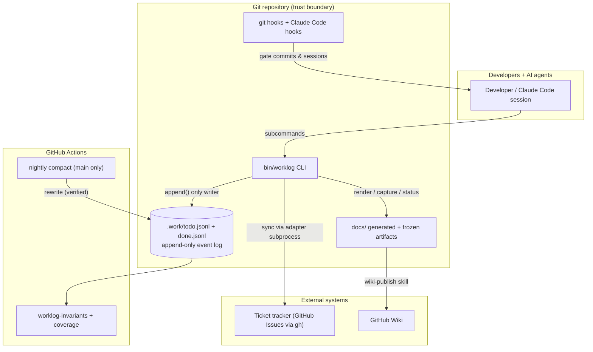
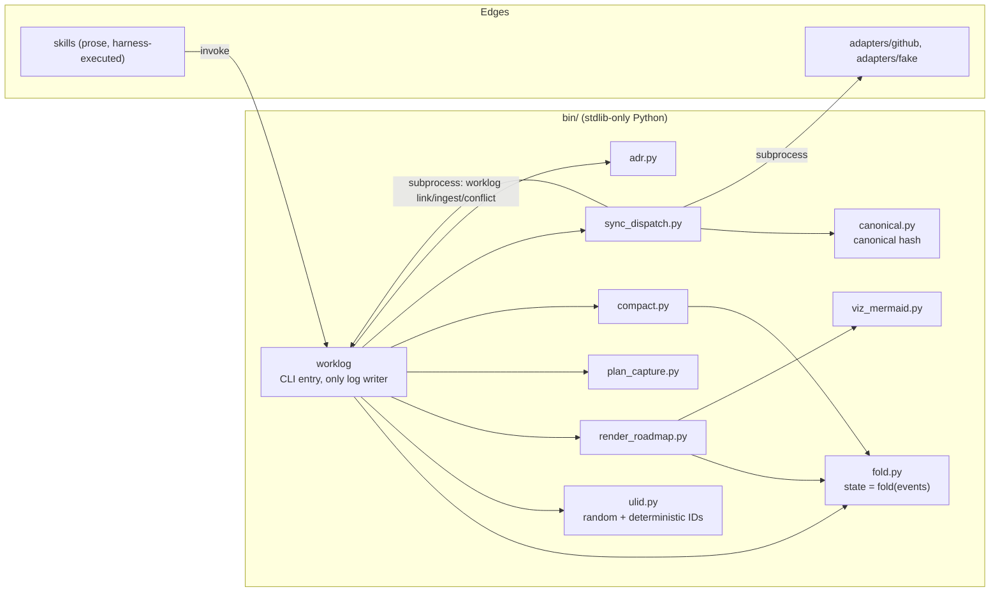
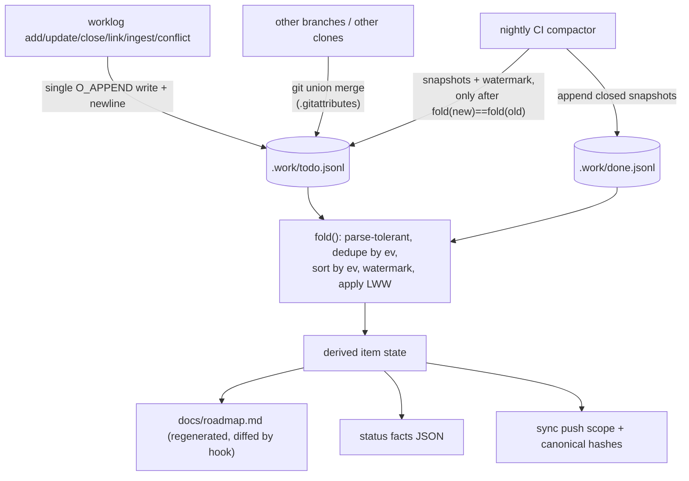
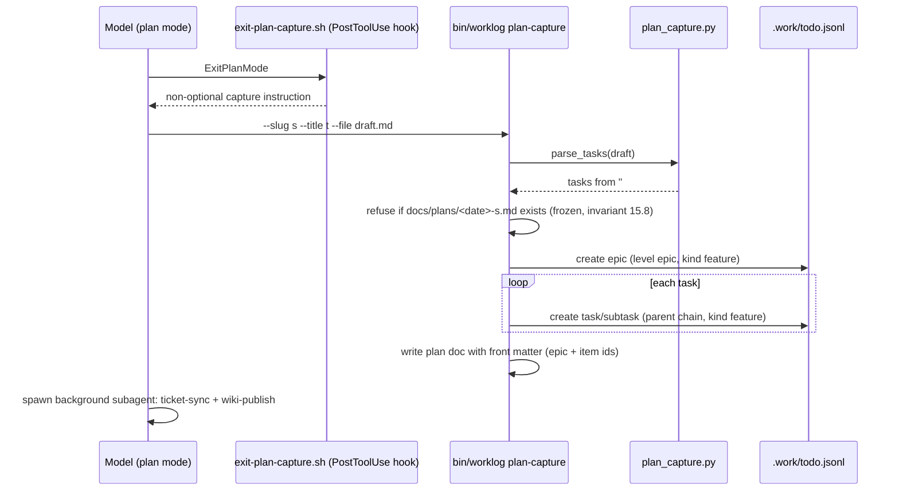
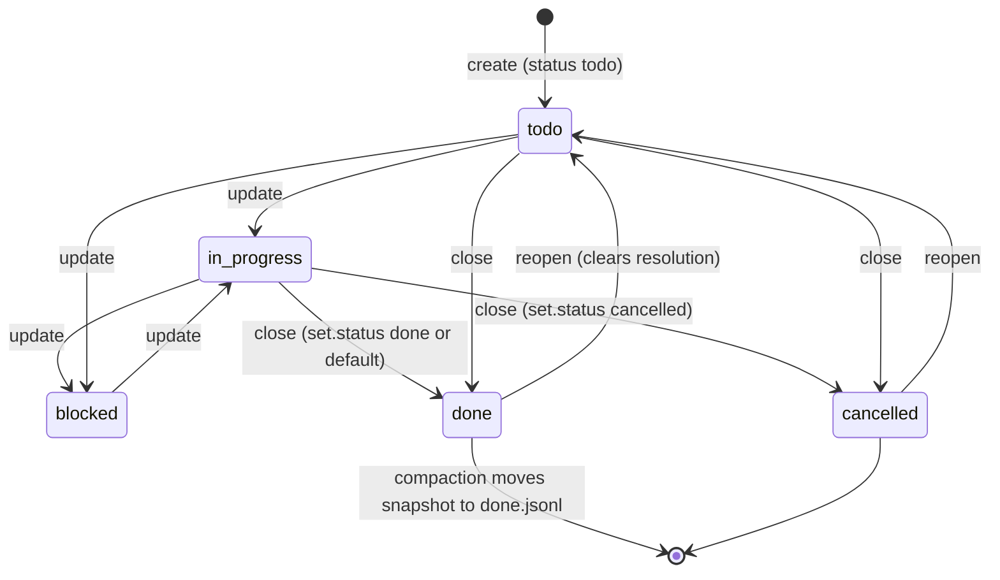
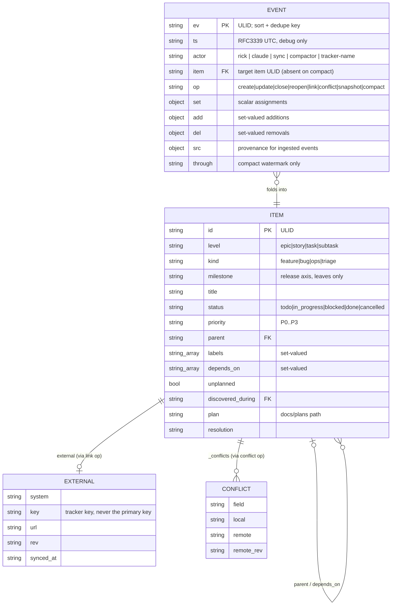
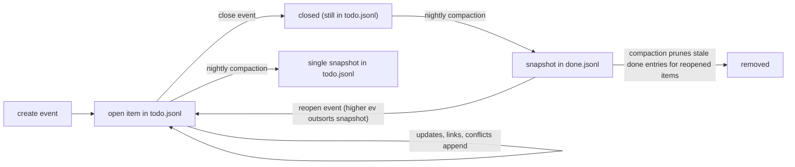

# Worklog — Software Design Document

# 1. Document Overview

**Purpose.** Describe the design of *worklog*, a local-first, git-native work-tracking
layer for agentic coding, as actually implemented in this repository at v0.11.0.

**Audience.** Junior developers who need implementation-level guidance; project
managers who need scope, dependencies, risks, and behavior.

**Scope.** The `bin/` CLI and its Python modules, the append-only event log under
`.work/`, the git hooks, the typed adapter contract and shipped adapters, the
Claude Code plugin packaging, GitHub Actions CI, and the generated/frozen document
artifacts under `docs/`.

**Out of scope.** The prose content of individual skills (`plugin/skills/*`,
`.claude/skills/*`) beyond their contracts with the deterministic core; the harness
(Claude Code) itself.

**Related documents.** `docs/worklog-spec.md` (v1.8, the normative spec),
`docs/adr/0001..0003` (Architecture Decision Records), `docs/plans/` (nine dated
plan documents — the *why* record), `adapters/README.md` (adapter authoring rules),
`docs/user_guide/` (task-oriented guides), and the companion
`docs/designs/current_code_walkthrough.md`.

**Definitions.**

| Term | Meaning |
|---|---|
| ULID | Universally Unique Lexicographically Sortable Identifier: 48-bit ms timestamp + 80-bit entropy, Crockford base32, 26 chars. Lexicographic sort == time sort. |
| Fold | Deriving item state by replaying the event log in `ev` order (`bin/fold.py`). |
| Compaction | The only file rewrite: replaces folded history with `snapshot` events plus a `compact` watermark (`bin/compact.py`). |
| Canonical hash | `sha256(canonical_json(HASH_FIELDS))[:16]` (`bin/canonical.py`) — the sync change-detector. |
| Marker | The `worklog:<ULID>` token embedded in every pushed ticket body; the idempotency key. |
| Adapter | A single executable translating canonical JSON to one tracker's CLI; dumb by contract. |
| Skill | Prose instructions the harness model executes; the non-deterministic edge of the system. |
| LWW | Last-writer-wins, per field, ordered by `ev`. |

**Assumptions** are labeled **Assumption**; unverified points are **Open Question**;
everything else in this document is **Confirmed** against the repository at the
commit in the frontmatter.

# 2. Executive Summary

Worklog makes work-in-progress visible without a server. Work items live as an
append-only JSONL event log inside the repository (`.work/todo.jsonl`,
`.work/done.jsonl`); every derived artifact — the roadmap, status reports, Mermaid
visualizations, ticket pushes, wiki pages — is computed from that log. Three
properties drive the design (spec §1): visible WIP, plans produce tickets, and a
generic core with pluggable edges.

Main workflows:

- **Track work**: `worklog add/update/close` appends events; `worklog list/show/fold`
  reads derived state.
- **Capture plans**: exiting plan mode triggers a hook that forces
  `worklog plan-capture`, which writes a frozen plan document and creates an epic
  plus its tasks in one pass.
- **Generate the roadmap**: `worklog roadmap-render` is a pure function of the log;
  a pre-commit hook regenerates and diffs it, so a stale or hand-edited roadmap
  cannot be committed.
- **Sync tickets**: `worklog sync` drives a typed dispatcher
  (`bin/sync_dispatch.py`) that pushes/pulls through a per-tracker adapter
  executable, with idempotency, echo suppression, and conflict recording enforced
  in the dispatcher, never in adapters.
- **Report status**: `worklog status --emit-facts` produces deterministic facts;
  a skill writes the prose; `worklog status --write` freezes the report.

Major components: the `worklog` CLI (the API), `fold.py` (state derivation),
`compact.py` (the only rewriter, CI-only), `render_roadmap.py` + `viz_mermaid.py`
(generated docs), `sync_dispatch.py` + `adapters/` (ticket sync),
`adr.py`/`plan_capture.py`/`canonical.py`/`ulid.py` (support modules), git hooks,
GitHub Actions, and the Claude Code plugin.

External dependencies: git (union merge), the `gh` CLI (GitHub adapter and
merge-when-green), Python 3 stdlib only — **zero third-party runtime dependencies**
(Confirmed: no requirements file; `tests/` use stdlib `unittest`).

Primary risks: hosted platforms don't run merge drivers server-side (PR-level
conflicts on the log), wall-clock LWW ties, and compaction as the single
state-rewriting operation (mitigated by fold-equality verification).

# 3. Requirements Summary

Functional requirements (Confirmed, from spec §2 and the implementation):

| # | Requirement | Component |
|---|---|---|
| R1 | Append-only, mergeable event log of work items | `bin/worklog — append()`, `.gitattributes` union merge |
| R2 | Deterministic state derivation from the log | `bin/fold.py — fold()` |
| R3 | Generated, CI-guarded roadmap | `bin/render_roadmap.py`, `hooks/pre-commit` lines 50–61 |
| R4 | Plan capture: plan doc + epic + tasks in one operation | `bin/worklog — cmd_plan_capture()`, `bin/plan_capture.py` |
| R5 | Idempotent bidirectional ticket sync | `bin/sync_dispatch.py`, `bin/canonical.py`, `adapters/*` |
| R6 | Deterministic ingestion of remote changes | `bin/ulid.py — deterministic()`, `bin/worklog — cmd_ingest()` |
| R7 | Conflict recording, never silent overwrite | `cmd_conflict()`, `fold._apply_mutations()` conflict clearing |
| R8 | Log compaction preserving fold equality | `bin/compact.py — compact()`, `.github/workflows/compact.yml` |
| R9 | Frozen status reports with deterministic facts | `bin/worklog — cmd_status()`, `_status_facts()` |
| R10 | Work taxonomy (level/kind/milestone) with write-time validation | `check_taxonomy()`, `fold._normalize_taxonomy()`, `hooks/pre-commit` lines 30–45 |
| R11 | Wiki publish ledger with stable page identity | `_register_published()`, `.work/published.json` |
| R12 | ADRs with once-written bodies and supersede chains | `bin/adr.py`, `worklog adr new|list|check` |
| R13 | Green-gates merging, never bypassed | `plugin/scripts/merge-when-green.sh`, ADR-0003 |

Non-functional: no runtime dependencies beyond Python 3 + git; appends atomic under
`PIPE_BUF` (body capped at `MAX_BODY = 2048`, `bin/worklog` line 31); corrupt input
never fatal (`fold.read_lines()`); CI coverage floor ≥80% on `bin/*.py`
(`.github/workflows/worklog.yml`, `--fail-under=80`), target 95%; local-only
degradation when edge tooling is missing (spec invariant 15.10).

Availability/scalability: single-repo, single-team scale by design; compaction
bounds log growth (spec §7 trigger: nightly or >5000 lines). Disaster recovery is
git itself: the log is committed history.

# 4. System Context

Actors: developers and AI agents (writers via the CLI), the compactor (CI), the
sync actor, remote trackers, the wiki, and readers (PMs reading generated docs).
Trust boundary: everything inside the repo is trusted; adapters and `gh` cross the
network boundary; skills run in the harness model.



*How to read it:* every state change funnels through the CLI into the log; CI and
hooks are gates, not writers (except the nightly compactor). The tracker and wiki
are mirrors — the log is the source of truth (spec §2 non-goals).

Inputs: CLI invocations, adapter pull output (NDJSON), plan drafts, status prose on
stdin. Outputs: log events, `docs/roadmap.md`, `docs/plans/*`, `docs/status/*`,
`docs/adr/*`, ticket pushes, `sync report` lines.

# 5. High-Level Architecture

Layers, all Confirmed from imports:

- **Identity**: `ulid.py` (no imports from siblings).
- **State**: `fold.py` (imports `hashlib`, `json` only).
- **CLI/API**: `bin/worklog` imports `ulid`, `fold`; lazily imports
  `render_roadmap`, `plan_capture`, `compact`, `sync_dispatch`, `adr`.
- **Rendering**: `render_roadmap.py` imports `ulid`, `fold`; `viz_mermaid.py`
  imports `ulid`, `fold` and is imported lazily by `render_roadmap.render()`
  (lines 224–230).
- **Sync**: `sync_dispatch.py` imports `canonical`; drives adapters and the CLI
  as subprocesses.
- **Automation**: `hooks/` (git + Claude Code), `.github/workflows/`,
  `plugin/` (packaged copies of the same scripts).



*How to read it:* arrows are imports or subprocess calls. Note the loop
`SD → WL`: the dispatcher never appends to the log directly; it shells back into
`worklog` (invariant 15.4, `sync_dispatch.py — Dispatcher.worklog(), lines 177–187`).

**Data flow of the event log:**



*Assumptions/failure behavior:* union merge duplicates and scrambles lines — the
fold's dedupe/sort absorbs that; a corrupt line costs itself only
(`fold.read_lines()`, lines 82–116).

Deployment architecture is §27; trust boundaries §22.

# 6. Architectural Decisions

The repo keeps ADRs in `docs/adr/`; this section summarizes and links (per ADR
tooling, `bin/adr.py`).

**ADR-0001 — Append-only event log + fold + union merge** (accepted).
State is never stored; it is a fold over immutable events, merged by git's
built-in union driver. Alternatives rejected: state files (merge conflicts clobber
teammates), CRDTs (correct but heavy). Consequences absorbed: arbitrary post-merge
line order and duplicates (fold sorts/dedupes), wall-clock LWW ties, and the
hosted-platform caveat (GitHub does not run merge drivers server-side — spec §8.1).

**ADR-0002 — Skill-based edges hardened by a typed adapter contract** (accepted).
The 1.2 spec's per-system adapter binaries never shipped; v1.4 moved integration to
skills (the model already knows these systems); v1.6 restored the three invariants
that had regressed to prose — idempotency, pull parsing, capability degradation —
as code in the dispatcher, with adapters kept as generated dumb translators.
`tests/test_adapter_contract.py — test_adapters_contain_no_invariant_logic()`
(lines 168–179) bans `sha256`, `last_pushed_hash`, `canonical_json`, `search`, and
`sync-state` from every adapter source.

**ADR-0003 — Green-gates merging** (accepted). PRs merge only when every check is
green; `merge-when-green.sh` polls (default 300 s, 24 attempts) and treats "no
gates reporting" as *not* passing (exit 4 timeout). Never `--admin`.

Decisions not (yet) in ADRs, recorded in plans/spec:

| Decision | Rationale | Where |
|---|---|---|
| Deterministic ULIDs for ingested events | Two clones polling the same remote change must append byte-identical lines so dedupe collapses them; a random `ev` silently reverts local edits | `bin/ulid.py — deterministic(), lines 49–58`; spec §10.2; `tests/test_ulid.py — TestTheBugThisPrevents` |
| Canonical hash over exactly ten fields | Echo suppression and skip-unchanged; changing the field set churns every hash (accepted once, in the taxonomy migration) | `bin/canonical.py — HASH_FIELDS, lines 17–18` |
| Config/policy split, `AGENTS.md → CLAUDE.md` symlink | One policy for every harness; scripts read only `.work/config.yml` | spec §4.1 |
| No YAML library | Stdlib-only; naive block scans where needed | `bin/worklog — _config_system(), lines 700–719`; `merge-when-green.sh` awk scan |
| Embedded schemas mirrored from `schema/` | Installed repos ship `bin/` without `schema/`; tests assert the copies match | `sync_dispatch.py — CAPABILITIES_SCHEMA, lines 34–65`; `tests/test_dispatch.py — test_embedded_capabilities_schema_matches_file()` |
| Body cap is a constant, not a setting | Derived from `PIPE_BUF`; "a knob whose only valid value is the default is a trap" | `.work/config.yml` trailing comment; `bin/worklog` line 31 |
| Frozen artifacts (plans, snapshots, status, ADR bodies) | Documents people acted on are history, not caches | spec §13.2–13.3; `cmd_roadmap_snapshot()` refusal, `cmd_status()` `--force` gate, `adr.py — mark_superseded()` |
| Hooks, not hope | "A CLAUDE.md instruction holds maybe 80% of the time. A hook holds 100%." | spec §12; `hooks/exit-plan-capture.sh` |

Conditions to revisit: a Lamport counter if clock-skew LWW ever bites (spec §16);
`external` as an array if multi-tracker is needed.

# 7. Component Inventory

| Component | Type | Responsibility | Inputs | Outputs | Depends on | Failure impact |
|---|---|---|---|---|---|---|
| `bin/worklog` | CLI (942 lines) | All log writes; every subcommand | argv, stdin (status prose, plan drafts) | log events, docs, stdout | `ulid`, `fold`, lazy others | no writes possible |
| `bin/fold.py` | Library | Derive state; the only interpreter of the log | log paths | `FoldResult` | stdlib | everything downstream |
| `bin/ulid.py` | Library | Random + deterministic ULIDs | time/entropy or (system,key,rev,ts) | 26-char IDs | stdlib | ordering/idempotency |
| `bin/canonical.py` | Library | Canonical JSON + 16-hex hash | item dict | hash | stdlib | echo suppression |
| `bin/render_roadmap.py` | Generator | Byte-deterministic roadmap | log | markdown | `fold`, `ulid`, `viz_mermaid` | roadmap staleness gate |
| `bin/viz_mermaid.py` | Generator | Deps/hierarchy/gantt diagrams, 40-node cap | `FoldResult`, log paths | mermaid blocks | `fold`, `ulid` | cosmetic |
| `bin/plan_capture.py` | Library | Parse `## Tasks` checkboxes; plan front matter | draft text | task list, front matter | stdlib | plan capture |
| `bin/compact.py` | Batch (CI) | The only file rewriter; verified | log files | rewritten logs | `fold`, `ulid`, `render_roadmap.max_ev` | worst-case: refused, files untouched |
| `bin/sync_dispatch.py` | Orchestrator | Every sync invariant | fold output, adapter I/O | pushes, ingests, conflicts, report | `canonical`, adapter, `worklog` | sync only; local-only fallback |
| `bin/adr.py` | Library | ADR parse/validate/scaffold/supersede | `docs/adr/*.md` | problems list, scaffolds | stdlib | ADR gate |
| `adapters/github/adapter` | Executable | GitHub translation via `gh` | verb + JSON | JSON/NDJSON, exit codes 0–5 | `gh` CLI | GitHub sync |
| `adapters/fake/adapter` | Test double | Contract-faithful local tracker | verb + JSON | JSON, state file | stdlib | CI sync tests |
| `hooks/pre-commit`, `pre-merge-commit` | Git hooks | Newline/schema/taxonomy/roadmap/ADR gates | staged tree | pass/fail | python3 | invariants unenforced locally |
| `hooks/*.sh` (4) | Claude Code hooks | Session policy: capture, reminder, stop-gate, doctor | hook JSON | hook JSON | git, python3 | policy drift |
| `plugin/` | Package | Skills, `/worklog:*` commands, hook wiring, script copies | — | — | mirrors `bin/`, `hooks/` | plugin installs |
| `.github/workflows/worklog.yml` | CI | Invariants + tests + coverage ≥80% | push/PR | pass/fail | python3, coverage | merge gate |
| `.github/workflows/compact.yml` | CI | Nightly compaction, own commit | schedule | compact commit | `compact.py` | log growth only |

Owner for all components: the repo (single-team). Scaling model: none needed —
per-repo files.

# 8. End-to-End Workflows

## 8.1 Track a work item

Trigger: any request that produces work (enforced by
`hooks/prompt-reminder.sh` and the Stop gate in `hooks/stop-worklog-check.sh`,
which **blocks** ending a session where the tree changed but `todo.jsonl` did not,
line 42). Main flow: `cmd_add()` (lines 81–105) validates taxonomy
(`check_taxonomy()`, lines 70–79: epics are feature/ops only; milestone lives on
leaves), builds a `create` event whose `set` omits `kind` when not given — so the
fold triages it (§9.2 below) — and appends. Failure flows: `--unplanned` without
`--discovered-during` exits (line 82–83); body >2048 B exits
(`append()`, lines 42–43). Idempotency: not needed — each add is a new ULID.

## 8.2 Plan capture



Confirmed in `cmd_plan_capture()` (lines 309–349): indented checkboxes become
subtasks parented to the preceding task (`last_task`, lines 329–342); captured
items get explicit `kind:feature` ("a plan is deliberate feature work", line 322
comment). Priority token `(P0..P3)` optional, default P2
(`plan_capture.py — TASK_RE, line 18`).

## 8.3 Ticket sync

```mermaid
sequenceDiagram
    participant S as ticket-sync skill
    participant D as sync_dispatch.Dispatcher
    participant A as adapter (subprocess)
    participant T as tracker
    participant W as bin/worklog
    S->>D: worklog sync
    D->>A: capabilities
    A-->>D: JSON (schema-validated; marker template must contain {ulid})
    Note over D: gate: ContractError aborts before any push
    D->>W: fold (subprocess)
    W-->>D: items JSON
    loop each in-scope item (open OR hash-dirty OR --keys)
        D->>D: outbound(): HASH_FIELDS + type degrade; canonical_hash
        alt hash == last_pushed_hash and not forced
            D->>D: skip (idempotent)
        else create/update
            D->>A: push {op, key, marker, item} (retry x3 on exit 4)
            A->>T: gh issue create/edit
            A-->>D: {key, url, rev}
            D->>W: link <ulid> --system --key --url --rev (create only)
            D->>D: last_pushed_hash = hash
        else closed with key
            D->>A: close <key> <resolution>
        end
    end
    D->>A: pull --since <cursor>
    A-->>D: NDJSON lines
    loop each line
        alt canonical_hash(line) == last_pushed_hash
            D->>D: drop (echo of our own push)
        else only remote moved
            D->>W: ingest <ulid> --system --key --rev --rev-ts-ms --set f=v
            Note over W: deterministic ev = ULID(rev_ts, sha256(system|key|rev))
        else both sides moved
            D->>W: conflict <ulid> --field f --local --remote --remote-rev
        end
    end
    D-->>S: sync report: created=..updated=..conflicts=.. + drift list
```

Failure flows (Confirmed, `handle_exit()`, lines 245–268): exit 2 aborts the whole
sync ("re-authenticate"); exit 3 clears `last_pushed_hash` for re-push next run;
exit 4 retries with doubling backoff then defers; exit 5 fetches the remote and
records per-field conflicts; anything else is drift, continue. No adapter
configured → `LOCAL_ONLY` message, exit 0 (`main()`, lines 493–496): a mode, not
an error. Orphan/titleless items are never pushed (`push_items()`, lines 299–303).

## 8.4 Compaction (nightly, main only)

Trigger: cron `17 7 * * *` (`.github/workflows/compact.yml`). Flow:
refuse if logs have uncommitted changes (`_git_refuses()`); watermark = max raw
`ev`; skip if todo is already all snapshots; partition open/closed (orphans stay
open — "never drop data", `compact()` lines 144–150); write temp files; verify
`fold(new) == fold(old)` plus trailing newline plus every line parses
(`_verify()`, lines 99–123); only then `os.replace`. CI commits it as its own
commit `chore(worklog): compact through <ulid>`.

## 8.5 Status reports

`cmd_status()` (lines 649–681): `--emit-facts` prints deterministic JSON facts
(windowed by ULID timestamps, `_status_window()` lines 499–523); the
status-report skill writes prose; `--write` wraps it in front matter carrying the
window and `through` watermark and refuses to overwrite an existing report without
`--force` (frozen, invariant 15.9). Timecards bucket per UTC day and include
best-effort git commit subjects (`_git_commits()`, lines 484–496).

## 8.6 Green-gates merge

`merge-when-green.sh`: poll `gh pr checks` buckets; fail/cancel → exit 1 (never
merge); empty or pending → sleep and retry up to 24×300 s; all green → merge (or
advisory print when `features.auto_merge_on_green: false` or `--advisory`);
timeout → exit 4. "No gates reporting is not gates passing" (ADR-0003).

# 9. Complex Business Logic

## 9.1 The fold

Plain language: read every line of both logs, drop what doesn't parse, keep one
copy of each event, replay them oldest-first, and let the last write to each field
win. Formal rules (Confirmed, `bin/fold.py — fold(), lines 189–247`):

1. Order is by `ev`, never file position, never `ts`; ties break on
   `(actor, sha256(line))` so every machine folds identically
   (`dedupe_and_sort()`, lines 119–141).
2. Events at or below the compact watermark are dropped, **except** `snapshot`
   (`apply_watermark()`, lines 144–157).
3. `snapshot` replaces state entirely; a duplicate `create` degrades to an update.
4. Mutation order within an event: `del`, then `add`, then `set`
   (`_apply_mutations()`, lines 160–186).
5. `close` takes status from `set`; only a missing/open status defaults to `done`
   — a `cancelled` item must never report as shipped (lines 229–235).
6. `reopen` clears closed status and `resolution` (lines 237–242).
7. `conflict` appends to `item._conflicts` and changes no state; **any later
   event writing that field clears the conflict** (lines 177–186).
8. Events for unknown items become `_orphan` partial items — reported, never
   invented, never fatal (lines 217–221).
9. Taxonomy is normalized leniently on create/snapshot: legacy `type` maps via
   `LEGACY_TYPE_MAP` (lines 37–43); a create with neither type nor kind folds to
   `kind:triage` (`_normalize_taxonomy()`, lines 46–56). Hard validation lives at
   write time and in the hooks — the fold never crashes on a bad pair.

## 9.2 Item lifecycle



*Note:* transitions are not machine-restricted — any `update` may set any of the
three open statuses (`cmd_update` choices, line 825); the diagram shows the
intended flow. Closed→open goes only through `reopen` (an op the fold supports;
see §14 for the CLI gap). Compaction relocates closed items physically; `close`
itself never moves files (spec §7).

## 9.3 Conflict lifecycle decision table

| Local changed since last push | Remote changed | Dispatcher action | Cited |
|---|---|---|---|
| no | no | skip (hash equal) | `pull()`, line 413–414 |
| no | yes | `worklog ingest` (deterministic `ev`) | lines 438–445 |
| yes | no | push (hash dirty) | `push_items()`, lines 307–316 |
| yes | yes | `worklog conflict` per changed field; never overwrite | lines 423–437 |

Resolution: `worklog resolve <item> --field F --take local|remote` appends a plain
`update` that outsorts the conflict (`cmd_resolve()`, lines 208–225).

## 9.4 Roadmap sectioning

`section()` (`render_roadmap.py`, lines 78–85): **Now** = P0 or `in_progress`;
**Next** = P1, or unblocked P2; **Later** = the rest. Epic milestone is derived
from children — unanimous value or the literal string `mixed`
(`derived_milestone()`, lines 103–108) — and shown for Now/Next only.

# 10. Domain Model

Two record shapes: the **event** (what is stored) and the **item** (what the fold
derives). There are no classes for them — plain dicts, deliberately
(shell-debuggable format, ADR-0001).



Invariants: the ULID is the primary key, never `external.key` (spec §5.4); an epic
is just an item with `level: epic` — there is no epic table; `unplanned: true`
requires `discovered_during` (write-time, `cmd_add()` lines 82–83); private
`_`-prefixed fields (`_orphan`, `_conflicts`, `_line`) never survive into
snapshots (`compact._public()`, lines 39–42).

# 11. Module-by-Module Design

| Module | Public surface | Error handling | Testing |
|---|---|---|---|
| `bin/worklog` | argparse subcommands (§14) | `sys.exit(str)` with actionable messages; validation before any write | `test_taxonomy`, `test_ingest`, `test_link`, `test_status`, `test_snapshot`, `test_plugin` |
| `fold.py` | `fold(paths)`, `FoldResult`, `read_lines`, `dedupe_and_sort`, `OPEN/CLOSED_STATUSES`, `LEGACY_TYPE_MAP` | never raises on bad data; errors collected in `result.errors` | `test_fold` (23 tests) |
| `ulid.py` | `new()`, `deterministic()`, `encode()`, `timestamp_ms()` | `ValueError` on bad entropy/timestamp | `test_ulid` (11) |
| `canonical.py` | `HASH_FIELDS`, `canonical_json()`, `canonical_hash()` | none needed (pure) | via `test_dispatch` |
| `render_roadmap.py` | `render()`, `max_ev()`, `root_epic_id()` | lenient raw scans | `test_render_roadmap` |
| `viz_mermaid.py` | `render_viz()`, `deps_graph()`, `hierarchy()`, `gantt()`, `item_dates()` | skips unparseable, strips mermaid-breaking chars (`_safe()`, line 25) | `test_viz` |
| `plan_capture.py` | `parse_tasks()`, `front_matter()` | pure; no I/O | `test_plan_capture` |
| `compact.py` | `compact()` | `SystemExit(1)` on refusal/verify-failure; temp files deleted | `test_compact` |
| `sync_dispatch.py` | `Dispatcher`, `validate()`, `ContractError`, `main()` | exit-code taxonomy §3.6; drift notes over exceptions | `test_dispatch`, `test_adapter_contract` |
| `adr.py` | `check_all()`, `scaffold()`, `mark_superseded()`, `parse_front_matter()` | `ValueError` per file; listing stays best-effort | `test_adr` |

Coupling notes (Confirmed): no circular imports; `viz_mermaid` is lazily imported
so `--viz none` costs nothing; `adr.validate` is a **deliberate copy** of
`sync_dispatch.validate` ("no import coupling", `adr.py` lines 48–50), as is the
test suite's copy — three copies of a 28-line validator is the accepted price of
independent evolution. **Recommendation:** if a fourth copy appears, extract a
module. `plugin/scripts/` mirrors `bin/` and `hooks/`; `tests/test_plugin.py`
guards the mirror and the version lockstep (`bin/worklog` line 32:
`VERSION = "0.11.0"` "kept in step with plugin/.claude-plugin/plugin.json by
tests/test_plugin.py").

# 13. Class-by-Class Design

Only three classes exist (the design favors functions over objects):

**`fold.FoldResult`** (lines 59–79). State container: `items` (id → dict),
`watermark`, `errors`, `orphans`, `skipped`, `deduped`. Methods `open_items()`,
`closed_items()`, `conflicts()` — pure filters. No concurrency concerns (built and
consumed in-process).

**`sync_dispatch.Dispatcher`** (lines 133–472). Constructor:
`(adapter, retry_base_delay=0.5, dry_run=False)`; loads `.work/sync-state.json`.
Public methods: `capabilities()` (the gate — schema-validate plus the `{ulid}`
substring check the mini-validator cannot express, lines 197–208), `sync()`
(capabilities → push → pull → save state → report), `push_items()`, `pull()`,
`report()`. State managed: per-item `last_pushed_hash`, per-system `cursors`,
counters, drift list. Side effects: subprocesses only (`run_adapter()`,
`worklog()`); in `dry_run` the state file is never written (`_save_state()`,
lines 154–159). Exceptions: `ContractError` — caught in `main()` and reported as
exit 1.

**`sync_dispatch.ContractError`** (lines 68–69). "An adapter broke the typed
contract; the message names the field."

# 14. API Design

The CLI **is** the API. Global flags: `--actor` (defaults to `$USER`),
`--version`. All writes go through `append()` — a single `O_APPEND` write,
newline-terminated, self-healing a missing prior newline (lines 35–58).

| Subcommand | Purpose | Key arguments | Writes | Notable exits |
|---|---|---|---|---|
| `add <title>` | create item | `--level` (default task), `--kind` (omitted → folds to triage), `--milestone`, `--priority`, `--parent`, `--plan`, `--labels`, `--unplanned --discovered-during`, deprecated `--type` | 1 create event | taxonomy violations; unplanned without discovered-during |
| `update <item>` | mutate | `--status todo\|in_progress\|blocked`, `--priority`, `--title`, `--kind`, `--milestone`, `--add-label`, `--del-label` | 1 update event | "nothing to update"; taxonomy re-checked against current level (lines 116–119) |
| `close <item>` | close | `--status done\|cancelled`, `--resolution` | 1 close event | — |
| `link <item>` | record external identity | `--system --key` required; `--url --rev --hash` | 1 link event | — |
| `ingest <item>` | ingest remote change | `--system --key --rev --rev-ts-ms` required; `--set FIELD=VALUE`, label flags | 1 update event, deterministic `ev`, `ts` = remote clock | field/enum whitelist (lines 174–185) |
| `conflict <item>` | record both-sides change | `--field --local --remote --remote-rev` | 1 conflict event | — |
| `resolve <item>` | clear a conflict | `--field --take local\|remote` | 1 update event | no open conflict on field |
| `list` / `show` / `fold` | read state | `--all`; prefix match on `show` | none | — |
| `plan-capture` | plan doc + epic + tasks | `--slug --title` required, `--file`, `--priority` | N create events + plan doc | existing path refused (frozen) |
| `roadmap-render` | regenerate roadmap | `--viz deps,hierarchy` (default), `--no-viz` | `docs/roadmap.md` | — |
| `roadmap-snapshot` | freeze roadmap copy | `--name` | `docs/roadmap/<date>_<name>.md` | existing path refused |
| `status` | report facts/write | `--kind daily\|weekly\|timecard` required; `--emit-facts` / `--write` / `--dry-run` / `--force`; `--since --until` | `docs/status/<date>-<kind>.md` | existing report refused without `--force` |
| `sync` | run dispatcher | `--dry-run`, `--keys`, `--push-only`/`--pull-only`, `--retry-base-delay` | via dispatcher | dispatcher exit code |
| `adapter init\|check` | guidance / contract check | optional path | `.work/sync-state.json` `adapter_path` | contract violations |
| `promote <suggestion_id>` | classifier suggestion → 1 create | — | 1 create event + consumed marker in suggestions.jsonl | already consumed / not found |
| `compact` | manual compaction | `--yes` required | rewrites logs (verified) | refuses without `--yes` |
| `wiki-add <file>` | register in publish ledger | `--key --title` required | `.work/published.json` | file not found |
| `adr new\|list\|check` | ADR lifecycle | `new <title>` with `--status --deciders --tags --supersedes N` | `docs/adr/NNNN-slug.md` + ledger entry | check exits 1 with problem list |

Versioning/back-compat: `--type` survives as a deprecated alias mapping through
the same `LEGACY_TYPE_MAP` as the fold (`cmd_add()`, lines 84–89); pre-1.7 events
are normalized on read and migrated physically at the next compaction.

**Gap (Confirmed):** the fold supports a `reopen` op (`fold.py`, lines 237–242)
but no `worklog reopen` subcommand exists; spec §10.5's `--scope active|all`,
`--report`, and `--apply` sync flags are likewise not implemented (the shipped
scope is open ∪ hash-dirty ∪ `--keys`). See §34.

# 15. Database Design

**The event log is the database.** Type: append-only JSONL, two files.
Ownership: `bin/worklog — append()` is the only runtime writer (invariant 15.4);
`compact.py` is the only rewriter (15.2). Connection strategy: `O_APPEND` file
descriptor per write; atomicity guaranteed for lines under `PIPE_BUF` — hence the
2048-byte body cap. Transaction model: one event per write; there are no
multi-event transactions, deliberately — no runtime command writes two files
(spec §7, "removes the write-conflict from the parallel-subagent phase").

Record types (see §10 for shapes): `create`, `update`, `close`, `reopen`, `link`,
`conflict` (append-time), `snapshot`, `compact` (compactor only). Indexing: none —
the fold is a full scan; ULID sort order substitutes for a time index.
Replication: git push/pull. Concurrent updates: union merge
(`.gitattributes`: `.work/todo.jsonl merge=union`, `.work/done.jsonl merge=union`)
plus fold dedupe/sort. Backup and recovery: git history.

Migration strategy: schema evolution rides the fold's leniency — the taxonomy
migration (`docs/migrations/0001-type-split.md`) normalizes on read and lets the
nightly compaction rewrite snapshots physically, with a one-time canonical-hash
churn accepted (`canonical.py`, lines 13–16 comment).

Retention: `done.jsonl` holds closed history forever; compaction prunes only
stale entries for currently-open items (step 6, `compact()` lines 158–168).
Sensitive data: none by design — titles/bodies are work descriptions; no secrets
(Confirmed: no credential fields anywhere in the schema).

Duplicate prevention: dedupe by `ev`. Failed-write recovery: `append()`'s
self-heal covers the fused-line hazard; the pre-commit hook is the second layer;
a fused line that gets past both costs exactly its own events
(`tests/test_integration.py — test_a_fused_line_costs_exactly_its_own_events()`).

Ancillary stores (plain JSON, not event logs — direct load/dump sanctioned):

| File | Committed | Purpose | Writer |
|---|---|---|---|
| `.work/config.yml` | yes | all machine-readable settings | humans |
| `.work/published.json` | yes | wiki page identity ledger (key → source/title/url/rev/source_hash) | `_register_published()`, wiki-publish skill |
| `.work/sync-state.json` | **gitignored** | per-clone `last_pushed_hash`, cursors, `adapter_path` | `Dispatcher._save_state()`, `cmd_adapter()` |
| `.work/suggestions.jsonl` | gitignored | classifier staging (propose-only) | classify skill; `cmd_promote()` appends consumed markers |

**Data lifecycle:**



# 20. External Service Integrations

**Ticket trackers via the typed adapter contract.** Protocol: JSON over
stdin/stdout to a subprocess, one call per verb (`capabilities`, `push`, `pull`,
`get`, `close`). Authentication: the adapter's own tooling (`gh auth` for GitHub);
the dispatcher never holds credentials. Timeouts: none imposed by the dispatcher
(**Assumption:** acceptable because adapters wrap CLIs with their own timeouts).
Retries: exit 4 → 3 retries with doubling backoff from `--retry-base-delay`
(`call_push()`, lines 232–243). Idempotency: marker `worklog:<ulid>` embedded in
every ticket body plus canonical-hash skip — `tests/test_dispatch.py —
test_push_twice_same_ulid_is_one_ticket()` proves two syncs create one ticket.
Error mapping: the exit-code table (`adapters/README.md`); the GitHub adapter maps
`gh` stderr text to codes (`classify()`, lines 47–58). Failure impact: sync only;
the log is never blocked. Sandbox support: `adapters/fake/adapter` — a full
contract double over a local JSON file, including injected failures
(`_fail_next`). Capability degradation: GitHub has no epic type
(`"types": {"epic": null, ...}`), so epics push as `story` if available else
`task`, with a drift note (`outbound()`, lines 212–228).

**GitHub PR merging** via `gh` in `merge-when-green.sh` (§8.6).

**Wiki publishing** is skill-driven (github-wiki configured in
`.work/config.yml`); the deterministic core contributes only the ledger
(`published.json`) and `worklog wiki-add`. Frozen rules at the edge: plans,
snapshots, and status reports publish once; the live roadmap republishes when
`source_hash` changes (spec §9.3).

**Azure DevOps** ships no adapter; field-tested caveats are recorded in
`adapters/README.md` (marker must be a tag, not an HTML comment — ADO strips
HTML comments; updates merge, never overwrite; migrate by pre-seeding `link`
events until `sync --dry-run` reports 0 creates).

# 22. Security Design

Threat surface is small by construction: no server, no listener, no stored
credentials. Confirmed controls:

| Threat | Component | Mitigation | Residual risk |
|---|---|---|---|
| Corrupt/hostile log line | fold | parse-tolerant skip; schema check in hook + CI | one line's events lost, reported |
| Hand edit corrupting the log | append path | self-heal + hook + merge hook + CI re-run ("A dev can `--no-verify` past the local hook; not this" — `worklog.yml` comment) | none observed |
| Adapter smuggling invariant logic | contract | banned-token scan `test_adapters_contain_no_invariant_logic()`; capabilities schema gate | new invariants must extend BANNED |
| Malicious/buggy adapter output | dispatcher | JSON parse + schema validation before any push; pull lines individually parsed, bad lines noted | adapter runs with user privileges (trusted code) |
| Credential leakage | adapters | credentials live in platform CLIs (`gh auth`), env for connection, never argv/log | env hygiene |
| Merge bypass | process | branch protection + merge-when-green never `--admin` (ADR-0003) | human override outside tooling |

Authorization: the git repository's own access control. Sensitive-data handling:
the log carries work metadata only; status/timecard reports name work, not
secrets. AI-specific: skills are propose-only where they touch state (classifier
writes gitignored `suggestions.jsonl`, never the log — spec §12), and the
dispatcher, not the model, performs all remote mutations during `worklog sync`.

# 23. Error Handling and Resilience

Error taxonomy, Confirmed:

- **Validation errors** (user-facing, non-retryable): `sys.exit` with a message
  naming the rule and often the spec section — e.g. "an epic cannot be kind:bug —
  epics are feature or ops (taxonomy §2.2)".
- **Data corruption** (infrastructure): never fatal on read (fold leniency);
  fatal-by-refusal on write paths (hook, compaction verify).
- **External-dependency errors**: adapter exit codes; retryable = 4 only; auth
  (2) aborts loudly; not-found (3) self-repairs by scheduling a re-push.
- **Contract errors**: `ContractError` names the offending field path
  (`validate()`, lines 83–110); the capabilities gate runs "first, every run,
  before any push" (line 195 comment).

Degradation ladder: no adapter → local-only, exit 0; adapter lacking `pull` →
drift note "local log may lag remote" (`pull()`, lines 373–375); unsupported
fields → drift note, never an error. Compensation: compaction's abort-and-delete
of temp files on any verification failure (`compact()`, lines 178–183). The
worst failure mode — compaction losing state — is gated by fold equality, "not
review" (ADR-0001).

# 24. Performance and Scalability

Confirmed characteristics: every read command folds the full log (O(n log n) in
event count); acceptable because compaction bounds n (nightly snapshots collapse
history; spec trigger: 5000 lines). Appends are O(1) single writes. The Mermaid
generator caps diagrams at `MAX_NODES = 40` with a "+K more" note
(`viz_mermaid.py — _select(), lines 76–80`) to keep the roadmap renderable.
Bottleneck if the system outgrows a team: the full-scan fold — **Recommendation:**
none needed now; a cached fold keyed on file mtimes would be the first lever.
Sync latency is dominated by tracker round-trips; retry backoff is bounded
(base 0.5 s ×2×2×2).

# 25. Observability

No metrics stack — observability is *artifacts*, Confirmed:

| Signal | Where | Producer |
|---|---|---|
| Sync outcome | `sync report: created=… conflicts=… deferred=…` + drift bullet list | `Dispatcher.report()`, lines 466–472 |
| Unresolved conflicts | roadmap **Needs attention**; `worklog list` stderr; `worklog show` | `render_roadmap.render()`, lines 213–222 |
| Orphans / corrupt lines | fold stderr warnings; roadmap Needs attention | `fold.main()`, lines 253–256 |
| Work-in-flight age | status report `in_progress` age_days | `_status_facts()`, lines 613–622 |
| Unplanned-work ratio | status "unplanned_in_window" with `discovered_during` attribution | `_status_facts()`, lines 604–610 |
| Version skew, missing hooks | SessionStart doctor context | `hooks/session-doctor.sh` |
| Compaction result | its own commit message `chore(worklog): compact through <ulid>` | `compact.yml` |

Every status report records the exact `through` watermark, making it
reproducible after the fact (spec §13.3).

# 26. Configuration and Secrets

Single config file, `.work/config.yml`, committed; policy prose lives in
`CLAUDE.md`/`AGENTS.md` and carries **no values scripts read** (spec §4.1).
Confirmed keys: `project`, `ticketing.system/project`, `wiki.system/root_url`,
`paths`, `status.*`, `sync.*` (`active_window_days`, `conflict_policy: report`,
`push_on_capture`), `features.auto_merge_on_green`, `release.sync_docs` (the list
that drives this very document at release time), `classifier.*` (off by default).
Readers parse it with naive block scans, no YAML library (`_config_system()`;
awk in `merge-when-green.sh`; sed in `stop-worklog-check.sh`).

Environment variables: `WORKLOG_TICKET_ADAPTER` (adapter path override),
`WORKLOG_TICKET_SYSTEM`/`WORKLOG_TICKET_PROJECT` (adapter connection),
`WORKLOG_FAKE_STATE` (fake adapter state path), `WORKLOG_AUTO_MERGE`,
`WORKLOG_STOP_SETTLE`. Secrets: none stored; platform CLIs own their auth.
Deliberately not configurable: the body cap (§6).

# 27. Deployment Architecture

There is no deployed service. "Deployment" is three widening circles, Confirmed:

1. **Repo scaffold** — `bin/`, `hooks/` (armed via
   `git config core.hooksPath hooks`), `.work/`, CI workflows; committed, so it
   works for teammates and harnesses without the plugin (README "Repo install").
2. **Claude Code plugin** — `plugin/` packages skills, `/worklog:*` commands,
   hook wiring (`plugin/hooks/hooks.json` maps PostToolUse:ExitPlanMode,
   UserPromptSubmit, Stop, SessionStart to the scripts), and canonical script
   copies; version `0.11.0` in `plugin/.claude-plugin/plugin.json` locked to
   `bin/worklog VERSION` by `tests/test_plugin.py`.
3. **CI** — `worklog.yml` (invariants job re-runs the pre-commit script, then
   unit + integration suites; coverage job with a subprocess-aware `.pth` hook
   and `--fail-under=80`) and `compact.yml` (nightly, main-only, own commit,
   `permissions: contents: write`).

Rollback: git revert; `/worklog:uninstall` removes tooling but never data
(README). Release flow: `release.sync_docs` in config lists the docs regenerated
by background agents at every release, including this design doc and the
walkthrough.

# 28. Testing Strategy

19 stdlib-`unittest` suites, no third-party test dependencies, run as
`for t in tests/test_*.py; do python3 "$t"; done` (README). Categories,
Confirmed:

- **Fold as executable spec**: `test_fold.py` — the four opening regressions each
  encode a real bug (file-order fold, close-assumes-done, ignored add/del,
  snapshot-merge), plus determinism across shuffles and corrupt-line tolerance
  (spec Appendix A).
- **Deterministic ingest**: `test_ulid.py — TestTheBugThisPrevents` — the pair
  where the "wrong design" test *passes and documents the silent revert*.
- **Sync invariants without network**: `test_dispatch.py` (idempotent double
  push, retry-no-duplicate, capabilities gate, degrade path, both-sides conflict,
  echo suppression, deterministic pull `ev`, schema-mirror equality, orphan
  skip) against `adapters/fake/adapter`; `test_adapter_contract.py` including the
  banned-token dumbness scan.
- **PR simulation**: `test_integration.py` builds throwaway git repos with real
  branches, union merges, and armed hooks (two-branch LWW/label-union merge,
  merge-order independence, newline block + repair cascade, stale roadmap blocked
  on merge commits, fused-line blast radius, two plan PRs merging cleanly).
- **Compaction safety**: `test_compact.py` (fold preserved, snapshots outsort
  watermark, reopen restores fields, stale done pruning, every line parses).
- **The rest**: taxonomy write rules, ingest whitelist, status facts, roadmap
  rendering, viz, plan capture, ADR invariants, merge-green, classifier promote,
  plugin mirror/version lockstep.

Coverage: CI gate ≥80% on `bin/*.py` (subprocess-aware via
`coverage.process_startup()` in a `.pth`), target 95%.

# 29. Local Development

Prerequisites: Python 3, git; `gh` only for GitHub sync/merge. Setup:
clone, then `git config core.hooksPath hooks` (arms the invariants). Run tests as
above. Try it: `bin/worklog add "task" --level task --kind feature`;
`bin/worklog roadmap-render`. Sync locally with no network:
`WORKLOG_TICKET_ADAPTER=$PWD/adapters/fake/adapter bin/worklog sync --dry-run`,
or validate an adapter with `bin/worklog adapter check` (round-trips the fake in a
throwaway state dir, `_fake_round_trip()`, lines 722–751). Common failure: a
commit rejected for a stale roadmap — run `bin/worklog roadmap-render` and
re-commit.

# 30. Operations and Support

| Incident | Diagnosis | Recovery |
|---|---|---|
| PR shows conflict on `todo.jsonl` in GitHub UI | hosted platforms skip merge drivers (spec §8.1) | merge base locally (union applies), `roadmap-render`, push, then merge |
| Compaction failed in CI | `compact: VERIFY FAILED for <id>` diff printed | logs untouched by design; fix the cause, rerun; never hand-edit |
| Sync aborts with auth failure | adapter exit 2 | re-auth with the tracker CLI, re-run; nothing was pushed after the failure |
| Duplicate wiki pages | `published.json` entry lost url/rev | restore ledger entry; `_register_published()` preserves url/rev on re-register for this reason |
| Conflict flood after upgrade | one-time hash churn (taxonomy migration) | expected; first sync re-pushes once, idempotent by marker |
| Stop hook blocks a finished session | tree changed with no todo event | record the item or state why none applies; transient checkout states settle via the 2 s recheck (`stop-worklog-check.sh`, lines 14–22) |

# 31. Risks, Tradeoffs, and Technical Debt

| Item | Description | Probability | Impact | Mitigation |
|---|---|---|---|---|
| Clock-skew LWW | fast clock wins ties | low | low | actor+ts on every event; Lamport counter in v2 if it bites (spec §16) |
| Hosted union-merge gap | PR-UI conflicts on the log | medium | low | documented recovery; rebase before UI merge |
| Dispatcher pull field set lags taxonomy | `sync_dispatch.INGEST_FIELDS` still `("title","body","status","priority","assignee","type")` (line 27) while the CLI ingest whitelist and `HASH_FIELDS` carry `level/kind/milestone` — remote taxonomy edits are not pulled | confirmed | medium | extend the dispatcher list; see walkthrough §6 |
| Labels don't sync | pull diffs `INGEST_FIELDS` only; "Labels sync via add/del is future work" (`pull()` comment, lines 417–418) | confirmed | low | planned work |
| Remote-origin tickets | pull reports, never creates local items (`pull()`, lines 401–405) | confirmed | low | future work, kept read-safe deliberately |
| Triple-copy mini-validator | `sync_dispatch`, `adr`, tests | — | low | deliberate; extract on the fourth copy |
| Spec/CLI drift on sync scopes & reopen | §10.5 flags and `reopen` op lack CLI surface | confirmed | low | §34 |

# 32. Implementation Plan (extension roadmap)

Built system; recommended next steps in order (Recommendation, grounded in
in-code TODO markers and spec §18):

1. **Close the dispatcher taxonomy gap** — add `level`, `kind`, `milestone` to
   `sync_dispatch.INGEST_FIELDS`; smallest change, real correctness value.
2. **`worklog reopen`** — the fold already implements it; only argparse wiring
   and a test are missing.
3. **Label sync via add/del** on pull (marked future work in `pull()`).
4. **Remote-origin ticket creation** on pull (drift-note today).
5. **Spec §17 open questions** that gate features: multi-repo aggregation (Q5),
   superseded-plan unpublishing (Q7).

Critical path: 1 before 3 (both touch the pull diff); everything else parallel.

# 33. Requirement-to-Design Traceability

| Req | Workflow | Module | Store object | CLI surface | Test | Signal |
|---|---|---|---|---|---|---|
| R1 | §8.1 | `worklog.append` | event line | add/update/close | `test_integration` newline suite | hook failure |
| R2 | all reads | `fold.fold` | items | list/show/fold | `test_fold` | stderr warns |
| R3 | commit | `render_roadmap.render` | roadmap.md | roadmap-render | `test_render_roadmap` | pre-commit diff |
| R4 | §8.2 | `plan_capture` + `cmd_plan_capture` | plan doc + creates | plan-capture | `test_plan_capture`, integration plan PRs | ExitPlanMode hook |
| R5 | §8.3 | `sync_dispatch` | sync-state.json | sync, adapter check | `test_dispatch` | sync report |
| R6 | §8.3 pull | `ulid.deterministic` + `cmd_ingest` | update event w/ src | ingest | `test_ulid`, `test_ingest` | dedupe count |
| R7 | §9.3 | `cmd_conflict`/`cmd_resolve` + fold | `_conflicts` | conflict/resolve | `test_fold` conflict tests | Needs attention |
| R8 | §8.4 | `compact.compact` | snapshots + watermark | compact --yes | `test_compact` | compact commit |
| R9 | §8.5 | `_status_facts`/`cmd_status` | status doc | status | `test_status` | frozen file |
| R10 | §8.1 | `check_taxonomy` + `_normalize_taxonomy` + hook | level/kind/milestone | add/update flags | `test_taxonomy` | hook failure |
| R11 | publish | `_register_published` | published.json | wiki-add | `test_snapshot` (ledger) | duplicate pages |
| R12 | ADR flow | `adr.py` | docs/adr/*.md | adr new/list/check | `test_adr` | hook + check exit 1 |
| R13 | §8.6 | merge-when-green.sh | — | /worklog:merge | `test_merge_green` | loop exit codes |

# 34. Open Questions and Decisions Needed

From spec §17 (still open) plus gaps found writing this document:

1. **Does `plan-next` write anything?** Spec'd read-only; a `plan-start` would be
   a separate skill. Owner: Rick. Low urgency.
2. **Epics on trackers without an epic type** — degrade path ships (story/task +
   drift note); milestones-as-fallback remains unexplored. Owner: whoever builds
   the next adapter.
3. **Multi-repo roadmap/timecard** — no answer in the spec; a consultant's week
   spans repos. Impact of delay: per-repo timecards stay the wrong unit.
4. **Superseded plans on the wiki** — leaning "banner, don't unpublish".
5. **Should `worklog sync` grow spec §10.5's `--scope/--report/--apply`
   surface, or should the spec be amended to the shipped flags?** The shipped
   scope rule (open ∪ hash-dirty ∪ keys) covers the need; **Recommendation:**
   amend the spec. Impact of delay: doc drift only.
6. **`reopen` CLI** — see §32.

# 35. Appendices

**Mermaid diagram index:** §4 system context; §5 logical architecture + event-log
data flow; §8.2 plan-capture sequence; §8.3 sync sequence; §9.2 item state
diagram; §10 ER diagram; §15 data lifecycle.

**Example event lines** (spec §5.1, shapes confirmed against `cmd_add`/`cmd_ingest`):

```jsonl
{"actor":"rick","ev":"01J8X2K4A0...","item":"01J8X0M2QQ...","op":"create","set":{"kind":"feature","level":"task","priority":"P1","status":"todo","title":"Extract auth middleware"},"ts":"2026-07-16T14:02:11Z"}
{"actor":"github","ev":"01J8X4RR10...","item":"01J8X0M2QQ...","op":"update","set":{"priority":"P0"},"src":{"key":"412","rev":"2026-07-16T15:39:58Z","system":"github"},"ts":"2026-07-16T15:39:58Z"}
```

**Exit-code catalog (adapter contract §3.6):** 0 success · 2 auth (abort) ·
3 not-found (re-push next run) · 4 transient (retry ×3) · 5 remote conflict
(record) · 1 other (drift, continue).

## Omitted sections

- **§12 Package-by-Package Design** — `bin/` is a single flat directory of nine
  modules; §11 already covers it at module grain, and there are no packages or
  import-direction rules beyond those shown in §5.
- **§16 Cache Design** — nothing caches. `.work/sync-state.json` is per-clone
  sync bookkeeping (covered in §15/§20), not a cache with TTL/eviction semantics.
- **§17 MCP Server Integration** — no MCP server exists in this repo; skills may
  *use* a team's MCP tooling, but no server is shipped, configured, or called by
  code.
- **§18 AI Endpoint Design** — no code calls an AI endpoint. Model work happens
  in the harness via skills (prose), outside this codebase's runtime.
- **§19 Managed AI Platform Integration** — no Bedrock/Vertex/Azure OpenAI or
  any managed AI platform is present.
- **§21 Event-Driven and Asynchronous Processing** — no queue, topic, or broker
  exists; the event log is a persistence structure (§15), and the only
  asynchrony is background subagents and CI, covered in §8/§27.

## Closing summary

**Top architectural risks:** (1) the hosted-platform union-merge gap;
(2) dispatcher pull fields lagging the taxonomy (silent non-sync of
level/kind/milestone edits); (3) compaction as the single rewriting operation —
well-gated, but the one place state loss is possible.

**Immediate decisions required:** amend spec §10.5 to the shipped sync flags or
schedule the flags (Open Question 5); decide ADO adapter timing given the
recorded caveats.

**Recommended implementation order:** §32 items 1→2→3→4→5.

**Information still needed from stakeholders:** multi-repo requirements (Open
Question 3); whether any team needs `conflict_policy: local-wins|remote-wins`
before it earns tests (currently config-documented, dispatcher implements only
`report` — Confirmed, `pull()` records conflicts unconditionally when both sides
moved).
