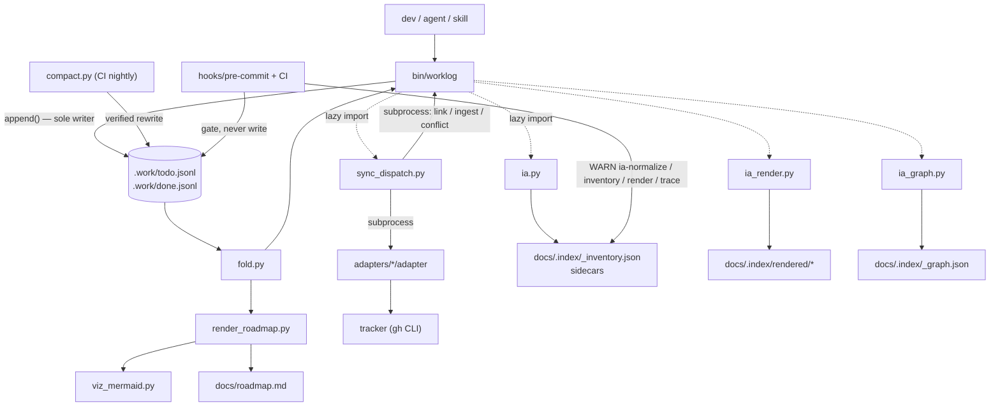

# Worklog — Code Walkthrough

The guided tour a new team member reads on day one. Every claim is anchored in
the code at the commit above. The companion design document is
`docs/designs/current_design_doc.md`; where this walkthrough and that document
disagree with the code, the code wins (drift is reported in §6).

## 1. Orientation

Three sentences: **Worklog tracks work as an append-only JSONL event log inside
the git repo; item state is a fold over the events, and git's union merge makes
concurrent writes compose instead of conflict.** Everything human-readable — the
roadmap, status reports, Mermaid diagrams, and (since v0.13.0) the IA reader
plane under `docs/.index/` — is generated from the log and committed docs, and
everything remote — tickets, wiki pages — is a mirror driven through a typed
dispatcher or a skill. The rules that matter are enforced by hooks and CI, not by
memory.

Directory map:

| Path | What lives there and why |
|---|---|
| `bin/worklog` | The CLI and the **only** writer of `.work/*.jsonl` (1171 lines). |
| `bin/fold.py` | The only code allowed to decide what the log *means*. |
| `bin/ulid.py` | IDs. Includes the deterministic form that makes ingest idempotent across clones. |
| `bin/canonical.py` | THE canonical hash (sync change detection). 34 lines, high blast radius. |
| `bin/sync_dispatch.py` | Every ticket-sync invariant, in one place. |
| `bin/compact.py` | The only file rewriter. CI-only, verification-gated. |
| `bin/render_roadmap.py`, `bin/viz_mermaid.py` | Byte-deterministic roadmap + diagrams. |
| `bin/plan_capture.py`, `bin/adr.py` | Pure helpers: plan parsing, ADR tooling. |
| `bin/ia.py` | wiki_key, truth_state, inventory, normalize, sidecars (IA foundation). |
| `bin/ia_render.py` | Reader plane: Home, Sidebar, indexes, publish-manifest, aliases. |
| `bin/ia_graph.py` | Traceability graph, link-pr, ticket-body, trace-check. |
| `.work/` | The log (`todo.jsonl`, `done.jsonl`), `config.yml`, ledgers. |
| `docs/.index/` | Generated IA plane (committed, regenerate-and-diff). |
| `adapters/` | `github` (worked example), `fake` (CI double), authoring rules. |
| `hooks/` | git pre-commit/pre-merge-commit + four Claude Code hooks. |
| `plugin/` | Claude Code packaging; `plugin/scripts/` mirrors `bin/` + `hooks/`. |
| `schema/` | `capabilities`, `adapter-io`, `adr`, `doc`, `entity` JSON schemas. |
| `tests/` | 19 stdlib-unittest suites; the executable spec (includes `test_ia.py`). |
| `docs/` | Generated roadmap, frozen plans/status/ADRs/designs, the spec (v1.9). |

The one diagram (derived from actual imports and subprocess calls):



## 2. Execution-order tour

### 2.1 The write path: `worklog add` → one line in the log

Entry: argparse dispatches to `cmd_add` (`bin/worklog`, `build_parser` tail +
`cmd_add` body at lines 81–105). Validation happens **before** any write —
`--unplanned` requires `--discovered-during`, and taxonomy rules are hard here
even though the fold is lenient:

```python
def check_taxonomy(level, kind, milestone):
    """Write-time rules, taxonomy spec §2. The fold is lenient; this is not."""
    if level == "epic":
        if kind in ("bug", "triage"):
            sys.exit(f"worklog: an epic cannot be kind:{kind} — epics are "
                     "feature or ops (taxonomy §2.2)")
        if milestone is not None:
            sys.exit("worklog: milestone lives on leaves; epic milestones are "
                     "derived (taxonomy §2.5)")
```
— `bin/worklog — check_taxonomy(), lines 70–79`

Note the `cmd_add` comment: kind is only written when given — an omitted kind
folds to triage (§2.3), never silently to feature. Unclassified must look
unclassified.

Every event then funnels through the single writer:

```python
def append(event):
    """The only writer. Single O_APPEND write, always newline-terminated. ..."""
    if len(event.get("set", {}).get("body", "")) > MAX_BODY:
        sys.exit(f"worklog: body exceeds {MAX_BODY}B; put prose in the plan doc")
    line = json.dumps(event, separators=(",", ":"), sort_keys=True) + "\n"
    fd = os.open(LOG, os.O_WRONLY | os.O_APPEND | os.O_CREAT, 0o644)
    try:
        if os.fstat(fd).st_size:
            rfd = os.open(LOG, os.O_RDONLY)
            try:
                os.lseek(rfd, -1, os.SEEK_END)
                if os.read(rfd, 1) != b"\n":
                    line = "\n" + line
            finally:
                os.close(rfd)
        os.write(fd, line.encode())   # atomic under PIPE_BUF
    finally:
        os.close(fd)
    return event
```
— `bin/worklog — append(), lines 35–58`

What it receives: a finished event dict. What it returns: the event. What can
fail: an oversized body exits before the write; everything else is one atomic
`write()`. Why it is written this way: the self-heal (`lseek -1; read 1`) repairs
a hand-edited file missing its trailing newline — without it, `O_APPEND` would
fuse two events into one unparseable line and lose both (spec §8.2). `MAX_BODY =
2048` (line 31) is "derived from PIPE_BUF … Not a setting." `VERSION = "0.13.0"`
(line 32) is lockstepped with the plugin by `tests/test_plugin.py`.

### 2.2 The read path: `fold()` decides what the log means

Every read command (`list`, `show`, `fold`, roadmap, status, sync scope, IA plan
lifecycle) calls `fold([todo, done])`. Four stages, each load-bearing:

**Parse tolerantly** — `read_lines()` (`bin/fold.py`): a bad line is reported
into `result.errors` and skipped. The docstring explains why this is not
politeness: union merge plus a missing newline "can fuse two valid lines into
one invalid one, and that must cost two events, not the entire history."

**Dedupe and sort deterministically**:

```python
    return sorted(
        seen.values(),
        key=lambda e: (
            e["ev"],
            e.get("actor", ""),
            hashlib.sha256(e["_line"].encode()).hexdigest(),
        ),
    )
```
— `bin/fold.py — dedupe_and_sort()`

ULIDs sort lexicographically by time, so ordering is a string sort; the
`(actor, line-hash)` tiebreak makes two machines fold the same bag of lines
identically — the property union merge depends on.

**Apply the watermark** — `apply_watermark()` drops everything the compactor
already folded, *except* `snapshot` events, which carry the state those events
produced.

**Replay** — `fold()`. The subtleties that bite naive implementations, each with
a guarding test (§4): `snapshot` replaces state entirely (never merges); a
duplicate `create` degrades to an update; `close` takes its status from `set`
(only defaulting to `done` when nothing closed was set); `conflict` records
without changing state; and a later write to a conflicted field clears the
conflict while an *earlier* one does not, because events apply in `ev` order
(`_apply_mutations()`).

Orphans: an event for an item with no create/snapshot creates
`{"id": iid, "_orphan": True}` — "Report it; never crash, never silently invent
an item." Legitimate mid-rebase. Compaction counts orphans as open so it never
drops them (`bin/compact.py` partition comment).

### 2.3 Plan capture: one command, one epic, N tasks, one frozen doc

`cmd_plan_capture()` (`bin/worklog`, lines 339+). It parses the draft with
`plan_capture.parse_tasks()` — checkboxes under a `## Tasks` heading only, with
the regex `TASK_RE` (`bin/plan_capture.py`) where a leading indent means
"subtask of the task above". It refuses to overwrite an existing plan path
(invariant 15.8), appends the epic create, then each task/subtask create, and
finally writes the plan doc with front matter linking every item ID. Captured
items get explicit `kind:feature`.

The whole flow is *forced* by `hooks/exit-plan-capture.sh`, which fires on
`PostToolUse: ExitPlanMode` and injects a non-optional instruction that now also
requires `worklog ia-index` after capture so the reader plane stays current.

### 2.4 The roadmap: a pure function, gated by diff

`render_roadmap.render()` folds the log and emits markdown. Two non-obvious
choices: `generated-at` comes from the newest event's ULID timestamp, not the
wall clock — "wall clock here would fail every commit" — because
`hooks/pre-commit` regenerates and diffs. The default `--viz deps,hierarchy` in
`cmd_roadmap_render` **must** match `render()`'s default because the hook runs
the bare script and diffs against the file the CLI wrote. `viz_mermaid.py` caps
nodes at `MAX_NODES = 40` and strips Mermaid-breaking characters.

`hooks/pre-merge-commit` is a one-line `exec` of the same script, because "git
runs THIS hook (not pre-commit) when a merge auto-commits."

### 2.5 Ticket sync: the dispatcher owns everything

`worklog sync` runs `sync_dispatch.main()` in-process (`cmd_sync()`). Order
inside `Dispatcher.sync()`: capabilities gate, push, pull, save state, report.

**The gate runs first, every run**: adapter `capabilities` output is parsed,
validated against the embedded schema mirror (`CAPABILITIES_SCHEMA`) by a 28-line
mini JSON Schema validator, plus one check the schema subset cannot express —
`"{ulid}"` must appear in `caps["marker"]["template"]`
(`sync_dispatch.py — capabilities()`).

**Push scope** (`push_items()`): open ∪ hash-dirty ∪ `--keys`. The canonical hash
is computed over the *outbound* shape — after type degradation — so "the degraded
echo coming back on pull still suppresses." A closing item whose hash is dirty
pushes an `update` with the final item shape *before* the `close` verb
(v0.12.1; `TestCloseSyncsFields`). On a successful create, external identity
enters the log the only way it can — `worklog link` as a subprocess (invariant
15.4).

**Pull**: NDJSON lines; echo suppression by comparing `canonical_hash(line)` to
`last_pushed_hash`; remote-only becomes `worklog ingest` with deterministic
`ev = ulid.deterministic(system, key, rev, rev_ts)`; both-sides-changed records
a `conflict` per field and never overwrites. Field-diff runs over
`INGEST_FIELDS` (includes `level`/`kind`/`milestone` since v0.12.0). Labels on
pull remain future work.

**Failure handling** is an exit-code table (`handle_exit()`): 2 aborts; 3 pops
`last_pushed_hash`; 4 was already retried; 5 files per-field conflicts; anything
else is drift. No adapter at all is a *mode*: `LOCAL_ONLY`, exit 0.

**Adapters are dumb on purpose.** `adapters/github/adapter` maps verbs to `gh`
calls and embeds the marker; a test bans invariant tokens from every adapter
source.

**Rich bodies (v0.13.0):** `worklog ticket-body <ulid>` prints a projection with
summary, epic/plan/milestone context, and graph edges
(`ia_graph.ticket_body()`, lines 166+) for the issue-description skill to push.

### 2.6 Compaction: the one rewrite, quadruple-checked

`compact.compact()` (`bin/compact.py`), nightly on main via
`.github/workflows/compact.yml`. Sequence: refuse on uncommitted log changes;
watermark = max raw `ev`; short-circuit if todo is already all snapshots;
partition open vs closed where *orphans count as open* — "never drop data"; write
temp files; then gate on `fold(new) == fold(old)` plus trailing newline plus
every line parses. Only after that do two `os.replace` calls swap the files.

v0.13.0: snapshots write folded state **verbatim** so a closed orphan no longer
fails verify by diverging from fold (item 01KY5HW7KS / #101).

### 2.7 Status: deterministic facts, model prose, frozen file

`_status_facts()` is the deterministic half: a fold plus a raw-event pass; an
event is in-window when its **`ev` ULID timestamp** is. Daily windows open at the
last daily report's date; weekly is a fixed 7 days; timecards bucket per UTC day
and attach best-effort git commit subjects. The prose is the skill's job.
`cmd_status --write` stamps front matter with the window and the `through`
watermark and refuses to overwrite without `--force` (invariant 15.9).

### 2.8 The automation ring

Claude Code hooks (wired by `plugin/hooks/hooks.json`):
`prompt-reminder.sh` injects a one-line policy on every prompt;
`stop-worklog-check.sh` **blocks** ending a session where the tree changed but
`.work/todo.jsonl` did not, with a settle-and-recheck sleep;
`session-doctor.sh` reports missing policy blocks, unarmed hooks, or plugin
version skew, read-only.

CI (`worklog.yml`) re-runs the pre-commit script verbatim — "A dev can
`--no-verify` past the local hook; not this" — then unit, integration, and a
subprocess-aware coverage gate (`--fail-under=80`). `merge-when-green.sh` polls
`gh pr checks` and merges only on all-green; empty check output counts as
pending, and 24 failed polls exit 4 (ADR-0003).

Pre-commit also runs **IA gates at WARN level** (plan ia-content-model, migration
0002) — soon hard fail:

```sh
if [ -f bin/ia.py ] && [ -x bin/worklog ]; then
  python3 bin/worklog ia-normalize --check >/dev/null 2>&1 || \
    echo "worklog: WARNING (soon a hard gate) — doc metadata drift; run: worklog ia-normalize" >&2
  python3 bin/worklog ia-inventory --check >/dev/null 2>&1 || \
    echo "worklog: WARNING (soon a hard gate) — inventory stale/invalid; run: worklog ia-inventory" >&2
  [ ! -f bin/ia_render.py ] || python3 bin/worklog ia-render --check >/dev/null 2>&1 || \
    echo "worklog: WARNING (soon a hard gate) — rendered pages/manifest stale; run: worklog ia-render" >&2
  # trace-check stays warn-level here forever; --strict runs at release time
  [ ! -f bin/ia_graph.py ] || python3 bin/worklog trace-check >/dev/null 2>&1 || \
    echo "worklog: WARNING — unlinked evidence; run: worklog trace-check" >&2
fi
```
— `hooks/pre-commit` (IA block)

`PYTHONDONTWRITEBYTECODE` is set in the hook so it never dirties the worktree
with `__pycache__` (item 01KY5P9V0C).

### 2.9 IA plane: normalize → inventory → render → graph

**Identity.** Every doc gets a stable `wiki_key`. Legacy keys are seeded
**verbatim** from `.work/published.json` so no URL or page name changes;
new docs derive keys by rule (`ia.derive_canonical_key()`,
`ia.resolve_key()`). CLI: `worklog wiki-key <path>`.

**Normalize** (`ia.normalize()`, `cmd_ia_normalize` lines 510–520):

```python
def cmd_ia_normalize(a):
    import ia
    changes = ia.normalize(check=a.check)
    for c in changes:
        print(("needs: " if a.check else "wrote: ") + c)
    if a.check and changes:
        sys.exit(1)
    ...
```
— `bin/worklog — cmd_ia_normalize(), lines 510–520`

Frozen docs get additive sidecars under `docs/.index/<wiki_key>.yml`;
sanctioned-live docs get in-place identity fields only. `truth_state` is
recomputed every run (`DYNAMIC_FIELDS`), never pinned from a stale sidecar.

**Inventory** (`ia.build_inventory()` / `write_inventory()`): pure function of
committed files → `docs/.index/_inventory.json` (one record per doc).

**Render** (`ia_render.write_all()`): Home, Sidebar, decisions/releases/status
indexes, truth banners, `publish-manifest.json`, `aliases.json`. Deterministic —
no wall clock — so `--check` can regenerate-and-diff.

**Convenience wrapper:**

```python
def cmd_ia_index(a):
    import ia, ia_render
    for c in ia.normalize():
        print("normalize: " + c)
    ia.write_inventory()
    print("inventory: " + ia.INVENTORY)
    for path in ia_render.write_all():
        print("wrote: " + path)
```
— `bin/worklog — cmd_ia_index(), lines 534–541`

**Graph** (`ia_graph.build_graph()` / `write_graph()`): typed edges from
frontmatter, plan items, ADR references, and item sidecars. `link-pr` is an
**overlay only** — it does not append to the event log:

```python
def link_pr(ulid_, pr=None, commit=None):
    ...
```
— `bin/ia_graph.py — link_pr(), lines 118+`

`trace_check(strict=False)` lists closed items missing plan/ticket/PR links;
`--strict` exits 1 at release. `ia-graph --seed` proposes decides/implements
edges into gitignored `.work/suggestions.jsonl` (propose-only, never auto-edits
docs).

**Schema split.** Document types live in `schema/doc.schema.json`; graph/execution
entities (`item` today) live in `schema/entity.schema.json`. Both are mirrored in
`ia.DOC_TYPES` / `ENTITY_TYPES` / `REQUIRED_*` constants; `TestSchemaSync` pins
equivalence and asserts the two enums are disjoint so items never pretend to be
documents (#111).

## 3. Load-bearing invariants

| # | Invariant | Enforced at | Broken means |
|---|---|---|---|
| 1 | Every `.jsonl` write ends in `\n` | `append()` self-heal; `hooks/pre-commit`; CI | next append fuses two events into one corrupt line; both lost |
| 2 | Only `worklog` writes the log; only `compact.py` rewrites it | policy + CLAUDE.md; `sync_dispatch` shells into `worklog` | hand edits corrupt merges; invariants unauditable |
| 3 | Fold order is `ev`, never file position or `ts` | `dedupe_and_sort()` | union-merged logs fold differently per machine |
| 4 | Ingested events carry deterministic `ev` and the remote's `ts` | `ulid.deterministic()`; `cmd_ingest()` | duplicate ingests silently revert local edits |
| 5 | Push idempotency: marker `worklog:<ulid>` + canonical-hash skip | `push_items()`; marker template gate | retried pushes file duplicate tickets |
| 6 | Canonical hash = exactly `HASH_FIELDS`, one implementation | `canonical.py` ("nothing else may reimplement it") | echo suppression breaks for every existing clone |
| 7 | Compaction only lands if `fold(new) == fold(old)` | `_verify()`; temp files + `os.replace` | state loss — "the worst failure mode in this system" |
| 8 | `close` reads status from `set` | `fold()` | cancelled work reports as shipped |
| 9 | Generated roadmap always matches the log | pre-commit + pre-merge-commit diff; deterministic timestamps | roadmap silently lies; hand edits stick |
| 10 | Frozen artifacts are never rewritten | plan-capture/roadmap-snapshot/status existence refusals; ADR `mark_superseded()`; IA sidecars for frozen docs | history that people acted on gets rewritten |
| 11 | Adapters contain no invariant logic | `test_adapter_contract.py` banned-token scan | invariants fork per platform and drift |
| 12 | Epics are feature/ops only; milestone lives on leaves | `check_taxonomy()`; pre-commit taxonomy scan; fold stays lenient | taxonomy queries give wrong answers |
| 13 | Merges happen only on all-green gates | `merge-when-green.sh` | broken main, agent-speed |
| 14 | IA index artifacts are pure functions of committed files | no wall clock in inventory/render/graph writers; freshness `--check` | regenerate-and-diff gates become flaky |
| 15 | Doc types and entity types are disjoint | `TestSchemaSync.test_doc_and_entity_types_are_disjoint` | inventory/graph validation confuses items with pages |

## 4. Tests as executable specification

**`tests/test_fold.py — test_cancelled_stays_cancelled()`.** Rule proved:
`close` takes status from `set`. Regression caught: a fold that hardcodes `done`
— abandoned work reporting as shipped.

**`tests/test_ulid.py — TestTheBugThisPrevents`.** Two devs poll the same remote
change; with deterministic `ev`, dedupe collapses them. The companion test
**passes while documenting the failure mode** with random `ev`s — Rick's edit is
gone, nothing errors. Exists "because this design keeps getting proposed."

**`tests/test_dispatch.py — test_push_twice_same_ulid_is_one_ticket()`.** Rule
proved: canonical-hash skip + marker idempotency. Sibling
`test_retry_after_transient_does_not_duplicate` injects exit-4 with `_fail_next`.

**`tests/test_adapter_contract.py — test_adapters_contain_no_invariant_logic()`.**
Scans every `adapters/*/adapter` for banned tokens. Automatically covers new
adapters the day they appear.

**`tests/test_integration.py — test_a_fused_line_costs_exactly_its_own_events()`.**
Corruption is contained and detected at the merge boundary.

**`tests/test_compact.py — test_reopen_after_compact_restores_pre_close_fields()`.**
Folding `todo + done` by `ev` makes reopen work across the physical file split.

**`tests/test_dispatch.py — test_pull_ingests_remote_taxonomy_change()` (v0.12.0).**
Remote taxonomy edits pull instead of silently dropping.

**`tests/test_dispatch.py — TestCloseSyncsFields` (v0.12.1).** Reclassify then
close; local `kind` survives the round-trip; pull is an echo, not a remote edit
(worklog 01KY129S, GitHub #76).

**`tests/test_ingest.py — TestReopen` (v0.12.0).** reopen clears `resolution`;
`update --status` on closed is refused; reopen of open is refused.

**`tests/test_ia.py — TestSchemaSync` (v0.13.0).**

```python
    def test_doc_schema_json_matches_ia_constants(self):
        ...
        self.assertEqual(schema["required"], list(ia.REQUIRED_ALL))
        self.assertEqual(props["doc_type"]["enum"], list(ia.DOC_TYPES))
        ...
    def test_doc_and_entity_types_are_disjoint(self):
        self.assertEqual(set(ia.DOC_TYPES) & set(ia.ENTITY_TYPES), set())
```

Rule proved: embedded IA constants cannot silently diverge from
`schema/doc.schema.json` / `entity.schema.json` before Phase 5 hard-fail.

**`tests/test_ia.py — TestNormalize.test_normalize_backfills_then_noop`.** First
run writes sidecars/frontmatter; second run is a no-op. Rule proved: normalize is
idempotent and additive.

**`tests/test_ia.py — TestGraph.test_link_pr_is_overlay_only`.** `link-pr`
mutates the item sidecar, not the event log. Rule proved: PR edges do not violate
invariant 15.4.

**`tests/test_ia.py — TestGraph.test_trace_check_warn_and_strict`.** Default is
non-zero gaps without process failure; `--strict` exits 1.

**`tests/test_ia.py — TestGraph.test_seed_edges_propose_only_and_deduped`.** Seed
writes suggestions only; never edits docs; dedupes re-proposals.

## 5. Junior engineer orientation

**Five things to internalize:**

1. State is derived, never stored. If `worklog list` looks wrong, the question
   is "what events exist?" (`worklog fold`, or read the JSONL), never "where is
   the state file?"
2. `ev` order is the only order. File position and `ts` are noise.
3. There is exactly one writer (`append()`), one meaning-maker (`fold()`), one
   rewriter (`compact.py`), one hash (`canonical.py`). Adding a second of any of
   these is the design failure the tests hunt.
4. Generated vs frozen: `docs/roadmap.md` and `docs/.index/*` are regenerated
   and diffed; plans, snapshots, status reports, and ADR bodies are written once
   (IA metadata for frozen docs lives in sidecars, not in the body).
5. The dispatcher enforces; adapters translate; skills orchestrate; the IA plane
   navigates.

**Where to start debugging:** `python3 bin/fold.py` prints derived state with
warnings for corrupt lines and orphans. `worklog sync --dry-run` prints
decisions without side effects. `worklog adapter check` validates a contract.
`bash hooks/pre-commit` runs every local gate manually. `worklog ia-index` and
`worklog trace-check` diagnose reader-plane / evidence gaps.

**Where common changes go:** new CLI behavior → `bin/worklog` (subcommand + a
test suite); roadmap presentation → `render_roadmap.py`/`viz_mermaid.py` (keep
byte-determinism — no wall clocks); a new tracker → copy
`adapters/github/adapter`, keep it dumb, then `worklog adapter check`; policy →
`CLAUDE.md` prose backed by a hook if it must always hold; doc identity /
navigation → `ia.py` / `ia_render.py` / `ia_graph.py` + `test_ia.py`.

**Risky files:** `bin/canonical.py` (any change churns every clone's hashes —
the file says "Don't."); `bin/fold.py` (every command's notion of truth);
`bin/compact.py` (the only code that can lose state); `append()` in
`bin/worklog` (the atomicity/newline dance); `sync_dispatch.CAPABILITIES_SCHEMA`
and `ia.REQUIRED_*` / `DOC_TYPES` (must stay identical to `schema/*` — tests
diff them).

**Never break:** invariants table in §3 — especially trailing newline,
`ev`-ordering, deterministic ingest, marker idempotency, fold-equality in
compaction, and frozen-doc immutability (use sidecars).

## 6. Gaps and design drift

Confirmed facts unless labeled otherwise.

Closed in prior releases and still closed at v0.13.0: dispatcher
`INGEST_FIELDS` carries taxonomy; `worklog reopen` exists; `conflict_policy` is
`report` only; dirty-close pushes final shape before close; `TestResolve`
exercises the resolve CLI.

**Shipped in v0.13.0 (were gaps or plans at v0.12.1):**

- IA content model Phases 0–4: `wiki_key`, `truth_state`, inventory, normalize,
  reader plane, graph, `link-pr`, `trace-check`, rich `ticket-body`.
- Schema split documents vs entities (`doc.schema.json` / `entity.schema.json`).
- Compaction closed-orphan verify fix.
- Wiki frontmatter strip at publish; readable ticket bodies.
- Plan-capture / release flows wire `ia-index`.
- Init scaffold installs IA modules; MIT LICENSE.

**Still open / drift:**

1. **Spec §10.5 sync surface ≠ shipped CLI.** Spec documents
   `--scope active|all`, `--report`, `--apply`; CLI ships `--dry-run`, `--keys`,
   `--push-only`, `--pull-only`. Doc drift, not a bug.
2. **`.work/config.yml` comments** still say "no adapter binary" under
   ticketing/wiki blocks while `adapters/` and the dispatcher ship. Harmless
   (skill path still works) but a 1.4-era story for config-only readers.
3. **Spec §11's three-phase orchestration (changeset.json, results/) is not in
   code.** Shipped dispatcher is single-process push/pull. **Assumption:** still
   aspirational for parallel-subagent sync.
4. **`estimate` and related optional fields** (spec §5.4 / #108) have no CLI
   surface yet — configurable field model is open work.
5. **Labels don't pull** — marked future work in `pull()`.
6. **Remote-origin tickets are reported, never created locally** — deliberate
   read-safety.
7. **Duplicated mini-validator** (dispatcher, `adr.py`, contract tests) and
   **duplicated IA schema constants** (`ia.py` vs `schema/*.json`) — deliberate
   "bin-only install"; pinned by tests; fourth/diverge copies should extract or
   fail CI.
8. **IA gates warn-only** until Phase 5 (#98); `trace-check` stays warn at
   commit forever (strict at release). Residual risk: ignored warnings allow
   metadata drift to merge.
9. **Phase 5 / platform render adapters / `/worklog:find` + glossary** not
   shipped.
10. **UI work** was moved to `wiki_ticket_sdd_ui` and cancelled here — do not
    look for UI code in this repo.

Final check against the code: every flow above was walked at commit
`06e78087198b033e4b085f58acb215fccdea9cf4` (tag v0.13.0 lineage on main); all
citations are to that tree. Dated freeze pairs for this release pin
`git_hash` to the annotated tag commit `486179207e8cf82d785cd159f92b1e1f6f88092c`.
