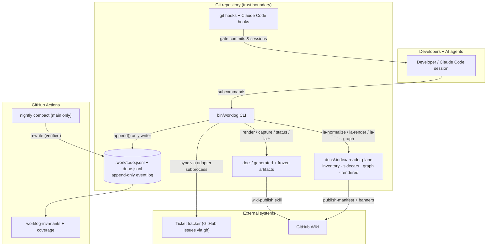
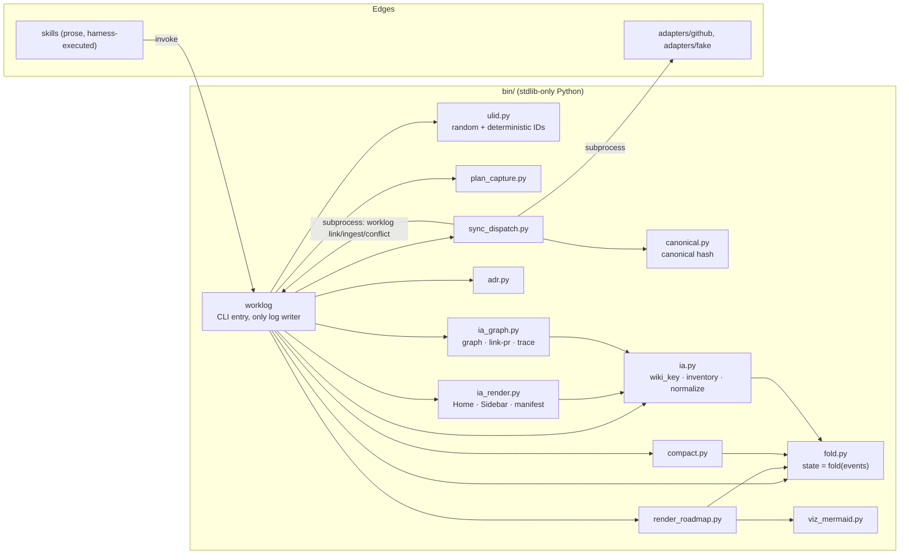
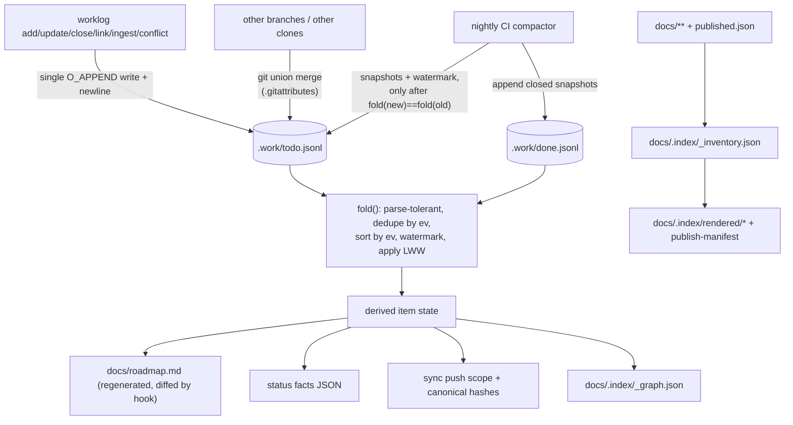
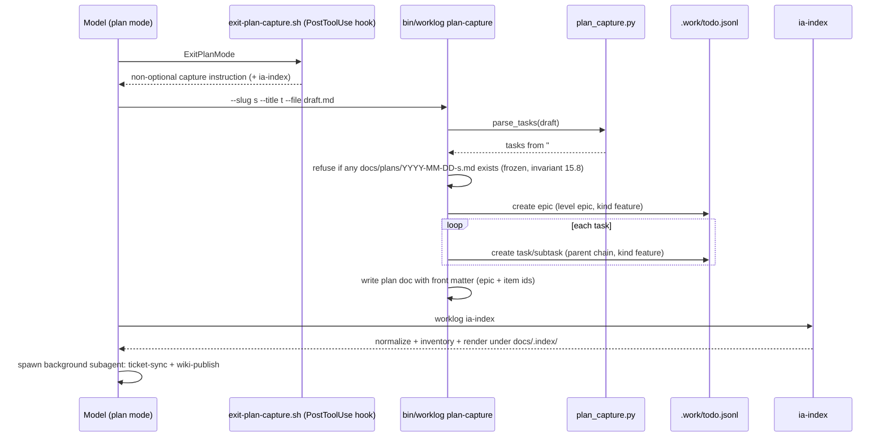
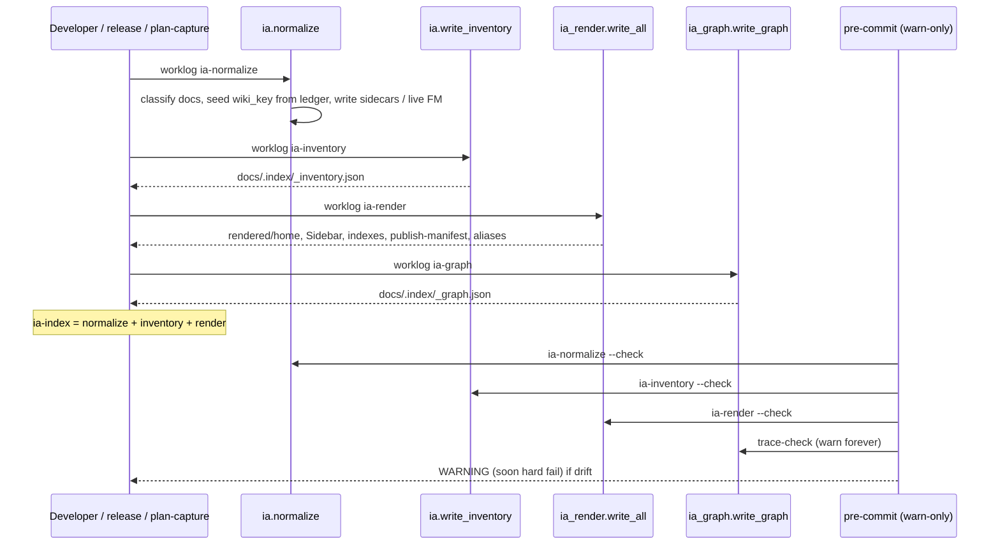
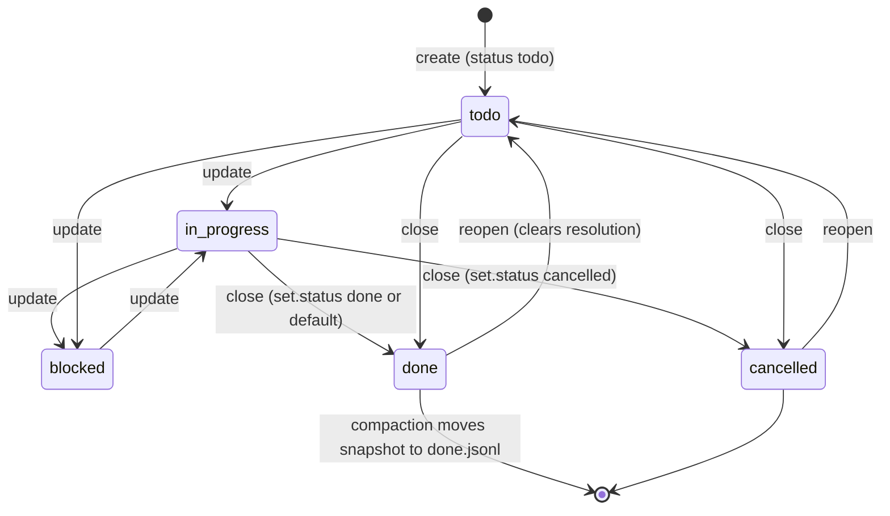
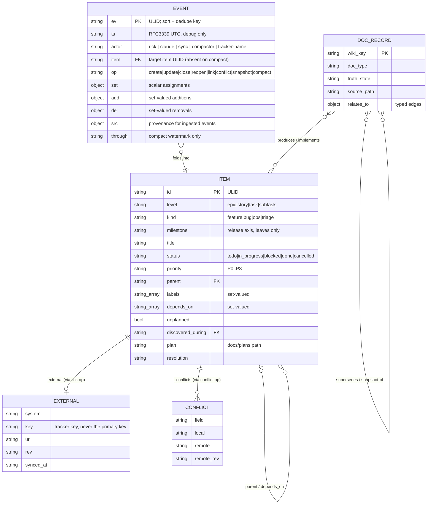
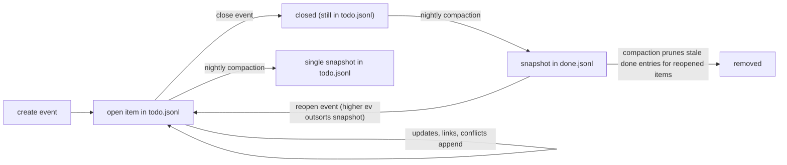

# Worklog — Software Design Document

# 1. Document Overview

**Purpose.** Describe the design of *worklog*, a local-first, git-native work-tracking
layer for agentic coding, as actually implemented in this repository at v0.18.0.

**Audience.** Junior developers who need implementation-level guidance; project
managers who need scope, dependencies, risks, and behavior.

**Scope.** The `bin/` CLI and its Python modules, the append-only event log under
`.work/`, the git hooks, the typed adapter contract and shipped adapters, the
Claude Code plugin packaging, GitHub Actions CI, the generated/frozen document
artifacts under `docs/`, and the Information Architecture (IA) reader plane under
`docs/.index/` (inventory, sidecars, rendered pages, traceability graph).

**Out of scope.** The prose content of individual skills (`plugin/skills/*`,
`.claude/skills/*`) beyond their contracts with the deterministic core; the harness
(Claude Code) itself; the separate UI repo (`wiki_ticket_sdd_ui`) cancelled from
this work log in the v0.13.0 cycle.

**Related documents.** `docs/worklog-spec.md` (v1.9, the normative spec),
`docs/adr/0001..0003` (Architecture Decision Records), `docs/plans/` (twenty dated
plan documents — the *why* record, most recently
`docs/plans/2026-07-28-one-owner-per-external-key.md`), `docs/migrations/0001-type-split.md`
and `0002-ia-content-model.md`, `adapters/README.md` (adapter authoring rules),
`docs/user_guide/` (task-oriented guides), `docs/integrations/` (eleven per-system
setup guides plus an index, new in v0.16.0), and the companion
`docs/designs/current_code_walkthrough.md`.

**Definitions.**

| Term | Meaning |
|---|---|
| ULID | Universally Unique Lexicographically Sortable Identifier: 48-bit ms timestamp + 80-bit entropy, Crockford base32, 26 chars. Lexicographic sort == time sort. |
| Fold | Deriving item state by replaying the event log in `ev` order (`bin/fold.py`). |
| Compaction | The only file rewrite: replaces folded history with `snapshot` events plus a `compact` watermark (`bin/compact.py`). |
| Canonical hash | `sha256(canonical_json(HASH_FIELDS))[:16]` (`bin/canonical.py`) — the sync change-detector. |
| Marker | The `worklog:<ULID>` token embedded in every pushed ticket body; the idempotency key. |
| Adapter | A single executable translating canonical JSON to one tracker's CLI; dumb by contract. |
| Skill | Prose instructions the harness model executes; the non-deterministic edge of the system. |
| LWW | Last-writer-wins, per field, ordered by `ev`. |
| wiki_key | Stable logical page identity (e.g. `plan/ia-content-model`, `design/current-design-doc`); the key `published.json` already used, formalized in the IA model. |
| truth_state | `current` / `snapshot` / `superseded` / `archived` — orthogonal to lifecycle `status`; tells readers whether a page is live truth or historical evidence. |
| Sidecar | `docs/.index/<wiki_key>.yml` — metadata for frozen docs that must never be edited in place. |
| Reader plane | Generated navigation under `docs/.index/` (inventory, rendered Home/Sidebar/indexes, publish manifest, traceability graph). |

**Assumptions** are labeled **Assumption**; unverified points are **Open Question**;
everything else in this document is **Confirmed** against the repository at the
commit in the frontmatter.

# 2. Executive Summary

Worklog makes work-in-progress visible without a server. Work items live as an
append-only JSONL event log inside the repository (`.work/todo.jsonl`,
`.work/done.jsonl`); every derived artifact — the roadmap, status reports, Mermaid
visualizations, ticket pushes, wiki pages, and (since v0.13.0, extended in v0.14.0)
the IA reader plane — is computed from that log and the committed docs tree. Three
properties drive the design (spec §1): visible WIP, plans produce tickets, and a
generic core with pluggable edges.

Main workflows:

- **Track work**: `worklog add/update/close/reopen` appends events; `worklog list/show/fold`
  reads derived state.
- **Capture plans**: exiting plan mode triggers a hook that forces
  `worklog plan-capture`, which writes a frozen plan document and creates an epic
  plus its tasks in one pass, then `ia-index` refreshes the reader plane.
- **Generate the roadmap**: `worklog roadmap-render` is a pure function of the log;
  a pre-commit hook regenerates and diffs it, so a stale or hand-edited roadmap
  cannot be committed.
- **Sync tickets**: `worklog sync` drives a typed dispatcher
  (`bin/sync_dispatch.py`) that pushes/pulls through a per-tracker adapter
  executable, with idempotency, echo suppression, and conflict recording enforced
  in the dispatcher, never in adapters. Rich ticket bodies come from
  `worklog ticket-body` (traceability projection). **v0.18.0** adds the missing
  uniqueness rule on the other side of that link: one remote ticket has exactly
  one local owner (§9.6), enforced at `worklog link`, at `worklog sync`, and
  undoable through the new `worklog unlink`.
- **Report status**: `worklog status --emit-facts` produces deterministic facts;
  a skill writes the prose; `worklog status --write` freezes the report.
- **IA / content model (v0.13.0, extended v0.14.0)**: `worklog ia-normalize`
  backfills `wiki_key` + `truth_state` (sidecars for frozen docs, in-place for
  live docs); `ia-inventory` / `ia-render` / `ia-graph` materialize the reader
  plane and traceability graph; `trace-check` reports unlinked evidence; gates
  are warn-level until Phase 5. **v0.14.0** extends the reader plane past
  documents to *artifact pages* — one generated page per work item, PR, and
  release (`bin/ia_render.py — render_item_page()/render_release_page()/
  render_pr_page()`), reusing the same graph edges rather than storing new
  fields; `worklog ia-ticket <ULID>` previews a ticket page without a full
  render pass. The published-page manifest grew from 51 entries to 258.
- **Integration guides (v0.16.0)**: a new prose-only edge, `integration-guide`
  (`plugin/skills/integration-guide/SKILL.md`), points an agent at a
  wiki-hosted setup guide for one of eleven named systems — the four SDD tools
  this repo composes with (Superpowers, GSD, SpecKit, OpenSpec) and seven
  ticket/wiki systems only one of which (GitHub) has a real adapter (Jira,
  Confluence, GitHub, GitLab, Azure DevOps, AWS CodeCatalyst, Google Cloud
  DevOps). It ships zero new Python: `WebFetch` reads the live
  `Integration-<Name>` wiki page (with a redirect-to-Home detector, since a
  GitHub wiki 200s a missing slug instead of 404ing), and on fetch failure or a
  failed verification falls back to a bundled local copy,
  `docs/integrations/fallback-<key>.md` (eleven files + `docs/integrations/README.md`
  index, registered through the existing `worklog wiki-add` + wiki-publish
  pipeline — no new publish path).

Major components: the `worklog` CLI (the API, 1274 lines), `fold.py` (state
derivation), `compact.py` (the only rewriter, CI-only), `render_roadmap.py` +
`viz_mermaid.py` (generated docs), `sync_dispatch.py` + `adapters/` (ticket sync),
`ia.py` / `ia_render.py` (670 lines) / `ia_graph.py` (302 lines) (reader plane +
graph + artifact pages), `adr.py`/`plan_capture.py`/`canonical.py`/`ulid.py`
(support modules), git hooks, GitHub Actions, the Claude Code plugin, and (v0.16.0)
the `integration-guide` skill + `docs/integrations/` content — the first edge in
this repo built entirely from prose and existing primitives, no new `bin/` code.

External dependencies: git (union merge), the `gh` CLI (GitHub adapter and
merge-when-green), Python 3 stdlib only — **zero third-party runtime dependencies**
(Confirmed: no requirements file; `tests/` use stdlib `unittest`).

Primary risks: hosted platforms don't run merge drivers server-side (PR-level
conflicts on the log), wall-clock LWW ties, compaction as the single
state-rewriting operation (mitigated by fold-equality verification), and IA
gates still warn-only (Phase 5 hard-fail promotion still open).

# 3. Requirements Summary

Functional requirements (Confirmed, from spec §2 and the implementation):

| # | Requirement | Component |
|---|---|---|
| R1 | Append-only, mergeable event log of work items | `bin/worklog — append()`, `.gitattributes` union merge |
| R2 | Deterministic state derivation from the log | `bin/fold.py — fold()` |
| R3 | Generated, CI-guarded roadmap | `bin/render_roadmap.py`, `hooks/pre-commit` |
| R4 | Plan capture: plan doc + epic + tasks in one operation | `bin/worklog — cmd_plan_capture()`, `bin/plan_capture.py` |
| R5 | Idempotent bidirectional ticket sync | `bin/sync_dispatch.py`, `bin/canonical.py`, `adapters/*` |
| R6 | Deterministic ingestion of remote changes | `bin/ulid.py — deterministic()`, `bin/worklog — cmd_ingest()` |
| R7 | Conflict recording, never silent overwrite | `cmd_conflict()`, `fold._apply_mutations()` conflict clearing |
| R8 | Log compaction preserving fold equality | `bin/compact.py — compact()`, `.github/workflows/compact.yml` |
| R9 | Frozen status reports with deterministic facts | `bin/worklog — cmd_status()`, `_status_facts()` |
| R10 | Work taxonomy (level/kind/milestone) with write-time validation | `check_taxonomy()`, `fold._normalize_taxonomy()`, `hooks/pre-commit` |
| R11 | Wiki publish ledger with stable page identity | `_register_published()`, `.work/published.json` |
| R12 | ADRs with once-written bodies and supersede chains | `bin/adr.py`, `worklog adr new|list|check` |
| R13 | Green-gates merging, never bypassed | `plugin/scripts/merge-when-green.sh`, ADR-0003 |
| R14 | IA content model: wiki_key, truth_state, inventory, reader plane, traceability | `bin/ia.py`, `ia_render.py`, `ia_graph.py`; plan `docs/plans/2026-07-22-ia-content-model.md`; migration 0002 |
| R15 | Branch discipline: commits never land directly on main/master; every commit message references a worklog item or ticket | `hooks/pre-commit` branch-guard block, `hooks/commit-msg`; plan `docs/plans/2026-07-25-branch-discipline-hooks.md` |
| R16 | One local owner per remote ticket; a link is retractable; nothing may fail or diverge between mutating remote state and recording it (v0.18.0) | `fold.external_owners()`, `cmd_link()`/`cmd_unlink()`, `Dispatcher.push_items()`/`is_dirty()`/`record_link()`, `adapters/github/adapter — create_issue()`; plan `docs/plans/2026-07-28-one-owner-per-external-key.md` |

Non-functional: no runtime dependencies beyond Python 3 + git; appends atomic under
`PIPE_BUF` (body capped at `MAX_BODY = 2048`, `bin/worklog` line 31); corrupt input
never fatal (`fold.read_lines()`); CI coverage floor ≥80% on `bin/*.py`
(`.github/workflows/worklog.yml`, `--fail-under=80`), target 95%; local-only
degradation when edge tooling is missing (spec invariant 15.10); IA index
artifacts are byte-deterministic (no wall clock) so freshness gates can
regenerate-and-diff.

Availability/scalability: single-repo, single-team scale by design; compaction
bounds log growth (spec §7 trigger: nightly or >5000 lines). Disaster recovery is
git itself: the log is committed history.

# 4. System Context

Actors: developers and AI agents (writers via the CLI), the compactor (CI), the
sync actor, remote trackers, the wiki, and readers (PMs reading generated docs and
the IA Home/indexes). Trust boundary: everything inside the repo is trusted;
adapters and `gh` cross the network boundary; skills run in the harness model.



*How to read it:* every state change funnels through the CLI into the log; CI and
hooks are gates, not writers (except the nightly compactor). The tracker and wiki
are mirrors — the log is the source of truth (spec §2 non-goals). The IA plane is
generated from docs + fold; it never writes the event log.

Inputs: CLI invocations, adapter pull output (NDJSON), plan drafts, status prose on
stdin. Outputs: log events, `docs/roadmap.md`, `docs/plans/*`, `docs/status/*`,
`docs/adr/*`, `docs/.index/*`, ticket pushes, `sync report` lines.

# 5. High-Level Architecture

Layers, all Confirmed from imports:

- **Identity**: `ulid.py` (no imports from siblings).
- **State**: `fold.py` (imports `hashlib`, `json` only).
- **CLI/API**: `bin/worklog` imports `ulid`, `fold`; lazily imports
  `render_roadmap`, `plan_capture`, `compact`, `sync_dispatch`, `adr`, `ia`,
  `ia_render`, `ia_graph`.
- **Rendering**: `render_roadmap.py` imports `ulid`, `fold`; `viz_mermaid.py`
  imports `ulid`, `fold` and is imported lazily by `render_roadmap.render()`.
- **Sync**: `sync_dispatch.py` imports `canonical`; drives adapters and the CLI
  as subprocesses.
- **IA plane**: `ia.py` imports `fold`; `ia_render.py` / `ia_graph.py` import `ia`
  (and fold-derived items where needed).
- **Automation**: `hooks/` (git + Claude Code), `.github/workflows/`,
  `plugin/` (packaged copies of the same scripts).



*How to read it:* arrows are imports or subprocess calls. Note the loop
`SD → WL`: the dispatcher never appends to the log directly; it shells back into
`worklog` (invariant 15.4, `sync_dispatch.py — Dispatcher.worklog(), lines 178–188`).

**Data flow of the event log + IA plane:**



*Assumptions/failure behavior:* union merge duplicates and scrambles lines — the
fold's dedupe/sort absorbs that; a corrupt line costs itself only
(`fold.read_lines()`). IA artifacts are pure functions of committed files; a
stale index is a gate warning (soon hard fail), not silent drift.

Deployment architecture is §27; trust boundaries §22.

# 6. Architectural Decisions

The repo keeps ADRs in `docs/adr/`; this section summarizes and links (per ADR
tooling, `bin/adr.py`).

**ADR-0001 — Append-only event log + fold + union merge** (accepted).
State is never stored; it is a fold over immutable events, merged by git's
built-in union driver. Alternatives rejected: state files (merge conflicts clobber
teammates), CRDTs (correct but heavy). Consequences absorbed: arbitrary post-merge
line order and duplicates (fold sorts/dedupes), wall-clock LWW ties, and the
hosted-platform caveat (GitHub does not run merge drivers server-side — spec §8.1).

**ADR-0002 — Skill-based edges hardened by a typed adapter contract** (accepted).
The 1.2 spec's per-system adapter binaries never shipped; v1.4 moved integration to
skills (the model already knows these systems); v1.6 restored the three invariants
that had regressed to prose — idempotency, pull parsing, capability degradation —
as code in the dispatcher, with adapters kept as generated dumb translators.
`tests/test_adapter_contract.py — test_adapters_contain_no_invariant_logic()`
bans `sha256`, `last_pushed_hash`, `canonical_json`, `search`, and
`sync-state` from every adapter source.

**ADR-0003 — Green-gates merging** (accepted). PRs merge only when every check is
green; `merge-when-green.sh` polls (default 300 s, 24 attempts) and treats "no
gates reporting" as *not* passing (exit 4 timeout). Never `--admin`.

**IA content model (plan + migration 0002, not yet a numbered ADR).** Two planes:
storage stays path-organized by how docs are produced; navigation is a generated
reader plane keyed by `wiki_key`. Frozen docs never receive in-place metadata
edits — sidecars hold additive fields (invariants 15.8/15.9). Doc schema and entity
schema are deliberately split (`schema/doc.schema.json` vs
`schema/entity.schema.json`, mirrored in `bin/ia.py` constants) so work items can
enter the graph without pretending to be documents (Confirmed: schema split item
01KY5QV5G0 / #111).

**Artifact pages (v0.14.0, plan `docs/plans/2026-07-24-artifact-pages.md`).**
Extends the same reader plane to tickets, PRs, and releases, which previously
existed only as bare stub nodes in the graph. Two decisions confirmed with the
project owner before build: (1) **no new stored fields** — a page's hierarchy,
linked PRs, and release are derived at render time from existing graph edges
(`ia_graph.item_links()`), not cached into the item or a sidecar, because a
stored copy would be a second, driftable source of truth the sidecar rule
already forbids; (2) **live PR metadata is out of scope this pass** — no code
anywhere in the repo calls `gh pr view`, so "files changed" and CI/review
status render as "not tracked" on PR pages, and the live sync is filed as a
separate follow-up (#138) rather than silently dropped.

Decisions not (yet) in ADRs, recorded in plans/spec:

| Decision | Rationale | Where |
|---|---|---|
| Deterministic ULIDs for ingested events | Two clones polling the same remote change must append byte-identical lines so dedupe collapses them; a random `ev` silently reverts local edits | `bin/ulid.py — deterministic()`; spec §10.2; `tests/test_ulid.py — TestTheBugThisPrevents` |
| Canonical hash over exactly ten fields | Echo suppression and skip-unchanged; changing the field set churns every hash (accepted once, in the taxonomy migration) | `bin/canonical.py — HASH_FIELDS` |
| Config/policy split, `AGENTS.md → CLAUDE.md` symlink | One policy for every harness; scripts read only `.work/config.yml` | spec §4.1 |
| No YAML library | Stdlib-only; naive block scans where needed | `bin/worklog — _config_system()`; `ia.parse_front_matter()` |
| Embedded schemas mirrored from `schema/` | Installed repos ship `bin/` without `schema/`; tests assert the copies match | `sync_dispatch.py — CAPABILITIES_SCHEMA`; `ia.REQUIRED_*`; `tests/test_ia.py — TestSchemaSync` |
| Body cap is a constant, not a setting | Derived from `PIPE_BUF`; "a knob whose only valid value is the default is a trap" | `.work/config.yml` trailing comment; `bin/worklog` line 31 |
| Frozen artifacts (plans, snapshots, status, ADR bodies) | Documents people acted on are history, not caches | spec §13.2–13.3; existence refusals; ADR supersede-only |
| Hooks, not hope | "A CLAUDE.md instruction holds maybe 80% of the time. A hook holds 100%." | spec §12; `hooks/exit-plan-capture.sh` |
| Sidecars over frozen-doc rewrite | Would otherwise violate §15.8/§15.9 | `ia.is_frozen()`, `ia.normalize()` |
| IA gates warn-only until Phase 5 | Soft rollout before hard-fail | `hooks/pre-commit` IA block comments |
| Uniqueness on `(external.system, external.key)` is a constraint, not an identity change (v0.18.0) | The ULID stays the only primary key and no lookup is done by external key; a `UNIQUE` index coexists with a surrogate primary key. Written into the spec so the next reader does not "fix" it back as a §5.4 violation | `docs/worklog-spec.md:272`; `fold.external_owners()` docstring; plan `docs/plans/2026-07-28-one-owner-per-external-key.md` |
| Sync **skips** contested items and exits 1, rather than refusing the whole run (v0.18.0) | Corruption needs *both* claimants pushed, so removing the set removes the path; every other item still syncs and pull still works — which is exactly what you want while repairing. Printed as its own block, not a `drift:` line, because drift is what operators skim and burying a live-corruption warning there reproduces the original silent failure in a new costume | `sync_dispatch.report_collisions()`, `push_items()`, `sync()` |
| `unlink` reuses the `link` op with `external: {}` (v0.18.0) | The fold already applies whole-field LWW to `external`, so an empty value *is* the retraction. No new op means no fold change and an un-upgraded clone still folds it correctly. `{}` and never `null`, because `cmd_list`'s `.get("external", {})` default never fires on an existing null key | `bin/worklog — cmd_unlink()`; `fold._apply_mutations()` |
| Create must return its own revision (v0.18.0) | A read-back after a mutation is a retryable failure *after* the mutation; with `op` still `create`, every dispatcher retry files another ticket. One call, or no atomicity | `adapters/github/adapter — create_issue()`; github#235 |
| Branch guard + commit-msg hard-fail immediately, no warn period (v0.15.0) | A real incident (13 commits authored straight onto `main`, diverging from `origin/main` for hours) — "hooks enforce invariants, not hope"; `MERGE_HEAD` exempts reconciliation merges, `WORKLOG_SKIP_BRANCH_GUARD` exempts the three non-commit callers (doctor, CI backstop, integration-test assertions) | `hooks/pre-commit` branch-guard block; `hooks/commit-msg`; plan `docs/plans/2026-07-25-branch-discipline-hooks.md` |

Conditions to revisit: a Lamport counter if clock-skew LWW ever bites (spec §16);
`external` as an array if multi-tracker is needed; Phase 5 hard-fail promotion
and platform render adapters (open item #98).

# 7. Component Inventory

| Component | Type | Responsibility | Inputs | Outputs | Depends on | Failure impact |
|---|---|---|---|---|---|---|
| `bin/worklog` | CLI (1274 lines) | All log writes; every subcommand | argv, stdin (status prose, plan drafts) | log events, docs, stdout | `ulid`, `fold`, lazy others | no writes possible |
| `bin/fold.py` | Library (307 lines) | Derive state; the only interpreter of the log; **`external_owners()` (v0.18.0)**: the one-owner-per-remote-ticket index | log paths, item iterables | `FoldResult`, `(system, key) → [ids]` | stdlib | everything downstream |
| `bin/ulid.py` | Library | Random + deterministic ULIDs | time/entropy or (system,key,rev,ts) | 26-char IDs | stdlib | ordering/idempotency |
| `bin/canonical.py` | Library | Canonical JSON + 16-hex hash | item dict | hash | stdlib | echo suppression |
| `bin/render_roadmap.py` | Generator | Byte-deterministic roadmap | log | markdown | `fold`, `ulid`, `viz_mermaid` | roadmap staleness gate |
| `bin/viz_mermaid.py` | Generator | Deps/hierarchy/gantt diagrams, 40-node cap | `FoldResult`, log paths | mermaid blocks | `fold`, `ulid` | cosmetic |
| `bin/plan_capture.py` | Library | Parse `## Tasks` checkboxes; plan front matter | draft text | task list, front matter | stdlib | plan capture |
| `bin/compact.py` | Batch (CI) | The only file rewriter; verified | log files | rewritten logs | `fold`, `ulid`, `render_roadmap.max_ev` | worst-case: refused, files untouched |
| `bin/sync_dispatch.py` | Orchestrator | Every sync invariant | fold output, adapter I/O | pushes, ingests, conflicts, report | `canonical`, adapter, `worklog` | sync only; local-only fallback |
| `bin/adr.py` | Library | ADR parse/validate/scaffold/supersede | `docs/adr/*.md` | problems list, scaffolds | stdlib | ADR gate |
| `bin/ia.py` | Library (616 lines) | wiki_key, truth_state, inventory, normalize, sidecars | docs tree, ledger, fold | `_inventory.json`, sidecars, frontmatter patches | `fold` | IA gates / publish metadata |
| `bin/ia_render.py` | Generator (670 lines) | Home, Sidebar, indexes, publish-manifest, aliases, **artifact pages (v0.14.0)**: ticket/release/PR pages | inventory records, fold items, graph | `docs/.index/rendered/*` (incl. `tickets/`, `releases/`, `prs/`) | `ia`, `ia_graph` | reader plane staleness |
| `bin/ia_graph.py` | Library (302 lines) | Traceability graph, link-pr overlay, ticket-body, trace-check, **adjacency projection (v0.14.0)**: `build_adjacency()`/`item_links()` | records + fold items | `_graph.json`, sidecar edges | `ia` | unlinked evidence |
| `adapters/github/adapter` | Executable | GitHub translation via `gh` | verb + JSON | JSON/NDJSON, exit codes 0–5 | `gh` CLI | GitHub sync |
| `adapters/fake/adapter` | Test double | Contract-faithful local tracker | verb + JSON | JSON, state file | stdlib | CI sync tests |
| `hooks/pre-commit`, `pre-merge-commit`, `commit-msg` (v0.15.0) | Git hooks | Newline/schema/taxonomy/roadmap/ADR/IA gates, **branch guard + work-reference gate (v0.15.0)** | staged tree, branch name, commit message | pass/fail (+ IA warnings) | python3 | invariants unenforced locally; commits can drift onto main untraceably |
| `hooks/*.sh` (4) | Claude Code hooks | Session policy: capture, reminder, stop-gate, doctor | hook JSON | hook JSON | git, python3 | policy drift |
| `plugin/` | Package | Skills, `/worklog:*` commands, hook wiring, script copies | — | — | mirrors `bin/`, `hooks/` | plugin installs |
| `.github/workflows/worklog.yml` | CI | Invariants + tests + coverage ≥80% | push/PR | pass/fail | python3, coverage | merge gate |
| `.github/workflows/compact.yml` | CI | Nightly compaction, own commit | schedule | compact commit | `compact.py` | log growth only |
| `plugin/skills/integration-guide/SKILL.md` (v0.16.0) | Skill (prose only) | Resolve a named SDD tool or ticket/wiki system to its wiki page or local fallback | request naming one of 11 systems | wiki page fetch, or local file read + spoken caveat | `.work/config.yml` (`wiki.root_url`), `WebFetch` | wrong/stale integration guidance surfaced to the user |
| `docs/integrations/*` (v0.16.0) | Content (11 fallback files + README index) | Offline-safe copy of each system's setup guide | hand-authored | `wiki-add` ledger entries, published wiki pages | none (static docs) | fallback path shows a stale guide until re-published |

Owner for all components: the repo (single-team). Scaling model: none needed —
per-repo files.

# 8. End-to-End Workflows

## 8.1 Track a work item

Trigger: any request that produces work (enforced by
`hooks/prompt-reminder.sh` and the Stop gate in `hooks/stop-worklog-check.sh`,
which **blocks** ending a session where the tree changed but `todo.jsonl` did not).
Main flow: `cmd_add()` validates taxonomy (`check_taxonomy()`: epics are
feature/ops only; milestone lives on leaves), builds a `create` event whose `set`
omits `kind` when not given — so the fold triages it — and appends. Failure
flows: `--unplanned` without `--discovered-during` exits; body >2048 B exits
(`append()`). Idempotency: not needed — each add is a new ULID.

## 8.2 Plan capture



Confirmed in `cmd_plan_capture()` (`bin/worklog`, lines 339+): indented checkboxes
become subtasks parented to the preceding task; captured items get explicit
`kind:feature`. Priority token `(P0..P3)` optional, default P2
(`plan_capture.py — TASK_RE`). The ExitPlanMode hook text requires `ia-index`
after capture (`hooks/exit-plan-capture.sh`).

**Invariant 15.8 guard, v0.17.0 fix (Confirmed, `bin/worklog — cmd_plan_capture()`,
lines ~344–367):** the guard is slug-scoped, not filename-scoped — it must refuse
recapturing a slug regardless of which date's filename it lives under. Two bugs
were found and fixed in sequence this release:

1. The original guard checked only `os.path.exists(f"docs/plans/{date}-{slug}.md")`
   with `date` from `time.gmtime()` (UTC), while a plan is authored in local time.
   A plan captured in the evening from a timezone behind UTC looked for
   *tomorrow's* UTC-dated filename, found nothing, and silently wrote a duplicate
   — observed in a downstream repo on 2026-07-26 (23 duplicate work items, caught
   by hand and rolled back). Fixed by globbing `docs/plans/*-{slug}.md` across all
   dates instead of checking one fixed path (PR #198).
2. That first fix's bare `*-{slug}.md` glob matched by raw suffix, not field
   boundary: a search for slug `migration` also matched an existing
   `2026-07-01-database-migration.md` (real slug `database-migration`), since that
   filename also ends in `-migration.md` — a false-positive refusal of a
   legitimately new, different slug. Caught in review before merging PR #198.
   Fixed by anchoring on the fixed `YYYY-MM-DD-` date shape with
   `re.compile(r"^\d{4}-\d{2}-\d{2}-%s\.md$" % re.escape(slug))` against
   `glob.glob("docs/plans/*.md")`, so only an exact slug match after the date
   field counts. Two regression tests pin both failure modes
   (`test_plan_capture_refuses_a_slug_already_captured_on_another_date`,
   `test_plan_capture_does_not_false_positive_on_a_suffix_match`,
   `tests/test_integration.py`).

## 8.3 Ticket sync

```mermaid
sequenceDiagram
    participant S as ticket-sync skill
    participant D as sync_dispatch.Dispatcher
    participant A as adapter (subprocess)
    participant T as tracker
    participant W as bin/worklog
    S->>D: worklog sync
    D->>A: capabilities
    A-->>D: JSON (schema-validated; marker template must contain {ulid})
    Note over D: gate: ContractError aborts before any push
    D->>W: fold (subprocess)
    W-->>D: items JSON
    D->>D: external_owners(items); collisions = keys with >1 owner (v0.18.0)
    Note over D: gate: every claimant skipped before the loop; sync() returns 1
    loop each in-scope item (open OR hash-dirty OR key-dirty OR --keys)
        D->>D: outbound(): HASH_FIELDS + type degrade; canonical_hash
        alt hash == last_pushed_hash and not forced
            D->>D: skip (idempotent)
        else create/update
            D->>A: push {op, key, marker, item} (retry x3 on exit 4)
            A->>T: POST repos/{repo}/issues (create) or gh issue edit (update)
            A-->>D: {key, url, rev}
            D->>W: link <ulid> --system --key --url --rev --force (create only, fatal=False)
            D->>D: last_pushed_hash = hash; last_pushed_key = key
        else closed with key
            opt hash-dirty (v0.12.1)
                D->>A: push {op update, final item shape} before close
            end
            D->>A: close <key> <resolution>
        end
    end
    D->>A: pull --since <cursor>
    A-->>D: NDJSON lines
    loop each line
        alt canonical_hash(line) == last_pushed_hash
            D->>D: drop (echo of our own push)
        else only remote moved
            D->>W: ingest <ulid> --system --key --rev --rev-ts-ms --set f=v
            Note over W: deterministic ev = ULID(rev_ts, sha256(system|key|rev))
        else both sides moved
            D->>W: conflict <ulid> --field f --local --remote --remote-rev
        end
    end
    D-->>S: sync report: created=..updated=..conflicts=.. + drift list
```

Failure flows (Confirmed, `handle_exit()`): exit 2 aborts the whole sync
("re-authenticate"); exit 3 clears `last_pushed_hash` for re-push next run;
exit 4 retries with doubling backoff then defers; exit 5 fetches the remote and
records per-field conflicts; anything else is drift, continue. No adapter
configured → `LOCAL_ONLY` message, exit 0: a mode, not an error. Orphan/titleless
items are never pushed.

Close path (v0.12.1): a closing item whose canonical hash is dirty pushes an
`update` with the final item shape **before** the `close` verb
(`push_items()`). Regression test: `tests/test_dispatch.py — TestCloseSyncsFields`.

Rich ticket bodies (v0.13.0): `worklog ticket-body <ulid>` projects summary +
epic/plan/milestone + graph edges (`ia_graph.ticket_body()`), used by the
issue-description skill before push.

**Collision gate (v0.18.0, Confirmed, `sync_dispatch.py — push_items(), lines
363–372` and `report_collisions(), lines 338–361`).** Before the per-item loop,
`external_owners(items)` is filtered to keys with more than one claimant. Every
id in a contested set is skipped — *before* the `closed` branch is computed, so
the dirty-update-then-close path is covered too — and `sync()` returns 1
(`lines 583–585`). The placement is the whole point: inside the loop each item
looks perfectly valid on its own, which is why github#226 was invisible from
the log. The report prints as its own stderr block naming every claimant and the
two-command repair, deliberately *not* as a `drift:` line, since drift is what
operators skim. It fires under `--dry-run` too, because "zero creates on a dry
run" is the documented migration acceptance gate.

**Scope now includes key-dirty (v0.18.0, `is_dirty(), lines 171–186`).**
`external` is not in `HASH_FIELDS`, so the content hash alone can never notice an
unlink or a re-link — which made `worklog unlink` a silent no-op at sync time and
left the damaged ticket unrepaired. The dispatcher records `last_pushed_key`
alongside `last_pushed_hash` (`record_push(), lines 188–190`) and treats a change
there as dirty. Guarded on `prev is not None` so clones whose state file predates
the field do not see every item go dirty at once.

**Auto-link can no longer abort a run (v0.18.0, `record_link(), lines 213–231`).**
The ticket already exists remotely when the link is recorded, and create-vs-update
is decided purely by `external.key` presence — so exiting there leaves a live
ticket with no local link and the *next* run files a second one. The call now
passes `--force` (the one-owner check cannot apply to a key the remote just
handed us) and `fatal=False`; a failure becomes a drift note naming the repair,
never a dead run. Regression: `tests/test_dispatch.py —
TestOneOwnerPerKey.test_auto_link_after_create_is_never_blocked`.

## 8.4 Compaction (nightly, main only)

Trigger: cron `17 7 * * *` (`.github/workflows/compact.yml`). Flow:
refuse if logs have uncommitted changes (`_git_refuses()`); watermark = max raw
`ev`; skip if todo is already all snapshots; partition open/closed (orphans stay
open — "never drop data"); write temp files; verify `fold(new) == fold(old)` plus
trailing newline plus every line parses (`_verify()`); only then `os.replace`.
CI commits it as its own commit `chore(worklog): compact through <ulid>`.

v0.13.0 fix: snapshot writes folded state **verbatim** so a closed orphan no
longer aborts verify (item 01KY5HW7KS / #101) — `compact._public()` keeps the
folded shape rather than inventing a cleaner one that diverges from fold.

## 8.5 Status reports

`cmd_status()`: `--emit-facts` prints deterministic JSON facts (windowed by ULID
timestamps); the status-report skill writes prose; `--write` wraps it in front
matter carrying the window and `through` watermark and refuses to overwrite an
existing report without `--force` (frozen, invariant 15.9). Timecards bucket per
UTC day and include best-effort git commit subjects.

## 8.6 Green-gates merge

`merge-when-green.sh`: poll `gh pr checks` buckets; fail/cancel → exit 1 (never
merge); empty or pending → sleep and retry up to 24×300 s; all green → merge (or
advisory print when `features.auto_merge_on_green: false` or `--advisory`);
timeout → exit 4. "No gates reporting is not gates passing" (ADR-0003).

## 8.7 IA pipeline (v0.13.0, extended v0.14.0)



- **Normalize** (`ia.normalize()`): frozen docs get additive sidecars; sanctioned-live
  docs (`roadmap`, `current_*` designs, guides, ADR status) get in-place identity
  fields only. `truth_state` is recomputed, never pinned from a stale sidecar
  (`DYNAMIC_FIELDS`).
- **Inventory**: one record per doc with `wiki_key`, `doc_type`, `truth_state`,
  relationships.
- **Render**: question-driven Home, Sidebar, decisions/releases/status indexes,
  truth banners (`ia_render.banner()`), deterministic `publish-manifest.json` and
  `aliases.json`.
- **Graph**: typed edges (`produces`, `decides`, `implements`, `supersedes`,
  `verified-by`, `lands-in`, …); `link-pr` overlays PR/commit edges on item
  sidecars (event log still owns item state); `trace-check` lists closed items
  missing plan/ticket/PR links (`--strict` at release).
- **Seed** (`ia-graph --seed`): propose-only edges into gitignored
  `suggestions.jsonl` — never auto-mutates docs.
- **Artifact pages (v0.14.0)**: `render_all()` additionally loops every fold
  item and every `release`/`pr` graph node, calling `ia_graph.build_adjacency()`
  once per pass and `item_links()` per entity — one shared traversal instead of
  each renderer re-walking the edge list. Ticket pages
  (`render_item_page()`) show own description/status, upward hierarchy to the
  epic, downward children with a done/total progress rollup, linked PRs, and
  linked release; release pages (`render_release_page()`) derive a Change Log
  from milestone-tagged closed items plus their PR edges — **not** a
  `CHANGELOG.md` parser, so the hand-authored changelog stays untouched; PR
  pages (`render_pr_page()`) show linked tickets and related release, with
  changed-files/CI/review status rendered literally as "not tracked" (no
  `gh pr view` call exists in this codebase yet — #138). `build_manifest()`
  grew a second loop keyed off the `tickets/`, `releases/`, `prs/` filename
  prefixes so a future entity type needs only a new prefix, not a new loop.

# 9. Complex Business Logic

## 9.1 The fold

Plain language: read every line of both logs, drop what doesn't parse, keep one
copy of each event, replay them oldest-first, and let the last write to each field
win. Formal rules (Confirmed, `bin/fold.py — fold()`):

1. Order is by `ev`, never file position, never `ts`; ties break on
   `(actor, sha256(line))` so every machine folds identically
   (`dedupe_and_sort()`).
2. Events at or below the compact watermark are dropped, **except** `snapshot`
   (`apply_watermark()`).
3. `snapshot` replaces state entirely; a duplicate `create` degrades to an update.
4. Mutation order within an event: `del`, then `add`, then `set`
   (`_apply_mutations()`).
5. `close` takes status from `set`; only a missing/open status defaults to `done`
   — a `cancelled` item must never report as shipped.
6. `reopen` clears closed status and `resolution`.
7. `conflict` appends to `item._conflicts` and changes no state; **any later
   event writing that field clears the conflict**.
8. Events for unknown items become `_orphan` partial items — reported, never
   invented, never fatal.
9. Taxonomy is normalized leniently on create/snapshot: legacy `type` maps via
   `LEGACY_TYPE_MAP`; a create with neither type nor kind folds to
   `kind:triage`. Hard validation lives at write time and in the hooks — the fold
   never crashes on a bad pair.

## 9.2 Item lifecycle



*Note:* transitions are not machine-restricted — any `update` may set any of the
three open statuses; the diagram shows the intended flow. Closed→open goes only
through `worklog reopen` (v0.12.0): `update --status` on a closed item is refused
with a pointer to `reopen`, because only the `reopen` op also drops the stale
`resolution`. Compaction relocates closed items physically; `close` itself never
moves files (spec §7).

**Item-id resolution (v0.17.1).** Every transition above is issued against an
item *named on the command line*, and naming is now a single code path:
`_resolve()` (`bin/worklog — _resolve(), lines 115–130`) folds
`todo.jsonl + done.jsonl`, prefix-matches the argument against the folded item
keys, and exits on no match or on more than one. `cmd_update()` (133),
`cmd_close()` (156), `cmd_reopen()` (165), `cmd_link()` (176), `cmd_resolve()`
(242), and `cmd_show()` (298) all call it and write their event under
`item["id"]`, never the caller's string. Before v0.17.1 only reopen/resolve/show
resolved at all; close, update, and link wrote under the raw argument, so an id
prefix — the form `show` and `list` themselves print — appended events under a
short key that folded into a **phantom item**, leaving the named item untouched
(worklog 01KYA99TVC, GitHub #123). The lifecycle consequence is specific:
`cmd_update()`'s pre-write lookup was `fold(...).items.get(a.item, {})`, and `{}`
made `check_taxonomy(cur.get("level"), …)` see `level=None` and the
`cur.get("status") in CLOSED_STATUSES` refusal never fire — so a prefixed
`update --status todo` performed exactly the closed→open transition this section
says only `reopen` may perform. `_resolve()` also converts the arbitrary
`match[0]` pick on an ambiguous prefix into a refusal that names every candidate.
Regression suite: `tests/test_resolve.py`.

## 9.6 One local owner per remote ticket (v0.18.0)

*(Numbered last; placed here because it reads as a continuation of the lifecycle
above. §9.3–§9.5 keep their existing numbers so prior cross-references hold.)*

Plain language: a work item may point at a ticket in someone else's tracker.
Nothing ever checked that *two* items weren't pointing at the same one. When they
are, every sync overwrites that ticket with whichever item changed last, forever.

Why it converges on the wrong answer rather than oscillating (Confirmed,
github#226, plan `docs/plans/2026-07-28-one-owner-per-external-key.md`):
`.work/sync-state.json` is keyed by ULID only, so two owners get two independent,
both-satisfiable `last_pushed_hash` slots and neither can see the other. The
*correctly* linked item is hash-clean, so it is skipped forever and never repairs
the damage; the wrong one keeps re-pushing. In the reported incident a cancelled
duplicate marked a live P0 stakeholder-gating ticket **Done**, and hand-repairing
the ticket did not hold — the next sync rewrote it, twice.

The predicate is one shared helper, so the CLI and the dispatcher enforce the
same rule from the same place (Confirmed, `bin/fold.py — external_owners(),
lines 98–124`):

| Design point | Choice | Why |
|---|---|---|
| Identity | `(system, str(key))`, never bare `key` | `ado:294` and `github:294` are unrelated tickets and a mid-migration repo legitimately holds both; adapters return ints, so `294` must not be a different ticket from `"294"` |
| Return shape | *every* owner, not just duplicates | `link` needs "who else owns this", `sync` needs "which keys have >1". One filter each, no second traversal |
| `link` guard | status-blind, self-excluding, `--force` overrides | a **cancelled** owner is among the most dangerous — sync pushes a full update against its key and then closes the ticket, which is exactly what marked the reported ticket Done. Guarding only open items would wave the same bug through with the two commands reordered. Self-excluded because re-linking an item to the key it already owns is normal (refreshing `--url`/`--rev`, re-running a partial migration, sync's own auto-link) |
| Retraction | `unlink` writes `external: {}` through the existing `link` op | the fold already does whole-field LWW on `external`, so an empty value *is* the retraction — no new fold op, and a clone running an older fold applies it correctly too |
| `{}` and never `null` | `cmd_list`'s reader | `.get("external", {})`'s default never fires when the key exists with a `None` value; a null there would raise `AttributeError` for every `worklog list` in the repo. `cmd_list` was additionally hardened to `(i.get("external") or {})` (`bin/worklog — cmd_list(), lines 340–351`) because a merge or hand edit can already produce that shape |

Enforcement points (Confirmed):

1. **Write time** — `bin/worklog — cmd_link(), lines 180–212`. Folds once, hands
   the fold to `_resolve(item, r)` so the log is not folded twice (the documented
   bulk-migration workflow links hundreds of items in a loop), then refuses with
   the other owner's id *and title* plus the literal two-command repair.
2. **Push time** — the dispatcher gate, §8.3.
3. **Repair** — `bin/worklog — cmd_unlink(), lines 214–239`. Prints the freed
   `system:key` and warns on stderr that trackers which merge rather than
   overwrite (ADO tags) may still carry the `worklog:<ULID>` marker, so the next
   *pull* could still attribute a remote change to this item.

**On the spec tension (Confirmed):** `docs/worklog-spec.md:271` says "never key on
`external.key`". That rule is about **identity** — the ULID is still the only
primary key and no lookup here is ever done by external key. This is a uniqueness
constraint on a nullable secondary attribute, which is a different thing. Both the
helper's docstring and the spec now say so, to stop the next reader "fixing" it
back.

## 9.3 Conflict lifecycle decision table

| Local changed since last push | Remote changed | Dispatcher action |
|---|---|---|
| no | no | skip (hash equal) |
| no | yes | `worklog ingest` (deterministic `ev`) |
| yes | no | push (hash dirty) |
| yes | yes | `worklog conflict` per changed field; never overwrite |

Resolution: `worklog resolve <item> --field F --take local|remote` appends a plain
`update` that outsorts the conflict (`cmd_resolve()`).

## 9.4 Roadmap sectioning

`section()` (`render_roadmap.py`): **Now** = P0 or `in_progress`;
**Next** = P1, or unblocked P2; **Later** = the rest. Epic milestone is derived
from children — unanimous value or the literal string `mixed`
(`derived_milestone()`) — and shown for Now/Next only.

## 9.5 truth_state assignment (IA)

`ia._assign_truth()` / plan lifecycle: live generated docs and current designs are
`current`; dated freezes and status reports are `snapshot`; a plan whose items are
all closed is still `snapshot` (historical evidence of what was planned); a plan
superseded by a later plan (frontmatter or title convention) becomes
`superseded` with reverse `superseded_by` linking. `truth_state` is always
recomputed on normalize — sidecars may not pin it (`DYNAMIC_FIELDS` in `ia.py`).

# 10. Domain Model

Two record shapes for work: the **event** (what is stored) and the **item** (what
the fold derives). There are no classes for them — plain dicts, deliberately
(shell-debuggable format, ADR-0001).

IA adds **document records** (merged frontmatter ∪ sidecar) and **entity records**
(items projected for the graph). Doc types: `plan`, `roadmap`, `roadmap-snapshot`,
`status`, `design`, `adr`, `guide`. Entity types today: `item` only
(`ENTITY_TYPES` in `ia.py`; release/code-change join when validation needs them).



Invariants: the ULID is the primary key, never `external.key` (spec §5.4); an epic
is just an item with `level: epic` — there is no epic table; `unplanned: true`
requires `discovered_during` (write-time); private `_`-prefixed fields never
survive into snapshots (`compact._public()`); `wiki_key` is unique across the
inventory; doc_type and entity_type enums are disjoint
(`tests/test_ia.py — test_doc_and_entity_types_are_disjoint`).

# 11. Module-by-Module Design

| Module | Public surface | Error handling | Testing |
|---|---|---|---|
| `bin/worklog` | argparse subcommands (§14) | `sys.exit(str)` with actionable messages; validation before any write | taxonomy, ingest, link, status, snapshot, plugin, IA CLI wrappers |
| `fold.py` | `fold(paths)`, `FoldResult`, `read_lines`, `dedupe_and_sort`, `external_owners` (v0.18.0), `OPEN/CLOSED_STATUSES`, `LEGACY_TYPE_MAP` | never raises on bad data; errors collected in `result.errors`; `external_owners` tolerates missing/`None`/`{}` external blocks | `test_fold` (incl. `TestExternalOwners`) |
| `ulid.py` | `new()`, `deterministic()`, `encode()`, `timestamp_ms()` | `ValueError` on bad entropy/timestamp | `test_ulid` |
| `canonical.py` | `HASH_FIELDS`, `canonical_json()`, `canonical_hash()` | none needed (pure) | via `test_dispatch` |
| `render_roadmap.py` | `render()`, `max_ev()`, `root_epic_id()` | lenient raw scans | `test_render_roadmap` |
| `viz_mermaid.py` | `render_viz()`, `deps_graph()`, `hierarchy()`, `gantt()`, `item_dates()` | skips unparseable, strips mermaid-breaking chars | `test_viz` |
| `plan_capture.py` | `parse_tasks()`, `front_matter()` | pure; no I/O | `test_plan_capture` |
| `compact.py` | `compact()` | `SystemExit(1)` on refusal/verify-failure; temp files deleted | `test_compact` |
| `sync_dispatch.py` | `Dispatcher`, `validate()`, `ContractError`, `main()` | exit-code taxonomy; drift notes over exceptions | `test_dispatch`, `test_adapter_contract` |
| `adr.py` | `check_all()`, `scaffold()`, `mark_superseded()`, `parse_front_matter()` | `ValueError` per file; listing stays best-effort | `test_adr` |
| `ia.py` | `classify`, `resolve_key`, `normalize`, `build_inventory`, `validate_record`, `parse_front_matter` | check mode exits 1 with pending list; never mutates frozen bodies | `test_ia` |
| `ia_render.py` | `render_all`, `write_all`, `banner`, `build_manifest`, `build_aliases` | check mode reports stale paths | `test_ia` (TestRender) |
| `ia_graph.py` | `build_graph`, `write_graph`, `link_pr`, `trace_check`, `ticket_body`, `seed_edges` | strict trace exits 1; seed is propose-only | `test_ia` (TestGraph) |

Coupling notes (Confirmed): no circular imports; `viz_mermaid` is lazily imported
so `--viz none` costs nothing; `adr.validate` is a **deliberate copy** of
`sync_dispatch.validate` ("no import coupling"); IA constants deliberately mirror
`schema/doc.schema.json` + `schema/entity.schema.json`
(`tests/test_ia.py — TestSchemaSync`). `plugin/scripts/` mirrors `bin/` and
`hooks/`; `tests/test_plugin.py` guards the mirror and the version lockstep
(`bin/worklog` line 32: `VERSION = "0.18.0"`). New in v0.18.0: `sync_dispatch.py`
imports `fold.external_owners` — the dispatcher's first import of a `fold`
symbol, deliberate so the uniqueness predicate has exactly one implementation
shared with `bin/worklog` (invariant "one hash, one fold, one owner index").

# 13. Class-by-Class Design

Only three classes exist (the design favors functions over objects):

**`fold.FoldResult`**. State container: `items` (id → dict),
`watermark`, `errors`, `orphans`, `skipped`, `deduped`. Methods `open_items()`,
`closed_items()`, `conflicts()` — pure filters. No concurrency concerns (built and
consumed in-process).

**`sync_dispatch.Dispatcher`**. Constructor:
`(adapter, retry_base_delay=0.5, dry_run=False)`; loads `.work/sync-state.json`.
Public methods: `capabilities()` (the gate — schema-validate plus the `{ulid}`
substring check), `sync()` (capabilities → push → pull → save state → report;
**returns 1 when `self.collisions` is non-empty**, v0.18.0), `push_items()`,
`pull()`, `report()`, and (v0.18.0) `is_dirty()`, `record_push()`,
`record_link()`, `report_collisions()`. State managed: per-item
`last_pushed_hash` **and `last_pushed_key`** (v0.18.0), per-system `cursors`,
counters, drift list, and `self.collisions` (`(system, key) → [ids]`, populated
at the top of `push_items()`). Side effects: subprocesses only; in `dry_run` the
state file is never written — but the collision gate still fires and still exits
1. Exceptions: `ContractError` — caught in `main()` and reported as exit 1.

**`sync_dispatch.ContractError`**. "An adapter broke the typed contract; the
message names the field."

IA modules stay function-oriented (no classes) for the same shell-debuggability
reason as the event dicts.

# 14. API Design

The CLI **is** the API. Global flags: `--actor` (defaults to `$USER`),
`--version` (`worklog 0.18.0`, from `VERSION` at `bin/worklog` line 32, held in
lockstep with `plugin/.claude-plugin/plugin.json` by `tests/test_plugin.py`). All
log writes go through `append()` — a single `O_APPEND` write,
newline-terminated, self-healing a missing prior newline. Every subcommand whose
first positional is an existing item id resolves it through `_resolve()` (§9.2):
a full ULID or an unambiguous prefix, exiting on no match or ambiguity.

| Subcommand | Purpose | Key arguments | Writes | Notable exits |
|---|---|---|---|---|
| `add <title>` | create item | `--level` (default task), `--kind` (omitted → folds to triage), `--milestone`, `--priority`, `--parent`, `--plan`, `--labels`, `--unplanned --discovered-during`, deprecated `--type` | 1 create event | taxonomy violations; unplanned without discovered-during |
| `update <item>` | mutate | `--status todo\|in_progress\|blocked`, `--priority`, `--title`, `--kind`, `--milestone`, `--add-label`, `--del-label` | 1 update event | "nothing to update"; `--status` refused on closed items → use `reopen`; no match / ambiguous prefix |
| `close <item>` | close | `--status done\|cancelled`, `--resolution` | 1 close event | no match / ambiguous prefix |
| `reopen <item>` | reopen a closed item | id or unambiguous prefix | 1 reopen event | not closed / no match / ambiguous prefix |
| `link <item>` | record external identity | `--system --key` required; `--url --rev --hash`; `--force` (v0.18.0) | 1 link event | no match / ambiguous prefix; **key already owned by another item** (v0.18.0) unless `--force` |
| `unlink <item>` (v0.18.0) | retract a link | id or unambiguous prefix | 1 link event setting `external: {}` | item has no external link |
| `ingest <item>` | ingest remote change | `--system --key --rev --rev-ts-ms` required; `--set FIELD=VALUE` | 1 update event, deterministic `ev` | field/enum whitelist |
| `conflict <item>` | record both-sides change | `--field --local --remote --remote-rev` | 1 conflict event | — |
| `resolve <item>` | clear a conflict | `--field --take local\|remote` | 1 update event | no open conflict on field |
| `list` / `show` / `fold` | read state | `--all`; `show` takes id or unambiguous prefix | none | `show`: no match / ambiguous prefix |
| `plan-capture` | plan doc + epic + tasks | `--slug --title` required, `--file`, `--priority` | N create events + plan doc | existing slug refused, any date (frozen, v0.17.0 fix) |
| `roadmap-render` | regenerate roadmap | `--viz deps,hierarchy` (default), `--no-viz` | `docs/roadmap.md` | — |
| `roadmap-snapshot` | freeze roadmap copy | `--name` | `docs/roadmap/<date>_<name>.md` | existing path refused |
| `status` | report facts/write | `--kind daily\|weekly\|timecard` required; `--emit-facts` / `--write` / `--dry-run` / `--force` | `docs/status/<date>-<kind>.md` | existing report refused without `--force` |
| `sync` | run dispatcher | `--dry-run`, `--keys`, `--push-only`/`--pull-only`, `--retry-base-delay` | via dispatcher | dispatcher exit code |
| `adapter init\|check` | guidance / contract check | optional path | `.work/sync-state.json` `adapter_path` | contract violations |
| `promote <suggestion_id>` | classifier suggestion → 1 create | — | 1 create event + consumed marker | already consumed / not found |
| `compact` | manual compaction | `--yes` required | rewrites logs (verified) | refuses without `--yes` |
| `wiki-add <file>` | register in publish ledger | `--key --title` required | `.work/published.json` | file not found |
| `adr new\|list\|check` | ADR lifecycle | `new <title>` with `--status --deciders --tags --supersedes N` | `docs/adr/NNNN-slug.md` + ledger entry | check exits 1 with problem list |
| `wiki-key <path>` | print stable wiki_key | `-v` for canonical + aliases | none | path outside content model |
| `ia-normalize` | backfill wiki_key + truth_state | `--check` | sidecars / live frontmatter | check exits 1 if pending |
| `ia-inventory` | content inventory | `--check` | `docs/.index/_inventory.json` | check exits 1 if stale/invalid |
| `ia-render` / `ia-manifest` | reader plane + publish manifest | `--check` | `docs/.index/rendered/*`, manifest, aliases | check exits 1 if stale |
| `ia-index` | normalize → inventory → render | — | all of the above | — |
| `ia-graph` | build traceability graph | `--seed` (propose-only) | `_graph.json` or suggestions.jsonl | — |
| `ticket-body <item>` | rich issue body projection | — | stdout only | unknown item |
| `ia-ticket <item>` | preview a generated ticket page (v0.14.0) | — | stdout only | unknown item |
| `link-pr <item>` | overlay PR/commit edge | `--pr` / `--commit` | item sidecar under `docs/.index/item/` | validation error |
| `trace-check` | unlinked-evidence report | `--strict` | none | strict exits 1 if gaps |

Versioning/back-compat: `--type` survives as a deprecated alias mapping through
the same `LEGACY_TYPE_MAP` as the fold; pre-1.7 events are normalized on read and
migrated physically at the next compaction.

**Gap (Confirmed):** spec §10.5's `--scope active|all`, `--report`, and
`--apply` sync flags are not implemented (the shipped scope is open ∪
hash-dirty ∪ `--keys`). See §34.

# 15. Database Design

**The event log is the database.** Type: append-only JSONL, two files.
Ownership: `bin/worklog — append()` is the only runtime writer (invariant 15.4);
`compact.py` is the only rewriter (15.2). Connection strategy: `O_APPEND` file
descriptor per write; atomicity guaranteed for lines under `PIPE_BUF` — hence the
2048-byte body cap. Transaction model: one event per write; there are no
multi-event transactions, deliberately — no runtime command writes two files
(spec §7).

Record types: `create`, `update`, `close`, `reopen`, `link`, `conflict`
(append-time), `snapshot`, `compact` (compactor only). Indexing: none — the fold
is a full scan; ULID sort order substitutes for a time index. Replication: git
push/pull. Concurrent updates: union merge (`.gitattributes`) plus fold
dedupe/sort. Backup and recovery: git history.

Migration strategy: schema evolution rides the fold's leniency — the taxonomy
migration (`docs/migrations/0001-type-split.md`) normalizes on read; the IA
migration (`docs/migrations/0002-ia-content-model.md`) is additive (sidecars +
generated index), never rewrites frozen bodies. One-time canonical-hash churn
was accepted only for the taxonomy split (`canonical.py` comment).

Retention: `done.jsonl` holds closed history forever; compaction prunes only
stale entries for currently-open items. Sensitive data: none by design.

Ancillary stores (plain JSON/YAML, not event logs — direct load/dump sanctioned):

| File | Committed | Purpose | Writer |
|---|---|---|---|
| `.work/config.yml` | yes | all machine-readable settings | humans |
| `.work/published.json` | yes | wiki page identity ledger (+ self-description after normalize) | `_register_published()`, wiki-publish skill, `ia.normalize` |
| `.work/sync-state.json` | **gitignored** | per-clone `last_pushed_hash`, **`last_pushed_key`** (v0.18.0), cursors, `adapter_path` | `Dispatcher._save_state()`, `cmd_adapter()` |
| `.work/suggestions.jsonl` | gitignored | classifier + IA edge proposals (propose-only) | classify skill; `ia-graph --seed`; `cmd_promote()` |
| `docs/.index/_inventory.json` | yes | content inventory | `ia.write_inventory()` |
| `docs/.index/_graph.json` | yes | traceability graph | `ia_graph.write_graph()` |
| `docs/.index/<wiki_key>.yml` | yes | frozen-doc sidecars + item PR overlays | `ia.normalize()`, `ia_graph.link_pr()` |
| `docs/.index/rendered/*` | yes | Home, Sidebar, indexes | `ia_render.write_all()` |
| `docs/.index/publish-manifest.json` | yes | publish plan for wiki-publish skill | `ia_render.build_manifest()` |
| `docs/.index/aliases.json` | yes | wiki_key aliases / redirects | `ia_render.build_aliases()` |

**Data lifecycle:**



# 20. External Service Integrations

**Ticket trackers via the typed adapter contract.** Protocol: JSON over
stdin/stdout to a subprocess, one call per verb (`capabilities`, `push`, `pull`,
`get`, `close`). Authentication: the adapter's own tooling (`gh auth` for GitHub);
the dispatcher never holds credentials. Retries: exit 4 → 3 retries with doubling
backoff. Idempotency: marker `worklog:<ulid>` plus canonical-hash skip.
Capability degradation: GitHub has no epic type, so epics push as `story` if
available else `task`, with a drift note (`outbound()`).

**Create is one call (v0.18.0, github#235; Confirmed, `adapters/github/adapter —
create_issue(), lines 91–111`, called from `cmd_push(), lines 221–223`).** The
push contract requires a `rev` in the response. `gh issue create` prints only the
new issue URL, so the adapter used to make a *second* call — `gh issue view … 
--json updatedAt` — to read the revision back. That read happens **after** the
issue exists: a rate limit there exits 4 ("transient, retry me"), the dispatcher
retries the whole push with `op` still `create`, and each retry files another
issue. One transient failure, up to four live tickets. Create now posts to the
REST endpoint `repos/{repo}/issues`, which returns `number`, `html_url` and
`updated_at` together, leaving no window to fail in. The **update** path keeps its
read-back deliberately: re-editing the same issue is idempotent, so a retry there
costs a call, not a duplicate (`cmd_push()` emits `rev or issue_rev(repo, key)`).

This and the ownership gate are the same rule stated twice, and it is the theme of
the release: **nothing may fail or diverge between mutating shared remote state
and recording what was mutated.** Failing after the mutation duplicates it
(#235); recording it in two places at once corrupts it (#226).

**GitHub PR merging** via `gh` in `merge-when-green.sh` (§8.6).

**Wiki publishing** is skill-driven (github-wiki configured in
`.work/config.yml`); the deterministic core contributes the ledger
(`published.json`), `worklog wiki-add`, and (v0.13.0) `publish-manifest.json` +
truth banners. Publish-time frontmatter strip for Gollum-style wikis (item
01KY5JB9F9). Frozen rules at the edge: plans, snapshots, and status reports
publish once; live roadmap/designs republish when `source_hash` changes.

**Azure DevOps** ships no adapter; field-tested caveats are recorded in
`adapters/README.md`.

**Non-adapter systems, integration-guide skill (v0.16.0).** For the six
ticket/wiki systems with no shipped adapter (Jira, Confluence, GitLab, Azure
DevOps, AWS CodeCatalyst, Google Cloud DevOps) and the four SDD tools this repo
composes with rather than calls (Superpowers, GSD, SpecKit, OpenSpec), the
`integration-guide` skill fetches a wiki page named `Integration-<Name>` at
runtime and falls back to a bundled copy under `docs/integrations/` if the
fetch fails or resolves to the wiki's Home page instead (GitHub wikis 200 a
missing slug by redirecting to Home rather than 404ing — the skill checks for
a `## Recommended workflow` heading before trusting the response). For Jira
and Confluence specifically it defers to the existing global `jira`/
`confluence` skills (or an Atlassian MCP server) rather than raw REST calls.
This is deliberately **not** a twelfth adapter: no code here talks to any of
these six systems' APIs — the guidance is agent-researched prose, honestly
labeled as such (`docs/plans/2026-07-25-wiki-driven-integration-guides.md`).

# 22. Security Design

Threat surface is small by construction: no server, no listener, no stored
credentials. Confirmed controls:

| Threat | Component | Mitigation | Residual risk |
|---|---|---|---|
| Corrupt/hostile log line | fold | parse-tolerant skip; schema check in hook + CI | one line's events lost, reported |
| Hand edit corrupting the log | append path | self-heal + hook + merge hook + CI re-run | none observed |
| Adapter smuggling invariant logic | contract | banned-token scan; capabilities schema gate | new invariants must extend BANNED |
| Malicious/buggy adapter output | dispatcher | JSON parse + schema validation before any push; pull lines individually parsed | adapter runs with user privileges |
| Credential leakage | adapters | credentials live in platform CLIs (`gh auth`), never argv/log | env hygiene |
| Merge bypass | process | branch protection + merge-when-green never `--admin` (ADR-0003) | human override outside tooling |
| Frozen history rewrite via "metadata fix" | IA normalize | sidecars only for frozen docs; `is_frozen()` | human hand-edit still possible; hooks warn |
| Silent corruption of a *remote* record two items claim (v0.18.0, github#226) | `link` + dispatcher | `fold.external_owners()` uniqueness check at write time and a pre-loop skip + exit 1 at push time | a union merge of two branches that each linked the same key still lands both events; the gate catches it at the next sync rather than at merge (a merge-time hook check is filed, out of scope) |
| Duplicate remote records from a retry after a partial mutation (v0.18.0, github#235) | GitHub adapter | create returns key+url+rev in one REST call; link recording is `fatal=False` | an adapter whose create is not atomic can still duplicate; the contract cannot enforce single-call create |

Authorization: the git repository's own access control. AI-specific: skills are
propose-only where they touch state (classifier + `ia-graph --seed` write
gitignored `suggestions.jsonl`, never the log), and the dispatcher, not the
model, performs all remote mutations during `worklog sync`.

# 23. Error Handling and Resilience

Error taxonomy, Confirmed:

- **Validation errors** (user-facing, non-retryable): `sys.exit` with a message
  naming the rule and often the spec section.
- **Data corruption** (infrastructure): never fatal on read (fold leniency);
  fatal-by-refusal on write paths (hook, compaction verify).
- **External-dependency errors**: adapter exit codes; retryable = 4 only; auth
  (2) aborts loudly; not-found (3) self-repairs by scheduling a re-push.
- **Contract errors**: `ContractError` names the offending field path; the
  capabilities gate runs first, every run, before any push.
- **IA drift**: check modes exit 1; pre-commit currently **warns** (Phase 5 will
  hard-fail). `trace-check` without `--strict` always warns.
- **Shared-remote-state hazards (v0.18.0)**: a contested external key is neither
  drift nor a validation error — it is data corruption in progress. It gets its
  own stderr block, skips only the affected items, and makes `worklog sync` exit
  1 so CI cannot pass over it. Conversely, a failure to *record* a mutation that
  already happened remotely is downgraded to a drift note (`record_link(…,
  fatal=False)`), because aborting there is what files the duplicate.

Degradation ladder: no adapter → local-only, exit 0; adapter lacking `pull` →
drift note; unsupported fields → drift note, never an error. Compensation:
compaction's abort-and-delete of temp files on any verification failure.

# 24. Performance and Scalability

Confirmed characteristics: every read command folds the full log (O(n log n) in
event count); acceptable because compaction bounds n. Appends are O(1) single
writes. The Mermaid generator caps diagrams at `MAX_NODES = 40` with a "+K more"
note. IA inventory/render is a full docs walk — fine at current repo scale.
Bottleneck if the system outgrows a team: the full-scan fold — **Recommendation:**
a cached fold keyed on file mtimes would be the first lever.

# 25. Observability

No metrics stack — observability is *artifacts*, Confirmed:

| Signal | Where | Producer |
|---|---|---|
| Sync outcome | `sync report: created=… conflicts=… deferred=…` + drift | `Dispatcher.report()` |
| Contested external keys (v0.18.0) | stderr block `sync: N ticket(s) claimed by more than one item — NOT pushed (github#226)` + per-key claimants + repair commands; `worklog sync` exit 1 | `Dispatcher.report_collisions()` |
| Unresolved conflicts | roadmap **Needs attention**; `worklog list` stderr | `render_roadmap.render()` |
| Orphans / corrupt lines | fold stderr warnings; roadmap Needs attention | `fold.main()` |
| Work-in-flight age | status report `in_progress` age_days | `_status_facts()` |
| Unplanned-work ratio | status "unplanned_in_window" | `_status_facts()` |
| Version skew, missing hooks | SessionStart doctor context | `hooks/session-doctor.sh` |
| Compaction result | commit message `chore(worklog): compact through <ulid>` | `compact.yml` |
| IA drift | pre-commit WARNING lines | `ia-normalize/inventory/render --check` |
| Unlinked evidence | `worklog trace-check` output | `ia_graph.trace_check()` |

Every status report records the exact `through` watermark, making it
reproducible after the fact (spec §13.3).

# 26. Configuration and Secrets

Single config file, `.work/config.yml`, committed; policy prose lives in
`CLAUDE.md`/`AGENTS.md` and carries **no values scripts read** (spec §4.1).
Confirmed keys: `project`, `ticketing.system/project`, `wiki.system/root_url`,
`paths`, `status.*`, `sync.*` (`active_window_days`, `conflict_policy: report`,
`push_on_capture`), `features.auto_merge_on_green`, `release.sync_docs` (drives
design-doc / walkthrough / user-guide / readme refresh at release),
`classifier.*` (off by default). Readers parse it with naive block scans, no YAML
library.

Environment variables: `WORKLOG_TICKET_ADAPTER`, `WORKLOG_TICKET_SYSTEM` /
`WORKLOG_TICKET_PROJECT`, `WORKLOG_FAKE_STATE`, `WORKLOG_AUTO_MERGE`,
`WORKLOG_STOP_SETTLE`. Secrets: none stored; platform CLIs own their auth.
Deliberately not configurable: the body cap (§6).

# 27. Deployment Architecture

There is no deployed service. "Deployment" is three widening circles, Confirmed:

1. **Repo scaffold** — `bin/`, `hooks/` (armed via
   `git config core.hooksPath hooks`), `.work/`, CI workflows; committed, so it
   works for teammates and harnesses without the plugin (README "Repo install").
   `init.sh` writes the relative `hooks`, but an **absolute** path to the same
   directory is equally armed and is what a git worktree needs, since a relative
   `hooksPath` there resolves against the wrong CWD. Both doctors accept either
   form as of v0.17.1 (`hooks/session-doctor.sh` 15–18,
   `plugin/hooks/scripts/session-doctor.sh` same, `plugin/scripts/doctor.sh`
   63–68); before that, a correctly-wired worktree was reported broken.
   `init.sh` installs IA modules on scaffold (v0.13.0 fix items 01KY5ZY3ZX,
   01KY6037BN).
2. **Claude Code plugin** — `plugin/` packages skills, `/worklog:*` commands,
   hook wiring (`plugin/hooks/hooks.json`), and canonical script copies; version
   `0.18.0` in `plugin/.claude-plugin/plugin.json` locked to `bin/worklog VERSION`
   by `tests/test_plugin.py`. MIT LICENSE shipped. **Drift closed (Confirmed):**
   `README.md`'s repo-layout table row now reads "v0.18.0" and matches VERSION —
   the recurring cosmetic staleness noted at v0.14.0 through v0.17.1 is gone at
   this commit.
3. **CI** — `worklog.yml` (invariants job re-runs the pre-commit script with
   `WORKLOG_SKIP_BRANCH_GUARD=1`, since the checkout runs with no commit in
   flight; a PR-scoped step added in v0.15.0 walks
   `git rev-list --no-merges base..HEAD` through `hooks/commit-msg`, requiring
   `fetch-depth: 0`; then unit + integration suites; coverage job with
   subprocess-aware `.pth` hook and `--fail-under=80`) and `compact.yml`
   (nightly, main-only, own commit, `permissions: contents: write`).

Rollback: git revert; `/worklog:uninstall` removes tooling but never data
(README). Release flow: `release.sync_docs` lists the docs regenerated by
background agents at every release, including this design doc and the
walkthrough.

# 28. Testing Strategy

21 stdlib-`unittest` suites, no third-party test dependencies, run as
`for t in tests/test_*.py; do python3 "$t"; done` (README). Categories,
Confirmed:

- **Fold as executable spec**: `test_fold.py` — file-order fold, close-assumes-done,
  ignored add/del, snapshot-merge, determinism, corrupt-line tolerance.
- **Deterministic ingest**: `test_ulid.py — TestTheBugThisPrevents`.
- **Sync invariants without network**: `test_dispatch.py` (idempotent double push,
  retry-no-duplicate, capabilities gate, degrade path, both-sides conflict, echo
  suppression, taxonomy ingest, dirty-close update-before-close, schema-mirror,
  orphan skip) against `adapters/fake/adapter`; `test_adapter_contract.py`
  banned-token dumbness scan.
- **Adapter call sequence (v0.18.0)**: `test_github_adapter.py` — the first suite
  to test a real adapter end to end, by putting a **stub `gh` on `PATH`** that
  appends every argv it receives to a file and replays canned responses keyed by
  the first two argv words. No network, no live repo. It asserts *which* calls
  happen and *in what order*, because github#235 was never a wrong output — it
  was a call that happened at the wrong moment. Cases: create reads nothing
  afterwards; a rate-limited read cannot duplicate the issue; create carries
  title/body/labels; a failed create reports the transient code and files
  nothing; update still edits-then-reads and is retry-idempotent; the push
  response validates against the schema.
- **One owner per remote ticket (v0.18.0)**: `test_fold.py — TestExternalOwners`
  (int/str key normalization, per-system separation, keyless items absent,
  ULID-sorted ids so "the later link is usually the mistake" holds);
  `test_link.py — TestOneOwnerPerKey` + `TestUnlink` (refuses a key another item
  owns, refuses it even when that owner is **closed**, allows re-linking the same
  item, allows the same key on a different system, `--force` bypasses; unlink
  clears `external` and `worklog list` still works, unlink frees the key,
  unlink warns about the leftover marker, unlink without a link exits non-zero);
  `test_dispatch.py — TestOneOwnerPerKey` (contested ticket never pushed and
  never closed by a cancelled claimant, healthy items in the same run still push,
  `--dry-run` also fails, unlink frees the ticket and the survivor re-pushes, an
  unlinked open item re-enters scope, auto-link after create is never blocked).
- **PR simulation**: `test_integration.py` — throwaway git repos with real
  branches, union merges, armed hooks.
- **Compaction safety**: `test_compact.py` (fold preserved, snapshots outsort
  watermark, reopen restores fields, stale done pruning, closed-orphan verify).
- **IA content model (v0.13.0)**: `test_ia.py` — schema/constants equivalence and
  doc↔entity disjointness; frontmatter parse/dump; wiki_key derivation + ledger
  seed; inventory + sidecar precedence; normalize idempotence and dynamic
  truth_state; render pages/manifest/aliases and banner hash separation;
  `ia-index` pipeline; graph edges + link-pr overlay; trace-check warn/strict;
  ticket-body projection; seed-edges propose-only.
- **Item-id resolution (v0.17.1)**: `test_resolve.py` — prefix close/update/link
  reach the real item (each asserts `len(items) == 1`, which is what a phantom
  breaks), `update`'s taxonomy and closed-item guards fire against real state,
  unknown ids leave the log byte-identical, ambiguous prefixes name both
  candidates, `show`/`reopen` unchanged.
- **The rest**: taxonomy write rules, ingest whitelist, reopen, status facts,
  roadmap rendering, viz, plan capture, ADR invariants, merge-green, classifier
  promote, plugin mirror/version lockstep.

Coverage: CI gate ≥80% on `bin/*.py` (subprocess-aware via
`coverage.process_startup()` in a `.pth`), target 95%. 20 → 21 suites at
v0.18.0 (`tests/test_github_adapter.py`, 173 lines), after 19 → 20 at
v0.17.1 (`tests/test_resolve.py`), per the CLAUDE.md rule that new logic ships
with tests.

**Manufacturing the duplicate (v0.18.0, worth copying).** `TestOneOwnerPerKey`
cannot create a contested key through the normal CLI any more — the new guard
refuses it. It goes through `link --force` rather than hand-writing a raw JSONL
line, and the reason is recorded in the helper's docstring: the fold orders by
`ev`, so a synthetic high `ev` sorts *after* a real later `unlink` and silently
swallows it, making the repair tests pass for the wrong reason. `--force` is also
exactly what a git union merge of two branches that each linked the same key
looks like. Contrast `TestOrphanNeverPushed`, which *does* write a raw line,
because there is no CLI path to a fold orphan at all.
`tests/test_dispatch.py — TestOrphanNeverPushed` was also rewritten in the same
release, and the reason is the fix itself: it used to manufacture a fold orphan
by running `worklog update` against a nonexistent id, which `_resolve()` now
refuses. The test writes the raw event line instead, with a comment naming the
remaining real source of orphans — a git merge landing an update ahead of its
create, not a CLI typo.

# 29. Local Development

Prerequisites: Python 3, git; `gh` only for GitHub sync/merge. Setup:
clone, then `git config core.hooksPath hooks` (arms the invariants). Run tests as
above. Try it: `bin/worklog add "task" --level task --kind feature`;
`bin/worklog roadmap-render`; `bin/worklog ia-index`. Sync locally with no network:
`WORKLOG_TICKET_ADAPTER=$PWD/adapters/fake/adapter bin/worklog sync --dry-run`,
or validate an adapter with `bin/worklog adapter check`. Common failure: a
commit rejected for a stale roadmap — run `bin/worklog roadmap-render` and
re-commit. IA warnings: `worklog ia-normalize && worklog ia-inventory &&
worklog ia-render`.

# 30. Operations and Support

| Incident | Diagnosis | Recovery |
|---|---|---|
| PR shows conflict on `todo.jsonl` in GitHub UI | hosted platforms skip merge drivers (spec §8.1) | merge base locally (union applies), `roadmap-render`, push, then merge |
| Compaction failed in CI | `compact: VERIFY FAILED for <id>` diff printed | logs untouched by design; fix the cause, rerun; never hand-edit |
| Sync aborts with auth failure | adapter exit 2 | re-auth with the tracker CLI, re-run; nothing was pushed after the failure |
| Duplicate wiki pages | `published.json` entry lost url/rev | restore ledger entry; `_register_published()` preserves url/rev on re-register |
| Conflict flood after upgrade | one-time hash churn (taxonomy migration) | expected; first sync re-pushes once, idempotent by marker |
| Stop hook blocks a finished session | tree changed with no todo event | record the item or state why none applies; settle via 2 s recheck |
| IA pre-commit WARNINGs | metadata / inventory / render drift | `worklog ia-index` (or normalize + inventory + render separately) |
| Unlinked evidence WARNING | closed items without plan/ticket/PR | `worklog trace-check`; link plan on create, ticket via sync, PR via `link-pr` |
| `sync` exits 1 with "claimed by more than one item" (v0.18.0) | two items own one external key | read the printed claimants, `worklog unlink <the wrong one>` (the block suggests the later-linked id as the likely mistake), then `worklog sync --keys <key>` to force the surviving owner back over the damaged ticket — the second step is required because `external` is not in `HASH_FIELDS`, so unlinking the impostor does **not** make the survivor dirty |
| `sync` reports "created X but could not record the link" (v0.18.0) | the ticket exists remotely, the log does not know | link it by hand (`worklog link <ulid> --system … --key … --force`) **before** the next sync, or that run files a second ticket |

# 31. Risks, Tradeoffs, and Technical Debt

| Item | Description | Probability | Impact | Mitigation |
|---|---|---|---|---|
| Clock-skew LWW | fast clock wins ties | low | low | actor+ts on every event; Lamport counter in v2 if it bites (spec §16) |
| Hosted union-merge gap | PR-UI conflicts on the log | medium | low | documented recovery; rebase before UI merge |
| Labels don't sync | pull diffs `INGEST_FIELDS` only | confirmed | low | planned work |
| Remote-origin tickets | pull reports, never creates local items | confirmed | low | future work, kept read-safe deliberately |
| Triple-copy mini-validator | `sync_dispatch`, `adr`, tests | — | low | deliberate; extract on the fourth copy |
| Spec/CLI drift on sync scopes | §10.5 flags lack CLI surface | confirmed | low | §34 |
| IA gates still warn-only | Phase 5 not shipped | confirmed | medium | promote to hard fail in Phase 5 (#98) |
| Schema constant mirrors | doc/entity schemas duplicated in `ia.py` | — | low | `TestSchemaSync` pins equivalence |
| PR pages show no live metadata | files-changed/CI/review always "not tracked" | confirmed | low | filed follow-up #138 (`worklog pr-sync`), deliberately deferred |
| ~~`close`/`update` don't resolve ID prefixes~~ | **fixed in v0.17.1** — shared `_resolve()` backs close/update/link/reopen/resolve/show; ambiguous prefixes refused by name | — | — | closed (#123); regression suite `tests/test_resolve.py` |
| Phantom items already in the log | the fix stops new orphans, it does not retract old ones. `worklog fold` at v0.17.1 still returns two ids that are not 26-char ULIDs: `01KYA8MD` (status `done`, an 8-char prefix close — the exact bug #123 describes) and `01KXSP277AE68GPTHC1QJV1NX` (25 chars, cancelled, `resolution: "orphan from id typo; neutralized"`) | confirmed | low | log is append-only, so removal is a `compact.py` job; neither orphan carries an unresolved external key today |
| `banner()` mislabels frozen "current" docs | reader-plane banner shows every frozen doc whose page is titled "current" as a status report regardless of `doc_type` | confirmed | low | filed #137, verified on 12/14 published plan pages, not yet fixed |
| ~~Two items may own one remote ticket~~ | **fixed in v0.18.0** — `fold.external_owners()` behind a write-time refusal in `link`, a pre-loop skip + exit 1 in `sync`, and a `unlink` retraction | — | — | closed (github#226); suites `test_fold.TestExternalOwners`, `test_link`, `test_dispatch.TestOneOwnerPerKey` |
| ~~A rate-limited read-back after create files duplicate issues~~ | **fixed in v0.18.0** — GitHub create is one REST call returning number+url+rev | — | — | closed (github#235); suite `tests/test_github_adapter.py` |
| Merge-time duplicate ownership not caught (v0.18.0) | the guards run at `link` and at `sync`; a git union merge of two branches that each linked the same key still lands both events, and nothing notices until the next sync | confirmed | medium | filed #237; the sync gate contains the damage (it skips rather than pushes), so the residual exposure is a delayed, loud failure rather than a silent one |
| `--keys` can force a contested key into scope by external key (v0.18.0) | `--keys` matches on `ext.get("key")` without disambiguating the system or the owner | confirmed | low | filed #239; the collision gate runs first and blocks the whole set, so this is a usability gap, not a corruption path today |
| Two sessions in one working directory (v0.18.0) | the reporter's contributing factor in github#226 — concurrent agents sharing a checkout interleave writes and each other's git state | confirmed | medium | filed #236; mitigation today is process (separate git worktrees per agent), not code |
| `conflict`/`resolve` accept arbitrary field names | a typo or a non-syncable field can be recorded as a conflict | confirmed | low | filed #240 |
| A ticket deleted remotely retries forever | adapter exit 3 clears `last_pushed_hash` and never clears the external link, so the item re-pushes every run | confirmed | low | filed #241 |
| Compaction undone by a branch spanning it | a branch created before a compaction re-introduces the pre-compaction lines on merge; the fold is still correct, the size win is lost | confirmed | low | filed #243 |
| Release procedure omits the post-publish re-index | wiki urls are backfilled into the inventory only by an `ia-index` run **after** publishing; skipping it leaves the inventory without them | confirmed | low | filed #224; the release skill's doc-sync steps now run `ia-index` after the wiki publish |

# 32. Implementation Plan (extension roadmap)

Built system; recommended next steps (Recommendation, grounded in open work
items and in-code TODOs):

1. **Phase 5 IA** (item #98 / 01KY5G9ZW0RABXWHEMEP1FAV2G): promote IA gates to
   hard fail; platform render adapters (GitLab/ADO/Confluence); `/worklog:find`
   + glossary.
2. **`worklog pr-sync`** (#138): the artifact-pages follow-up — one `gh pr view`
   call per PR, written via `ia.write_sidecar("pr/<num>", …)`, kept outside
   `render_all()` to preserve the network-free render invariant.
3. ~~**Fix ID-prefix resolution on `close`/`update`** (#123)~~ — **done in
   v0.17.1**, exactly as recommended here: the prefix match `reopen` already did
   was lifted into `_resolve()` and reused by all six item-naming commands.
   Remaining follow-on, unfiled: sweep the two pre-existing orphans out at the
   next compaction (§31).
4. **Fix `banner()` doc_type mislabeling** (#137): frozen "current"-titled pages
   render as status reports regardless of actual `doc_type`.
4b. **The github#226 follow-up set** (filed v0.18.0, none started): merge-time
   duplicate-ownership check (#237), name the ticket fields sync is about to
   overwrite before it does (#238), one-item-per-ticket when forcing `--keys`
   (#239), field-name validation on `conflict`/`resolve` (#240), stop retrying a
   ticket that no longer exists remotely (#241), warn at plan capture when a task
   title references a ticket number (#242), compaction undone by a branch that
   spans it (#243), and the process one — two sessions in one working directory
   (#236). Recommended order: #237 first (it closes the last silent path into the
   state #226 describes), then #241 and #239, then the rest.
5. **Configurable work-item field model** (#108 / 01KY5NE0ZYGBWG44N0KPEBFCZ8):
   optional fields (estimate, risk, effort, value, confidence, owner, due_date,
   acceptance_criteria, blocked_by/blocks) behind `work_item_fields` config.
6. **Label sync via add/del** on pull (marked future work in `pull()`).
7. **Remote-origin ticket creation** on pull (drift-note today).
8. **Spec §17 open questions** that gate features: multi-repo aggregation (Q5),
   superseded-plan unpublishing (Q7).

Critical path: of the two found-while-building bugs, #123 landed in v0.17.1 and
#137 (cosmetic, banner labelling only) is now the sole remaining one — no longer
release-blocking; Phase 5 hard-fail should
land before large teams depend on IA banners; field model is independent of IA.
v0.18.0 closed the two live data-corruption paths (#226, #235) and filed eight
follow-ups behind them; #237 is the only one of those on the corruption critical
path.

# 33. Requirement-to-Design Traceability

| Req | Workflow | Module | Store object | CLI surface | Test | Signal |
|---|---|---|---|---|---|---|
| R1 | §8.1 | `worklog.append` | event line | add/update/close | `test_integration` newline suite | hook failure |
| R2 | all reads | `fold.fold` | items | list/show/fold | `test_fold` | stderr warns |
| R3 | commit | `render_roadmap.render` | roadmap.md | roadmap-render | `test_render_roadmap` | pre-commit diff |
| R4 | §8.2 | `plan_capture` + `cmd_plan_capture` | plan doc + creates | plan-capture | `test_plan_capture`, integration plan PRs | ExitPlanMode hook |
| R5 | §8.3 | `sync_dispatch` | sync-state.json (`last_pushed_hash` + `last_pushed_key`) | sync, adapter check | `test_dispatch`, `test_github_adapter` | sync report |
| R16 | §9.6 | `fold.external_owners` + `cmd_link`/`cmd_unlink` + `Dispatcher.push_items` | `item.external` | link `--force`, unlink, sync | `test_fold.TestExternalOwners`, `test_link`, `test_dispatch.TestOneOwnerPerKey` | collision block + exit 1 |
| R6 | §8.3 pull | `ulid.deterministic` + `cmd_ingest` | update event w/ src | ingest | `test_ulid`, `test_ingest` | dedupe count |
| R7 | §9.3 | `cmd_conflict`/`cmd_resolve` + fold | `_conflicts` | conflict/resolve | `test_fold` conflict tests | Needs attention |
| R8 | §8.4 | `compact.compact` | snapshots + watermark | compact --yes | `test_compact` | compact commit |
| R9 | §8.5 | `_status_facts`/`cmd_status` | status doc | status | `test_status` | frozen file |
| R10 | §8.1 | `check_taxonomy` + `_normalize_taxonomy` + hook | level/kind/milestone | add/update flags | `test_taxonomy` | hook failure |
| R11 | publish | `_register_published` | published.json | wiki-add | ledger tests | duplicate pages |
| R12 | ADR flow | `adr.py` | docs/adr/*.md | adr new/list/check | `test_adr` | hook + check exit 1 |
| R13 | §8.6 | merge-when-green.sh | — | /worklog:merge | `test_merge_green` | loop exit codes |
| R14 | §8.7 | `ia` / `ia_render` / `ia_graph` | docs/.index/* | ia-*, wiki-key, link-pr, trace-check, ticket-body | `test_ia` | pre-commit WARNING / trace |
| R15 | commit | `hooks/pre-commit` branch guard, `hooks/commit-msg` | — (git-level gate, no store object) | `git commit` | `TestBranchGuard`, `TestCommitMsgReference` (`tests/test_integration.py`) | hook failure ("pull-only" / missing reference) |

# 34. Open Questions and Decisions Needed

From spec §17 (still open) plus gaps found writing this document:

1. **Does `plan-next` write anything?** Spec'd read-only; a `plan-start` would be
   a separate skill. Owner: Rick. Low urgency.
2. **Epics on trackers without an epic type** — degrade path ships (story/task +
   drift note); milestones-as-fallback remains unexplored. Owner: whoever builds
   the next adapter.
3. **Multi-repo roadmap/timecard** — no answer in the spec; a consultant's week
   spans repos. Impact of delay: per-repo timecards stay the wrong unit.
4. **Superseded plans on the wiki** — leaning "banner, don't unpublish" (IA
   truth_state banners land in v0.13.0; unpublishing still open).
5. **Should `worklog sync` grow spec §10.5's `--scope/--report/--apply`
   surface, or should the spec be amended to the shipped flags?** The shipped
   scope rule (open ∪ hash-dirty ∪ keys) covers the need; **Recommendation:**
   amend the spec. Impact of delay: doc drift only.
6. **When to promote IA gates to hard fail?** Phase 5 item #98; residual risk
   while warn-only is silent merge of drifted metadata if warnings are ignored.

# 35. Appendices

**Mermaid diagram index:** §4 system context; §5 logical architecture + event-log
data flow; §8.2 plan-capture sequence; §8.3 sync sequence; §8.7 IA pipeline;
§9.2 item state diagram; §10 ER diagram; §15 data lifecycle. §9.6 is table-driven
rather than diagrammed on purpose — the rule is a uniqueness constraint, not a
flow, and a diagram of "two arrows into one box" would add nothing the sync
sequence in §8.3 does not already show.

**Example event lines** (spec §5.1, shapes confirmed against `cmd_add`/`cmd_ingest`):

```jsonl
{"actor":"rick","ev":"01J8X2K4A0...","item":"01J8X0M2QQ...","op":"create","set":{"kind":"feature","level":"task","priority":"P1","status":"todo","title":"Extract auth middleware"},"ts":"2026-07-16T14:02:11Z"}
{"actor":"github","ev":"01J8X4RR10...","item":"01J8X0M2QQ...","op":"update","set":{"priority":"P0"},"src":{"key":"412","rev":"2026-07-16T15:39:58Z","system":"github"},"ts":"2026-07-16T15:39:58Z"}
```

**Exit-code catalog (adapter contract §3.6):** 0 success · 2 auth (abort) ·
3 not-found (re-push next run) · 4 transient (retry ×3) · 5 remote conflict
(record) · 1 other (drift, continue).

**v0.18.0 release highlights (Confirmed against changelog / plan / code —
`git log v0.17.1..v0.18.0`):**

The unifying theme, stated once because every item below is a variation on it:
**nothing may fail or diverge between mutating shared remote state and recording
what was mutated.** Two items owning one ticket is divergence in the *recording*;
a retryable failure after `gh` already filed an issue is failure in the *window*.
Both produce duplicate or corrupted remote records that the local log cannot see.

- **Fix, one owner per remote ticket** (github#226, plan
  `docs/plans/2026-07-28-one-owner-per-external-key.md`, PR #234). Live data
  corruption: two items owned `ado:294`, sync pushed both, and a cancelled
  duplicate marked a live P0 stakeholder-gating ticket **Done**. Hand-repair did
  not hold — the next sync rewrote it, twice. Full analysis in §9.6. Three
  enforcement points: `fold.external_owners()` (the shared predicate),
  `cmd_link()`'s status-blind refusal with `--force` escape, and the dispatcher's
  pre-loop skip + exit 1.
- **New subcommand, `worklog unlink <item>`** — the one correction an append-only
  log could not express. Writes `external: {}` through the existing `link` op, so
  there is no new fold op and an un-upgraded clone folds the retraction
  correctly. Warns on stderr that the tracker may still carry the
  `worklog:<ULID>` marker.
- **Fix, sync notices a changed link.** `external` is not in `HASH_FIELDS`, so
  content hashing alone made `unlink` a silent no-op at sync time. `is_dirty()`
  now also compares `last_pushed_key`, guarded so clones predating the field do
  not re-push everything at once.
- **Fix, auto-link can never abort a run.** `record_link()` passes `--force` and
  `fatal=False`; dying between "remote created" and "link recorded" is what makes
  the *next* run file a second live ticket.
- **Fix, `worklog list` is null-safe** on `external` — `(i.get("external") or {})`,
  because a merge or hand edit can already produce a null there and the `.get`
  default never fires when the key exists.
- **Fix, GitHub adapter files an issue in one call** (github#235, PR #245). The
  contract's `rev` used to require a second `gh issue view` **after** the issue
  existed; a rate limit there exits 4, the dispatcher retries with `op` still
  `create`, and each retry filed another issue — one transient failure, up to
  four live duplicates. `create_issue()` uses the REST endpoint, which returns
  number + url + `updated_at` together. The update path keeps its read-back on
  purpose (idempotent).
- **Tests: 20 → 21 suites.** New `tests/test_github_adapter.py` (173 lines) stubs
  `gh` on `PATH` and asserts which calls happen and in what order — #235 was a
  call at the wrong moment, not a wrong output. Plus `TestExternalOwners` in
  `test_fold.py`, `TestOneOwnerPerKey`/`TestUnlink` in `test_link.py`, and
  `TestOneOwnerPerKey` in `test_dispatch.py`.
- **Nine follow-ups filed, none started** (#236–#243 plus #235 which shipped) —
  see §31 and §32 item 4b. Deliberately out of scope this release: a repair or
  merge command, shared-ownership support, a new fold op, a sync-state schema
  migration.
- `docs/worklog-spec.md` gained one line reconciling the uniqueness constraint
  with §9.2's "never key on `external.key`" identity rule. No event-format or
  adapter-contract change; the sync-state addition is additive and needs no
  migration.

**v0.17.1 release highlights (Confirmed against changelog / plan / code —
`git log v0.17.0..v0.17.1`, four commits plus merges):**

- **Fix, `bin/worklog`:** new `_resolve()` helper (lines 115–130) resolves a full
  ULID or an unambiguous prefix and is now the single lookup for
  `update`/`close`/`reopen`/`link`/`resolve`/`show`. `close`, `update`, and `link`
  previously wrote events under the raw caller string, minting phantom orphan
  items; `update` additionally skipped its taxonomy and closed-item guards
  because its state lookup returned `{}` for a prefix. Ambiguous prefixes are now
  refused by name instead of resolving to `match[0]`. Full analysis in §9.2;
  plan `docs/plans/2026-07-27-post-v017-drift-and-prefix-resolution.md`,
  GitHub #123, PR #213.
- **Fix, doctor:** `hooks/session-doctor.sh` (15–18),
  `plugin/hooks/scripts/session-doctor.sh` (same, mirrored), and
  `plugin/scripts/doctor.sh` (63–68) compared `git config core.hooksPath` against
  the literal `hooks` and failed anything else. A git worktree resolves a
  relative `hooksPath` against the wrong CWD and so needs the absolute path —
  which doctor then called a broken install. All three now also accept a path
  that resolves to `$(pwd -P)/hooks`, and the failure message quotes the value
  found.
- **Test:** `tests/test_resolve.py`, 143 lines, 8 cases — prefix close/update/
  link hit the real item, both bypassed `update` guards fire again, unknown ids
  leave the log byte-identical, ambiguous prefixes name both candidates,
  `show`/`reopen` keep working.
- No adapter, schema, event-format, or config change; no new CLI subcommand.

**v0.17.0 release highlights (Confirmed against changelog / plan / code):**

- `docs/graph-engineering.md` (plan
  `docs/plans/2026-07-26-declare-graph-engineering.md`): a new documentation-only
  artifact declaring, with real `path — function(), lines N–M` citations, that
  this repo already implements the four primitives the industry now calls "graph
  engineering" — ULID node identity, `ia_graph.py`'s typed edges, `fold.py`'s
  event-sourced persistent state, and the inventory/publish-manifest index. No new
  subsystem and no `bin/` code; a README callout links it. Not covered further in
  this design document beyond this entry, since it documents the system rather
  than adding to it.
- **`bin/worklog plan-capture` invariant-15.8 guard, two-part correctness fix**
  (PR #198 + same-day follow-up) — see the invariant box in §8.2 above for the
  full before/after. Net effect: the guard is now slug-scoped and anchored on the
  `YYYY-MM-DD-` date field boundary, closing both a false-negative (silent
  duplicate across a UTC/local date boundary) and a false-positive (suffix
  collision on a longer slug) found in the same review cycle.
- Generated wiki Home gained a `[[Code-Walkthrough]]` link alongside
  `[[Design-Doc]]` (`ia_render.render_home()`) — a walkthrough published by the
  design-docs release flow was previously unreachable from Home.
- Two new regression tests in `tests/test_integration.py`
  (`TestPlanCapturePR`); no adapter, schema, or CLI-surface change.

**v0.16.1 release highlights (Confirmed against changelog / code):**

- **Fix** (`bin/sync_dispatch.py`): the closed-item sync path raised
  `KeyError: 'key'` when a closed item that had never been pushed to the tracker
  was forced into scope via `--keys` — the branch assumed a remote key already
  existed. It now creates the ticket first, links it, then closes, mirroring how
  the open-item branch already handles create-vs-update.
- Design doc and code walkthrough regenerated and frozen for v0.16.0 (this
  release's own doc-sync pass, run one release late — see §6 for the drift that
  created).
- `docs/user_guide/plugin-guide.md` and `README.md` updated for the
  `integration-guide` skill shipped in v0.16.0.

**v0.16.0 release highlights (Confirmed against changelog / plan / code):**

- Wiki-driven integration guides (plan
  `docs/plans/2026-07-25-wiki-driven-integration-guides.md`, epic #164): a new
  `integration-guide` skill (`plugin/skills/integration-guide/SKILL.md`) points
  agents at living, wiki-hosted setup guides instead of hard-coding that
  knowledge into the shipped skill set.
- **Zero new `bin/` code.** The feature is built entirely from `WebFetch`
  (already available to any Claude Code agent) plus the pre-existing
  `worklog wiki-add` / wiki-publish pipeline — no adapter, no new CLI
  subcommand.
- **Eleven fallback pages** under `docs/integrations/fallback-*.md`
  (Superpowers, GSD, SpecKit, OpenSpec, Jira, Confluence, GitHub, GitLab,
  Azure DevOps, AWS CodeCatalyst, Google Cloud DevOps) plus a
  `docs/integrations/README.md` index, each following a fixed ten-section
  template so the skill's lookup logic works identically across all eleven.
- **Honesty framing (deliberate design decision):** the seven ticket/wiki
  pages state plainly that only GitHub has a real, shipped adapter — the
  other six describe agent-researched-at-runtime CLI/MCP/REST guidance,
  matching `ticket-sync/SKILL.md`'s existing Azure DevOps caveats tone rather
  than implying non-existent adapter machinery.
- **Redirect-to-Home detector:** the skill verifies a fetched wiki page
  actually contains a `## Recommended workflow` heading before trusting it,
  because a GitHub wiki returns HTTP 200 for a missing page slug by silently
  redirecting to Home rather than 404ing — a naive "fetch succeeded" check
  would be fooled into treating the Home page as the requested integration
  guide.
- **Skill-reuse pointer, not reimplementation:** for Jira and Confluence, the
  page instructs checking for the global `jira`/`confluence` skill (or an
  Atlassian MCP server) before any raw REST call; Confluence's page also
  covers converting Mermaid/PlantUML diagrams to images before upload, since
  Confluence storage format cannot render fenced diagrams directly.
- No test suite changed — see §28.

**v0.15.0 release highlights (Confirmed against changelog / plan / code):**

- Branch discipline (plan `docs/plans/2026-07-25-branch-discipline-hooks.md`),
  shipped in response to a real incident: local `main` drifted 13 commits
  ahead of `origin/main` for hours because every commit landed straight on
  `main`.
- New block in `hooks/pre-commit`: refuses `git commit` on `main`/`master`
  outright ("main/master is pull-only"). Exempted via `MERGE_HEAD` (a
  reconciliation merge already on disk) or the caller-set
  `WORKLOG_MERGE_COMMIT` (set by `hooks/pre-merge-commit` before it `exec`s
  into `pre-commit`, since `MERGE_HEAD` is empirically not yet on disk at
  that point in git's own merge sequence) — either signal lets
  `git merge origin/main` keep working while direct authored commits on
  `main` are blocked.
- New `hooks/commit-msg` hook: every non-merge commit message must contain a
  26-char Crockford ULID or a `#123` ticket reference, or the commit is
  refused.
- `WORKLOG_SKIP_BRANCH_GUARD=1` added to the three non-commit callers of
  `hooks/pre-commit` that would otherwise false-positive on `main` with no
  commit in flight: `plugin/scripts/doctor.sh`'s health check, the CI
  invariants step, and two `tests/test_integration.py` "CI gate passes"
  assertions.
- Wired into `plugin/scripts/init.sh` (hook-copy loop, CI template),
  `uninstall.sh` (symmetric removal), `doctor.sh` (existence/exec check +
  guarded invocation), and `tests/test_plugin.py`'s `CANON` list.
- `.github/workflows/worklog.yml` gains a PR-scoped step walking
  `git rev-list --no-merges base..HEAD` through `hooks/commit-msg`
  (`fetch-depth: 0` now required for the checkout).
- `plugin/skills/release/SKILL.md` §3's "direct-commit repos: commit on the
  default branch" mode removed — dead once the branch guard ships; describes
  branch+PR landing only.
- New `TestBranchGuard` / `TestCommitMsgReference` test classes in
  `tests/test_integration.py`; ~23 pre-existing `commit_all()` fixture calls
  and 3 raw `git commit` calls in `tests/test_plugin.py` updated to either
  `no_verify=True` (pure setup commits) or moved onto a branch with a
  reference in the message.

**v0.14.0 release highlights (Confirmed against changelog / plan / code):**

- Artifact pages (plan `docs/plans/2026-07-24-artifact-pages.md`): one
  generated page per work item (`Ticket-<ULID>`), release (`Release-<tag>`),
  and PR (`PR-<num>`), reusing the existing graph edges rather than adding
  stored fields.
- `ia_graph.build_adjacency()` / `item_links()`: one shared forward/backward
  edge projection used by every new renderer instead of each re-walking
  `graph["edges"]`.
- Release pages carry a graph-derived Change Log (milestone-tagged closed
  items + their linked PRs) — a separate, always-accurate, mechanical list;
  `CHANGELOG.md` itself stays untouched, human-authored prose.
- New `worklog ia-ticket <ULID>` preview subcommand.
- Published-page manifest grew from 51 to 258 entries.
- Two bugs found while building this, filed but not yet fixed: `close`/
  `update` don't resolve item-id prefixes the way `reopen` does (#123);
  `banner()` mislabels frozen "current"-titled docs as status reports
  regardless of `doc_type` (#137).
- Live PR metadata (files changed, review/CI status) deliberately deferred to
  a filed follow-up, `worklog pr-sync` (#138) — not built this release.

**v0.13.0 release highlights (Confirmed against changelog / plans / code):**

- IA Phases 0–4: schema, inventory, normalize, reader plane, release/plan wiring,
  traceability graph, rich tickets, `link-pr`, `trace-check`.
- Schema split: documents vs entities (#111).
- Compaction closed-orphan verify fix (#101).
- Readable ticket bodies (spec §13.4); wiki frontmatter strip at publish.
- `PYTHONDONTWRITEBYTECODE` in pre-commit (hook never dirties worktree).
- MIT LICENSE; init.sh installs IA modules on scaffold.
- UI epic moved/cancelled to `wiki_ticket_sdd_ui`.

## Omitted sections

- **§12 Package-by-Package Design** — `bin/` is a single flat directory of twelve
  modules; §11 already covers it at module grain, and there are no packages or
  import-direction rules beyond those shown in §5.
- **§16 Cache Design** — nothing caches. `.work/sync-state.json` is per-clone
  sync bookkeeping (covered in §15/§20), not a cache with TTL/eviction semantics.
- **§17 MCP Server Integration** — no MCP server exists in this repo; skills may
  *use* a team's MCP tooling, but no server is shipped, configured, or called by
  code.
- **§18 AI Endpoint Design** — no code calls an AI endpoint. Model work happens
  in the harness via skills (prose), outside this codebase's runtime.
- **§19 Managed AI Platform Integration** — no Bedrock/Vertex/Azure OpenAI or
  any managed AI platform is present.
- **§21 Event-Driven and Asynchronous Processing** — no queue, topic, or broker
  exists; the event log is a persistence structure (§15), and the only
  asynchrony is background subagents and CI, covered in §8/§27.

## Closing summary

**Top architectural risks:** (1) the hosted-platform union-merge gap — now with a
sharper edge, since a union merge is the one remaining silent path to two items
owning one ticket (#237, §31); (2) compaction as the single rewriting operation —
well-gated, but the one place state loss is possible; (3) IA gates still
warn-only until Phase 5; (4) labels and remote-origin tickets still don't pull
(deliberate read-safety); (5) of the two correctness bugs found while building
artifact pages, ID-prefix resolution (#123) is fixed in v0.17.1 and banner
mislabeling (#137) — cosmetic — remains open; the phantom items the old prefix
path already wrote are still in the log (§31). The two live data-corruption paths
(#226, #235) are closed as of v0.18.0.

**Immediate decisions required:** Phase 5 hard-fail timing; amend spec §10.5 to
the shipped sync flags or schedule the flags (Open Question 5); decide ADO
adapter timing given the recorded caveats; decide whether the next compaction
should sweep the two pre-existing orphan items; decide whether the merge-time
ownership check (#237) blocks the next release or waits, given that the sync gate
already contains the damage.

**Recommended implementation order:** §32 items 1→2→3→4→4b (#237 first within
4b).

**Information still needed from stakeholders:** multi-repo requirements (Open
Question 3).
