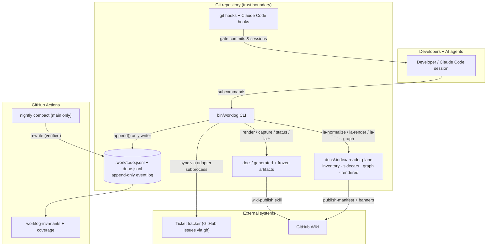
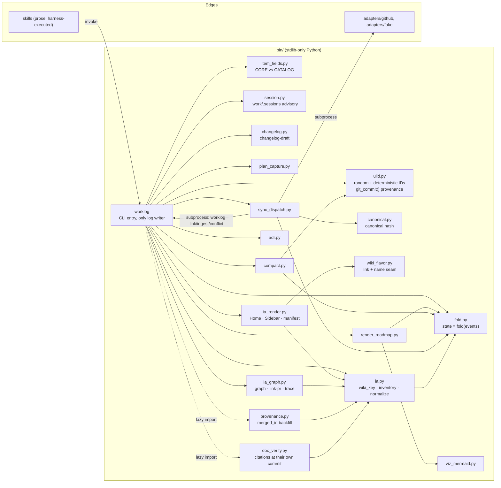
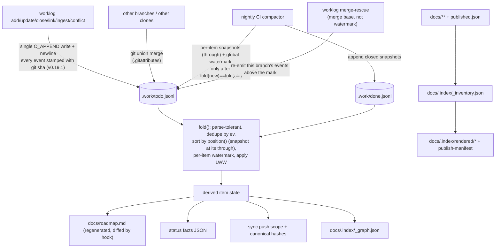
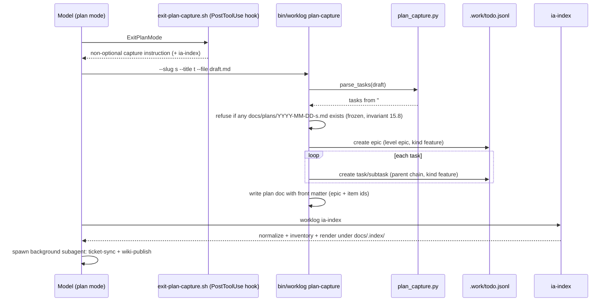
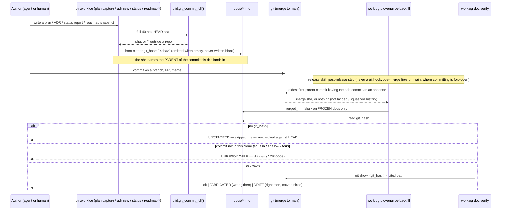
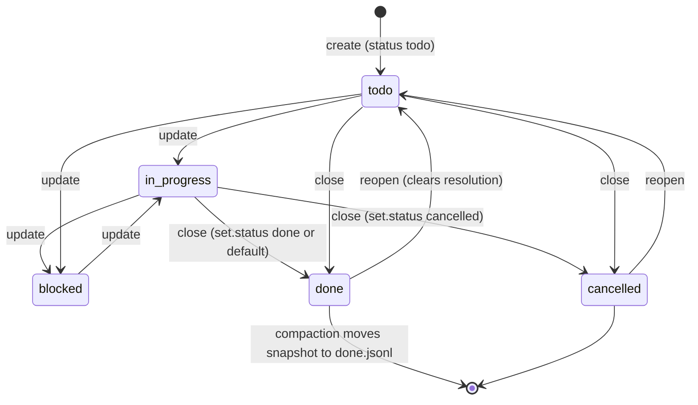
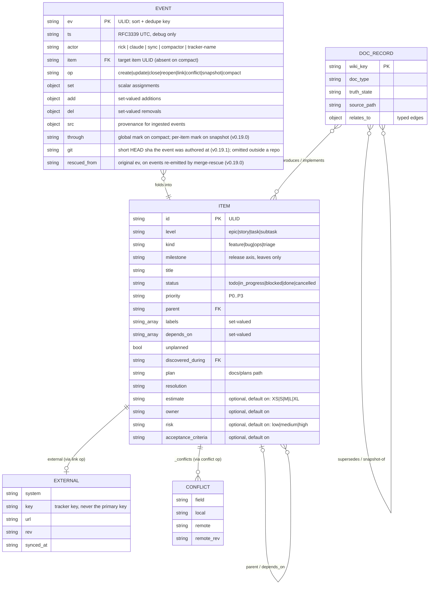
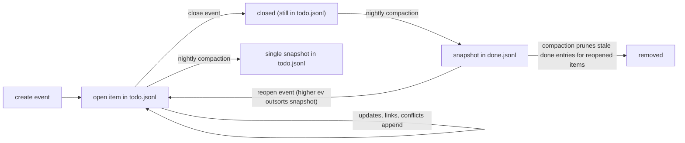

# Worklog — Software Design Document

# 1. Document Overview

**Purpose.** Describe the design of *worklog*, a local-first, git-native work-tracking
layer for agentic coding, as actually implemented in this repository at v0.22.1.

**Audience.** Junior developers who need implementation-level guidance; project
managers who need scope, dependencies, risks, and behavior.

**Scope.** The `bin/` CLI and its Python modules, the append-only event log under
`.work/`, the git hooks, the typed adapter contract and shipped adapters, the
**plugin packaging for both supported hosts** — Claude Code
(`plugin/.claude-plugin/plugin.json`) and, new in v0.22.0, Codex
(`plugin/.codex-plugin/plugin.json`) — GitHub Actions CI, the generated/frozen
document artifacts under `docs/`, and the Information Architecture (IA) reader
plane under `docs/.index/` (inventory, sidecars, rendered pages, traceability
graph).

**Out of scope.** The prose content of individual skills (`plugin/skills/*`,
`.claude/skills/*`) beyond their contracts with the deterministic core; the
harnesses (Claude Code, Codex) themselves beyond the loader contracts this
repository must satisfy (§9.12); the separate UI repo (`wiki_ticket_sdd_ui`)
cancelled from this work log in the v0.13.0 cycle.

**Related documents.** `docs/worklog-spec.md` (the normative spec),
`docs/adr/0001..0008` (Architecture Decision Records — 0008 is the most recent,
added in v0.21.0, and records what document provenance depends on;
**v0.22.0 and v0.22.1 added no ADR and no plan**, which is itself worth noting
— see §9.12 and §31), `plugin/PORTS.md` (the harness support matrix, rewritten
in v0.22.0), `plugin/CHANGELOG.md` §§0.22.0–0.22.1 (the narrative record for
this release pair, and the only *why* record either release has),
`docs/plans/` (the *why* record for everything before it, most recently
`docs/plans/2026-08-03-doc-provenance-and-verification.md` (v0.21.0), preceded
by `docs/plans/2026-08-02-trace-check-scope.md` and
`docs/plans/2026-08-02-plan-banner-state.md`, both v0.20.0),
`docs/migrations/0001-type-split.md`
and `0002-ia-content-model.md`, `adapters/README.md` (adapter authoring rules),
`docs/user_guide/` (task-oriented guides), `docs/integrations/` (eleven per-system
setup guides plus an index, new in v0.16.0), and the companion
`docs/designs/current_code_walkthrough.md`.

**Definitions.**

| Term | Meaning |
|---|---|
| ULID | Universally Unique Lexicographically Sortable Identifier: 48-bit ms timestamp + **80 bits of entropy, always** (`ulid.new()`), Crockford base32, 26 chars. Lexicographic sort == time sort. |
| Fold | Deriving item state by replaying the event log in `ev` order (`bin/fold.py`). |
| Compaction | The only file rewrite: replaces folded history with `snapshot` events plus a `compact` watermark (`bin/compact.py`). |
| `through` | The highest `ev` a compaction actually folded. On a `compact` line it is the global mark; on a `snapshot` (v0.19.0) it is **per item**, and is both what the fold drops against and where the snapshot sorts (ADR-0007). |
| `git` (event field) | Provenance: the short HEAD sha an event was authored at (`ulid.git_commit()`, v0.19.1). Never part of the id. |
| Canonical hash | `sha256(canonical_json(HASH_FIELDS))[:16]` (`bin/canonical.py`) — the sync change-detector. |
| Marker | The `worklog:<ULID>` token embedded in every pushed ticket body; the idempotency key. |
| Adapter | A single executable translating canonical JSON to one tracker's CLI; dumb by contract. |
| Skill | Prose instructions the harness model executes; the non-deterministic edge of the system. |
| LWW | Last-writer-wins, per field, ordered by `ev`. |
| `git_hash` (front matter) | **The tree a *document* was written against** — the full 40-hex HEAD sha at authoring time (`ulid.git_commit_full()`, v0.21.0). At stamping time that is the commit *before* the one the document lands in; a commit cannot know its own sha. |
| `merged_in` (front matter) | The commit on the default branch that first carried a **frozen** document, backfilled after it lands (`bin/provenance.py — merged_in()`, v0.21.0). |
| Fabricated (citation) | A `path — symbol(), lines N–M` claim that was **already wrong in the tree its author had open**. A defect. |
| Drift (citation) | A claim that was right when written and whose code has moved since. Expected in a frozen document; a defect only in a document claiming to describe HEAD. |
| wiki_key | Stable logical page identity (e.g. `plan/ia-content-model`, `design/current-design-doc`); the key `published.json` already used, formalized in the IA model. |
| truth_state | `current` / `snapshot` / `superseded` / `archived` — orthogonal to lifecycle `status`; tells readers whether a page is live truth or historical evidence. |
| Sidecar | `docs/.index/<wiki_key>.yml` — metadata for frozen docs that must never be edited in place. |
| Reader plane | Generated navigation under `docs/.index/` (inventory, rendered Home/Sidebar/indexes, publish manifest, traceability graph). |
| Host manifest | The one file per harness that makes the shared `plugin/` tree installable there: `plugin/.claude-plugin/plugin.json` (Claude Code, Grok Build) and `plugin/.codex-plugin/plugin.json` (Codex, v0.22.0). Everything else in `plugin/` is shared verbatim. |
| Hook manifest | The event→command map a host manifest points at. **The event map must sit under a top-level `hooks` key**; a manifest that declares events at the document's top level is valid JSON that loads zero hooks, silently (§9.12). |
| `CLAUDE_PLUGIN_ROOT` | The environment variable both hosts set for plugin-sourced hook commands. Because Codex sets it too, the hook scripts needed no porting — the name is Claude-flavoured and the contract is not. |

**Assumptions** are labeled **Assumption**; unverified points are **Open Question**;
everything else in this document is **Confirmed** against the repository at the
commit in the frontmatter.

# 2. Executive Summary

Worklog makes work-in-progress visible without a server. Work items live as an
append-only JSONL event log inside the repository (`.work/todo.jsonl`,
`.work/done.jsonl`); every derived artifact — the roadmap, status reports, Mermaid
visualizations, ticket pushes, wiki pages, and (since v0.13.0, extended in v0.14.0)
the IA reader plane — is computed from that log and the committed docs tree. Three
properties drive the design (spec §1): visible WIP, plans produce tickets, and a
generic core with pluggable edges.

Main workflows:

- **Track work**: `worklog add/update/close/reopen` appends events; `worklog list/show/fold`
  reads derived state.
- **Capture plans**: exiting plan mode triggers a hook that forces
  `worklog plan-capture`, which writes a frozen plan document and creates an epic
  plus its tasks in one pass, then `ia-index` refreshes the reader plane.
- **Generate the roadmap**: `worklog roadmap-render` is a pure function of the log;
  a pre-commit hook regenerates and diffs it, so a stale or hand-edited roadmap
  cannot be committed.
- **Sync tickets**: `worklog sync` drives a typed dispatcher
  (`bin/sync_dispatch.py`) that pushes/pulls through a per-tracker adapter
  executable, with idempotency, echo suppression, and conflict recording enforced
  in the dispatcher, never in adapters. Rich ticket bodies come from
  `worklog ticket-body` (traceability projection). **v0.18.0** adds the missing
  uniqueness rule on the other side of that link: one remote ticket has exactly
  one local owner (§9.6), enforced at `worklog link`, at `worklog sync`, and
  undoable through the new `worklog unlink`.
- **Report status**: `worklog status --emit-facts` produces deterministic facts;
  a skill writes the prose; `worklog status --write` freezes the report.
- **IA / content model (v0.13.0, extended v0.14.0)**: `worklog ia-normalize`
  backfills `wiki_key` + `truth_state` (sidecars for frozen docs, in-place for
  live docs); `ia-inventory` / `ia-render` / `ia-graph` materialize the reader
  plane and traceability graph; `trace-check` reports unlinked evidence; gates
  are warn-level until Phase 5. **v0.14.0** extends the reader plane past
  documents to *artifact pages* — one generated page per work item, PR, and
  release (`bin/ia_render.py — render_item_page()/render_release_page()/
  render_pr_page()`), reusing the same graph edges rather than storing new
  fields; `worklog ia-ticket <ULID>` previews a ticket page without a full
  render pass. The published-page manifest grew from 51 entries to 258.
- **Integration guides (v0.16.0)**: a new prose-only edge, `integration-guide`
  (`plugin/skills/integration-guide/SKILL.md`), points an agent at a
  wiki-hosted setup guide for one of eleven named systems — the four SDD tools
  this repo composes with (Superpowers, GSD, SpecKit, OpenSpec) and seven
  ticket/wiki systems only one of which (GitHub) has a real adapter (Jira,
  Confluence, GitHub, GitLab, Azure DevOps, AWS CodeCatalyst, Google Cloud
  DevOps). It ships zero new Python: `WebFetch` reads the live
  `Integration-<Name>` wiki page (with a redirect-to-Home detector, since a
  GitHub wiki 200s a missing slug instead of 404ing), and on fetch failure or a
  failed verification falls back to a bundled local copy,
  `docs/integrations/fallback-<key>.md` (eleven files + `docs/integrations/README.md`
  index, registered through the existing `worklog wiki-add` + wiki-publish
  pipeline — no new publish path).
- **Merge safety (v0.19.0, the release's centre of gravity)**: the compaction
  watermark became **per item** and snapshots now sort where their events were
  (§9.7, ADR-0007), closing a silent data-loss class; `worklog merge-rescue`
  (`compact.merge_rescue()`) repairs a merge the resurrection guard blocked by
  reasoning from the **merge base** rather than the watermark; `hooks/pre-commit`
  gained a conflict-marker guard with deliberately **no** merge exemption.
- **Provenance without spending identity (v0.19.1)**: every CLI-written event
  carries a `git` field — the short HEAD sha it was authored at
  (`bin/worklog — base()`, `ulid.git_commit()`). v0.19.0 briefly spent five of
  the id's entropy characters on that hash; that was reverted. `ulid.new()`
  keeps the full 80 bits, because an id is issued once and its only job is not
  to clash. Provenance lives in the event, never in the id (§9.8).
- **The gates that judge this repo, corrected (v0.20.0)**: `trace-check` now
  applies the scope its docstring always claimed — `ia_graph.in_trace_scope()`
  is a filter rather than a printed label, and `kind:ops` / `unplanned` carry
  the two exemptions the project's own conventions already imply (§9.10). 401
  gaps across 214 items became 16. Separately, a plan's wiki banner names its
  own state from the leading word of its free-prose `status`
  (`ia_render.PLAN_STATE` / `_plan_state()`), falling back to byte-identical
  output when the prose is unrecognised (§8.7). Both are read-side only: no
  event, graph edge, or sidecar changed shape.
- **Documents enter git time, and a gate reads it back (v0.21.0)**: every generated document is stamped with the commit its
  claims were read against (`git_hash`), frozen documents get the merge that
  landed them (`merged_in`) backfilled by `worklog provenance-backfill`, and
  `worklog doc-verify` resolves each `path — symbol(), lines N–M` citation **at
  that commit** rather than at HEAD. That is what separates a *fabricated*
  citation from *drift* (§9.11, ADR-0008). Riding with it: the publish manifest
  hashes a document's **body**, below its front matter, so a metadata stamp no
  longer looks like an edit (`ia_render._body_hash()`).
- **Two hosts, one package (v0.22.0)**: `plugin/.codex-plugin/plugin.json` makes
  the same `plugin/` tree installable in Codex, and
  `plugin/hooks/codex-hooks.json` wires the *same shell scripts* — not ports of
  them — into Codex's `UserPromptSubmit`, `Stop` and `SessionStart` events.
  Nothing needed translating: Codex sets `CLAUDE_PLUGIN_ROOT` for
  plugin-sourced hooks and reads the same `hookSpecificOutput` /
  `additionalContext` JSON the scripts already emit, so only the manifest
  differs. One hook deliberately does **not** port — plan capture matches the
  `ExitPlanMode` *tool*, which Codex does not have, so shipping it would be dead
  configuration that reads like coverage (§9.12).
- **Every plugin hook had silently never fired (v0.22.1, and the single most
  important fact in this release pair)**: `plugin/hooks/hooks.json` declared its
  event map at the top level; the loader reads it from under a top-level `hooks`
  key. The file was valid JSON, so nothing failed and nothing warned — the
  loader simply found no events, and every installed copy of this plugin ran
  with zero hooks, including the plan-capture hook the product is partly built
  around. It could not be found from inside this repository, whose own sessions
  wire the same scripts through settings rather than through the plugin loader:
  the tooling worked for the people building it and not for the people
  installing it. Three tests now cover the *class* rather than the instance
  (§9.12, §28).
- **`merge-rescue` could hand an item back in an older state than it went in
  with (v0.22.0)**: re-issuing is now contagious forward within an item, and a
  second, independent guard verifies that sorting by the new ids gives every
  item the same sequence its original ids did (§9.7,
  `bin/compact.py — merge_rescue(), lines 345–489`).
- **`sync --dry-run` was silent on the one path where a field write is least
  expected (v0.22.0)**: the close path returned early and printed only
  `would close #123`, even when the item was dirty and the real run would push
  its final shape first. The dry run now predicts exactly what the real run does
  (`bin/sync_dispatch.py — push_items(), lines 530–697`).
- **Seven dispatcher tests were never running (v0.22.0)**:
  `tests/test_dispatch.py` carried its run-as-a-script block mid-file, so every
  class below it was defined but never registered — and CI runs these files as
  scripts. 20 of 27 ran. At this tag the block sits at the end of the file
  (`tests/test_dispatch.py:449`) and all 29 run. The hidden class covered
  overwrite reporting *including the dry-run defect fixed in the same release*,
  so that defect sat underneath tests that could not fail (§28).
- **Four new support modules (v0.19.0)**: `session.py` (advisory
  concurrent-session registry under `.work/.sessions`), `changelog.py`
  (`worklog changelog-draft`), `item_fields.py` (configurable optional item
  fields, `worklog fields`), `wiki_flavor.py` (the renderer's single wiki
  platform seam).

Major components: the `worklog` CLI (the API, 1562 lines), `fold.py` (state
derivation, 372 lines), `compact.py` (the only rewriter plus `merge_rescue()`,
534 lines), `render_roadmap.py` (286) + `viz_mermaid.py` (180) (generated docs),
`sync_dispatch.py` (867 lines) + `adapters/` (ticket sync), `ia.py` (624) /
`ia_render.py` (808) / `ia_graph.py` (549) (reader plane + graph + artifact
pages + `worklog find`), `adr.py` (217) / `plan_capture.py` (90) /
`canonical.py` (35) / `ulid.py` (151), the four v0.19.0 support modules
`session.py` (131) / `changelog.py` (159) / `item_fields.py` (202) /
`wiki_flavor.py` (110), and the two v0.21.0 provenance modules
`provenance.py` (155) / `doc_verify.py` (232) — plus git hooks, GitHub Actions,
the Claude Code plugin, and (v0.16.0) the `integration-guide` skill +
`docs/integrations/` content, the first edge in this repo built entirely from
prose and existing primitives, no new `bin/` code.

External dependencies: git (union merge), the `gh` CLI (GitHub adapter and
merge-when-green), Python 3 stdlib only — **zero third-party runtime dependencies**
(Confirmed: no requirements file; `tests/` use stdlib `unittest`).

Primary risks: hosted platforms don't run merge drivers server-side (PR-level
conflicts on the log — settled deliberately in ADR-0005), wall-clock LWW ties,
and compaction as the single state-rewriting operation (mitigated by
fold-equality verification). The IA gates are no longer a risk item: three of
the four were promoted to hard failures in v0.19.0 (#98); `trace-check` stays
warn-level at commit time by design and `--strict` at release. What remains open
there is that `--strict` is named as the pre-release evidence gate in prose and
enforced by no CI job — deliberately deferred until the remaining gaps are
driven to zero and held there for a release. `doc-verify` deliberately sits in
the same tier for the same reason (§9.11): warn-level in `hooks/pre-commit`,
`--strict` in the release skill and inside the design-docs skill, because it
reports on documents the commit in flight may not touch.

# 3. Requirements Summary

Functional requirements (Confirmed, from spec §2 and the implementation):

| # | Requirement | Component |
|---|---|---|
| R1 | Append-only, mergeable event log of work items | `bin/worklog — append()`, `.gitattributes` union merge |
| R2 | Deterministic state derivation from the log | `bin/fold.py — fold()` |
| R3 | Generated, CI-guarded roadmap | `bin/render_roadmap.py`, `hooks/pre-commit` |
| R4 | Plan capture: plan doc + epic + tasks in one operation | `bin/worklog — cmd_plan_capture()`, `bin/plan_capture.py` |
| R5 | Idempotent bidirectional ticket sync | `bin/sync_dispatch.py`, `bin/canonical.py`, `adapters/*` |
| R6 | Deterministic ingestion of remote changes | `bin/ulid.py — deterministic()`, `bin/worklog — cmd_ingest()` |
| R7 | Conflict recording, never silent overwrite | `cmd_conflict()`, `fold._apply_mutations()` conflict clearing |
| R8 | Log compaction preserving fold equality | `bin/compact.py — compact()`, `.github/workflows/compact.yml` |
| R9 | Frozen status reports with deterministic facts | `bin/worklog — cmd_status()`, `_status_facts()` |
| R10 | Work taxonomy (level/kind/milestone) with write-time validation | `check_taxonomy()`, `fold._normalize_taxonomy()`, `hooks/pre-commit` |
| R11 | Wiki publish ledger with stable page identity | `_register_published()`, `.work/published.json` |
| R12 | ADRs with once-written bodies and supersede chains | `bin/adr.py`, `worklog adr new|list|check` |
| R13 | Green-gates merging, never bypassed | `plugin/scripts/merge-when-green.sh`, ADR-0003 |
| R14 | IA content model: wiki_key, truth_state, inventory, reader plane, traceability | `bin/ia.py`, `ia_render.py`, `ia_graph.py`; plan `docs/plans/2026-07-22-ia-content-model.md`; migration 0002 |
| R15 | Branch discipline: commits never land directly on main/master; every commit message references a worklog item or ticket | `hooks/pre-commit` branch-guard block, `hooks/commit-msg`; plan `docs/plans/2026-07-25-branch-discipline-hooks.md` |
| R16 | One local owner per remote ticket; a link is retractable; nothing may fail or diverge between mutating remote state and recording it (v0.18.0) | `fold.external_owners()`, `cmd_link()`/`cmd_unlink()`, `Dispatcher.push_items()`/`is_dirty()`/`record_link()`, `adapters/github/adapter — create_issue()`; plan `docs/plans/2026-07-28-one-owner-per-external-key.md` |
| R17 | A merge never loses an event a compaction did not fold; a blocked merge has a runnable remedy (v0.19.0) | `fold.apply_watermark()` (per item) + `fold.position()`, `compact._snapshot()`'s `through`, `compact.merge_rescue()`, `hooks/pre-commit` conflict-marker guard; ADR-0005/0006/0007 |
| R18 | Optional item fields are configurable per team, and a disabled field is invisible rather than rejected (v0.19.0) | `bin/item_fields.py — CORE`/`CATALOG`/`add_arguments()`/`collect()`, `.work/config.yml — work_item_fields`, `worklog fields`; plan `docs/plans/2026-08-01-configurable-item-fields.md` |
| R19 | Every event records where it came from, without spending id entropy (v0.19.1) | `ulid.git_commit()`, `bin/worklog — base()`, `compact._snapshot()`/`_compact_line()`; `tests/test_ulid.py — TestEntropyIsNeverSpent`/`TestEventProvenance` |
| R20 | The renderer targets one wiki platform through one seam, not forty call sites (v0.19.0) | `bin/wiki_flavor.py — Gollum`/`render_links()`/`get()`, `ia_render.use_flavor()`/`_links()`/`page_name()` |
| R22 | Every generated document records the commit its claims were read against, and every frozen one records the merge that landed it (v0.21.0) | `ulid.git_commit_full()`, `plan_capture.front_matter()`, `adr.scaffold()`, `bin/worklog — cmd_status()`/`cmd_roadmap_snapshot()`, `render_roadmap.render()`, `ia_render.build_manifest()`, `bin/provenance.py — backfill()`; ADR-0008 |
| R23 | A document's code citations are verifiable against the tree its author had open, and a fabricated citation is distinguishable from drift (v0.21.0) | `bin/doc_verify.py — citations()`/`_check_one()`/`verify()`/`failing()`, `worklog doc-verify [--strict]`, `hooks/pre-commit`; `tests/test_provenance.py` |
| R21 | The evidence gate interrogates exactly the set it claims, and a banner never labels state it cannot read (v0.20.0) | `ia_graph.in_trace_scope()` + `trace_check()`'s `unplanned` carve-out; `ia_render.PLAN_STATE`/`_plan_state()`; plans `docs/plans/2026-08-02-trace-check-scope.md`, `docs/plans/2026-08-02-plan-banner-state.md`; `tests/test_trace_scope.py`, `tests/test_ia.py — TestBanner` |
| R24 | A hook this project declares actually reaches the harness that loads it, on every supported host, and a skill that fails to parse is caught rather than loaded empty (v0.22.1) | `plugin/hooks/hooks.json` and `plugin/hooks/codex-hooks.json` (both wrapped under a top-level `hooks` key); `tests/test_plugin.py — TestCodexHookParity, lines 145–243` and `TestSkillFrontmatterLoads, lines 246–283` |
| R25 | The same skills and enforcement hooks install on a second host without forking the scripts (v0.22.0) | `plugin/.codex-plugin/plugin.json`, `plugin/hooks/codex-hooks.json`, `plugin/PORTS.md`; `tests/test_plugin.py — test_both_hosts_run_the_same_scripts(), lines 222–233` |
| R26 | A merge rescue never returns an item to a state it had already left, and refuses rather than reordering (v0.22.0) | `bin/compact.py — merge_rescue(), lines 345–489`; `tests/test_bug_merge.py — TestRescueKeepsPerItemOrder, lines 327–409` |
| R27 | A dry run predicts every field write the real run would make, on the close path as well as the update path (v0.22.0) | `bin/sync_dispatch.py — push_items(), lines 530–697`, `note_overwrite(), lines 514–528`; `tests/test_dispatch.py — test_dry_run_reports_overwrites_on_the_CLOSE_path_too(), lines 398–415` |

Non-functional: no runtime dependencies beyond Python 3 + git; appends atomic under
`PIPE_BUF` (body capped at `MAX_BODY = 2048`, `bin/worklog` line 32); corrupt input
never fatal (`fold.read_lines()`); CI coverage floor ≥80% on `bin/*.py`
(`.github/workflows/worklog.yml`, `--fail-under=80`), target 95%; local-only
degradation when edge tooling is missing (spec invariant 15.10); IA index
artifacts are byte-deterministic (no wall clock) so freshness gates can
regenerate-and-diff — a constraint v0.21.0 tightened rather than relaxed: the
two modules on that regenerate-and-diff path, `ia_render.py` and
`render_roadmap.py`, still shell out to nothing, and the roadmap's own
`git_hash` is read off the newest event's `git` field instead
(`render_roadmap.py — top_event(), lines 28–52`). Every git call in the
provenance story lives in `bin/provenance.py` and `bin/doc_verify.py`, off that
path, and both are imported lazily by the CLI.

Availability/scalability: single-repo, single-team scale by design; compaction
bounds log growth (spec §7 trigger: nightly or >5000 lines). Disaster recovery is
git itself: the log is committed history.

# 4. System Context

Actors: developers and AI agents (writers via the CLI), the compactor (CI), the
sync actor, remote trackers, the wiki, and readers (PMs reading generated docs and
the IA Home/indexes). Trust boundary: everything inside the repo is trusted;
adapters and `gh` cross the network boundary; skills run in the harness model.



*How to read it:* every state change funnels through the CLI into the log; CI and
hooks are gates, not writers (except the nightly compactor). The tracker and wiki
are mirrors — the log is the source of truth (spec §2 non-goals). The IA plane is
generated from docs + fold; it never writes the event log.

Inputs: CLI invocations, adapter pull output (NDJSON), plan drafts, status prose on
stdin. Outputs: log events, `docs/roadmap.md`, `docs/plans/*`, `docs/status/*`,
`docs/adr/*`, `docs/.index/*`, ticket pushes, `sync report` lines.

# 5. High-Level Architecture

Layers, all Confirmed from imports:

- **Identity**: `ulid.py` (no imports from siblings; `subprocess` imported lazily
  inside `git_commit()`).
- **State**: `fold.py` (stdlib `json`/`sys`/`typing` only; no sibling imports).
- **CLI/API**: `bin/worklog` imports `ulid`, `fold`, `item_fields` at module
  level; lazily imports `render_roadmap`, `plan_capture`, `compact`,
  `sync_dispatch`, `adr`, `ia`, `ia_render`, `ia_graph`, `changelog`, and
  `session` (the last inside `_warn_concurrent_sessions()` under a bare
  `except`, because an advisory must never break a write).
- **Rendering**: `render_roadmap.py` imports `ulid`, `fold`; `viz_mermaid.py`
  imports `ulid`, `fold` and is imported lazily by `render_roadmap.render()`.
- **Sync**: `sync_dispatch.py` imports `canonical` and `fold.external_owners`;
  drives adapters and the CLI as subprocesses.
- **IA plane**: `ia.py` imports `fold`; `ia_render.py` / `ia_graph.py` import `ia`
  (and fold-derived items where needed); `ia_render.py` additionally imports
  `wiki_flavor` (v0.19.0).
- **Support (v0.19.0)**: `session.py`, `changelog.py`, `item_fields.py`,
  `wiki_flavor.py` — each stdlib-only and each importing no sibling module, so
  none of them can become a second source of truth for anything the fold owns.
- **Provenance (v0.21.0)**: `provenance.py` and `doc_verify.py`, each importing
  only `ia` plus stdlib `subprocess`. They exist as separate modules for one
  structural reason, stated in `provenance.py`'s own docstring: `ia.py` promises
  "no wall clock, no environment" and `ia_render.py` promises **no git commands
  at all**, and the freshness gates regenerate-and-byte-compare whatever those
  two produce. Every `git` subprocess in the provenance story is therefore kept
  off that path, and `bin/worklog` imports both lazily inside their command
  functions (`cmd_provenance_backfill(), lines 812–821` and
  `cmd_doc_verify(), lines 824–837`).
- **Automation**: `hooks/` (git + Claude Code), `.github/workflows/`,
  `plugin/` (packaged copies of the same scripts).



*How to read it:* arrows are imports or subprocess calls; dotted arrows are lazy
imports. Note the loop `SD → WL`: the dispatcher never appends to the log
directly; it shells back into `worklog` (invariant 15.4,
`sync_dispatch.py — worklog(), lines 249–259`). Note also that nothing points
from `IAR` or `RR` to `PROV`/`DV`: the render plane's freedom from git
subprocesses is an invariant, and `tests/test_provenance.py —
TestNoGitOnTheRegenerateAndDiffPath` pins it by putting a failing `git` on
`PATH` and rebuilding both artifacts.

**Data flow of the event log + IA plane:**



*Assumptions/failure behavior:* union merge duplicates and scrambles lines — the
fold's dedupe/sort absorbs that; a corrupt line costs itself only
(`fold.read_lines()`). IA artifacts are pure functions of committed files; a
stale index is a **hard** pre-commit failure since v0.19.0 for
normalize/inventory/render, and a warning for `trace-check`.

Deployment architecture is §27; trust boundaries §22.

# 6. Architectural Decisions

The repo keeps ADRs in `docs/adr/`; this section summarizes and links (per ADR
tooling, `bin/adr.py`).

**ADR-0001 — Append-only event log + fold + union merge** (accepted).
State is never stored; it is a fold over immutable events, merged by git's
built-in union driver. Alternatives rejected: state files (merge conflicts clobber
teammates), CRDTs (correct but heavy). Consequences absorbed: arbitrary post-merge
line order and duplicates (fold sorts/dedupes), wall-clock LWW ties, and the
hosted-platform caveat (GitHub does not run merge drivers server-side — spec §8.1).

**ADR-0002 — Skill-based edges hardened by a typed adapter contract** (accepted).
The 1.2 spec's per-system adapter binaries never shipped; v1.4 moved integration to
skills (the model already knows these systems); v1.6 restored the three invariants
that had regressed to prose — idempotency, pull parsing, capability degradation —
as code in the dispatcher, with adapters kept as generated dumb translators.
`tests/test_adapter_contract.py — test_adapters_contain_no_invariant_logic()`
bans `sha256`, `last_pushed_hash`, `canonical_json`, `search`, and
`sync-state` from every adapter source.

**ADR-0003 — Green-gates merging** (accepted). PRs merge only when every check is
green; `merge-when-green.sh` polls (default 300 s, 24 attempts) and treats "no
gates reporting" as *not* passing (exit 4 timeout). Never `--admin`.

**ADR-0004 — Clearing a dead ticket link stays a human decision** (accepted,
2026-08-01). Adapter exit 3 (GONE) no longer clears `last_pushed_hash` and
re-pushes forever (#241). The dispatcher buffers not-founds in `pending_gone`,
records a `gone_key` in per-item sync state at the end of `push_items()` via
`commit_gone()` so an aborted run leaves nothing behind, and aborts the whole
run once `GONE_ABORT = 3` not-founds arrive with nothing having succeeded —
the signature of a misconfigured project or credential, not three deleted
tickets. Re-linking is the operator's call (`worklog unlink`, then file a
fresh one); a rc-0 for the same item pops the stale `gone_key`, so a ticket
restored from the tracker's trash re-enters scope by itself.

**ADR-0005 — No custom merge driver for the event log** (accepted, 2026-07-31).
Settles the question #243 left open. Union merge stays and the detector stays,
on three independently sufficient findings: GitHub never runs a merge driver
server-side and fails *closed* (it refused the merge outright); the local path
is already covered by `check_resurrection`, which caught 55 resurrected events
and blocked the commit; and driver registration lives in per-clone config that
does not travel with the repository, so a contributor who never ran the
installer would silently merge without it. Explicitly does **not** supersede
ADR-0001.

**ADR-0006 — Resurrected events are not always cosmetic** (accepted,
2026-08-01). Corrects a factually wrong claim in ADR-0005's first consequence.
ADR-0005 classified `check_resurrection` as a *hygiene* guard on the reasoning
that "the fold discards resurrected events on read, so no state is ever
corrupted." That is true for an event the compaction actually folded and false
for one it never saw: the watermark was `max_ev` over the log the compaction
read — a **time** marker doing a **content** marker's job — so an event created
on a branch before a compaction ran on main was never folded into any snapshot,
yet still sorted below the mark and was silently discarded on merge.
Reproduced deterministically; the live 2026-07-31 incident carried three such
events (an `in_progress` and two closes, one of them an epic) which survived
only because the guard blocked and a human re-applied them by hand. The guard
was therefore reclassified a **correctness** guard and may not be demoted, and
recompaction was ruled out as a remedy — it verifies `fold(new) == fold(old)`
against a fold that has *already* discarded the events, so it would pass while
making the loss permanent. `worklog merge-rescue` replaces it. Note this record
also states the ULID caveat that `merge_rescue._reissue()` depends on:
`ulid.new()` has no intra-millisecond counter, so anything re-emitting a
sequence must hand in explicit increasing timestamps.

**ADR-0007 — The compaction watermark is per item** (accepted, 2026-08-01).
The fix ADR-0006 deferred, and it is a WORKLOG-SPEC §7 format change, which is
why it got its own record. Three changes, all required (§9.7): `_snapshot`
carries a per-item `through`; `apply_watermark` drops per item and never drops
events for an item with no snapshot at all; and `fold.position()` sorts a
snapshot at its `through` rather than its own `ev`. The third exists because
implementing only the first two left half the bug in place — a snapshot's `ev`
is minted at compaction time, so it sorts above everything, and since a
snapshot *replaces* state a branch's later close was applied first and
immediately erased. A test caught that; the fix would otherwise have passed its
own regression test and looked done. Consequence worth carrying: with the
narrower question now being "would the fold actually drop this line?",
`check_resurrection` is a **hygiene** guard again — which is what ADR-0005
originally said and ADR-0006 correctly denied *for the code as it then stood*.
Neither record is superseded; both were right about their own moment. The guard
still blocks the merge commit, but now to route people to `merge-rescue`, not
because state is at risk.

**ADR-0008 — Document provenance depends on merge commits** (accepted,
2026-08-03). The assumption underneath `git_hash` written down before someone
changes it by accident: **the stamped commit must still be reachable in a fresh
clone.** It holds because this repository merges with merge commits — 134 of
them across 404 commits at the time of writing, every one a `Merge pull request
#N` — so a feature branch's commits become ancestors of `main` and survive.
Under squash-merge they would not: the branch commit never reaches `main`, it
survives only as `refs/pull/N/head` which a normal clone does not fetch, and
every stamp would name a commit nobody has. The decision is therefore not "make
it squash-proof" but "record what it rests on, and refuse rather than degrade":
when a stamped commit cannot be resolved, `doc_verify` reports `unresolvable`
and **skips the document**. Falling back to HEAD would re-create #294 exactly —
citations checked against the wrong tree, reporting drift as fabrication and
fabrication as fact, while looking like it worked. Alternatives rejected and why
they matter: a content hash instead of a commit is squash-immune but answers
"has this file changed?" rather than "what did `bin/fold.py` look like when this
was written?", which is the only question a citation check can ask; tagging every
stamped commit is hundreds of meaningless refs and still fails for documents
written before the scheme existed. Consequence made explicit: GitHub's
squash-merge branch-protection toggle is now load-bearing.

**IA content model (plan + migration 0002, not yet a numbered ADR).** Two planes:
storage stays path-organized by how docs are produced; navigation is a generated
reader plane keyed by `wiki_key`. Frozen docs never receive in-place metadata
edits — sidecars hold additive fields (invariants 15.8/15.9). Doc schema and entity
schema are deliberately split (`schema/doc.schema.json` vs
`schema/entity.schema.json`, mirrored in `bin/ia.py` constants) so work items can
enter the graph without pretending to be documents (Confirmed: schema split item
01KY5QV5G0 / #111).

**Artifact pages (v0.14.0, plan `docs/plans/2026-07-24-artifact-pages.md`).**
Extends the same reader plane to tickets, PRs, and releases, which previously
existed only as bare stub nodes in the graph. Two decisions confirmed with the
project owner before build: (1) **no new stored fields** — a page's hierarchy,
linked PRs, and release are derived at render time from existing graph edges
(`ia_graph.item_links()`), not cached into the item or a sidecar, because a
stored copy would be a second, driftable source of truth the sidecar rule
already forbids; (2) **live PR metadata is out of scope this pass** — no code
anywhere in the repo calls `gh pr view`, so "files changed" and CI/review
status render as "not tracked" on PR pages, and the live sync is filed as a
separate follow-up (#138) rather than silently dropped.

Decisions not (yet) in ADRs, recorded in plans/spec:

| Decision | Rationale | Where |
|---|---|---|
| Deterministic ULIDs for ingested events | Two clones polling the same remote change must append byte-identical lines so dedupe collapses them; a random `ev` silently reverts local edits | `bin/ulid.py — deterministic()`; spec §10.2; `tests/test_ulid.py — TestTheBugThisPrevents` |
| Canonical hash over exactly ten fields | Echo suppression and skip-unchanged; changing the field set churns every hash (accepted once, in the taxonomy migration) | `bin/canonical.py — HASH_FIELDS` |
| Config/policy split, `AGENTS.md → CLAUDE.md` symlink | One policy for every harness; scripts read only `.work/config.yml` | spec §4.1 |
| No YAML library | Stdlib-only; naive block scans where needed | `bin/worklog — _config_system()`; `ia.parse_front_matter()` |
| Embedded schemas mirrored from `schema/` | Installed repos ship `bin/` without `schema/`; tests assert the copies match | `sync_dispatch.py — CAPABILITIES_SCHEMA`; `ia.REQUIRED_*`; `tests/test_ia.py — TestSchemaSync` |
| Body cap is a constant, not a setting | Derived from `PIPE_BUF`; "a knob whose only valid value is the default is a trap" | `.work/config.yml` trailing comment; `bin/worklog` line 32 |
| Frozen artifacts (plans, snapshots, status, ADR bodies) | Documents people acted on are history, not caches | spec §13.2–13.3; existence refusals; ADR supersede-only |
| Hooks, not hope | "A CLAUDE.md instruction holds maybe 80% of the time. A hook holds 100%." | spec §12; `hooks/exit-plan-capture.sh` |
| Sidecars over frozen-doc rewrite | Would otherwise violate §15.8/§15.9 | `ia.is_frozen()`, `ia.normalize()` |
| IA gates promoted to hard failures (v0.19.0) | The warn-only rollout is over (#98). Promotion is safe because the block is additionally guarded on `-d docs/.index` — "has this repo opted **into** the IA?", not merely "does it have the code?" — so a scaffolded repo that has never generated an index is not blocked from its first commit, while a repo that has one stays fully enforced | `hooks/pre-commit` IA block |
| Provenance is a field on the event, never entropy in the id (v0.19.1) | An id is issued once and its only guarantee is non-collision, so entropy is not currency to spend on metadata. A per-event field also traces *better*: an item's id is minted once and could only ever name the branch the **item** was created on | `bin/ulid.py — new()`/`git_commit()` docstrings; `bin/worklog — base()`; `tests/test_ulid.py — TestEntropyIsNeverSpent` |
| Optional item fields are configurable; the core is not (v0.19.0) | The core is load-bearing — the fold keys on it, the roadmap reads it, sync maps it, the graph walks it. A config that could switch `priority` off is a config that can break the roadmap, so the knob simply is not offered. A *disabled* optional field gets no argparse flag at all, so it is invisible rather than rejected — which is what "never appears in prompts" has to mean for a CLI whose `--help` **is** the prompt | `bin/item_fields.py — CORE`, `CATALOG`, `add_arguments()` |
| `[[Page]]` is the renderer's canonical link notation, not Gollum output (v0.19.0) | Translation happens once at the output boundary (`render_links()`), so a second platform is one new class instead of edits to ~40 wikilink sites, and Gollum output stays byte-identical because for Gollum the translation is the identity. The seam is deliberately only `link()` + `sanitize()`: no page-layout, frontmatter, directory or `filename()` hook, because those would be guesses about a platform nobody has asked for | `bin/wiki_flavor.py` module docstring; `ia_render._links()`/`page_name()` |
| No YAML dependency for the two new config blocks (v0.19.0) | `work_item_fields` and `wiki.system` are each one flat block of scalars; both readers do a targeted block scan and treat anything malformed as "not configured", falling back to documented defaults rather than failing every command | `item_fields._config_block()`, `wiki_flavor.configured_system()` |
| The concurrent-session registry is advisory in both directions (v0.19.0) | Nothing here ever blocks a write, and a registry that is missing, stale or corrupt reads as empty. A bad advisory file must never be the reason someone cannot record work. Session identity comes from the harness because `worklog` is short-lived — pid, ppid and POSIX session id all turn over per tool call | `bin/session.py` module docstring; `bin/worklog — _warn_concurrent_sessions()` |
| `changelog-draft` never guesses the version and never silently drops a commit | Which digit moves is a semver judgement, so the placeholder stays literal `X.Y.Z` until `--version`; every exclusion is printed on stderr with its reason so stdout stays pipeable markdown | `bin/changelog.py` module docstring |
| Housekeeping is excluded by **path**, not by subject line | A commit that touched only `.work/`, `docs/.index/`, `docs/roadmap.md`, `docs/status/` or `docs/plans/` changed no behaviour a changelog reader cares about; matching on the subject would misclassify a real fix that happened to say "chore" | `bin/changelog.py — HOUSEKEEPING`, `_housekeeping()` |
| Uniqueness on `(external.system, external.key)` is a constraint, not an identity change (v0.18.0) | The ULID stays the only primary key and no lookup is done by external key; a `UNIQUE` index coexists with a surrogate primary key. Written into the spec so the next reader does not "fix" it back as a §5.4 violation | `docs/worklog-spec.md:273`; `fold.external_owners()` docstring; plan `docs/plans/2026-07-28-one-owner-per-external-key.md` |
| Sync **skips** contested items and exits 1, rather than refusing the whole run (v0.18.0) | Corruption needs *both* claimants pushed, so removing the set removes the path; every other item still syncs and pull still works — which is exactly what you want while repairing. Printed as its own block, not a `drift:` line, because drift is what operators skim and burying a live-corruption warning there reproduces the original silent failure in a new costume | `sync_dispatch.report_collisions()`, `push_items()`, `sync()` |
| `unlink` reuses the `link` op with `external: {}` (v0.18.0) | The fold already applies whole-field LWW to `external`, so an empty value *is* the retraction. No new op means no fold change and an un-upgraded clone still folds it correctly. `{}` and never `null`, because `cmd_list`'s `.get("external", {})` default never fires on an existing null key | `bin/worklog — cmd_unlink()`; `fold._apply_mutations()` |
| Create must return its own revision (v0.18.0) | A read-back after a mutation is a retryable failure *after* the mutation; with `op` still `create`, every dispatcher retry files another ticket. One call, or no atomicity | `adapters/github/adapter — create_issue()`; github#235 |
| `git_hash` means *the tree the document was written against*, not the commit it lands in (v0.21.0) | A commit cannot know its own sha, so at stamping time HEAD is the parent of the commit the document arrives in. That is the honest value and the one a reader diffing stale prose wants — the tree whose bytes the author actually read | `bin/ulid.py — git_commit_full(), lines 88–107`; plan `docs/plans/2026-08-03-doc-provenance-and-verification.md` |
| The sha is **full 40-hex and quoted**, both (v0.21.0) | `ia._scalar()` coerces an all-digit value to `int` *before* it considers quotes, so a 7-char short sha reads back corrupted roughly one time in 27 — and one with a leading zero reads back still sha-shaped, which is worse. Quoting is the direct fix; full length makes an all-digit value vanishingly unlikely rather than routine. Belt and braces, because this value is the anchor everything else in the story hangs from | `bin/ulid.py — git_commit_full(), lines 88–107`; `bin/ia.py — _scalar(), lines 100–117`; `plan_capture.front_matter(), lines 69–89`; `adr.scaffold(), lines 171–196` |
| The roadmap takes its `git_hash` from the newest **event**, never `git rev-parse` (v0.21.0) | `hooks/pre-commit` regenerates `docs/roadmap.md` and diffs it, so a HEAD-derived value is the parent commit on the run that writes the file and the current one on the next run — failing every commit thereafter. On a `pull_request` CI checkout it is worse: the sha is a synthetic `refs/pull/N/merge` commit that exists in no local clone, so no stored value could ever match | `bin/render_roadmap.py — top_event(), lines 28–52` and `render(), lines 133–281` |
| Provenance is stamped on documents, not on the 366 rendered pages (v0.21.0) | Each page under `docs/.index/rendered/` is a projection of the whole log by one build, so "the commit" is a property of the *build*, not of any page. Stamping all of them would be one fact copied 366 times, would move every `render_hash` at once, and would be invisible to every reader anyway — publish strips front matter | `bin/ia_render.py — build_manifest(), lines 664–740` |
| `merged_in` is backfilled onto **frozen** documents only (v0.21.0) | A frozen document is written once, so "the commit that landed it" is exact and stays true forever. A live document — the roadmap, a guide, an ADR whose status flips, the `current_*` design pair — has been edited many times since, so stamping it with the merge that *first* carried it would be a true fact that reads as a lie: it names a version of the file that no longer exists | `bin/provenance.py — backfill(), lines 98–136`; `bin/ia.py — is_frozen(), lines 481–488` |
| Backfill runs from the release skill, not a git hook (v0.21.0) | `post-merge` fires on the default branch, where `hooks/pre-commit`'s branch guard forbids committing. The one place a merge has just happened and a commit is legitimate is the post-release step | `plugin/skills/release/SKILL.md`; `bin/worklog — cmd_provenance_backfill(), lines 812–821` |
| The publish manifest hashes a document's **body**, not the whole file (v0.21.0) | Publishing strips front matter for Gollum-style wikis, so two files differing only there produce byte-identical pages. The old whole-file hash moved anyway, tripping the frozen-source guard on every metadata stamp the normalizer, `adr.mark_superseded()` or the provenance backfill writes. Hashing the body makes that guard mean *the prose changed*, which is the invariant it was always meant to protect | `bin/ia_render.py — _body_hash(), lines 651–661`; module docstring |
| `doc-verify` never falls back to HEAD (v0.21.0, ADR-0008) | The fallback is bug #294 with extra steps: it is precisely the assumption that produced the bad citations. An unstamped or unresolvable document is *reported and skipped*, never re-checked against a tree its author never saw | `bin/doc_verify.py` module docstring and `verify(), lines 144–197` |
| Branch guard + commit-msg hard-fail immediately, no warn period (v0.15.0) | A real incident (13 commits authored straight onto `main`, diverging from `origin/main` for hours) — "hooks enforce invariants, not hope"; `MERGE_HEAD` exempts reconciliation merges, `WORKLOG_SKIP_BRANCH_GUARD` exempts the three non-commit callers (doctor, CI backstop, integration-test assertions) | `hooks/pre-commit` branch-guard block; `hooks/commit-msg`; plan `docs/plans/2026-07-25-branch-discipline-hooks.md` |
| The shared `plugin/` tree is canonical; a host gets a *manifest*, not a fork (v0.22.0) | Codex needed no ported scripts at all: it sets `CLAUDE_PLUGIN_ROOT` for plugin-sourced hooks and reads the same `hookSpecificOutput`/`additionalContext` shape the scripts already emit. Duplicating the scripts per host would create the same class of drift `HOOK_CANON` exists to prevent, one directory further out. What differs between hosts is exactly one file each | `plugin/.codex-plugin/plugin.json`; `plugin/hooks/codex-hooks.json`; `plugin/PORTS.md`; `tests/test_plugin.py — test_both_hosts_run_the_same_scripts(), lines 222–233` |
| Plan capture is **not** shipped to Codex, and that is coverage, not a gap (v0.22.0) | The hook matches the `ExitPlanMode` *tool*. Codex has the `PostToolUse` event but no such tool, so the matcher could never fire — shipping it would be dead configuration that reads like coverage on the support matrix. The two hooks the policy file actually names as the work-tracking enforcement mechanism, `UserPromptSubmit` and `Stop`, both port; Codex is missing a capture convenience, not enforcement | `plugin/PORTS.md`; `tests/test_plugin.py — test_plan_capture_is_the_only_hook_left_behind(), lines 235–243` |
| Both hook manifests are tested for the *wrapper*, not just for validity (v0.22.1) | The v0.22.1 defect was a valid JSON file the loader read as empty. No schema check, no linter and no smoke test could have caught it, because nothing was malformed — only the shape was wrong, and the failure mode of a wrong shape here is silence. The test therefore asserts the top-level `hooks` key on *both* manifests, asserts every declared command resolves to an existing executable file, and asserts the three enforcement events are present on each host — the class, not the instance | `tests/test_plugin.py — test_BOTH_hosts_wrap_the_event_map_under_a_hooks_key(), lines 173–197` and `test_every_hook_command_points_at_an_executable_script(), lines 199–213` |
| A skill whose frontmatter fails to parse must fail loudly, because the loader will not (v0.22.1) | Shipped alongside the hook fix and for the identical reason: a skill with unparseable frontmatter is not rejected by the harness, it loads with empty metadata and can never be matched. Installed and invisible — the same failure signature as the hooks. The test requires `name` and `description` on every skill and bans an unquoted `": "` inside a frontmatter value, which is the concrete way this repository's own skill files break | `tests/test_plugin.py — TestSkillFrontmatterLoads, lines 246–283` |
| Re-issuing is contagious forward within an item (v0.22.0) | Fresh ids are stamped at *now*, so they sort above every retained original — including the item's own later events, which sat above the watermark and kept their ids. Moving only the sub-watermark events therefore inverts an item's own history while losing nothing and passing every guard. The narrow fix (move one event) is the bug; the correct unit is the item | `bin/compact.py — merge_rescue(), lines 345–489`; §9.7 |
| The rescue's second guard checks *order*, not just survival (v0.22.0) | "No item disappeared" was necessary and not sufficient: state is `fold(events sorted by id)`, so re-stamping ids reorders as surely as deleting them, and the item-count check stays green either way. The new guard replays the written files and requires each item's original `ev` sequence to come back sorted — an independent check of the outcome rather than a restatement of the fix | `bin/compact.py — merge_rescue(), lines 345–489`; `tests/test_bug_merge.py — TestRescueKeepsPerItemOrder, lines 327–409` |
| The dry run must predict the *close* path's field writes too (v0.22.0) | A close is not always only a close: a dirty item pushes its final shape first, and that push can rewrite a ticket somebody else filed. Reporting overwrites only on the update path left the one path silent where an operator reading "would close" is least expecting a field write. Same call, same condition, so the prediction now matches the action | `bin/sync_dispatch.py — push_items(), lines 530–697`; `note_overwrite(), lines 514–528` |

Conditions to revisit: a Lamport counter if clock-skew LWW ever bites (spec §16);
`external` as an array if multi-tracker is needed; a second `wiki_flavor`
implementation the day a second platform has a user (the seam's own stated
limit: if it grows past a naming/link interface, stop and wait for that user);
platform render adapters, the remaining unshipped half of #98.

# 7. Component Inventory

| Component | Type | Responsibility | Inputs | Outputs | Depends on | Failure impact |
|---|---|---|---|---|---|---|
| `bin/worklog` | CLI (1562 lines) | All log writes; every subcommand | argv, stdin (status prose, plan drafts) | log events, docs, stdout | `ulid`, `fold`, `item_fields`, lazy others | no writes possible |
| `bin/fold.py` | Library (372 lines) | Derive state; the only interpreter of the log; `external_owners()` (v0.18.0); **`position()` + per-item `apply_watermark()` (v0.19.0)** | log paths, item iterables | `FoldResult`, `(system, key) → [ids]` | stdlib | everything downstream |
| `bin/ulid.py` | Library (151 lines) | Random + deterministic ULIDs; `git_commit()` short-sha event provenance (v0.19.1); **`git_commit_full()` — the 40-hex document stamp (v0.21.0)** | time/entropy or (system,key,rev,ts) | 26-char IDs, short sha, full sha | stdlib (+ lazy `subprocess`) | ordering/idempotency; provenance omitted, never wrong |
| `bin/canonical.py` | Library | Canonical JSON + 16-hex hash | item dict | hash | stdlib | echo suppression |
| `bin/session.py` (v0.19.0) | Library (130 lines) | Advisory registry of harness sessions sharing one checkout (#236) | harness `session_id`, `.work/.sessions` | live-session map, one warning line | stdlib | none — advisory in both directions; a corrupt registry reads as empty |
| `bin/changelog.py` (v0.19.0) | Generator (158 lines) | Draft the unreleased CHANGELOG section from `git log` (#136) | `git log` since a tag | markdown on stdout, exclusions on stderr | `git` | release notes start from scratch |
| `bin/item_fields.py` (v0.19.0) | Library (201 lines) | The CORE/CATALOG field model; builds a flag per **enabled** optional field (#108) | `.work/config.yml — work_item_fields` | argparse flags, `{field: value}`, `worklog fields` lines | stdlib | optional-field flags vanish; core unaffected |
| `bin/wiki_flavor.py` (v0.19.0) | Library (109 lines) | The renderer's one platform seam: `link()` + `sanitize()`, canonical `[[…]]` translation (#271) | `wiki.system` from config or `WORKLOG_WIKI_SYSTEM` | flavor object, translated text | stdlib | falls back to Gollum; an unknown system is not an error |
| `bin/render_roadmap.py` | Generator | Byte-deterministic roadmap | log | markdown | `fold`, `ulid`, `viz_mermaid` | roadmap staleness gate |
| `bin/viz_mermaid.py` | Generator | Deps/hierarchy/gantt diagrams, 40-node cap | `FoldResult`, log paths | mermaid blocks | `fold`, `ulid` | cosmetic |
| `bin/plan_capture.py` | Library | Parse `## Tasks` checkboxes; plan front matter | draft text | task list, front matter | stdlib | plan capture |
| `bin/compact.py` | Batch (CI) + merge tool (534 lines) | The only file rewriter; verified. Also the two merge guards (`merge_check`) and, since v0.19.0, **`merge_rescue()`** — the repair, reasoning from the merge base | log files, `MERGE_HEAD`/merge base | rewritten logs, guard problems, rescued events | `fold`, `ulid`, `render_roadmap.max_ev`, `git` | worst-case: refused, files untouched |
| `bin/sync_dispatch.py` | Orchestrator (867 lines) | Every sync invariant; **overwrite preview + GONE policy (v0.19.0)** | fold output, adapter I/O | pushes, ingests, conflicts, report, overwrite block | `canonical`, `fold.external_owners`, adapter, `worklog` | sync only; local-only fallback |
| `bin/adr.py` | Library | ADR parse/validate/scaffold/supersede | `docs/adr/*.md` | problems list, scaffolds | stdlib | ADR gate |
| `bin/ia.py` | Library (624 lines) | wiki_key, truth_state, inventory, normalize, sidecars | docs tree, ledger, fold | `_inventory.json`, sidecars, frontmatter patches | `fold` | IA gates / publish metadata |
| `bin/ia_render.py` | Generator (808 lines) | Home, Sidebar, indexes, publish-manifest, aliases, artifact pages (v0.14.0); flavor seam + per-doc_type banners + live PR pages (v0.19.0); **`PLAN_STATE`/`_plan_state()` — a plan's banner names its own state (v0.20.0)** | inventory records, fold items, graph, `pr/<n>` sidecars | `docs/.index/rendered/*` (incl. `tickets/`, `releases/`, `prs/`) | `ia`, `ia_graph`, `wiki_flavor` | reader plane staleness (now a hard commit gate) |
| `bin/ia_graph.py` | Library (549 lines) | Traceability graph, link-pr overlay, ticket-body, trace-check, adjacency (v0.14.0); `pr_sync()`/`pr_meta()` and the `find` search surface (v0.19.0); **`in_trace_scope()` — the evidence gate's scope, enforced rather than printed (v0.20.0)** | records + fold items, `gh pr view` (pr-sync only) | `_graph.json`, sidecar edges, `pr/<n>` sidecars, search results | `ia`, `gh` (pr-sync only) | unlinked evidence; PR pages fall back to "not tracked" |
| `bin/provenance.py` (v0.21.0) | Library (155 lines) | Derive and stamp `merged_in` on frozen documents that have landed; the only module allowed to walk git history for document metadata | docs inventory, `git rev-list` | front-matter stamps, changed list | `ia`, `git` | frozen docs keep no merge pointer; nothing else degrades |
| `bin/doc_verify.py` (v0.21.0) | Library (232 lines) | Resolve each document's code citations at the commit it was stamped with; classify `ok`/`fabricated`/`drift`/`unstamped`/`unresolvable` | docs inventory, `git show <sha>:<path>` | findings + summary, exit policy for `--strict` | `ia`, `git` | citation rot goes unmeasured again (#294) |
| `adapters/github/adapter` | Executable | GitHub translation via `gh` | verb + JSON | JSON/NDJSON, exit codes 0–5 | `gh` CLI | GitHub sync |
| `adapters/fake/adapter` | Test double | Contract-faithful local tracker | verb + JSON | JSON, state file | stdlib | CI sync tests |
| `hooks/pre-commit` (153 lines), `pre-merge-commit`, `commit-msg` (v0.15.0) | Git hooks | Newline/schema/taxonomy/roadmap/ADR gates, branch guard + work-reference gate (v0.15.0), merge integrity guards, conflict-marker guard with no merge exemption + hard IA gates (v0.19.0), **`doc-verify --strict` at warn level (v0.21.0, `lines 146–152`)** | staged tree, branch name, commit message | pass/fail (+ trace-check warning) | python3 | invariants unenforced locally; commits can drift onto main untraceably; conflict markers land in tests/ and plugin/ |
| `hooks/*.sh` (5) | Claude Code hooks | Session policy: capture, reminder (+ session heartbeat), stop-gate, doctor, **`session-end.sh` (v0.19.0)** | hook JSON | hook JSON, `.work/.sessions` | git, python3 | policy drift; a finished session keeps warning the next one for a full hour |
| `plugin/` | Package | Skills, `/worklog:*` commands, hook wiring, script copies; shared verbatim by both host manifests | — | — | mirrors `bin/`, `hooks/` | plugin installs |
| `plugin/.claude-plugin/plugin.json` | Host manifest | Claude Code identity + version (locked to `bin/worklog VERSION` by `tests/test_plugin.py — TestVersionSync`) | — | — | `plugin/` tree | Claude Code install |
| `plugin/.codex-plugin/plugin.json` (v0.22.0) | Host manifest | Codex identity, `skills: "./skills/"`, `hooks: "./hooks/codex-hooks.json"`, plus an `interface` block (display name, category, capabilities, default prompts, brand colour) Claude's manifest has no equivalent of | — | — | `plugin/` tree | Codex install |
| `plugin/hooks/hooks.json` | Hook manifest | Claude Code event map: `PostToolUse`/`ExitPlanMode`, `UserPromptSubmit`, `Stop`, `SessionStart` — **wrapped under a top-level `hooks` key since v0.22.1**; before that the loader found no events at all | — | — | `plugin/hooks/scripts/*.sh` | **every plugin hook silently inert** (§9.12) |
| `plugin/hooks/codex-hooks.json` (v0.22.0) | Hook manifest | Codex event map: the same three enforcement hooks pointing at the same scripts; no plan-capture entry, deliberately | — | — | `plugin/hooks/scripts/*.sh` | Codex sessions lose the prompt reminder, stop gate and session doctor |
| `.github/workflows/worklog.yml` | CI | Invariants + tests + coverage ≥80% | push/PR | pass/fail | python3, coverage | merge gate |
| `.github/workflows/compact.yml` | CI | Nightly compaction, own commit | schedule | compact commit | `compact.py` | log growth only |
| `plugin/skills/integration-guide/SKILL.md` (v0.16.0) | Skill (prose only) | Resolve a named SDD tool or ticket/wiki system to its wiki page or local fallback | request naming one of 11 systems | wiki page fetch, or local file read + spoken caveat | `.work/config.yml` (`wiki.root_url`), `WebFetch` | wrong/stale integration guidance surfaced to the user |
| `docs/integrations/*` (v0.16.0) | Content (11 fallback files + README index) | Offline-safe copy of each system's setup guide | hand-authored | `wiki-add` ledger entries, published wiki pages | none (static docs) | fallback path shows a stale guide until re-published |

Owner for all components: the repo (single-team). Scaling model: none needed —
per-repo files.

# 8. End-to-End Workflows

## 8.1 Track a work item

Trigger: any request that produces work (enforced by
`hooks/prompt-reminder.sh` and the Stop gate in `hooks/stop-worklog-check.sh`,
which **blocks** ending a session where the tree changed but `todo.jsonl` did not).
Main flow: `cmd_add()` validates taxonomy (`check_taxonomy()`: epics are
feature/ops only; milestone lives on leaves), builds a `create` event whose `set`
omits `kind` when not given — so the fold triages it — and appends. Failure
flows: `--unplanned` without `--discovered-during` exits; body >2048 B exits
(`append()`). Idempotency: not needed — each add is a new ULID.

## 8.2 Plan capture



Confirmed in `bin/worklog — cmd_plan_capture(), lines 528–592`: indented checkboxes
become subtasks parented to the preceding task; captured items get explicit
`kind:feature`. Priority token `(P0..P3)` optional, default P2
(`plan_capture.py — TASK_RE`). The ExitPlanMode hook text requires `ia-index`
after capture (`hooks/exit-plan-capture.sh`).

**Invariant 15.8 guard, v0.17.0 fix (Confirmed, `bin/worklog — cmd_plan_capture()`,
lines ~344–367):** the guard is slug-scoped, not filename-scoped — it must refuse
recapturing a slug regardless of which date's filename it lives under. Two bugs
were found and fixed in sequence this release:

1. The original guard checked only `os.path.exists(f"docs/plans/{date}-{slug}.md")`
   with `date` from `time.gmtime()` (UTC), while a plan is authored in local time.
   A plan captured in the evening from a timezone behind UTC looked for
   *tomorrow's* UTC-dated filename, found nothing, and silently wrote a duplicate
   — observed in a downstream repo on 2026-07-26 (23 duplicate work items, caught
   by hand and rolled back). Fixed by globbing `docs/plans/*-{slug}.md` across all
   dates instead of checking one fixed path (PR #198).
2. That first fix's bare `*-{slug}.md` glob matched by raw suffix, not field
   boundary: a search for slug `migration` also matched an existing
   `2026-07-01-database-migration.md` (real slug `database-migration`), since that
   filename also ends in `-migration.md` — a false-positive refusal of a
   legitimately new, different slug. Caught in review before merging PR #198.
   Fixed by anchoring on the fixed `YYYY-MM-DD-` date shape with
   `re.compile(r"^\d{4}-\d{2}-\d{2}-%s\.md$" % re.escape(slug))` against
   `glob.glob("docs/plans/*.md")`, so only an exact slug match after the date
   field counts. Two regression tests pin both failure modes
   (`test_plan_capture_refuses_a_slug_already_captured_on_another_date`,
   `test_plan_capture_does_not_false_positive_on_a_suffix_match`,
   `tests/test_integration.py`).

## 8.3 Ticket sync

```mermaid
sequenceDiagram
    participant S as ticket-sync skill
    participant D as sync_dispatch.Dispatcher
    participant A as adapter (subprocess)
    participant T as tracker
    participant W as bin/worklog
    S->>D: worklog sync
    D->>A: capabilities
    A-->>D: JSON (schema-validated; marker template must contain {ulid})
    Note over D: gate: ContractError aborts before any push
    D->>W: fold (subprocess)
    W-->>D: items JSON
    D->>D: external_owners(items); collisions = keys with >1 owner (v0.18.0)
    Note over D: gate: every claimant skipped before the loop; sync() returns 1
    loop each in-scope item (open OR hash-dirty OR key-dirty OR --keys)
        D->>D: outbound(): HASH_FIELDS + type degrade; canonical_hash
        alt hash == last_pushed_hash and not forced
            D->>D: skip (idempotent)
        else create/update
            D->>A: push {op, key, marker, item} (retry x3 on exit 4)
            A->>T: POST repos/{repo}/issues (create) or gh issue edit (update)
            A-->>D: {key, url, rev}
            D->>W: link <ulid> --system --key --url --rev --force (create only, fatal=False)
            D->>D: last_pushed_hash = hash; last_pushed_key = key
        else closed with key
            opt hash-dirty (v0.12.1)
                D->>A: push {op update, final item shape} before close
            end
            D->>A: close <key> <resolution>
        end
    end
    D->>A: pull --since <cursor>
    A-->>D: NDJSON lines
    loop each line
        alt canonical_hash(line) == last_pushed_hash
            D->>D: drop (echo of our own push)
        else only remote moved
            D->>W: ingest <ulid> --system --key --rev --rev-ts-ms --set f=v
            Note over W: deterministic ev = ULID(rev_ts, sha256(system|key|rev))
        else both sides moved
            D->>W: conflict <ulid> --field f --local --remote --remote-rev
        end
    end
    D-->>S: sync report: created=..updated=..conflicts=.. + drift list
```

Failure flows (Confirmed, `handle_exit()`): exit 2 aborts the whole sync
("re-authenticate"); exit 3 clears `last_pushed_hash` for re-push next run;
exit 4 retries with doubling backoff then defers; exit 5 fetches the remote and
records per-field conflicts; anything else is drift, continue. No adapter
configured → `LOCAL_ONLY` message, exit 0: a mode, not an error. Orphan/titleless
items are never pushed.

Close path (v0.12.1): a closing item whose canonical hash is dirty pushes an
`update` with the final item shape **before** the `close` verb
(`push_items()`). Regression test: `tests/test_dispatch.py — TestCloseSyncsFields`.

**The dry run now predicts that push too (v0.22.0, `bin/sync_dispatch.py —
push_items(), lines 530–697`).** Overwrite reporting was added in v0.19.0 on the
*update* path only; the close path returned early after printing
`would close #123`. But a close is not always only a close — the branch above is
exactly the case where a dirty item pushes its final shape first, and that push
can rewrite fields on a ticket somebody else filed. So the dry run was silent on
the one path where an operator is least expecting a field write. The fix is the
same `note_overwrite(), lines 514–528` call under the same `dirty` condition,
placed in the dry-run branch before the `continue`, so the prediction and the
action are now the same code path reading the same predicate. Regression:
`tests/test_dispatch.py —
test_dry_run_reports_overwrites_on_the_CLOSE_path_too(),
lines 398–415`, in the class that was itself unreachable until the same release
(§9.12's sibling lesson, §28).

Rich ticket bodies (v0.13.0): `worklog ticket-body <ulid>` projects summary +
epic/plan/milestone + graph edges (`ia_graph.ticket_body()`), used by the
issue-description skill before push.

**Collision gate (v0.18.0, Confirmed, `bin/sync_dispatch.py — push_items(),
lines 530–539` and `report_collisions(), lines 409–432`).** Before the per-item loop,
`external_owners(items)` is filtered to keys with more than one claimant. Every
id in a contested set is skipped — *before* the `closed` branch is computed, so
the dirty-update-then-close path is covered too — and `sync()` returns 1
(`lines 801–803`). The placement is the whole point: inside the loop each item
looks perfectly valid on its own, which is why github#226 was invisible from
the log. The report prints as its own stderr block naming every claimant and the
two-command repair, deliberately *not* as a `drift:` line, since drift is what
operators skim. It fires under `--dry-run` too, because "zero creates on a dry
run" is the documented migration acceptance gate.

**Scope now includes key-dirty (v0.18.0, `bin/sync_dispatch.py — is_dirty(), lines 219–234`).**
`external` is not in `HASH_FIELDS`, so the content hash alone can never notice an
unlink or a re-link — which made `worklog unlink` a silent no-op at sync time and
left the damaged ticket unrepaired. The dispatcher records `last_pushed_key`
alongside `last_pushed_hash` (`bin/sync_dispatch.py — record_push(), lines 236–238`) and treats a change
there as dirty. Guarded on `prev is not None` so clones whose state file predates
the field do not see every item go dirty at once.

**Auto-link can no longer abort a run (v0.18.0, `bin/sync_dispatch.py — record_link(), lines 261–279`).**
The ticket already exists remotely when the link is recorded, and create-vs-update
is decided purely by `external.key` presence — so exiting there leaves a live
ticket with no local link and the *next* run files a second one. The call now
passes `--force` (the one-owner check cannot apply to a key the remote just
handed us) and `fatal=False`; a failure becomes a drift note naming the repair,
never a dead run. Regression: `tests/test_dispatch.py —
TestOneOwnerPerKey.test_auto_link_after_create_is_never_blocked`.

## 8.4 Compaction (nightly, main only)

Trigger: cron `17 7 * * *` (`.github/workflows/compact.yml`). Flow:
refuse if logs have uncommitted changes (`_git_refuses()`); watermark = max raw
`ev`; skip if todo is already all snapshots; partition open/closed (orphans stay
open — "never drop data"); write temp files; verify `fold(new) == fold(old)` plus
trailing newline plus every line parses (`_verify()`); only then `os.replace`.
CI commits it as its own commit `chore(worklog): compact through <ulid>`.

v0.13.0 fix: snapshot writes folded state **verbatim** so a closed orphan no
longer aborts verify (item 01KY5HW7KS / #101) — `compact._public()` keeps the
folded shape rather than inventing a cleaner one that diverges from fold.

**v0.19.0: each snapshot carries a per-item `through` (Confirmed,
`bin/compact.py — compact(), lines 143–216` — the raw second pass is
`lines 165–172` — and `bin/compact.py — _snapshot(), lines 45–63`).** After
the fold and before the partition, `compact()` walks the *raw* input lines of
both files a second time and builds `per_item = {item_id: highest ev seen}` —
raw rather than folded on purpose, because the mark must describe what was
**read**, not what survived. `_snapshot(item, per_item.get(item["id"]))` writes
that value top-level on the event, deliberately not inside `set`, so it can
never become item state and never reaches the `fold(new) == fold(old)`
comparison. The global `compact` watermark line is still written and is still
the legacy fallback; the per-item mark is what the fold now drops against.
Both `_snapshot()` and `_compact_line()` also stamp `git` when
`ulid.git_commit()` returns a sha (v0.19.1). Analysis: §9.7, ADR-0007.

## 8.5 Status reports

`cmd_status()`: `--emit-facts` prints deterministic JSON facts (windowed by ULID
timestamps); the status-report skill writes prose; `--write` wraps it in front
matter carrying the window and `through` watermark and refuses to overwrite an
existing report without `--force` (frozen, invariant 15.9). Timecards bucket per
UTC day and include best-effort git commit subjects.

## 8.6 Green-gates merge

`merge-when-green.sh`: poll `gh pr checks` buckets; fail/cancel → exit 1 (never
merge); empty or pending → sleep and retry up to 24×300 s; all green → merge (or
advisory print when `features.auto_merge_on_green: false` or `--advisory`);
timeout → exit 4. "No gates reporting is not gates passing" (ADR-0003).

## 8.7 IA pipeline (v0.13.0, extended v0.14.0 and v0.19.0)

```mermaid
sequenceDiagram
    participant Dev as Developer / release / plan-capture
    participant N as ia.normalize
    participant Inv as ia.write_inventory
    participant R as ia_render.write_all
    participant G as ia_graph.write_graph
    participant Hook as pre-commit (hard since v0.19.0)
    Dev->>N: worklog ia-normalize
    N->>N: classify docs, seed wiki_key from ledger, write sidecars / live FM
    Dev->>Inv: worklog ia-inventory
    Inv-->>Dev: docs/.index/_inventory.json
    Dev->>R: worklog ia-render
    R-->>Dev: rendered/home, Sidebar, indexes, publish-manifest, aliases
    Dev->>G: worklog ia-graph
    G-->>Dev: docs/.index/_graph.json
    Note over Dev: ia-index = normalize + inventory + render
    Hook->>N: ia-normalize --check
    Hook->>Inv: ia-inventory --check
    Hook->>R: ia-render --check
    Hook->>G: trace-check (warn forever)
    Hook-->>Dev: hard fail on normalize/inventory/render drift; WARNING on trace
```

- **Normalize** (`ia.normalize()`): frozen docs get additive sidecars; sanctioned-live
  docs (`roadmap`, `current_*` designs, guides, ADR status) get in-place identity
  fields only. `truth_state` is recomputed, never pinned from a stale sidecar
  (`DYNAMIC_FIELDS`).
- **Inventory**: one record per doc with `wiki_key`, `doc_type`, `truth_state`,
  relationships.
- **Render**: question-driven Home, Sidebar, decisions/releases/status indexes,
  truth banners (`ia_render.banner()`), deterministic `publish-manifest.json` and
  `aliases.json`.
- **Graph**: typed edges (`produces`, `decides`, `implements`, `supersedes`,
  `verified-by`, `lands-in`, …); `link-pr` overlays PR/commit edges on item
  sidecars (event log still owns item state); `trace-check` lists items **in a
  released milestone** missing plan/ticket/PR links (`--strict` at release).
  Which items those are is `in_trace_scope()` (§9.10) — before v0.20.0 it was
  every closed item in the log.
- **Seed** (`ia-graph --seed`): propose-only edges into gitignored
  `suggestions.jsonl` — never auto-mutates docs.
- **Artifact pages (v0.14.0)**: `render_all()` additionally loops every fold
  item and every `release`/`pr` graph node, calling `ia_graph.build_adjacency()`
  once per pass and `item_links()` per entity — one shared traversal instead of
  each renderer re-walking the edge list. Ticket pages
  (`render_item_page()`) show own description/status, upward hierarchy to the
  epic, downward children with a done/total progress rollup, linked PRs, and
  linked release; release pages (`render_release_page()`) derive a Change Log
  from milestone-tagged closed items plus their PR edges — **not** a
  `CHANGELOG.md` parser, so the hand-authored changelog stays untouched; PR
  pages (`render_pr_page()`) show linked tickets and related release, with
  changed-files/CI/review status rendered literally as "not tracked" (no
  `gh pr view` call exists in this codebase yet — #138). `build_manifest()`
  grew a second loop keyed off the `tickets/`, `releases/`, `prs/` filename
  prefixes so a future entity type needs only a new prefix, not a new loop.
- **v0.19.0 additions.** (a) *Gates are hard* for normalize/inventory/render
  (#98); `trace-check` stays warn at commit and `--strict` at release, and the
  release skill now runs it as a mandatory pre-release evidence gate. (b) *The
  flavor seam*: `ia_render.FLAVOR` (from `wiki_flavor.get()`), `use_flavor()`,
  and `_links()`; `page_name()` sanitizes through the flavor instead of an
  inline `.replace(" ", "-")`, and `render_all()` translates every page through
  `_links` **before** `build_manifest()` hashes the bytes, so `render_hash`
  describes what actually gets published. Rendered output is byte-identical to
  v0.18.0 across all 319 pages. (c) *Banners split by `doc_type`*
  (`_banner_text()`), fixing #137's mislabelling of frozen "current"-titled
  pages: distinct wording for `status`, `plan`, `roadmap-snapshot`, and
  everything else. (d) *Live PR metadata* (#138): `worklog pr-sync <n>` calls
  `gh pr view` once and writes a `pr/<n>` sidecar; `render_pr_page()` reads that
  sidecar and renders state, review, checks (`ia_graph.rollup_checks()` — worst
  state wins), merge time and changed files, degrading to "not tracked — run
  `worklog pr-sync <N>`" when it was never run. The network call lives in the
  CLI, never in `render_all()`, so the render-purity invariant survives.
  (e) *`worklog find`* (#272): `ia_graph.find()` searches the already-generated
  inventory and graph — documents by text/type/truth-state, a node's edges in
  **both** directions (`--links`), every edge of one type (`--edge`). Read-only,
  no network, no new index; a no-match exit is non-zero "the way grep does".
- **v0.20.0 additions.** (a) *The gate's scope is a filter, not a label* —
  `in_trace_scope()`, §9.10. (b) *The `plan` banner names its state*:
  `PLAN_STATE` maps the **leading word** of a plan's free-prose `status` to
  `completed plan` / `plan in flight` / `plan not yet started`, and
  `_plan_state()` returns `None` for anything else so `_banner_text()` falls
  back to wording byte-identical to v0.19.1. Plan `status` is prose, not an
  enum — real values include a full sentence — and only the first token carries
  state; the rest belongs in the page body. Refusing to guess is the load-bearing
  half of that decision: inventing a label for unreadable prose is precisely how
  #137 shipped a status-report banner onto every plan page. Alternatives
  rejected in the plan: truncating at the first `;`/`—` (emits author prose into
  a banner and only works by accident of punctuation), and a boolean
  complete/in-flight split (loses "not started", the distinction an index reader
  most wants). Two consequences: banner text folds into `render_hash`, so every
  frozen page republishes once on the next `wiki-publish`; and the status branch
  now reads `rec["kind"]` instead of `rec.get("kind", "status")`, so a status
  record missing a schema-required field raises rather than rendering a default.
  `truth_state` for plans is deliberately untouched — `ia.py` assigns every
  non-superseded plan `truth_state: current` unconditionally, and deriving it
  from `status` would do nothing until every persisted plan sidecar (24 at this
  tag) was regenerated. That is a separate decision with its own blast radius.


## 8.8 Document provenance and citation verification (v0.21.0)

Trigger: every path that writes a generated document, plus a release. The
workflow has three moments — **stamp**, **land**, **verify** — and they are
deliberately separated in time because only the first can happen while the
document is being written.



*How to read it:* the two stamps answer different questions and are written at
different times on purpose. `git_hash` answers *"what did the code look like
when this was written?"* and can only be known at authoring time; `merged_in`
answers *"when did this reach the default branch?"* and cannot be known until
afterwards. Neither is ever guessed — a missing value is omitted rather than
written empty, because an empty value opens a block list in
`ia.parse_front_matter(), lines 65–97` and swallows the closing fence.

**Where the stamp is written** (Confirmed):

| Document | Writer | Source of the sha |
|---|---|---|
| Plan | `bin/worklog — cmd_plan_capture(), lines 528–592` → `plan_capture.front_matter(), lines 69–89` | `ulid.git_commit_full()` |
| ADR | `bin/worklog — cmd_adr_new(), lines 645–678` → `adr.scaffold(), lines 171–196` | `ulid.git_commit_full()` |
| Status report | `bin/worklog — cmd_status(), lines 1081–1119` | `ulid.git_commit_full()` |
| Roadmap snapshot | `bin/worklog — cmd_roadmap_snapshot(), lines 487–525` | inherited from the rendered roadmap |
| `docs/roadmap.md` | `bin/render_roadmap.py — render(), lines 133–281` | the newest event's `git` field, via `top_event(), lines 28–52` |
| Publish manifest | `bin/ia_render.py — build_manifest(), lines 664–740` | the newest event's `git` field — one build-level key, not 366 page-level ones |
| Design pair | the design-docs skill, from `git rev-parse HEAD` | full sha, quoted |

Note the two different sources, and that the difference is forced rather than
stylistic. Anything on the **regenerate-and-diff path** — `docs/roadmap.md` and
the manifest, both of which `hooks/pre-commit` rebuilds and byte-compares —
takes the sha from committed bytes (an event's `git` field) because a value
derived from HEAD differs between the run that writes the file and the next run,
failing every subsequent commit. Everything else shells out once at authoring
time.

**Failure flows.** No git, no repo, or `WORKLOG_NO_GIT_PROVENANCE=1` →
`git_commit_full()` returns `""` and every writer omits the key
(`tests/test_provenance.py — TestWritersDegradeWithoutGit`). Not landed yet, or
history that cannot be walked → `provenance.merged_in()` returns `None` and the
backfill records nothing, because a wrong merge sha is worse than an absent one:
it looks like evidence. Shallow clone → `doc_verify` skips outright rather than
reporting every document as unresolvable.

**Idempotency.** `provenance.backfill()` is idempotent for free —
`ia.ensure_front_matter_fields(), lines 526–554` returns `[]` when the value
already matches, so a second run writes nothing and moves no hash. And because
the manifest now hashes the body (§9.11), a stamp that *does* land moves no
`render_hash` either: stamping 73 documents at this release moved the republish
backlog by two pages, not by 89.

# 9. Complex Business Logic

## 9.1 The fold

Plain language: read every line of both logs, drop what doesn't parse, keep one
copy of each event, replay them oldest-first, and let the last write to each field
win. Formal rules (Confirmed, `bin/fold.py — fold()`):

1. Order is by `ev`, never file position, never `ts` (`dedupe_and_sort()`).
   There is **no tiebreak**: dedupe runs first and is keyed on `ev`, so no two
   events reaching the sort can share one. The `(actor, sha256(line))` tiebreak
   this used to carry was removed in v0.19.0 as unreachable by construction —
   and as worse than silence, because it advertised a determinism guarantee that
   actually came from the dedupe above it (worklog#259).
2. Ordering runs through `position()` (v0.19.0): an ordinary event sorts at
   `(ev, 1)`; a **snapshot carrying `through` sorts at `(through, 0)`** — where
   the events it folded were, not where the compactor happened to write it. The
   `0` keeps a snapshot ahead of a same-positioned ordinary event so the later
   event wins rather than being replaced. Identity is still `ev`; only ordering
   moved. A legacy snapshot with no `through` falls back to its own `ev`,
   exactly as before (§9.7, ADR-0007).
3. The watermark drop is **per item** (`apply_watermark()`, v0.19.0). An item
   with no snapshot never has events dropped; an item with a snapshot drops only
   its own events at or below that snapshot's `through`. `snapshot` events are
   themselves always exempt, and `compact` lines are removed. Legacy logs whose
   snapshots predate `through` fall back to the global mark.
4. `snapshot` replaces state entirely; a duplicate `create` degrades to an update.
5. Mutation order within an event: `del`, then `add`, then `set`
   (`_apply_mutations()`). Set-valued fields are `labels` and `depends_on`
   (`SET_VALUED`), so two branches adding different labels — or different
   blockers — compose instead of clobbering.
6. `close` takes status from `set`; only a missing/open status defaults to `done`
   — a `cancelled` item must never report as shipped.
7. `reopen` clears closed status and `resolution`.
8. `conflict` appends to `item._conflicts` and changes no state; **any later
   event writing that field clears the conflict**.
9. Events for unknown items become `_orphan` partial items — reported, never
   invented, never fatal.
10. Taxonomy is normalized leniently on create/snapshot: legacy `type` maps via
   `LEGACY_TYPE_MAP`; a create with neither type nor kind folds to
   `kind:triage` — but that default applies on `create` **only**, never on
   `snapshot`, because a snapshot must be a lossless round-trip of the state it
   was given (spec §7 step 7) and fabricating taxonomy there for an item that
   was never created (a closed orphan, say) makes compaction non-idempotent and
   fails its own verify. Hard validation lives at write time and in the hooks —
   the fold never crashes on a bad pair.

Unknown event fields are ignored, which is what makes v0.19.0's `through` and
v0.19.1's `git` additive in both directions: an old reader on a new log skips
them and applies the previous rules, and a new reader on an old log finds
neither and falls back. No migration, no backfill, no coordinated cutover.

## 9.2 Item lifecycle



*Note:* transitions are not machine-restricted — any `update` may set any of the
three open statuses; the diagram shows the intended flow. Closed→open goes only
through `worklog reopen` (v0.12.0): `update --status` on a closed item is refused
with a pointer to `reopen`, because only the `reopen` op also drops the stale
`resolution`. Compaction relocates closed items physically; `close` itself never
moves files (spec §7).

**Item-id resolution (v0.17.1).** Every transition above is issued against an
item *named on the command line*, and naming is now a single code path:
`_resolve()` (`bin/worklog — _resolve(), lines 204–223`) folds
`todo.jsonl + done.jsonl`, prefix-matches the argument against the folded item
keys, and exits on no match or on more than one. `cmd_update()` (133),
`cmd_close()` (156), `cmd_reopen()` (165), `cmd_link()` (176), `cmd_resolve()`
(242), and `cmd_show()` (298) all call it and write their event under
`item["id"]`, never the caller's string. Before v0.17.1 only reopen/resolve/show
resolved at all; close, update, and link wrote under the raw argument, so an id
prefix — the form `show` and `list` themselves print — appended events under a
short key that folded into a **phantom item**, leaving the named item untouched
(worklog 01KYA99TVC, GitHub #123). The lifecycle consequence is specific:
`cmd_update()`'s pre-write lookup was `fold(...).items.get(a.item, {})`, and `{}`
made `check_taxonomy(cur.get("level"), …)` see `level=None` and the
`cur.get("status") in CLOSED_STATUSES` refusal never fire — so a prefixed
`update --status todo` performed exactly the closed→open transition this section
says only `reopen` may perform. `_resolve()` also converts the arbitrary
`match[0]` pick on an ambiguous prefix into a refusal that names every candidate.
Regression suite: `tests/test_resolve.py`.

## 9.6 One local owner per remote ticket (v0.18.0)

*(Numbered last; placed here because it reads as a continuation of the lifecycle
above. §9.3–§9.5 keep their existing numbers so prior cross-references hold.)*

Plain language: a work item may point at a ticket in someone else's tracker.
Nothing ever checked that *two* items weren't pointing at the same one. When they
are, every sync overwrites that ticket with whichever item changed last, forever.

Why it converges on the wrong answer rather than oscillating (Confirmed,
github#226, plan `docs/plans/2026-07-28-one-owner-per-external-key.md`):
`.work/sync-state.json` is keyed by ULID only, so two owners get two independent,
both-satisfiable `last_pushed_hash` slots and neither can see the other. The
*correctly* linked item is hash-clean, so it is skipped forever and never repairs
the damage; the wrong one keeps re-pushing. In the reported incident a cancelled
duplicate marked a live P0 stakeholder-gating ticket **Done**, and hand-repairing
the ticket did not hold — the next sync rewrote it, twice.

The predicate is one shared helper, so the CLI and the dispatcher enforce the
same rule from the same place (Confirmed, `bin/fold.py — external_owners(),
lines 97–123`):

| Design point | Choice | Why |
|---|---|---|
| Identity | `(system, str(key))`, never bare `key` | `ado:294` and `github:294` are unrelated tickets and a mid-migration repo legitimately holds both; adapters return ints, so `294` must not be a different ticket from `"294"` |
| Return shape | *every* owner, not just duplicates | `link` needs "who else owns this", `sync` needs "which keys have >1". One filter each, no second traversal |
| `link` guard | status-blind, self-excluding, `--force` overrides | a **cancelled** owner is among the most dangerous — sync pushes a full update against its key and then closes the ticket, which is exactly what marked the reported ticket Done. Guarding only open items would wave the same bug through with the two commands reordered. Self-excluded because re-linking an item to the key it already owns is normal (refreshing `--url`/`--rev`, re-running a partial migration, sync's own auto-link) |
| Retraction | `unlink` writes `external: {}` through the existing `link` op | the fold already does whole-field LWW on `external`, so an empty value *is* the retraction — no new fold op, and a clone running an older fold applies it correctly too |
| `{}` and never `null` | `cmd_list`'s reader | `.get("external", {})`'s default never fires when the key exists with a `None` value; a null there would raise `AttributeError` for every `worklog list` in the repo. `cmd_list` was additionally hardened to `(i.get("external") or {})` (`bin/worklog — cmd_list(), lines 453–464`) because a merge or hand edit can already produce that shape |

Enforcement points (Confirmed):

1. **Write time** — `bin/worklog — cmd_link(), lines 281–312`. Folds once, hands
   the fold to `_resolve(item, r)` so the log is not folded twice (the documented
   bulk-migration workflow links hundreds of items in a loop), then refuses with
   the other owner's id *and title* plus the literal two-command repair.
2. **Push time** — the dispatcher gate, §8.3.
3. **Repair** — `bin/worklog — cmd_unlink(), lines 315–340`. Prints the freed
   `system:key` and warns on stderr that trackers which merge rather than
   overwrite (ADO tags) may still carry the `worklog:<ULID>` marker, so the next
   *pull* could still attribute a remote change to this item.

**On the spec tension (Confirmed):** `docs/worklog-spec.md:271` says "never key on
`external.key`". That rule is about **identity** — the ULID is still the only
primary key and no lookup here is ever done by external key. This is a uniqueness
constraint on a nullable secondary attribute, which is a different thing. Both the
helper's docstring and the spec now say so, to stop the next reader "fixing" it
back.

## 9.7 The per-item watermark, and the merge it repairs (v0.19.0)

*(Numbered after §9.6 for the same reason: §9.3–§9.5 keep their existing numbers
so prior cross-references hold.)*

Plain language: compaction deletes raw event lines and writes one snapshot per
item in their place. The fold needs a rule for "which raw lines are already
represented by a snapshot and can therefore be ignored". That rule used to be a
single number and the wrong kind of number, and work disappeared because of it.

**The old rule and why it lost data.** `apply_watermark()` dropped every
non-snapshot event whose `ev` sorted at or below `max_ev` over the whole log the
compaction read. That is a **time** marker doing a **content** marker's job.
An event created on a branch before a compaction ran on `main` was not in the
log that compaction read, so no snapshot carries its state — yet it still sorts
below the mark. Merging the branch back made the fold discard it. No error, no
warning from the fold itself. Reproduced deterministically while fixing #269;
the live 2026-07-31 incident carried three such events (an `in_progress` and two
closes, one an epic) and they survived only because the resurrection guard
blocked the merge commit and a human re-applied them by hand.

**The second mechanism, found while fixing the first.** A snapshot's own `ev` is
minted at compaction time, so it sorts above everything before it. Because a
snapshot *replaces* item state entirely, a branch event that legitimately
survived the watermark could still be applied first and then immediately
overwritten. The event was in the log, was not dropped, and had no effect. Had
only the watermark been fixed, the release would have shipped half a fix that
passed its own regression test.

**The three changes, all required** (Confirmed; ADR-0007):

| # | Change | Where | Why it is not optional |
|---|---|---|---|
| 1 | Each snapshot carries `through` — the highest `ev` this compaction folded **for that item** | `bin/compact.py — _snapshot(), lines 45–63`; built from raw lines in `compact(), lines 165–173` | A global mark also covers events from branches the compaction never saw. Top-level on the event, never inside `set`, so it cannot become item state or reach `fold(new) == fold(old)` |
| 2 | `apply_watermark()` drops per item; an item with **no** snapshot never loses an event | `bin/fold.py — apply_watermark(), lines 210–266` | Nothing folded those events, so nothing carries their state. This is compaction's own "never drop data" rule (spec §7 step 3) applied on the read side |
| 3 | A snapshot sorts at its `through`, not its `ev` | `bin/fold.py — position(), lines 185–207` | Puts the snapshot back after the events it folded and before anything later on any branch, so a branch's later close applies *on top of* it. Ordering had to be separated from identity — giving the snapshot the `ev` of its `through` would collide with the very event it replaced |

`covered` is built as `item -> max(through)` across every snapshot for that item,
because a union merge can legitimately leave two snapshots for one item and the
later compaction's mark is the truth. Legacy logs fold exactly as before:
snapshots predating `through` fall back to the global mark for dropping and to
their own `ev` for ordering, while still gaining the "no snapshot, no drop"
rule — which can only ever *restore* data.

**`worklog merge-rescue`** (`bin/compact.py — merge_rescue(), lines 345–489`) is the
operator-facing half. Recompaction — what the guard used to advise — cannot be
run from a blocked-merge state and would not have been safe if it could: it
verifies `fold(new) == fold(old)` against a fold that has *already* discarded
the branch's events, so it would pass while making the loss permanent
(ADR-0006). The rescue instead reasons from the **merge base**:

1. `_merge_state()` reads `MERGE_HEAD`, `HEAD`, and `git merge-base` — no merge
   in progress is a refusal, not a no-op.
2. Whichever side has the higher compaction watermark is the log to build on;
   the other side's events are the ones to replay.
3. An event present in the base was folded into that side's snapshot and is
   dropped. An event **not** in the base and sorting below the watermark is
   exactly the work that would vanish, so `_reissue()` re-emits it with a fresh
   `ev` above the mark, carrying `rescued_from: <original ev>`.
4. Reissued ids get **explicitly increasing** millisecond timestamps
   (`start + n`), because `ulid.new()` has no intra-millisecond counter and two
   reissues in one millisecond would sort by random bytes and replay a branch's
   events out of order. ADR-0006 records that this bit the reproduction harness
   first.
5. Nothing is written until both `check_resurrection()` passes on the temp files
   **and** every item either side knew about still folds to a state; on any
   failure the temp files are unlinked and the real logs are untouched.

**v0.22.0: the rescue could hand an item back older than it went in.** Steps 3
and 5 as shipped in v0.19.0 were each individually reasonable and together
wrong, and the failure was silent in the worst way — no event lost, every guard
green, wrong answer. The mechanism, confirmed at
`bin/compact.py — merge_rescue(), lines 345–489`:

- Fresh ids are stamped at *now* (step 4), so a reissued event sorts above
  **every** retained original — including later events of the *same item*, which
  sat above the watermark and so were deliberately left alone.
- An item whose `create` and `update` were reissued but whose `close` was
  retained therefore replays create-then-update **after** the close. `snapshot`
  and LWW semantics do the rest: the item folds back to its pre-close state.
- Observed for real on 2026-08-05, merging into a live branch: a `done` item
  came back `in_progress`.

Two changes, and the second is not a restatement of the first:

| # | Change | Where | Why it is not redundant |
|---|---|---|---|
| 1 | Re-issuing is **contagious forward within an item**: a `moved` set records every item that has had one event reissued, and every later event of a moved item is reissued too, even though it is above the watermark | `bin/compact.py — merge_rescue(), lines 345–489` (the `moved` set and the `above and e.get("item") not in moved` test) | The correct unit of re-stamping is the *item*, not the event. Moving one event of an item and not its successors is what inverts the order |
| 2 | An independent **order-preservation guard** on the written result: the temp files are re-read, each item's `(new ev, rescued_from or original ev)` pairs are collected, and sorting by the new ids must yield the original `ev`s already in order — otherwise the rescue prints what it would have reordered and aborts with the logs untouched | same function, the `seen` / `was != sorted(was)` block before the `except BaseException` cleanup | It checks the *outcome*, not the fix. "No item disappeared" was the old sufficiency test and it is not sufficient: state is `fold(events sorted by id)`, so re-stamping reorders exactly as surely as deleting, and the item-count check stays green either way |

Operator consequence, stated in `plugin/CHANGELOG.md` §0.22.0 and worth
repeating here: if `merge-rescue` was run on 0.21.0 or earlier and an item looks
reopened, that is this bug. Nothing was lost — the close event is still in the
log — so re-closing the item is a safe and complete repair.

Paths are `os.path.realpath`'d against `git rev-parse --show-toplevel` before
the relative path is computed — `--show-toplevel` resolves symlinks and
`abspath` does not, so on macOS (`/var → /private/var`) every `git show` would
otherwise silently return nothing.

Regression suites: `tests/test_watermark.py` (four classes covering
no-snapshot survival, legacy fallback, per-item marks written by real
compactions, `through` never leaking into item state, idempotence, and the
guard no longer crying wolf) and `tests/test_bug_merge.py —
TestSubWatermarkEventsAreLost` (real git repos, real union merges across a real
compaction, including `test_rescued_events_keep_provenance`). v0.22.0 adds
`tests/test_bug_merge.py — TestRescueKeepsPerItemOrder, lines 327–409`: three
tests over a real fork/compact/merge — the close is not undone by replaying
earlier events, every event of a moved item moves with it, and items that were
never touched keep their original ids. The third is the one that keeps the fix
honest: contagion must stop at the item boundary, or the rescue would re-stamp
the whole log and the order guard would have nothing left to prove.

## 9.8 Provenance rides the event, not the id (v0.19.1)

v0.19.0 made locally-minted ULIDs carry the short git hash in five of their
entropy characters, so agents on different branches minted visibly different
ids. v0.19.1 reverts that and puts the information where it belongs.

The reasoning is in `bin/ulid.py — new()` and `git_commit()` and is worth
stating in full because it is the kind of trade that gets re-proposed:

- **An id is issued once and never changes, and the only thing it must
  guarantee is that it does not clash.** Entropy is not currency to spend on
  metadata. `ulid.new()` therefore keeps all 80 bits, always.
- **A per-event field traces strictly better anyway.** An *item's* id is minted
  once, so at best it could name the branch the item was created on. A `git`
  field on every event names the commit each individual event came from.
- `git_commit()` returns the short HEAD sha or `""` outside a repo / before the
  first commit, memoised in a one-element cache because `worklog` mints many
  events per run and shelling out per event would put a subprocess in the hot
  path of the only writer. `WORKLOG_NO_GIT_PROVENANCE` suppresses it.
- `bin/worklog — base(), lines 86–101` stamps `git` on every CLI-written event;
  `compact._snapshot()`/`_compact_line()` do the same for compactor-written
  ones. The field is **omitted entirely** outside a git repo rather than written
  empty.
- It never becomes item state: it is a top-level event field, not a `set` key,
  so the fold never assigns it to an item and `canonical_hash` — which picks
  only from the *item* — cannot see it. No sync re-push follows from the
  upgrade, and ids minted by v0.19.0 stay valid and are not rewritten; they are
  well-formed ULIDs with slightly less entropy, and there is nothing to migrate.

Pinned by `tests/test_ulid.py — TestEntropyIsNeverSpent`
(`test_full_entropy_is_random_across_the_whole_tail`,
`test_git_commit_is_provenance_not_identity`,
`test_deterministic_ids_are_unchanged` — ingest ids were never in scope) and
`TestEventProvenance` (`test_every_event_carries_the_head_sha`,
`test_a_later_event_records_the_commit_it_was_authored_at`,
`test_provenance_never_becomes_item_state`,
`test_outside_a_repo_the_field_is_omitted_not_empty`).

## 9.9 The configurable field model (v0.19.0)

Two populations, and the split is the whole design (`bin/item_fields.py`):

- **CORE** — `id, title, status, level, kind, priority, milestone, labels,
  parent, body, plan, depends_on, unplanned, discovered_during, external,
  resolution`. Not configurable, ever. The fold keys on them, the roadmap
  renderer reads them, sync maps them onto tickets, the traceability index walks
  them. A config that could switch `priority` off would be a config that can
  break the roadmap, so the knob is not offered.
- **CATALOG** — everything optional, enabled per team via a `work_item_fields:`
  block. Defaults on: `estimate` (XS–XL), `owner`, `risk` (low/medium/high),
  `acceptance_criteria`. Defaults off: `value`, `confidence`, `due_date`,
  `severity` (sev1–sev4). Default-off is conservative on purpose — an unfilled
  field is worse than a missing one, because it looks like an answer.

A disabled field is **invisible, not rejected**: `add_arguments()` builds a flag
only for enabled fields, so `worklog add --risk high` in a repo with risk off is
an argparse "unrecognised option". That is what "never appear in prompts, forms,
or validation" has to mean for a CLI whose `--help` *is* the prompt. Every field
carries a `description` shipped as a default, because agents read
`worklog fields` to learn what a field means before writing it, and a field
whose meaning is guessable from its name still gets guessed differently by two
people. `validate()` covers only shapes argparse cannot express (today: the
`due_date` `YYYY-MM-DD` regex); an unreadable config value falls back to the
documented default rather than failing the command. This repo enables
`risk: on` and `owner: on` explicitly in `.work/config.yml`.

## 9.10 The evidence gate's scope (v0.20.0)

Design record: `docs/plans/2026-08-02-trace-check-scope.md` (#291). Read it for
the reasoning; this section states the rule as implemented.

`worklog trace-check --strict` is the release skill's pre-release evidence gate:
can shipped work be traced from the decision that caused it to the code that
delivered it — a plan, an external ticket, a PR. `trace_check()`'s docstring
scoped that to *"every item in a released milestone"*. The implementation never
applied the scope. It computed `scope = "released" if it.get("milestone") else
"closed"`, interpolated the string into each gap message, and filtered on
nothing; the loop ran over every closed item. On `main` at v0.19.1 that was
**401 gaps across 214 items** out of 267 done — 80% of all closed work, with 323
of the gaps on items the docstring excludes, and the count rising monotonically
with normal work. This is the "the label became the enforcement" failure mode:
nothing threw, the output stayed plausible, so it survived from the check's
introduction.

The rule now has its own predicate, `bin/ia_graph.py — in_trace_scope(), lines
250–271`, and `bin/ia_graph.py — trace_check(), lines 274–304` branches on it. Three conditions, each
derived from a rule this project documents elsewhere rather than invented for
the fix:

| # | Condition | Where it comes from |
|---|---|---|
| 1 | Scope is the released-milestone set — `bool(item.get("milestone"))` | `trace_check()`'s own docstring, finally enforced. An item with no milestone shipped in nothing named, so there is no release for it to be evidence of |
| 2 | `kind:ops` is exempt outright | The taxonomy makes ops its own axis; release cuts, status reports, compactions and worktree cleanup have no plan, ticket or PR *by design*, and the release skill states in prose that release items are never given an external ticket |
| 3 | `unplanned` items are exempt from the **plan** check only (`trace_check()`, not the predicate) | The taxonomy defines them as arriving without a plan. They still owe a ticket and a PR — being discovered mid-flight excuses the plan, not the evidence |

Scope alone was insufficient and the plan says why: filtering to milestone items
takes 401 to 78, but 24 of the 39 milestoned items are `kind:ops`, so every
`Cut vX.Y.Z release` item would be reported `no external ticket` **forever**, for
correctly following documented process. Both halves are needed; either alone
leaves the gate unusable. The `cancelled` clause inside the predicate looks
redundant next to `CLOSED_STATUSES` and is not — that tuple is
`("done", "cancelled")`, so cancelled work passes the first test and is excluded
only by the second; it is carried verbatim from the old code and pinned either
way by `tests/test_trace_scope.py`.

The scope label was dropped from every message (`<ULID>: no plan link`, not
`<ULID> (released): no plan link`), because it described a variable that no
longer decorates anything.

Result at this tag: **16 gaps** — 15 missing PR links and one missing ticket, all
on `bug`/`feature` work that shipped in a named milestone. Nothing was removed:
the graph and every edge are unchanged, and non-strict `trace-check` remains
warn-only at commit time.

Two things this change deliberately did **not** do. It did not wire `--strict`
into CI — making it blocking before the count has been held at zero for a
release would swap a warning nobody reads for a red build everybody bypasses.
And it did not touch the graph; the edges were always correct.

Worth recording for its own sake: `tests/test_ia.py —
TestGraph.test_trace_check_warn_and_strict` asserted that an unmilestoned
`kind:ops` item **is** reported for having no plan. The regression suite was
holding the defect in place, which is why the mismatch survived review. The
replacement asserts the boundary in both directions, and
`tests/test_bug_142.py`'s fixture gained `milestone`/`kind` plus an explicit
`assertTrue(gaps, ...)` — without them it would have passed vacuously.


## 9.11 Fabricated versus drifted, and why the difference needed a commit (v0.21.0)

*(Numbered after §9.10 for the same reason as §9.6 and §9.7: §9.3–§9.5 keep
their existing numbers so prior cross-references hold.)*

Design record: `docs/plans/2026-08-03-doc-provenance-and-verification.md`
(#294); the assumption it rests on is ADR-0008.

Plain language: this document, and the walkthrough beside it, make claims of the
form *"`bin/fold.py — position(), lines 185–207`"*. Those are the most
mechanically checkable statements either file contains, and until this release
nothing checked them. A hand audit of the v0.20.0 pair measured **12 of 26
wrong** — a 46% error rate — and one of the wrong claims had been *introduced
while hand-fixing the previous wrong claim*. That last detail is the whole
argument: correcting prose by hand without a check relocates the error rather
than removing it.

**Why the obvious design is the wrong one.** Check citations against HEAD, and
you have built a tool that reports a frozen document as broken for the sin of
being old. A dated design snapshot is *allowed* to age; the roadmap snapshot
beside it is allowed to age; that is what frozen means. Under a HEAD check every
document eventually reports as wrong, so nobody triages any of them — which is
precisely the state that let 26 suspect citations sit unexamined.

The fix is to pin each document to the commit it was written against and resolve
its citations **there**. That makes two things distinguishable that previously
looked identical:

| Verdict | Meaning | Whose problem |
|---|---|---|
| `ok` | Correct at the document's own commit, and still correct at HEAD | nobody's |
| **`fabricated`** | Wrong **in the tree the author had open** | a defect, in the file that was just written |
| `drift` | Right when written; the code has moved since | expected in a frozen doc; a defect only in a doc claiming to describe HEAD |
| `unstamped` | No `git_hash` — pre-dates the scheme | reported, never checked |
| `unresolvable` | The stamped commit is not in this clone (squash, shallow, fork) | reported, never checked (ADR-0008) |

**How a verdict is reached** (Confirmed, `bin/doc_verify.py — _check_one(),
lines 111–141`). The file is fetched at the document's own commit with
`git show <sha>:<path>`. A path that did not exist there is `fabricated`. A
range whose end is past the end of that file is `fabricated`, with the detail
naming both numbers. When the citation names a symbol, the symbol must appear
somewhere inside the cited window at that commit — deliberately a containment
check rather than an exact-bounds check, because a citation legitimately spans a
function plus its docstring or its immediate caller. Only once a citation passes
all of that is HEAD consulted at all, and any failure *there* is `drift`, not
fabrication.

**What counts as a citation** (`citations(), lines 90–108`). Three regexes, all
derived from forms that actually occur in this repo rather than invented:
`path — symbol(), lines N–M`, a bare `path:N`, and the module-qualified
`` `ia_graph.ticket_body()`, lines 307–357 `` form, which resolves against
`bin/<module>.py`. Two sharp edges are recorded in the source and are worth
repeating because both are silent failures: the ranges in this repo use an
**en-dash**, so a regex written for `-` matches nothing at all and the tool
reports a clean bill of health over a document it never read; and results are
deduped on `(path, symbol, start, end)` so a citation repeated in prose is not
counted twice.

**The caching bug that was designed out** (`_at(), lines 75–87`). File contents
are memoised, and the cache key includes `os.getcwd()` alongside the sha and
path. Symbolic refs are not unique across repositories, so caching `"HEAD"`
globally would return one repo's file for another's — exactly the class of
wrong-tree answer this module exists to prevent, reintroduced inside the
prevention. `verify(), lines 144–197` additionally resolves HEAD to a real sha
before any lookup, so the symbolic ref never reaches the cache at all. Belt and
braces on the same hazard, in the module whose entire job is not to read the
wrong tree.

**The exit policy is where the frozen/live distinction pays off**
(`failing(), lines 200–206`). `--strict` exits non-zero on fabrication
**anywhere**, and on drift only in the two `current_*` design files — the only
documents in the repository that claim to describe the tree as it is now. Any
other rule makes the gate un-passable by design: a repository accumulates frozen
documents, frozen documents accumulate drift, and a gate that fails on that is a
gate that gets bypassed within a release.

**Placement, and why there are three of them.**

| Where | Level | Why there |
|---|---|---|
| `hooks/pre-commit, lines 146–152` | warn | It reports on documents *this* commit may not touch; blocking here punishes the wrong commit. Same tier as `trace-check`, for the same reason |
| Release skill, pre-release | `--strict` | The last moment before prose is frozen and published |
| **The design-docs skill, before an agent may report a regeneration complete** | `--strict` | The placement that actually prevents the bug. That is the moment the error is made, and the only moment fixing it is free |

**The measured result.** Across the 27 documents in this repository carrying
citations, the pre-existing population at this release is 45 fabricated and 43
drifted, essentially all of it in **frozen** documents written before the
scheme existed — dated design pairs from v0.17.0 through v0.20.0, plus six
unstamped plans. Those are deliberately left alone: frozen means frozen, and the
correction belongs in the next edition rather than in a hand-edit of a document
somebody already read. What the gate protects from here on is the *new* edition,
which is required to reach zero fabrications before it may be reported done.

**The body-hash fix that had to ship with it** (`ia_render.py — _body_hash(),
lines 651–661`, module docstring). Stamping metadata onto 73 documents is a
front-matter-only edit. Publishing strips front matter for Gollum-style wikis,
so those documents publish byte-identically — yet the manifest's old whole-file
`source_hash` moved anyway, and `source_hash` is the input to the publisher's
**frozen-source guard**, which stops when a frozen document's prose changes.
Without this fix, the provenance backfill would have tripped that guard on every
document it touched, and so would every future run of the normalizer or
`adr.mark_superseded(), lines 199–216`. Hashing below the front matter makes the
guard mean *the prose changed*, which is the invariant §15.8/§15.9 was always
protecting. It is also why the release's own publish moved two pages rather than
89.

## 9.12 The plugin loader contract, and the class of failure it hides (v0.22.1)

This is the most important section in this edition, and the logic in it is not
in `bin/` at all — it is in two JSON files and the assumptions a harness makes
when it reads them.

**Plain language.** A plugin declares its hooks in a manifest. The loader looks
for those hooks under a top-level key named `hooks`. `plugin/hooks/hooks.json`
declared them at the **top level of the document instead**, so the loader looked
under `hooks`, found nothing, and loaded a plugin with no hooks. The file was
valid JSON and every path in it was correct, so nothing failed and nothing
warned. **Every hook this plugin shipped had never fired for anyone who
installed it** — the prompt reminder on each message, the session doctor at
start, the stop check on a dirty tree, and the plan-capture prompt on leaving
plan mode.

**The two shapes**, Confirmed at this commit:

```jsonc
// WRONG — valid JSON, zero hooks loaded (every release up to and incl. v0.22.0)
{ "PostToolUse": [ … ], "UserPromptSubmit": [ … ], "Stop": [ … ] }

// RIGHT — plugin/hooks/hooks.json at v0.22.1, and codex-hooks.json since v0.22.0
{ "hooks": { "PostToolUse": [ … ], "UserPromptSubmit": [ … ], "Stop": [ … ] } }
```

`plugin/hooks/hooks.json` (45 lines) now carries `PostToolUse` with an
`ExitPlanMode` matcher, `UserPromptSubmit`, `Stop`, and `SessionStart`;
`plugin/hooks/codex-hooks.json` (25 lines) carries the last three. Both point at
`"${CLAUDE_PLUGIN_ROOT}"/hooks/scripts/*.sh` — the same four scripts, quoted
against paths with spaces.

**Why it survived seven releases.** The failure is invisible from inside this
repository. This repo's own sessions wire the same scripts through *settings*,
not through the plugin loader, so every hook fired here every day while firing
nowhere else. That is the general shape worth carrying away: **a mirror that is
exercised by a different mechanism than the one users go through is not
exercised at all.** `HOOK_CANON` in `tests/test_plugin.py` already asserted that
`plugin/hooks/scripts/*` matched `hooks/*` byte for byte — the *content* was
guarded and the *wiring* was not, and the wiring is what the loader reads. It
was eventually found against a real installation, by noticing that no hook fired
during a live plan-mode session (PR #329).

**Why no schema or linter would have caught it.** Nothing was malformed. A JSON
schema over the old shape would have described the old shape. The only available
signal was semantic — "does the key the loader reads exist?" — which is why the
check is a test, and why it asserts the class rather than the instance
(`tests/test_plugin.py — TestCodexHookParity, lines 145–243`):

| Check | Method | The class it closes |
|---|---|---|
| Both manifests wrap the event map under `hooks` | `test_BOTH_hosts_wrap_the_event_map_under_a_hooks_key(), lines 173–197` | a manifest the loader reads as empty |
| Every declared command resolves to a file that exists and is executable | `test_every_hook_command_points_at_an_executable_script(), lines 199–213` | a correct wrapper pointing at a script that moved or lost its `+x` bit |
| The three enforcement events reach Codex | `test_the_enforcement_hooks_reach_codex(), lines 215–220` | a host silently dropping to prose-only enforcement |
| Both hosts run the *same* scripts | `test_both_hosts_run_the_same_scripts(), lines 222–233` | per-host script forks, the drift `HOOK_CANON` exists to prevent, one directory out |
| Plan capture is the **only** hook left behind | `test_plan_capture_is_the_only_hook_left_behind(), lines 235–243` | a second omission slipping in under cover of the first, documented one |
| The manifest points at the hooks file it claims to | `test_the_manifest_points_at_the_hooks_file(), lines 165–171` | a manifest referencing a path that does not exist |

**The sibling failure, shipped in the same release.** A skill whose frontmatter
fails to parse is **not rejected** — it loads with empty metadata and can
therefore never be matched by the harness. Installed and invisible: the identical
signature. `tests/test_plugin.py — TestSkillFrontmatterLoads, lines 246–283`
requires `name` and `description` on every skill and bans an unquoted `": "`
inside a frontmatter value, which is the concrete way this repository's own skill
descriptions break — several carry quoted phrases and em-dashed asides. The
repair itself landed a release earlier: v0.22.0 restructured all **13**
`SKILL.md` files to carry `metadata.version` as a quoted scalar and to
single-quote every description containing an inner `": "`. v0.22.1 added the
test. That order is worth noticing rather than glossing: for one whole release
the fix was in place with nothing stopping it from being undone.

**Consequences.** Upgrading from ≤0.22.0 makes hooks start firing that never did
— not new features, the features already installed, working for the first time.
This is a behavioural change that looks like a regression to anyone who never
saw the hooks work, and the changelog says so in those words. **Open Question:**
nothing yet asserts the *reverse* direction — that a hook the harness fires is
one this repo declares — and there is no runtime smoke test that a loaded plugin
actually has hooks. **Recommendation:** the next time a manifest key is added,
add its assertion to `TestCodexHookParity` in the same commit; the cost of the
class of bug is measured in releases, not in minutes.

Regression suite: `tests/test_provenance.py` (548 lines, nine classes) — see
§28.

## 9.3 Conflict lifecycle decision table

| Local changed since last push | Remote changed | Dispatcher action |
|---|---|---|
| no | no | skip (hash equal) |
| no | yes | `worklog ingest` (deterministic `ev`) |
| yes | no | push (hash dirty) |
| yes | yes | `worklog conflict` per changed field; never overwrite |

Resolution: `worklog resolve <item> --field F --take local|remote` appends a plain
`update` that outsorts the conflict (`cmd_resolve()`).

## 9.4 Roadmap sectioning

`section()` (`render_roadmap.py`): **Now** = P0 or `in_progress`;
**Next** = P1, or unblocked P2; **Later** = the rest. Epic milestone is derived
from children — unanimous value or the literal string `mixed`
(`derived_milestone()`) — and shown for Now/Next only.

## 9.5 truth_state assignment (IA)

`ia._assign_truth()` / plan lifecycle: live generated docs and current designs are
`current`; dated freezes and status reports are `snapshot`; a plan whose items are
all closed is still `snapshot` (historical evidence of what was planned); a plan
superseded by a later plan (frontmatter or title convention) becomes
`superseded` with reverse `superseded_by` linking. `truth_state` is always
recomputed on normalize — sidecars may not pin it (`DYNAMIC_FIELDS` in `ia.py`).

# 10. Domain Model

Two record shapes for work: the **event** (what is stored) and the **item** (what
the fold derives). There are no classes for them — plain dicts, deliberately
(shell-debuggable format, ADR-0001).

IA adds **document records** (merged frontmatter ∪ sidecar) and **entity records**
(items projected for the graph). Doc types: `plan`, `roadmap`, `roadmap-snapshot`,
`status`, `design`, `adr`, `guide`. Entity types today: `item` only
(`ENTITY_TYPES` in `ia.py`; release/code-change join when validation needs them).



Invariants: the ULID is the primary key, never `external.key` (spec §5.4); an epic
is just an item with `level: epic` — there is no epic table; `unplanned: true`
requires `discovered_during` (write-time); private `_`-prefixed fields never
survive into snapshots (`compact._public()`); `wiki_key` is unique across the
inventory; doc_type and entity_type enums are disjoint
(`tests/test_ia.py — test_doc_and_entity_types_are_disjoint`). New in v0.19.x:
`through`, `git` and `rescued_from` are **event** fields only — none of them is
ever a `set` key, so none can become item state, reach a snapshot's payload, or
enter `canonical_hash` (`tests/test_ulid.py —
test_provenance_never_becomes_item_state`; `tests/test_watermark.py —
test_through_never_leaks_into_item_state`). The optional item fields above exist
on an item only when the repo has them enabled; the core set is fixed
(`item_fields.CORE`).

# 11. Module-by-Module Design

| Module | Public surface | Error handling | Testing |
|---|---|---|---|
| `bin/worklog` | argparse subcommands (§14) | `sys.exit(str)` with actionable messages; validation before any write | taxonomy, ingest, link, status, snapshot, plugin, IA CLI wrappers |
| `fold.py` | `fold(paths)`, `FoldResult`, `read_lines`, `dedupe_and_sort`, `position` (v0.19.0), `apply_watermark`, `external_owners` (v0.18.0), `SET_VALUED`, `OPEN/CLOSED_STATUSES`, `LEGACY_TYPE_MAP` | never raises on bad data; errors collected in `result.errors`; `external_owners` tolerates missing/`None`/`{}` external blocks; unknown event fields ignored | `test_fold` (incl. `TestExternalOwners`), `test_watermark` |
| `ulid.py` | `new()`, `deterministic()`, `encode()`, `timestamp_ms()`, `git_commit()` (v0.19.1), `git_commit_full()` (v0.21.0) | `ValueError` on bad entropy/timestamp; both git helpers swallow `OSError` and return `""` — provenance is never a reason a write fails, and every caller is required to *omit* its field rather than write it empty | `test_ulid`, `test_provenance` |
| `canonical.py` | `HASH_FIELDS`, `canonical_json()`, `canonical_hash()` | none needed (pure) | via `test_dispatch` |
| `render_roadmap.py` | `render()`, `max_ev()`, `root_epic_id()` | lenient raw scans | `test_render_roadmap` |
| `viz_mermaid.py` | `render_viz()`, `deps_graph()`, `hierarchy()`, `gantt()`, `item_dates()` | skips unparseable, strips mermaid-breaking chars | `test_viz` |
| `plan_capture.py` | `parse_tasks()`, `front_matter()` | pure; no I/O | `test_plan_capture` |
| `compact.py` | `compact()`, `merge_check()`, `check_resurrection()`, `check_duplicate_ownership()`, `merge_rescue()` + `report_rescue()` (v0.19.0) | `SystemExit(1)` on refusal/verify-failure; temp files deleted in a `BaseException` handler so even a KeyboardInterrupt leaves the logs untouched | `test_compact`, `test_watermark`, `test_bug_merge` |
| `sync_dispatch.py` | `Dispatcher`, `validate()`, `ContractError`, `earliest_event_ts()` (v0.19.0), `main()` | exit-code taxonomy; drift notes over exceptions; GONE is buffered and committed only at the end of `push_items()` (ADR-0004) | `test_dispatch`, `test_adapter_contract`, `test_gone_policy`, `test_bug_sync` |
| `session.py` (v0.19.0) | `live()`, `touch()`, `end()`, `warning()`, `branch()` | never raises: missing/corrupt registry reads as `{}`; writes are best-effort atomic (`os.replace`) and swallow `OSError` | `test_session` |
| `changelog.py` (v0.19.0) | `draft()`, `classify()`, `commits()`, `last_tag()`, `main()` | a failed `git log` returns `[]`; every exclusion reported on stderr with a reason | `test_changelog` |
| `item_fields.py` (v0.19.0) | `CORE`, `CATALOG`, `enabled()`, `is_enabled()`, `flag()`, `validate()`, `add_arguments()`, `collect()`, `describe()` | unreadable config value falls back to the documented default; `collect()` raises `SystemExit` before a malformed value can reach the log | `test_item_fields`, `test_field_model` |
| `wiki_flavor.py` (v0.19.0) | `Gollum`, `FLAVORS`, `render_links()`, `configured_system()`, `get()` | an unknown/absent `wiki.system` is not an error — `other`/`none` are legitimate config values, so it falls back to the one implemented flavor rather than refusing to build | `test_wiki_flavor` |
| `adr.py` | `check_all()`, `scaffold()`, `mark_superseded()`, `parse_front_matter()` | `ValueError` per file; listing stays best-effort | `test_adr` |
| `ia.py` | `classify`, `resolve_key`, `normalize`, `build_inventory`, `validate_record`, `parse_front_matter` | check mode exits 1 with pending list; never mutates frozen bodies | `test_ia` |
| `ia_render.py` | `render_all`, `write_all`, `banner`, `build_manifest`, `build_aliases`; `PLAN_STATE` (v0.20.0); `_body_hash` (v0.21.0) | check mode reports stale paths; `banner()` raises `KeyError` on a status record with no `kind` (v0.20.0) — a schema violation must not render plausible prose | `test_ia` (TestRender, TestBanner), `test_provenance` |
| `ia_graph.py` | `build_graph`, `write_graph`, `link_pr`, `in_trace_scope` (v0.20.0), `trace_check`, `ticket_body`, `seed_edges`, `find` | strict trace exits 1; seed is propose-only | `test_ia` (TestGraph), `test_trace_scope` (v0.20.0) |
| `provenance.py` (v0.21.0) | `default_branch()`, `added_in()`, `first_parent_chain()`, `merged_in()`, `backfill()`, `report()` | every git call returns `None` rather than raising; an unanswerable ancestry records nothing, because a wrong merge sha looks like evidence. `--check` exits 1 when a stamp is pending | `test_provenance` (`TestMergedInNamesTheCommitThatLandedIt`) |
| `doc_verify.py` (v0.21.0) | `citations()`, `verify()`, `failing()`, `report()`, `resolvable()`, `is_shallow()` | never raises; an unstamped or unresolvable document is reported and **skipped**, never re-checked against HEAD (ADR-0008). `--strict` sets the caller's exit policy only — it never changes the analysis | `test_provenance` (`TestVerifierReadsThePinnedCommit`, `TestVerifierNeverFallsBackToHead`, `TestCitationParsing`) |

Coupling notes (Confirmed): no circular imports; `viz_mermaid` is lazily imported
so `--viz none` costs nothing; `adr.validate` is a **deliberate copy** of
`sync_dispatch.validate` ("no import coupling"); IA constants deliberately mirror
`schema/doc.schema.json` + `schema/entity.schema.json`
(`tests/test_ia.py — TestSchemaSync`). `plugin/scripts/` mirrors `bin/` and
`hooks/`; `tests/test_plugin.py` guards the mirror and the version lockstep
(`bin/worklog` line 33: `VERSION = "0.22.1"`, checked against the Claude and
(since v0.22.0) Codex manifests), and since v0.19.0 also
sync-checks the plugin's **harness-hook** copies via `HOOK_CANON` — a check that
found real drift in `exit-plan-capture.sh` the day it landed. New in v0.18.0:
`sync_dispatch.py` imports `fold.external_owners` — the dispatcher's first
import of a `fold` symbol, deliberate so the uniqueness predicate has exactly
one implementation shared with `bin/worklog` (invariant "one hash, one fold, one
owner index"). New in v0.19.0: the four support modules import no siblings at
all, and `ia_render` imports `wiki_flavor` — the renderer's only platform
dependency, by construction. New in v0.21.0: `provenance.py` and
`doc_verify.py` import `ia` and nothing else in `bin/`, and — the direction that
matters — **nothing imports them**. `bin/worklog` reaches both through a
function-local `import` so the render plane's import graph never grows a git
dependency, and `tests/test_provenance.py — TestNoGitOnTheRegenerateAndDiffPath`
enforces that structurally by putting a `git` that always fails on `PATH` and
rebuilding the manifest and the roadmap.

# 13. Class-by-Class Design

Only four classes exist (the design favors functions over objects):

**`fold.FoldResult`**. State container: `items` (id → dict),
`watermark`, `errors`, `orphans`, `skipped`, `deduped`. Methods `open_items()`,
`closed_items()`, `conflicts()` — pure filters. No concurrency concerns (built and
consumed in-process).

**`sync_dispatch.Dispatcher`**. Constructor:
`(adapter, retry_base_delay=0.5, dry_run=False)`; loads `.work/sync-state.json`.
Public methods: `capabilities()` (the gate — schema-validate plus the `{ulid}`
substring check), `sync()` (capabilities → push → pull → save state → report;
**returns 1 when `self.collisions` is non-empty**, v0.18.0), `push_items()`,
`pull()`, `report()`, (v0.18.0) `is_dirty()`, `record_push()`, `record_link()`,
`report_collisions()`, and (v0.19.0) `refuse_ambiguous_keys()`,
`snapshot_remote()`, `note_overwrite()`, `commit_gone()`. Class-level policy
constants: `GONE_ABORT = 3` (ADR-0004) and `OVERWRITE_FIELDS = ("title",
"status", "priority", "milestone", "assignee")` — deliberately excluding `body`,
whose before/after would drown the report (#238). State managed: per-item
`last_pushed_hash`, `last_pushed_key` (v0.18.0) and `gone_key` (v0.19.0),
per-system `cursors`, counters, drift list, `self.collisions`
(`(system, key) → [ids]`), and (v0.19.0) `self.overwrites`, `self.remote_before`,
`self.snapshot_cost`, `self.adapter_ok`, `self.pending_gone`. Side effects:
subprocesses only; in `dry_run` the state file is never written — but the
collision gate still fires, the overwrite preview still prints, and it still
exits 1. Exceptions: `ContractError` — caught in `main()` and reported as exit 1.

**`sync_dispatch.ContractError`**. "An adapter broke the typed contract; the
message names the field."

**`wiki_flavor.Gollum`** (v0.19.0). The single shipped wiki flavor: two methods,
`link(page, text=None)` and `sanitize(name)`. Registered in `FLAVORS` by its
`name` class attribute (`github-wiki`), which is also `DEFAULT`. A second
platform is a new class in that tuple, not a rewrite — and deliberately nothing
more, since only one platform has a user.

IA modules stay function-oriented (no classes) for the same shell-debuggability
reason as the event dicts.

# 14. API Design

The CLI **is** the API. Global flags: `--actor` (defaults to `$USER`),
`--version` (`worklog 0.21.0`, from `VERSION` at `bin/worklog` line 33, held in
lockstep with `plugin/.claude-plugin/plugin.json` by `tests/test_plugin.py`). All
log writes go through `append()` — a single `O_APPEND` write,
newline-terminated, self-healing a missing prior newline, and (v0.19.0) the one
place the concurrent-session advisory fires, so no writing subcommand can forget
it. Every event the CLI builds starts at `base()`, which stamps `ev`, `ts`,
`actor`, `item`, `op` and (v0.19.1) `git`. Every subcommand whose first
positional is an existing item id resolves it through `_resolve()` (§9.2): a full
ULID or an unambiguous prefix, exiting on no match or ambiguity — since v0.19.1
that now includes `link-pr`, which previously wrote its sidecar under the raw
prefix.

| Subcommand | Purpose | Key arguments | Writes | Notable exits |
|---|---|---|---|---|
| `add <title>` | create item | `--level` (default task), `--kind` (omitted → folds to triage), `--milestone`, `--priority`, `--parent`, `--plan`, `--labels`, `--depends-on` (v0.19.0), `--unplanned --discovered-during`, deprecated `--type`, plus one flag per **enabled** optional field (v0.19.0: `--estimate`, `--owner`, `--risk`, `--acceptance-criteria` by default) | 1 create event | taxonomy violations; unplanned without discovered-during; malformed `--depends-on` / self-dependency; bad optional-field shape. Warns (never refuses) when the title cites a `#123` ticket (#242) |
| `update <item>` | mutate | `--status todo\|in_progress\|blocked`, `--priority`, `--title`, `--kind`, `--milestone`, `--add-label`, `--del-label`, `--add-depends-on`/`--del-depends-on` (v0.19.0), plus the same enabled optional-field flags | 1 update event | "nothing to update"; `--status` refused on closed items → use `reopen`; no match / ambiguous prefix |
| `close <item>` | close | `--status done\|cancelled`, `--resolution` | 1 close event | no match / ambiguous prefix |
| `reopen <item>` | reopen a closed item | id or unambiguous prefix | 1 reopen event | not closed / no match / ambiguous prefix |
| `link <item>` | record external identity | `--system --key` required; `--url --rev --hash`; `--force` (v0.18.0) | 1 link event | no match / ambiguous prefix; **key already owned by another item** (v0.18.0) unless `--force` |
| `unlink <item>` (v0.18.0) | retract a link | id or unambiguous prefix | 1 link event setting `external: {}` | item has no external link |
| `ingest <item>` | ingest remote change | `--system --key --rev --rev-ts-ms` required; `--set FIELD=VALUE` | 1 update event, deterministic `ev` | field/enum whitelist |
| `conflict <item>` | record both-sides change | `--field --local --remote --remote-rev` | 1 conflict event | field not in `INGEST_FIELDS` (v0.19.0, #240) — `id` is identity and `external` is a structured link; writing either would corrupt the next sync |
| `resolve <item>` | clear a conflict | `--field --take local\|remote` | 1 update event | no open conflict on field; same field whitelist (v0.19.0) |
| `list` / `show` / `fold` | read state | `--all`; `show` takes id or unambiguous prefix | none | `show`: no match / ambiguous prefix |
| `plan-capture` | plan doc + epic + tasks | `--slug --title` required, `--file`, `--priority` | N create events + plan doc | existing slug refused, any date (frozen, v0.17.0 fix) |
| `roadmap-render` | regenerate roadmap | `--viz deps,hierarchy` (default), `--no-viz` | `docs/roadmap.md` | — |
| `roadmap-snapshot` | freeze roadmap copy | `--name` | `docs/roadmap/<date>_<name>.md` | existing path refused |
| `status` | report facts/write | `--kind daily\|weekly\|timecard` required; `--emit-facts` / `--write` / `--dry-run` / `--force` | `docs/status/<date>-<kind>.md` | existing report refused without `--force` |
| `sync` | run dispatcher | `--dry-run`, `--keys`, `--push-only`/`--pull-only`, `--retry-base-delay` | via dispatcher | dispatcher exit code |
| `adapter init\|check` | guidance / contract check | optional path | `.work/sync-state.json` `adapter_path` | contract violations |
| `promote <suggestion_id>` | classifier suggestion → 1 create | — | 1 create event + consumed marker | already consumed / not found |
| `compact` | manual compaction | `--yes` required | rewrites logs (verified) | refuses without `--yes` |
| `merge-rescue` (v0.19.0) | resolve a merge the resurrection guard blocked | none | rewrites both logs after verification | no merge in progress; neither side compacted; guard still fails; any item would disappear |
| `changelog-draft` (v0.19.0) | draft the unreleased CHANGELOG section from `git log` | `--version`, `--since REF` | stdout markdown; exclusions on stderr | `--version`/`--since` given without a value |
| `fields` (v0.19.0) | print the field model: fixed core + which optional fields are on, with meanings | none | stdout only | — |
| `find` (v0.19.0) | search the generated inventory and graph | `query` positional, `--type`, `--truth`, `--links KEY`, `--edge TYPE`, `--json` | none (read-only, no network) | non-zero on no matches, the way grep does; ambiguous `--links` key |
| `pr-sync <n>` (v0.19.0) | fetch live PR metadata into the `pr/<n>` sidecar | PR number | `docs/.index/pr/<n>.yml` | `gh` failure. The one network step in the IA pipeline; render stays offline |
| `wiki-add <file>` | register in publish ledger | `--key --title` required | `.work/published.json` | file not found |
| `adr new\|list\|check` | ADR lifecycle | `new <title>` with `--status --deciders --tags --supersedes N` | `docs/adr/NNNN-slug.md` + ledger entry | check exits 1 with problem list |
| `wiki-key <path>` | print stable wiki_key | `-v` for canonical + aliases | none | path outside content model |
| `ia-normalize` | backfill wiki_key + truth_state | `--check` | sidecars / live frontmatter | check exits 1 if pending |
| `ia-inventory` | content inventory | `--check` | `docs/.index/_inventory.json` | check exits 1 if stale/invalid |
| `ia-render` / `ia-manifest` | reader plane + publish manifest | `--check` | `docs/.index/rendered/*`, manifest, aliases | check exits 1 if stale |
| `ia-index` | normalize → inventory → render | — | all of the above | — |
| `ia-graph` | build traceability graph | `--seed` (propose-only) | `_graph.json` or suggestions.jsonl | — |
| `ticket-body <item>` | rich issue body projection | — | stdout only | unknown item |
| `ia-ticket <item>` | preview a generated ticket page (v0.14.0) | — | stdout only | unknown item |
| `link-pr <item>` | overlay PR/commit edge | `--pr` / `--commit` | item sidecar under `docs/.index/item/` | validation error; resolves the id prefix first since v0.19.1 |
| `roadmap-snapshot` self-heal (v0.19.0, #221) | — | — | re-renders `docs/roadmap.md` first when its own `source_hash:` marker is stale, then snapshots | only rewrites files carrying our own marker |
| `trace-check` | unlinked-evidence report | `--strict` | none | strict exits 1 if gaps |
| `doc-verify` (v0.21.0) | resolve every document's code citations at the commit it was stamped with | `--strict` | none (read-only) | `--strict` exits 1 on fabrication anywhere, or drift in a `current_*` design file. Never falls back to HEAD: unstamped / unresolvable documents are reported and skipped |
| `provenance-backfill` (v0.21.0) | stamp `merged_in` on frozen documents that have landed | `--check` | front matter of frozen docs under `docs/` | `--check` exits 1 when a stamp is pending. Silent no-op when nothing has landed; idempotent |

Versioning/back-compat: `--type` survives as a deprecated alias mapping through
the same `LEGACY_TYPE_MAP` as the fold; pre-1.7 events are normalized on read and
migrated physically at the next compaction.

**Gap (Confirmed):** spec §10.5's `--scope active|all`, `--report`, and
`--apply` sync flags are not implemented (the shipped scope is open ∪
hash-dirty ∪ `--keys`). See §34.

# 15. Database Design

**The event log is the database.** Type: append-only JSONL, two files.
Ownership: `bin/worklog — append()` is the only runtime writer (invariant 15.4);
`compact.py` is the only rewriter (15.2). Connection strategy: `O_APPEND` file
descriptor per write; atomicity guaranteed for lines under `PIPE_BUF` — hence the
2048-byte body cap. Transaction model: one event per write; there are no
multi-event transactions, deliberately — no runtime command writes two files
(spec §7).

Record types: `create`, `update`, `close`, `reopen`, `link`, `conflict`
(append-time), `snapshot`, `compact` (compactor only). Indexing: none — the fold
is a full scan; ULID sort order substitutes for a time index, and since v0.19.0
a snapshot's *position* in that order is its `through`, not its `ev`.
Replication: git push/pull. Concurrent updates: union merge (`.gitattributes`)
plus fold dedupe/sort, and — when a compaction spans a branch —
`worklog merge-rescue`, which is the only writer besides `compact.py` that
rewrites rather than appends, and which verifies before `os.replace` exactly as
compaction does. Backup and recovery: git history.

Migration strategy: schema evolution rides the fold's leniency — the taxonomy
migration (`docs/migrations/0001-type-split.md`) normalizes on read; the IA
migration (`docs/migrations/0002-ia-content-model.md`) is additive (sidecars +
generated index), never rewrites frozen bodies. One-time canonical-hash churn
was accepted only for the taxonomy split (`canonical.py` comment). The v0.21.0 provenance keys are additive in the same way and needed no
migration: a document without `git_hash` is reported `unstamped` and skipped
rather than failed, and `merged_in` is backfilled opportunistically for anything
that has landed. The v0.19.0
`through` field and the v0.19.1 `git` field needed **no** migration at all and
are safe in mixed-version fleets in both directions: an old reader ignores
`through` and applies the previous global rule, which is strictly more
conservative and never invents state; a new reader on an old log finds no
`through`, falls back to the global mark for ordering, and still applies the
"no snapshot, no drop" rule, which can only restore data. Existing snapshots
gain the field naturally at the next compaction.

Retention: `done.jsonl` holds closed history forever; compaction prunes only
stale entries for currently-open items. Sensitive data: none by design.

**Document front matter is the third store (v0.21.0).** Not a database, but it
now carries derived, machine-read state and therefore has the same questions
asked of it. Keys are **flat, never nested**, and that is a parser constraint
rather than a style preference: `ia.parse_front_matter(), lines 65–97` does a
`line.partition(":")` after `.strip()`, so an indented `provenance:` block would
flatten its children to top-level keys while the `provenance:` line itself hit
the empty-value branch and became `[]`. Nesting is not representable. Writes are
additive and line-scoped (`ia.ensure_front_matter_fields(), lines 526–554`):
only lines whose value differs are updated, missing ones are appended before the
closing fence, and the body is never touched — the same discipline
`adr.mark_superseded(), lines 199–216` established as the one sanctioned
in-place mutation of an otherwise-stable document. Values are quoted where an
all-digit string would otherwise be coerced to `int` by `_scalar(), lines
100–117`. Provenance keys added this release: `git_hash` (30 documents at this
tag) and `merged_in` (73).

Ancillary stores (plain JSON/YAML, not event logs — direct load/dump sanctioned):

| File | Committed | Purpose | Writer |
|---|---|---|---|
| `.work/config.yml` | yes | all machine-readable settings | humans |
| `.work/published.json` | yes | wiki page identity ledger (+ self-description after normalize) | `_register_published()`, wiki-publish skill, `ia.normalize` |
| `.work/sync-state.json` | **gitignored** | per-clone `last_pushed_hash`, `last_pushed_key` (v0.18.0), **`gone_key`** (v0.19.0, ADR-0004), cursors, `adapter_path` | `Dispatcher._save_state()`, `cmd_adapter()` |
| `.work/suggestions.jsonl` | gitignored | classifier + IA edge proposals (propose-only) | classify skill; `ia-graph --seed`; `cmd_promote()` |
| `.work/.sessions` (v0.19.0) | **gitignored** | advisory registry: `session_id → {ts, branch}` for harness sessions sharing this checkout | `session.touch()` from `hooks/prompt-reminder.sh`; `session.end()` from `hooks/session-end.sh` |
| `docs/.index/pr/<n>.yml` (v0.19.0) | yes | live PR metadata fetched by `worklog pr-sync` | `ia_graph.pr_sync()` |
| `docs/.index/_inventory.json` | yes | content inventory | `ia.write_inventory()` |
| `docs/.index/_graph.json` | yes | traceability graph | `ia_graph.write_graph()` |
| `docs/.index/<wiki_key>.yml` | yes | frozen-doc sidecars + item PR overlays | `ia.normalize()`, `ia_graph.link_pr()` |
| `docs/.index/rendered/*` | yes | Home, Sidebar, indexes | `ia_render.write_all()` |
| `docs/.index/publish-manifest.json` | yes | publish plan for wiki-publish skill | `ia_render.build_manifest()` |
| `docs/.index/aliases.json` | yes | wiki_key aliases / redirects | `ia_render.build_aliases()` |

**Data lifecycle:**



# 20. External Service Integrations

**Ticket trackers via the typed adapter contract.** Protocol: JSON over
stdin/stdout to a subprocess, one call per verb (`capabilities`, `push`, `pull`,
`get`, `close`). Authentication: the adapter's own tooling (`gh auth` for GitHub);
the dispatcher never holds credentials. Retries: exit 4 → 3 retries with doubling
backoff. Idempotency: marker `worklog:<ulid>` plus canonical-hash skip.
Capability degradation: GitHub has no epic type, so epics push as `story` if
available else `task`, with a drift note (`outbound()`).

**Create is one call (v0.18.0, github#235; Confirmed, `adapters/github/adapter —
create_issue(), lines 91–111`, called from `adapters/github/adapter — cmd_push(), lines 243–281`).** The
push contract requires a `rev` in the response. `gh issue create` prints only the
new issue URL, so the adapter used to make a *second* call — `gh issue view … 
--json updatedAt` — to read the revision back. That read happens **after** the
issue exists: a rate limit there exits 4 ("transient, retry me"), the dispatcher
retries the whole push with `op` still `create`, and each retry files another
issue. One transient failure, up to four live tickets. Create now posts to the
REST endpoint `repos/{repo}/issues`, which returns `number`, `html_url` and
`updated_at` together, leaving no window to fail in. The **update** path keeps its
read-back deliberately: re-editing the same issue is idempotent, so a retry there
costs a call, not a duplicate (`cmd_push()` emits `rev or issue_rev(repo, key)`).

This and the ownership gate are the same rule stated twice, and it is the theme of
the release: **nothing may fail or diverge between mutating shared remote state
and recording what was mutated.** Failing after the mutation duplicates it
(#235); recording it in two places at once corrupts it (#226).

**GitHub PR merging** via `gh` in `merge-when-green.sh` (§8.6).

**Wiki publishing** is skill-driven (github-wiki configured in
`.work/config.yml`); the deterministic core contributes the ledger
(`published.json`), `worklog wiki-add`, and (v0.13.0) `publish-manifest.json` +
truth banners. Publish-time frontmatter strip for Gollum-style wikis (item
01KY5JB9F9). Frozen rules at the edge: plans, snapshots, and status reports
publish once; live roadmap/designs republish when `source_hash` changes.

**Azure DevOps** ships no adapter; field-tested caveats are recorded in
`adapters/README.md`.

**Non-adapter systems, integration-guide skill (v0.16.0).** For the six
ticket/wiki systems with no shipped adapter (Jira, Confluence, GitLab, Azure
DevOps, AWS CodeCatalyst, Google Cloud DevOps) and the four SDD tools this repo
composes with rather than calls (Superpowers, GSD, SpecKit, OpenSpec), the
`integration-guide` skill fetches a wiki page named `Integration-<Name>` at
runtime and falls back to a bundled copy under `docs/integrations/` if the
fetch fails or resolves to the wiki's Home page instead (GitHub wikis 200 a
missing slug by redirecting to Home rather than 404ing — the skill checks for
a `## Recommended workflow` heading before trusting the response). For Jira
and Confluence specifically it defers to the existing global `jira`/
`confluence` skills (or an Atlassian MCP server) rather than raw REST calls.
This is deliberately **not** a twelfth adapter: no code here talks to any of
these six systems' APIs — the guidance is agent-researched prose, honestly
labeled as such (`docs/plans/2026-07-25-wiki-driven-integration-guides.md`).

# 22. Security Design

Threat surface is small by construction: no server, no listener, no stored
credentials. Confirmed controls:

| Threat | Component | Mitigation | Residual risk |
|---|---|---|---|
| Corrupt/hostile log line | fold | parse-tolerant skip; schema check in hook + CI | one line's events lost, reported |
| Hand edit corrupting the log | append path | self-heal + hook + merge hook + CI re-run | none observed |
| Adapter smuggling invariant logic | contract | banned-token scan; capabilities schema gate | new invariants must extend BANNED |
| Malicious/buggy adapter output | dispatcher | JSON parse + schema validation before any push; pull lines individually parsed | adapter runs with user privileges |
| Credential leakage | adapters | credentials live in platform CLIs (`gh auth`), never argv/log | env hygiene |
| Merge bypass | process | branch protection + merge-when-green never `--admin` (ADR-0003) | human override outside tooling |
| Frozen history rewrite via "metadata fix" | IA normalize | sidecars only for frozen docs; `is_frozen()` | human hand-edit still possible; hooks warn |
| Silent corruption of a *remote* record two items claim (v0.18.0, github#226) | `link` + dispatcher | `fold.external_owners()` uniqueness check at write time and a pre-loop skip + exit 1 at push time | a union merge of two branches that each linked the same key still lands both events; the gate catches it at the next sync rather than at merge (a merge-time hook check is filed, out of scope) |
| Duplicate remote records from a retry after a partial mutation (v0.18.0, github#235) | GitHub adapter | create returns key+url+rev in one REST call; link recording is `fatal=False` | an adapter whose create is not atomic can still duplicate; the contract cannot enforce single-call create |
| Silent loss of a branch's work when a compaction spans the branch (v0.19.0, #284/#269) | fold + compactor | per-item `through` on every snapshot, `apply_watermark()` never dropping events for an unsnapshotted item, `fold.position()` sorting a snapshot at its `through`; `check_resurrection` still blocks the merge commit and routes to `worklog merge-rescue` | the guard is a git hook, and ADR-0005 notes hooks do not run for a hosted merge — mitigated by the v0.19.0 CI `--merge-check` step, which sees the merge result GitHub computed |
| A generated document asserting code that does not exist (#294) | design docs, walkthroughs, plans | `worklog doc-verify` resolves every citation at the document's own `git_hash`; `--strict` blocks a release on fabrication and blocks the design-docs skill from reporting done | prose that carries no citation is still unchecked; the containment check accepts a range wider than the symbol it names |
| A verifier reading the wrong tree and reporting confidently (v0.21.0) | `doc_verify` | never falls back to HEAD (ADR-0008); unstamped/unresolvable are reported and skipped; `_at()`'s cache is keyed on `os.getcwd()` as well as the sha, and HEAD is resolved to a real sha before any lookup | a squash-merge migration would silently reduce the tool to reporting `unresolvable` for everything — which is the designed failure, but a quiet one |
| Unresolved conflict markers committed inside a merge resolution (v0.19.0) | `hooks/pre-commit` | staged-content scan for `<<<<<<<`/`=======`/`>>>>>>>` at line start, **with no merge exemption** — a merge is exactly when this happens, and `commit-msg` exempts merge commits while nothing parsed `tests/` or `plugin/` | unstaged conflicts elsewhere in the tree are deliberately out of scope; `--no-verify` still bypasses locally, which is why CI re-runs the script |

Authorization: the git repository's own access control. AI-specific: skills are
propose-only where they touch state (classifier + `ia-graph --seed` write
gitignored `suggestions.jsonl`, never the log), and the dispatcher, not the
model, performs all remote mutations during `worklog sync`.

# 23. Error Handling and Resilience

Error taxonomy, Confirmed:

- **Validation errors** (user-facing, non-retryable): `sys.exit` with a message
  naming the rule and often the spec section.
- **Data corruption** (infrastructure): never fatal on read (fold leniency);
  fatal-by-refusal on write paths (hook, compaction verify).
- **External-dependency errors**: adapter exit codes; retryable = 4 only; auth
  (2) aborts loudly; not-found (3) self-repairs by scheduling a re-push.
- **Contract errors**: `ContractError` names the offending field path; the
  capabilities gate runs first, every run, before any push.
- **IA drift**: check modes exit 1, and since v0.19.0 pre-commit **hard-fails**
  on normalize/inventory/render drift (#98). `trace-check` without `--strict`
  always warns; `--strict` is a mandatory release gate.
- **Merge-time integrity (v0.19.0)**: a blocked merge is not an error to work
  around. `check_resurrection` names the affected file and event count and
  prints exactly one command — `worklog merge-rescue` — because the remedy it
  used to print could not be run from that state (ADR-0006). `merge_rescue()`
  refuses rather than guesses in three cases: no merge in progress, neither side
  compacted, and any item that would disappear. Staged conflict markers fail
  the commit outright with the file list.
- **Unverifiable, which is not the same as wrong (v0.21.0)**: `doc-verify` has
  two verdicts that are neither pass nor fail — `unstamped` (no `git_hash`) and
  `unresolvable` (a commit not in this clone). Both are *reported and skipped*.
  The temptation is to re-check against HEAD; ADR-0008 records that doing so
  would report drift as fabrication and fabrication as fact, while looking like
  it worked. Refusing to answer is the correct behaviour and is pinned by
  `tests/test_provenance.py — TestVerifierNeverFallsBackToHead`.
- **Advisory, never fatal (v0.19.0)**: the concurrent-session warning
  (`_warn_concurrent_sessions()`) is wrapped in a bare `except` and fires once
  per process, and `ulid.git_commit()` returns `""` on any `OSError`. Neither a
  corrupt `.work/.sessions` nor a missing `git` binary can stop a write. The
  same rule extends to document provenance in v0.21.0: `ulid.git_commit_full()`
  returns `""` on any `OSError` and every writer omits the key rather than
  writing it empty, because an empty value opens a block list in the front-matter
  parser and swallows the closing fence.
- **Shared-remote-state hazards (v0.18.0)**: a contested external key is neither
  drift nor a validation error — it is data corruption in progress. It gets its
  own stderr block, skips only the affected items, and makes `worklog sync` exit
  1 so CI cannot pass over it. Conversely, a failure to *record* a mutation that
  already happened remotely is downgraded to a drift note (`record_link(…,
  fatal=False)`), because aborting there is what files the duplicate.

Degradation ladder: no adapter → local-only, exit 0; adapter lacking `pull` →
drift note; unsupported fields → drift note, never an error. Compensation:
compaction's abort-and-delete of temp files on any verification failure.

# 24. Performance and Scalability

Confirmed characteristics: every read command folds the full log (O(n log n) in
event count); acceptable because compaction bounds n. Appends are O(1) single
writes. The Mermaid generator caps diagrams at `MAX_NODES = 40` with a "+K more"
note. IA inventory/render is a full docs walk — fine at current repo scale.
Bottleneck if the system outgrows a team: the full-scan fold — **Recommendation:**
a cached fold keyed on file mtimes would be the first lever.

# 25. Observability

No metrics stack — observability is *artifacts*, Confirmed:

| Signal | Where | Producer |
|---|---|---|
| Sync outcome | `sync report: created=… conflicts=… deferred=…` + drift | `Dispatcher.report()` |
| Contested external keys (v0.18.0) | stderr block `sync: N ticket(s) claimed by more than one item — NOT pushed (github#226)` + per-key claimants + repair commands; `worklog sync` exit 1 | `Dispatcher.report_collisions()` |
| Unresolved conflicts | roadmap **Needs attention**; `worklog list` stderr | `render_roadmap.render()` |
| Orphans / corrupt lines | fold stderr warnings; roadmap Needs attention | `fold.main()` |
| Work-in-flight age | status report `in_progress` age_days | `_status_facts()` |
| Unplanned-work ratio | status "unplanned_in_window" | `_status_facts()` |
| Version skew, missing hooks | SessionStart doctor context | `hooks/session-doctor.sh` |
| Compaction result | commit message `chore(worklog): compact through <ulid>` | `compact.yml` |
| IA drift | pre-commit **hard failure** naming the repair command | `ia-normalize/inventory/render --check` |
| Unlinked evidence, scoped to the released-milestone set minus `kind:ops` (v0.20.0) | `worklog trace-check` output — 16 gaps at this tag, down from 401 | `ia_graph.in_trace_scope()`, `trace_check()` |
| Fields a push is about to overwrite (v0.19.0, #238) | `overwrote live ticket fields:` block before drift, `field: old -> new` per ticket, plus `(read N tickets in X.XXs to report the above)` — the cost of the one batched read is printed rather than hidden | `Dispatcher.snapshot_remote()`, `note_overwrite()`, `report()` |
| Two sessions in one checkout (v0.19.0, #236) | `worklog: WARNING — N assistant sessions are active in this working directory (branches: …)` on stderr, once per process, and appended to the prompt reminder | `session.warning()`, `hooks/prompt-reminder.sh` |
| A merge that would have lost events (v0.19.0) | pre-commit block naming the file, the count, and `worklog merge-rescue`; then `merge-rescue`'s own `old-ev -> new-ev` line per rescued event | `compact.check_resurrection()`, `report_rescue()` |
| Event origin (v0.19.1) | the `git` field on every event — which commit, hence which branch/worktree, each event came from | `ulid.git_commit()`, `worklog base()` |
| Citation rot, measured (v0.21.0) | `doc-verify: N ok, N fabricated, N drifted across N documents; N unstamped, N unresolvable`, plus one line per finding naming the citation and the reason | `doc_verify.report()` |
| The commit a document was written against | `git_hash` in its own front matter; `merged_in` once it lands; one build-level `git_hash` on the publish manifest | `ulid.git_commit_full()`, `provenance.backfill()`, `ia_render.build_manifest()` |
| Repeated remote not-founds (v0.19.0, ADR-0004) | run aborts after 3 with "check `WORKLOG_TICKET_PROJECT` and credentials"; otherwise a per-item note naming `worklog unlink <id>` | `Dispatcher.handle_exit()`, `commit_gone()` |

Every status report records the exact `through` watermark, making it
reproducible after the fact (spec §13.3).

# 26. Configuration and Secrets

Single config file, `.work/config.yml`, committed; policy prose lives in
`CLAUDE.md`/`AGENTS.md` and carries **no values scripts read** (spec §4.1).
Confirmed keys: `project`, `ticketing.system/project`, `wiki.system/root_url`
(`wiki.system` is now actually *read* by the renderer, v0.19.0 — it never was
before), `paths`, `status.*`, `sync.*` (`active_window_days`,
`conflict_policy: report`, `push_on_capture`), `features.auto_merge_on_green`,
`release.sync_docs` (drives design-doc / walkthrough / user-guide / readme
refresh at release), `classifier.*` (off by default), and **`work_item_fields`**
(v0.19.0 — one `name: on|off` line per optional field; this repo sets
`risk: on`, `owner: on`). Readers parse it with naive block scans, no YAML
library, and treat anything malformed as "not configured".

Environment variables: `WORKLOG_TICKET_ADAPTER`, `WORKLOG_TICKET_SYSTEM` /
`WORKLOG_TICKET_PROJECT`, `WORKLOG_FAKE_STATE`, `WORKLOG_AUTO_MERGE`,
`WORKLOG_STOP_SETTLE`, `WORKLOG_SKIP_BRANCH_GUARD` / `WORKLOG_MERGE_COMMIT`
(hook exemptions), and new in v0.19.x: `WORKLOG_NO_GIT_PROVENANCE` (omit the
`git` event field — and, since v0.21.0, the `git_hash` document stamp too, since
both helpers share `_rev_parse(), lines 46–71`), `WORKLOG_NO_SESSION_WARN` (silence the concurrent-session
advisory), `WORKLOG_WIKI_SYSTEM` (override the render flavor). Secrets: none
stored; platform CLIs own their auth. Deliberately not configurable: the body
cap and the entire `item_fields.CORE` set (§6, §9.9).

# 27. Deployment Architecture

There is no deployed service. "Deployment" is three widening circles, Confirmed:

1. **Repo scaffold** — `bin/`, `hooks/` (armed via
   `git config core.hooksPath hooks`), `.work/`, CI workflows; committed, so it
   works for teammates and harnesses without the plugin (README "Repo install").
   `init.sh` writes the relative `hooks`, but an **absolute** path to the same
   directory is equally armed and is what a git worktree needs, since a relative
   `hooksPath` there resolves against the wrong CWD. Both doctors accept either
   form as of v0.17.1 (`hooks/session-doctor.sh` 15–18,
   `plugin/hooks/scripts/session-doctor.sh` same, `plugin/scripts/doctor.sh`
   63–68); before that, a correctly-wired worktree was reported broken.
   `init.sh` installs IA modules on scaffold (v0.13.0 fix items 01KY5ZY3ZX,
   01KY6037BN).
2. **Host plugins — two manifests over one shared tree (v0.22.0)** — `plugin/`
   packages skills, `/worklog:*` commands, hook wiring and canonical script
   copies exactly once; each host adds one small manifest beside it.
   `plugin/.claude-plugin/plugin.json` → `hooks/hooks.json` (Claude Code, and
   Grok Build natively), `plugin/.codex-plugin/plugin.json` →
   `hooks/codex-hooks.json` (Codex). **Nothing under `plugin/skills/` or
   `plugin/hooks/scripts/` is duplicated per host**, because Codex sets
   `CLAUDE_PLUGIN_ROOT` for plugin-sourced hooks and consumes the same
   `hookSpecificOutput`/`additionalContext` JSON — so a fork would be pure drift
   surface (§9.12). Codex installs from this repository's existing marketplace:
   `codex plugin marketplace add SpillwaveSolutions/wiki_ticket_sdd`, then
   `/plugins`. Version `0.22.1` appears in **both** manifests and is locked to
   `bin/worklog VERSION` by `tests/test_plugin.py — TestVersionSync, lines
   286–311`, which since v0.22.0 checks the Codex manifest too. MIT LICENSE
   shipped. **Drift closed (Confirmed):** `README.md:257` reads "**v0.22.1**"
   and matches VERSION at this commit — as it has since v0.18.0.
   **Upgrade warning specific to this release:** anyone coming from ≤0.22.0 gets
   hooks that had never fired; see §9.12 before assuming the new prompts are a
   regression. New in v0.20.0: `CLAUDE.md` and its
   `AGENTS.md` symlink are tracked in git (mode `120000` for the symlink); they
   never had been, so a fresh clone carried no work-tracking policy at all. Since v0.19.0 the plugin's harness-hook
   copies are also sync-checked (`HOOK_CANON`), which closed the last unguarded
   mirror. Upgrading an installed repo means re-running `/worklog:init`, which
   re-copies `bin/` and `hooks/`; v0.19.0 additionally wants three manual steps
   (wire the `SessionEnd` hook, add `.work/.sessions` to `.gitignore`, re-check
   `core.hooksPath`), all documented in the changelog.
3. **CI** — `worklog.yml` (invariants job re-runs the pre-commit script with
   `WORKLOG_SKIP_BRANCH_GUARD=1`, since the checkout runs with no commit in
   flight; a PR-scoped step added in v0.15.0 walks
   `git rev-list --no-merges base..HEAD` through `hooks/commit-msg`, requiring
   `fetch-depth: 0`; **a merge-integrity step added in v0.19.0** runs
   `python3 bin/compact.py --merge-check` directly, because inside the hook those
   guards are gated on `WORKLOG_MERGE_COMMIT` or an on-disk `MERGE_HEAD` and
   neither exists in a CI checkout — while for a `pull_request` GitHub checks out
   the *merge result*, so CI sees exactly what the local hook would have seen
   (ADR-0005, #262); then unit + integration suites; coverage job with
   subprocess-aware `.pth` hook and `--fail-under=80`) and `compact.yml`
   (nightly, main-only, own commit, `permissions: contents: write`).

Rollback: git revert; `/worklog:uninstall` removes tooling but never data
(README). Release flow: `release.sync_docs` lists the docs regenerated by
background agents at every release, including this design doc and the
walkthrough. Two release steps are new in v0.21.0 and sit on either side of the
tag: `worklog doc-verify --strict` runs **before** it, as the citation gate; and
`worklog provenance-backfill` runs **after** it, in the post-release step, which
is where it has to live — the alternative, a `post-merge` git hook, fires on the
default branch where `hooks/pre-commit`'s branch guard forbids committing.

# 28. Testing Strategy

**41 stdlib-`unittest` suites and 590 test functions** (Confirmed by count at
this commit; 577 at v0.21.0), no
third-party test dependencies, run as
`for t in tests/test_*.py; do python3 "$t"; done` (README).

**Read that runner line again, because v0.22.0 found what it costs.** CI runs
each file *as a script*, so a `if __name__ == "__main__": unittest.main()` block
in the middle of a file silently truncates the suite: every class defined below
it is never registered. `tests/test_dispatch.py` carried its block mid-file and
executed **20 of 27** tests. Nothing warned. `pytest` would have imported the
module and collected all 27, which is the trap — the two runners disagree and
neither reports the disagreement. At this commit the block is the last thing in
the file (`tests/test_dispatch.py:449`) and all 29 run. The hidden class was
`TestOverwriteReporting, lines 352–446`, which covers overwrite reporting
*including the dry-run close-path case fixed in the very same release* — a
defect sitting underneath tests that could not fail. **Recommendation:** this is
worth a repo-level assertion (no `__main__` guard before the last class in any
`tests/test_*.py`); none exists yet.

**Confirmed, and not an Open Question: three suites still have this shape at
this commit.** The v0.22.0 work fixed the file it was reported against and did
not sweep the other 40. Measured at `7d83fa2`:

| Suite | `__main__` at | Classes below it | Tests never run as a script |
|---|---|---|---|
| `tests/test_ulid.py` | line 107 | `TestEntropyIsNeverSpent`, `TestEventProvenance` | 9 of 20 |
| `tests/test_bug_merge.py` | line 412 | `TestConflictMarkerGuard, lines 416–466` | 4 of 17 |
| `tests/test_link.py` | line 193 | `TestLinkPrResolvesPrefixes` | 2 of 17 |

**15 tests do not execute under the documented runner**, and among them are the
regression tests for the v0.19.1 entropy decision (§9.8) and the v0.19.0
conflict-marker guard — both of which this document cites as pinned by tests.
They are pinned only under `pytest`. Filed as unplanned work
(`01KZC83EFJV7S63VAXTPRB2YH3`) during the generation of this document; the
remedy is the same one-line move plus the missing repo-level assertion.

Categories, Confirmed:

- **Fold as executable spec**: `test_fold.py` — file-order fold, close-assumes-done,
  ignored add/del, snapshot-merge, determinism, corrupt-line tolerance.
- **Merge safety (v0.19.0), the release's largest test investment**:
  `test_watermark.py` (213 lines, four classes) is the unit half —
  `TestNoSnapshotMeansNeverDropped` (an event for an unsnapshotted item survives
  a low `ev`; a snapshotted item still drops its own folded events; an event
  above its item's own mark is kept), `TestLegacyLogsStillFold` (a snapshot with
  no `through` falls back to the global mark; a never-compacted log is
  untouched), `TestCompactionRecordsPerItemMarks` (each snapshot carries its own
  item's highest `ev`; `through` never leaks into item state; compaction is
  still idempotent; **a later branch event survives compaction and re-merge** —
  the one that proves the ordering half), and `TestGuardStopsCryingWolf` (a
  resurrected event for an unsnapshotted item is no longer flagged; a genuinely
  refolded one still is). `test_bug_merge.py` (381 lines) is the integration
  half: throwaway git repos, real union merges, real compactions —
  `TestSubWatermarkEventsAreLost` proves the events now survive the fold, that
  `merge-rescue` restores them and clears the guard, that rescued events keep
  provenance, and that the command refuses when no merge is in progress;
  `TestConflictMarkerGuard` proves markers block a commit, a resolved file
  commits normally, *prose about* conflict markers is not a conflict, and — the
  case the guard exists for — **the guard is not exempted for merges**.
- **Deterministic ingest**: `test_ulid.py — TestTheBugThisPrevents`.
- **Entropy and provenance (v0.19.1)**: `test_ulid.py — TestEntropyIsNeverSpent`
  (ids are 26 chars, entropy is random across the **whole** tail, no collisions
  in bulk, `git_commit` is provenance not identity, deterministic ingest ids are
  unchanged) and `TestEventProvenance` (every event carries the HEAD sha, a later
  event records the commit it was authored at, provenance never becomes item
  state, and outside a repo the field is omitted rather than written empty).
- **The v0.19.0 module suites**: `test_session.py` (advisory registry: liveness
  window, prune, end, the two-session warning), `test_changelog.py` (grouping,
  path-based housekeeping exclusion, ULID-ref stripping, version never guessed),
  `test_item_fields.py` + `test_field_model.py` (defaults, config override,
  disabled fields have no flag at all, `due_date` shape, `describe()` output),
  `test_wiki_flavor.py` (canonical `[[…]]` translation both forms, sanitize,
  unknown system falls back rather than failing), `test_find.py` (search,
  `--links` both directions, `--edge`, ambiguity refusal), `test_pr_sync.py`,
  `test_gone_policy.py` (ADR-0004), `test_ticket_ref_warning.py` (#242), and the
  numbered bug suites `test_bug_137/142/222/253/orphan_drift/sync/worklog.py`.
- **Sync invariants without network**: `test_dispatch.py` (idempotent double push,
  retry-no-duplicate, capabilities gate, degrade path, both-sides conflict, echo
  suppression, taxonomy ingest, dirty-close update-before-close, schema-mirror,
  orphan skip) against `adapters/fake/adapter`; `test_adapter_contract.py`
  banned-token dumbness scan.
- **Adapter call sequence (v0.18.0)**: `test_github_adapter.py` — the first suite
  to test a real adapter end to end, by putting a **stub `gh` on `PATH`** that
  appends every argv it receives to a file and replays canned responses keyed by
  the first two argv words. No network, no live repo. It asserts *which* calls
  happen and *in what order*, because github#235 was never a wrong output — it
  was a call that happened at the wrong moment. Cases: create reads nothing
  afterwards; a rate-limited read cannot duplicate the issue; create carries
  title/body/labels; a failed create reports the transient code and files
  nothing; update still edits-then-reads and is retry-idempotent; the push
  response validates against the schema.
- **One owner per remote ticket (v0.18.0)**: `test_fold.py — TestExternalOwners`
  (int/str key normalization, per-system separation, keyless items absent,
  ULID-sorted ids so "the later link is usually the mistake" holds);
  `test_link.py — TestOneOwnerPerKey` + `TestUnlink` (refuses a key another item
  owns, refuses it even when that owner is **closed**, allows re-linking the same
  item, allows the same key on a different system, `--force` bypasses; unlink
  clears `external` and `worklog list` still works, unlink frees the key,
  unlink warns about the leftover marker, unlink without a link exits non-zero);
  `test_dispatch.py — TestOneOwnerPerKey` (contested ticket never pushed and
  never closed by a cancelled claimant, healthy items in the same run still push,
  `--dry-run` also fails, unlink frees the ticket and the survivor re-pushes, an
  unlinked open item re-enters scope, auto-link after create is never blocked).
- **PR simulation**: `test_integration.py` — throwaway git repos with real
  branches, union merges, armed hooks.
- **Compaction safety**: `test_compact.py` (fold preserved, snapshots outsort
  watermark, reopen restores fields, stale done pruning, closed-orphan verify).
- **IA content model (v0.13.0)**: `test_ia.py` — schema/constants equivalence and
  doc↔entity disjointness; frontmatter parse/dump; wiki_key derivation + ledger
  seed; inventory + sidecar precedence; normalize idempotence and dynamic
  truth_state; render pages/manifest/aliases and banner hash separation;
  `ia-index` pipeline; graph edges + link-pr overlay; trace-check warn/strict;
  ticket-body projection; seed-edges propose-only. Plus, since v0.20.0,
  `TestBanner` — three cases on `banner()` as a pure function of one record
  (plan status → label, unreadable prose → the unchanged fallback, a status
  record with no `kind` → `KeyError`). Deliberately not a `TestRender` subclass:
  `TestRender` is inherited twice, so a case parked there builds three throwaway
  git repos to assert one string.
- **Document provenance and the verifier (v0.21.0), the release's largest test
  investment**: `test_provenance.py` (548 lines, nine classes) covers the four
  independent halves of the story rather than one feature.
  `TestBodyHashIgnoresFrontMatter` and `TestManifestCarriesTheGuardsInput` pin
  the hashing change from both ends — a front-matter-only edit must not move the
  hash, a body edit must, key reordering must not, a file with no front matter
  hashes whole, and the manifest carries the body hash as `source_hash` on doc
  pages while rendered pages carry none.
  `TestRoadmapRecordsItsSourceCommit` pins the "read the newest event, never
  `git rev-parse`" rule including the cases that would look right by accident:
  an older event carrying a sha must not win, the newest event **without** one
  must still win (so the key is omitted rather than silently taken from second
  place), and an all-digit sha must survive the round trip — the `_scalar()`
  int-coercion hazard, tested rather than merely commented.
  `TestNoGitOnTheRegenerateAndDiffPath` is the structural one: it puts a `git`
  that always fails first on `PATH` and rebuilds both the manifest and the
  roadmap, so the render plane's freedom from git subprocesses is enforced by a
  test rather than by a docstring. `TestTheStampNamesTheRightTree` asserts the
  subtle definition — that the recorded sha resolves to the tree the document
  was written against, is full length, and is the **parent** of the commit that
  carries the document. `TestMergedInNamesTheCommitThatLandedIt` builds real
  throwaway repos and pins both wrong one-liners as wrong: a merge of `main`
  *into* the branch is not the answer, and a later merge does not displace the
  first; plus the two boundary cases, a file still on a branch (no answer) and a
  file committed straight to `main` (it landed as itself).
  `TestVerifierReadsThePinnedCommit` and `TestVerifierNeverFallsBackToHead`
  cover the verdict matrix — right-when-written reads as drift not a defect,
  wrong-when-written reads as fabricated, a range past the end of the file is
  fabricated, an unstamped or unresolvable document is *skipped not checked*,
  and `--strict` fails on fabrication while tolerating frozen drift. Finally
  `TestCitationParsing` pins the en-dash case explicitly
  (`test_an_en_dash_range_is_not_missed`), because a regex written for a hyphen
  fails silently by finding nothing and reporting a clean bill of health.
- **Evidence-gate scope (v0.20.0)**: `test_trace_scope.py` — six classes, no
  fixtures. `TestScopeBoundary` asserts both sides of the boundary (an item just
  inside the released set is reported, an otherwise identical item just outside
  is not), so a future silent widening fails loudly; `TestOpsIsExempt` and
  `TestUnplannedIsExemptFromThePlanCheckOnly` pin the two exemptions, the latter
  including `test_unplanned_work_still_owes_a_ticket_and_a_pr`;
  `TestTheThreeChecksAreSatisfiable` proves each gap is closable by the thing
  that should close it; `TestStrictIsTheOnlyThingThatAsksForCode` keeps the PR
  check out of warn level; `TestMixedLog` runs the whole thing over a log
  containing both.
- **Item-id resolution (v0.17.1)**: `test_resolve.py` — prefix close/update/link
  reach the real item (each asserts `len(items) == 1`, which is what a phantom
  breaks), `update`'s taxonomy and closed-item guards fire against real state,
  unknown ids leave the log byte-identical, ambiguous prefixes name both
  candidates, `show`/`reopen` unchanged.
- **The rest**: taxonomy write rules, ingest whitelist, reopen, status facts,
  roadmap rendering, viz, plan capture, ADR invariants, merge-green, classifier
  promote, plugin mirror/version lockstep.

Coverage: CI gate ≥80% on `bin/*.py` (subprocess-aware via
`coverage.process_startup()` in a `.pth`), target 95%. Suite count 21 → 39
across v0.19.0/v0.19.1, per the CLAUDE.md rule that new logic ships with tests;
39 → 40 at v0.20.0 (`tests/test_trace_scope.py`); 40 → 41 at v0.21.0
(`tests/test_provenance.py`, the largest single suite in the repository at 548
lines); 20 → 21 at v0.18.0 (`tests/test_github_adapter.py`), 19 → 20 at v0.17.1
(`tests/test_resolve.py`).

**The test that says it was wrong (v0.19.0, worth copying).** ADR-0007 records
that the test which originally *pinned* the data loss said in its own failure
message that it should become the regression test for the fix. It now asserts
the opposite, and says why. That is the cheapest available protection against
the specific failure mode of this bug class — a partial fix that passes its own
regression test and looks done. v0.20.0 supplies the harder version of the same
lesson: `test_trace_check_warn_and_strict` did not merely fail to catch #291, it
*asserted* the buggy behaviour, and `test_bug_142.py` would have passed
vacuously once the scope was applied. A suite can hold a defect in place, and
the honest response is to rewrite the assertion and say so rather than preserve
it.

**Manufacturing the duplicate (v0.18.0, worth copying).** `TestOneOwnerPerKey`
cannot create a contested key through the normal CLI any more — the new guard
refuses it. It goes through `link --force` rather than hand-writing a raw JSONL
line, and the reason is recorded in the helper's docstring: the fold orders by
`ev`, so a synthetic high `ev` sorts *after* a real later `unlink` and silently
swallows it, making the repair tests pass for the wrong reason. `--force` is also
exactly what a git union merge of two branches that each linked the same key
looks like. Contrast `TestOrphanNeverPushed`, which *does* write a raw line,
because there is no CLI path to a fold orphan at all.
`tests/test_dispatch.py — TestOrphanNeverPushed` was also rewritten in the same
release, and the reason is the fix itself: it used to manufacture a fold orphan
by running `worklog update` against a nonexistent id, which `_resolve()` now
refuses. The test writes the raw event line instead, with a comment naming the
remaining real source of orphans — a git merge landing an update ahead of its
create, not a CLI typo.

# 29. Local Development

Prerequisites: Python 3, git; `gh` only for GitHub sync/merge. Setup:
clone, then `git config core.hooksPath hooks` (arms the invariants). Run tests as
above. Try it: `bin/worklog add "task" --level task --kind feature`;
`bin/worklog roadmap-render`; `bin/worklog ia-index`. Sync locally with no network:
`WORKLOG_TICKET_ADAPTER=$PWD/adapters/fake/adapter bin/worklog sync --dry-run`,
or validate an adapter with `bin/worklog adapter check`. Common failure: a
commit rejected for a stale roadmap — run `bin/worklog roadmap-render` and
re-commit. IA failures (hard since v0.19.0): `worklog ia-index`. Orientation
commands added in v0.19.0: `worklog fields` (what this repo's item model looks
like), `worklog find <text>` / `--links <key>` / `--edge <type>` (search the
generated inventory and graph without leaving the terminal), and
`worklog changelog-draft` (what has landed since the last tag).

# 30. Operations and Support

| Incident | Diagnosis | Recovery |
|---|---|---|
| PR shows conflict on `todo.jsonl` in GitHub UI | hosted platforms skip merge drivers (spec §8.1) | merge base locally (union applies), `roadmap-render`, push, then merge |
| Compaction failed in CI | `compact: VERIFY FAILED for <id>` diff printed | logs untouched by design; fix the cause, rerun; never hand-edit |
| Sync aborts with auth failure | adapter exit 2 | re-auth with the tracker CLI, re-run; nothing was pushed after the failure |
| Duplicate wiki pages | `published.json` entry lost url/rev | restore ledger entry; `_register_published()` preserves url/rev on re-register |
| Conflict flood after upgrade | one-time hash churn (taxonomy migration) | expected; first sync re-pushes once, idempotent by marker |
| Stop hook blocks a finished session | tree changed with no todo event | record the item or state why none applies; settle via 2 s recheck |
| IA pre-commit **failure** (hard since v0.19.0) | metadata / inventory / render drift | `worklog ia-index` (or normalize + inventory + render separately), then re-commit |
| Merge blocked: "N event(s) at/below their item's compact watermark are back" (v0.19.0) | a branch forked before a compaction and carries events that compaction folded, or events it never saw | run `worklog merge-rescue` **from the blocked merge, before `git merge --abort`**; it keeps the compacted side's log, re-emits this branch's own events above the mark, and prints `old-ev -> new-ev` per rescued event. Then `worklog roadmap-render`, `git add -A && git commit`. Never recompact: it verifies against a fold that has already discarded the events and would make the loss permanent (ADR-0006) |
| Commit refused: "unresolved conflict markers in staged files" (v0.19.0) | a merge resolution missed a hunk | resolve the named files, re-stage, commit again. There is no merge exemption, on purpose — a merge is exactly when this happens |
| `worklog` warns about N active sessions (v0.19.0) | two harness sessions share one checkout | give each session its own `git worktree`. The warning is advisory and arrives after the fact; the worktree is the actual fix. Ensure `hooks/session-end.sh` is wired as a `SessionEnd` hook, or a finished session keeps warning for a full hour |
| Sync aborts: "3 tickets not found; check WORKLOG_TICKET_PROJECT and credentials" (v0.19.0) | three rc-3 not-founds with nothing having succeeded — a misconfigured project or credential, not three deleted tickets | fix the config or re-auth. For a genuinely deleted ticket, `worklog unlink <id>` and file a fresh one; a ticket restored from the tracker's trash clears its own `gone_key` on the next successful push (ADR-0004) |
| `worklog: WARNING — document citations do not match the commit they were written against` (v0.21.0) | a document cites code that was already wrong when it was written, or a `current_*` design file has drifted | `worklog doc-verify` for the full report. Fix **only** the files the current work wrote — findings on frozen documents (dated design pairs, plans, ADRs) are history and are corrected in the next edition, never by hand-editing the frozen file |
| `doc-verify` reports everything as `unresolvable` | a shallow clone, a fork, or a repository that has switched to squash-merge | on a shallow clone, deepen it (`fetch-depth: 0`, which CI's invariants job already uses). If the repository genuinely squash-merges now, that is ADR-0008's trigger: the stamps degrade to `unresolvable` by design and need a new anchor, which is a decision rather than a fix |
| Unlinked evidence WARNING | closed items without plan/ticket/PR | `worklog trace-check`; link plan on create, ticket via sync, PR via `link-pr` |
| `sync` exits 1 with "claimed by more than one item" (v0.18.0) | two items own one external key | read the printed claimants, `worklog unlink <the wrong one>` (the block suggests the later-linked id as the likely mistake), then `worklog sync --keys <key>` to force the surviving owner back over the damaged ticket — the second step is required because `external` is not in `HASH_FIELDS`, so unlinking the impostor does **not** make the survivor dirty |
| `sync` reports "created X but could not record the link" (v0.18.0) | the ticket exists remotely, the log does not know | link it by hand (`worklog link <ulid> --system … --key … --force`) **before** the next sync, or that run files a second ticket |

# 31. Risks, Tradeoffs, and Technical Debt

| Item | Description | Probability | Impact | Mitigation |
|---|---|---|---|---|
| Clock-skew LWW | fast clock wins ties | low | low | actor+ts on every event; Lamport counter in v2 if it bites (spec §16) |
| Hosted union-merge gap | PR-UI conflicts on the log | medium | low | documented recovery; rebase before UI merge |
| Labels don't sync | pull diffs `INGEST_FIELDS` only | confirmed | low | planned work |
| Remote-origin tickets | pull reports, never creates local items | confirmed | low | future work, kept read-safe deliberately |
| Triple-copy mini-validator | `sync_dispatch`, `adr`, tests | — | low | deliberate; extract on the fourth copy |
| Spec/CLI drift on sync scopes | §10.5 flags lack CLI surface | confirmed | low | §34 |
| ~~IA gates still warn-only~~ | **promoted to hard failures in v0.19.0** (#98) for normalize/inventory/render; `trace-check` stays warn at commit by design and `--strict` at release. Safe to promote because the block is guarded on `-d docs/.index`, so a scaffolded repo is not blocked from its first commit | — | — | closed |
| Schema constant mirrors | doc/entity schemas duplicated in `ia.py` | — | low | `TestSchemaSync` pins equivalence |
| ~~PR pages show no live metadata~~ | **fixed in v0.19.0** — `worklog pr-sync <n>` writes a `pr/<n>` sidecar from one `gh pr view`; `render_pr_page()` reads it. A never-synced PR still degrades to "not tracked", by design, and the network call stays out of `render_all()` | — | — | closed (#138) |
| ~~`close`/`update` don't resolve ID prefixes~~ | **fixed in v0.17.1** — shared `_resolve()` backs close/update/link/reopen/resolve/show; ambiguous prefixes refused by name | — | — | closed (#123); regression suite `tests/test_resolve.py` |
| Phantom items already in the log | the fix stops new orphans, it does not retract old ones. `worklog fold` at v0.17.1 still returns two ids that are not 26-char ULIDs: `01KYA8MD` (status `done`, an 8-char prefix close — the exact bug #123 describes) and `01KXSP277AE68GPTHC1QJV1NX` (25 chars, cancelled, `resolution: "orphan from id typo; neutralized"`) | confirmed | low | log is append-only, so removal is a `compact.py` job; neither orphan carries an unresolved external key today |
| ~~`banner()` mislabels frozen "current" docs~~ | **fixed in v0.19.0** — `_banner_text()` branches on `doc_type` with distinct wording for status / plan / roadmap-snapshot / everything else | — | — | closed (#137); suite `tests/test_bug_137.py` |
| ~~Two items may own one remote ticket~~ | **fixed in v0.18.0** — `fold.external_owners()` behind a write-time refusal in `link`, a pre-loop skip + exit 1 in `sync`, and a `unlink` retraction | — | — | closed (github#226); suites `test_fold.TestExternalOwners`, `test_link`, `test_dispatch.TestOneOwnerPerKey` |
| ~~A rate-limited read-back after create files duplicate issues~~ | **fixed in v0.18.0** — GitHub create is one REST call returning number+url+rev | — | — | closed (github#235); suite `tests/test_github_adapter.py` |
| ~~Merge-time duplicate ownership not caught~~ | **closed in v0.19.0** — `compact.check_duplicate_ownership()` runs from `merge_check()` in `hooks/pre-commit` when a merge is in flight, and from CI's own `--merge-check` step for the hosted path | — | — | closed (#237); suite `tests/test_bug_merge.py — TestDuplicateOwnershipMerge` |
| ~~`--keys` can force a contested key into scope by external key~~ | **closed in v0.19.0** — `Dispatcher.refuse_ambiguous_keys()` hard-exits before anything is pushed when `--keys` names a ticket number claimed by more than one item | — | — | closed (#239) |
| ~~Two sessions in one working directory~~ | **advisory shipped in v0.19.0** — `bin/session.py` + the prompt-reminder heartbeat + `hooks/session-end.sh` warn when two harness sessions share a checkout, and CLAUDE.md now states the worktree rule. Still advisory by design: nothing blocks a write | confirmed | low | #236; the real fix is process (one `git worktree` per session) — the warning arrives after the fact and says so |
| ~~`conflict`/`resolve` accept arbitrary field names~~ | **closed in v0.19.0** — `_check_conflictable_field()` restricts both to `INGEST_FIELDS`; `id` is identity and `external` is a structured link | — | — | closed (#240) |
| ~~A ticket deleted remotely retries forever~~ | **closed in v0.19.0** — ADR-0004: rc-3 buffers into `pending_gone`, commits a `gone_key` at the end of the run, aborts after `GONE_ABORT = 3` with nothing succeeding, and clears itself on the next rc-0 | — | — | closed (#241); suite `tests/test_gone_policy.py` |
| ~~Compaction undone by a branch spanning it~~ | **superseded and closed** — the size-win framing was the smaller half of the problem. ADR-0006 showed the same mechanism silently lost data; ADR-0007 fixed the rule (§9.7) and `worklog merge-rescue` handles the repair | — | — | closed (#243 → #269 → #284) |
| A hosted merge runs no hook (v0.19.0 residual) | ADR-0005: GitHub does not run merge drivers **or** hooks server-side, so the resurrection and duplicate-ownership guards never fire on the merge button | confirmed | low | the v0.19.0 CI `--merge-check` step covers it — for a `pull_request` GitHub checks out the merge result, so CI sees what the hook would have. Residual: a push straight to `main` outside a PR |
| `merge-rescue` must be run *before* `git merge --abort` | the command reads `MERGE_HEAD`; once the merge is aborted the state it repairs is gone | confirmed | low | the guard's own message says so; `test_bug_merge.py — test_refuses_when_no_merge_is_in_progress` pins the refusal |
| Optional-field values are unvalidated beyond shape | `owner` and `acceptance_criteria` are free strings; nothing checks an owner exists | confirmed | low | deliberate — `item_fields.validate()` covers only what argparse cannot express. Choices-bearing fields are enforced by argparse |
| ~~`trace-check` sweeps every closed item~~ | **closed in v0.20.0** — `in_trace_scope()` is the filter the docstring always described, plus the `kind:ops` and `unplanned` exemptions the project's conventions already implied (§9.10). 401 gaps → 16 | — | — | closed (#291); suite `tests/test_trace_scope.py` |
| ~~Every plan page renders the same banner~~ | **closed in v0.20.0** — `_plan_state()` names the state from the leading word of the plan's `status`; unrecognised prose renders exactly as before | — | — | closed (#292); suite `tests/test_ia.py — TestBanner` |
| `--strict` is the release evidence gate in prose and in no CI job | the release skill names it; nothing enforces it. Deliberate until the 16 remaining gaps reach zero and hold for a release — a blocking gate over a non-empty backlog is a gate people bypass | confirmed | low | `docs/plans/2026-08-02-trace-check-scope.md` states the sequencing; wiring it up is follow-on work |
| ~~Design-doc code citations drift silently~~ | **closed in v0.21.0** (#294) — `worklog doc-verify` resolves every citation at the document's own `git_hash` and separates fabrication from drift; `--strict` gates the release and, more importantly, gates the design-docs skill before an agent may report a regeneration complete (§9.11) | — | — | closed; suite `tests/test_provenance.py` |
| Pre-existing fabricated citations in frozen documents | 45 fabricated and 43 drifted findings survive at this tag, essentially all in dated design pairs from v0.17.0–v0.20.0 plus six unstamped plans. They are **not** fixable in place: frozen means frozen, and hand-editing a document somebody already read is the failure mode §15.8/§15.9 exists to prevent | confirmed | low | corrections land in the next edition and in the `current_*` pair's prose; `--strict` tolerates frozen drift by design so the gate stays passable |
| A prose claim carrying no citation is still unchecked | `doc-verify` can only check what looks like a citation. A confident sentence with no `path — symbol(), lines N–M` in it is invisible to the gate | confirmed | medium | the template requires a citation for every code claim; enforcement is review, not code |
| The symbol check is containment, not exact bounds | `_check_one()` asks whether the symbol appears **somewhere** inside the cited window, so a range wider than the function it names still passes. Deliberate — a citation legitimately spans a function plus its docstring or immediate caller — but it means a sloppy-but-passing range is possible | confirmed | low | this edition cites exact AST-derived bounds rather than approximate ones; tightening the check would produce false failures on legitimate spans |
| Provenance rests on the merge strategy | ADR-0008: under squash-merge every `git_hash` names a commit no clone has, and `merged_in` cannot be derived at all | confirmed | medium | recorded in an ADR precisely because the GitHub setting that permits squash-merging is the kind of thing toggled during unrelated housekeeping. Failure mode is quiet-not-wrong: the verifier reports `unresolvable` and skips |
| Release procedure omits the post-publish re-index | wiki urls are backfilled into the inventory only by an `ia-index` run **after** publishing; skipping it leaves the inventory without them | confirmed | low | filed #224; the release skill's doc-sync steps now run `ia-index` after the wiki publish |
| ~~Plugin hooks never fire for installed users~~ | **closed in v0.22.1** — both manifests now wrap the event map under a top-level `hooks` key, and `TestCodexHookParity` asserts it on both hosts (§9.12) | closed | was **critical** | the residual risk is that this class was found by a user, not by a test, seven releases after it shipped |
| 15 tests never execute under the documented runner | three suites still carry a mid-file `__main__` block — the exact defect v0.22.0 fixed in `test_dispatch.py` and did not sweep for (§28) | confirmed | medium | filed `01KZC83EFJV7S63VAXTPRB2YH3` during this doc sync; the regressions for the v0.19.1 entropy decision and the v0.19.0 conflict-marker guard are among the tests not running |
| `plugin/PORTS.md` contradicts the shipped manifests | `plugin/PORTS.md:41` still says `hooks/hooks.json` "has it flat" while `codex-hooks.json` nests — true when written in v0.22.0, made false by the v0.22.1 fix that wrapped both | confirmed | low | prose-only; correct on the next PORTS edit. Nothing reads this file at runtime, which is exactly why it drifted |
| No runtime check that a loaded plugin has hooks | every current check is static, over the JSON in this repo; nothing verifies a *loaded* plugin fired anything | confirmed | medium | §9.12's Open Question — the v0.22.1 defect was static-checkable only in hindsight |
| The Codex port is unexercised by CI | `TestCodexHookParity` checks the manifests' shape, not that Codex loads them; no Codex run happens in CI | confirmed | low | acceptable while the manifests are 25 and 45 lines; revisit if the two hosts' wiring diverges |

# 32. Implementation Plan (extension roadmap)

Built system; recommended next steps (Recommendation, grounded in open work
items and in-code TODOs):

1. ~~**Phase 5 IA gates**~~ (#98) — **hard-fail promotion done in v0.19.0**, and
   `/worklog:find` shipped (#272). **Remaining:** platform render adapters
   (GitLab/ADO/Confluence) and the glossary. The `wiki_flavor` seam is the
   scaffolding for the render half; the seam's own rule is to wait for a second
   platform with a real user before growing it.
2. ~~**`worklog pr-sync`**~~ (#138) — **done in v0.19.0**, exactly as
   recommended here: one `gh pr view` per PR into a `pr/<num>` sidecar, kept
   outside `render_all()` so the network-free render invariant survives.
3. ~~**Fix ID-prefix resolution on `close`/`update`** (#123)~~ — **done in
   v0.17.1**, and finished in v0.19.1 when `link-pr` joined `_resolve()`; a
   prefix there had been silently writing `docs/.index/item/<prefix>.yml`, so
   the PR edge never reached the graph and the release evidence gate still
   called the item unlinked, with no error because the write succeeded.
   Remaining follow-on, unfiled: sweep the two pre-existing orphans out at the
   next compaction (§31).
4. ~~**Fix `banner()` doc_type mislabeling** (#137)~~ — **done in v0.19.0**
   (`_banner_text()`).
4b. ~~**The github#226 follow-up set**~~ — **all eight closed in v0.19.0**:
   #237 (merge-time duplicate ownership, now in the hook *and* CI), #238
   (overwrite preview), #239 (`refuse_ambiguous_keys`), #240 (field whitelist),
   #241 (ADR-0004 GONE policy), #242 (ticket-ref warning at add and per task at
   plan capture), #243 (superseded by the ADR-0006/0007 chain), and #236
   (session advisory). The recommended order given at v0.18.0 — #237 first — is
   what actually happened.
5. ~~**Configurable work-item field model**~~ (#108) — **done in v0.19.0**
   (§9.9). The one deviation from the v0.18.0 recommendation is deliberate:
   `blocked_by`/`blocks` did **not** become optional fields, because
   `depends_on` was already core and got proper `--depends-on` /
   `--add-depends-on` / `--del-depends-on` CLI surface instead (#256).
6. **Label sync via add/del** on pull (marked future work in `pull()`).
7. **Remote-origin ticket creation** on pull (drift-note today).
8. **Spec §17 open questions** that gate features: multi-repo aggregation (Q5),
   superseded-plan unpublishing (Q7).
9a. **Recommendation, new at v0.21.0:** wire `doc-verify --strict` into CI once
   the frozen-document backlog stops dominating the report. It runs warn-level
   locally and `--strict` at release today; the reason it is not a CI job is the
   same sequencing argument that keeps `trace-check --strict` out of CI — a
   blocking gate over a non-empty inherited backlog is a gate people bypass.
   The cheap intermediate step is a CI job that fails only on *new* fabrications
   in the two `current_*` files.
9. **Recommendation, new at v0.19.1:** the merge guards now depend on a git hook
   or the CI step, and ADR-0005 records that neither covers a direct push to
   `main` outside a PR. Branch protection is the cheapest closure and needs no
   code.

Critical path: essentially clear. v0.21.0 closed #294 and, with it, the last
correctness gap in the *documentation* pipeline — the one place this repository
was still asserting things nothing verified. v0.19.0 closed the entire #226 follow-up set
plus the data-loss class behind it (#243 → #269 → #284) and the two long-open
cosmetic/deferred items (#137, #138); v0.19.1 closed the id-entropy regression
it had introduced and the last `_resolve()` gap (`link-pr`); v0.20.0 corrected
the two gates that judge the repo itself (#291, #292), both read-side only. What
remains in §32 is optional surface (platform render adapters, label pull,
remote-origin creation, CI wiring for the two `--strict` gates) rather than
correctness, and none of it blocks a release.

# 33. Requirement-to-Design Traceability

| Req | Workflow | Module | Store object | CLI surface | Test | Signal |
|---|---|---|---|---|---|---|
| R1 | §8.1 | `worklog.append` | event line | add/update/close | `test_integration` newline suite | hook failure |
| R2 | all reads | `fold.fold` | items | list/show/fold | `test_fold` | stderr warns |
| R3 | commit | `render_roadmap.render` | roadmap.md | roadmap-render | `test_render_roadmap` | pre-commit diff |
| R4 | §8.2 | `plan_capture` + `cmd_plan_capture` | plan doc + creates | plan-capture | `test_plan_capture`, integration plan PRs | ExitPlanMode hook |
| R5 | §8.3 | `sync_dispatch` | sync-state.json (`last_pushed_hash` + `last_pushed_key`) | sync, adapter check | `test_dispatch`, `test_github_adapter` | sync report |
| R16 | §9.6 | `fold.external_owners` + `cmd_link`/`cmd_unlink` + `Dispatcher.push_items` | `item.external` | link `--force`, unlink, sync | `test_fold.TestExternalOwners`, `test_link`, `test_dispatch.TestOneOwnerPerKey` | collision block + exit 1 |
| R6 | §8.3 pull | `ulid.deterministic` + `cmd_ingest` | update event w/ src | ingest | `test_ulid`, `test_ingest` | dedupe count |
| R7 | §9.3 | `cmd_conflict`/`cmd_resolve` + fold | `_conflicts` | conflict/resolve | `test_fold` conflict tests | Needs attention |
| R8 | §8.4 | `compact.compact` | snapshots + watermark | compact --yes | `test_compact` | compact commit |
| R9 | §8.5 | `_status_facts`/`cmd_status` | status doc | status | `test_status` | frozen file |
| R10 | §8.1 | `check_taxonomy` + `_normalize_taxonomy` + hook | level/kind/milestone | add/update flags | `test_taxonomy` | hook failure |
| R11 | publish | `_register_published` | published.json | wiki-add | ledger tests | duplicate pages |
| R12 | ADR flow | `adr.py` | docs/adr/*.md | adr new/list/check | `test_adr` | hook + check exit 1 |
| R13 | §8.6 | merge-when-green.sh | — | /worklog:merge | `test_merge_green` | loop exit codes |
| R14 | §8.7 | `ia` / `ia_render` / `ia_graph` | docs/.index/* | ia-*, wiki-key, link-pr, trace-check, ticket-body | `test_ia` | pre-commit WARNING / trace |
| R15 | commit | `hooks/pre-commit` branch guard, `hooks/commit-msg` | — (git-level gate, no store object) | `git commit` | `TestBranchGuard`, `TestCommitMsgReference` (`tests/test_integration.py`) | hook failure ("pull-only" / missing reference) |
| R17 | §8.4, §9.7 | `fold.apply_watermark`/`position` + `compact._snapshot`/`merge_rescue` | snapshot `through`; `rescued_from` | compact, merge-rescue | `test_watermark`, `test_bug_merge` | blocked merge naming `worklog merge-rescue`; CI `--merge-check` |
| R18 | §8.1, §9.9 | `item_fields` | optional item fields | add/update flags, `fields` | `test_item_fields`, `test_field_model` | argparse "unrecognised option" for a disabled field |
| R19 | §9.8 | `ulid.git_commit` + `worklog.base` | event `git` field | every writing subcommand | `test_ulid.TestEntropyIsNeverSpent`/`TestEventProvenance` | the field itself — grep the log for a sha |
| R20 | §8.7 | `wiki_flavor` + `ia_render._links`/`page_name` | rendered pages + `render_hash` | ia-render | `test_wiki_flavor` | `ia-render --check` hard failure |
| R22 | §8.8 | `ulid.git_commit_full` + `plan_capture.front_matter` / `adr.scaffold` / `cmd_status` / `render_roadmap.render` / `provenance.backfill` | `git_hash` and `merged_in` in document front matter; one build-level `git_hash` on the manifest | plan-capture, adr new, status, roadmap-render, provenance-backfill | `test_provenance` (`TestTheStampNamesTheRightTree`, `TestMergedInNamesTheCommitThatLandedIt`, `TestWritersDegradeWithoutGit`) | the stamp itself — grep front matter for a sha |
| R23 | §9.11 | `doc_verify` | none (read-only) | doc-verify `--strict` | `test_provenance` (`TestVerifierReadsThePinnedCommit`, `TestVerifierNeverFallsBackToHead`, `TestCitationParsing`) | pre-commit WARNING; `--strict` at release and inside the design-docs skill |
| R21 | §9.10, §8.7 | `ia_graph.in_trace_scope` + `trace_check`; `ia_render.PLAN_STATE`/`_plan_state` | gap list; plan-page banner text | trace-check, ia-render | `test_trace_scope`, `test_ia.TestBanner` | `trace-check` warn at commit, `--strict` at release (no CI job yet) |
| R24 | §9.12 | `plugin/hooks/hooks.json`, `plugin/hooks/codex-hooks.json` (no Python) | the manifests themselves | — (loaded by the harness) | `test_plugin.TestCodexHookParity`, `test_plugin.TestSkillFrontmatterLoads` | test failure only; **the harness itself signals nothing**, which is the whole problem |
| R25 | §9.12, §27 | `plugin/.codex-plugin/plugin.json` + shared `plugin/` tree | manifest | `codex plugin marketplace add …` | `test_plugin.TestCodexHookParity.test_both_hosts_run_the_same_scripts` | no CI signal — no Codex runs in CI |
| R26 | §9.7 | `compact.merge_rescue` (`moved` set + order guard) | rewritten logs | merge-rescue | `test_bug_merge.TestRescueKeepsPerItemOrder` | rescue aborts with logs untouched and names what it would have reordered |
| R27 | §8.3 | `sync_dispatch.push_items` + `note_overwrite` | — (report only) | `sync --dry-run` | `test_dispatch.TestOverwriteReporting` | the dry-run block itself |

# 34. Open Questions and Decisions Needed

From spec §17 (still open) plus gaps found writing this document:

1. **Does `plan-next` write anything?** Spec'd read-only; a `plan-start` would be
   a separate skill. Owner: Rick. Low urgency.
2. **Epics on trackers without an epic type** — degrade path ships (story/task +
   drift note); milestones-as-fallback remains unexplored. Owner: whoever builds
   the next adapter.
3. **Multi-repo roadmap/timecard** — no answer in the spec; a consultant's week
   spans repos. Impact of delay: per-repo timecards stay the wrong unit.
4. **Superseded plans on the wiki** — leaning "banner, don't unpublish" (IA
   truth_state banners land in v0.13.0; unpublishing still open).
5. **Should `worklog sync` grow spec §10.5's `--scope/--report/--apply`
   surface, or should the spec be amended to the shipped flags?** The shipped
   scope rule (open ∪ hash-dirty ∪ keys) covers the need; **Recommendation:**
   amend the spec. Impact of delay: doc drift only.
6. ~~**When to promote IA gates to hard fail?**~~ **Answered in v0.19.0** —
   promoted, guarded on `-d docs/.index` so scaffolded repos are unaffected.
   The remaining half of #98 is platform render adapters.
7. **Does the merge-safety story need branch protection to be complete?**
   (New at v0.19.1.) ADR-0005 establishes that no hook and no merge driver runs
   server-side; v0.19.0's CI `--merge-check` covers the PR path because GitHub
   checks out the merge result, but a direct push to `main` outside a PR is
   uncovered. Owner: Rick. **Recommendation:** turn on branch protection — it is
   configuration, not code.
8. **When does `doc-verify --strict` become a CI job?** (New at v0.21.0.) It
   is a release gate and a skill gate today, and neither is enforced by a
   machine that cannot be talked out of it. The blocker is the 45 inherited
   fabrications in frozen documents — a gate that is red on arrival gets
   bypassed. **Recommendation:** a CI job scoped to the two `current_*` files
   first, widening once the frozen backlog stops growing. Owner: Rick.
9. **What is the anchor if this repository ever squash-merges?** (New at
   v0.21.0.) ADR-0008 states that existing stamps degrade to `unresolvable`
   rather than to wrong answers, which is the right failure — but it is a quiet
   one, and new documents would need a different anchor. Impact of delay: none
   until someone toggles the setting, which is exactly why the ADR exists.
   Owner: whoever changes the merge strategy.
10. **When does `wiki_flavor` earn a second implementation?** The module states
   its own answer: when a second platform has a real user, and not before — and
   if the seam starts growing past `link()`/`sanitize()`, that is the signal to
   stop rather than to keep guessing. Owner: whoever brings the second platform.
11. **What verifies that a *loaded* plugin actually has hooks?** (New at
   v0.22.1, and the highest-value question in this list.) Every check that
   exists is static, over JSON files in this repository; the defect §9.12
   describes was found by a human noticing that no hook fired in a live session.
   A smoke test would have to run inside a harness, which this repo's CI does
   not do. **Recommendation:** at minimum, document the manual check ("start a
   session with the plugin installed, confirm the session-doctor line appears")
   in the release skill, because a five-second manual check that is written down
   beats a perfect automated one that is not built. Owner: Rick.
12. **Should the Codex manifest be version-locked to the Claude one, or allowed
   to diverge?** (New at v0.22.0.) They are locked together today by
   `TestVersionSync`. If Codex ever needs a hook the other host cannot express,
   the lock becomes the thing that has to break. Impact of delay: none yet;
   worth deciding before the second divergence rather than during it.

# 35. Appendices

**Mermaid diagram index:** §4 system context; §5 logical architecture + event-log
data flow; §8.2 plan-capture sequence; §8.3 sync sequence; §8.7 IA pipeline;
§8.8 document-provenance sequence; §9.2 item state diagram; §10 ER diagram;
§15 data lifecycle. §9.11 is table-driven for the same reason as §9.6 and §9.7:
the verdict matrix is a classification, not a flow, and the flow it belongs to
is already drawn in §8.8. §9.6 is table-driven
rather than diagrammed on purpose — the rule is a uniqueness constraint, not a
flow, and a diagram of "two arrows into one box" would add nothing the sync
sequence in §8.3 does not already show. §9.7 is likewise table-driven: the three
changes are three independent rules, not a sequence, and the thing a diagram
would have to show — that ordering and identity are now different keys — is
easier to state than to draw.

**Example event lines** (spec §5.1, shapes confirmed against `cmd_add`/`cmd_ingest`):

```jsonl
{"actor":"rick","ev":"01J8X2K4A0...","git":"9369638","item":"01J8X0M2QQ...","op":"create","set":{"kind":"feature","level":"task","priority":"P1","status":"todo","title":"Extract auth middleware"},"ts":"2026-07-16T14:02:11Z"}
{"actor":"github","ev":"01J8X4RR10...","item":"01J8X0M2QQ...","op":"update","set":{"priority":"P0"},"src":{"key":"412","rev":"2026-07-16T15:39:58Z","system":"github"},"ts":"2026-07-16T15:39:58Z"}
{"actor":"compactor","ev":"01KYWK2QJM...","git":"9369638","item":"01J8X0M2QQ...","op":"snapshot","set":{"kind":"feature","level":"task","priority":"P0","status":"in_progress","title":"Extract auth middleware"},"through":"01J8X4RR10...","ts":"2026-07-31T07:17:03Z"}
{"actor":"compactor","ev":"01KYWK2QJN...","git":"9369638","op":"compact","through":"01J8X9ZZZZ...","ts":"2026-07-31T07:17:03Z"}
```

Note the shapes v0.19.x added: `git` is a top-level event field on
CLI- and compactor-written events (absent on the ingested one, which the sync
actor writes through `cmd_ingest`); `through` appears **twice with different
scopes** — per item on the `snapshot`, globally on the `compact` line — and
neither is ever inside `set`.

**Exit-code catalog (adapter contract §3.6):** 0 success · 2 auth (abort) ·
3 not-found (re-push next run) · 4 transient (retry ×3) · 5 remote conflict
(record) · 1 other (drift, continue).

**v0.21.0 release highlights (Confirmed against changelog / plan / ADR / code —
`git diff v0.20.0..v0.21.0`):**

Generated documents enter git history, and a gate reads that history back. This
closes #294 — design docs quoting code that no longer exists — but the mechanism
is general: any document that cites code can now be checked against the tree its
author actually had open.

- **New, `worklog doc-verify`** (`bin/doc_verify.py`, 232 lines). Resolves every
  `path — symbol(), lines N–M` citation in `docs/` at the commit the document
  was stamped with, and reports one of five verdicts. The distinction it exists
  to draw is **fabricated** (already wrong in the author's tree — a defect)
  versus **drift** (right when written, moved since — expected in a frozen
  document). Before this the two were indistinguishable, so a hand audit of the
  v0.20.0 pair found 12 of 26 citations wrong and nobody could tell which of the
  rest to trust. `--strict` exits non-zero on any fabrication, and on drift only
  in the two `current_*` design files. **It never falls back to HEAD** — that
  fallback is #294 with extra steps. Full analysis in §9.11.
- **New, `git_hash` on generated documents.** Stamped on plans, status reports
  and ADRs as they are written, and on `docs/roadmap.md` and its snapshots — the
  roadmap taking it from the newest event's `git` field rather than shelling
  out, because the roadmap is regenerate-and-diffed in CI and a commit cannot
  know its own sha. `docs/.index/publish-manifest.json` carries **one**
  build-level `git_hash` rather than stamping 366 rendered pages with the same
  fact. The value means *the tree this document was written against*, which at
  generation time is the commit **before** the one the document lands in.
- **New, `worklog provenance-backfill`** (`bin/provenance.py`, 155 lines). Adds
  `merged_in` — the merge commit that brought a frozen document to the default
  branch — after it lands. It runs from the release skill's post-release step,
  not a git hook, because `post-merge` fires on the default branch where
  committing is forbidden. 73 documents carry it at this tag. Both obvious
  recipes for computing that commit are wrong (`--merges | tail -1` returns
  merges *into* the branch; `--first-parent` alone returns nothing for a PR
  merge); the correct one is the oldest commit on the first-parent chain having
  the add-commit as an ancestor, and both wrong answers are pinned by tests.
- **Fix, the publish manifest hashes a document below its front matter**
  (`ia_render._body_hash()`). Publishing strips front matter for Gollum-style
  wikis, so two files differing only there produce byte-identical pages — yet
  the old whole-file hash moved anyway, tripping the frozen-source guard on
  every metadata stamp the normalizer, `adr.mark_superseded()` or this release's
  backfill writes. The guard now means *the prose changed*, which is the
  invariant it was always meant to protect. This is why stamping 73 documents
  moved the republish backlog by two pages instead of by 89.
- **Docs, ADR-0008** records that document provenance depends on this repository
  using merge commits. Under squash-merge the authoring commit never reaches the
  default branch, `git show <sha>:<path>` fails in a fresh clone, and the
  verifier loses its ground truth — at which point it must report `unresolvable`
  and refuse, never degrade to HEAD.
- **A correction to the v0.20.0 notes**, carried here because released notes are
  frozen: v0.20.0's upgrading item 2 said the next `wiki-publish` would
  republish *every* frozen page. It did not. A page's `render_hash` moves only
  when its own banner text changes, and the v0.20.0 banner fix changed plan
  banners alone — 18 pages, not the whole site.
- **Tests**: new `tests/test_provenance.py` (548 lines, nine classes), the
  largest single suite in the repository. 40 suites/538 functions → 41/577.
- **Version lockstep** moved to 0.21.0 across every site (`bin/worklog VERSION`,
  `plugin/.claude-plugin/plugin.json`, `README.md`'s repo-layout row, both
  copies of every skill).

**v0.20.0 release highlights (Confirmed against changelog / code —
`git diff v0.19.1..v0.20.0`):**

Two correctness fixes to the gates that judge this repo, plus the release doc
sync v0.19.1 skipped. Both fixes change what you *see* without changing any
data — no event, graph edge, or sidecar changed shape, and downgrading restores
the old behaviour, wrong counts and all.

- **Fix, `bin/ia_graph.py`: `trace-check` applies the scope it always claimed.**
  New `in_trace_scope()` predicate; `trace_check()` filters on it instead of
  interpolating a scope *label* into every message and filtering on nothing.
  401 gaps across 214 items became 16. Two exemptions ride along, each derived
  from a convention documented elsewhere: `kind:ops` is out of scope entirely,
  and `unplanned` items are excused the PLAN check only. The scope label was
  dropped from the messages. Full analysis in §9.10; design record
  `docs/plans/2026-08-02-trace-check-scope.md`.
- **Fix, `bin/ia_render.py`: a plan's banner names its own state.** New
  `PLAN_STATE` table and `_plan_state()`, reading the leading word of the plan's
  free-prose `status`. Unrecognised prose falls back to output byte-identical to
  v0.19.1 — refusing to guess is the point, not a limitation. Riding with it:
  `rec["kind"]` replaces `rec.get("kind", "status")` in the status branch, so a
  status record missing a schema-required field now raises rather than rendering
  a default. Banner text folds into `render_hash`, so the next `wiki-publish`
  republishes every frozen page once. Design record
  `docs/plans/2026-08-02-plan-banner-state.md`.
- **Fix, repo hygiene: `CLAUDE.md` and its `AGENTS.md` symlink are tracked.**
  Never ignored — just never added — so a fresh clone got no work-tracking
  policy. The symlink is stored as a symlink (`git ls-files -s AGENTS.md` shows
  mode `120000`), not a copy.
- **Tests**: new `tests/test_trace_scope.py` (6 classes) and
  `tests/test_ia.py — TestBanner`; `test_trace_check_warn_and_strict` and
  `test_bug_142.py`'s fixture rewritten, because both encoded the old,
  mis-scoped behaviour as expected. 39 suites/520 functions → 40/538.
- **Version lockstep** moved to 0.20.0 across every site
  (`bin/worklog VERSION`, `plugin/.claude-plugin/plugin.json`, `README.md`'s
  repo-layout row, both copies of every skill).

**v0.19.1 release highlights (Confirmed against changelog / code —
`git log v0.19.0..v0.19.1`, two commits plus merges):**

A corrective release for one thing v0.19.0 shipped, plus one fix.

- **Fix, `bin/ulid.py`: locally-minted ULIDs are back to their full 80 bits of
  entropy.** v0.19.0 had overwritten five entropy characters with the short git
  hash so that agents on different branches minted visibly different ids. The
  goal was right and the mechanism was wrong: an id is issued once, never
  changes, and its only guarantee is non-collision, so entropy is not currency
  to spend on metadata. Reverted. Ids minted by v0.19.0 stay valid and are not
  rewritten — they are well-formed ULIDs with slightly less entropy and there is
  nothing to migrate.
- **New, git provenance on every event.** `ulid.git_commit()` (memoised per
  process) plus `bin/worklog — base()` add a `git` field carrying the short HEAD
  sha each event was authored at; `compact._snapshot()` and `_compact_line()` do
  the same. This traces strictly better than the id ever could — an item's id is
  minted once, so it could only ever name the branch the *item* was created on,
  while a per-event field names the origin of each event. Additive and safe in
  both directions: the fold ignores unknown event fields and `canonical_hash`
  picks only from the *item*, so no sync re-push follows.
  `WORKLOG_NO_GIT_PROVENANCE=1` omits it; outside a git repo it is omitted
  rather than written empty. Full analysis in §9.8.
- **Fix, `worklog link-pr` resolves an id prefix before writing the sidecar.**
  It used to file `docs/.index/item/<prefix>.yml`, so the PR edge never reached
  the graph and the release evidence gate still reported the item as unlinked —
  with **no error, because the write succeeded**. This is the same class as
  #123 and the last command that had not joined `_resolve()`.
- New tests: `tests/test_ulid.py — TestEntropyIsNeverSpent` and
  `TestEventProvenance`. No event-format break, no adapter or schema change, no
  new subcommand.

**v0.19.0 release highlights (Confirmed against changelog / plans / ADRs / code
— `git log v0.18.0..v0.19.0`):**

The theme is merge safety, and the honest summary is that a data-loss class was
found, mis-classified, re-classified, and then actually fixed — with three ADRs
recording each step, including the one that was wrong.

- **Fix, the compaction watermark is per item** (#284, ADR-0007). The fold
  dropped every event at or below one global mark computed as `max_ev` over the
  whole log — a time marker doing a content marker's job — so an event created
  on a branch before a compaction ran on main was discarded silently on merge.
  Two independent mechanisms caused it and both are fixed: `_snapshot` now
  records a per-item `through`, `apply_watermark` drops per item and never drops
  events for an item with no snapshot, and `fold.position()` sorts a snapshot at
  its `through` so a branch's later close applies on top of it instead of being
  erased by it. Full analysis in §9.7; suites `tests/test_watermark.py` and
  `tests/test_bug_merge.py`.
- **Docs, ADR-0005 → 0006 → 0007.** ADR-0005 settled the merge-driver question
  (union stays, no custom driver, three independently sufficient findings).
  ADR-0006 then **corrected ADR-0005's own consequence**: calling
  `check_resurrection` a hygiene guard was factually wrong for events a
  compaction never folded, and the remedy it printed — recompaction — could not
  be run from the state the guard creates and would have made the loss permanent
  if it could. ADR-0007 made the fix and, having narrowed the guard's question,
  restored the hygiene label. Neither earlier record is superseded; each was
  right about its own moment, and the chain is left visible on purpose.
- **New, `worklog merge-rescue`** (#269). Keeps the compacted side's log and
  re-emits this branch's own events above the watermark, reasoning from the
  **merge base** rather than the watermark to decide what was genuinely already
  folded, handing `_reissue()` explicit strictly-increasing timestamps (ULIDs
  have no intra-millisecond counter), and refusing to write if any item would
  disappear.
- **Fix, `pre-commit` refuses staged files containing conflict markers, with no
  merge exemption.** A merge is exactly when this happens: `commit-msg` exempts
  merge commits from its reference rule and nothing parsed `tests/` or
  `plugin/`, so a resolution that missed a hunk committed cleanly and was only
  found by running the suite.
- **New, `worklog find`** (#272) — search the already-generated inventory and
  graph: documents by text/type/truth-state, a node's edges in both directions,
  every edge of one type. Read-only, no network, no new index.
- **New, configurable optional item fields** (#108, §9.9) with
  `worklog fields`; `estimate`/`owner`/`risk`/`acceptance_criteria` default on,
  `value`/`confidence`/`due_date`/`severity` default off, and a disabled field is
  invisible rather than rejected. The core stays fixed.
- **New, `worklog changelog-draft`** (#136) — drafts the unreleased section from
  `git log`, grouped by commit type, excluding housekeeping **by path**, never
  guessing the version, never silently dropping a commit.
- **New, one render seam** (#271): `[[Page]]` became the renderer's canonical
  notation, translated once at the output boundary in `bin/wiki_flavor.py`, and
  the renderer finally reads `wiki.system` from config. Rendered output is
  byte-identical across all 319 pages.
- **New, sync names the fields a push replaces** (#238) — one batched read per
  run, before and after, in the report and under `--dry-run`, and it prints what
  that read cost.
- **Change, concurrent-session advisory** (#236): `bin/session.py`,
  `.work/.sessions`, a heartbeat in `hooks/prompt-reminder.sh`, and the new
  `hooks/session-end.sh`. Advisory only — it never blocks a write — with the
  actual fix (one `git worktree` per session) stated in policy.
- **The rest of the #226 follow-up set closed**: #237 (merge-time duplicate
  ownership, now in the hook and in CI), #239, #240, #241 (ADR-0004), #242, and
  the two long-open items #137 (banner mislabelling) and #138 (`worklog
  pr-sync`). IA gates promoted to hard failures (#98).
- **Internal**: the plugin's harness-hook copies are now sync-checked
  (`HOOK_CANON`), which immediately found real drift in `exit-plan-capture.sh`.
- **One regression, corrected the same day** in v0.19.1: spending id entropy on
  the git hash. Recorded here rather than quietly dropped, because the reasoning
  that made it look like a good trade is exactly what would make someone propose
  it again.

**v0.18.0 release highlights (Confirmed against changelog / plan / code —
`git log v0.17.1..v0.18.0`):**

The unifying theme, stated once because every item below is a variation on it:
**nothing may fail or diverge between mutating shared remote state and recording
what was mutated.** Two items owning one ticket is divergence in the *recording*;
a retryable failure after `gh` already filed an issue is failure in the *window*.
Both produce duplicate or corrupted remote records that the local log cannot see.

- **Fix, one owner per remote ticket** (github#226, plan
  `docs/plans/2026-07-28-one-owner-per-external-key.md`, PR #234). Live data
  corruption: two items owned `ado:294`, sync pushed both, and a cancelled
  duplicate marked a live P0 stakeholder-gating ticket **Done**. Hand-repair did
  not hold — the next sync rewrote it, twice. Full analysis in §9.6. Three
  enforcement points: `fold.external_owners()` (the shared predicate),
  `cmd_link()`'s status-blind refusal with `--force` escape, and the dispatcher's
  pre-loop skip + exit 1.
- **New subcommand, `worklog unlink <item>`** — the one correction an append-only
  log could not express. Writes `external: {}` through the existing `link` op, so
  there is no new fold op and an un-upgraded clone folds the retraction
  correctly. Warns on stderr that the tracker may still carry the
  `worklog:<ULID>` marker.
- **Fix, sync notices a changed link.** `external` is not in `HASH_FIELDS`, so
  content hashing alone made `unlink` a silent no-op at sync time. `is_dirty()`
  now also compares `last_pushed_key`, guarded so clones predating the field do
  not re-push everything at once.
- **Fix, auto-link can never abort a run.** `record_link()` passes `--force` and
  `fatal=False`; dying between "remote created" and "link recorded" is what makes
  the *next* run file a second live ticket.
- **Fix, `worklog list` is null-safe** on `external` — `(i.get("external") or {})`,
  because a merge or hand edit can already produce a null there and the `.get`
  default never fires when the key exists.
- **Fix, GitHub adapter files an issue in one call** (github#235, PR #245). The
  contract's `rev` used to require a second `gh issue view` **after** the issue
  existed; a rate limit there exits 4, the dispatcher retries with `op` still
  `create`, and each retry filed another issue — one transient failure, up to
  four live duplicates. `create_issue()` uses the REST endpoint, which returns
  number + url + `updated_at` together. The update path keeps its read-back on
  purpose (idempotent).
- **Tests: 20 → 21 suites.** New `tests/test_github_adapter.py` (173 lines) stubs
  `gh` on `PATH` and asserts which calls happen and in what order — #235 was a
  call at the wrong moment, not a wrong output. Plus `TestExternalOwners` in
  `test_fold.py`, `TestOneOwnerPerKey`/`TestUnlink` in `test_link.py`, and
  `TestOneOwnerPerKey` in `test_dispatch.py`.
- **Nine follow-ups filed, none started** (#236–#243 plus #235 which shipped) —
  see §31 and §32 item 4b. Deliberately out of scope this release: a repair or
  merge command, shared-ownership support, a new fold op, a sync-state schema
  migration.
- `docs/worklog-spec.md` gained one line reconciling the uniqueness constraint
  with §9.2's "never key on `external.key`" identity rule. No event-format or
  adapter-contract change; the sync-state addition is additive and needs no
  migration.

**v0.17.1 release highlights (Confirmed against changelog / plan / code —
`git log v0.17.0..v0.17.1`, four commits plus merges):**

- **Fix, `bin/worklog`:** new `_resolve()` helper resolves a full
  ULID or an unambiguous prefix and is now the single lookup for
  `update`/`close`/`reopen`/`link`/`resolve`/`show`. `close`, `update`, and `link`
  previously wrote events under the raw caller string, minting phantom orphan
  items; `update` additionally skipped its taxonomy and closed-item guards
  because its state lookup returned `{}` for a prefix. Ambiguous prefixes are now
  refused by name instead of resolving to `match[0]`. Full analysis in §9.2;
  plan `docs/plans/2026-07-27-post-v017-drift-and-prefix-resolution.md`,
  GitHub #123, PR #213.
- **Fix, doctor:** `hooks/session-doctor.sh` (15–18),
  `plugin/hooks/scripts/session-doctor.sh` (same, mirrored), and
  `plugin/scripts/doctor.sh` (63–68) compared `git config core.hooksPath` against
  the literal `hooks` and failed anything else. A git worktree resolves a
  relative `hooksPath` against the wrong CWD and so needs the absolute path —
  which doctor then called a broken install. All three now also accept a path
  that resolves to `$(pwd -P)/hooks`, and the failure message quotes the value
  found.
- **Test:** `tests/test_resolve.py`, 143 lines, 8 cases — prefix close/update/
  link hit the real item, both bypassed `update` guards fire again, unknown ids
  leave the log byte-identical, ambiguous prefixes name both candidates,
  `show`/`reopen` keep working.
- No adapter, schema, event-format, or config change; no new CLI subcommand.

**v0.17.0 release highlights (Confirmed against changelog / plan / code):**

- `docs/graph-engineering.md` (plan
  `docs/plans/2026-07-26-declare-graph-engineering.md`): a new documentation-only
  artifact declaring, with real `path — function(), lines N–M` citations, that
  this repo already implements the four primitives the industry now calls "graph
  engineering" — ULID node identity, `ia_graph.py`'s typed edges, `fold.py`'s
  event-sourced persistent state, and the inventory/publish-manifest index. No new
  subsystem and no `bin/` code; a README callout links it. Not covered further in
  this design document beyond this entry, since it documents the system rather
  than adding to it.
- **`bin/worklog plan-capture` invariant-15.8 guard, two-part correctness fix**
  (PR #198 + same-day follow-up) — see the invariant box in §8.2 above for the
  full before/after. Net effect: the guard is now slug-scoped and anchored on the
  `YYYY-MM-DD-` date field boundary, closing both a false-negative (silent
  duplicate across a UTC/local date boundary) and a false-positive (suffix
  collision on a longer slug) found in the same review cycle.
- Generated wiki Home gained a `[[Code-Walkthrough]]` link alongside
  `[[Design-Doc]]` (`ia_render.render_home()`) — a walkthrough published by the
  design-docs release flow was previously unreachable from Home.
- Two new regression tests in `tests/test_integration.py`
  (`TestPlanCapturePR`); no adapter, schema, or CLI-surface change.

**v0.16.1 release highlights (Confirmed against changelog / code):**

- **Fix** (`bin/sync_dispatch.py`): the closed-item sync path raised
  `KeyError: 'key'` when a closed item that had never been pushed to the tracker
  was forced into scope via `--keys` — the branch assumed a remote key already
  existed. It now creates the ticket first, links it, then closes, mirroring how
  the open-item branch already handles create-vs-update.
- Design doc and code walkthrough regenerated and frozen for v0.16.0 (this
  release's own doc-sync pass, run one release late — see §6 for the drift that
  created).
- `docs/user_guide/plugin-guide.md` and `README.md` updated for the
  `integration-guide` skill shipped in v0.16.0.

**v0.16.0 release highlights (Confirmed against changelog / plan / code):**

- Wiki-driven integration guides (plan
  `docs/plans/2026-07-25-wiki-driven-integration-guides.md`, epic #164): a new
  `integration-guide` skill (`plugin/skills/integration-guide/SKILL.md`) points
  agents at living, wiki-hosted setup guides instead of hard-coding that
  knowledge into the shipped skill set.
- **Zero new `bin/` code.** The feature is built entirely from `WebFetch`
  (already available to any Claude Code agent) plus the pre-existing
  `worklog wiki-add` / wiki-publish pipeline — no adapter, no new CLI
  subcommand.
- **Eleven fallback pages** under `docs/integrations/fallback-*.md`
  (Superpowers, GSD, SpecKit, OpenSpec, Jira, Confluence, GitHub, GitLab,
  Azure DevOps, AWS CodeCatalyst, Google Cloud DevOps) plus a
  `docs/integrations/README.md` index, each following a fixed ten-section
  template so the skill's lookup logic works identically across all eleven.
- **Honesty framing (deliberate design decision):** the seven ticket/wiki
  pages state plainly that only GitHub has a real, shipped adapter — the
  other six describe agent-researched-at-runtime CLI/MCP/REST guidance,
  matching `ticket-sync/SKILL.md`'s existing Azure DevOps caveats tone rather
  than implying non-existent adapter machinery.
- **Redirect-to-Home detector:** the skill verifies a fetched wiki page
  actually contains a `## Recommended workflow` heading before trusting it,
  because a GitHub wiki returns HTTP 200 for a missing page slug by silently
  redirecting to Home rather than 404ing — a naive "fetch succeeded" check
  would be fooled into treating the Home page as the requested integration
  guide.
- **Skill-reuse pointer, not reimplementation:** for Jira and Confluence, the
  page instructs checking for the global `jira`/`confluence` skill (or an
  Atlassian MCP server) before any raw REST call; Confluence's page also
  covers converting Mermaid/PlantUML diagrams to images before upload, since
  Confluence storage format cannot render fenced diagrams directly.
- No test suite changed — see §28.

**v0.15.0 release highlights (Confirmed against changelog / plan / code):**

- Branch discipline (plan `docs/plans/2026-07-25-branch-discipline-hooks.md`),
  shipped in response to a real incident: local `main` drifted 13 commits
  ahead of `origin/main` for hours because every commit landed straight on
  `main`.
- New block in `hooks/pre-commit`: refuses `git commit` on `main`/`master`
  outright ("main/master is pull-only"). Exempted via `MERGE_HEAD` (a
  reconciliation merge already on disk) or the caller-set
  `WORKLOG_MERGE_COMMIT` (set by `hooks/pre-merge-commit` before it `exec`s
  into `pre-commit`, since `MERGE_HEAD` is empirically not yet on disk at
  that point in git's own merge sequence) — either signal lets
  `git merge origin/main` keep working while direct authored commits on
  `main` are blocked.
- New `hooks/commit-msg` hook: every non-merge commit message must contain a
  26-char Crockford ULID or a `#123` ticket reference, or the commit is
  refused.
- `WORKLOG_SKIP_BRANCH_GUARD=1` added to the three non-commit callers of
  `hooks/pre-commit` that would otherwise false-positive on `main` with no
  commit in flight: `plugin/scripts/doctor.sh`'s health check, the CI
  invariants step, and two `tests/test_integration.py` "CI gate passes"
  assertions.
- Wired into `plugin/scripts/init.sh` (hook-copy loop, CI template),
  `uninstall.sh` (symmetric removal), `doctor.sh` (existence/exec check +
  guarded invocation), and `tests/test_plugin.py`'s `CANON` list.
- `.github/workflows/worklog.yml` gains a PR-scoped step walking
  `git rev-list --no-merges base..HEAD` through `hooks/commit-msg`
  (`fetch-depth: 0` now required for the checkout).
- `plugin/skills/release/SKILL.md` §3's "direct-commit repos: commit on the
  default branch" mode removed — dead once the branch guard ships; describes
  branch+PR landing only.
- New `TestBranchGuard` / `TestCommitMsgReference` test classes in
  `tests/test_integration.py`; ~23 pre-existing `commit_all()` fixture calls
  and 3 raw `git commit` calls in `tests/test_plugin.py` updated to either
  `no_verify=True` (pure setup commits) or moved onto a branch with a
  reference in the message.

**v0.14.0 release highlights (Confirmed against changelog / plan / code):**

- Artifact pages (plan `docs/plans/2026-07-24-artifact-pages.md`): one
  generated page per work item (`Ticket-<ULID>`), release (`Release-<tag>`),
  and PR (`PR-<num>`), reusing the existing graph edges rather than adding
  stored fields.
- `ia_graph.build_adjacency()` / `item_links()`: one shared forward/backward
  edge projection used by every new renderer instead of each re-walking
  `graph["edges"]`.
- Release pages carry a graph-derived Change Log (milestone-tagged closed
  items + their linked PRs) — a separate, always-accurate, mechanical list;
  `CHANGELOG.md` itself stays untouched, human-authored prose.
- New `worklog ia-ticket <ULID>` preview subcommand.
- Published-page manifest grew from 51 to 258 entries.
- Two bugs found while building this, filed but not yet fixed: `close`/
  `update` don't resolve item-id prefixes the way `reopen` does (#123);
  `banner()` mislabels frozen "current"-titled docs as status reports
  regardless of `doc_type` (#137).
- Live PR metadata (files changed, review/CI status) deliberately deferred to
  a filed follow-up, `worklog pr-sync` (#138) — not built this release.

**v0.13.0 release highlights (Confirmed against changelog / plans / code):**

- IA Phases 0–4: schema, inventory, normalize, reader plane, release/plan wiring,
  traceability graph, rich tickets, `link-pr`, `trace-check`.
- Schema split: documents vs entities (#111).
- Compaction closed-orphan verify fix (#101).
- Readable ticket bodies (spec §13.4); wiki frontmatter strip at publish.
- `PYTHONDONTWRITEBYTECODE` in pre-commit (hook never dirties worktree).
- MIT LICENSE; init.sh installs IA modules on scaffold.
- UI epic moved/cancelled to `wiki_ticket_sdd_ui`.

## Omitted sections

- **§12 Package-by-Package Design** — `bin/` is a single flat directory of
  eighteen modules plus the `worklog` entry point; §11 already covers it at
  module grain, and there are no packages or import-direction rules beyond those
  shown in §5. The one import rule worth stating is a *prohibition* rather than
  a direction, and it is stated in §5 and §11: nothing on the
  regenerate-and-diff path (`ia_render.py`, `render_roadmap.py`) may import a
  module that shells out to git.
- **§16 Cache Design** — nothing caches. `.work/sync-state.json` is per-clone
  sync bookkeeping (covered in §15/§20), not a cache with TTL/eviction semantics.
- **§17 MCP Server Integration** — no MCP server exists in this repo; skills may
  *use* a team's MCP tooling, but no server is shipped, configured, or called by
  code.
- **§18 AI Endpoint Design** — no code calls an AI endpoint. Model work happens
  in the harness via skills (prose), outside this codebase's runtime.
- **§19 Managed AI Platform Integration** — no Bedrock/Vertex/Azure OpenAI or
  any managed AI platform is present.
- **§21 Event-Driven and Asynchronous Processing** — no queue, topic, or broker
  exists; the event log is a persistence structure (§15), and the only
  asynchrony is background subagents and CI, covered in §8/§27.

## Closing summary

**Top architectural risks:** (1) the hosted-platform gap, now understood rather
than merely feared — ADR-0005 establishes that GitHub runs neither merge drivers
nor hooks server-side, and v0.19.0's CI `--merge-check` step closes the PR path
by checking out the merge result; the residual is a direct push to `main`
outside a PR, which branch protection would close without code; (2) compaction as
the single rewriting operation — still the one place state loss is possible, and
v0.19.0's `merge_rescue()` is a second rewriter held to the same
verify-before-`os.replace` discipline; (3) labels and remote-origin tickets still
don't pull (deliberate read-safety); (4) the phantom items the pre-v0.17.1 prefix
path already wrote are still in the log and a compaction is the only thing that
can sweep them (§31). The live data-corruption paths (#226, #235) closed at
v0.18.0; the silent data-*loss* path (#284) closed at v0.19.0; the IA gates are
hard as of v0.19.0. New at v0.20.0, and worth naming as a *class* rather than an
incident: two defects this release fixed (#291, #292) were both cases of a value
that looked like enforcement and was only decoration — a scope computed into a
message, a `status` field nothing read. Neither threw; both survived review; one
of them was pinned in place by a regression test asserting the wrong behaviour.
The same shape produced #294, and v0.21.0 is its answer: line citations were
prose that read as verified and was checked by nothing, until a tool resolved
them at the commit their author had open. What remains of that risk is now
bounded and named — 45 inherited fabrications in frozen documents that will be
corrected by succession rather than by hand-edit, and prose claims that carry no
citation at all, which no tool can see.

**And the class that v0.22.1 adds to that list is the sharpest one yet: a
correct-looking artifact that no mechanism ever reads.** The plugin's hook
manifest was valid JSON with correct paths, declaring its events one level
above where the loader looks, and every hook this project ships had never fired
for a single installed user across seven releases (§9.12). It could not be found
from inside this repository, because this repository wires the same scripts by a
different route — the mirror was exercised by a mechanism users do not go
through, which is the same thing as not being exercised. Note how consistently
this repository's real defects rhyme: a scope computed into a message (#291), a
`status` field nothing read (#292), citations checked by nobody (#294), tests
defined below a `__main__` guard and never registered (v0.22.0), and now a
manifest key nothing loads. Every one of them is *decoration that reads as
enforcement*, and none of them threw. The 15 tests still hiding behind mid-file
`__main__` guards (§28, `01KZC83EFJV7S63VAXTPRB2YH3`) are the same class, live
at this commit.

**Immediate decisions required:** turn on branch protection to close the
hosted-merge residual (Open Question 7 — configuration, not code), which
v0.21.0 makes doubly load-bearing since ADR-0008 records that the squash-merge
setting now also governs whether document provenance works at all; amend spec
§10.5 to the shipped sync flags or schedule the flags (Open Question 5); decide
ADO adapter timing given the recorded caveats; decide whether the next
compaction should sweep the two pre-existing orphan items; decide when
`doc-verify --strict` becomes a CI job (Open Question 8); **move the three
remaining mid-file `__main__` guards and add the assertion that stops the
fourth** (§28) — this is a one-line move per file and 15 currently-dead
regression tests, including the ones this document cites as pinning §9.8 and the
conflict-marker guard.

**Recommended implementation order:** §32 items 9a→6→7→9, then the remaining
half of item 1 (platform render adapters) if and when a second wiki platform
gets a real user. Items 2, 3, 4, 4b and 5 are done.

**Information still needed from stakeholders:** multi-repo requirements (Open
Question 3).
