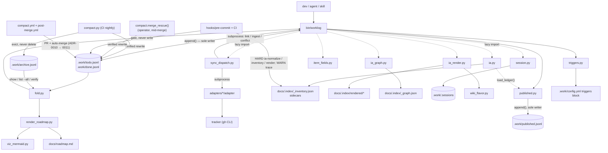

# Worklog — Code Walkthrough

The guided tour a new team member reads on day one. Every claim is anchored in
the code at the commit above. The companion design document is
`docs/designs/current_design_doc.md`; where this walkthrough and that document
disagree with the code, the code wins (drift is reported in §6).

Since v0.21.0 the front matter above is not decoration. `git_hash` names the
tree every citation below was resolved against, and `worklog doc-verify` reads
it back: each `path — symbol(), lines N–M` in this file is checked with
`git show <that commit>:<that path>`, never against HEAD. Run it yourself —
`bin/worklog doc-verify` — and this document should report zero fabrications.
See §2.21 for how that works and §9.11 of the design doc for why it had to.

## 1. Orientation

Three sentences: **Worklog tracks work as an append-only JSONL event log inside
the git repo; item state is a fold over the events, and git's union merge makes
concurrent writes compose instead of conflict.** This edition describes HEAD of
the v0.24.10 line: the tag plus three fixes merged after it (the retention
archive no longer ping-pongs, the #412 marker probe, ADR-0011). Where a stop
below says "post-tag", that is what it means. Everything human-readable — the
roadmap, status reports, Mermaid diagrams, and (since v0.13.0) the IA reader
plane under `docs/.index/` — is generated from the log and committed docs, and
everything remote — tickets, wiki pages — is a mirror driven through a typed
dispatcher or a skill. The rules that matter are enforced by hooks and CI, not by
memory.

Directory map:

| Path | What lives there and why |
|---|---|
| `bin/worklog` | The CLI and the **only** writer of `.work/todo.jsonl` (1843 lines). Since v0.24.10 it folds three files (`PATHS`, line 36), holds `.work/.lock` while it writes, and caps the whole encoded event at `MAX_LINE` (§2.1). |
| `bin/fold.py` | The only code allowed to decide what the log *means* (371 lines). Holds `external_owners()` (v0.18.0) and, since v0.19.0, `position()` plus the per-item `apply_watermark()` — the two halves of the #284 fix. |
| `bin/ulid.py` | IDs (170 lines; monotonic within a millisecond since v0.24.10). The deterministic form that makes ingest idempotent across clones, (v0.19.1) `git_commit()` — provenance for the event, deliberately *not* for the id — and (v0.21.0) `git_commit_full()`, the 40-hex stamp a *document* carries. |
| `bin/canonical.py` | THE canonical hash (sync change detection). 34 lines, high blast radius. |
| `bin/sync_dispatch.py` | Every ticket-sync invariant, in one place (1531 lines). Since v0.24.8 also the memory of where a ticket went, three sources deep (`remembered_key()`, §2.24), and the `adopt` / `dedupe` / `explain` companions. |
| `bin/compact.py` | The only file rewriter (827 lines). CI-only for compaction; since v0.24.10 also retention (`_evict_done()`, `_prune_archive_text()`, §2.23) and conflict preservation; also the two merge guards and, since v0.19.0, `merge_rescue()` — the repair an operator runs by hand. |
| `bin/published.py` | (v0.24.10) The wiki ledger as an event log: `append()` is the only writer of `.work/published.jsonl`, `fold()` the only reader, `plan()` the publish dispatcher (§2.26). 341 lines. |
| `bin/triggers.py` | (v0.24.10) `worklog triggers <event>`: the `triggers:` block of `.work/config.yml` decides when generation happens; skills and the post-merge workflow run what comes back (§2.27). 252 lines, imports nothing from `bin/`. |
| `bin/render_roadmap.py`, `bin/viz_mermaid.py` | Byte-deterministic roadmap + diagrams. |
| `bin/plan_capture.py`, `bin/adr.py` | Pure helpers: plan parsing (+ `ticket_refs()`, v0.19.0), ADR tooling. |
| `bin/ia.py` | wiki_key, truth_state, inventory, normalize, sidecars (IA foundation, 665 lines). Since v0.24.7 classifies `docs/design/` and `docs/designs/` alike (#377) and reads the ledger through `published.load()`. Also `ensure_front_matter_fields()`, the additive line-scoped front-matter writer every provenance stamp goes through. |
| `bin/ia_render.py` | Reader plane (807 lines): Home, Sidebar, indexes, publish-manifest, aliases, artifact pages (v0.14.0), (v0.19.0) the wiki-flavor seam + per-`doc_type` banners + live PR pages, and (v0.20.0) `PLAN_STATE`/`_plan_state()` — a plan's banner names its own state, and (v0.21.0) `_body_hash()` — the manifest hashes a document *below* its front matter (808 lines). |
| `bin/ia_graph.py` | Traceability graph, link-pr, ticket-body, trace-check, `build_adjacency()`/`item_links()` (v0.14.0), (v0.19.0) `pr_sync()` + the `find` search surface, and (v0.20.0) `in_trace_scope()` — the evidence gate's scope, finally enforced (548 lines). |
| `bin/session.py` | (v0.19.0) Advisory registry of harness sessions sharing this checkout. 173 lines, blocks nothing. Since v0.24.3 it also holds the one non-advisory fact in the file: `base`, the commit a session started at, which the Stop hook diffs the log against (§2.8). |
| `bin/provenance.py` | (v0.21.0) `merged_in` — the merge commit that landed a **frozen** document, backfilled after the fact. 154 lines, the only module that walks git history for document metadata. |
| `bin/doc_verify.py` | (v0.21.0) Resolves this file's own citations at the commit it was stamped with. 339 lines; never falls back to HEAD; judges a symbol's definition line (v0.22.2); `--staged` scoping and the editability predicate (ADR-0009). |
| `bin/changelog.py` | (v0.19.0) `worklog changelog-draft` — the starting point for release notes, never the notes. |
| `bin/item_fields.py` | (v0.19.0) CORE vs CATALOG: which item fields exist, and which this repo switched on. |
| `bin/wiki_flavor.py` | (v0.19.0) The renderer's one platform seam: `link()` + `sanitize()`, nothing more. |
| `.work/` | The logs (`todo.jsonl`, `done.jsonl`, and since v0.24.10 `archive.jsonl` for evicted closed snapshots and `published.jsonl` for wiki page identity), `config.yml`, and (gitignored) `.sessions`, `sync-state.json`, `.lock`. |
| `docs/.index/` | Generated IA plane (committed, regenerate-and-diff, **hard-gated** since v0.19.0). |
| `adapters/` | `github` (worked example), `fake` (CI double), authoring rules. |
| `hooks/` | git pre-commit/pre-merge-commit/commit-msg (v0.15.0) + five harness hooks (`session-end.sh` new in v0.19.0). `pre-merge-commit` regenerates the roadmap and index from the union-merged log before it validates (v0.24.8, #381); `session-doctor.sh` writes the two per-clone git config lines a fresh clone needs (v0.24.10). |
| `plugin/` | Host packaging, **three manifests over one shared tree**: `.claude-plugin/plugin.json` (Claude Code, Grok Build), `.codex-plugin/plugin.json` (Codex, v0.22.0) and `.cursor-plugin/plugin.json` (Cursor, v0.24.4). `plugin/scripts/` mirrors `bin/` + `hooks/` and is sync-checked; `plugin/hooks/hooks.json` + `codex-hooks.json` + `cursor-hooks.json` are the event maps, and all must wrap their events under a top-level `hooks` key — §2.22 is why. `plugin/scripts/associate-pr-checks.sh` is the interim status bridge for bot PRs (§2.25). |
| `.github/` | Three workflows (`worklog.yml`, `compact.yml`, `post-merge.yml`) and `merge-when-green-ruleset.json`, the mirror of the branch ruleset on `main` (§2.25). |
| `schema/` | `capabilities`, `adapter-io`, `adr`, `doc`, `entity` JSON schemas. |
| `tests/` | 52 stdlib-unittest suites, 756 test functions; the executable spec. Merge safety alone accounts for `test_watermark.py` and `test_bug_merge.py`; `test_provenance.py` (739 lines) is the largest file; `test_retention.py` and `test_bug_412.py` are the newest and pin the two post-tag fixes (§4). |
| `docs/` | Generated roadmap, frozen plans/status/designs, ADRs 0001–0011, the spec. 52 documents under `docs/` carry `git_hash` and 92 carry `merged_in` at this commit. Since v0.24.10 a release freezes one dated note (`docs/designs/<date>_vX.Y.Z-release.md`) instead of copying this pair. |
| `docs/integrations/` | Eleven per-system setup guides + index (v0.16.0), prose only, no code. |

The one diagram (derived from actual imports and subprocess calls):



## 2. Execution-order tour

### 2.1 The write path: `worklog add` → one line in the log

Entry: argparse dispatches to `cmd_add` (`bin/worklog — cmd_add(), lines
186–218`, from the `build_parser` tail). Validation happens **before** any write —
`--unplanned` requires `--discovered-during`, and taxonomy rules are hard here
even though the fold is lenient:

```python
def check_taxonomy(level, kind, milestone):
    """Write-time rules, taxonomy spec §2. The fold is lenient; this is not."""
    if level == "epic":
        if kind in ("bug", "triage"):
            sys.exit(f"worklog: an epic cannot be kind:{kind} — epics are "
                     "feature or ops (taxonomy §2.2)")
        if milestone is not None:
            sys.exit("worklog: milestone lives on leaves; epic milestones are "
                     "derived (taxonomy §2.5)")
```
— `bin/worklog — check_taxonomy(), lines 131–139`

Note the `cmd_add` comment: kind is only written when given — an omitted kind
folds to triage (§2.3), never silently to feature. Unclassified must look
unclassified.

**Where the event dict comes from (v0.19.1).** Every event the CLI writes starts
at `base()`, which is also where git provenance is stamped:

```python
def base(item, op, actor):
    ev = {"ev": ulid.new(), "ts": time.strftime("%Y-%m-%dT%H:%M:%SZ", time.gmtime()),
          "actor": actor, "item": item, "op": op}
    sha = ulid.git_commit()
    if sha:
        ev["git"] = sha
    return ev
```
— `bin/worklog — base(), lines 109–124`

Read the docstring above it and the one on `ulid.new()` together; they are one
argument. v0.19.0 put the short git hash *inside the id*, spending five of its
eighty entropy bits, so that agents on different branches minted visibly
different ids. v0.19.1 reverted that and moved the information to its own field.
The reasoning: an id is issued once and never changes, and the only thing it
must guarantee is that it does not clash — entropy is not currency to spend on
metadata. And the field traces *better*, because an item's id is minted once and
could only ever name the branch the **item** was created on, while a per-event
field names the origin of each event. `if sha:` matters too: outside a git repo
the field is omitted entirely rather than written empty.

`git_commit()` memoises in a one-element list because `worklog` mints many
events per run and HEAD does not move underneath one command — without the memo
the only writer would carry a subprocess in its hot path. `WORKLOG_NO_GIT_PROVENANCE`
skips it, and an `OSError` degrades to `""`; provenance is never a reason a write
fails.

`ulid.new()` gained one more property in v0.24.10 (`bin/ulid.py — new(),
lines 114–143`): same-millisecond calls increment the 80-bit entropy instead of
drawing fresh random bytes, so a create-then-update minted in one tick cannot
fold out of order. `merge_rescue()` had already worked around this by handing
in explicit timestamps; the mint path now does it too, pinned by
`tests/test_ulid.py — test_same_millisecond_ids_are_monotonic(), lines 62–67`.

Every event then funnels through the single writer:

```python
def append(event):
    """The only writer. Single O_APPEND write, always newline-terminated. ..."""
    body = event.get("set", {}).get("body", "")
    if isinstance(body, str) and len(body.encode("utf-8")) > MAX_BODY:
        sys.exit(f"worklog: body exceeds {MAX_BODY}B; put prose in the plan doc")
    _warn_concurrent_sessions()
    line = json.dumps(event, separators=(",", ":"), sort_keys=True) + "\n"
    raw = line.encode("utf-8")
    if len(raw) > MAX_LINE:
        sys.exit(f"worklog: event exceeds {MAX_LINE}B atomicity envelope "
                 "(PIPE_BUF); shorten title or move prose to the plan doc")
    os.makedirs(os.path.dirname(LOG) or ".", exist_ok=True)
    lock_fd = os.open(LOCK, os.O_RDWR | os.O_CREAT, 0o644)
    try:
        fcntl.flock(lock_fd, fcntl.LOCK_EX)
        fd = os.open(LOG, os.O_WRONLY | os.O_APPEND | os.O_CREAT, 0o644)
        try:
            if os.fstat(fd).st_size:
                rfd = os.open(LOG, os.O_RDONLY)
                try:
                    os.lseek(rfd, -1, os.SEEK_END)
                    if os.read(rfd, 1) != b"\n":
                        raw = b"\n" + raw
                finally:
                    os.close(rfd)
            n = os.write(fd, raw)
            if n != len(raw):
                sys.exit("worklog: short write; event not recorded")
        finally:
            os.close(fd)
    finally:
        os.close(lock_fd)
    return event
```
— `bin/worklog — append(), lines 66–106` (docstring elided)

What it receives: a finished event dict. What it returns: the event. What can
fail: an oversized body or an oversized encoded event exits before the write; a
short write exits after it and says so; everything else is one atomic
`write()`. Why it is written this way: the self-heal (`lseek -1; read 1`) repairs
a hand-edited file missing its trailing newline — without it, `O_APPEND` would
fuse two events into one unparseable line and lose both (spec §8.2). Three
things are new in v0.24.10 and each closes a hole the old version merely
assumed away. `MAX_BODY = 2048` (line 37) still caps the prose, in UTF-8 bytes
now rather than characters; `MAX_LINE = 4096` (line 38) caps the **whole**
encoded line at `PIPE_BUF`, because the body cap protected atomicity only if
the rest of the event was small. `n != len(raw)` turns a short write into a
loud exit instead of a fused line. And `.work/.lock` (line 39) is held across
the append: `compact.py` takes the same lock (`bin/compact.py — _lock_logs(),
lines 80–86`) around its `os.replace`, so a write can no longer land on an
inode compaction has just swapped out. `VERSION = "0.24.10"` (line 40) is
lockstepped with every host manifest, both skill trees and the README marker by
`tests/test_plugin.py — TestVersionSync, lines 307–350`. Read that lockstep as
a live constraint, not trivia: v0.24.2 bumped two of the eight sources that
carry the version and left six behind, and v0.24.3 was partly a repair release
for that split.

**Why the session advisory lives *here* (v0.19.0, #236).** `_warn_concurrent_sessions()`
sits in `append()` rather than in each command, and the docstring says why:
"every write in the system funnels through here, so one guard covers
add/update/close/link/ingest and anything added later, and no caller can forget
it." It fires once per process, on stderr, never blocking — the whole body is
wrapped so that "an advisory must never break a write", and
`WORKLOG_NO_SESSION_WARN` silences it. `bin/session.py` is equally defensive in
the other direction: a missing or corrupt `.work/.sessions` reads as `{}`, and
writes are best-effort. A bad advisory file must never be the reason someone
cannot record work.

The registry itself exists because there is no process identity to key on:
`worklog` is a short-lived CLI, so pid, ppid and even POSIX session id turn over
between tool calls. The **harness** is the only thing that knows a session is one
session, so `hooks/prompt-reminder.sh` heartbeats `session.touch(session_id)`
every turn and `hooks/session-end.sh` calls `session.end()` on the way out; the
CLI only ever reads. It deliberately never learns *which* session it is —
"two live heartbeats in this directory" is the entire condition worth warning
about, and evaluating it needs no self-knowledge.

**Optional fields (v0.19.0, #108).** `cmd_add` finishes with
`ev["set"].update(item_fields.collect(a))`, and the parser was built with
`item_fields.add_arguments(a)`. A field that is switched off in
`.work/config.yml` never gets an argparse flag at all, so `worklog add --risk
high` in a repo with risk off is an "unrecognised option" error rather than a
validation refusal. That is the point: for a CLI whose `--help` **is** the
prompt an agent reads, invisible is the only honest meaning of "disabled".

### 2.2 The read path: `fold()` decides what the log means

Every read command (`list`, `show`, `fold`, roadmap, status, sync scope, IA plan
lifecycle) calls `fold(...)`. Since v0.24.10 the CLI folds `PATHS`, all three
files including `archive.jsonl` (`bin/worklog` line 36), while the roadmap
renderer folds `todo + done` only: the working set is what the roadmap shows,
and an archived item is history you can still `show`. Four stages, each
load-bearing:

**Parse tolerantly** — `read_lines()` (`bin/fold.py`): a bad line is reported
into `result.errors` and skipped. The docstring explains why this is not
politeness: union merge plus a missing newline "can fuse two valid lines into
one invalid one, and that must cost two events, not the entire history."

**Dedupe and sort deterministically**:

```python
    seen: Dict[str, Dict[str, Any]] = {}
    for ev in events:
        key = ev["ev"]
        if key in seen:
            result.deduped += 1
            continue
        seen[key] = ev
    return sorted(seen.values(), key=position)
```
— `bin/fold.py — dedupe_and_sort(), lines 163–182`

ULIDs sort lexicographically by time, so ordering is a string sort. **There is
no tiebreak, and its removal is instructive** (v0.19.0, worklog#259). This used
to sort on `(ev, actor, sha256(line))`, advertised as "what makes two machines
fold the same bag of lines identically". It was unreachable by construction:
dedupe runs first and is keyed on `ev`, so no two events reaching the sort can
share one. The docstring now says the tiebreak was "worse than silence, because
it advertised a guarantee that came from the dedupe above it." If you read the
v0.18.0 walkthrough, that snippet is the one thing in it that is now false.

**Where an event applies** — `position()` (v0.19.0):

```python
def position(ev):
    if ev.get("op") == "snapshot" and ev.get("through"):
        return (ev["through"], 0)
    return (ev["ev"], 1)
```
— `bin/fold.py — position(), lines 185–207`

Identity is still `ev`; this is *only* ordering, and separating the two is the
whole trick. A snapshot's own `ev` is minted at compaction time, so it sorts
above everything — and because a snapshot **replaces** state entirely, a branch
that closed an item before that compaction ran would have its close applied
first and immediately overwritten. The work vanished even though the event was
still in the log. Sorting the snapshot at its `through` puts it back where it
belongs: after the events it folded, before anything later on any branch. The
`0` in the tuple keeps a snapshot ahead of a same-positioned ordinary event, so
the later event wins rather than being replaced. Legacy snapshots carry no
`through` and fall back to their own `ev` — exactly how they sorted before.

**Apply the watermark, per item** — `apply_watermark()` (v0.19.0, §2.16). Two
rules replace the old single global mark: an item with **no** snapshot never has
events dropped, because nothing folded them so nothing carries their state; an
item **with** a snapshot drops only its own events at or below that snapshot's
`through`. `snapshot` events are always exempt and `compact` lines are removed.
The old rule — drop everything at or below `max_ev` over the log the compaction
read — was a *time* marker doing a *content* marker's job, and it silently lost
branch work (ADR-0006, ADR-0007).

**Replay** — `fold()`. The subtleties that bite naive implementations, each with
a guarding test (§4): `snapshot` replaces state entirely (never merges); a
duplicate `create` degrades to an update; `close` takes its status from `set`
(only defaulting to `done` when nothing closed was set); `conflict` records
without changing state; and a later write to a conflicted field clears the
conflict while an *earlier* one does not, because events apply in `ev` order
(`_apply_mutations()`).

Orphans: an event for an item with no create/snapshot creates
`{"id": iid, "_orphan": True}` — "Report it; never crash, never silently invent
an item." Legitimate mid-rebase. Compaction counts orphans as open so it never
drops them (`bin/compact.py` partition comment).

One more subtlety worth knowing before you touch `_normalize_taxonomy()`: the
`kind:triage` default applies on `create` and **not** on `snapshot`
(`defaults=False`). A snapshot must be a lossless round-trip of the state it was
given, and re-fabricating taxonomy on every re-fold for an item that was never
created — a closed orphan, say — makes compaction a non-idempotent transform and
fails its own verify step.

Unknown event fields are simply ignored, which is what made v0.19.0's `through`
and v0.19.1's `git` safe to add with no migration in either direction.

### 2.3 Plan capture: one command, one epic, N tasks, one frozen doc

`bin/worklog — cmd_plan_capture(), lines 619–683`. It parses the draft with
`plan_capture.parse_tasks()` — checkboxes under a `## Tasks` heading only, with
the regex `TASK_RE` (`bin/plan_capture.py`) where a leading indent means
"subtask of the task above". It refuses to recapture a slug that already has a
plan (invariant 15.8), appends the epic create, then each task/subtask create,
and finally writes the plan doc with front matter linking every item ID.
Captured items get explicit `kind:feature`.

**The guard is slug-scoped, not filename-scoped (v0.17.0, PR #198 + a
same-day follow-up; `bin/worklog — cmd_plan_capture()`, lines ~344–367).**
The original code checked only `os.path.exists(f"docs/plans/{date}-{slug}.md")`
with `date` from `time.gmtime()` (UTC) — so it enforced "plans are never
rewritten" only when the UTC date happened to match the plan's actual filename.
A plan captured in the evening from a timezone behind UTC looks for
*tomorrow's* UTC-dated path, finds nothing, and silently writes a duplicate:
observed in a downstream repo on 2026-07-26 (a byte-identical duplicate plan
plus 23 duplicate work items, caught by hand and rolled back — nothing had
warned). The fix globbed `docs/plans/*-{slug}.md` across every date instead of
one fixed path. That fix's own bare glob then matched by raw string suffix, not
field boundary — a search for slug `migration` also matched an existing
`2026-07-01-database-migration.md` (real slug `database-migration`), a
false-positive refusal of a legitimately new, unrelated slug, caught in review
before PR #198 merged. The shipped guard anchors on the fixed date shape:

```python
slug_re = re.compile(r"^\d{4}-\d{2}-\d{2}-%s\.md$" % re.escape(a.slug))
existing = sorted(p for p in glob.glob("docs/plans/*.md")
                  if slug_re.match(os.path.basename(p)))
```

Two regression tests pin both failure modes
(`test_plan_capture_refuses_a_slug_already_captured_on_another_date` — a plan
dated `2020-01-01` must still be caught; `test_plan_capture_does_not_false_positive_on_a_suffix_match`
— a longer slug sharing a suffix must not block a new, shorter one),
`tests/test_integration.py`.

The whole flow is *forced* by `hooks/exit-plan-capture.sh`, which fires on
`PostToolUse: ExitPlanMode` and injects a non-optional instruction that now also
requires `worklog ia-index` after capture so the reader plane stays current.

### 2.4 The roadmap: a pure function, gated by diff

`render_roadmap.render()` folds the log and emits markdown. Two non-obvious
choices: `generated-at` comes from the newest event's ULID timestamp, not the
wall clock — "wall clock here would fail every commit" — because
`hooks/pre-commit` regenerates and diffs. The default `--viz deps,hierarchy` in
`cmd_roadmap_render` **must** match `render()`'s default because the hook runs
the bare script and diffs against the file the CLI wrote. `viz_mermaid.py` caps
nodes at `MAX_NODES = 40` and strips Mermaid-breaking characters.

`hooks/pre-merge-commit` is a one-line `exec` of the same script, because "git
runs THIS hook (not pre-commit) when a merge auto-commits."

### 2.5 Ticket sync: the dispatcher owns everything

`worklog sync` runs `sync_dispatch.main()` in-process (`cmd_sync()`). Order
inside `Dispatcher.sync()`: capabilities gate, push, pull, save state, report.

**The gate runs first, every run**: adapter `capabilities` output is parsed,
validated against the embedded schema mirror (`CAPABILITIES_SCHEMA`) by a 28-line
mini JSON Schema validator, plus one check the schema subset cannot express —
`"{ulid}"` must appear in `caps["marker"]["template"]`
(`sync_dispatch.py — capabilities()`).

**Observe first (v0.24.9, #385; extended for #412).** Before any push,
`sync()` calls `observe_remote()` (`bin/sync_dispatch.py — observe_remote(),
lines 1205–1257`), even on `--push-only`. One listing gives three things
push-only could not see: tracker-only tickets with no marker (reported with an
`adopt` command each), linked tickets already closed on the remote (closed
locally instead of being rewritten from stale open state), and the marker map
that §2.24 walks. Read that function's two passes in order; the order is the
point.

**Push scope** (`push_items()`): open ∪ hash-dirty ∪ **key-dirty** (v0.18.0) ∪
`--keys`, minus items a closed remote already settled (`skip_push_ids`). The canonical hash is computed over the *outbound* shape — after type
degradation — so "the degraded echo coming back on pull still suppresses." A
closing item whose hash is dirty pushes an `update` with the final item shape
*before* the `close` verb (v0.12.1; `TestCloseSyncsFields`). On a successful
create, external identity enters the log the only way it can — `worklog link` as a
subprocess (invariant 15.4). Create-vs-update is `remembered_key()` (§2.24), not
a bare `ext.get("key")`; after an update that answered from the state file or
the marker map, the same `record_link()` call records the link the log had lost
(`relink`). Since v0.18.0 a **collection-level collision gate**
runs before the loop and a contested key is skipped entirely — see §2.14.

**Pull**: NDJSON lines; echo suppression by comparing `canonical_hash(line)` to
`last_pushed_hash`; remote-only becomes `worklog ingest` with deterministic
`ev = ulid.deterministic(system, key, rev, rev_ts)`; both-sides-changed records
a `conflict` per field and never overwrites. Field-diff runs over
`INGEST_FIELDS` (includes `level`/`kind`/`milestone` since v0.12.0). Labels on
pull remain future work.

**Failure handling** is an exit-code table (`handle_exit()`): 2 aborts; 3 pops
`last_pushed_hash`; 4 was already retried; 5 files per-field conflicts; anything
else is drift. No adapter at all is a *mode*: `LOCAL_ONLY`, exit 0.

**Adapters are dumb on purpose.** `adapters/github/adapter` maps verbs to `gh`
calls and embeds the marker; a test bans invariant tokens from every adapter
source.

**Rich bodies (v0.13.0):** `worklog ticket-body <ulid>` prints a projection with
summary, epic/plan/milestone context, and graph edges
(`ia_graph.ticket_body()`, lines 307–357) for the issue-description skill to push.

### 2.6 Compaction: the one rewrite, quadruple-checked

`compact.compact()` (`bin/compact.py — compact(), lines 373–388`), nightly on
main via `.github/workflows/compact.yml`. Since v0.24.10 `compact()` is a thin
shell: refuse on uncommitted changes to any of the three logs, an untracked
`archive.jsonl` included (`_git_refuses(), lines 317–334`); take `.work/.lock`;
hand off to `_compact_locked(), lines 391–508`. Sequence there: watermark = max
raw `ev` over all three files; short-circuit the todo rewrite if todo is already
only snapshots, conflicts and the compact line; partition open vs closed where
*orphans count as open* — "never drop data"; build the new done text; **evict**
(§2.23); write up to three temp files; then gate on `fold(todo+done+archive)`
before == after, including the private `_conflicts` map, plus trailing newline
plus every line parses (`_verify(), lines 337–370`). Only after that do the
`os.replace` calls swap the files.

v0.13.0: snapshots write folded state **verbatim** so a closed orphan no longer
fails verify by diverging from fold (item 01KY5HW7KS / #101).

v0.24.10: open conflicts survive. `_public()` strips `_conflicts` from the
snapshot payload, which used to mean the nightly compaction verified the
stripped form and silently dropped every open conflict. `_item_events()`
(`bin/compact.py — _item_events(), lines 72–77`) now emits the snapshot followed
by one `conflict` event per open conflict, and `_verify()` compares
`_conflicts_map()` too. Regression: `tests/test_compact.py —
TestConflictPreservation, lines 221–266`.

v0.24.3 — the *job* around the function, not the function. Read
`.github/workflows/compact.yml` top to bottom and note that two steps sit
between `python3 bin/compact.py` and the commit, and that since v0.24.10 the
commit does not go to `main` at all: the job commits on `chore/compact-<run id>`,
opens a PR, and arms auto-merge. §2.25 is how that PR turns green. The first regenerates the
derived docs in the order that matters — `roadmap-render`, `ia-inventory`,
`ia-manifest` — because `ia-manifest` hashes what `ia-inventory` wrote, which
reads the roadmap, so running them out of order fixes nothing and leaves a stale
body hash. The second runs `WORKLOG_SKIP_BRANCH_GUARD=1 hooks/pre-commit`, the
`--merge-check`, and the full suite. The reason is a property of the credential:
a push made with the default `GITHUB_TOKEN` triggers no other workflow, so
`worklog-invariants` never ran on the commit this job creates. `main` was red for
two days that way — a break no developer caused and none could fix locally,
because the next scheduled run put it straight back. Failing inside the job
leaves `main` untouched. It still produces no run in `main`'s check history; only
a credential that is not `GITHUB_TOKEN` can, and that residual gap stays tracked
rather than being written off here.

v0.19.0: between the fold and the partition, `compact()` walks the **raw** input
lines of both files a second time to build `per_item = {id: highest ev}`, and
`_snapshot(item, per_item.get(id))` writes that as `through`:

```python
    per_item = {}
    for path in (todo_path, done_path):
        for _line, e in _raw_lines(path):
            if e is None or e.get("op") == "compact":
                continue
            iid, ev = e.get("item"), e.get("ev")
            if iid and ev and ev > per_item.get(iid, ""):
                per_item[iid] = ev
```
— `bin/compact.py — _compact_locked(), lines 391–508`

Raw rather than folded, deliberately: the mark must describe what was **read**,
not what survived. And `through` goes top-level on the event, never inside
`set`, so it can never become item state and never reaches the
`fold(new) == fold(old)` comparison. The global `compact` line still gets
written and is still the legacy fallback. Both `_snapshot()` and
`_compact_line()` also stamp `git` when `ulid.git_commit()` returns one.

### 2.7 Status: deterministic facts, model prose, frozen file

`_status_facts()` is the deterministic half: a fold plus a raw-event pass; an
event is in-window when its **`ev` ULID timestamp** is. Daily windows open at the
last daily report's date; weekly is a fixed 7 days; timecards bucket per UTC day
and attach best-effort git commit subjects. The prose is the skill's job.
`cmd_status --write` stamps front matter with the window and the `through`
watermark and refuses to overwrite without `--force` (invariant 15.9).

### 2.8 The automation ring

Harness hooks (wired by `plugin/hooks/hooks.json` for Claude Code, and by the
Codex and Cursor manifests for the other two hosts; all five events including
`SessionEnd` since v0.24.7):
`prompt-reminder.sh` injects a one-line policy on every prompt;
`stop-worklog-check.sh` **blocks** ending a session where the tree changed but
`.work/todo.jsonl` did not, with a settle-and-recheck sleep;
`session-doctor.sh` reports missing policy blocks, unarmed hooks, or plugin
version skew, and since v0.24.10 writes the two per-clone git config lines
(`merge.ours.driver true`, and `core.hooksPath`, absolute in a linked worktree)
before it reports, because pre-commit would self-heal the merge driver but
pre-commit never runs until `hooksPath` is set (`hooks/session-doctor.sh`).
`plugin/scripts/doctor.sh --fix-wiring` does the same on demand.

**Read the Stop hook in the order it executes — the interesting part is what it
diffs against.** First the cheap exits: not a worklog repo, or `stop_hook_active`
(the model is already continuing from a prior block, so returning non-zero here
would loop forever), or a clean tree
(`hooks/stop-worklog-check.sh:3-18`). Then the settle-and-recheck: sleep
`WORKLOG_STOP_SETTLE` (default 2 s) and re-read, because background merge chains
flip branches mid-invocation and the first `git status` can see transient
checkout state — observed three times on 2026-07-19 as false blocks on a clean
tree. If the tree settled clean, or the branch moved underneath, allow the stop
(`hooks/stop-worklog-check.sh:19-29`).

Now the part that changed in v0.24.3. The proof that this session recorded
something used to be an *uncommitted* change to `.work/todo.jsonl` — and that
proof disappears the instant the session commits its own items, which is exactly
what the policy tells it to do. So the hook now asks `bin/session.py` where this
session *started*:

```sh
base=$(printf '%s' "$payload" | python3 -c '
…
    import session
    print(session.base(sid) or "")
…
' 2>/dev/null)
if [ -z "$base" ] || \
   ! git -C "$PWD" rev-parse --verify --quiet "${base}^{commit}" >/dev/null 2>&1; then
  base=HEAD
fi
```

— `hooks/stop-worklog-check.sh:41-57`. Two things to notice. The payload is read
**once**, at the top of the script (`hooks/stop-worklog-check.sh:7`), because
stdin is not rewindable and both `stop_hook_active` and `session_id` come out of
it. And the fallback is unconditional: an empty answer, or a sha `rev-parse`
cannot resolve — rebased away, garbage collected, or from a session older than
the registry's one-hour window — lands on `HEAD`, which is the behavior this
hook has always had. That is what makes the change safe to ship: its worst case
is the old case.

The diff then widens across every linked worktree, because worklog policy puts
concurrent sessions in separate worktrees that share an object store but not a
working tree — each has its own branch and its own `.work/todo.jsonl`, and
asking only `$PWD` accused a correctly-logged worktree session of skipping the
log (`hooks/stop-worklog-check.sh:69-73`). Note the process substitution rather
than a pipe: a piped `while` runs in a subshell, where `exit 0` would leave the
loop and block anyway. Only the "was it recorded" question widens; the dirty
check stays at `$PWD`, which is the only question `$PWD` can answer — did work
happen *here*. The block itself is last, and is reached only when no checkout in
the repo recorded anything (`hooks/stop-worklog-check.sh:79-95`).

The marker on the other side is one line in `bin/session.py — touch(), lines
82–101`: `rec["base"] = prev.get("base") or (base_sha if base_sha is not None
else head())`. The `prev.get("base") or …` is load-bearing — re-stamping on
every heartbeat would advance the marker past the session's own commit and
re-create the bug one layer down. `bin/session.py — base(), lines 104–121` reads
it back and returns `None` rather than a guess for an unknown session. The
docstring there also states the trade-off plainly: a session that *pulls*
someone else's log changes now reads as having recorded something. That is a
missed nag, which is the failure direction worth choosing over blocking a
session that did everything right. Design analysis: §9.13 of the design doc.

CI (`worklog.yml`) re-runs the pre-commit script verbatim (as
`WORKLOG_SKIP_BRANCH_GUARD=1 hooks/pre-commit` since v0.15.0 — the checkout
runs with no commit in flight, and the branch guard only makes sense for an
actual `git commit`) — "A dev can `--no-verify` past the local hook; not
this" — then unit, integration, and a subprocess-aware coverage gate
(`--fail-under=80`). Its `invariants` and `coverage` jobs are the two required
checks the branch ruleset names, and since ADR-0011 the whole workflow declares
`permissions: contents: read`: it inherited repo-default write, posts nothing,
and a commit status with one of those two names from any actor holding
`statuses: write` satisfies the ruleset (§2.25). A new PR-scoped step (v0.15.0) walks
`git rev-list --no-merges base..HEAD` through `hooks/commit-msg` for every
non-merge commit on the PR, requiring `fetch-depth: 0` on the checkout since
`commit-msg`'s own `MERGE_HEAD` check has nothing to read post-hoc in a CI
clone. `merge-when-green.sh` polls `gh pr checks` and merges only on
all-green; empty check output counts as pending, and 24 failed polls exit 4
(ADR-0003).

Two hooks changed shape in the v0.24.x line and are worth reading before the
IA block. `hooks/pre-merge-commit` used to be a one-line `exec`; since v0.24.8
(#381) it regenerates `docs/roadmap.md` and `docs/.index/` from the
union-merged log and stages them **before** it execs `pre-commit`, because
`.gitattributes` marks both `merge=ours` and "ours" is whichever side happened
to be checked out. Two branches that each add a work item used to conflict on
a file nobody edited by hand; now the merge commit names both sides' work
(`tests/test_bug_381.py — test_merge_of_two_item_branches_is_clean_and_names_both(),
lines 94–108`). And `hooks/pre-commit` gained a second schema block for
`.work/published.jsonl` (lines 101–125: trailing newline, envelope, `register` /
`publish` / `unpublish` ops, `key` on everything but `unpublish`), loops over
all three logs (line 59), and writes `git config merge.ours.driver true`
idempotently at line 15 so a clone that upgraded hooks without re-running
`init.sh` gets the driver on its next commit, which is before its next merge.

Pre-commit runs **IA gates as hard failures** since v0.19.0 (#98) — the
warn-only rollout described in earlier walkthroughs is over:

```sh
if [ -f bin/ia.py ] && [ -x bin/worklog ] && [ -d docs/.index ]; then
  python3 bin/worklog ia-normalize --check >/dev/null 2>&1 || \
    fail "doc metadata drift; run: worklog ia-normalize"
  python3 bin/worklog ia-inventory --check >/dev/null 2>&1 || \
    fail "inventory stale/invalid; run: worklog ia-inventory"
  [ ! -f bin/ia_render.py ] || python3 bin/worklog ia-render --check >/dev/null 2>&1 || \
    fail "rendered pages/manifest stale; run: worklog ia-render"
  # trace-check stays warn-level here forever; --strict runs at release time
  [ ! -f bin/ia_graph.py ] || python3 bin/worklog trace-check >/dev/null 2>&1 || \
    echo "worklog: WARNING — unlinked evidence; run: worklog trace-check" >&2
  # doc-verify, scoped to the documents THIS commit touches (--staged). ...
  [ ! -f bin/doc_verify.py ] || python3 bin/worklog doc-verify --staged --strict >/dev/null 2>&1 || \
    echo "worklog: WARNING — a document THIS commit touches cites code that does not match the commit it was written against; run: worklog doc-verify --staged" >&2
fi
```
— `hooks/pre-commit` (IA block, lines 167–189)

The `-d docs/.index` guard is what makes the promotion safe, and the comment
above it spells out the distinction: that test asks "has this repo opted **into**
the IA?", where the `bin/ia.py` test only asks "does it have the code?" A
scaffolded repo gets `bin/` from the plugin but has never generated an index and
must not be blocked from its first commit. A repo that *has* an index stays
fully enforced — deleting any single generated file inside it still fails,
because the directory is still there.

**The conflict-marker guard (v0.19.0), and why it has no merge exemption:**

```sh
conflicted=$(git diff --cached --name-only --diff-filter=ACM |
             while IFS= read -r f; do
               [ -f "$f" ] || continue
               if git show ":$f" 2>/dev/null |
                  grep -qE '^(<{7}|={7}|>{7})( |$)'; then echo "$f"; fi
             done)
```
— `hooks/pre-commit`, lines 41–57

A merge is *exactly* when conflict markers get committed, so exempting merges
would exempt the only case that matters. The hook's own comment records the
incident: `commit-msg` exempts merge commits from its item-reference rule and
nothing else parsed `tests/` or `plugin/`, so a resolution that missed a hunk
committed cleanly and was only found by running the suite. It reads **staged
content** via `git show ":$f"` rather than the worktree — an unstaged conflict
elsewhere is not this commit's problem — and the `( |$)` in the pattern is what
keeps prose *about* conflict markers from tripping it
(`test_bug_merge.py — test_prose_about_conflict_markers_is_not_a_conflict`).

`PYTHONDONTWRITEBYTECODE` is set in the hook so it never dirties the worktree
with `__pycache__` (item 01KY5P9V0C).

**CI runs the merge guards directly (v0.19.0).** `worklog.yml` gained a
`python3 bin/compact.py --merge-check` step, because inside the hook those
guards are gated on `WORKLOG_MERGE_COMMIT` or an on-disk `MERGE_HEAD` and
neither exists in a CI checkout — while for a `pull_request` GitHub checks out
the *merge result*, so CI sees precisely what the local hook would have seen
(ADR-0005, #262). This is the answer to ADR-0005's own recorded consequence that
the guards never fire on a hosted merge.

### 2.9 IA plane: normalize → inventory → render → graph

**Identity.** Every doc gets a stable `wiki_key`. Legacy keys are seeded
**verbatim** from the folded `.work/published.jsonl` ledger (`ia.load_ledger()`
→ `published.load()`, v0.24.10) so no URL or page name changes;
new docs derive keys by rule (`ia.derive_canonical_key()`,
`ia.resolve_key()`). CLI: `worklog wiki-key <path>`.

**Normalize** (`ia.normalize()`, driven by `bin/worklog — cmd_ia_normalize(),
lines 810–820`):

```python
def cmd_ia_normalize(a):
    import ia
    changes = ia.normalize(check=a.check)
    for c in changes:
        print(("needs: " if a.check else "wrote: ") + c)
    if a.check and changes:
        sys.exit(1)
    ...
```
— `bin/worklog — cmd_ia_normalize(), lines 810–820`

Frozen docs get additive sidecars under `docs/.index/<wiki_key>.yml`;
sanctioned-live docs get in-place identity fields only. `truth_state` is
recomputed every run (`DYNAMIC_FIELDS`), never pinned from a stale sidecar.
Since v0.24.7 a frozen design that recorded no `git_hash` gets the commit that
last touched it stamped into its sidecar (`bin/ia.py — last_touch_sha(), lines
275–292`), the least-wrong value the normalizer can write, so
`ia-inventory --check` stops blocking on `missing git_hash` (#377). The ledger's
self-description is now appended as `publish` events through `published.record()`
rather than dumped over a JSON dict.

**Inventory** (`ia.build_inventory()` / `write_inventory()`): pure function of
committed files → `docs/.index/_inventory.json` (one record per doc).

**Render** (`ia_render.write_all()`): Home, Sidebar, decisions/releases/status
indexes, truth banners, `publish-manifest.json`, `aliases.json`. Deterministic —
no wall clock — so `--check` can regenerate-and-diff. Since v0.19.0 every page
also passes through `_links()` (the `wiki_flavor` seam, §2.17) **before**
`build_manifest()` hashes it, so `render_hash` describes the bytes that get
published; `page_name()` sanitizes through the flavor rather than an inline
`.replace(" ", "-")`; and `banner()` delegates its wording to `_banner_text()`,
which branches on `doc_type` (#137). Rendered output is byte-identical to
v0.18.0 across all 319 pages — the re-plumbing was deliberately invisible.
Since v0.20.0 the `plan` branch also names *which* plan it is (§2.20).

**Live PR metadata** (v0.19.0, #138): `worklog pr-sync <n>` is the one network
step in this pipeline. `ia_graph.pr_sync()` calls `gh pr view` once for
`PR_FIELDS`, flattens the file list to sorted paths, and writes a `pr/<n>`
sidecar; `rollup_checks()` collapses the check rollup to
`passing|failing|pending|mixed|none` with the worst state winning.
`render_pr_page()` reads only the sidecar, so `render_all()` stays offline and
`--check` stays deterministic — which is exactly why the call lives in the CLI
and not in the renderer.

**Convenience wrapper:**

```python
def cmd_ia_index(a):
    import ia, ia_render
    for c in ia.normalize():
        print("normalize: " + c)
    ia.write_inventory()
    print("inventory: " + ia.INVENTORY)
    for path in ia_render.write_all():
        print("wrote: " + path)
```
— `bin/worklog — cmd_ia_index(), lines 834–841`

**Graph** (`ia_graph.build_graph()` / `write_graph()`): typed edges from
frontmatter, plan items, ADR references, and item sidecars. `link-pr` is an
**overlay only** — it does not append to the event log:

```python
def link_pr(ulid_, pr=None, commit=None):
    ...
```
— `bin/ia_graph.py — link_pr(), lines 153–169`

`trace_check(strict=False)` lists items **in a released milestone** missing
plan/ticket/PR links; `--strict` exits 1 at release. Which items those are is
`in_trace_scope()`, new in v0.20.0 — see §2.19, and read it before trusting any
older description of this gate. `ia-graph --seed` proposes decides/implements
edges into gitignored `.work/suggestions.jsonl` (propose-only, never auto-edits
docs).

**Schema split.** Document types live in `schema/doc.schema.json`; graph/execution
entities (`item` today) live in `schema/entity.schema.json`. Both are mirrored in
`ia.DOC_TYPES` / `ENTITY_TYPES` / `REQUIRED_*` constants; `TestSchemaSync` pins
equivalence and asserts the two enums are disjoint so items never pretend to be
documents (#111).

### 2.10 Artifact pages (v0.14.0): one page per item, PR, release

`docs/plans/2026-07-24-artifact-pages.md`. Two graph nodes existed since the
Phase-4 traceability graph shipped — `pr/<num>` and `release/<tag>` stubs with
no page of their own. This release gives every work item, PR, and release a
generated wiki page, reusing graph edges instead of adding stored fields.

**One shared traversal.** `ia_graph.build_adjacency(graph)` builds the
forward/backward edge maps once per render pass; `item_links(iid, fwd, back)`
projects parent/children/PRs/release for one item from those maps:

```python
def item_links(iid, fwd, back):
    key = item_key(iid)
    parent = next((to for typ, to in fwd.get(key, []) if typ == "belongs-to"),
                  None)
    children = sorted(to for typ, to in back.get(key, []) if typ == "contains")
    prs = sorted(to for typ, to in fwd.get(key, []) if typ == "lands-in")
    release = next((to for typ, to in fwd.get(key, [])
                    if typ == "targets" and to.startswith("release/")), None)
    return {"parent": parent, "children": children, "prs": prs,
            "release": release}
```
— `bin/ia_graph.py — item_links(), build_adjacency()`

Every one of the three new renderers calls this — "not four near-duplicates"
was a design decision in the plan (`render_item_page()` branches by level
instead of shipping separate story/epic/task renderers).

**Ticket pages** (`ia_render.render_item_page()`): title, level/kind/status
badge, a one-line summary derived at render time from the body's first
sentence (`one_line_summary()` — never cached, keeping the module's
byte-determinism), an upward `## Hierarchy` walk to the root
(`_upward_chain()`, cycle-safe via a `seen` set), a downward `## Subtasks` /
`## Children` list with a `done/total` progress rollup, `## Linked PRs`, and
`## Release`. `worklog ia-ticket <ULID>` (`cmd_ia_ticket`, `bin/worklog`)
previews one page without a full render pass — builds the graph, calls
`build_adjacency()`, and writes `render_item_page()`'s output to stdout.

**Release pages** (`render_release_page()`): the Change Log is
milestone-tagged closed items plus their linked PRs, walked straight off the
graph — *not* a `CHANGELOG.md` parser. `CHANGELOG.md` stays human-authored
prose; the page's Change Log is a separate, mechanical, always-accurate list
(the plan is explicit that building a changelog-parsing engine would be a
fragile addition this project avoids). Also renders a `## Release Tree`
(`_release_tree()` — a lighter nested list than `viz_mermaid.hierarchy()`,
which only covers *open* items, a different "what's left" use case), Related
PRs, Related Tickets, and Dependencies & Risks.

**PR pages** (`render_pr_page()`): linked tickets via reverse `lands-in`
edges, related releases/epics via `item_links()` on each linked ticket.
Changed-files and CI/review status render literally as `"not tracked"` — no
code in this repository calls `gh pr view` today, and the plan defers that
integration to a separate follow-up item (`worklog pr-sync`, filed as #138,
not built this release) rather than silently shipping a page that implies
data exists.

**Manifest growth.** `build_manifest()` gained a second loop keyed off the
`tickets/`, `releases/`, `prs/` filename prefix in the rendered-pages dict —
a new entity type needs one new prefix branch, not a new loop. The
published-page manifest grew from 51 entries to 258.

### 2.11 Branch discipline (v0.15.0): pre-commit's branch guard + `hooks/commit-msg`

`docs/plans/2026-07-25-branch-discipline-hooks.md`. Shipped after a real
incident: local `main` drifted 13 commits ahead of `origin/main` for hours
because every commit landed straight on `main`, while GitHub's nightly
compaction bot pushed its own commit directly to `origin/main` in parallel —
the divergence surfaced as a failed PR merge. Two new checks follow the
existing hook philosophy ("hooks enforce invariants, not hope").

**Branch guard** — a new block in `hooks/pre-commit`, inserted right after
`fail()` is defined, before the `.work/*.jsonl` checks:

```bash
if [ -z "${WORKLOG_SKIP_BRANCH_GUARD:-}" ] && \
   [ -z "${WORKLOG_MERGE_COMMIT:-}" ] && \
   [ ! -f "$(git rev-parse --git-path MERGE_HEAD)" ]; then
  branch=$(git symbolic-ref --quiet --short HEAD || true)
  case "$branch" in
    main|master)
      fail "commits go on a branch, not '$branch' (main/master is pull-only). Run: git checkout -b <branch-name>, then commit there."
      ;;
  esac
fi
```
— `hooks/pre-commit` (branch-guard block)

Detached HEAD is allowed (`branch=""`). Two independent exemptions cover
"this is a merge, not authored work": `WORKLOG_MERGE_COMMIT` — set by
`hooks/pre-merge-commit` before it `exec`s into this script, because
`MERGE_HEAD` is **empirically not yet on disk** at the point git invokes
`pre-merge-commit` (it only appears between that hook running and
`commit-msg` firing) — and `MERGE_HEAD` itself, present by the time a merge
a hook rejected is resumed via a later plain `git commit`. A third variable,
`WORKLOG_SKIP_BRANCH_GUARD`, is set only by non-commit callers running the
script standalone with no commit in flight: `plugin/scripts/doctor.sh`'s
health check, the CI invariants step, and two
`tests/test_integration.py` "CI gate passes" assertions — all of which would
otherwise false-positive on `main`. `hooks/pre-merge-commit` itself needed no
changes — it's a one-line `exec` of `pre-commit`, and `MERGE_HEAD`/
`WORKLOG_MERGE_COMMIT` already cover it.

**`hooks/commit-msg`** — new hook, requires every non-merge commit message to
reference a worklog item or ticket:

```bash
[ -f "$(git rev-parse --git-path MERGE_HEAD)" ] && exit 0

python3 - "$1" <<'PY' || fail "commit message must reference a worklog item (26-char ULID) or a ticket (#123) -- see: worklog show <id>. Merge commits are exempt."
import re, sys
msg = open(sys.argv[1], encoding="utf-8").read()
sys.exit(0 if (re.search(r'\b[0-9A-HJKMNP-TV-Z]{26}\b', msg) or
               re.search(r'#\d+', msg)) else 1)
PY
```
— `hooks/commit-msg`

The ULID pattern matches `bin/ulid.py`'s Crockford base32 alphabet exactly.
No exemption beyond merge commits (via `MERGE_HEAD`, same signal as the
branch guard). Orthogonal check — applies on any branch, including feature
branches.

**Wiring.** `hooks/commit-msg` is mirrored byte-identical to
`plugin/scripts/commit-msg`; `plugin/scripts/init.sh`'s hook-copy loop and CI
workflow template both gained it; `uninstall.sh` removes it symmetrically;
`doctor.sh` checks its existence/exec bit and now runs its own `pre-commit`
invocation with `WORKLOG_SKIP_BRANCH_GUARD=1`; `tests/test_plugin.py`'s
`CANON` list includes it so `TestCanonSync` still guards the mirror. Both
hooks hard-fail immediately — no warn-only rollout period. The IA gates took
the slower route and were promoted to hard failures in v0.19.0 (§2.8), so the
two philosophies have converged.

**Release skill.** `plugin/skills/release/SKILL.md` §3's "direct-commit
repos: commit on the default branch" mode is removed — dead once the branch
guard ships everywhere; the skill now describes branch+PR landing only. Three
v0.19.0 additions: preflight suggests `worklog changelog-draft --version X.Y.Z`
when the unreleased section is missing or thin (bullets, not release notes —
edit the prose and read the exclusion list before stamping); stamping now
requires `worklog trace-check --strict` to pass, so every closed item traces to
a plan, ticket and PR before a tag exists; and publishing ends with a
`worklog ia-index` run that is **committed**, because publishing writes each
page's live wiki location into the ledger and the IA gates are hard now. One
pass converges, since wiki location is not part of the render hash. The
plan-capture skill gained the same re-index-and-commit tail.

**Test fixture fallout.** ~23 `commit_all()` calls in
`tests/test_integration.py` and 3 raw `git commit` calls in
`tests/test_plugin.py` mostly committed on `main` with no-reference
messages — pure fixture plumbing. Pre-existing baseline commits got
`no_verify=True`; commits meant to represent real authored work moved onto a
branch (`Sandbox.branch()`) and picked up an item-ULID in the message,
following the file's existing precedent for "not what this test is about"
commits.

### 2.12 Integration guides (v0.16.0): a prose-only edge, no new `bin/` code

`docs/plans/2026-07-25-wiki-driven-integration-guides.md`. Eleven systems this
repo talks about but mostly doesn't ship real adapter code for — four SDD
tools it composes with (Superpowers, GSD, SpecKit, OpenSpec) and seven
ticket/wiki systems where only `adapters/github/adapter` is real (Jira,
Confluence, GitHub, GitLab, Azure DevOps, AWS CodeCatalyst, Google Cloud
DevOps) — each get a dedicated setup guide. The design choice worth noting:
this ships **zero new Python**. `WebFetch` (already available to any Claude
Code agent) covers "fetch the live wiki page at runtime"; `worklog wiki-add`
(pre-existing) covers "get an arbitrary file into the wiki-publish pipeline."
The entire feature is one new skill plus markdown content.

`plugin/skills/integration-guide/SKILL.md` (mirrored to
`.claude/skills/integration-guide/SKILL.md`) is pure prose, six numbered
steps:

1. **Match the name to a canonical key** via a fixed alias table in the skill
   body — no network call needed to resolve "ADO" or "Azure Boards" to
   `azuredevops`.
2. **Try the live wiki page first.** Build the URL from `wiki.root_url` in
   `.work/config.yml` plus `/Integration-<Name>`; `WebFetch` it.
3. **Verify before trusting.** A GitHub wiki does not 404 a missing page
   slug — it silently redirects to Home with a normal 200. The skill checks
   the response for a `## Recommended workflow` heading before treating it
   as a hit; anything else (network error, 404, wrong-page redirect) is
   handled identically to a fetch failure.
4. **Fall back to the local copy**, `docs/integrations/fallback-<key>.md`,
   saying so explicitly ("using the bundled local copy, which may lag the
   published page").
5. **Soft version-staleness check** — only for systems with a real,
   probeable CLI (`gh --version`, `glab --version`, `az --version`,
   `aws --version`); the four SDD tools are Claude Code skills with nothing
   to introspect, and the skill says so rather than fabricating a check.
6. **Compose, don't reinvent** — for Jira/Confluence, check for the global
   `jira`/`confluence` skill or an Atlassian MCP server before any raw
   REST/CLI call; that skill already owns auth, pagination, and markup
   conversion.

Content: `docs/integrations/README.md` (index) plus eleven
`fallback-<key>.md` files, one fixed ten-section template each (**When to
use, One-command setup, Adapter configuration, Recommended workflow, Mapping
events, Pulling changes, Rendering support, Example links, Gotchas &
troubleshooting, Last updated**) so the skill's lookup logic is uniform
across all eleven. Two placements are load-bearing and appear in exactly one
page each: the Jira/Confluence skill-reuse paragraph (§Recommended workflow,
those two files only), and the Confluence diagram-to-image conversion note
(§Rendering support, `fallback-confluence.md` only — Confluence storage
format doesn't render Mermaid/PlantUML fences directly).

Publishing: `bin/worklog wiki-add docs/integrations/fallback-<key>.md --key
integrations/<key> --title "Integration-<Name>"` registers the file in
`.work/published.jsonl` (a `register` event since v0.24.10); the ordinary `wiki-publish` skill's existing
hash-compare skip logic carries it from there — no new publish path was
built or needed (`wiki-publish/SKILL.md` §4). Confirmed: `git diff --stat
v0.15.1..v0.16.0` touches no file under `bin/`, `hooks/`, or `tests/` for
this feature — only `docs/integrations/*`, the two `SKILL.md` mirrors, and
the version/changelog/roadmap bookkeeping every release touches.

### 2.13 Item-id resolution (v0.17.1): one helper, six commands

Every command that *names an existing item* now goes through one lookup.
Before v0.17.1, only `reopen`, `resolve`, and `show` folded the log to find the
item; `close`, `update`, and `link` called `_require_item()` (a non-empty-string
check, nothing more) and then wrote the event under **whatever string the caller
passed**. Hand any of them the 8-character prefix that `worklog show` and
`worklog list` themselves print, and the event landed under that short id — which
folds into a brand-new phantom item, leaving the real one untouched:

```python
def _resolve(item):
    """Resolve a full ULID or an unambiguous prefix to the real item
    (worklog 01KYA99TVC). ..."""
    _require_item(item)
    r = fold([LOG, ".work/done.jsonl"])
    match = [i for k, i in r.items.items() if k.startswith(item)]
    if not match:
        sys.exit(f"worklog: no item matching {item}")
    if len(match) > 1:
        ids = ", ".join(sorted(i["id"] for i in match))
        sys.exit(f"worklog: {item} is ambiguous — matches {ids}")
    return match[0]
```
— `bin/worklog — _resolve(), lines 238–257`

What it receives: a full ULID or any prefix of one. What it returns: the folded
item dict (so callers get `item["id"]`, `item["status"]`, `item["_conflicts"]`
for free). What can fail: empty string, no match, or **ambiguous** — and that
last case is new behavior, not just refactoring. `reopen`/`resolve`/`show`
previously took `match[0]` when two ULIDs shared a prefix, an arbitrary pick;
`_resolve()` exits naming both candidates instead.

Callers, all of which now write under `item["id"]` rather than the raw argument:
`cmd_update()` (line 226), `cmd_close()` (261), `cmd_reopen()` (270),
`cmd_link()` (281), `cmd_resolve()` (408), `cmd_show()` (467). Two of those were
worse than a phantom item. `cmd_update()` used to do its current-state lookup as
`fold(...).items.get(a.item, {})` — for a prefix that returns `{}`, so
`check_taxonomy(cur.get("level"), ...)` ran against `level=None` (an epic could
be reclassified `kind:bug`, which taxonomy §2.2 forbids) and the
`cur.get("status") in CLOSED_STATUSES` guard never fired (so `update --status`
silently bypassed the "use `reopen`" refusal). `cmd_link()`'s failure mode was
the loudest downstream: a `link` event under a prefix minted an orphan item
*carrying a real external key*, which `bin/sync_dispatch.py` would then push to
the tracker.

This is the shape the lazy fix takes: `reopen` already had the prefix match, so
the fix was to lift those six lines into a shared helper and delete three
copies, not to add a guard to each caller. `git diff --numstat v0.17.0..v0.17.1
-- bin/worklog` is +30/−27 lines, one add and one delete of which is the
`VERSION` bump.

The regression suite is `tests/test_resolve.py` (new in v0.17.1, 143 lines,
sandbox-subprocess style copied from `test_taxonomy.py`): each of
close/update/link by prefix asserts `len(items) == 1` with the message "prefix
close minted a phantom item"; the two bypassed `update` guards get a test each;
`test_unknown_id_fails_loudly_and_writes_nothing()` reads the log before and
after and asserts byte equality; `test_ambiguous_prefix_names_the_candidates()`
derives the shared prefix with `os.path.commonprefix()` on two real ULIDs.

The same release widened one unrelated check in three copies:
`hooks/session-doctor.sh` (lines 15–18), `plugin/hooks/scripts/session-doctor.sh`
(same lines, mirrored), and `plugin/scripts/doctor.sh` (63–68) compared
`git config core.hooksPath` against the literal string `hooks` and failed
anything else. `worklog:init` writes that relative form, but a git **worktree**
resolves a relative `hooksPath` against the wrong CWD, so a worktree checkout
needs the absolute path — and doctor called a correctly-wired repo broken. All
three now accept either form, comparing
`cd "$hookspath" && pwd -P` against `$(pwd -P)/hooks`, and the failure message
quotes the offending value instead of asserting a single expected string.

### 2.14 One owner per remote ticket (v0.18.0): one predicate, three enforcement points

This is the release's centre of gravity, and the tour is worth walking in the
order the failure actually happens.

**The failure.** Two local items were allowed to own the same external ticket key
(`ado:294`). `worklog sync` pushed both; last writer won; a cancelled duplicate
marked a live P0 stakeholder-gating ticket **Done**. Hand-repairing the ticket did
not hold — the next sync rewrote the damage, twice. And it is invisible from the
log: `worklog fold` shows two items, each with a perfectly valid `external` block.

Why it *converges* on the wrong value rather than flapping: `.work/sync-state.json`
is keyed by ULID only, so the two owners get two independent, both-satisfiable
`last_pushed_hash` slots and neither can see the other. The correctly linked item
is hash-clean, so it is skipped forever and never repairs the ticket, while the
wrong one keeps re-pushing.

**The predicate** — one helper, so the CLI and the dispatcher cannot grow
divergent copies of the rule:

```python
def external_owners(items):
    """(system, key) -> sorted ids of every item claiming that remote ticket."""
    owners = {}
    for i in items:
        ext = i.get("external") or {}
        if ext.get("key"):
            owners.setdefault((ext.get("system"), str(ext["key"])), []).append(i["id"])
    return {k: sorted(v) for k, v in owners.items()}
```
— `bin/fold.py — external_owners(), lines 97–123` (docstring elided)

Three details in six lines, each of which is a bug if you get it wrong.
`i.get("external") or {}` rather than `.get("external", {})`: a merge or a hand
edit can leave a literal `null` there, and the default never fires when the key
*exists*. `str(ext["key"])` because adapters return ints — `294` must not be a
different ticket from `"294"`. `(system, key)` and never bare key, because
`ado:294` and `github:294` are unrelated tickets and a mid-migration repo
legitimately holds both. It returns *every* owner rather than only the duplicates,
because `link` needs "who else owns this" and `sync` needs "which keys have more
than one" — one filter each, not two traversals.

**Enforcement 1 — write time** (`bin/worklog — cmd_link(), lines 315–346`). The
command folds once and hands the fold down:

```python
    r = fold([LOG, ".work/done.jsonl"])
    cur = _resolve(a.item, r)
    ...
    if not a.force:
        others = [i for i in external_owners(r.items.values())
                  .get((a.system, str(a.key)), []) if i != cur["id"]]
```

`_resolve()` grew an optional pre-computed fold this release (`bin/worklog —
_resolve(), lines 238–257`, whose second parameter is that fold) for exactly
this caller: the documented
bulk-migration workflow links hundreds of items in a loop, and folding the whole
log twice per link is the difference between a fast migration and a slow one. The
refusal names the other item **and its title**, then prints the two-command move
(`unlink` then `link`), because "already linked" without an id is a message you
cannot act on.

Two properties of the guard that look like oversights and are not. It is
**status-blind**: a *cancelled* owner is among the most dangerous, since sync
pushes a full update against its key and then closes the ticket — the exact
sequence that marked the reported ticket Done. Guarding only open items would wave
the same bug through with the two commands reordered. And it is
**self-excluding**: re-linking an item to the key it already owns is normal
(refreshing `--url`/`--rev`, re-running a partial migration, sync's own auto-link
after a create), so `cur["id"]` is filtered out of `others`.

**Enforcement 2 — push time** (`bin/sync_dispatch.py — push_items(), lines
621–819`):

```python
        self.collisions = {k: v for k, v in external_owners(items).items()
                           if len(v) > 1}
        if self.collisions:
            self.report_collisions(items)
        blocked = {i for ids in self.collisions.values() for i in ids}
        for item in items:
            ...
            if iid in blocked:
                continue
            closed = item.get("status") in CLOSED_STATUSES
```

The placement is the design. Inside the loop each item looks perfectly valid on
its own — that is *why* #226 was invisible — so the check has to be
collection-level, before the loop. And the `continue` sits **before** `closed` is
computed, because the closed branch is separate code from the create/update path;
a guard at the `op = "update" if ext.get("key")` discriminator would have missed
the dirty-update-then-close path, which is the one that did the damage. Skipping
the whole contested set (not just one side) is what removes the corruption:
corruption needs *both* claimants pushed. Everything else in the run still syncs.
`sync()` then returns 1 (`lines 1418–1420`) so CI cannot pass over it, and
`report_collisions()` (`lines 500–523`) prints its own stderr block rather than a
`drift:` line — drift is what operators skim, and burying a live-corruption
warning there would reproduce the original silent-failure mode in a new costume.

**Enforcement 3 — the repair** (`bin/worklog — cmd_unlink(), lines 349–390`).
There was no `worklog unlink`, which is a sharp edge in a log whose whole premise
is that mistakes are corrected by appending. It needs no new fold op:

```python
    ev = base(cur["id"], "link", a.actor)
    ev["set"] = {"external": {}}
```

`link` already falls through to `_apply_mutations()`, which does whole-field
last-writer-wins on `external` — so an *empty* external is the retraction, and a
clone running an older `fold.py` applies it correctly too. `{}` and never `null`,
for the same reason `external_owners()` uses `or {}`: `cmd_list`'s reader was
`i.get("external", {}).get("key", "-")`, and a null would have raised
`AttributeError` on every `worklog list` in the repo. That reader was hardened in
the same commit (`bin/worklog — cmd_list(), lines 544–555`). The command also warns on stderr
that trackers which merge rather than overwrite (ADO tags) may still carry the
`worklog:<ULID>` marker, so a later *pull* could still attribute a remote change
to this item — the log is only half the state.

**The part that is easy to miss.** `external` is not in `HASH_FIELDS`
(`bin/canonical.py:17`), so unlinking or re-pointing an item never made it
content-dirty — `worklog unlink` would have been a silent no-op at sync time and
the damaged ticket would have stayed wrong. Hence:

```python
    def is_dirty(self, iid, h, ext):
        st = self.state.get("items", {}).get(iid, {})
        if h != st.get("last_pushed_hash"):
            return True
        prev = st.get("last_pushed_key")
        now = str(ext["key"]) if ext.get("key") else None
        return prev is not None and prev != now
```
— `bin/sync_dispatch.py — is_dirty(), lines 307–322`

The `prev is not None` guard is what keeps an upgrade from re-pushing every item
in every existing clone at once, since no clone has ever written
`last_pushed_key`. `record_push()` (`lines 324–326`) writes both fields together.
The same asymmetry shows up in `report_collisions()`'s printed repair, which ends
with `worklog sync --keys <key>` — unlinking the impostor does **not** make the
survivor dirty, so the damaged ticket stays wrong until it is forced back into
scope.

**And the trap the obvious fix would have set** (`record_link(), lines 350–370`).
Auto-link after a create used to be `fatal=True`. A guard there aborts sync
*between* "remote ticket created" and "link recorded"; on the next run the item
has no `external.key`, so the create-vs-update discriminator says **create** and
files a second live ticket. So the dispatcher's own link passes `--force` (the
one-owner rule cannot apply to a key the remote just handed us) and
`fatal=False`, and a failure becomes a drift note naming the manual repair.

### 2.15 The GitHub adapter's create (v0.18.0): the same rule, one layer down

`gh issue create` prints only the new URL, so the `rev` the push contract requires
came from a *second* call, `gh issue view … --json updatedAt`. That read happens
after the issue exists. A rate limit there exits 4 — "transient, retry me" — the
dispatcher retries the whole push with `op` still `create`, and each retry files
another issue. One transient failure, up to four live duplicates (github#235).

```python
    args = ["api", f"repos/{repo}/issues",
            "-f", f"title={title}", "-f", f"body={body}"]
    for lab in labels:
        args += ["-f", f"labels[]={lab}"]
    issue = json.loads(gh(args))
    return str(issue["number"]), issue["html_url"], issue["updated_at"]
```
— `adapters/github/adapter — create_issue(), lines 91–111`

The REST endpoint returns `number`, `html_url` and `updated_at` together, so there
is no window left to fail in. `cmd_push()` then emits `rev or issue_rev(repo,
key)` (`line 297`): the **update** path deliberately keeps its second read,
because re-editing the same issue is idempotent — a retry there costs a call, not
a duplicate.

Stated as one rule, this and §2.14 are the same rule: **nothing may fail or
diverge between mutating shared remote state and recording what was mutated.**
Failing in that window duplicates the mutation; recording it in two places
corrupts it.

### 2.16 The per-item watermark (v0.19.0): two mechanisms, one symptom

ADR-0005 → ADR-0006 → ADR-0007, in that order, and the order is the story. Read
all three before touching `apply_watermark()` or `position()`.

**What broke.** `apply_watermark()` used to drop every non-snapshot event sorting
at or below one number: `max_ev` over the whole log the compaction read. ADR-0006
names the flaw precisely — that is a **time** marker doing a **content** marker's
job. An event created on a branch *before* a compaction ran on main was never in
the log that compaction read, so no snapshot carries its state, yet it still
sorts below the mark. Merging the branch back made the fold discard it. No error.
Reproduced deterministically; the live 2026-07-31 incident carried three such
events (an `in_progress` and two closes, one an epic), which survived only
because the guard blocked and a human re-applied them by hand.

**The fix, per item:**

```python
    covered: Dict[str, str] = {}
    for e in events:
        if e["op"] != "snapshot":
            continue
        through = e.get("through")
        if through and through > covered.get(e["item"], ""):
            covered[e["item"]] = through
    snapshotted = {e["item"] for e in events if e["op"] == "snapshot"}
    ...
        iid = e.get("item")
        if iid not in snapshotted:
            kept.append(e)          # nothing folded it; never drop it
            continue
        limit = covered.get(iid) or result.watermark
        if limit is None or e["ev"] > limit:
            kept.append(e)
```
— `bin/fold.py — apply_watermark(), lines 210–266`

Three things to notice. `covered` takes the **max** across snapshots for one
item, because a union merge can legitimately leave two and the later
compaction's mark is the truth. The `iid not in snapshotted` branch is the
whole safety property, and the docstring frames it as compaction's own "never
drop data" rule (spec §7 step 3) applied on the read side. And
`covered.get(iid) or result.watermark` is the legacy path: a snapshot predating
`through` still falls back to the global mark, so an un-upgraded log folds
exactly as it did before — while still gaining the no-snapshot rule, which can
only ever *restore* data.

**The second mechanism.** Fixing only the above would have shipped half a fix
that passed its own regression test. See `position()` in §2.2: a snapshot's `ev`
is minted at compaction time, so it sorts above everything, and since a snapshot
replaces state entirely, a branch's legitimately-surviving close was applied and
then erased. A test caught it. ADR-0007 records the alternative that was
rejected — giving the snapshot the `ev` of its `through` so ordering falls out
naturally — because `ev` is identity and dedupe is keyed on it, so the snapshot
would collide with the very event it replaced. Ordering had to be separated from
identity instead.

**`worklog merge-rescue`** (`bin/compact.py — merge_rescue(), lines 638–782`) is
the operator half. The guard used to print "recompact" as the remedy; ADR-0006
establishes that this could not be run from the state the guard creates and
would not have been safe if it could, because compaction verifies
`fold(new) == fold(old)` against a fold that has *already* discarded the events
— it would have passed, and made the loss permanent.

The rescue reasons from the **merge base** instead, which is the precise test
where the watermark comparison was merely a heuristic:

```python
    ids_in = lambda rev: {e["ev"] for p in paths for e in at[(rev, p)] if "ev" in e}
    base_ids, keep_ids = ids_in(base), ids_in(keep)
    ...
        start = int(time.time() * 1000)
        moved = set()
        for n, e in enumerate(sorted(carried, key=lambda x: x.get("ev", ""))):
            above = e.get("op") == "snapshot" or e.get("ev", "") > wm
            if above and e.get("item") not in moved:
                lines.append(json.dumps(e, separators=(",", ":"), sort_keys=True))
                continue
            fresh = _reissue(e, start + n)
            moved.add(e.get("item"))
            rescued.append((e["ev"], fresh["ev"], e["item"], e["op"]))
            lines.append(json.dumps(fresh, separators=(",", ":"), sort_keys=True))
```
— `bin/compact.py`, the replay loop inside `merge_rescue()`, lines 429–439

Compaction ran on a descendant of the base, so everything in the base was folded
and is safe to drop; anything on the other side but absent from the base was
never folded, and if it sorts below the watermark it is exactly the work that
would vanish. `_reissue()` re-emits it under a fresh `ev` above the mark, keeping
`rescued_from: <original ev>`.

**`moved` is the v0.22.0 fix, and it is the reason to read this loop twice.**
Until v0.22.0 the condition was simply `if e.get("op") == "snapshot" or
e.get("ev", "") > wm: continue` — re-issue the sub-watermark events, leave
everything else alone. That is wrong in a way nothing catches. Fresh ids are
stamped at *now*, so a re-issued event sorts above **every** retained original,
including this item's own later events, which sat above the watermark and were
therefore deliberately untouched. An item whose `create` and `update` moved but
whose `close` did not replays create-then-update *after* the close, and folds
back to its pre-close state. No event lost. Every guard green. A `done` item
came back `in_progress` — observed for real on 2026-08-05 merging into a live
branch.

So re-issuing is **contagious forward within an item**: `moved` records every
item that has had one event re-issued, and `above and e.get("item") not in
moved` re-issues a later event of a moved item too, watermark notwithstanding.
The unit of re-stamping is the *item*, never the event. The contagion is
deliberately not global — an item nobody rescued keeps its original ids, pinned
by `tests/test_bug_merge.py —
test_untouched_items_keep_their_original_ids(),
lines 398–409`. Without that boundary the rescue would re-stamp the whole log,
and the guard below would have nothing left to prove.

**Then the guard that checks the outcome rather than the fix:**

```python
        seen = {}
        for p in paths:
            for _line, e in _raw_lines(tmp[p]):
                if not e or "item" not in e or "ev" not in e:
                    continue
                seen.setdefault(e["item"], []).append(
                    (e["ev"], e.get("rescued_from", e["ev"])))
        for item, evs in seen.items():
            was = [orig for _new, orig in sorted(evs)]
            if was != sorted(was):
                print(f"merge-rescue: replay would reorder {item}'s history "
                      f"({' '.join(was)}); aborted, logs untouched",
                      file=sys.stderr)
                raise SystemExit(1)
```
— `bin/compact.py`, the order guard inside `merge_rescue()`, lines 468–481

Read what it actually asserts. It re-reads the files it is about to install,
pairs each event's **new** id with its **original** one (`rescued_from` when
re-issued, else itself), sorts by the new id, and requires the originals to come
out already in order. If they do not, the rescue prints the item and the
sequence it would have produced, and aborts with the real logs untouched.

Why this is not a restatement of the fix above: the pre-existing sufficiency
test was "no item disappeared", and that is **necessary and not sufficient**.
State is `fold(events sorted by id)`, so re-stamping ids reorders history
exactly as surely as deleting them does, and the item-count check stays green
either way. The bug this section describes passed that check. The new guard
tests the property that actually matters — per-item order survives the replay —
and it is derived from the written result, not from the branch that produced it,
so a future rewrite of the loop above cannot quietly take it with it.

Two details that bit during development and are worth carrying:

- **`start + n`, explicitly.** `ulid.new()` has no intra-millisecond counter, so
  two reissues generated in the same millisecond would sort by their random bytes
  and replay the branch's events out of order. ADR-0006 records that this bit the
  reproduction harness before it bit the command.
- **`os.path.realpath` on both sides** of the relative-path computation:
  `git rev-parse --show-toplevel` resolves symlinks and `os.path.abspath` does
  not, so on macOS (`/var → /private/var`) the relative path comes out as garbage
  and **every `git show` silently returns nothing**. A rescue that silently found
  no events is the worst possible failure for this command.

Nothing is written until **all three** checks pass on the temp files:
`check_resurrection()` finds nothing left, every item either side knew about
still folds to a state, and (v0.22.0) no item's events changed relative order.
On any failure the temps are unlinked and the real logs are untouched — the same
discipline `compact()` uses, in a `BaseException` handler so even a Ctrl-C is
safe.

Finally, `check_resurrection()` itself was narrowed to the truthful question:
would the fold actually drop this line? A resurrected event for an item with no
snapshot is no longer flagged, because it now survives and warning about it would
be crying wolf. What stays flagged is the real hygiene loss — and the guard keeps
blocking the merge commit, because blocking is what routes people to
`merge-rescue`.

### 2.17 The support modules (v0.19.0): four files, four sharp edges

Each is small, stdlib-only, and imports no sibling — which is deliberate, since
none of them may become a second source of truth for anything the fold owns.

**`bin/item_fields.py` (#108).** `CORE` is a tuple of names that are *not*
configurable, ever — the fold keys on them, the roadmap reads them, sync maps
them, the graph walks them. The module docstring puts it plainly: "a config that
could switch `priority` off would be a config that can break the roadmap, so the
'small stable core' principle from the ticket is enforced by not offering the
knob." `CATALOG` is `name -> (default_enabled, choices_or_None, description)`.
Every entry carries a description because agents run `worklog fields` to learn
what a field *means* before writing it. Default-off is conservative on purpose:
"an unfilled field is worse than a missing one, because it looks like an answer."
`_config_block()` is a targeted block scan, not a YAML dependency — anything
malformed reads as "nothing configured" and falls back to defaults rather than
failing every command.

**`bin/session.py` (#236).** Covered in §2.1. The line to remember is that the
CLI deliberately never learns which session it is. Since v0.24.3 the module has
a second job that is *not* advisory: `base()` and the `base` field `touch()`
writes are the Stop hook's fixed point (§2.8, invariants 40–41). The file is
still defensive everywhere else — a missing or corrupt `.work/.sessions` reads
as `{}` — and the Stop hook treats a missing base the same way, by falling back
to `HEAD`.

**`bin/changelog.py` (#136).** Two refusals stated in the docstring: it never
guesses the version (which digit moves is a semver judgement, so the heading
stays literal `X.Y.Z` until `--version`), and it never silently drops a commit
(every exclusion goes to stderr with a reason, so stdout stays pipeable
markdown). The classification rule worth copying is that housekeeping is
detected **by path**, not by subject line:

```python
HOUSEKEEPING = (".work/", "docs/.index/", "docs/roadmap.md", "docs/status/",
                "docs/plans/")

def _housekeeping(files):
    return bool(files) and all(f.startswith(HOUSEKEEPING) for f in files)
```

A commit touching *only* those paths changed nothing a changelog reader cares
about; matching on the subject would misclassify a real fix that happened to say
"chore". One `git log --name-only` call supplies the file lists, because asking
git per commit turns a release-sized range into hundreds of subprocesses.

**`bin/wiki_flavor.py` (#271).** The design point that keeps it small is that
`[[Page]]` is treated as the **renderer's canonical notation**, not as Gollum
output. Every prose string in `ia_render.py` still writes `[[Index-Releases]]` —
readable, greppable, unchanged — and `render_links()` translates the whole page
once at the output boundary, so a second platform implements one method instead
of editing ~40 call sites, and Gollum output stays byte-identical because for
Gollum the translation is the identity. The seam is two methods (`link`,
`sanitize`) and nothing else, and the module says why: no page-layout hook, no
frontmatter hook, no directory hook, no `filename()` — "those would be guesses
about a platform nobody has asked for." Only one flavor ships, because only one
platform has a user. In `ia_render.render_all()` the translation runs **before**
`build_manifest()` hashes the bytes, so `render_hash` describes what actually
gets published.

### 2.18 Sync in v0.19.0: say what you are about to overwrite

Two behavioural changes worth knowing before reading `sync_dispatch.py`.

**The overwrite preview (#238).** `snapshot_remote()` does **one batched**
`pull --keys` for every key this run may touch, before any push; `note_overwrite()`
diffs `OVERWRITE_FIELDS = ("title", "status", "priority", "milestone",
"assignee")` and records `field: old -> new`; `report()` prints them as their own
block plus `(read N tickets in X.XXs to report the above)`. Two decisions in
that: `body` is excluded because its before/after would drown the report, and
the cost of the read is *printed* rather than hidden, so nobody has to wonder
what the feature charges. It degrades to `{}` — no preview, sync continues — when
the adapter has no `pull`, the read fails, or the output does not parse.

**…and the path it stayed silent on until v0.22.0.** The preview above was wired
into the *update* branch. The close branch returned early:

```python
                else:
                    if self.dry_run:
                        print("would close %s (%s)" % (key, item.get("status")))
                        # ... (comment: a close is not always only a close)
                        if dirty:
                            self.note_overwrite(iid, key, payload_item)
                        continue
                    if dirty:
```
— `bin/sync_dispatch.py`, the close branch inside `push_items()`, lines 627–641 (the eight-line explanatory comment at 630–637 elided)

The `if dirty: self.note_overwrite(...)` is the whole v0.22.0 change, and the
reason it matters is the branch immediately below it: a *dirty* closing item
pushes its final shape **before** the close verb (§2.5), and that push can
rewrite fields on a ticket somebody else filed. So the dry run printed
`would close #123` and nothing else in exactly the case where an operator is
least expecting a field write — the shape of the incident that renamed another
reporter's issue, except that had the item been closing rather than updating,
the dry run would have said nothing at all. Same call, same `dirty` predicate,
so the prediction and the action are now one code path. Pinned by
`tests/test_dispatch.py —
test_dry_run_reports_overwrites_on_the_CLOSE_path_too(),
lines 477–494` — a test in a class that, until the same release, was never
executed at all (§6).

**The GONE policy (ADR-0004, #241).** Adapter exit 3 used to pop
`last_pushed_hash`, so a ticket deleted remotely re-pushed every run forever.
Now `handle_exit()` buffers into `pending_gone`, and `commit_gone()` flushes it
into per-item state as `gone_key` only at the **end** of `push_items()` — so an
aborted run leaves nothing behind. Once `GONE_ABORT = 3` not-founds arrive with
`adapter_ok` still false, the whole run aborts with "check
`WORKLOG_TICKET_PROJECT` and credentials", because that pattern is a
misconfiguration, not three deleted tickets. Clearing a dead link stays a human
decision (`worklog unlink`), and a successful push for the same item pops the
stale `gone_key` by itself, so a ticket restored from the tracker's trash
re-enters scope with no manual step.

Also new: `refuse_ambiguous_keys()` hard-exits when `--keys` names a ticket
number claimed by more than one item (#239), and `earliest_event_ts()` seeds
`--since` on a cursor-less first pull from the earliest `ts` in the local log
(worklog#141) — the adapter contract requires one of `--since`/`--keys`, and a
first pull has neither.

### 2.19 The evidence gate learns its own scope (v0.20.0)

`docs/plans/2026-08-02-trace-check-scope.md`, #291. `worklog trace-check
--strict` is what the release skill runs as the pre-release evidence gate: can
shipped work be traced from the decision that caused it to the code that
delivered it — a plan, an external ticket, a PR. Its docstring scoped that
question to *"every item in a released milestone"*. The code never applied the
scope. It computed one:

```python
scope = "released" if it.get("milestone") else "closed"
```

interpolated it into each message, and filtered on nothing. The loop ran over
every closed item. At v0.19.1 that was **401 gaps across 214 items**, out of 267
done — 80% of all closed work, and 323 of the gaps on items the docstring
excludes. The number rose with every item closed, which is how a gate becomes
something people scroll past. Nothing threw; the output stayed plausible; the
label had quietly become the enforcement.

The predicate is now its own function, and `trace_check()` calls it:

```python
def in_trace_scope(item):
    ...
    if item.get("status") not in CLOSED_STATUSES or item.get("status") == "cancelled":
        return False
    return bool(item.get("milestone")) and item.get("kind") != "ops"
```
— `bin/ia_graph.py — in_trace_scope(), lines 250–271` (docstring elided)

Three things to notice.

**Scope alone was not enough.** Filtering to milestone items takes 401 to 78,
and 24 of the 39 milestoned items are `kind:ops` — every `Cut vX.Y.Z release`
item would be reported `no external ticket` forever, because the release skill
says in prose that release items are never given one. A gate that permanently
flags work for correctly following documented process is the failure mode
already in hand. So `kind:ops` is exempt outright.

**`unplanned` is exempt from the plan check only**, inside `trace_check()`:

```python
        if ("produced-by" not in have and not it.get("plan")
                and not it.get("unplanned")):
            gaps.append("%s: no plan link" % iid)
```
— `bin/ia_graph.py — trace_check(), lines 274–304`

The taxonomy defines unplanned work as arriving without a plan; demanding a plan
link from it is a contradiction. It still owes a ticket and a PR — being
discovered mid-flight excuses the plan, not the evidence.

**The `cancelled` clause looks redundant and is not.** `CLOSED_STATUSES` is
`("done", "cancelled")`, so cancelled work passes the first test and is excluded
only by the second. Cancelled work shipped nothing, so it is evidence of
nothing. The clause is carried verbatim from the pre-v0.20.0 `trace_check`, and
`tests/test_trace_scope.py — TestScopeBoundary.test_a_cancelled_item_is_never_in_scope`
pins it either way.

Result on `main` at this tag: **16 gaps** — 15 missing PR links and one missing
ticket, all on `bug`/`feature` work that shipped in a named milestone. That is a
list somebody finishes in an afternoon with `worklog link-pr`, which is the
property the gate needed and did not have.

The scope label was dropped from the messages entirely (`01K…: no plan link`,
not `01K… (released): no plan link`) — it described a variable that no longer
decorates anything.

**What did *not* change:** the graph. Every edge is exactly where it was. The
gate stopped asking about items it was never scoped to ask about; nothing was
removed. And `--strict` is still **not** wired into CI — deliberately, per the
plan: making it blocking before the count has been held at zero for a release
would replace a warning nobody reads with a red build everybody bypasses.

The test that had to be rewritten is the interesting artefact.
`tests/test_ia.py — TestGraph.test_trace_check_warn_and_strict` asserted that an
unmilestoned `kind:ops` item **is** reported for having no plan. That assertion
encoded the bug precisely, which is why review never caught the mismatch. It now
closes a milestoned `kind:feature` item to carry the plan-gap case, and
`tests/test_bug_142.py` gained `milestone`/`kind` on its fixture plus an explicit
`assertTrue(gaps, "item must be in scope or this proves nothing")` — without
them that test would have passed vacuously.

### 2.20 A plan's banner names its own state (v0.20.0)

`docs/plans/2026-08-02-plan-banner-state.md`, #292. All 20 non-superseded plan
pages rendered the identical banner — "the current plan" — whether the plan was
completed, active, or not yet started. The record carried `status` the whole
time; `banner()` read `truth_state` and nothing else.

A plan's `status` is free prose, not an enum. Real values run from `completed`
to `planned — not yet scheduled; implementation tasks attach to the epic when
work starts`, a whole sentence nothing can interpolate into a one-line banner.
But each opens with a word that *is* the state:

```python
PLAN_STATE = {"completed": "completed plan",
              "active": "plan in flight",
              "planned": "plan not yet started"}


def _plan_state(rec):
    ...
    first = (rec.get("status") or "").split()[:1]
    return PLAN_STATE.get(first[0].lower()) if first else None
```
— `bin/ia_render.py — _plan_state(), lines 124–139` (`PLAN_STATE` at lines
119–121; docstring elided)

The load-bearing part is the `None`. Unknown prose says nothing about state and
the caller falls back to output byte-identical to before:

```python
        if rec["doc_type"] == "plan":
            return ("> **Current** — %s; plans are frozen "
                    "once written, a changed design gets a new plan."
                    % (_plan_state(rec) or "the current plan"))
```
— `bin/ia_render.py — _banner_text(), lines 142–190`

Inventing a label for prose it cannot read is exactly how this banner came to
announce plans as *status reports* in the first place (#137, fixed in v0.19.0).
A banner that declines to guess beats one that guesses confidently, and the
fallback costs one `or`.

**The second change in the same function is a deletion.** The status branch was
`rec.get("kind", "status")`; it is now `rec["kind"]`. `kind` is required on a
status record by the `ia.py` schema, so a record missing it is a schema
violation — the default rendered plausible prose over broken data. A `KeyError`
is the correct outcome, and `TestBanner.test_a_status_report_without_a_kind_raises`
pins it.

Two consequences worth knowing before you see them. Banner text folds into
`render_hash`, so **every frozen page republishes once** on the next
`wiki-publish` — the mechanism working as designed, not ledger churn to
investigate. And the module's byte-determinism contract is untouched: the new
code reads one field of one record and touches no clock, no git, no file.

The tests live in a standalone `TestBanner`, not in `TestRender`. `TestRender`
is subclassed twice, so a case parked there runs three times and builds three
throwaway git repos to assert one string; `banner()` is a pure function of a
single record and needs no fixture at all.


### 2.21 Document provenance and the citation verifier (v0.21.0)

This is the stop that checks the rest of this document. Follow it in the order
it actually runs: **stamp** while writing, **backfill** after landing, **verify**
on demand.

**Stamp.** Every writer of a generated document asks for one value:

```python
def git_commit_full() -> str:
    """Full 40-hex HEAD sha for a DOCUMENT's front matter.

    Full length, and that is not a style preference. `ia._scalar` coerces an
    all-digit value to int before it considers quotes, so a 7-char short sha
    is all digits roughly one time in 27 and one with a leading zero reads
    back corrupted but still sha-shaped. ...
    """
    return _rev_parse(short=False)
```
— `bin/ulid.py — git_commit_full(), lines 88–107` (docstring elided)

What it receives: nothing. What it returns: a 40-hex sha, or `""` outside a git
repo, before the first commit, or under `WORKLOG_NO_GIT_PROVENANCE`. What can
fail: nothing — `_rev_parse(), lines 46–71` swallows `OSError` and memoises per
process, because `worklog` writes an event per command and shelling out per
event would put a subprocess in the hot path of the only writer.

Two details in that docstring are load-bearing and easy to skip. The first is
*why full length*: the front-matter parser's `_scalar(), lines 101–118` turns an
all-digit string into an `int`, so a short sha would corrupt roughly one time in
27 — and one with a leading zero would read back *still sha-shaped*, which is
worse than a crash. Writers quote the value as well (`plan_capture.front_matter(),
lines 69–89`, `adr.scaffold(), lines 171–196`), so this is belt and braces on the
one value the whole feature hangs from. The second is *which commit it names*: at
stamping time HEAD is the commit **before** the one the document lands in,
because a commit cannot know its own sha. That is the honest value and the one a
reader diffing stale prose wants — the tree the author actually read.

**The exception, and why it is forced.** `docs/roadmap.md` and the publish
manifest do **not** call that function:

```python
    # The commit the DATA came from, read off the newest event (every event
    # has carried `git` since 0.19.1). Never `git rev-parse` here: pre-commit
    # regenerates this file and diffs it, so a value derived from HEAD would
    # be the parent commit on the run that writes it and the current one on
    # the next run -- failing every commit thereafter. ...
    commit = (top or {}).get("git")
```
— `bin/render_roadmap.py — render(), lines 133–281`, reading
`top_event(), lines 28–52`

Both files are on the regenerate-and-diff path: `hooks/pre-commit` rebuilds them
and byte-compares. A HEAD-derived sha would differ between the run that writes
the file and the next one, failing every commit thereafter — and on a
`pull_request` CI checkout it is worse, because the sha is a synthetic
`refs/pull/N/merge` commit that exists in no local clone, so no stored value
could ever match. The manifest solves the same problem the same way, and records
**one** build-level `git_hash` rather than stamping all 366 rendered pages with
one identical fact (`bin/ia_render.py — build_manifest(), lines 664–740`).

**Backfill.** A document cannot know the merge that will land it, so that value
arrives later:

```python
def merged_in(path, branch=None, chain=None):
    """The commit on the default branch that first contained `path`.

    Defined as the OLDEST commit on the branch's first-parent chain that has
    the file's add-commit as an ancestor. ...
    """
```
— `bin/provenance.py — merged_in(), lines 59–95` (docstring elided)

Read that docstring in full before touching it: it names **both** obvious
one-liners and why each is wrong. `rev-list --ancestry-path --merges A..main |
tail -1` returns the earliest merge on the path, which is frequently a merge of
`main` *into* the feature branch — verified wrong on this repo's own history.
`rev-list --ancestry-path --first-parent A..main` returns nothing at all when the
branch landed as a merge's *second* parent, which is every PR merge. Both wrong
answers are pinned as wrong by tests.

`backfill(), lines 98–136` applies it to **frozen documents only**, and that
single condition is the whole judgement in the function. A frozen document is
written once, so "the commit that landed it" stays exact forever. A live one —
the roadmap, a guide, an ADR whose status flips, the `current_*` pair you are
reading — has been edited many times since, so stamping it with the merge that
*first* carried it would be a true fact that reads as a lie. Idempotence comes
free: `ia.ensure_front_matter_fields(), lines 566–594` returns `[]` when the
value already matches.

Note where this runs from: `bin/worklog — cmd_provenance_backfill(), lines
903–912`, called by the release skill's post-release step. Not a git hook — the
natural choice, `post-merge`, fires on the default branch, where
`hooks/pre-commit`'s branch guard forbids committing.

**Verify.** The payoff:

```python
def _check_one(cite, sha, head):
    body = _at(sha, cite["path"])
    if body is None:
        return "fabricated", "path did not exist at %s" % sha[:9]
    lines = body.split("\n")
    if cite["end"] > len(lines):
        return ("fabricated",
                "cites line %d of a %d-line file" % (cite["end"], len(lines)))
    if cite["symbol"]:
        window = "\n".join(lines[cite["start"] - 1:cite["end"]])
        if cite["symbol"] not in window:
            return ("fabricated", ...)
    # Correct when written. Has it moved since?
    head_body = _at(head, cite["path"])
```
— `bin/doc_verify.py — _check_one(), lines 205–259` (elided)

The shape of that function *is* the design. Everything above the comment is
resolved at the **document's own commit**; only after all of it passes is HEAD
consulted at all, and a failure there is `drift`, not fabrication. Invert the
order — check HEAD first, as the obvious implementation would — and every frozen
document eventually reports as broken for the crime of being old, which is the
state that let 26 suspect citations sit unexamined in the first place.

Three details worth stealing:

- **`_at(), lines 76–88` keys its cache on `os.getcwd()`** as well as the sha and
  path. Symbolic refs are not unique across repositories, so caching `"HEAD"`
  globally would hand one repo's file to another's — the exact wrong-tree answer
  this module exists to prevent, reintroduced inside the prevention.
  `verify(), lines 202–278` additionally resolves HEAD to a real sha first, so
  the symbolic ref never reaches the cache.
- **`citations(), lines 91–109` matches an en-dash**, and the source says why in
  a comment: a regex written for `-` matches nothing here, and a citation checker
  that finds nothing reports a clean bill of health. `TestCitationParsing.
  test_an_en_dash_range_is_not_missed` exists for exactly that silent failure.
- **`failing(), lines 281–301` is where frozen and live diverge.** `--strict`
  fails on fabrication anywhere, and on drift only in the two `current_*` design
  files. Any other rule makes the gate un-passable by design, because a
  repository accumulates frozen documents and frozen documents accumulate drift.

**And the fix that had to ship alongside it.** Stamping metadata onto 73
documents is a front-matter-only edit, and publishing strips front matter — so
those documents publish byte-identically. The old whole-file hash moved anyway:

```python
def _body_hash(path):
    """Hash of the doc BELOW its front matter — what a reader actually gets.
    ...
    """
    with open(path, encoding="utf-8") as fh:
        return _hash_bytes(ia.parse_front_matter(fh.read())[1].encode())
```
— `bin/ia_render.py — _body_hash(), lines 651–661` (docstring elided)

`source_hash` is the input to the publisher's frozen-source guard, which stops
when a frozen document's prose changes. Without this, the backfill would have
tripped that guard on all 73 documents, and so would every future run of the
normalizer or `bin/adr.py — mark_superseded(), lines 199–216`. Hashing below the
front matter makes the guard mean *the prose changed* — the invariant it was
always protecting. Measured effect: the release's own publish moved two pages
instead of 89.

### 2.22 The plugin loader contract (v0.22.0–v0.22.1): read this one first

Every other stop on this tour is Python. This one is two JSON files, and it is
the most important thing that happened in these two releases — because for seven
releases, **every hook this plugin shipped had never fired for anybody who
installed it.**

Start with the shape, because the shape is the whole bug:

```jsonc
// plugin/hooks/hooks.json — v0.21.0 and earlier. Valid JSON. Zero hooks loaded.
{
  "PostToolUse":      [ … ],
  "UserPromptSubmit": [ … ],
  "Stop":             [ … ],
  "SessionStart":     [ … ]
}
```

```jsonc
// plugin/hooks/hooks.json at v0.22.1 (45 lines) — the loader reads under "hooks"
{
  "hooks": {
    "PostToolUse": [
      { "matcher": "ExitPlanMode",
        "hooks": [ { "type": "command",
                     "command": "\"${CLAUDE_PLUGIN_ROOT}\"/hooks/scripts/exit-plan-capture.sh" } ] }
    ],
    "UserPromptSubmit": [ … prompt-reminder.sh … ],
    "Stop":             [ … stop-worklog-check.sh … ],
    "SessionStart":     [ … session-doctor.sh … ]
  }
}
```

Nothing about the first form is malformed. The paths are right, the JSON parses,
the loader looks under a top-level `hooks` key, finds nothing, and loads a plugin
with no hooks. There is no error, no warning, and no observable difference from a
plugin that simply chose not to declare any. The prompt reminder on every
message, the session doctor at start, the stop check on a dirty tree, and the
plan-capture prompt on leaving plan mode — none of them ran, for anyone, ever.

**Why nobody here noticed for seven releases.** This repository wires the same
four scripts through *settings*, not through the plugin loader. So every hook
fired here every day, while firing nowhere else. Say that as a rule, because it
generalises well past plugins: **a mirror exercised by a different mechanism
than the one users go through is not exercised.** `tests/test_plugin.py`
already had `HOOK_CANON` asserting that `plugin/hooks/scripts/*` matched
`hooks/*` byte for byte — the *content* of the mirror was guarded and the
*wiring* was not, and the wiring is the part the loader reads. It was found by
running a live plan-mode session against a real installation and noticing that
nothing fired (PR #329).

**Where to look now.** `tests/test_plugin.py — TestCodexHookParity, lines
166–264` is six tests written against the class rather than the instance:

```python
    def test_BOTH_hosts_wrap_the_event_map_under_a_hooks_key(self):
        """... (docstring elided; read it, it is the incident report) """
        for name in ("hooks.json", "codex-hooks.json"):
            with open(os.path.join(PLUGIN, "hooks", name)) as fh:
                top = json.load(fh)
            self.assertIn("hooks", top, ...)
            self.assertNotIn("PostToolUse", top, ...)
```
— `tests/test_plugin.py — test_BOTH_hosts_wrap_the_event_map_under_a_hooks_key(), lines 194–218`

Its docstring records something worse than the bug and easy to miss: **this test
used to assert the opposite.** When the Codex manifest shipped in v0.22.0 the
wrapper was read as a Codex quirk, and the test pinned Claude's file as flat. So
the defect was not merely untested — it was held in place by a test asserting
the wrong behaviour, which is the same shape as #291 and #292 (see the design
doc's closing summary). Four of four other installed plugins the author could
compare against used the wrapper.

…plus `test_every_hook_command_points_at_an_executable_script(), lines 220–234`
(a correct wrapper pointing at a script that moved or lost `+x` is the next
version of this bug), `test_the_manifest_points_at_the_hooks_file(), lines
186–192`, `test_the_enforcement_hooks_reach_codex(), lines 236–241`,
`test_both_hosts_run_the_same_scripts(), lines 243–254`, and
`test_plan_capture_is_the_only_hook_left_behind(), lines 256–264`.

**The second host, and why it cost so little (v0.22.0).**
`plugin/.codex-plugin/plugin.json` (39 lines) points `skills` at `./skills/` and
`hooks` at `./hooks/codex-hooks.json` (25 lines), and that is the entire port.
Not one script was copied or translated, because Codex sets `CLAUDE_PLUGIN_ROOT`
for plugin-sourced hooks and consumes the same `hookSpecificOutput` /
`additionalContext` JSON these scripts already emit. The Claude-flavoured
variable name is a naming accident, not a coupling. `test_both_hosts_run_the_same_scripts()`
exists to keep it that way: the moment someone forks a script per host, the
drift `HOOK_CANON` was built to prevent reappears one directory further out.

The one hook that does **not** port is plan capture, and the reason is worth
having straight: it matches `PostToolUse` on the `ExitPlanMode` **tool**, and
Codex has the event but not that tool, so the matcher could never fire. Shipping
it anyway would be dead configuration that reads like coverage on the support
matrix. `test_plan_capture_is_the_only_hook_left_behind()` asserts that this is
the *only* omission, so a second one cannot slip in under cover of the first,
documented one. On Codex, plan capture is carried by `AGENTS.md` policy — and
note which hooks *do* port: `UserPromptSubmit` and `Stop` are precisely the two
the policy file names as the work-tracking enforcement mechanism. Codex is
missing a capture convenience, not enforcement.

**The sibling failure, same signature, same release.** A skill whose frontmatter
fails to parse is not rejected — it loads with **empty metadata** and can
therefore never be matched. Installed and invisible, exactly like the hooks.
`tests/test_plugin.py — TestSkillFrontmatterLoads, lines 267–304` requires
`name` and `description` on every skill and bans an unquoted `": "` inside a
frontmatter value, which is the concrete way these files break — several
descriptions carry quoted phrases and em-dashed asides. The repair landed a
release earlier (v0.22.0 restructured all 13 `SKILL.md` files to quoted
`metadata.version` and single-quoted descriptions); v0.22.1 added the test that
stops it being undone.

**If you are upgrading from ≤0.22.0**: hooks will start firing that never have.
They are not new features. They are the features you already installed, working
for the first time.

### 2.23 Retention (v0.24.10): the archive, and the night it ping-ponged

Plan: `docs/plans/2026-08-30-retention.md`; the correction is Workstream A of
`docs/plans/2026-09-19-review-v0-24-10-and-open-tickets.md`. Follow it in
execution order inside `_compact_locked()`.

**Step 5, the check that was wrong.** After the todo rewrite, the compactor
decides which closed items need a fresh snapshot in `done.jsonl`:

```python
    done_state = {iid: _public(i)
                  for iid, i in fold([done_path, archive_path]).items.items()}
    ...
    fresh = []
    if not todo_idle:
        for i in closed_items:
            if done_state.get(i["id"]) != _public(i) or i.get("_conflicts"):
                fresh.extend(_item_events(i, per_item.get(i["id"])))
```
— `bin/compact.py — _compact_locked(), lines 391–508` (the `done_state` fold
and the `fresh` loop)

As tagged, that fold read `[done_path]` alone. An archived item is, by
construction, absent from `done.jsonl`, so on any night when something else in
the log changed it looked changed, got a fresh snapshot back in `done.jsonl`,
and was evicted again a period later beside its old archive line. Verify
passed every time, because fold equality held; only the files grew. This is
the whole P0, and it is one list literal.

**Step 7, eviction.** `_evict_done()` (`bin/compact.py — _evict_done(), lines
206–265`) splits the new done text into kept and archived:

```python
    for iid, item in folded_items.items():
        if item.get("status") not in CLOSED_STATUSES or iid not in done_ids:
            continue
        level = item.get("level") or "task"
        limit = ages.get(level, ages["task"])
        epoch = _parse_ts(latest_ts.get(iid))
        if epoch is None:
            continue  # fail closed: kept, and never counted against the cap
        if (now - epoch) / 86400.0 > limit:
            evict.add(iid)
            continue
        remaining.append((epoch, iid))
    remaining.sort()
    overflow = len(remaining) - cap
    if overflow > 0:
        for _, iid in remaining[:overflow]:
            evict.add(iid)
    # Parent veto: a child still in done or todo pins its parent. Loop
    # because un-evicting a parent can pin the grandparent.
    live = {iid for iid, item in folded_items.items()
            if iid in done_ids or item.get("status") not in CLOSED_STATUSES}
    while True:
        pinned = {folded_items[i].get("parent") for i in live if i not in evict}
        pinned.discard(None)
        if not (evict & pinned):
            break
        evict -= pinned
```

Four decisions in that block, each a review finding. `iid not in done_ids`:
only items with lines in `done.jsonl` are candidates, so the cap counts the
working set and not the archive (before: the cap counted archived items and
evicted real ones once the archive passed 1000). `epoch is None: continue`
before `remaining.append`: an unparseable `ts` takes no cap slot (before: it
sorted last but still occupied one, and `cap: 0` evicted it). Age is the last
snapshot `ts`, because after compaction the close events are gone and the
snapshot `ts` is the first compaction after the close, the close clock that
survives; create time would archive an epic closed yesterday if it was filed
two years ago. And the veto is over **live** children only: a child already in
the archive does not pin its parent, or nothing would ever leave, and it loops
because un-evicting a parent can pin the grandparent.

**Then the archive is pruned, by item.** `_prune_archive_text()`
(`bin/compact.py — _prune_archive_text(), lines 268–296`) drops from the
existing archive every line for a reopened item, every line for an item
refreshed into `done.jsonl` this run, every line for an item being archived
again now, every older duplicate snapshot of one item (newest `ev` wins), and
every line that does not parse, with a warning. Dedupe is by item and not by
`ev` because `_snapshot()` mints a fresh ULID for every snapshot, so an `ev`
match never happens; the council caught that the plan's first draft proposed
dead code. The early return then fires only when none of the three files would
change, so an eviction-only night still writes.

**What can fail.** Nothing silently: `_retention_config()` (`lines 139–189`)
warns on stderr for a negative, non-integer, unknown or wrongly indented value
and keeps the default; a garbage archive line warns and is dropped only after
step 8 confirms fold equality on the result; verify aborts and unlinks all
three temp files on any state change. Two edges outside the function:
`check_duplicate_ownership()` folds the archive too (an archived owner still
owns its ticket), and `_git_refuses()` uses `git status --porcelain` because
`git diff HEAD` ignores an untracked file and the first eviction creates
`archive.jsonl` untracked.

Regression: `tests/test_retention.py — TestArchiveStability, lines 174–195`
is the one to read (evict, change something else, compact twice, assert zero
lines in done and one in the archive with the bytes unchanged); the other
seven review classes are listed in §9.14 of the design doc.

### 2.24 The marker probe (#412): three sources for one answer

Read `remembered_key()` first; it is the function every push decision goes
through:

```python
    def remembered_key(self, iid, ext=None):
        if ext is None:
            ext = {}
        if ext.get("key"):
            return str(ext["key"])
        prev = self.state.get("items", {}).get(iid, {}).get("last_pushed_key")
        if prev:
            return str(prev)
        probed = self.remote_keys.get(iid)
        if probed and iid not in self.unlinked_ids:
            self.probe_hits.add(iid)
            return str(probed)
        return None
```
— `bin/sync_dispatch.py — remembered_key(), lines 270–305` (docstring elided;
read it, it names what the probe does not fix)

Three sources, and each exists because the one above it has a documented way
to go missing. The folded `external.key` is the log, and a checkout that
throws away an uncommitted `link` event loses it (#382, v0.24.8 added source
2). `last_pushed_key` lives in the gitignored per-clone state file, and a fresh
clone or CI has none (#412 added source 3). The marker map is filled by
`observe_remote()` from the listing it already makes for #385:

```python
        for t in tickets:
            key, iid = self._ticket_key(t), t.get("id")
            if key is None or not iid:
                continue
            prev = self.remote_keys.get(iid)
            if prev is None or self._key_sort(key) < self._key_sort(prev):
                self.remote_keys[iid] = key
                self.remote_closed_keys[iid] = self._ticket_closed(t)
        owned = {}
        for item in items:
            key = self.remembered_key(item["id"], item.get("external") or {})
            if key:
                owned[str(key)] = item
```
— `bin/sync_dispatch.py — observe_remote(), lines 1205–1257` (pass one and
the start of pass two)

**The order of those two passes is the fix's correctness condition.** `owned`
goes through `remembered_key()`, so the marker map must exist before it is
built, or a probe hit that is closed on the remote never reaches
`remote_closed` and `skip_push_ids`, and `push_items()` updates a closed ticket
from open local state, which is the #385 regression the council caught in
review. Colliding markers resolve to the earliest key by `_key_sort()`
(`lines 1050–1059`), the same rule `dedupe` uses to pick a survivor, so a probe
hit today and a `dedupe --collapse-agreed` tomorrow agree.

**A deliberate unlink is not a lost link.** `unlinked_ids` is every item with
an `external` key that is present and empty, which is what `worklog unlink`
writes, where a never-linked item has no `external` at all; the probe skips
them. `cmd_unlink` also clears `last_pushed_key`, `last_pushed_hash` and
`gone_key` in the state file (`bin/worklog — cmd_unlink(), lines 349–390`),
or source 2 would re-attach the ticket the operator just retracted. Pinned by
`tests/test_bug_412.py — test_probe_does_not_undo_an_unlink(), lines 121–128`
and `tests/test_bug_382.py — TestUnlinkStillMintsAFreshTicket, lines 134–154`.

**The guard for the original hazard.** A transient listing failure on a fresh
CI clone is exactly the #412 scenario: with the probe gone and no state, source
1 is the only answer and it says "create". When the adapter supports `pull`,
the listing returned nothing, and `state["items"]` is empty, `push_items()`
skips creates for that run and the report says why
(`tests/test_bug_412.py — test_listing_failure_with_no_state_skips_creates(),
lines 159–176`). Adapters without `pull` keep the old behaviour.

**What it does not fix, on purpose.** The probe sees what the adapter's pull
returns: the GitHub adapter lists `--state all` with `--limit 1000` and warns
at the cap (`adapters/github/adapter — cmd_pull(), lines 300–336`), through a
search index that lags a create by seconds. A capped or lagging listing, or two
syncers that both observe absence, can still mint a duplicate; existing
duplicates stay until `worklog dedupe --collapse-agreed`. The docstring says
so, and the issue close comment says so, because the alternative is a reader
who believes the class is closed.

**Read it back.** `worklog sync --explain <ULID>` (`explain(), lines
1422–1445`) prints the three sources with their values and which one answered,
observing the remote and pushing nothing; the report counts `relinked`; a run
that created tickets prints the `dedupe --dry-run` hint; `worklog adapter check`
says when the clone has no push memory yet. The #412 tests run a **real** sync
against the fake adapter rather than a dry run, because the dry-run path
prints `would update` and `continue`s before `updated` increments.

### 2.25 How a bot PR turns green (v0.24.10, ADR-0010 → ADR-0011)

This stop is two workflow files and one shell script, and it is the place the
v0.24.10 review found the sharpest problem.

**Why the bots open PRs at all.** ADR-0010 put a ruleset on `main`
(`.github/merge-when-green-ruleset.json`: pull request required, merge method
`merge` only, required status checks `invariants` and `coverage` with the
strict up-to-date policy) and assumed GitHub Actions could bypass it to push
derived files. It cannot: the ruleset listed `github-actions[bot]` as a `User`
(id 41898282), GitHub does not treat the Actions installation token as that
user, and every push failed GH013 (#401). Pinning the required checks to the
Actions app returns 422. Both `compact.yml` and `post-merge.yml` therefore
commit on a `chore/…` branch, `gh pr create`, and `gh pr merge --auto --merge`.

**Why those PRs were not green.** A `pull_request` run for a bot-opened PR
sits `action_required` (the first-time-contributor gate, #403, #408). A
`workflow_dispatch` run on the branch does execute, but its check-runs never
attach to the PR (`statusCheckRollup` empty, BLOCKED). Commit statuses with the
required context names do satisfy the ruleset; #408 merged that way. Hence:

```bash
  gh workflow run worklog-invariants --ref "$branch"
  plugin/scripts/associate-pr-checks.sh "$(git rev-parse HEAD)"
  gh pr merge --auto --merge
```
— `.github/workflows/compact.yml`, the tail of the `commit via PR` step
(`post-merge.yml` ends the same way)

`associate-pr-checks.sh` polls `gh run list` for the dispatch run on that sha,
`gh run watch`es it, then posts one commit status per required context
mirroring the job conclusion; anything but `success` posts `failure` and exits
1, and no dispatch run within the wait exits 2, so a red suite never turns
green by omission.

**Why that is the wrong trust anchor, and what shipped after the tag.** Read
the three findings the review made under a green suite. The ruleset accepts a
status with the required context from *any* actor holding `statuses: write`,
and `worklog-invariants` had inherited repo-default write; it now declares
`permissions: contents: read` at the top of `worklog.yml`, because it posts
nothing and must not be able to. The mirrored run is a branch-tip run, not the
PR merge ref, and it skips the `pull_request`-only commit-message step; nothing
short of a native `pull_request` run fixes that. And bot merge commits on
`main` got no `push` run at all; the `workflow_run` listener (#361) covers it
in the meantime. The dead bypass actor is gone from the ruleset mirror and the
live rule (`bypass_actors: []`). ADR-0011 records the real fix: a maintainer's
fine-grained PAT as `WORKLOG_BOT_PAT`, so `pull_request` and `push` run
natively and the bridge, the dispatch step, `actions: write` and
`statuses: write` are deleted. The PR waits on the secret.

**Supersede, never rebase.** Under the strict up-to-date policy a second bot
PR goes stale the moment the first merges, and nothing updates a bot branch.
ADR-0011 item 4: each bot job closes every open `chore/compact-*` and
`chore/post-merge-*` PR before it regenerates from `main`. A rebase-and-force-
push loop was rejected because it can destroy a valid bot PR.

**`merge-when-green.sh` on the human path.** Since v0.24.10 it arms
`gh pr merge --auto --merge` up front and polls at 60 s as the fallback
reporter, exits 0 on an already-merged PR and 3 on a closed one
(`plugin/scripts/merge-when-green.sh`; `tests/test_merge_green.py —
TestMergeWhenGreen, lines 78–164`). Never `--admin`, never squash (ADR-0008).

### 2.26 The wiki ledger is an event log (v0.24.10, #392)

`.work/published.json` was a 308 KB JSON dict with no merge strategy; two
branches that each published produced a three-way conflict in a file policy
said must never be hand-edited. `bin/published.py` is the work log's discipline
applied to page identity:

```python
def fold(paths: Iterable[str] = (JSONL,)) -> FoldResult:
    """Last-write-wins per key. `set` merges into the existing page dict."""
    result = FoldResult()
    for ev in dedupe_and_sort(read_lines(paths, result), result):
        op = ev.get("op")
        key = ev.get("key")
        if op == "unpublish":
            if key:
                result.pages.pop(key, None)
            continue
        if op not in OPS or not key:
            result.errors.append(f"skip op={op!r} key={key!r}")
            result.skipped += 1
            continue
        page = result.pages.setdefault(key, {})
        for field, value in (ev.get("set") or {}).items():
            page[field] = value
        page.setdefault("wiki_key", key)
    return result
```
— `bin/published.py — fold(), lines 113–131`

Three ops: `register` is `worklog wiki-add` (source and title; the publish
fields are preserved on re-register so a second `wiki-add` never wipes a url,
`register(), lines 247–260`), `publish` is `worklog wiki-record` after a
successful page push, `unpublish` drops the key. `append()` (`lines 191–228`)
is the only writer and carries the same envelope as the work log: `MAX_LINE`,
`.work/.lock`, the trailing-newline self-heal, a checked write count. A
leftover `published.json` migrates on first write with deterministic ULIDs
(`migrate_json(), lines 148–188`), so a retried migration dedupes; this repo's
one-shot conversion is done and the JSON file is gone. `MIGRATE_MS` was a year
off from `MIGRATE_TS` until v0.24.10; the already-migrated events keep their
2025 ULIDs, and `tests/test_published.py — TestMigrateMs, lines 286–298` keeps
the two constants in step.

**`wiki-plan` is the dispatcher.** `published.plan()` (`lines 273–341`) reads
the ia-render manifest and the folded ledger and returns `{publish, skip,
frozen_violations}`: a frozen page whose body `source_hash` moved since it was
last published is a violation and `worklog wiki-plan` exits 1 with the list; a
page whose `render_hash` matches is skipped; a frozen page whose banner moved
(new `render_hash`, same `source_hash`) publishes, which is the mechanism §2.21
built the body hash for. The wiki-publish skill runs the command instead of
hashing files, and records each push with `worklog wiki-record`
(`bin/worklog — cmd_wiki_record(), lines 481–498`). `hooks/pre-commit` validates
the ledger's schema separately from the work log's (lines 101–125), and
`.gitattributes` gives it `merge=union` like the other three.

### 2.27 `worklog triggers`: when generation happens is configuration

Exactly one binding used to be configuration (`release.sync_docs`); the rest
lived in four skills' prose. `bin/triggers.py — resolve(), lines 186–210`
answers "what runs on this event?" from the `triggers:` block of
`.work/config.yml` for five events (`plan-capture`, `pr-open`, `pr-merge`,
`release`, `status-report`):

```python
def resolve(event: str, path: str = CONFIG) -> List[str]:
    if event not in EVENTS:
        raise KeyError(event)
    text = _read(path)
    configured = parse_triggers(text)
    if event in configured:
        return list(configured[event])
    if event == "release":
        docs = parse_list_under(text, "release", "sync_docs")
        if docs is not None:
            extra = [a for a in DEFAULTS["release"] if a not in RELEASE_DOCS]
            return list(docs) + extra
    ...
    return list(DEFAULTS[event])
```

An event key that is present, even as `[]`, is the authority; a missing key
falls back to `DEFAULTS` and then to the three legacy knobs
(`release.sync_docs`, `sync.push_on_capture`, `status.publish`). No YAML
library, same as `item_fields` and `wiki_flavor`. `post-merge.yml` tees
`worklog triggers pr-merge` into its log and gates each later step on the
answer, which is why that workflow's comment says the action list is the
config and not the file. This repository's own config carries the block, and
`tests/test_triggers.py — ThisRepo, lines 169–178` fails if it disappears.

## 3. Load-bearing invariants

| # | Invariant | Enforced at | Broken means |
|---|---|---|---|
| 1 | Every `.jsonl` write ends in `\n` | `append()` self-heal; `hooks/pre-commit`; CI | next append fuses two events into one corrupt line; both lost |
| 2 | Only `worklog` writes the log; only `compact.py` rewrites it | policy + CLAUDE.md; `sync_dispatch` shells into `worklog` | hand edits corrupt merges; invariants unauditable |
| 3 | Fold order is `ev`, never file position or `ts` — and dedupe by `ev` runs **first**, which is what makes the order total with no tiebreak | `dedupe_and_sort()` | union-merged logs fold differently per machine |
| 4 | Ingested events carry deterministic `ev` and the remote's `ts` | `ulid.deterministic()`; `cmd_ingest()` | duplicate ingests silently revert local edits |
| 5 | Push idempotency: marker `worklog:<ulid>` + canonical-hash skip | `push_items()`; marker template gate | retried pushes file duplicate tickets |
| 6 | Canonical hash = exactly `HASH_FIELDS`, one implementation | `canonical.py` ("nothing else may reimplement it") | echo suppression breaks for every existing clone |
| 7 | Compaction only lands if `fold(new) == fold(old)` | `_verify()`; temp files + `os.replace` | state loss — "the worst failure mode in this system" |
| 8 | `close` reads status from `set` | `fold()` | cancelled work reports as shipped |
| 9 | Generated roadmap always matches the log | pre-commit + pre-merge-commit diff; deterministic timestamps | roadmap silently lies; hand edits stick |
| 10 | Frozen artifacts are never rewritten | plan-capture/roadmap-snapshot/status existence refusals; ADR `mark_superseded()`; IA sidecars for frozen docs | history that people acted on gets rewritten |
| 11 | Adapters contain no invariant logic | `test_adapter_contract.py` banned-token scan | invariants fork per platform and drift |
| 12 | Epics are feature/ops only; milestone lives on leaves | `check_taxonomy()`; pre-commit taxonomy scan; fold stays lenient | taxonomy queries give wrong answers |
| 13 | Merges happen only on all-green gates | `merge-when-green.sh` | broken main, agent-speed |
| 14 | IA index artifacts are pure functions of committed files | no wall clock in inventory/render/graph writers; freshness `--check` | regenerate-and-diff gates become flaky |
| 15 | Doc types and entity types are disjoint | `TestSchemaSync.test_doc_and_entity_types_are_disjoint` | inventory/graph validation confuses items with pages |
| 16 | Artifact-page hierarchy/PR/release links are derived at render time, never stored on the item or a sidecar | `ia_graph.item_links()` reads `graph["edges"]` only | a cached copy would drift from the graph, the exact second-source-of-truth problem sidecars were built to avoid |
| 17 | Every commit on `main`/`master` is a merge (`MERGE_HEAD`/`WORKLOG_MERGE_COMMIT`), never authored directly (v0.15.0) | `hooks/pre-commit` branch guard | local `main` and `origin/main` diverge silently until a failed merge surfaces it — the actual incident this hook exists for |
| 18 | Every non-merge commit message references a worklog item ULID or a ticket number (v0.15.0) | `hooks/commit-msg` | work is untraceable to a plan or ticket after the fact |
| 19 | A given `(external.system, external.key)` belongs to at most one item (v0.18.0) | `fold.external_owners()` behind `cmd_link()`'s refusal and `push_items()`'s pre-loop skip; `docs/worklog-spec.md:283` | every sync overwrites the remote ticket with whichever item changed last, forever — the correct owner is hash-clean and never repairs it (github#226) |
| 20 | Nothing may fail or diverge between mutating remote state and recording it (v0.18.0) | `adapters/github/adapter — create_issue()` (one call returns key+url+rev); `Dispatcher.record_link()` (`--force`, `fatal=False`) | a retryable failure in that window re-runs the mutation: duplicate live tickets, one per retry (github#235) |
| 21 | Sync scope must notice a changed *link*, not just changed content (v0.18.0) | `Dispatcher.is_dirty()` comparing `last_pushed_key`; `record_push()` writing it | `external` is not in `HASH_FIELDS`, so `unlink` and re-link are silent no-ops at sync time and a damaged ticket is never repaired |
| 22 | An event is dropped on read only if a snapshot **for that item** claims to have folded it (v0.19.0) | `fold.apply_watermark()`; `compact._snapshot()` writing per-item `through` | branch work created before a compaction on main vanishes silently at merge — no error, no warning (#284, ADR-0006/0007) |
| 23 | A snapshot sorts at its `through`, never at its own `ev`; identity stays `ev` (v0.19.0) | `fold.position()`; dedupe still keyed on `ev` | a branch's later close is applied first and then erased by the snapshot, so the event is present, undropped, and has no effect |
| 24 | `through`, `git` and `rescued_from` are event fields only — never inside `set` (v0.19.x) | `compact._snapshot()` / `worklog.base()` shapes; `test_through_never_leaks_into_item_state`, `test_provenance_never_becomes_item_state` | they become item state, reach snapshot payloads, and churn `canonical_hash` — a sync re-push for every item in the repo |
| 25 | Id entropy is never spent on metadata (v0.19.1) | `ulid.new()` uses all 10 random bytes; provenance goes in the event's `git` field | fewer entropy bits for a property (branch visibility) a per-event field expresses better and without touching identity |
| 26 | The only two rewriters of the log are `compact()` and `merge_rescue()`, both verify-before-`os.replace` (v0.19.0) | `compact._verify()`; `merge_rescue()`'s guard + no-item-lost check, temp files unlinked in a `BaseException` handler | a rewrite that loses state — "the worst failure mode in this system" — with no way back except git |
| 27 | No staged file may contain a conflict marker, **including in a merge commit** (v0.19.0) | `hooks/pre-commit` staged-content scan | a resolution that missed a hunk commits cleanly; nothing else parses `tests/` or `plugin/`, so it surfaces only when someone runs the suite |
| 28 | An optional item field that is switched off has no CLI flag at all (v0.19.0) | `item_fields.add_arguments()` builds flags only for `enabled()` | a disabled field appears in `--help`, which for an agent-driven CLI *is* the prompt, so it gets written anyway |
| 29 | A gate's scope is a filter, never a label (v0.20.0) | `ia_graph.in_trace_scope()` is what `trace_check()` branches on; `tests/test_trace_scope.py — TestScopeBoundary` asserts both sides of the boundary | the check sweeps everything, reports 80% of closed work, and the number people learn to scroll past is the whole gate (#291) |
| 30 | A banner never invents a label for prose it cannot read (v0.20.0) | `ia_render._plan_state()` returns `None` on unrecognised status and the caller falls back verbatim | a confident wrong label — the exact mechanism by which plan pages once announced themselves as status reports (#292, #137) |
| 31 | A citation is resolved at the document's own `git_hash`, **never** at HEAD (v0.21.0) | `doc_verify._check_one()`; `verify()` skips unstamped/unresolvable documents outright; ADR-0008 | drift is reported as fabrication and fabrication as fact, while the tool looks like it works — bug #294 with extra steps |
| 32 | Nothing on the regenerate-and-diff path may shell out to git (v0.21.0) | `ia_render.py` / `render_roadmap.py` read the newest event's `git` field; `provenance.py` and `doc_verify.py` are imported lazily by the CLI; `tests/test_provenance.py — TestNoGitOnTheRegenerateAndDiffPath` puts a failing `git` on `PATH` | the roadmap and manifest differ between the run that writes them and the next one — every commit thereafter fails its own freshness gate, and a `pull_request` checkout can never match at all |
| 33 | The publish manifest hashes a document's **body**, below its front matter (v0.21.0) | `ia_render._body_hash()` feeding `source_hash` | every metadata stamp — the normalizer, `adr.mark_superseded()`, the provenance backfill — looks like a prose edit and trips the frozen-source guard |
| 34 | **Both** hook manifests nest their event map under a top-level `hooks` key (v0.22.1) | `plugin/hooks/hooks.json`, `plugin/hooks/codex-hooks.json`; asserted by `test_BOTH_hosts_wrap_the_event_map_under_a_hooks_key(), lines 194–218` | the file is still valid JSON and the loader finds no events: **every hook silently does nothing, on every install, with no warning** (§2.22) |
| 35 | Every command a manifest declares points at a file that exists and is executable (v0.22.1) | `test_every_hook_command_points_at_an_executable_script(), lines 220–234` | the next version of invariant 34 — correct wrapper, dead path, same silence |
| 36 | Both hosts run the *same* scripts; a host gets a manifest, never a fork (v0.22.0) | `test_both_hosts_run_the_same_scripts(), lines 243–254` | per-host script drift, which is what `HOOK_CANON` exists to prevent one directory in |
| 37 | Every skill declares `name` and `description`, with no unquoted `": "` in frontmatter (v0.22.1) | `tests/test_plugin.py — TestSkillFrontmatterLoads, lines 267–304` | the skill loads with empty metadata instead of being rejected, and can never be matched — installed and invisible |
| 38 | Re-issuing during a merge rescue is contagious forward **within an item**, and per-item order is verified on the result (v0.22.0) | the `moved` set and the order guard in `compact.merge_rescue()` | an item folds back to a pre-close state with no event lost and every other guard green (§2.16) |
| 39 | A `__main__` guard is the **last** thing in a `tests/test_*.py` file | **enforced since v0.22.2** — `tests/test_plugin.py — test_no_test_class_is_defined_below_the_runner_block(), lines 370–387` sweeps every suite and names the orphans; zero suites violate it at this commit | every class below it is never registered, so CI runs a silently truncated suite while `pytest` runs the whole one |
| 40 | A session's `base` commit is written once and never moves (v0.24.3) | `prev.get("base") or …` in `bin/session.py — touch(), lines 82–101` | the marker advances past the session's own commit, the Stop hook's evidence vanishes again, and the bug it was added to fix returns one layer down |
| 41 | A missing or unresolvable `base` falls back to `HEAD`, never to "assume recorded" (v0.24.3) | the `[ -z "$base" ] \|\| ! git rev-parse --verify` guard, `hooks/stop-worklog-check.sh:54-57` | a stale registry silently disarms the Stop gate — an enforcement hook that stops enforcing without saying so |
| 42 | The nightly compaction job runs the gates itself before it opens its PR (v0.24.3, re-homed in v0.24.10) | the `verify working tree` step, `.github/workflows/compact.yml`; `tests/test_bug_361.py — test_compact_still_self_checks_before_push(), lines 38–45` | a red compaction is only caught by the PR's own checks, which for a bot PR are the bridge's (§2.25) |
| 43 | The wiki ledger has one writer and is folded, never loaded as a dict (v0.24.10) | `published.append()` behind `worklog wiki-add` / `wiki-record`; `hooks/pre-commit` lines 101–125; `.gitattributes` `merge=union` | a three-way conflict in a file policy says must never be hand-edited, and page identity lost on the losing side (#392) |
| 44 | Retention archives and never deletes; verify folds all three files (v0.24.10) | `compact._evict_done()`, `_verify()` over `todo + done + archive`; `tests/test_retention.py — TestNeverDeletes, lines 151–163` | closed history vanishes, and with it `worklog show` for anything older than the rule |
| 45 | An archived item is never re-snapshotted into `done.jsonl`, and the archive holds one snapshot per item (post-tag) | the `done_state` fold over `[done_path, archive_path]` and `_prune_archive_text()` in `compact._compact_locked()`; `tests/test_retention.py — TestArchiveStability, lines 174–195` | the files grow every active night while verify stays green (§2.23) |
| 46 | Create-vs-update consults the log, then the per-clone state, then the remote marker map; a deliberate unlink is never undone (v0.24.8 → #412) | `sync_dispatch.remembered_key()`; `unlinked_ids` in `observe_remote()`; `cmd_unlink` clearing `last_pushed_*` | a duplicate ticket per retried create on any clone that lost the link, or a retracted link re-attached by the next sync |
| 47 | The marker map is built before `owned` (#412) | pass one precedes pass two in `sync_dispatch.observe_remote()` | a closed probe hit is pushed as an update from open local state, the #385 regression |
| 48 | The whole encoded event fits `PIPE_BUF`, the write count is checked, and append holds `.work/.lock` (v0.24.10) | `bin/worklog — append(), lines 66–106`; `compact._lock_logs()`; `published.append()` | a fused line from a partial write, or an append onto an inode compaction has already replaced |
| 49 | Generated files carry `merge=ours` and the merge commit regenerates them (v0.24.8, #381) | `.gitattributes`; `hooks/pre-merge-commit`; `tests/test_bug_381.py` | every pair of concurrent branches conflicts on `docs/roadmap.md`, a file nobody edited by hand |
| 50 | Nothing lands on `main` except a PR that passed the two required checks, and the invariants workflow can post nothing (ADR-0010, ADR-0011) | `.github/merge-when-green-ruleset.json` (`bypass_actors: []`, merge only); `worklog.yml` `permissions: contents: read` | a direct push, or a workflow with `statuses: write` satisfying the gate for a PR it never checked (§2.25) |
| 51 | A release freezes ONE dated note, never a copy of this pair (v0.24.10) | `.claude/skills/design-docs/SKILL.md`; `tests/test_hygiene.py — TestFreezeCap, lines 73–84` | 250 KB of byte-identical prose per release, and a frozen record that is really a cache |

## 4. Tests as executable specification

**`tests/test_fold.py — test_cancelled_stays_cancelled()`.** Rule proved:
`close` takes status from `set`. Regression caught: a fold that hardcodes `done`
— abandoned work reporting as shipped.

**`tests/test_ulid.py — TestTheBugThisPrevents`.** Two devs poll the same remote
change; with deterministic `ev`, dedupe collapses them. The companion test
**passes while documenting the failure mode** with random `ev`s — Rick's edit is
gone, nothing errors. Exists "because this design keeps getting proposed."

**`tests/test_dispatch.py — test_push_twice_same_ulid_is_one_ticket()`.** Rule
proved: canonical-hash skip + marker idempotency. Sibling
`test_retry_after_transient_does_not_duplicate` injects exit-4 with `_fail_next`.

**`tests/test_adapter_contract.py — test_adapters_contain_no_invariant_logic()`.**
Scans every `adapters/*/adapter` for banned tokens. Automatically covers new
adapters the day they appear.

**`tests/test_integration.py — test_a_fused_line_costs_exactly_its_own_events()`.**
Corruption is contained and detected at the merge boundary.

**`tests/test_compact.py — test_reopen_after_compact_restores_pre_close_fields()`.**
Folding `todo + done` by `ev` makes reopen work across the physical file split.

**`tests/test_dispatch.py — test_pull_ingests_remote_taxonomy_change()` (v0.12.0).**
Remote taxonomy edits pull instead of silently dropping.

**`tests/test_dispatch.py — TestCloseSyncsFields` (v0.12.1).** Reclassify then
close; local `kind` survives the round-trip; pull is an echo, not a remote edit
(worklog 01KY129S, GitHub #76).

**`tests/test_ingest.py — TestReopen` (v0.12.0).** reopen clears `resolution`;
`update --status` on closed is refused; reopen of open is refused.

**`tests/test_resolve.py — ResolveTest` (v0.17.1).** Rule proved: an id prefix
names the *existing* item, never a new one. Regression caught: `close`/`update`/
`link` writing events under the raw caller string, so the short id the CLI itself
prints minted a phantom orphan — and, for `update`, made the taxonomy and
closed-item guards run against an empty dict. Each prefix test asserts
`len(items) == 1`, which is what a phantom breaks;
`test_ambiguous_prefix_names_the_candidates()` pins the new refusal where the old
code silently took `match[0]` (worklog 01KYA99TVC).

**`tests/test_dispatch.py — TestOneOwnerPerKey` (v0.18.0).** Six cases against
the fake adapter, and the fixture is as instructive as the assertions. Item A
files a real ticket; item B is added *after* the sync and pointed at A's key —
"that is the reported shape: a plan-capture phantom that someone 'fixes' by
linking it to the ticket it appears to duplicate." The duplicate is manufactured
through `link --force`, **not** a hand-written JSONL line, and the docstring says
why: the fold orders by `ev`, so a synthetic high `ev` sorts after a real later
`unlink` and silently swallows it. `--force` is also what a union merge of two
branches that each linked the same key looks like. The cases prove: the contested
ticket is never pushed and keeps its original title; a cancelled claimant does not
close it (the separate closed branch — the exact #226 damage); healthy items in
the same run still push; `--dry-run` also exits 1, since "0 creates on a dry run"
is the documented migration acceptance gate; after `unlink` the survivor
re-pushes and the run exits 0 again; an unlinked open item re-enters scope with no
field edits at all (the direct proof that `last_pushed_key` is load-bearing); and
auto-link after a create is never blocked, even with a squatter already holding
the key.

**`tests/test_link.py — TestOneOwnerPerKey` / `TestUnlink` (v0.18.0).** The
CLI-side rules: refuses a key another item owns; refuses it **even when that owner
is closed**; allows re-linking the same item to the same key; allows the same key
on a different system; `--force` bypasses. Unlink clears `external` and
`worklog list` still works (the null-safety regression), frees the key for another
item, warns about the leftover marker, and exits non-zero with nothing to unlink.

**`tests/test_fold.py — TestExternalOwners` (v0.18.0).** Pins the predicate's edge
cases directly: `294` (int) and `"294"` (str) are the same ticket, `github:294` is
a different one, and `{}` / missing / `None` externals are absent from the index
entirely. `test_ids_are_sorted_so_the_newest_link_is_last()` exists because the
collision report points at `ids[-1]` as "usually the mistake" — ULID order is
creation order, so that has to hold.

**`tests/test_github_adapter.py — TestCreateIsASingleCall` (v0.18.0).** The first
suite to exercise a real adapter end to end, via a stub `gh` on `PATH` that
appends every argv to a file and replays canned responses. The point is stated in
the module docstring: "worklog #235 was not a wrong output, it was a call that
happened at the wrong moment." `test_create_reads_no_issue_afterwards()` asserts
on the *call log*, and `test_a_rate_limited_read_cannot_duplicate_the_issue()`
asserts the mutation happened exactly once. `TestUpdateStillReadsTheRev` pins the
deliberate asymmetry — update keeps its read-back and a retry is idempotent — so a
future "cleanup" cannot delete it as dead symmetry.

**`tests/test_ia.py — TestSchemaSync` (v0.13.0).**

```python
    def test_doc_schema_json_matches_ia_constants(self):
        ...
        self.assertEqual(schema["required"], list(ia.REQUIRED_ALL))
        self.assertEqual(props["doc_type"]["enum"], list(ia.DOC_TYPES))
        ...
    def test_doc_and_entity_types_are_disjoint(self):
        self.assertEqual(set(ia.DOC_TYPES) & set(ia.ENTITY_TYPES), set())
```

Rule proved: embedded IA constants cannot silently diverge from
`schema/doc.schema.json` / `entity.schema.json` before Phase 5 hard-fail.

**`tests/test_ia.py — TestNormalize.test_normalize_backfills_then_noop`.** First
run writes sidecars/frontmatter; second run is a no-op. Rule proved: normalize is
idempotent and additive.

**`tests/test_ia.py — TestGraph.test_link_pr_is_overlay_only`.** `link-pr`
mutates the item sidecar, not the event log. Rule proved: PR edges do not violate
invariant 15.4.

**`tests/test_ia.py — TestGraph.test_trace_check_warn_and_strict`.** Default is
non-zero gaps without process failure; `--strict` exits 1. Rewritten in v0.20.0:
it used to assert that an unmilestoned `kind:ops` item **is** reported, which
encoded the mis-scoped sweep as the expected behaviour. It now closes a
milestoned `kind:feature` item to carry the plan-gap case.

**`tests/test_trace_scope.py` (v0.20.0, 6 classes).** The gate's scope, asserted
from both sides. `TestScopeBoundary` proves an item just inside the released set
is reported and an otherwise identical item just outside it is not — so a future
silent widening fails loudly rather than inflating a count nobody reads.
`TestOpsIsExempt` and `TestUnplannedIsExemptFromThePlanCheckOnly` pin the two
exemptions, the second including
`test_unplanned_work_still_owes_a_ticket_and_a_pr`.
`TestTheThreeChecksAreSatisfiable` proves each gap is closable by the thing that
should close it, and `TestStrictIsTheOnlyThingThatAsksForCode` keeps the PR check
out of warn level.

**`tests/test_ia.py — TestBanner` (v0.20.0).** Three cases on `banner()` as a
pure function — no temp repo, deliberately not a `TestRender` subclass. A plan's
banner names its own status; unreadable status prose says nothing about state
(`"marinating"` → "the current plan"); a status record with no `kind` raises
`KeyError` instead of rendering a default. That last one is the regression this
class exists for: no test anywhere asserted a *plan* page's banner, which is why
#137 shipped and why #292 outlived it.

**`tests/test_ia.py — TestGraph.test_seed_edges_propose_only_and_deduped`.** Seed
writes suggestions only; never edits docs; dedupes re-proposals.

**`tests/test_ia.py — TestArtifactPages.test_ticket_page_hierarchy_and_progress`
(v0.14.0).** Builds a real epic→task→subtask chain, closes the subtask, and
asserts the epic page's `## Children` section, the task page's `## Hierarchy`
and `## Subtasks` sections, and the `Progress: 1/1 done` rollup — the
strongest proof that `item_links()` + `_upward_chain()` compose correctly
across three levels.

**`tests/test_ia.py — TestArtifactPages.test_release_page_change_log_is_graph_derived`.**
Closes an item tagged with a milestone, renders, and asserts the release
page's Change Log contains the item's title — proves the Change Log is
graph-derived, not a `CHANGELOG.md` parse.

**`tests/test_ia.py — TestArtifactPages.test_manifest_grows_with_items_releases_prs`.**
Closes an item, links a PR, renders, and asserts `item/`, `release/`, and
`pr/` wiki_keys all appear in the manifest with the right cardinality — proves
`build_manifest()`'s new prefix-keyed loop actually fires for every entity
type, not just documents.

**`tests/test_integration.py — TestBranchGuard`** (v0.15.0). Three cases:
committing on `main` with no branch is rejected with a "pull-only" message;
committing on a feature branch succeeds; merging a feature branch onto
`main` — the exact incident scenario — is allowed even though it lands a
commit directly on `main`. Rule proved: the guard blocks authored commits on
`main`, not merges.

**`tests/test_integration.py — TestCommitMsgReference`** (v0.15.0). A commit
message with neither a ULID nor a `#123` reference is rejected; one with
either passes; a merge commit's message is exempt regardless of content.

**`tests/test_integration.py — TestPlanCapturePR.test_plan_capture_refuses_a_slug_already_captured_on_another_date`**
(v0.17.0). Seeds `docs/plans/2020-01-01-demo.md`, then captures a fresh draft
with slug `demo`; asserts the refusal names the 2020 file and cites invariant
15.8, and that nothing gets written under today's date either. Rule proved:
invariant 15.8 is slug-scoped, not filename-scoped — the exact bug that
produced a real duplicate-plan incident in a downstream repo (§2.3, §6).

**`tests/test_integration.py — TestPlanCapturePR.test_plan_capture_does_not_false_positive_on_a_suffix_match`**
(v0.17.0). Seeds `docs/plans/2026-07-01-database-migration.md`, then captures
a new draft with the unrelated, shorter slug `migration`; asserts the capture
*succeeds*. Rule proved: the guard's regex is anchored on the `YYYY-MM-DD-`
date field, so a bare suffix match (`-migration.md`) on a longer, different
slug does not false-positive-refuse a legitimately new one — the correctness
bug the first fix's naive glob introduced, caught before PR #198 merged.

**`tests/test_watermark.py` (v0.19.0), four classes, and the shape is the
lesson.** `TestNoSnapshotMeansNeverDropped` proves the safety property three
ways — an event for an unsnapshotted item survives a low `ev`, a snapshotted
item *still* drops its own folded events (the fix must not become "never drop
anything"), and an event above its item's own mark is kept.
`TestLegacyLogsStillFold` is the compatibility half: a snapshot with no
`through` falls back to the global mark, a legacy log still protects
unsnapshotted items, and a never-compacted log is untouched.
`TestCompactionRecordsPerItemMarks` runs a real compaction and asserts each
snapshot carries its own item's highest `ev`, that `through` never leaks into
item state, that compaction is still idempotent, and — the one that pins the
*second* mechanism — `test_a_later_branch_event_survives_compaction_and_remerge`.
`TestGuardStopsCryingWolf` proves the narrowed question: a resurrected event for
an unsnapshotted item is no longer flagged, a genuinely refolded one still is.

**`tests/test_bug_merge.py — TestSubWatermarkEventsAreLost` (v0.19.0).** The
integration half: throwaway git repos, real branches, a real compaction, a real
union merge. Four cases — the branch's events survive the fold;
`merge-rescue` restores them *and* clears the guard (both halves matter, since
either alone would be a false pass); rescued events keep provenance
(`rescued_from`); and the command refuses when no merge is in progress, which is
the operator error the ADR warns about, because running `git merge --abort`
first destroys the state the rescue reads.

**`tests/test_bug_merge.py — TestConflictMarkerGuard` (v0.19.0).** Four cases,
and the last is the whole point: markers block the commit, a resolved file
commits normally, **prose about** conflict markers is not a conflict (the
false-positive this walkthrough's own text would otherwise trip), and
`test_the_guard_is_not_exempted_for_merges` — pinning the deliberate absence of
the exemption every other merge-aware check in this repo has.

**`tests/test_ulid.py — TestEntropyIsNeverSpent` / `TestEventProvenance`
(v0.19.1).** These exist because the v0.19.0 trade looked reasonable and was
wrong, so the reversal is pinned rather than merely committed.
`test_full_entropy_is_random_across_the_whole_tail` fails the moment any part of
the entropy becomes deterministic again;
`test_git_commit_is_provenance_not_identity` and
`test_provenance_never_becomes_item_state` pin where the information is allowed
to live; `test_deterministic_ids_are_unchanged` guards the ingest path, which was
never in scope and must stay byte-identical across clones; and
`test_outside_a_repo_the_field_is_omitted_not_empty` pins the difference between
"no provenance" and `"git": ""`.

**`tests/test_provenance.py — TestNoGitOnTheRegenerateAndDiffPath` (v0.21.0).**
Rule proved: the render plane never shells out to git. It does not mock or
monkeypatch — it puts a `git` that always exits non-zero first on `PATH` and
rebuilds the manifest and the roadmap. Regression caught: a future "just call
`git rev-parse` here, it's simpler" edit inside `ia_render.py` or
`render_roadmap.py`, which would pass every other test and then fail every
commit after the one that introduced it.

**`tests/test_provenance.py — TestMergedInNamesTheCommitThatLandedIt` (v0.21.0).**
Builds real throwaway repos with real merges. The valuable cases are the two
that pin the *wrong* answers as wrong: `test_a_merge_of_main_INTO_the_branch_is_
not_the_answer` and `test_a_later_merge_does_not_displace_the_first`. Both
one-liners a reviewer would suggest are refuted by a test rather than by a
comment.

**`tests/test_provenance.py — TestVerifierNeverFallsBackToHead` (v0.21.0).**
Rule proved: an unstamped or unresolvable document is *skipped*, not checked.
Regression caught: the single most tempting "improvement" to this module, which
would silently recreate #294.

**`tests/test_provenance.py — TestRoadmapRecordsItsSourceCommit.
test_the_newest_event_wins_even_if_it_lacks_a_sha` (v0.21.0).** The case that
looks right by accident if you get it wrong: when the newest event carries no
`git` field, the key must be *omitted*, not quietly taken from the
second-newest. A sha from an older event would name the wrong tree while looking
entirely plausible.

**`tests/test_provenance.py — TestBodyHashIgnoresFrontMatter` (v0.21.0).**
Proved from both ends: a front-matter-only edit must not move the hash, a body
edit must. The second assertion is what stops someone "simplifying"
`_body_hash()` into a constant.

**`tests/test_retention.py — TestArchiveStability.test_archived_item_stays_archived_across_active_nights()`
(post-tag).** Rule proved: an archived item stays archived while the rest of
the log keeps moving. Evicts, seeds an open item so the night is "active",
compacts twice, and asserts zero lines in `done.jsonl`, exactly one in the
archive, and the archive bytes unchanged. Regression caught: the v0.24.10
ping-pong, a one-list-literal bug that verify could never see (§2.23).

**`tests/test_retention.py — TestParentVeto.test_live_child_pins_parent_until_the_child_leaves()`
(post-tag).** Uses ages that evict *without* the veto, so the test cannot pass
by accident: the epic stays while its story is in `done.jsonl`, and is
archived on the compaction after the story leaves.

**`tests/test_bug_412.py — TestProbeTurnsCreateIntoUpdate.test_fresh_clone_updates_the_marked_ticket_and_records_the_link()`.**
Seeds a remote ticket carrying `worklog:<ULID>` for a local item with no link
event and no state file, runs a **real** sync, and asserts `created == 0`,
`updated == 1`, a `link` event in the log and the report line. Rule proved:
the third source of `remembered_key()` turns the #412 create into an update.
Its siblings pin the survivor rule, the closed probe hit, the unlink guard,
`--explain`, the dedupe hint, and the probe guard (§2.24).

**`tests/test_bug_382.py — TestLostLinkDoesNotCreateASecondTicket`.** The
reproduction is the checkout, not the git command: drop the `link` event after
a successful create, leave `last_pushed_key` behind, sync again, and the
original ticket is updated. `TestUnlinkStillMintsAFreshTicket` keeps the two
paths distinct.

**`tests/test_published.py — TestPlan.test_frozen_source_hash_drift_is_a_stop()`
/ `test_banner_change_publishes_frozen_page()`.** The two halves of `wiki-plan`:
a frozen page whose body moved is a violation and the CLI exits 1; a frozen
page whose banner moved (new `render_hash`, same `source_hash`) publishes.
Together they prove the body hash from §2.21 is what the dispatcher reads.

**`tests/test_merge_green.py — TestPostMergeWorkflow.test_ruleset_is_merge_commit_only()`
(post-tag).** Asserts the ruleset mirror allows only `merge` and has an empty
`bypass_actors` list. Rule proved: no actor bypasses the gate and no squash
can ever break ADR-0008's provenance. `TestAssociatePrChecks` pins the interim
bridge's three refusals until the bridge is deleted (§2.25).

**`tests/test_bug_381.py — test_merge_of_two_item_branches_is_clean_and_names_both()`.**
Two branches each add an item; the merge is clean and the merged roadmap names
both. Rule proved: `merge=ours` plus regeneration in `pre-merge-commit` is what
makes generated files stop conflicting.

**`tests/test_hygiene.py — TestFreezeCap`.** Locks the design-docs skill to
"ONE freeze note", "Not a copy of the live pair", and byte-identical between
the `.claude` and `plugin` copies. This edition is the first to be produced
under that rule.

## 5. Junior engineer orientation

**Five things to internalize:**

1. State is derived, never stored. If `worklog list` looks wrong, the question
   is "what events exist?" (`worklog fold`, or read the JSONL), never "where is
   the state file?"
2. `ev` order is the only order. File position and `ts` are noise.
3. There is exactly one writer (`append()`), one meaning-maker (`fold()`), one
   rewriter (`compact.py`), one hash (`canonical.py`). Adding a second of any of
   these is the design failure the tests hunt.
4. Generated vs frozen: `docs/roadmap.md` and `docs/.index/*` are regenerated
   and diffed; plans, snapshots, status reports, and ADR bodies are written once
   (IA metadata for frozen docs lives in sidecars, not in the body).
5. The dispatcher enforces; adapters translate; skills orchestrate; the IA plane
   navigates.
6. (v0.18.0, the one worth adding) The log is not the only state. Anything that
   mutates a *remote* record must leave no window in which the mutation happened
   and the log does not know, and no way for two items to claim one remote
   record. Both failure modes look fine from `worklog fold`.
7. (v0.19.0, the one that cost the most to learn) A *time* marker is not a
   *content* marker. "This event sorts below the mark" and "a snapshot carries
   this event's state" are different questions, and answering the second with the
   first loses work silently. When you need to know whether something is already
   represented, find the thing that represents it — for `merge-rescue`, that is
   the merge base, not the watermark.
8. (v0.19.1) Identity is not a place to store information. An id is issued once
   and only has to not clash; anything you want to *know* about an event belongs
   in a field on the event.
9. (v0.21.0, and the one this document is itself subject to) **Prose that cites
   code is a claim, and an unchecked claim rots.** The fix is not to write more
   carefully — a 46% error rate was produced by people writing carefully — it is
   to pin each document to the commit it was written against and let a tool
   resolve the claims there. Note the shape: the check refuses to answer when it
   cannot answer honestly (`unstamped`, `unresolvable`) rather than degrading to
   a plausible guess. That refusal is the feature.
10. (v0.22.1, and the one that should change how you review) **An artifact that
   nothing reads is indistinguishable from a correct one.** The hook manifest
   was valid JSON with correct paths, declaring its events one level above where
   the loader looks; seven releases shipped with every hook inert. The generalisable
   test is not "is this file correct?" but "**what reads this, and does the thing
   that reads it run anywhere I can see?**" Here the answer was no: this repo
   wires the same scripts through settings, so the plugin path was never
   exercised by the people maintaining it. Whenever you build a mirror, a
   manifest, or a config consumed by something outside your test loop, that is
   the question to ask out loud (§2.22).
11. (v0.24.3, the mirror image of 10) **A gate is only as good as the evidence
   it reads.** The Stop hook fired and blocked — it was not decoration — but its
   evidence was an uncommitted diff, which the record-then-commit rhythm the
   policy asks for destroys. So it was reliably wrong about precisely the
   sessions that behaved correctly, which is worse than never firing, because it
   teaches people to route around it. When you write a check, state out loud
   what would make its evidence disappear, and ask whether that thing is
   something your own process does routinely. Then pick your failure direction
   deliberately: this fix chose a missed nag over a false block, and says so in
   the docstring (§2.8, §9.13 of the design doc).
12. (v0.24.10, post-tag) **A check that reads the wrong set is green forever.**
   The retention "already snapshotted" test folded `done.jsonl` alone, so for
   every archived item the answer was always no; the file moved every night and
   verify, which asks about state rather than bytes, agreed every time. When a
   check says "already done", find the set it consults and ask whether the
   thing it is checking can ever be in that set (§2.23).
13. (v0.24.10, ADR-0011) **A green check is only as trustworthy as the thing
   that posted it.** Bot PRs were green because a shell script with
   `statuses: write` said so. Nothing was forged, the suite really did pass,
   and the gate still trusted the wrong party: any actor with that permission
   could have posted the same two contexts. When a gate goes green through an
   indirection, name the party the platform is trusting and check that it is
   the platform (§2.25).

**Where to start debugging:** `python3 bin/fold.py` prints derived state with
warnings for corrupt lines and orphans. `worklog sync --dry-run` prints
decisions without side effects (and, since v0.19.0, the fields a push would
overwrite). `worklog adapter check` validates a contract. `bash hooks/pre-commit`
runs every local gate manually. `worklog ia-index` and `worklog trace-check`
diagnose reader-plane / evidence gaps; `worklog doc-verify` (v0.21.0) tells you
which claims in the generated documentation are wrong, and — the column that
matters — whether they were wrong when written or merely aged. New in v0.19.0: `worklog fields` shows the
item model this repo actually has, `worklog find <text>` / `--links <key>` /
`--edge <type>` searches the generated inventory and graph without leaving the
terminal, and `worklog changelog-draft` summarizes what has landed since the last
tag. If a merge is blocked, `worklog merge-rescue` — and run it *before*
`git merge --abort`, which destroys what it reads. New in the v0.24.x line:
`worklog sync --explain <ULID>` tells you which of the three key sources
answered for one item without touching anything; `worklog dedupe --dry-run`
lists remote tickets sharing a marker; `worklog wiki-plan` says what a publish
would do and why each page is skipped; `worklog triggers` prints what each
event runs; `worklog adapter check` says whether this clone has push memory;
and a `chore/compact-*` PR sitting blocked is read from its job log, not from
the PR page (§2.25).

**Where common changes go:** new CLI behavior → `bin/worklog` (subcommand + a
test suite); roadmap presentation → `render_roadmap.py`/`viz_mermaid.py` (keep
byte-determinism — no wall clocks); a new tracker → copy
`adapters/github/adapter`, keep it dumb, then `worklog adapter check`; policy →
`CLAUDE.md` prose backed by a hook if it must always hold; doc identity /
navigation → `ia.py` / `ia_render.py` / `ia_graph.py` + `test_ia.py`; a new
artifact-page entity type (v0.14.0 pattern) → add a `render_<x>_page()` in
`ia_render.py` that consumes `ia_graph.item_links()`, wire it into
`render_all()`'s loop, and add one prefix branch to `build_manifest()`; a
twelfth integration system (v0.16.0 pattern) → one row in
`integration-guide/SKILL.md`'s alias table, one
`docs/integrations/fallback-<key>.md`, one `worklog wiki-add` call — no
`bin/` code; a new **optional item field** (v0.19.0 pattern) → one entry in
`item_fields.CATALOG` with a real description, nothing else — the flag, the
`--help` text, `worklog fields`, and validation all fall out; a **second wiki
platform** (v0.19.0 pattern) → one class in `wiki_flavor.FLAVORS` implementing
`link()` and `sanitize()`, and if you find yourself wanting a third method, stop
and re-read that module's closing paragraph.

**Risky files:** `bin/canonical.py` (any change churns every clone's hashes —
the file says "Don't." — and note that `external` is deliberately *not* in
`HASH_FIELDS`, which is why `sync_dispatch.is_dirty()` has to track
`last_pushed_key` separately); `bin/fold.py` (every command's notion of truth —
and since v0.19.0 `position()` and `apply_watermark()` are the two functions
where a plausible-looking simplification loses data; read ADR-0007 first);
`bin/compact.py` (the only code that can lose state, now with a second writer in
`merge_rescue()`); `bin/ulid.py` (`new()`'s entropy is not available for reuse —
the docstring is the ADR); `append()` in `bin/worklog` (the atomicity/newline
dance, plus the session advisory that must never raise);
`sync_dispatch.CAPABILITIES_SCHEMA` and `ia.REQUIRED_*` / `DOC_TYPES` (must stay
identical to `schema/*` — tests diff them); and, new in v0.21.0,
`bin/ia_render.py` / `bin/render_roadmap.py` (adding a `subprocess` call to
either breaks invariant 32 and every subsequent commit) and `bin/doc_verify.py`
(the HEAD fallback it refuses to make is the thing it exists to prevent — read
ADR-0008 before "fixing" an `unresolvable`). New in v0.22.1:
`plugin/hooks/hooks.json`, `plugin/hooks/codex-hooks.json` and
`plugin/hooks/cursor-hooks.json`. Nothing in this repository consumes them at
runtime, so the only thing standing between a plausible edit and another seven
silent releases is `tests/test_plugin.py — TestCodexHookParity, lines 166–264`
plus `plugin/tests/test_three_host_hooks.py` (§2.22). New in v0.24.10:
`bin/compact.py — _evict_done()` and `_prune_archive_text()` (the only code
that moves closed history, and the set it consults is the bug surface, §2.23);
`bin/sync_dispatch.py — remembered_key()` and the pass order in
`observe_remote()` (§2.24); `bin/published.py` (the ledger's sole writer; the
skill must never hash or hand-edit around it); the two bot workflows and
`associate-pr-checks.sh` (the merge gate's interim trust anchor, to be deleted,
not extended); and `bin/triggers.py` (a parser other skills read; an event key
that is present is the authority even when empty).

**Never break:** invariants table in §3 — especially trailing newline,
`ev`-ordering, deterministic ingest, marker idempotency, fold-equality in
compaction, and frozen-doc immutability (use sidecars).

## 6. Gaps and design drift

Confirmed facts unless labeled otherwise.

**Merged after the v0.24.10 tag and described by this edition** (HEAD is the
commit in the front matter; `git log v0.24.10..HEAD`):

- **Retention no longer ping-pongs archived items** (P0, §2.23). The
  already-snapshotted check folds the archive; the archive is pruned by item;
  the cap counts `done.jsonl` only; an unparseable `ts` takes no cap slot; a
  live child pins its parent; a garbage archive line warns; ignored config
  values warn; `merge-check` folds the archive; an untracked `archive.jsonl` is
  dirty. Spec §7 renumbered. Landed ahead of the first scheduled evictions
  (about 2026-10-17), which made it a hygiene deadline rather than data loss.
- **`sync` no longer mints a duplicate on a clone with no link memory** (#412,
  §2.24): the marker map as the third key source, the dedupe survivor rule,
  closed probe hits close locally, the probe guard, `--explain`, `relinked`,
  the dedupe hint, `adapter check` reports missing push memory.
- **Merge gate hardened, ADR-0011 written** (§2.25): `worklog-invariants` is
  read-only, the dead bypass actor is gone from the ruleset mirror and the live
  rule, and the ADR supersedes ADR-0010 with the PAT decision and the bridge's
  deletion in a follow-up PR.

**Shipped between the v0.24.3 edition of this document and v0.24.10:**

- **Three-host hooks** (v0.24.4): `plugin/hooks/cursor-hooks.json`, paths
  resolved against the plugin root, host parity a real unittest in CI.
- **Mermaid-first design docs and the companion pins** (v0.24.5–v0.24.7): this
  document is now generated under the Spillwave documentation suite, and the
  design-docs skill ships a requirements prompt.
- **`docs/design/` (singular) classified, `init.sh` installs what it wired,
  `workflow_run` on compact** (v0.24.7; #377, #344, #361).
- **Lost-link sync, `dedupe`, `merge=ours` for generated files** (v0.24.8;
  #382, #383, #381).
- **Push-only sync observes the tracker, `adopt`** (v0.24.9; #385).
- **v0.24.10**: the merge pipeline lands (`sync --report`, bot PRs, the
  interim bridge, ADR-0010, `post-merge.yml` parses again); retention;
  positioning and truth hygiene (the `PORTS.md` drift this document reported
  at v0.22.1 is closed and locked by `tests/test_hygiene.py`); the `triggers:`
  block; the OKF write path evicted; `wiki-plan` and the JSONL ledger; open
  conflicts survive compaction; the write envelope, flock and monotonic ULIDs;
  merge bootstrap self-heals; sync correctness fixes; faster merge; the freeze
  cap this edition follows.

**Open at this edition (filed in `docs/plans/2026-09-19-review-v0-24-10-and-open-tickets.md`
unless noted):**

1. **The merge gate's trust anchor is a shell script until `WORKLOG_BOT_PAT`
   exists** (§2.25). Interim hardening shipped; the PAT cut-over (Workstream
   C2) deletes `associate-pr-checks.sh`, the dispatch step, `actions: write`,
   `statuses: write` and the `workflow_run` listener, and adds the supersede
   step and the branch-prefix loop guard. Blocked on a secret, not on code.
2. **Duplicate tickets have residual causes** (§2.24): a capped or lagging
   listing, or two syncers that both observe absence. `dedupe
   --collapse-agreed` is the backstop; CI-owned sync (Workstream D, #413) is
   the structural answer for the two-syncer case.
3. **`doc-verify --strict` does not yet check the live pair's freshness.**
   Workstream F adds two checks: the live pair's `git_hash` must descend from
   the previous tag, and a freeze record for that tag must exist. This edition
   and its freeze note are the regeneration that PR carries.
4. **`--strict` for `trace-check` is still not a CI job**, and the count is
   53 gaps at this commit, most on historical work; every release since v0.24.5
   shipped with them reported and accepted. Same sequencing argument as before.
5. **An Azure Pipelines template from `init.sh`** (Workstream E, #413) and the
   CI-wiring mapping table are planned, not built.

**Shipped between the v0.22.1 edition of this document and v0.24.3:**

- **The Stop hook stopped punishing the correct rhythm** (v0.24.3, §2.8). Its
  evidence is now a stamped base commit that never moves, with a `HEAD`
  fallback whenever the stamp is absent or unresolvable.
- **The nightly compaction job verifies itself before pushing** (v0.24.3,
  §2.6). It still produces no run in `main`'s check history — only a credential
  that is not `GITHUB_TOKEN` can — and that residual gap stays tracked on its
  item rather than being closed by narration.
- **`--keys` is documented as additive** (v0.24.3). Sync scope is *open* ∪
  *hash-dirty* ∪ `--keys`; the flag can only widen a run. A bug filed against
  the behavior was closed as misfiled — the code was right and the docs were
  the defect, which is a distinction worth preserving rather than "fixing" the
  code to match a mistaken report.
- **Version lockstep repaired across eight sources** (v0.24.3). v0.24.2 moved
  two of them and left six behind, which is what a lockstep test exists to catch
  and did.
- **More hosts, one shared tree** (v0.24.0–v0.24.2): `plugin/plugin.json`, the
  deep-agents and grok-bot host skills, and Cursor (`hosts/cursor/SKILL.md`).
  The v0.22.0 rule holds — a host gets a manifest, never a fork.
- **Knowledge-tree writes fail closed on identity** (v0.24.1, `bin/okf_write.py`).
  No `--author` and no `SECOND_BRAIN_IDENTITY`, no write, and every accepted
  write emits a `WriteEvent`. Worklog appends are untouched: they stay on
  `bin/worklog --actor` and union merge.
- **The mid-file `__main__` guard class is closed and now tested** (v0.22.2) —
  see the entry below that reported it open.

**Shipped in v0.22.1 (were open — silently — since the hooks were written):**

- **Every plugin hook now actually loads.** `plugin/hooks/hooks.json` wraps its
  event map under a top-level `hooks` key. It never had, so no hook this plugin
  ships had ever fired for anyone who installed it. See §2.22; this is the entry
  to read if you read only one.
- **Three checks cover the class, not the instance**: both manifests wrapped,
  every hook command resolving to an existing executable, and every skill's
  frontmatter parseable with `name` + `description`
  (`tests/test_plugin.py — TestCodexHookParity, lines 166–264` and
  `TestSkillFrontmatterLoads, lines 267–304`).

**Shipped in v0.22.0:**

- **A native Codex plugin** — `plugin/.codex-plugin/plugin.json` plus
  `plugin/hooks/codex-hooks.json`, sharing every script verbatim (§2.22).
- **`merge-rescue` no longer folds an item back to a pre-close state** — the
  `moved` set plus an independent order-preservation guard (§2.16).
- **`sync --dry-run` reports overwrites on the close path** (§2.18).
- **Seven dispatcher tests that had never run now run** —
  `tests/test_dispatch.py`'s `__main__` block moved to the end of the file
  (`tests/test_dispatch.py:528`).

**Closed since the v0.22.1 edition of this document:**

1. **The 15 tests that never executed under the documented runner now do.**
   Reported here as open at v0.22.1 (`01KZC83EFJV7S63VAXTPRB2YH3`): three suites
   defined classes *below* their `__main__` block, including the regressions for
   the v0.19.1 entropy decision and the v0.19.0 conflict-marker guard — both of
   which §3 cites as the enforcement for its own invariants. The v0.22.2 fix did
   what the v0.22.0 one did not: it swept every file *and* added the assertion
   that stops a fourth,
   `tests/test_plugin.py — test_no_test_class_is_defined_below_the_runner_block(), lines 370–387`.
   Zero suites violate it at this commit, verified by parsing every
   `tests/test_*.py` while writing this edition. This is the right shape for
   this class of finding: the sweep is a test, not a memo.
2. ~~**`plugin/PORTS.md` now contradicts the shipped manifests.**~~ **Closed in
   v0.24.10.** `plugin/PORTS.md:41` now reads "Both `hooks/hooks.json` and
   `hooks/codex-hooks.json` nest the event map under a top-level `hooks` key",
   and `tests/test_hygiene.py — test_ports_both_manifests_nest(), lines 57–61`
   fails if "has it flat" ever returns. The fix is the lock, not the edit; the
   same suite locks six other sentences that had drifted once.
3. **Nothing verifies that a *loaded* plugin has hooks.** Every check is static,
   over JSON in this repository. The defect §2.22 describes was found by a human
   noticing that nothing fired in a live session, and that remains the only
   detection mechanism. **Recommendation:** write the manual check down in the
   release skill even though it cannot be automated here — a five-second check
   that exists beats a perfect one that does not.
4. **The Codex port has no CI signal.** `TestCodexHookParity` checks manifest
   shape; no Codex session runs anywhere in CI. Acceptable while the manifests
   are 25 and 45 lines; not acceptable if the two hosts' wiring diverges.
5. ~~**`docs/plans/` still stops at 2026-08-03**~~ **Partly closed.** Two plans
   have landed since: `docs/plans/2026-08-30-retention.md` and the review plan
   `docs/plans/2026-09-19-review-v0-24-10-and-open-tickets.md`, which carries
   a council-reviewed design record with accepted and rejected concerns for
   every workstream. Three ADRs have landed too (0009, 0010, 0011). The
   releases from v0.24.4 to v0.24.9 still have only changelog entries as their
   *why*, and the Open Question stands: whether a single-fix release should
   carry a plan at all.

**Shipped in v0.21.0 (were open at v0.20.0):**

- **Design-doc line citations are checked** (#294) — see §2.21. The item below
  that describes this as unfixed is the v0.20.0 entry, kept as written; this is
  its answer. `worklog doc-verify` resolves every citation at the document's own
  `git_hash` and separates *fabricated* from *drift*, and the check runs inside
  the design-docs skill before an agent may report a regeneration complete —
  which is the placement that actually prevents the bug, since that is the
  moment the error is made and the only moment fixing it is free.
- **Every generated document carries the commit it was written against**, and
  every frozen one carries the merge that landed it. Recounted at v0.24.3: 41
  documents under `docs/` carry `git_hash`, and 84 carry `merged_in` (30 and 73
  at v0.21.0).
- **The publish manifest hashes a document's body**, so a metadata stamp no
  longer trips the frozen-source guard. This is why stamping 73 documents moved
  the republish backlog by two pages instead of 89.
- **ADR-0008** writes down what the whole scheme rests on: merge commits. Under
  squash-merge the stamps degrade to `unresolvable` — quiet, not wrong, which is
  the designed failure.

**New in v0.21.0 (found while shipping the above, not yet fixed — filed or
noted):**

1. **45 fabricated and 43 drifted citations survive in frozen documents.**
   Essentially all of them are dated design pairs from v0.17.0 through v0.20.0,
   plus six plans with no `git_hash` at all (`unstamped`, therefore
   unverifiable rather than wrong). They are deliberately **not** fixed: frozen
   means frozen, and hand-editing a document somebody already read is the exact
   failure mode invariants 15.8/15.9 exist to prevent. `--strict` tolerates
   frozen drift so the gate stays passable; corrections land by succession.
2. ~~**`doc-verify --strict` is still not a CI job**~~ — **partly addressed
   since v0.23.0.** `hooks/pre-commit:187` runs
   `doc-verify --staged --strict`, scoped to the documents *this* commit
   touches, and reports at WARNING rather than failing. The scoping is what made
   it usable: a repo-wide run warns about frozen documents the commit never saw.
   `--strict` was also redefined that release to gate on *what can still be
   fixed* — fabrication in an editable document, or drift in a live one — while
   fabrication inside a landed frozen document is reported forever and never
   gates, because the freeze rule forbids the only fix (ADR-0009). That is what
   makes a strict gate passable at all. It is still not a blocking CI job.
3. **A prose claim with no citation in it is invisible to the checker.** The
   tool can only verify what looks like `path — symbol(), lines N–M`. A
   confident sentence with no citation is exactly as unchecked as it was before
   this release; the template requires one for every code claim, and that
   requirement is enforced by review, not by code.
4. ~~**The symbol check is containment, not exact bounds.**~~ — **closed in
   v0.22.2.** Containment alone was too weak: a range beginning in the wrong
   place still passed, so a reader was sent to a window that was not the
   definition, and `compact()` cited at 165–173 when it began at 143 read as
   fine for three releases. `_check_one()` now also parses the file and compares
   the symbol's *definition line* to the citation's start
   (`bin/doc_verify.py — _check_one(), lines 205–259`). Only the **start** is
   judged — where an author stops quoting is a legitimate choice, and nine of
   the ranges measured overshot by exactly one line, the blank after the body.
   `_defined_at()` returns `None`, meaning "do not judge", when the file will
   not parse or the name is defined more than once, because a wrong accusation
   is worse than a missed one for a tool whose whole value is that a finding is
   worth acting on. Every citation in this edition was derived from the actual
   function bounds rather than merely made to pass.

**Shipped in v0.20.0 (were open at v0.19.1):**

- **The evidence gate applies its own documented scope** (#291) — see §2.19. 401
  gaps became 16. No data moved; the graph is byte-identical.
- **A plan's banner names its state** (#292) — see §2.20. Carries a second,
  smaller fix: `banner()` no longer defaults `kind` on a status record.
- **`CLAUDE.md` and its `AGENTS.md` symlink are tracked.** They never had been —
  not ignored, just never `git add`ed — so a fresh clone of this repo got no
  work-tracking policy at all, and any agent session started from that clone ran
  with none of the rules this walkthrough describes as enforced by policy.
  `AGENTS.md` is stored as a real symlink (mode `120000`), not a copy. Worth
  checking in your own repo: `git ls-files CLAUDE.md AGENTS.md`.

**New in v0.20.0 (found while shipping the above, not yet fixed — filed):**

1. **`--strict` is still not wired into CI** (deliberate, per
   `docs/plans/2026-08-02-trace-check-scope.md`). It is named in the release
   skill's prose and enforced nowhere. Making it blocking is the right end
   state, gated on the 16 remaining gaps being driven to zero and held there for
   a release — otherwise a warning nobody reads becomes a red build everybody
   bypasses.
2. **Design-doc line citations drift silently** (#294, filed during this cycle
   for a stale merge tiebreak, a three-release-old version constant, and an
   import `fold.py` does not have). The v0.20.0 pass found the same class again
   in the *corrected* v0.19.1 pair: roughly a dozen `lines N–M` citations into
   `bin/worklog` and `bin/sync_dispatch.py` still pointed at offsets from
   several releases earlier (`_resolve()` cited at 115–130, actually 204–224;
   `cmd_plan_capture()` at 339+, actually 528–595; `is_dirty()` at 171–186,
   actually 219–234). Fixed in this pair; the frozen 2026-08-02 v0.19.1 pair
   keeps them, as frozen records do. Nothing checks these — a citation is prose
   and CI does not read prose. The durable fix is to cite `file — function()`
   without offsets, or to generate the offsets; neither is done.

**Shipped in v0.19.1 (were open at v0.19.0):**

- **Full ULID entropy restored** — v0.19.0's five-character git hash inside the
  id is reverted; provenance moved to the event's `git` field (§2.1). Ids minted
  by v0.19.0 stay valid and are not rewritten. Pinned by
  `tests/test_ulid.py — TestEntropyIsNeverSpent`.
- **`worklog link-pr` resolves an id prefix** before writing the sidecar. It used
  to write `docs/.index/item/<prefix>.yml`, so the PR edge never reached the
  graph and the release evidence gate still called the item unlinked — **with no
  error, because the write succeeded**. Same class as #123; the last command that
  had not joined `_resolve()`.

**New in v0.19.1 (found while fixing the above, not yet fixed — filed):** none
found and filed this release.

**Shipped in v0.19.0 (were open at v0.18.0):**

- **The compaction watermark is per item, and snapshots sort where their events
  were** (#284, ADR-0007) — see §2.16 and §2.2. This closed the silent data-loss
  class that #243 first reported as a size-win problem, that ADR-0005
  mis-classified as hygiene, and that ADR-0006 correctly re-classified as
  correctness. Note for anyone reading the chain: **none of those records is
  superseded**, on purpose. Each was right about the code as it then stood, and
  the visible correction is the most useful thing in the file.
- **`worklog merge-rescue`** (#269) — the blocked merge finally has a remedy that
  can be run from the state the guard creates, and it reasons from the merge base
  rather than the watermark.
- **Conflict-marker guard in `pre-commit`, with no merge exemption** — see §2.8.
- **All eight #226 follow-ups closed**: #237 (merge-time duplicate ownership, in
  the hook *and* in a new CI `--merge-check` step), #238 (overwrite preview,
  §2.18), #239 (`refuse_ambiguous_keys`), #240 (`_check_conflictable_field`
  restricts `conflict`/`resolve` to `INGEST_FIELDS`), #241 (ADR-0004 GONE policy,
  §2.18), #242 (`plan_capture.ticket_refs()` warns at `add` and per task at
  capture — advisory, never a refusal), #243 (superseded by the above), #236
  (session advisory, §2.1).
- **The two long-open items from v0.14.0 closed**: #137 (`_banner_text()` now
  branches on `doc_type`) and #138 (`worklog pr-sync` writes a `pr/<n>` sidecar
  from one `gh pr view`; `render_pr_page()` reads it, and the network call stays
  out of `render_all()` so the render-purity invariant survives).
- **IA gates promoted to hard failures** (#98), guarded on `-d docs/.index` — see
  §2.8.
- **`worklog find`** (#272), **configurable item fields** (#108), **`worklog
  changelog-draft`** (#136), and the **wiki-flavor seam** (#271) — see §2.17.
- **`--depends-on` / `--add-depends-on` / `--del-depends-on`** (#256):
  `depends_on` was already core and already `SET_VALUED` in the fold, so add/del
  survive a union merge exactly as labels do. `parse_depends_on()` validates
  shape, not existence, and rejects self-dependency.
- **`roadmap-snapshot` self-heals** (#221): if `docs/roadmap.md` carries a stale
  `source_hash:` marker it re-renders before snapshotting. It only ever touches
  files carrying our own marker.
- **The fold's unreachable tiebreak removed** (#259) — see §2.2. The v0.18.0
  walkthrough's `dedupe_and_sort()` snippet is the one claim in it that this
  release made false.
- **The plugin's harness-hook copies are sync-checked** (`HOOK_CANON`), which
  immediately found real drift in `exit-plan-capture.sh`.

**New in v0.19.0 (found while shipping it):**

1. **Id entropy spent on the git hash** — found and fixed in v0.19.1, one day
   later. Recorded here rather than quietly dropped, because the reasoning that
   made it look like a good trade is exactly what would make someone propose it
   again.
2. **The merge guards depend on a git hook or the CI step.** ADR-0005 records
   that GitHub runs neither merge drivers nor hooks server-side; the v0.19.0 CI
   `--merge-check` step covers the PR path because GitHub checks out the merge
   result. A direct push to `main` outside a PR is still uncovered.
   **Recommendation:** branch protection — configuration, not code. Not filed.

**Shipped in v0.18.0 (were open at v0.17.1):**

- **One local owner per remote ticket** (github#226): `fold.external_owners()`
  behind a status-blind refusal in `worklog link` (`--force` overrides), a
  pre-loop skip plus exit 1 in `worklog sync`, and the new `worklog unlink`
  retraction. `is_dirty()` now tracks `last_pushed_key` so a retraction is
  actually visible to sync, and `record_link()` can no longer abort a run
  mid-create. See §2.14.
- **GitHub create is one call** (github#235): `create_issue()` posts to
  `repos/{repo}/issues` and returns number + url + revision together, closing the
  window in which a retried push filed duplicate issues. See §2.15.
- **`worklog list` is null-safe on `external`** — a merge or hand edit can
  already produce a literal null there.
- **README repo-layout drift closed**: the `plugin/` row now reads **v0.18.0**,
  matching `VERSION` in `bin/worklog`. This is the first release since v0.13.0
  where that row is not stale.

**New in v0.18.0 (found while fixing #226 — all eight closed in v0.19.0; kept
here because the list is what a reader of the v0.18.0 freeze will have seen):**

1. **Duplicate ownership is not caught at merge time** (#237) — *closed*.
2. **`--keys` can match an ambiguous external key** (#239) — *closed*.
3. **Sync does not name the ticket fields it is about to overwrite** (#238) —
   *closed*.
4. **Plan capture does not warn when a task title references a ticket number**
   (#242) — *closed*.
5. **`conflict`/`resolve` accept an arbitrary field name** (#240) — *closed*.
6. **Adapter exit 3 does not clear the external link** (#241) — *closed* by
   ADR-0004, which decided the link stays a human decision rather than being
   cleared automatically.
7. **Compaction is silently undone by a branch that spans it** (#243) — *closed*,
   and the framing turned out to be the smaller half of the problem: ADR-0006
   showed the same mechanism lost data, not just the size win.
8. **Two sessions in one working directory corrupt each other's work** (#236) —
   *advisory shipped*; the real fix is still a git worktree per session, and the
   warning says so.

Explicitly **not** doing (from the plan's own out-of-scope list, so a future
reader does not read these as oversights): a repair or merge command,
shared-ownership support, a new fold op, a sync-state schema migration.

**Shipped in v0.17.1 (were open at v0.17.0):**

- **ID-prefix resolution on `close`/`update`/`link`** (#123, open since
  v0.14.0): the shared `_resolve()` helper now backs all six commands that name
  an existing item, so a prefix resolves to the real item instead of minting a
  phantom orphan, and `update`'s taxonomy / closed-item guards run against real
  state. Ambiguous prefixes are refused by name rather than resolved to
  `match[0]`. New `tests/test_resolve.py`. See §2.13.
- **`core.hooksPath` check accepts an absolute path** to this repo's `hooks/`
  in `hooks/session-doctor.sh`, `plugin/hooks/scripts/session-doctor.sh`, and
  `plugin/scripts/doctor.sh` — the form a git worktree needs, previously
  reported as a broken install. See §2.13.

**New in v0.17.1 (found while fixing prefix resolution, not yet fixed —
filed):** none found and filed this release.

**Was still open from v0.14.0 at v0.18.0:** `banner()` mislabels frozen
"current"-titled docs as status reports (#137) — **fixed in v0.19.0** by
splitting `banner()` into `_banner_text()`, which branches on `doc_type`.

**Shipped in v0.17.0 (were open at v0.16.1):**

- `bin/worklog plan-capture` invariant-15.8 guard fixed twice in the same
  release cycle (PR #198 + same-day follow-up): first from filename-scoped
  (missed a UTC/local date-boundary duplicate) to slug-scoped via a bare
  `*-{slug}.md` glob, then from that glob (a suffix match, not a field-boundary
  match — false-refused an unrelated longer slug) to a `YYYY-MM-DD-`-anchored
  regex. See §2.3.
- Generated wiki Home gained `[[Code-Walkthrough]]` next to `[[Design-Doc]]`
  (`ia_render.render_home()`) — a walkthrough page was previously unreachable
  from Home once published.
- `docs/graph-engineering.md` added: documentation only, no code path, no
  gap surface of its own.

**New in v0.17.0 (found while fixing the plan-capture guard, not yet
fixed — filed):** none found this release — both defects found were caught
and fixed within the same PR cycle before merge (see §2.3), not left open.

**Shipped in v0.16.1 (were open at v0.16.0):**

- `bin/sync_dispatch.py` closed-item sync path fixed: forcing a
  never-pushed closed item into scope via `--keys` raised `KeyError: 'key'`;
  it now creates-then-links-then-closes, mirroring the open-item branch.

**New in v0.16.1 (found while shipping the sync_dispatch fix, not yet
fixed — filed):** none found and filed.

**Shipped in v0.16.0 (were open at v0.15.1):**

- Wiki-driven integration guides: `integration-guide` skill + 11
  `docs/integrations/fallback-*.md` pages + index. Zero new `bin/` code —
  see §2.12.

**New in v0.16.0 (found while shipping integration guides, not yet fixed —
filed):** none found this release — the feature is content plus one
prose-only skill with no code path to regress.

**README repo-layout drift: still closed (Confirmed).** `README.md:309` reads
"**v0.22.1**" and matches `VERSION = "0.22.1"` in `bin/worklog` at this commit —
the recurring cosmetic gap reported at v0.14.0 through v0.17.1 has now stayed
closed for six releases, and the row was rewritten in v0.22.0 to name all three
hosts. The underlying cause remains unautomated: `tests/test_plugin.py` locks
both `plugin/.claude-plugin/plugin.json` and (since v0.22.0)
`plugin/.codex-plugin/plugin.json` to `VERSION`, but not the README prose
(#223). It does lock the harness-hook copies via `HOOK_CANON` — which, as §2.22
shows, guarded the scripts' *content* while their *wiring* went unchecked for
seven releases.

Closed in prior releases and still closed at v0.15.0: dispatcher
`INGEST_FIELDS` carries taxonomy; `worklog reopen` exists; `conflict_policy` is
`report` only; dirty-close pushes final shape before close; `TestResolve`
exercises the resolve CLI.

**Shipped in v0.15.0 (were gaps or plans at v0.14.0):**

- Branch discipline: `hooks/pre-commit` branch guard (refuses authored
  commits on `main`/`master`) and new `hooks/commit-msg` (requires a ULID or
  ticket reference), both hard-fail immediately with no warn period. Wired
  into `init.sh`/`uninstall.sh`/`doctor.sh`/`tests/test_plugin.py` CANON and
  a new CI PR-scoped commit-message check.
- `plugin/skills/release/SKILL.md`'s dead "direct-commit repos" mode removed.

**New in v0.15.0 (found while shipping branch discipline, not yet fixed — filed):**

None found and filed this release — the plan's own verification checklist
(full suite green, `TestCanonSync`, manual incident-scenario replay, `worklog
doctor` still healthy on `main`) was walked without surfacing new drift.

**Shipped in v0.14.0 (were gaps or plans at v0.13.0):**

- Artifact pages: ticket/release/PR pages generated from existing graph edges
  (`render_item_page()`, `render_release_page()`, `render_pr_page()`),
  `ia_graph.build_adjacency()`/`item_links()`, `worklog ia-ticket` preview.
- `build_manifest()` grows a second, prefix-keyed loop for items/releases/PRs;
  published-page manifest 51 → 258 entries.

**New in v0.14.0 (found while building artifact pages, not yet fixed — filed):**

1. **`close`/`update` don't resolve item-id prefixes** (#123). `reopen` does
   prefix matching on the item id; `close` and `update` do not — a short but
   valid prefix silently creates a new orphan item rather than resolving to
   the intended one. **Confirmed** as filed drift, not fixed in this release.
2. **`banner()` mislabels frozen "current"-titled docs as status reports**
   (#137), regardless of actual `doc_type`. Verified live on 12 of 14
   published plan pages. **Confirmed** as filed drift, not fixed in this
   release.
3. **README.md repo-layout table says "v0.13.0"** on the `plugin/` row —
   one release stale (`bin/worklog VERSION` is `"0.14.0"`, locked to
   `plugin/.claude-plugin/plugin.json` by `tests/test_plugin.py`, but README
   prose isn't part of that lockstep test). Cosmetic; not filed as a ticket,
   noted here as doc drift.
4. **`docs/user_guide/cli-reference.md`'s new "Information architecture (IA)
   commands" section documents `wiki-key`, `ia-normalize`, `ia-inventory`,
   `ia-render`/`ia-manifest`, `ia-index`, `ia-graph`, `link-pr`,
   `ticket-body`, `trace-check` — but not the new `ia-ticket` subcommand.**
   Confirmed by grep; the CLI reference has not caught up with `bin/worklog`
   for this one command.
5. **`worklog sync --pull` cannot bootstrap a cursor-less pull** (item
   01KYAGZ8, filed but not yet worked): the adapter's `pull` verb requires
   `--since`, which a first-ever pull has none of. Not exercised by this
   walkthrough's citations; flagged from the roadmap snapshot for release
   readers.

**Still open / drift, carried from v0.13.0 and earlier:**

1. **Spec §10.5 sync surface ≠ shipped CLI.** Spec documents
   `--scope active|all`, `--report`, `--apply`; CLI ships `--dry-run`, `--keys`,
   `--push-only`, `--pull-only`. Doc drift, not a bug.
2. **`.work/config.yml` comments** still say "no adapter binary" under
   ticketing/wiki blocks while `adapters/` and the dispatcher ship. Harmless
   (skill path still works) but a 1.4-era story for config-only readers.
3. **Spec §11's three-phase orchestration (changeset.json, results/) is not in
   code.** Shipped dispatcher is single-process push/pull. **Assumption:** still
   aspirational for parallel-subagent sync.
4. ~~**`estimate` and related optional fields** have no CLI surface~~ — **closed
   in v0.19.0** (#108, §2.17). `estimate`, `owner`, `risk` and
   `acceptance_criteria` are on by default; `value`, `confidence`, `due_date` and
   `severity` are available and off. `blocked_by`/`blocks` deliberately did *not*
   become optional fields — `depends_on` was already core and got real CLI
   surface instead (#256).
5. **Labels don't pull** — marked future work in `pull()`.
6. **Remote-origin tickets are reported, never created locally** — deliberate
   read-safety.
7. **Duplicated mini-validator** (dispatcher, `adr.py`, contract tests) and
   **duplicated IA schema constants** (`ia.py` vs `schema/*.json`) — deliberate
   "bin-only install"; pinned by tests; fourth/diverge copies should extract or
   fail CI.
8. ~~**IA gates warn-only** until Phase 5~~ — **closed in v0.19.0** (#98):
   normalize/inventory/render are hard failures, guarded on `-d docs/.index`.
   `trace-check` stays warn at commit forever and `--strict` at release, and the
   release skill now runs it as a mandatory evidence gate. Since v0.20.0 that
   gate asks about the released-milestone set only (§2.19); `--strict` is still
   not a CI job, on purpose.
9. **Platform render adapters and the glossary** (the remaining half of #98) not
   shipped; `worklog find` shipped in v0.19.0 (#272), and `bin/wiki_flavor.py` is
   the scaffolding for the render half — deliberately not grown until a second
   platform has a real user.
10. **UI work** was moved to `wiki_ticket_sdd_ui` and cancelled here — do not
    look for UI code in this repo.
11. ~~**Live PR metadata**~~ — **closed in v0.19.0** (#138): `worklog pr-sync
    <n>` calls `gh pr view` once and writes a `pr/<n>` sidecar;
    `render_pr_page()` reads it. A PR that was never synced still renders "not
    tracked — run `worklog pr-sync <N>`", and the `gh` call lives in the CLI, not
    in `render_all()`, so the render-purity invariant is intact.
12. **The merge guards need a hook or the CI step to run** (new residual, v0.19.0
    — see the "New in v0.19.0" list above). Branch protection would close it.

Final check against the code: every flow above was walked at commit
`21b3ac625ec567ba4b041766e4ee3d2e4746e0f5` (HEAD of the v0.24.10 line, three merges past
tag `v0.24.10` at `ea73b2d7bdc99a5f0ab77295e04559e8e9dd1e4b`), and every
`lines N–M` in this document was derived from the `ast` bounds of the named
symbol in *that* tree rather than carried forward from the v0.24.3 edition,
which is the specific defect #294 was filed for. Forty-six citations moved
between the two editions (`bin/worklog` grew by 281 lines, `sync_dispatch.py` by
664, `compact.py` by 293); each was re-derived, not shifted. Do not take that
on trust: run `bin/worklog doc-verify` and this file should report zero
fabrications and zero drift. Since v0.22.2 `doc_verify._check_one()` judges the
symbol's definition line rather than containment, so a range that merely
overlaps the function no longer passes. The freeze record for this release is
the note `docs/designs/2026-09-19_v0.24.10-release.md`, which pins the tag's
sha and this HEAD; no dated copy of this file was written, per the v0.24.10
freeze cap.
