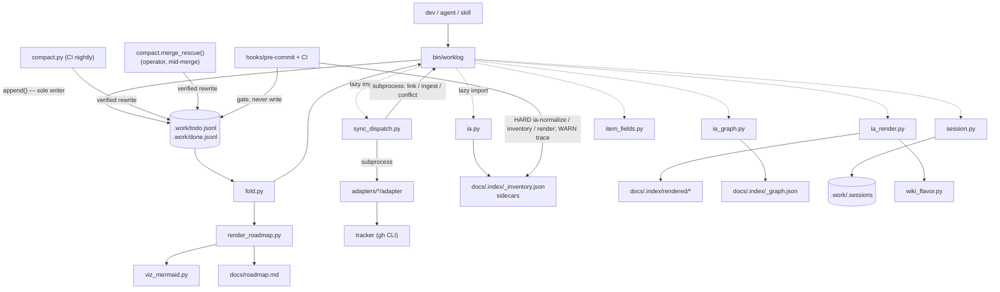

# Worklog — Code Walkthrough

The guided tour a new team member reads on day one. Every claim is anchored in
the code at the commit above. The companion design document is
`docs/designs/current_design_doc.md`; where this walkthrough and that document
disagree with the code, the code wins (drift is reported in §6).

## 1. Orientation

Three sentences: **Worklog tracks work as an append-only JSONL event log inside
the git repo; item state is a fold over the events, and git's union merge makes
concurrent writes compose instead of conflict.** Everything human-readable — the
roadmap, status reports, Mermaid diagrams, and (since v0.13.0) the IA reader
plane under `docs/.index/` — is generated from the log and committed docs, and
everything remote — tickets, wiki pages — is a mirror driven through a typed
dispatcher or a skill. The rules that matter are enforced by hooks and CI, not by
memory.

Directory map:

| Path | What lives there and why |
|---|---|
| `bin/worklog` | The CLI and the **only** writer of `.work/*.jsonl` (1502 lines). |
| `bin/fold.py` | The only code allowed to decide what the log *means* (371 lines). Holds `external_owners()` (v0.18.0) and, since v0.19.0, `position()` plus the per-item `apply_watermark()` — the two halves of the #284 fix. |
| `bin/ulid.py` | IDs (114 lines). The deterministic form that makes ingest idempotent across clones, and (v0.19.1) `git_commit()` — provenance for the event, deliberately *not* for the id. |
| `bin/canonical.py` | THE canonical hash (sync change detection). 34 lines, high blast radius. |
| `bin/sync_dispatch.py` | Every ticket-sync invariant, in one place (856 lines). |
| `bin/compact.py` | The only file rewriter (498 lines). CI-only for compaction; also the two merge guards and, since v0.19.0, `merge_rescue()` — the repair an operator runs by hand. |
| `bin/render_roadmap.py`, `bin/viz_mermaid.py` | Byte-deterministic roadmap + diagrams. |
| `bin/plan_capture.py`, `bin/adr.py` | Pure helpers: plan parsing (+ `ticket_refs()`, v0.19.0), ADR tooling. |
| `bin/ia.py` | wiki_key, truth_state, inventory, normalize, sidecars (IA foundation, 616 lines). |
| `bin/ia_render.py` | Reader plane: Home, Sidebar, indexes, publish-manifest, aliases, artifact pages (v0.14.0), and (v0.19.0) the wiki-flavor seam + per-`doc_type` banners + live PR pages (735 lines). |
| `bin/ia_graph.py` | Traceability graph, link-pr, ticket-body, trace-check, `build_adjacency()`/`item_links()` (v0.14.0), and (v0.19.0) `pr_sync()` + the `find` search surface (520 lines). |
| `bin/session.py` | (v0.19.0) Advisory registry of harness sessions sharing this checkout. 130 lines, blocks nothing. |
| `bin/changelog.py` | (v0.19.0) `worklog changelog-draft` — the starting point for release notes, never the notes. |
| `bin/item_fields.py` | (v0.19.0) CORE vs CATALOG: which item fields exist, and which this repo switched on. |
| `bin/wiki_flavor.py` | (v0.19.0) The renderer's one platform seam: `link()` + `sanitize()`, nothing more. |
| `.work/` | The log (`todo.jsonl`, `done.jsonl`), `config.yml`, ledgers, and (gitignored) `.sessions`. |
| `docs/.index/` | Generated IA plane (committed, regenerate-and-diff, **hard-gated** since v0.19.0). |
| `adapters/` | `github` (worked example), `fake` (CI double), authoring rules. |
| `hooks/` | git pre-commit/pre-merge-commit/commit-msg (v0.15.0) + five Claude Code hooks (`session-end.sh` new in v0.19.0). |
| `plugin/` | Claude Code packaging; `plugin/scripts/` mirrors `bin/` + `hooks/`, and since v0.19.0 the harness-hook copies are sync-checked too. |
| `schema/` | `capabilities`, `adapter-io`, `adr`, `doc`, `entity` JSON schemas. |
| `tests/` | 39 stdlib-unittest suites, 520 test functions; the executable spec. Merge safety alone accounts for `test_watermark.py` and `test_bug_merge.py`. |
| `docs/` | Generated roadmap, frozen plans/status/designs, ADRs 0001–0007, the spec (v1.9). |
| `docs/integrations/` | Eleven per-system setup guides + index (v0.16.0), prose only, no code. |

The one diagram (derived from actual imports and subprocess calls):



## 2. Execution-order tour

### 2.1 The write path: `worklog add` → one line in the log

Entry: argparse dispatches to `cmd_add` (`bin/worklog`, `build_parser` tail +
`cmd_add` body at lines 81–105). Validation happens **before** any write —
`--unplanned` requires `--discovered-during`, and taxonomy rules are hard here
even though the fold is lenient:

```python
def check_taxonomy(level, kind, milestone):
    """Write-time rules, taxonomy spec §2. The fold is lenient; this is not."""
    if level == "epic":
        if kind in ("bug", "triage"):
            sys.exit(f"worklog: an epic cannot be kind:{kind} — epics are "
                     "feature or ops (taxonomy §2.2)")
        if milestone is not None:
            sys.exit("worklog: milestone lives on leaves; epic milestones are "
                     "derived (taxonomy §2.5)")
```
— `bin/worklog — check_taxonomy(), lines 70–79`

Note the `cmd_add` comment: kind is only written when given — an omitted kind
folds to triage (§2.3), never silently to feature. Unclassified must look
unclassified.

**Where the event dict comes from (v0.19.1).** Every event the CLI writes starts
at `base()`, which is also where git provenance is stamped:

```python
def base(item, op, actor):
    ev = {"ev": ulid.new(), "ts": time.strftime("%Y-%m-%dT%H:%M:%SZ", time.gmtime()),
          "actor": actor, "item": item, "op": op}
    sha = ulid.git_commit()
    if sha:
        ev["git"] = sha
    return ev
```
— `bin/worklog — base(), lines 86–101`

Read the docstring above it and the one on `ulid.new()` together; they are one
argument. v0.19.0 put the short git hash *inside the id*, spending five of its
eighty entropy bits, so that agents on different branches minted visibly
different ids. v0.19.1 reverted that and moved the information to its own field.
The reasoning: an id is issued once and never changes, and the only thing it
must guarantee is that it does not clash — entropy is not currency to spend on
metadata. And the field traces *better*, because an item's id is minted once and
could only ever name the branch the **item** was created on, while a per-event
field names the origin of each event. `if sha:` matters too: outside a git repo
the field is omitted entirely rather than written empty.

`git_commit()` memoises in a one-element list because `worklog` mints many
events per run and HEAD does not move underneath one command — without the memo
the only writer would carry a subprocess in its hot path. `WORKLOG_NO_GIT_PROVENANCE`
skips it, and an `OSError` degrades to `""`; provenance is never a reason a write
fails.

Every event then funnels through the single writer:

```python
def append(event):
    """The only writer. Single O_APPEND write, always newline-terminated. ..."""
    if len(event.get("set", {}).get("body", "")) > MAX_BODY:
        sys.exit(f"worklog: body exceeds {MAX_BODY}B; put prose in the plan doc")
    _warn_concurrent_sessions()
    line = json.dumps(event, separators=(",", ":"), sort_keys=True) + "\n"
    fd = os.open(LOG, os.O_WRONLY | os.O_APPEND | os.O_CREAT, 0o644)
    try:
        if os.fstat(fd).st_size:
            rfd = os.open(LOG, os.O_RDONLY)
            try:
                os.lseek(rfd, -1, os.SEEK_END)
                if os.read(rfd, 1) != b"\n":
                    line = "\n" + line
            finally:
                os.close(rfd)
        os.write(fd, line.encode())   # atomic under PIPE_BUF
    finally:
        os.close(fd)
    return event
```
— `bin/worklog — append(), lines 59–83`

What it receives: a finished event dict. What it returns: the event. What can
fail: an oversized body exits before the write; everything else is one atomic
`write()`. Why it is written this way: the self-heal (`lseek -1; read 1`) repairs
a hand-edited file missing its trailing newline — without it, `O_APPEND` would
fuse two events into one unparseable line and lose both (spec §8.2). `MAX_BODY =
2048` (line 32) is "derived from PIPE_BUF … Not a setting." `VERSION = "0.19.1"`
(line 33) is lockstepped with the plugin by `tests/test_plugin.py`.

**Why the session advisory lives *here* (v0.19.0, #236).** `_warn_concurrent_sessions()`
sits in `append()` rather than in each command, and the docstring says why:
"every write in the system funnels through here, so one guard covers
add/update/close/link/ingest and anything added later, and no caller can forget
it." It fires once per process, on stderr, never blocking — the whole body is
wrapped so that "an advisory must never break a write", and
`WORKLOG_NO_SESSION_WARN` silences it. `bin/session.py` is equally defensive in
the other direction: a missing or corrupt `.work/.sessions` reads as `{}`, and
writes are best-effort. A bad advisory file must never be the reason someone
cannot record work.

The registry itself exists because there is no process identity to key on:
`worklog` is a short-lived CLI, so pid, ppid and even POSIX session id turn over
between tool calls. The **harness** is the only thing that knows a session is one
session, so `hooks/prompt-reminder.sh` heartbeats `session.touch(session_id)`
every turn and `hooks/session-end.sh` calls `session.end()` on the way out; the
CLI only ever reads. It deliberately never learns *which* session it is —
"two live heartbeats in this directory" is the entire condition worth warning
about, and evaluating it needs no self-knowledge.

**Optional fields (v0.19.0, #108).** `cmd_add` finishes with
`ev["set"].update(item_fields.collect(a))`, and the parser was built with
`item_fields.add_arguments(a)`. A field that is switched off in
`.work/config.yml` never gets an argparse flag at all, so `worklog add --risk
high` in a repo with risk off is an "unrecognised option" error rather than a
validation refusal. That is the point: for a CLI whose `--help` **is** the
prompt an agent reads, invisible is the only honest meaning of "disabled".

### 2.2 The read path: `fold()` decides what the log means

Every read command (`list`, `show`, `fold`, roadmap, status, sync scope, IA plan
lifecycle) calls `fold([todo, done])`. Four stages, each load-bearing:

**Parse tolerantly** — `read_lines()` (`bin/fold.py`): a bad line is reported
into `result.errors` and skipped. The docstring explains why this is not
politeness: union merge plus a missing newline "can fuse two valid lines into
one invalid one, and that must cost two events, not the entire history."

**Dedupe and sort deterministically**:

```python
    seen: Dict[str, Dict[str, Any]] = {}
    for ev in events:
        key = ev["ev"]
        if key in seen:
            result.deduped += 1
            continue
        seen[key] = ev
    return sorted(seen.values(), key=position)
```
— `bin/fold.py — dedupe_and_sort(), lines 163–182`

ULIDs sort lexicographically by time, so ordering is a string sort. **There is
no tiebreak, and its removal is instructive** (v0.19.0, worklog#259). This used
to sort on `(ev, actor, sha256(line))`, advertised as "what makes two machines
fold the same bag of lines identically". It was unreachable by construction:
dedupe runs first and is keyed on `ev`, so no two events reaching the sort can
share one. The docstring now says the tiebreak was "worse than silence, because
it advertised a guarantee that came from the dedupe above it." If you read the
v0.18.0 walkthrough, that snippet is the one thing in it that is now false.

**Where an event applies** — `position()` (v0.19.0):

```python
def position(ev):
    if ev.get("op") == "snapshot" and ev.get("through"):
        return (ev["through"], 0)
    return (ev["ev"], 1)
```
— `bin/fold.py — position(), lines 185–207`

Identity is still `ev`; this is *only* ordering, and separating the two is the
whole trick. A snapshot's own `ev` is minted at compaction time, so it sorts
above everything — and because a snapshot **replaces** state entirely, a branch
that closed an item before that compaction ran would have its close applied
first and immediately overwritten. The work vanished even though the event was
still in the log. Sorting the snapshot at its `through` puts it back where it
belongs: after the events it folded, before anything later on any branch. The
`0` in the tuple keeps a snapshot ahead of a same-positioned ordinary event, so
the later event wins rather than being replaced. Legacy snapshots carry no
`through` and fall back to their own `ev` — exactly how they sorted before.

**Apply the watermark, per item** — `apply_watermark()` (v0.19.0, §2.16). Two
rules replace the old single global mark: an item with **no** snapshot never has
events dropped, because nothing folded them so nothing carries their state; an
item **with** a snapshot drops only its own events at or below that snapshot's
`through`. `snapshot` events are always exempt and `compact` lines are removed.
The old rule — drop everything at or below `max_ev` over the log the compaction
read — was a *time* marker doing a *content* marker's job, and it silently lost
branch work (ADR-0006, ADR-0007).

**Replay** — `fold()`. The subtleties that bite naive implementations, each with
a guarding test (§4): `snapshot` replaces state entirely (never merges); a
duplicate `create` degrades to an update; `close` takes its status from `set`
(only defaulting to `done` when nothing closed was set); `conflict` records
without changing state; and a later write to a conflicted field clears the
conflict while an *earlier* one does not, because events apply in `ev` order
(`_apply_mutations()`).

Orphans: an event for an item with no create/snapshot creates
`{"id": iid, "_orphan": True}` — "Report it; never crash, never silently invent
an item." Legitimate mid-rebase. Compaction counts orphans as open so it never
drops them (`bin/compact.py` partition comment).

One more subtlety worth knowing before you touch `_normalize_taxonomy()`: the
`kind:triage` default applies on `create` and **not** on `snapshot`
(`defaults=False`). A snapshot must be a lossless round-trip of the state it was
given, and re-fabricating taxonomy on every re-fold for an item that was never
created — a closed orphan, say — makes compaction a non-idempotent transform and
fails its own verify step.

Unknown event fields are simply ignored, which is what made v0.19.0's `through`
and v0.19.1's `git` safe to add with no migration in either direction.

### 2.3 Plan capture: one command, one epic, N tasks, one frozen doc

`cmd_plan_capture()` (`bin/worklog`, lines 339+). It parses the draft with
`plan_capture.parse_tasks()` — checkboxes under a `## Tasks` heading only, with
the regex `TASK_RE` (`bin/plan_capture.py`) where a leading indent means
"subtask of the task above". It refuses to recapture a slug that already has a
plan (invariant 15.8), appends the epic create, then each task/subtask create,
and finally writes the plan doc with front matter linking every item ID.
Captured items get explicit `kind:feature`.

**The guard is slug-scoped, not filename-scoped (v0.17.0, PR #198 + a
same-day follow-up; `bin/worklog — cmd_plan_capture()`, lines ~344–367).**
The original code checked only `os.path.exists(f"docs/plans/{date}-{slug}.md")`
with `date` from `time.gmtime()` (UTC) — so it enforced "plans are never
rewritten" only when the UTC date happened to match the plan's actual filename.
A plan captured in the evening from a timezone behind UTC looks for
*tomorrow's* UTC-dated path, finds nothing, and silently writes a duplicate:
observed in a downstream repo on 2026-07-26 (a byte-identical duplicate plan
plus 23 duplicate work items, caught by hand and rolled back — nothing had
warned). The fix globbed `docs/plans/*-{slug}.md` across every date instead of
one fixed path. That fix's own bare glob then matched by raw string suffix, not
field boundary — a search for slug `migration` also matched an existing
`2026-07-01-database-migration.md` (real slug `database-migration`), a
false-positive refusal of a legitimately new, unrelated slug, caught in review
before PR #198 merged. The shipped guard anchors on the fixed date shape:

```python
slug_re = re.compile(r"^\d{4}-\d{2}-\d{2}-%s\.md$" % re.escape(a.slug))
existing = sorted(p for p in glob.glob("docs/plans/*.md")
                  if slug_re.match(os.path.basename(p)))
```

Two regression tests pin both failure modes
(`test_plan_capture_refuses_a_slug_already_captured_on_another_date` — a plan
dated `2020-01-01` must still be caught; `test_plan_capture_does_not_false_positive_on_a_suffix_match`
— a longer slug sharing a suffix must not block a new, shorter one),
`tests/test_integration.py`.

The whole flow is *forced* by `hooks/exit-plan-capture.sh`, which fires on
`PostToolUse: ExitPlanMode` and injects a non-optional instruction that now also
requires `worklog ia-index` after capture so the reader plane stays current.

### 2.4 The roadmap: a pure function, gated by diff

`render_roadmap.render()` folds the log and emits markdown. Two non-obvious
choices: `generated-at` comes from the newest event's ULID timestamp, not the
wall clock — "wall clock here would fail every commit" — because
`hooks/pre-commit` regenerates and diffs. The default `--viz deps,hierarchy` in
`cmd_roadmap_render` **must** match `render()`'s default because the hook runs
the bare script and diffs against the file the CLI wrote. `viz_mermaid.py` caps
nodes at `MAX_NODES = 40` and strips Mermaid-breaking characters.

`hooks/pre-merge-commit` is a one-line `exec` of the same script, because "git
runs THIS hook (not pre-commit) when a merge auto-commits."

### 2.5 Ticket sync: the dispatcher owns everything

`worklog sync` runs `sync_dispatch.main()` in-process (`cmd_sync()`). Order
inside `Dispatcher.sync()`: capabilities gate, push, pull, save state, report.

**The gate runs first, every run**: adapter `capabilities` output is parsed,
validated against the embedded schema mirror (`CAPABILITIES_SCHEMA`) by a 28-line
mini JSON Schema validator, plus one check the schema subset cannot express —
`"{ulid}"` must appear in `caps["marker"]["template"]`
(`sync_dispatch.py — capabilities()`).

**Push scope** (`push_items()`): open ∪ hash-dirty ∪ **key-dirty** (v0.18.0) ∪
`--keys`. The canonical hash is computed over the *outbound* shape — after type
degradation — so "the degraded echo coming back on pull still suppresses." A
closing item whose hash is dirty pushes an `update` with the final item shape
*before* the `close` verb (v0.12.1; `TestCloseSyncsFields`). On a successful
create, external identity enters the log the only way it can — `worklog link` as a
subprocess (invariant 15.4). Since v0.18.0 a **collection-level collision gate**
runs before the loop and a contested key is skipped entirely — see §2.14.

**Pull**: NDJSON lines; echo suppression by comparing `canonical_hash(line)` to
`last_pushed_hash`; remote-only becomes `worklog ingest` with deterministic
`ev = ulid.deterministic(system, key, rev, rev_ts)`; both-sides-changed records
a `conflict` per field and never overwrites. Field-diff runs over
`INGEST_FIELDS` (includes `level`/`kind`/`milestone` since v0.12.0). Labels on
pull remain future work.

**Failure handling** is an exit-code table (`handle_exit()`): 2 aborts; 3 pops
`last_pushed_hash`; 4 was already retried; 5 files per-field conflicts; anything
else is drift. No adapter at all is a *mode*: `LOCAL_ONLY`, exit 0.

**Adapters are dumb on purpose.** `adapters/github/adapter` maps verbs to `gh`
calls and embeds the marker; a test bans invariant tokens from every adapter
source.

**Rich bodies (v0.13.0):** `worklog ticket-body <ulid>` prints a projection with
summary, epic/plan/milestone context, and graph edges
(`ia_graph.ticket_body()`, lines 166+) for the issue-description skill to push.

### 2.6 Compaction: the one rewrite, quadruple-checked

`compact.compact()` (`bin/compact.py`), nightly on main via
`.github/workflows/compact.yml`. Sequence: refuse on uncommitted log changes;
watermark = max raw `ev`; short-circuit if todo is already all snapshots;
partition open vs closed where *orphans count as open* — "never drop data"; write
temp files; then gate on `fold(new) == fold(old)` plus trailing newline plus
every line parses. Only after that do two `os.replace` calls swap the files.

v0.13.0: snapshots write folded state **verbatim** so a closed orphan no longer
fails verify by diverging from fold (item 01KY5HW7KS / #101).

v0.19.0: between the fold and the partition, `compact()` walks the **raw** input
lines of both files a second time to build `per_item = {id: highest ev}`, and
`_snapshot(item, per_item.get(id))` writes that as `through`:

```python
    per_item = {}
    for path in (todo_path, done_path):
        for _line, e in _raw_lines(path):
            if e is None or e.get("op") == "compact":
                continue
            iid, ev = e.get("item"), e.get("ev")
            if iid and ev and ev > per_item.get(iid, ""):
                per_item[iid] = ev
```
— `bin/compact.py — compact(), lines 165–173`

Raw rather than folded, deliberately: the mark must describe what was **read**,
not what survived. And `through` goes top-level on the event, never inside
`set`, so it can never become item state and never reaches the
`fold(new) == fold(old)` comparison. The global `compact` line still gets
written and is still the legacy fallback. Both `_snapshot()` and
`_compact_line()` also stamp `git` when `ulid.git_commit()` returns one.

### 2.7 Status: deterministic facts, model prose, frozen file

`_status_facts()` is the deterministic half: a fold plus a raw-event pass; an
event is in-window when its **`ev` ULID timestamp** is. Daily windows open at the
last daily report's date; weekly is a fixed 7 days; timecards bucket per UTC day
and attach best-effort git commit subjects. The prose is the skill's job.
`cmd_status --write` stamps front matter with the window and the `through`
watermark and refuses to overwrite without `--force` (invariant 15.9).

### 2.8 The automation ring

Claude Code hooks (wired by `plugin/hooks/hooks.json`):
`prompt-reminder.sh` injects a one-line policy on every prompt;
`stop-worklog-check.sh` **blocks** ending a session where the tree changed but
`.work/todo.jsonl` did not, with a settle-and-recheck sleep;
`session-doctor.sh` reports missing policy blocks, unarmed hooks, or plugin
version skew, read-only.

CI (`worklog.yml`) re-runs the pre-commit script verbatim (as
`WORKLOG_SKIP_BRANCH_GUARD=1 hooks/pre-commit` since v0.15.0 — the checkout
runs with no commit in flight, and the branch guard only makes sense for an
actual `git commit`) — "A dev can `--no-verify` past the local hook; not
this" — then unit, integration, and a subprocess-aware coverage gate
(`--fail-under=80`). A new PR-scoped step (v0.15.0) walks
`git rev-list --no-merges base..HEAD` through `hooks/commit-msg` for every
non-merge commit on the PR, requiring `fetch-depth: 0` on the checkout since
`commit-msg`'s own `MERGE_HEAD` check has nothing to read post-hoc in a CI
clone. `merge-when-green.sh` polls `gh pr checks` and merges only on
all-green; empty check output counts as pending, and 24 failed polls exit 4
(ADR-0003).

Pre-commit runs **IA gates as hard failures** since v0.19.0 (#98) — the
warn-only rollout described in earlier walkthroughs is over:

```sh
if [ -f bin/ia.py ] && [ -x bin/worklog ] && [ -d docs/.index ]; then
  python3 bin/worklog ia-normalize --check >/dev/null 2>&1 || \
    fail "doc metadata drift; run: worklog ia-normalize"
  python3 bin/worklog ia-inventory --check >/dev/null 2>&1 || \
    fail "inventory stale/invalid; run: worklog ia-inventory"
  [ ! -f bin/ia_render.py ] || python3 bin/worklog ia-render --check >/dev/null 2>&1 || \
    fail "rendered pages/manifest stale; run: worklog ia-render"
  # trace-check stays warn-level here forever; --strict runs at release time
  [ ! -f bin/ia_graph.py ] || python3 bin/worklog trace-check >/dev/null 2>&1 || \
    echo "worklog: WARNING — unlinked evidence; run: worklog trace-check" >&2
fi
```
— `hooks/pre-commit` (IA block, lines 136–146)

The `-d docs/.index` guard is what makes the promotion safe, and the comment
above it spells out the distinction: that test asks "has this repo opted **into**
the IA?", where the `bin/ia.py` test only asks "does it have the code?" A
scaffolded repo gets `bin/` from the plugin but has never generated an index and
must not be blocked from its first commit. A repo that *has* an index stays
fully enforced — deleting any single generated file inside it still fails,
because the directory is still there.

**The conflict-marker guard (v0.19.0), and why it has no merge exemption:**

```sh
conflicted=$(git diff --cached --name-only --diff-filter=ACM |
             while IFS= read -r f; do
               [ -f "$f" ] || continue
               if git show ":$f" 2>/dev/null |
                  grep -qE '^(<{7}|={7}|>{7})( |$)'; then echo "$f"; fi
             done)
```
— `hooks/pre-commit`, lines 36–52

A merge is *exactly* when conflict markers get committed, so exempting merges
would exempt the only case that matters. The hook's own comment records the
incident: `commit-msg` exempts merge commits from its item-reference rule and
nothing else parsed `tests/` or `plugin/`, so a resolution that missed a hunk
committed cleanly and was only found by running the suite. It reads **staged
content** via `git show ":$f"` rather than the worktree — an unstaged conflict
elsewhere is not this commit's problem — and the `( |$)` in the pattern is what
keeps prose *about* conflict markers from tripping it
(`test_bug_merge.py — test_prose_about_conflict_markers_is_not_a_conflict`).

`PYTHONDONTWRITEBYTECODE` is set in the hook so it never dirties the worktree
with `__pycache__` (item 01KY5P9V0C).

**CI runs the merge guards directly (v0.19.0).** `worklog.yml` gained a
`python3 bin/compact.py --merge-check` step, because inside the hook those
guards are gated on `WORKLOG_MERGE_COMMIT` or an on-disk `MERGE_HEAD` and
neither exists in a CI checkout — while for a `pull_request` GitHub checks out
the *merge result*, so CI sees precisely what the local hook would have seen
(ADR-0005, #262). This is the answer to ADR-0005's own recorded consequence that
the guards never fire on a hosted merge.

### 2.9 IA plane: normalize → inventory → render → graph

**Identity.** Every doc gets a stable `wiki_key`. Legacy keys are seeded
**verbatim** from `.work/published.json` so no URL or page name changes;
new docs derive keys by rule (`ia.derive_canonical_key()`,
`ia.resolve_key()`). CLI: `worklog wiki-key <path>`.

**Normalize** (`ia.normalize()`, `cmd_ia_normalize` lines 510–520):

```python
def cmd_ia_normalize(a):
    import ia
    changes = ia.normalize(check=a.check)
    for c in changes:
        print(("needs: " if a.check else "wrote: ") + c)
    if a.check and changes:
        sys.exit(1)
    ...
```
— `bin/worklog — cmd_ia_normalize(), lines 510–520`

Frozen docs get additive sidecars under `docs/.index/<wiki_key>.yml`;
sanctioned-live docs get in-place identity fields only. `truth_state` is
recomputed every run (`DYNAMIC_FIELDS`), never pinned from a stale sidecar.

**Inventory** (`ia.build_inventory()` / `write_inventory()`): pure function of
committed files → `docs/.index/_inventory.json` (one record per doc).

**Render** (`ia_render.write_all()`): Home, Sidebar, decisions/releases/status
indexes, truth banners, `publish-manifest.json`, `aliases.json`. Deterministic —
no wall clock — so `--check` can regenerate-and-diff. Since v0.19.0 every page
also passes through `_links()` (the `wiki_flavor` seam, §2.17) **before**
`build_manifest()` hashes it, so `render_hash` describes the bytes that get
published; `page_name()` sanitizes through the flavor rather than an inline
`.replace(" ", "-")`; and `banner()` delegates its wording to `_banner_text()`,
which branches on `doc_type` (#137). Rendered output is byte-identical to
v0.18.0 across all 319 pages — the re-plumbing was deliberately invisible.

**Live PR metadata** (v0.19.0, #138): `worklog pr-sync <n>` is the one network
step in this pipeline. `ia_graph.pr_sync()` calls `gh pr view` once for
`PR_FIELDS`, flattens the file list to sorted paths, and writes a `pr/<n>`
sidecar; `rollup_checks()` collapses the check rollup to
`passing|failing|pending|mixed|none` with the worst state winning.
`render_pr_page()` reads only the sidecar, so `render_all()` stays offline and
`--check` stays deterministic — which is exactly why the call lives in the CLI
and not in the renderer.

**Convenience wrapper:**

```python
def cmd_ia_index(a):
    import ia, ia_render
    for c in ia.normalize():
        print("normalize: " + c)
    ia.write_inventory()
    print("inventory: " + ia.INVENTORY)
    for path in ia_render.write_all():
        print("wrote: " + path)
```
— `bin/worklog — cmd_ia_index(), lines 534–541`

**Graph** (`ia_graph.build_graph()` / `write_graph()`): typed edges from
frontmatter, plan items, ADR references, and item sidecars. `link-pr` is an
**overlay only** — it does not append to the event log:

```python
def link_pr(ulid_, pr=None, commit=None):
    ...
```
— `bin/ia_graph.py — link_pr(), lines 118+`

`trace_check(strict=False)` lists closed items missing plan/ticket/PR links;
`--strict` exits 1 at release. `ia-graph --seed` proposes decides/implements
edges into gitignored `.work/suggestions.jsonl` (propose-only, never auto-edits
docs).

**Schema split.** Document types live in `schema/doc.schema.json`; graph/execution
entities (`item` today) live in `schema/entity.schema.json`. Both are mirrored in
`ia.DOC_TYPES` / `ENTITY_TYPES` / `REQUIRED_*` constants; `TestSchemaSync` pins
equivalence and asserts the two enums are disjoint so items never pretend to be
documents (#111).

### 2.10 Artifact pages (v0.14.0): one page per item, PR, release

`docs/plans/2026-07-24-artifact-pages.md`. Two graph nodes existed since the
Phase-4 traceability graph shipped — `pr/<num>` and `release/<tag>` stubs with
no page of their own. This release gives every work item, PR, and release a
generated wiki page, reusing graph edges instead of adding stored fields.

**One shared traversal.** `ia_graph.build_adjacency(graph)` builds the
forward/backward edge maps once per render pass; `item_links(iid, fwd, back)`
projects parent/children/PRs/release for one item from those maps:

```python
def item_links(iid, fwd, back):
    key = item_key(iid)
    parent = next((to for typ, to in fwd.get(key, []) if typ == "belongs-to"),
                  None)
    children = sorted(to for typ, to in back.get(key, []) if typ == "contains")
    prs = sorted(to for typ, to in fwd.get(key, []) if typ == "lands-in")
    release = next((to for typ, to in fwd.get(key, [])
                    if typ == "targets" and to.startswith("release/")), None)
    return {"parent": parent, "children": children, "prs": prs,
            "release": release}
```
— `bin/ia_graph.py — item_links(), build_adjacency()`

Every one of the three new renderers calls this — "not four near-duplicates"
was a design decision in the plan (`render_item_page()` branches by level
instead of shipping separate story/epic/task renderers).

**Ticket pages** (`ia_render.render_item_page()`): title, level/kind/status
badge, a one-line summary derived at render time from the body's first
sentence (`one_line_summary()` — never cached, keeping the module's
byte-determinism), an upward `## Hierarchy` walk to the root
(`_upward_chain()`, cycle-safe via a `seen` set), a downward `## Subtasks` /
`## Children` list with a `done/total` progress rollup, `## Linked PRs`, and
`## Release`. `worklog ia-ticket <ULID>` (`cmd_ia_ticket`, `bin/worklog`)
previews one page without a full render pass — builds the graph, calls
`build_adjacency()`, and writes `render_item_page()`'s output to stdout.

**Release pages** (`render_release_page()`): the Change Log is
milestone-tagged closed items plus their linked PRs, walked straight off the
graph — *not* a `CHANGELOG.md` parser. `CHANGELOG.md` stays human-authored
prose; the page's Change Log is a separate, mechanical, always-accurate list
(the plan is explicit that building a changelog-parsing engine would be a
fragile addition this project avoids). Also renders a `## Release Tree`
(`_release_tree()` — a lighter nested list than `viz_mermaid.hierarchy()`,
which only covers *open* items, a different "what's left" use case), Related
PRs, Related Tickets, and Dependencies & Risks.

**PR pages** (`render_pr_page()`): linked tickets via reverse `lands-in`
edges, related releases/epics via `item_links()` on each linked ticket.
Changed-files and CI/review status render literally as `"not tracked"` — no
code in this repository calls `gh pr view` today, and the plan defers that
integration to a separate follow-up item (`worklog pr-sync`, filed as #138,
not built this release) rather than silently shipping a page that implies
data exists.

**Manifest growth.** `build_manifest()` gained a second loop keyed off the
`tickets/`, `releases/`, `prs/` filename prefix in the rendered-pages dict —
a new entity type needs one new prefix branch, not a new loop. The
published-page manifest grew from 51 entries to 258.

### 2.11 Branch discipline (v0.15.0): pre-commit's branch guard + `hooks/commit-msg`

`docs/plans/2026-07-25-branch-discipline-hooks.md`. Shipped after a real
incident: local `main` drifted 13 commits ahead of `origin/main` for hours
because every commit landed straight on `main`, while GitHub's nightly
compaction bot pushed its own commit directly to `origin/main` in parallel —
the divergence surfaced as a failed PR merge. Two new checks follow the
existing hook philosophy ("hooks enforce invariants, not hope").

**Branch guard** — a new block in `hooks/pre-commit`, inserted right after
`fail()` is defined, before the `.work/*.jsonl` checks:

```bash
if [ -z "${WORKLOG_SKIP_BRANCH_GUARD:-}" ] && \
   [ -z "${WORKLOG_MERGE_COMMIT:-}" ] && \
   [ ! -f "$(git rev-parse --git-path MERGE_HEAD)" ]; then
  branch=$(git symbolic-ref --quiet --short HEAD || true)
  case "$branch" in
    main|master)
      fail "commits go on a branch, not '$branch' (main/master is pull-only). Run: git checkout -b <branch-name>, then commit there."
      ;;
  esac
fi
```
— `hooks/pre-commit` (branch-guard block)

Detached HEAD is allowed (`branch=""`). Two independent exemptions cover
"this is a merge, not authored work": `WORKLOG_MERGE_COMMIT` — set by
`hooks/pre-merge-commit` before it `exec`s into this script, because
`MERGE_HEAD` is **empirically not yet on disk** at the point git invokes
`pre-merge-commit` (it only appears between that hook running and
`commit-msg` firing) — and `MERGE_HEAD` itself, present by the time a merge
a hook rejected is resumed via a later plain `git commit`. A third variable,
`WORKLOG_SKIP_BRANCH_GUARD`, is set only by non-commit callers running the
script standalone with no commit in flight: `plugin/scripts/doctor.sh`'s
health check, the CI invariants step, and two
`tests/test_integration.py` "CI gate passes" assertions — all of which would
otherwise false-positive on `main`. `hooks/pre-merge-commit` itself needed no
changes — it's a one-line `exec` of `pre-commit`, and `MERGE_HEAD`/
`WORKLOG_MERGE_COMMIT` already cover it.

**`hooks/commit-msg`** — new hook, requires every non-merge commit message to
reference a worklog item or ticket:

```bash
[ -f "$(git rev-parse --git-path MERGE_HEAD)" ] && exit 0

python3 - "$1" <<'PY' || fail "commit message must reference a worklog item (26-char ULID) or a ticket (#123) -- see: worklog show <id>. Merge commits are exempt."
import re, sys
msg = open(sys.argv[1], encoding="utf-8").read()
sys.exit(0 if (re.search(r'\b[0-9A-HJKMNP-TV-Z]{26}\b', msg) or
               re.search(r'#\d+', msg)) else 1)
PY
```
— `hooks/commit-msg`

The ULID pattern matches `bin/ulid.py`'s Crockford base32 alphabet exactly.
No exemption beyond merge commits (via `MERGE_HEAD`, same signal as the
branch guard). Orthogonal check — applies on any branch, including feature
branches.

**Wiring.** `hooks/commit-msg` is mirrored byte-identical to
`plugin/scripts/commit-msg`; `plugin/scripts/init.sh`'s hook-copy loop and CI
workflow template both gained it; `uninstall.sh` removes it symmetrically;
`doctor.sh` checks its existence/exec bit and now runs its own `pre-commit`
invocation with `WORKLOG_SKIP_BRANCH_GUARD=1`; `tests/test_plugin.py`'s
`CANON` list includes it so `TestCanonSync` still guards the mirror. Both
hooks hard-fail immediately — no warn-only rollout period. The IA gates took
the slower route and were promoted to hard failures in v0.19.0 (§2.8), so the
two philosophies have converged.

**Release skill.** `plugin/skills/release/SKILL.md` §3's "direct-commit
repos: commit on the default branch" mode is removed — dead once the branch
guard ships everywhere; the skill now describes branch+PR landing only. Three
v0.19.0 additions: preflight suggests `worklog changelog-draft --version X.Y.Z`
when the unreleased section is missing or thin (bullets, not release notes —
edit the prose and read the exclusion list before stamping); stamping now
requires `worklog trace-check --strict` to pass, so every closed item traces to
a plan, ticket and PR before a tag exists; and publishing ends with a
`worklog ia-index` run that is **committed**, because publishing writes each
page's live wiki location into the ledger and the IA gates are hard now. One
pass converges, since wiki location is not part of the render hash. The
plan-capture skill gained the same re-index-and-commit tail.

**Test fixture fallout.** ~23 `commit_all()` calls in
`tests/test_integration.py` and 3 raw `git commit` calls in
`tests/test_plugin.py` mostly committed on `main` with no-reference
messages — pure fixture plumbing. Pre-existing baseline commits got
`no_verify=True`; commits meant to represent real authored work moved onto a
branch (`Sandbox.branch()`) and picked up an item-ULID in the message,
following the file's existing precedent for "not what this test is about"
commits.

### 2.12 Integration guides (v0.16.0): a prose-only edge, no new `bin/` code

`docs/plans/2026-07-25-wiki-driven-integration-guides.md`. Eleven systems this
repo talks about but mostly doesn't ship real adapter code for — four SDD
tools it composes with (Superpowers, GSD, SpecKit, OpenSpec) and seven
ticket/wiki systems where only `adapters/github/adapter` is real (Jira,
Confluence, GitHub, GitLab, Azure DevOps, AWS CodeCatalyst, Google Cloud
DevOps) — each get a dedicated setup guide. The design choice worth noting:
this ships **zero new Python**. `WebFetch` (already available to any Claude
Code agent) covers "fetch the live wiki page at runtime"; `worklog wiki-add`
(pre-existing) covers "get an arbitrary file into the wiki-publish pipeline."
The entire feature is one new skill plus markdown content.

`plugin/skills/integration-guide/SKILL.md` (mirrored to
`.claude/skills/integration-guide/SKILL.md`) is pure prose, six numbered
steps:

1. **Match the name to a canonical key** via a fixed alias table in the skill
   body — no network call needed to resolve "ADO" or "Azure Boards" to
   `azuredevops`.
2. **Try the live wiki page first.** Build the URL from `wiki.root_url` in
   `.work/config.yml` plus `/Integration-<Name>`; `WebFetch` it.
3. **Verify before trusting.** A GitHub wiki does not 404 a missing page
   slug — it silently redirects to Home with a normal 200. The skill checks
   the response for a `## Recommended workflow` heading before treating it
   as a hit; anything else (network error, 404, wrong-page redirect) is
   handled identically to a fetch failure.
4. **Fall back to the local copy**, `docs/integrations/fallback-<key>.md`,
   saying so explicitly ("using the bundled local copy, which may lag the
   published page").
5. **Soft version-staleness check** — only for systems with a real,
   probeable CLI (`gh --version`, `glab --version`, `az --version`,
   `aws --version`); the four SDD tools are Claude Code skills with nothing
   to introspect, and the skill says so rather than fabricating a check.
6. **Compose, don't reinvent** — for Jira/Confluence, check for the global
   `jira`/`confluence` skill or an Atlassian MCP server before any raw
   REST/CLI call; that skill already owns auth, pagination, and markup
   conversion.

Content: `docs/integrations/README.md` (index) plus eleven
`fallback-<key>.md` files, one fixed ten-section template each (**When to
use, One-command setup, Adapter configuration, Recommended workflow, Mapping
events, Pulling changes, Rendering support, Example links, Gotchas &
troubleshooting, Last updated**) so the skill's lookup logic is uniform
across all eleven. Two placements are load-bearing and appear in exactly one
page each: the Jira/Confluence skill-reuse paragraph (§Recommended workflow,
those two files only), and the Confluence diagram-to-image conversion note
(§Rendering support, `fallback-confluence.md` only — Confluence storage
format doesn't render Mermaid/PlantUML fences directly).

Publishing: `bin/worklog wiki-add docs/integrations/fallback-<key>.md --key
integrations/<key> --title "Integration-<Name>"` registers the file in
`.work/published.json`; the ordinary `wiki-publish` skill's existing
hash-compare skip logic carries it from there — no new publish path was
built or needed (`wiki-publish/SKILL.md` §4). Confirmed: `git diff --stat
v0.15.1..v0.16.0` touches no file under `bin/`, `hooks/`, or `tests/` for
this feature — only `docs/integrations/*`, the two `SKILL.md` mirrors, and
the version/changelog/roadmap bookkeeping every release touches.

### 2.13 Item-id resolution (v0.17.1): one helper, six commands

Every command that *names an existing item* now goes through one lookup.
Before v0.17.1, only `reopen`, `resolve`, and `show` folded the log to find the
item; `close`, `update`, and `link` called `_require_item()` (a non-empty-string
check, nothing more) and then wrote the event under **whatever string the caller
passed**. Hand any of them the 8-character prefix that `worklog show` and
`worklog list` themselves print, and the event landed under that short id — which
folds into a brand-new phantom item, leaving the real one untouched:

```python
def _resolve(item):
    """Resolve a full ULID or an unambiguous prefix to the real item
    (worklog 01KYA99TVC). ..."""
    _require_item(item)
    r = fold([LOG, ".work/done.jsonl"])
    match = [i for k, i in r.items.items() if k.startswith(item)]
    if not match:
        sys.exit(f"worklog: no item matching {item}")
    if len(match) > 1:
        ids = ", ".join(sorted(i["id"] for i in match))
        sys.exit(f"worklog: {item} is ambiguous — matches {ids}")
    return match[0]
```
— `bin/worklog — _resolve(), lines 115–130`

What it receives: a full ULID or any prefix of one. What it returns: the folded
item dict (so callers get `item["id"]`, `item["status"]`, `item["_conflicts"]`
for free). What can fail: empty string, no match, or **ambiguous** — and that
last case is new behavior, not just refactoring. `reopen`/`resolve`/`show`
previously took `match[0]` when two ULIDs shared a prefix, an arbitrary pick;
`_resolve()` exits naming both candidates instead.

Callers, all of which now write under `item["id"]` rather than the raw argument:
`cmd_update()` (line 133), `cmd_close()` (156), `cmd_reopen()` (165),
`cmd_link()` (176), `cmd_resolve()` (242), `cmd_show()` (298). Two of those were
worse than a phantom item. `cmd_update()` used to do its current-state lookup as
`fold(...).items.get(a.item, {})` — for a prefix that returns `{}`, so
`check_taxonomy(cur.get("level"), ...)` ran against `level=None` (an epic could
be reclassified `kind:bug`, which taxonomy §2.2 forbids) and the
`cur.get("status") in CLOSED_STATUSES` guard never fired (so `update --status`
silently bypassed the "use `reopen`" refusal). `cmd_link()`'s failure mode was
the loudest downstream: a `link` event under a prefix minted an orphan item
*carrying a real external key*, which `bin/sync_dispatch.py` would then push to
the tracker.

This is the shape the lazy fix takes: `reopen` already had the prefix match, so
the fix was to lift those six lines into a shared helper and delete three
copies, not to add a guard to each caller. `git diff --numstat v0.17.0..v0.17.1
-- bin/worklog` is +30/−27 lines, one add and one delete of which is the
`VERSION` bump.

The regression suite is `tests/test_resolve.py` (new in v0.17.1, 143 lines,
sandbox-subprocess style copied from `test_taxonomy.py`): each of
close/update/link by prefix asserts `len(items) == 1` with the message "prefix
close minted a phantom item"; the two bypassed `update` guards get a test each;
`test_unknown_id_fails_loudly_and_writes_nothing()` reads the log before and
after and asserts byte equality; `test_ambiguous_prefix_names_the_candidates()`
derives the shared prefix with `os.path.commonprefix()` on two real ULIDs.

The same release widened one unrelated check in three copies:
`hooks/session-doctor.sh` (lines 15–18), `plugin/hooks/scripts/session-doctor.sh`
(same lines, mirrored), and `plugin/scripts/doctor.sh` (63–68) compared
`git config core.hooksPath` against the literal string `hooks` and failed
anything else. `worklog:init` writes that relative form, but a git **worktree**
resolves a relative `hooksPath` against the wrong CWD, so a worktree checkout
needs the absolute path — and doctor called a correctly-wired repo broken. All
three now accept either form, comparing
`cd "$hookspath" && pwd -P` against `$(pwd -P)/hooks`, and the failure message
quotes the offending value instead of asserting a single expected string.

### 2.14 One owner per remote ticket (v0.18.0): one predicate, three enforcement points

This is the release's centre of gravity, and the tour is worth walking in the
order the failure actually happens.

**The failure.** Two local items were allowed to own the same external ticket key
(`ado:294`). `worklog sync` pushed both; last writer won; a cancelled duplicate
marked a live P0 stakeholder-gating ticket **Done**. Hand-repairing the ticket did
not hold — the next sync rewrote the damage, twice. And it is invisible from the
log: `worklog fold` shows two items, each with a perfectly valid `external` block.

Why it *converges* on the wrong value rather than flapping: `.work/sync-state.json`
is keyed by ULID only, so the two owners get two independent, both-satisfiable
`last_pushed_hash` slots and neither can see the other. The correctly linked item
is hash-clean, so it is skipped forever and never repairs the ticket, while the
wrong one keeps re-pushing.

**The predicate** — one helper, so the CLI and the dispatcher cannot grow
divergent copies of the rule:

```python
def external_owners(items):
    """(system, key) -> sorted ids of every item claiming that remote ticket."""
    owners = {}
    for i in items:
        ext = i.get("external") or {}
        if ext.get("key"):
            owners.setdefault((ext.get("system"), str(ext["key"])), []).append(i["id"])
    return {k: sorted(v) for k, v in owners.items()}
```
— `bin/fold.py — external_owners(), lines 98–124` (docstring elided)

Three details in six lines, each of which is a bug if you get it wrong.
`i.get("external") or {}` rather than `.get("external", {})`: a merge or a hand
edit can leave a literal `null` there, and the default never fires when the key
*exists*. `str(ext["key"])` because adapters return ints — `294` must not be a
different ticket from `"294"`. `(system, key)` and never bare key, because
`ado:294` and `github:294` are unrelated tickets and a mid-migration repo
legitimately holds both. It returns *every* owner rather than only the duplicates,
because `link` needs "who else owns this" and `sync` needs "which keys have more
than one" — one filter each, not two traversals.

**Enforcement 1 — write time** (`bin/worklog — cmd_link(), lines 180–212`). The
command folds once and hands the fold down:

```python
    r = fold([LOG, ".work/done.jsonl"])
    cur = _resolve(a.item, r)
    ...
    if not a.force:
        others = [i for i in external_owners(r.items.values())
                  .get((a.system, str(a.key)), []) if i != cur["id"]]
```

`_resolve()` grew an optional pre-computed fold this release (`bin/worklog —
_resolve(item, r=None), line 115`) for exactly this caller: the documented
bulk-migration workflow links hundreds of items in a loop, and folding the whole
log twice per link is the difference between a fast migration and a slow one. The
refusal names the other item **and its title**, then prints the two-command move
(`unlink` then `link`), because "already linked" without an id is a message you
cannot act on.

Two properties of the guard that look like oversights and are not. It is
**status-blind**: a *cancelled* owner is among the most dangerous, since sync
pushes a full update against its key and then closes the ticket — the exact
sequence that marked the reported ticket Done. Guarding only open items would wave
the same bug through with the two commands reordered. And it is
**self-excluding**: re-linking an item to the key it already owns is normal
(refreshing `--url`/`--rev`, re-running a partial migration, sync's own auto-link
after a create), so `cur["id"]` is filtered out of `others`.

**Enforcement 2 — push time** (`bin/sync_dispatch.py — push_items(), lines
363–372`):

```python
        self.collisions = {k: v for k, v in external_owners(items).items()
                           if len(v) > 1}
        if self.collisions:
            self.report_collisions(items)
        blocked = {i for ids in self.collisions.values() for i in ids}
        for item in items:
            ...
            if iid in blocked:
                continue
            closed = item.get("status") in CLOSED_STATUSES
```

The placement is the design. Inside the loop each item looks perfectly valid on
its own — that is *why* #226 was invisible — so the check has to be
collection-level, before the loop. And the `continue` sits **before** `closed` is
computed, because the closed branch is separate code from the create/update path;
a guard at the `op = "update" if ext.get("key")` discriminator would have missed
the dirty-update-then-close path, which is the one that did the damage. Skipping
the whole contested set (not just one side) is what removes the corruption:
corruption needs *both* claimants pushed. Everything else in the run still syncs.
`sync()` then returns 1 (`lines 583–585`) so CI cannot pass over it, and
`report_collisions()` (`lines 338–361`) prints its own stderr block rather than a
`drift:` line — drift is what operators skim, and burying a live-corruption
warning there would reproduce the original silent-failure mode in a new costume.

**Enforcement 3 — the repair** (`bin/worklog — cmd_unlink(), lines 214–239`).
There was no `worklog unlink`, which is a sharp edge in a log whose whole premise
is that mistakes are corrected by appending. It needs no new fold op:

```python
    ev = base(cur["id"], "link", a.actor)
    ev["set"] = {"external": {}}
```

`link` already falls through to `_apply_mutations()`, which does whole-field
last-writer-wins on `external` — so an *empty* external is the retraction, and a
clone running an older `fold.py` applies it correctly too. `{}` and never `null`,
for the same reason `external_owners()` uses `or {}`: `cmd_list`'s reader was
`i.get("external", {}).get("key", "-")`, and a null would have raised
`AttributeError` on every `worklog list` in the repo. That reader was hardened in
the same commit (`cmd_list(), line 346`). The command also warns on stderr
that trackers which merge rather than overwrite (ADO tags) may still carry the
`worklog:<ULID>` marker, so a later *pull* could still attribute a remote change
to this item — the log is only half the state.

**The part that is easy to miss.** `external` is not in `HASH_FIELDS`
(`bin/canonical.py:17`), so unlinking or re-pointing an item never made it
content-dirty — `worklog unlink` would have been a silent no-op at sync time and
the damaged ticket would have stayed wrong. Hence:

```python
    def is_dirty(self, iid, h, ext):
        st = self.state.get("items", {}).get(iid, {})
        if h != st.get("last_pushed_hash"):
            return True
        prev = st.get("last_pushed_key")
        now = str(ext["key"]) if ext.get("key") else None
        return prev is not None and prev != now
```
— `bin/sync_dispatch.py — is_dirty(), lines 171–186`

The `prev is not None` guard is what keeps an upgrade from re-pushing every item
in every existing clone at once, since no clone has ever written
`last_pushed_key`. `record_push()` (`lines 188–190`) writes both fields together.
The same asymmetry shows up in `report_collisions()`'s printed repair, which ends
with `worklog sync --keys <key>` — unlinking the impostor does **not** make the
survivor dirty, so the damaged ticket stays wrong until it is forced back into
scope.

**And the trap the obvious fix would have set** (`record_link(), lines 213–231`).
Auto-link after a create used to be `fatal=True`. A guard there aborts sync
*between* "remote ticket created" and "link recorded"; on the next run the item
has no `external.key`, so the create-vs-update discriminator says **create** and
files a second live ticket. So the dispatcher's own link passes `--force` (the
one-owner rule cannot apply to a key the remote just handed us) and
`fatal=False`, and a failure becomes a drift note naming the manual repair.

### 2.15 The GitHub adapter's create (v0.18.0): the same rule, one layer down

`gh issue create` prints only the new URL, so the `rev` the push contract requires
came from a *second* call, `gh issue view … --json updatedAt`. That read happens
after the issue exists. A rate limit there exits 4 — "transient, retry me" — the
dispatcher retries the whole push with `op` still `create`, and each retry files
another issue. One transient failure, up to four live duplicates (github#235).

```python
    args = ["api", f"repos/{repo}/issues",
            "-f", f"title={title}", "-f", f"body={body}"]
    for lab in labels:
        args += ["-f", f"labels[]={lab}"]
    issue = json.loads(gh(args))
    return str(issue["number"]), issue["html_url"], issue["updated_at"]
```
— `adapters/github/adapter — create_issue(), lines 91–111`

The REST endpoint returns `number`, `html_url` and `updated_at` together, so there
is no window left to fail in. `cmd_push()` then emits `rev or issue_rev(repo,
key)` (`line 248`): the **update** path deliberately keeps its second read,
because re-editing the same issue is idempotent — a retry there costs a call, not
a duplicate.

Stated as one rule, this and §2.14 are the same rule: **nothing may fail or
diverge between mutating shared remote state and recording what was mutated.**
Failing in that window duplicates the mutation; recording it in two places
corrupts it.

### 2.16 The per-item watermark (v0.19.0): two mechanisms, one symptom

ADR-0005 → ADR-0006 → ADR-0007, in that order, and the order is the story. Read
all three before touching `apply_watermark()` or `position()`.

**What broke.** `apply_watermark()` used to drop every non-snapshot event sorting
at or below one number: `max_ev` over the whole log the compaction read. ADR-0006
names the flaw precisely — that is a **time** marker doing a **content** marker's
job. An event created on a branch *before* a compaction ran on main was never in
the log that compaction read, so no snapshot carries its state, yet it still
sorts below the mark. Merging the branch back made the fold discard it. No error.
Reproduced deterministically; the live 2026-07-31 incident carried three such
events (an `in_progress` and two closes, one an epic), which survived only
because the guard blocked and a human re-applied them by hand.

**The fix, per item:**

```python
    covered: Dict[str, str] = {}
    for e in events:
        if e["op"] != "snapshot":
            continue
        through = e.get("through")
        if through and through > covered.get(e["item"], ""):
            covered[e["item"]] = through
    snapshotted = {e["item"] for e in events if e["op"] == "snapshot"}
    ...
        iid = e.get("item")
        if iid not in snapshotted:
            kept.append(e)          # nothing folded it; never drop it
            continue
        limit = covered.get(iid) or result.watermark
        if limit is None or e["ev"] > limit:
            kept.append(e)
```
— `bin/fold.py — apply_watermark(), lines 210–266`

Three things to notice. `covered` takes the **max** across snapshots for one
item, because a union merge can legitimately leave two and the later
compaction's mark is the truth. The `iid not in snapshotted` branch is the
whole safety property, and the docstring frames it as compaction's own "never
drop data" rule (spec §7 step 3) applied on the read side. And
`covered.get(iid) or result.watermark` is the legacy path: a snapshot predating
`through` still falls back to the global mark, so an un-upgraded log folds
exactly as it did before — while still gaining the no-snapshot rule, which can
only ever *restore* data.

**The second mechanism.** Fixing only the above would have shipped half a fix
that passed its own regression test. See `position()` in §2.2: a snapshot's `ev`
is minted at compaction time, so it sorts above everything, and since a snapshot
replaces state entirely, a branch's legitimately-surviving close was applied and
then erased. A test caught it. ADR-0007 records the alternative that was
rejected — giving the snapshot the `ev` of its `through` so ordering falls out
naturally — because `ev` is identity and dedupe is keyed on it, so the snapshot
would collide with the very event it replaced. Ordering had to be separated from
identity instead.

**`worklog merge-rescue`** (`bin/compact.py — merge_rescue(), lines 345–454`) is
the operator half. The guard used to print "recompact" as the remedy; ADR-0006
establishes that this could not be run from the state the guard creates and
would not have been safe if it could, because compaction verifies
`fold(new) == fold(old)` against a fold that has *already* discarded the events
— it would have passed, and made the loss permanent.

The rescue reasons from the **merge base** instead, which is the precise test
where the watermark comparison was merely a heuristic:

```python
    ids_in = lambda rev: {e["ev"] for p in paths for e in at[(rev, p)] if "ev" in e}
    base_ids, keep_ids = ids_in(base), ids_in(keep)
    ...
        for n, e in enumerate(sorted(carried, key=lambda x: x.get("ev", ""))):
            if e.get("op") == "snapshot" or e.get("ev", "") > wm:
                lines.append(json.dumps(e, separators=(",", ":"), sort_keys=True))
                continue
            fresh = _reissue(e, start + n)
```

Compaction ran on a descendant of the base, so everything in the base was folded
and is safe to drop; anything on the other side but absent from the base was
never folded, and if it sorts below the watermark it is exactly the work that
would vanish. `_reissue()` re-emits it under a fresh `ev` above the mark, keeping
`rescued_from: <original ev>`.

Two details that bit during development and are worth carrying:

- **`start + n`, explicitly.** `ulid.new()` has no intra-millisecond counter, so
  two reissues generated in the same millisecond would sort by their random bytes
  and replay the branch's events out of order. ADR-0006 records that this bit the
  reproduction harness before it bit the command.
- **`os.path.realpath` on both sides** of the relative-path computation:
  `git rev-parse --show-toplevel` resolves symlinks and `os.path.abspath` does
  not, so on macOS (`/var → /private/var`) the relative path comes out as garbage
  and **every `git show` silently returns nothing**. A rescue that silently found
  no events is the worst possible failure for this command.

Nothing is written until `check_resurrection()` passes on the temp files *and*
every item either side knew about still folds to a state; on any failure the
temps are unlinked and the real logs are untouched — the same discipline
`compact()` uses, in a `BaseException` handler so even a Ctrl-C is safe.

Finally, `check_resurrection()` itself was narrowed to the truthful question:
would the fold actually drop this line? A resurrected event for an item with no
snapshot is no longer flagged, because it now survives and warning about it would
be crying wolf. What stays flagged is the real hygiene loss — and the guard keeps
blocking the merge commit, because blocking is what routes people to
`merge-rescue`.

### 2.17 The support modules (v0.19.0): four files, four sharp edges

Each is small, stdlib-only, and imports no sibling — which is deliberate, since
none of them may become a second source of truth for anything the fold owns.

**`bin/item_fields.py` (#108).** `CORE` is a tuple of names that are *not*
configurable, ever — the fold keys on them, the roadmap reads them, sync maps
them, the graph walks them. The module docstring puts it plainly: "a config that
could switch `priority` off would be a config that can break the roadmap, so the
'small stable core' principle from the ticket is enforced by not offering the
knob." `CATALOG` is `name -> (default_enabled, choices_or_None, description)`.
Every entry carries a description because agents run `worklog fields` to learn
what a field *means* before writing it. Default-off is conservative on purpose:
"an unfilled field is worse than a missing one, because it looks like an answer."
`_config_block()` is a targeted block scan, not a YAML dependency — anything
malformed reads as "nothing configured" and falls back to defaults rather than
failing every command.

**`bin/session.py` (#236).** Covered in §2.1. The line to remember is that the
CLI deliberately never learns which session it is.

**`bin/changelog.py` (#136).** Two refusals stated in the docstring: it never
guesses the version (which digit moves is a semver judgement, so the heading
stays literal `X.Y.Z` until `--version`), and it never silently drops a commit
(every exclusion goes to stderr with a reason, so stdout stays pipeable
markdown). The classification rule worth copying is that housekeeping is
detected **by path**, not by subject line:

```python
HOUSEKEEPING = (".work/", "docs/.index/", "docs/roadmap.md", "docs/status/",
                "docs/plans/")

def _housekeeping(files):
    return bool(files) and all(f.startswith(HOUSEKEEPING) for f in files)
```

A commit touching *only* those paths changed nothing a changelog reader cares
about; matching on the subject would misclassify a real fix that happened to say
"chore". One `git log --name-only` call supplies the file lists, because asking
git per commit turns a release-sized range into hundreds of subprocesses.

**`bin/wiki_flavor.py` (#271).** The design point that keeps it small is that
`[[Page]]` is treated as the **renderer's canonical notation**, not as Gollum
output. Every prose string in `ia_render.py` still writes `[[Index-Releases]]` —
readable, greppable, unchanged — and `render_links()` translates the whole page
once at the output boundary, so a second platform implements one method instead
of editing ~40 call sites, and Gollum output stays byte-identical because for
Gollum the translation is the identity. The seam is two methods (`link`,
`sanitize`) and nothing else, and the module says why: no page-layout hook, no
frontmatter hook, no directory hook, no `filename()` — "those would be guesses
about a platform nobody has asked for." Only one flavor ships, because only one
platform has a user. In `ia_render.render_all()` the translation runs **before**
`build_manifest()` hashes the bytes, so `render_hash` describes what actually
gets published.

### 2.18 Sync in v0.19.0: say what you are about to overwrite

Two behavioural changes worth knowing before reading `sync_dispatch.py`.

**The overwrite preview (#238).** `snapshot_remote()` does **one batched**
`pull --keys` for every key this run may touch, before any push; `note_overwrite()`
diffs `OVERWRITE_FIELDS = ("title", "status", "priority", "milestone",
"assignee")` and records `field: old -> new`; `report()` prints them as their own
block plus `(read N tickets in X.XXs to report the above)`. Two decisions in
that: `body` is excluded because its before/after would drown the report, and
the cost of the read is *printed* rather than hidden, so nobody has to wonder
what the feature charges. It degrades to `{}` — no preview, sync continues — when
the adapter has no `pull`, the read fails, or the output does not parse.

**The GONE policy (ADR-0004, #241).** Adapter exit 3 used to pop
`last_pushed_hash`, so a ticket deleted remotely re-pushed every run forever.
Now `handle_exit()` buffers into `pending_gone`, and `commit_gone()` flushes it
into per-item state as `gone_key` only at the **end** of `push_items()` — so an
aborted run leaves nothing behind. Once `GONE_ABORT = 3` not-founds arrive with
`adapter_ok` still false, the whole run aborts with "check
`WORKLOG_TICKET_PROJECT` and credentials", because that pattern is a
misconfiguration, not three deleted tickets. Clearing a dead link stays a human
decision (`worklog unlink`), and a successful push for the same item pops the
stale `gone_key` by itself, so a ticket restored from the tracker's trash
re-enters scope with no manual step.

Also new: `refuse_ambiguous_keys()` hard-exits when `--keys` names a ticket
number claimed by more than one item (#239), and `earliest_event_ts()` seeds
`--since` on a cursor-less first pull from the earliest `ts` in the local log
(worklog#141) — the adapter contract requires one of `--since`/`--keys`, and a
first pull has neither.

## 3. Load-bearing invariants

| # | Invariant | Enforced at | Broken means |
|---|---|---|---|
| 1 | Every `.jsonl` write ends in `\n` | `append()` self-heal; `hooks/pre-commit`; CI | next append fuses two events into one corrupt line; both lost |
| 2 | Only `worklog` writes the log; only `compact.py` rewrites it | policy + CLAUDE.md; `sync_dispatch` shells into `worklog` | hand edits corrupt merges; invariants unauditable |
| 3 | Fold order is `ev`, never file position or `ts` — and dedupe by `ev` runs **first**, which is what makes the order total with no tiebreak | `dedupe_and_sort()` | union-merged logs fold differently per machine |
| 4 | Ingested events carry deterministic `ev` and the remote's `ts` | `ulid.deterministic()`; `cmd_ingest()` | duplicate ingests silently revert local edits |
| 5 | Push idempotency: marker `worklog:<ulid>` + canonical-hash skip | `push_items()`; marker template gate | retried pushes file duplicate tickets |
| 6 | Canonical hash = exactly `HASH_FIELDS`, one implementation | `canonical.py` ("nothing else may reimplement it") | echo suppression breaks for every existing clone |
| 7 | Compaction only lands if `fold(new) == fold(old)` | `_verify()`; temp files + `os.replace` | state loss — "the worst failure mode in this system" |
| 8 | `close` reads status from `set` | `fold()` | cancelled work reports as shipped |
| 9 | Generated roadmap always matches the log | pre-commit + pre-merge-commit diff; deterministic timestamps | roadmap silently lies; hand edits stick |
| 10 | Frozen artifacts are never rewritten | plan-capture/roadmap-snapshot/status existence refusals; ADR `mark_superseded()`; IA sidecars for frozen docs | history that people acted on gets rewritten |
| 11 | Adapters contain no invariant logic | `test_adapter_contract.py` banned-token scan | invariants fork per platform and drift |
| 12 | Epics are feature/ops only; milestone lives on leaves | `check_taxonomy()`; pre-commit taxonomy scan; fold stays lenient | taxonomy queries give wrong answers |
| 13 | Merges happen only on all-green gates | `merge-when-green.sh` | broken main, agent-speed |
| 14 | IA index artifacts are pure functions of committed files | no wall clock in inventory/render/graph writers; freshness `--check` | regenerate-and-diff gates become flaky |
| 15 | Doc types and entity types are disjoint | `TestSchemaSync.test_doc_and_entity_types_are_disjoint` | inventory/graph validation confuses items with pages |
| 16 | Artifact-page hierarchy/PR/release links are derived at render time, never stored on the item or a sidecar | `ia_graph.item_links()` reads `graph["edges"]` only | a cached copy would drift from the graph, the exact second-source-of-truth problem sidecars were built to avoid |
| 17 | Every commit on `main`/`master` is a merge (`MERGE_HEAD`/`WORKLOG_MERGE_COMMIT`), never authored directly (v0.15.0) | `hooks/pre-commit` branch guard | local `main` and `origin/main` diverge silently until a failed merge surfaces it — the actual incident this hook exists for |
| 18 | Every non-merge commit message references a worklog item ULID or a ticket number (v0.15.0) | `hooks/commit-msg` | work is untraceable to a plan or ticket after the fact |
| 19 | A given `(external.system, external.key)` belongs to at most one item (v0.18.0) | `fold.external_owners()` behind `cmd_link()`'s refusal and `push_items()`'s pre-loop skip; `docs/worklog-spec.md:272` | every sync overwrites the remote ticket with whichever item changed last, forever — the correct owner is hash-clean and never repairs it (github#226) |
| 20 | Nothing may fail or diverge between mutating remote state and recording it (v0.18.0) | `adapters/github/adapter — create_issue()` (one call returns key+url+rev); `Dispatcher.record_link()` (`--force`, `fatal=False`) | a retryable failure in that window re-runs the mutation: duplicate live tickets, one per retry (github#235) |
| 21 | Sync scope must notice a changed *link*, not just changed content (v0.18.0) | `Dispatcher.is_dirty()` comparing `last_pushed_key`; `record_push()` writing it | `external` is not in `HASH_FIELDS`, so `unlink` and re-link are silent no-ops at sync time and a damaged ticket is never repaired |
| 22 | An event is dropped on read only if a snapshot **for that item** claims to have folded it (v0.19.0) | `fold.apply_watermark()`; `compact._snapshot()` writing per-item `through` | branch work created before a compaction on main vanishes silently at merge — no error, no warning (#284, ADR-0006/0007) |
| 23 | A snapshot sorts at its `through`, never at its own `ev`; identity stays `ev` (v0.19.0) | `fold.position()`; dedupe still keyed on `ev` | a branch's later close is applied first and then erased by the snapshot, so the event is present, undropped, and has no effect |
| 24 | `through`, `git` and `rescued_from` are event fields only — never inside `set` (v0.19.x) | `compact._snapshot()` / `worklog.base()` shapes; `test_through_never_leaks_into_item_state`, `test_provenance_never_becomes_item_state` | they become item state, reach snapshot payloads, and churn `canonical_hash` — a sync re-push for every item in the repo |
| 25 | Id entropy is never spent on metadata (v0.19.1) | `ulid.new()` uses all 10 random bytes; provenance goes in the event's `git` field | fewer entropy bits for a property (branch visibility) a per-event field expresses better and without touching identity |
| 26 | The only two rewriters of the log are `compact()` and `merge_rescue()`, both verify-before-`os.replace` (v0.19.0) | `compact._verify()`; `merge_rescue()`'s guard + no-item-lost check, temp files unlinked in a `BaseException` handler | a rewrite that loses state — "the worst failure mode in this system" — with no way back except git |
| 27 | No staged file may contain a conflict marker, **including in a merge commit** (v0.19.0) | `hooks/pre-commit` staged-content scan | a resolution that missed a hunk commits cleanly; nothing else parses `tests/` or `plugin/`, so it surfaces only when someone runs the suite |
| 28 | An optional item field that is switched off has no CLI flag at all (v0.19.0) | `item_fields.add_arguments()` builds flags only for `enabled()` | a disabled field appears in `--help`, which for an agent-driven CLI *is* the prompt, so it gets written anyway |

## 4. Tests as executable specification

**`tests/test_fold.py — test_cancelled_stays_cancelled()`.** Rule proved:
`close` takes status from `set`. Regression caught: a fold that hardcodes `done`
— abandoned work reporting as shipped.

**`tests/test_ulid.py — TestTheBugThisPrevents`.** Two devs poll the same remote
change; with deterministic `ev`, dedupe collapses them. The companion test
**passes while documenting the failure mode** with random `ev`s — Rick's edit is
gone, nothing errors. Exists "because this design keeps getting proposed."

**`tests/test_dispatch.py — test_push_twice_same_ulid_is_one_ticket()`.** Rule
proved: canonical-hash skip + marker idempotency. Sibling
`test_retry_after_transient_does_not_duplicate` injects exit-4 with `_fail_next`.

**`tests/test_adapter_contract.py — test_adapters_contain_no_invariant_logic()`.**
Scans every `adapters/*/adapter` for banned tokens. Automatically covers new
adapters the day they appear.

**`tests/test_integration.py — test_a_fused_line_costs_exactly_its_own_events()`.**
Corruption is contained and detected at the merge boundary.

**`tests/test_compact.py — test_reopen_after_compact_restores_pre_close_fields()`.**
Folding `todo + done` by `ev` makes reopen work across the physical file split.

**`tests/test_dispatch.py — test_pull_ingests_remote_taxonomy_change()` (v0.12.0).**
Remote taxonomy edits pull instead of silently dropping.

**`tests/test_dispatch.py — TestCloseSyncsFields` (v0.12.1).** Reclassify then
close; local `kind` survives the round-trip; pull is an echo, not a remote edit
(worklog 01KY129S, GitHub #76).

**`tests/test_ingest.py — TestReopen` (v0.12.0).** reopen clears `resolution`;
`update --status` on closed is refused; reopen of open is refused.

**`tests/test_resolve.py — ResolveTest` (v0.17.1).** Rule proved: an id prefix
names the *existing* item, never a new one. Regression caught: `close`/`update`/
`link` writing events under the raw caller string, so the short id the CLI itself
prints minted a phantom orphan — and, for `update`, made the taxonomy and
closed-item guards run against an empty dict. Each prefix test asserts
`len(items) == 1`, which is what a phantom breaks;
`test_ambiguous_prefix_names_the_candidates()` pins the new refusal where the old
code silently took `match[0]` (worklog 01KYA99TVC).

**`tests/test_dispatch.py — TestOneOwnerPerKey` (v0.18.0).** Six cases against
the fake adapter, and the fixture is as instructive as the assertions. Item A
files a real ticket; item B is added *after* the sync and pointed at A's key —
"that is the reported shape: a plan-capture phantom that someone 'fixes' by
linking it to the ticket it appears to duplicate." The duplicate is manufactured
through `link --force`, **not** a hand-written JSONL line, and the docstring says
why: the fold orders by `ev`, so a synthetic high `ev` sorts after a real later
`unlink` and silently swallows it. `--force` is also what a union merge of two
branches that each linked the same key looks like. The cases prove: the contested
ticket is never pushed and keeps its original title; a cancelled claimant does not
close it (the separate closed branch — the exact #226 damage); healthy items in
the same run still push; `--dry-run` also exits 1, since "0 creates on a dry run"
is the documented migration acceptance gate; after `unlink` the survivor
re-pushes and the run exits 0 again; an unlinked open item re-enters scope with no
field edits at all (the direct proof that `last_pushed_key` is load-bearing); and
auto-link after a create is never blocked, even with a squatter already holding
the key.

**`tests/test_link.py — TestOneOwnerPerKey` / `TestUnlink` (v0.18.0).** The
CLI-side rules: refuses a key another item owns; refuses it **even when that owner
is closed**; allows re-linking the same item to the same key; allows the same key
on a different system; `--force` bypasses. Unlink clears `external` and
`worklog list` still works (the null-safety regression), frees the key for another
item, warns about the leftover marker, and exits non-zero with nothing to unlink.

**`tests/test_fold.py — TestExternalOwners` (v0.18.0).** Pins the predicate's edge
cases directly: `294` (int) and `"294"` (str) are the same ticket, `github:294` is
a different one, and `{}` / missing / `None` externals are absent from the index
entirely. `test_ids_are_sorted_so_the_newest_link_is_last()` exists because the
collision report points at `ids[-1]` as "usually the mistake" — ULID order is
creation order, so that has to hold.

**`tests/test_github_adapter.py — TestCreateIsASingleCall` (v0.18.0).** The first
suite to exercise a real adapter end to end, via a stub `gh` on `PATH` that
appends every argv to a file and replays canned responses. The point is stated in
the module docstring: "worklog #235 was not a wrong output, it was a call that
happened at the wrong moment." `test_create_reads_no_issue_afterwards()` asserts
on the *call log*, and `test_a_rate_limited_read_cannot_duplicate_the_issue()`
asserts the mutation happened exactly once. `TestUpdateStillReadsTheRev` pins the
deliberate asymmetry — update keeps its read-back and a retry is idempotent — so a
future "cleanup" cannot delete it as dead symmetry.

**`tests/test_ia.py — TestSchemaSync` (v0.13.0).**

```python
    def test_doc_schema_json_matches_ia_constants(self):
        ...
        self.assertEqual(schema["required"], list(ia.REQUIRED_ALL))
        self.assertEqual(props["doc_type"]["enum"], list(ia.DOC_TYPES))
        ...
    def test_doc_and_entity_types_are_disjoint(self):
        self.assertEqual(set(ia.DOC_TYPES) & set(ia.ENTITY_TYPES), set())
```

Rule proved: embedded IA constants cannot silently diverge from
`schema/doc.schema.json` / `entity.schema.json` before Phase 5 hard-fail.

**`tests/test_ia.py — TestNormalize.test_normalize_backfills_then_noop`.** First
run writes sidecars/frontmatter; second run is a no-op. Rule proved: normalize is
idempotent and additive.

**`tests/test_ia.py — TestGraph.test_link_pr_is_overlay_only`.** `link-pr`
mutates the item sidecar, not the event log. Rule proved: PR edges do not violate
invariant 15.4.

**`tests/test_ia.py — TestGraph.test_trace_check_warn_and_strict`.** Default is
non-zero gaps without process failure; `--strict` exits 1.

**`tests/test_ia.py — TestGraph.test_seed_edges_propose_only_and_deduped`.** Seed
writes suggestions only; never edits docs; dedupes re-proposals.

**`tests/test_ia.py — TestArtifactPages.test_ticket_page_hierarchy_and_progress`
(v0.14.0).** Builds a real epic→task→subtask chain, closes the subtask, and
asserts the epic page's `## Children` section, the task page's `## Hierarchy`
and `## Subtasks` sections, and the `Progress: 1/1 done` rollup — the
strongest proof that `item_links()` + `_upward_chain()` compose correctly
across three levels.

**`tests/test_ia.py — TestArtifactPages.test_release_page_change_log_is_graph_derived`.**
Closes an item tagged with a milestone, renders, and asserts the release
page's Change Log contains the item's title — proves the Change Log is
graph-derived, not a `CHANGELOG.md` parse.

**`tests/test_ia.py — TestArtifactPages.test_manifest_grows_with_items_releases_prs`.**
Closes an item, links a PR, renders, and asserts `item/`, `release/`, and
`pr/` wiki_keys all appear in the manifest with the right cardinality — proves
`build_manifest()`'s new prefix-keyed loop actually fires for every entity
type, not just documents.

**`tests/test_integration.py — TestBranchGuard`** (v0.15.0). Three cases:
committing on `main` with no branch is rejected with a "pull-only" message;
committing on a feature branch succeeds; merging a feature branch onto
`main` — the exact incident scenario — is allowed even though it lands a
commit directly on `main`. Rule proved: the guard blocks authored commits on
`main`, not merges.

**`tests/test_integration.py — TestCommitMsgReference`** (v0.15.0). A commit
message with neither a ULID nor a `#123` reference is rejected; one with
either passes; a merge commit's message is exempt regardless of content.

**`tests/test_integration.py — TestPlanCapturePR.test_plan_capture_refuses_a_slug_already_captured_on_another_date`**
(v0.17.0). Seeds `docs/plans/2020-01-01-demo.md`, then captures a fresh draft
with slug `demo`; asserts the refusal names the 2020 file and cites invariant
15.8, and that nothing gets written under today's date either. Rule proved:
invariant 15.8 is slug-scoped, not filename-scoped — the exact bug that
produced a real duplicate-plan incident in a downstream repo (§2.3, §6).

**`tests/test_integration.py — TestPlanCapturePR.test_plan_capture_does_not_false_positive_on_a_suffix_match`**
(v0.17.0). Seeds `docs/plans/2026-07-01-database-migration.md`, then captures
a new draft with the unrelated, shorter slug `migration`; asserts the capture
*succeeds*. Rule proved: the guard's regex is anchored on the `YYYY-MM-DD-`
date field, so a bare suffix match (`-migration.md`) on a longer, different
slug does not false-positive-refuse a legitimately new one — the correctness
bug the first fix's naive glob introduced, caught before PR #198 merged.

**`tests/test_watermark.py` (v0.19.0), four classes, and the shape is the
lesson.** `TestNoSnapshotMeansNeverDropped` proves the safety property three
ways — an event for an unsnapshotted item survives a low `ev`, a snapshotted
item *still* drops its own folded events (the fix must not become "never drop
anything"), and an event above its item's own mark is kept.
`TestLegacyLogsStillFold` is the compatibility half: a snapshot with no
`through` falls back to the global mark, a legacy log still protects
unsnapshotted items, and a never-compacted log is untouched.
`TestCompactionRecordsPerItemMarks` runs a real compaction and asserts each
snapshot carries its own item's highest `ev`, that `through` never leaks into
item state, that compaction is still idempotent, and — the one that pins the
*second* mechanism — `test_a_later_branch_event_survives_compaction_and_remerge`.
`TestGuardStopsCryingWolf` proves the narrowed question: a resurrected event for
an unsnapshotted item is no longer flagged, a genuinely refolded one still is.

**`tests/test_bug_merge.py — TestSubWatermarkEventsAreLost` (v0.19.0).** The
integration half: throwaway git repos, real branches, a real compaction, a real
union merge. Four cases — the branch's events survive the fold;
`merge-rescue` restores them *and* clears the guard (both halves matter, since
either alone would be a false pass); rescued events keep provenance
(`rescued_from`); and the command refuses when no merge is in progress, which is
the operator error the ADR warns about, because running `git merge --abort`
first destroys the state the rescue reads.

**`tests/test_bug_merge.py — TestConflictMarkerGuard` (v0.19.0).** Four cases,
and the last is the whole point: markers block the commit, a resolved file
commits normally, **prose about** conflict markers is not a conflict (the
false-positive this walkthrough's own text would otherwise trip), and
`test_the_guard_is_not_exempted_for_merges` — pinning the deliberate absence of
the exemption every other merge-aware check in this repo has.

**`tests/test_ulid.py — TestEntropyIsNeverSpent` / `TestEventProvenance`
(v0.19.1).** These exist because the v0.19.0 trade looked reasonable and was
wrong, so the reversal is pinned rather than merely committed.
`test_full_entropy_is_random_across_the_whole_tail` fails the moment any part of
the entropy becomes deterministic again;
`test_git_commit_is_provenance_not_identity` and
`test_provenance_never_becomes_item_state` pin where the information is allowed
to live; `test_deterministic_ids_are_unchanged` guards the ingest path, which was
never in scope and must stay byte-identical across clones; and
`test_outside_a_repo_the_field_is_omitted_not_empty` pins the difference between
"no provenance" and `"git": ""`.

## 5. Junior engineer orientation

**Five things to internalize:**

1. State is derived, never stored. If `worklog list` looks wrong, the question
   is "what events exist?" (`worklog fold`, or read the JSONL), never "where is
   the state file?"
2. `ev` order is the only order. File position and `ts` are noise.
3. There is exactly one writer (`append()`), one meaning-maker (`fold()`), one
   rewriter (`compact.py`), one hash (`canonical.py`). Adding a second of any of
   these is the design failure the tests hunt.
4. Generated vs frozen: `docs/roadmap.md` and `docs/.index/*` are regenerated
   and diffed; plans, snapshots, status reports, and ADR bodies are written once
   (IA metadata for frozen docs lives in sidecars, not in the body).
5. The dispatcher enforces; adapters translate; skills orchestrate; the IA plane
   navigates.
6. (v0.18.0, the one worth adding) The log is not the only state. Anything that
   mutates a *remote* record must leave no window in which the mutation happened
   and the log does not know, and no way for two items to claim one remote
   record. Both failure modes look fine from `worklog fold`.
7. (v0.19.0, the one that cost the most to learn) A *time* marker is not a
   *content* marker. "This event sorts below the mark" and "a snapshot carries
   this event's state" are different questions, and answering the second with the
   first loses work silently. When you need to know whether something is already
   represented, find the thing that represents it — for `merge-rescue`, that is
   the merge base, not the watermark.
8. (v0.19.1) Identity is not a place to store information. An id is issued once
   and only has to not clash; anything you want to *know* about an event belongs
   in a field on the event.

**Where to start debugging:** `python3 bin/fold.py` prints derived state with
warnings for corrupt lines and orphans. `worklog sync --dry-run` prints
decisions without side effects (and, since v0.19.0, the fields a push would
overwrite). `worklog adapter check` validates a contract. `bash hooks/pre-commit`
runs every local gate manually. `worklog ia-index` and `worklog trace-check`
diagnose reader-plane / evidence gaps. New in v0.19.0: `worklog fields` shows the
item model this repo actually has, `worklog find <text>` / `--links <key>` /
`--edge <type>` searches the generated inventory and graph without leaving the
terminal, and `worklog changelog-draft` summarizes what has landed since the last
tag. If a merge is blocked, `worklog merge-rescue` — and run it *before*
`git merge --abort`, which destroys what it reads.

**Where common changes go:** new CLI behavior → `bin/worklog` (subcommand + a
test suite); roadmap presentation → `render_roadmap.py`/`viz_mermaid.py` (keep
byte-determinism — no wall clocks); a new tracker → copy
`adapters/github/adapter`, keep it dumb, then `worklog adapter check`; policy →
`CLAUDE.md` prose backed by a hook if it must always hold; doc identity /
navigation → `ia.py` / `ia_render.py` / `ia_graph.py` + `test_ia.py`; a new
artifact-page entity type (v0.14.0 pattern) → add a `render_<x>_page()` in
`ia_render.py` that consumes `ia_graph.item_links()`, wire it into
`render_all()`'s loop, and add one prefix branch to `build_manifest()`; a
twelfth integration system (v0.16.0 pattern) → one row in
`integration-guide/SKILL.md`'s alias table, one
`docs/integrations/fallback-<key>.md`, one `worklog wiki-add` call — no
`bin/` code; a new **optional item field** (v0.19.0 pattern) → one entry in
`item_fields.CATALOG` with a real description, nothing else — the flag, the
`--help` text, `worklog fields`, and validation all fall out; a **second wiki
platform** (v0.19.0 pattern) → one class in `wiki_flavor.FLAVORS` implementing
`link()` and `sanitize()`, and if you find yourself wanting a third method, stop
and re-read that module's closing paragraph.

**Risky files:** `bin/canonical.py` (any change churns every clone's hashes —
the file says "Don't." — and note that `external` is deliberately *not* in
`HASH_FIELDS`, which is why `sync_dispatch.is_dirty()` has to track
`last_pushed_key` separately); `bin/fold.py` (every command's notion of truth —
and since v0.19.0 `position()` and `apply_watermark()` are the two functions
where a plausible-looking simplification loses data; read ADR-0007 first);
`bin/compact.py` (the only code that can lose state, now with a second writer in
`merge_rescue()`); `bin/ulid.py` (`new()`'s entropy is not available for reuse —
the docstring is the ADR); `append()` in `bin/worklog` (the atomicity/newline
dance, plus the session advisory that must never raise);
`sync_dispatch.CAPABILITIES_SCHEMA` and `ia.REQUIRED_*` / `DOC_TYPES` (must stay
identical to `schema/*` — tests diff them).

**Never break:** invariants table in §3 — especially trailing newline,
`ev`-ordering, deterministic ingest, marker idempotency, fold-equality in
compaction, and frozen-doc immutability (use sidecars).

## 6. Gaps and design drift

Confirmed facts unless labeled otherwise.

**Shipped in v0.19.1 (were open at v0.19.0):**

- **Full ULID entropy restored** — v0.19.0's five-character git hash inside the
  id is reverted; provenance moved to the event's `git` field (§2.1). Ids minted
  by v0.19.0 stay valid and are not rewritten. Pinned by
  `tests/test_ulid.py — TestEntropyIsNeverSpent`.
- **`worklog link-pr` resolves an id prefix** before writing the sidecar. It used
  to write `docs/.index/item/<prefix>.yml`, so the PR edge never reached the
  graph and the release evidence gate still called the item unlinked — **with no
  error, because the write succeeded**. Same class as #123; the last command that
  had not joined `_resolve()`.

**New in v0.19.1 (found while fixing the above, not yet fixed — filed):** none
found and filed this release.

**Shipped in v0.19.0 (were open at v0.18.0):**

- **The compaction watermark is per item, and snapshots sort where their events
  were** (#284, ADR-0007) — see §2.16 and §2.2. This closed the silent data-loss
  class that #243 first reported as a size-win problem, that ADR-0005
  mis-classified as hygiene, and that ADR-0006 correctly re-classified as
  correctness. Note for anyone reading the chain: **none of those records is
  superseded**, on purpose. Each was right about the code as it then stood, and
  the visible correction is the most useful thing in the file.
- **`worklog merge-rescue`** (#269) — the blocked merge finally has a remedy that
  can be run from the state the guard creates, and it reasons from the merge base
  rather than the watermark.
- **Conflict-marker guard in `pre-commit`, with no merge exemption** — see §2.8.
- **All eight #226 follow-ups closed**: #237 (merge-time duplicate ownership, in
  the hook *and* in a new CI `--merge-check` step), #238 (overwrite preview,
  §2.18), #239 (`refuse_ambiguous_keys`), #240 (`_check_conflictable_field`
  restricts `conflict`/`resolve` to `INGEST_FIELDS`), #241 (ADR-0004 GONE policy,
  §2.18), #242 (`plan_capture.ticket_refs()` warns at `add` and per task at
  capture — advisory, never a refusal), #243 (superseded by the above), #236
  (session advisory, §2.1).
- **The two long-open items from v0.14.0 closed**: #137 (`_banner_text()` now
  branches on `doc_type`) and #138 (`worklog pr-sync` writes a `pr/<n>` sidecar
  from one `gh pr view`; `render_pr_page()` reads it, and the network call stays
  out of `render_all()` so the render-purity invariant survives).
- **IA gates promoted to hard failures** (#98), guarded on `-d docs/.index` — see
  §2.8.
- **`worklog find`** (#272), **configurable item fields** (#108), **`worklog
  changelog-draft`** (#136), and the **wiki-flavor seam** (#271) — see §2.17.
- **`--depends-on` / `--add-depends-on` / `--del-depends-on`** (#256):
  `depends_on` was already core and already `SET_VALUED` in the fold, so add/del
  survive a union merge exactly as labels do. `parse_depends_on()` validates
  shape, not existence, and rejects self-dependency.
- **`roadmap-snapshot` self-heals** (#221): if `docs/roadmap.md` carries a stale
  `source_hash:` marker it re-renders before snapshotting. It only ever touches
  files carrying our own marker.
- **The fold's unreachable tiebreak removed** (#259) — see §2.2. The v0.18.0
  walkthrough's `dedupe_and_sort()` snippet is the one claim in it that this
  release made false.
- **The plugin's harness-hook copies are sync-checked** (`HOOK_CANON`), which
  immediately found real drift in `exit-plan-capture.sh`.

**New in v0.19.0 (found while shipping it):**

1. **Id entropy spent on the git hash** — found and fixed in v0.19.1, one day
   later. Recorded here rather than quietly dropped, because the reasoning that
   made it look like a good trade is exactly what would make someone propose it
   again.
2. **The merge guards depend on a git hook or the CI step.** ADR-0005 records
   that GitHub runs neither merge drivers nor hooks server-side; the v0.19.0 CI
   `--merge-check` step covers the PR path because GitHub checks out the merge
   result. A direct push to `main` outside a PR is still uncovered.
   **Recommendation:** branch protection — configuration, not code. Not filed.

**Shipped in v0.18.0 (were open at v0.17.1):**

- **One local owner per remote ticket** (github#226): `fold.external_owners()`
  behind a status-blind refusal in `worklog link` (`--force` overrides), a
  pre-loop skip plus exit 1 in `worklog sync`, and the new `worklog unlink`
  retraction. `is_dirty()` now tracks `last_pushed_key` so a retraction is
  actually visible to sync, and `record_link()` can no longer abort a run
  mid-create. See §2.14.
- **GitHub create is one call** (github#235): `create_issue()` posts to
  `repos/{repo}/issues` and returns number + url + revision together, closing the
  window in which a retried push filed duplicate issues. See §2.15.
- **`worklog list` is null-safe on `external`** — a merge or hand edit can
  already produce a literal null there.
- **README repo-layout drift closed**: the `plugin/` row now reads **v0.18.0**,
  matching `VERSION` in `bin/worklog`. This is the first release since v0.13.0
  where that row is not stale.

**New in v0.18.0 (found while fixing #226 — all eight closed in v0.19.0; kept
here because the list is what a reader of the v0.18.0 freeze will have seen):**

1. **Duplicate ownership is not caught at merge time** (#237) — *closed*.
2. **`--keys` can match an ambiguous external key** (#239) — *closed*.
3. **Sync does not name the ticket fields it is about to overwrite** (#238) —
   *closed*.
4. **Plan capture does not warn when a task title references a ticket number**
   (#242) — *closed*.
5. **`conflict`/`resolve` accept an arbitrary field name** (#240) — *closed*.
6. **Adapter exit 3 does not clear the external link** (#241) — *closed* by
   ADR-0004, which decided the link stays a human decision rather than being
   cleared automatically.
7. **Compaction is silently undone by a branch that spans it** (#243) — *closed*,
   and the framing turned out to be the smaller half of the problem: ADR-0006
   showed the same mechanism lost data, not just the size win.
8. **Two sessions in one working directory corrupt each other's work** (#236) —
   *advisory shipped*; the real fix is still a git worktree per session, and the
   warning says so.

Explicitly **not** doing (from the plan's own out-of-scope list, so a future
reader does not read these as oversights): a repair or merge command,
shared-ownership support, a new fold op, a sync-state schema migration.

**Shipped in v0.17.1 (were open at v0.17.0):**

- **ID-prefix resolution on `close`/`update`/`link`** (#123, open since
  v0.14.0): the shared `_resolve()` helper now backs all six commands that name
  an existing item, so a prefix resolves to the real item instead of minting a
  phantom orphan, and `update`'s taxonomy / closed-item guards run against real
  state. Ambiguous prefixes are refused by name rather than resolved to
  `match[0]`. New `tests/test_resolve.py`. See §2.13.
- **`core.hooksPath` check accepts an absolute path** to this repo's `hooks/`
  in `hooks/session-doctor.sh`, `plugin/hooks/scripts/session-doctor.sh`, and
  `plugin/scripts/doctor.sh` — the form a git worktree needs, previously
  reported as a broken install. See §2.13.

**New in v0.17.1 (found while fixing prefix resolution, not yet fixed —
filed):** none found and filed this release.

**Was still open from v0.14.0 at v0.18.0:** `banner()` mislabels frozen
"current"-titled docs as status reports (#137) — **fixed in v0.19.0** by
splitting `banner()` into `_banner_text()`, which branches on `doc_type`.

**Shipped in v0.17.0 (were open at v0.16.1):**

- `bin/worklog plan-capture` invariant-15.8 guard fixed twice in the same
  release cycle (PR #198 + same-day follow-up): first from filename-scoped
  (missed a UTC/local date-boundary duplicate) to slug-scoped via a bare
  `*-{slug}.md` glob, then from that glob (a suffix match, not a field-boundary
  match — false-refused an unrelated longer slug) to a `YYYY-MM-DD-`-anchored
  regex. See §2.3.
- Generated wiki Home gained `[[Code-Walkthrough]]` next to `[[Design-Doc]]`
  (`ia_render.render_home()`) — a walkthrough page was previously unreachable
  from Home once published.
- `docs/graph-engineering.md` added: documentation only, no code path, no
  gap surface of its own.

**New in v0.17.0 (found while fixing the plan-capture guard, not yet
fixed — filed):** none found this release — both defects found were caught
and fixed within the same PR cycle before merge (see §2.3), not left open.

**Shipped in v0.16.1 (were open at v0.16.0):**

- `bin/sync_dispatch.py` closed-item sync path fixed: forcing a
  never-pushed closed item into scope via `--keys` raised `KeyError: 'key'`;
  it now creates-then-links-then-closes, mirroring the open-item branch.

**New in v0.16.1 (found while shipping the sync_dispatch fix, not yet
fixed — filed):** none found and filed.

**Shipped in v0.16.0 (were open at v0.15.1):**

- Wiki-driven integration guides: `integration-guide` skill + 11
  `docs/integrations/fallback-*.md` pages + index. Zero new `bin/` code —
  see §2.12.

**New in v0.16.0 (found while shipping integration guides, not yet fixed —
filed):** none found this release — the feature is content plus one
prose-only skill with no code path to regress.

**README repo-layout drift: still closed (Confirmed).** `README.md`'s `plugin/`
row reads "**v0.19.1**" and matches `VERSION = "0.19.1"` in `bin/worklog` at this
commit — the recurring cosmetic gap reported at v0.14.0 through v0.17.1 has now
stayed closed for three releases. The underlying cause remains unautomated:
`tests/test_plugin.py` locks `plugin/.claude-plugin/plugin.json` to `VERSION` but
not the README prose (#223). It does now lock the harness-hook copies via
`HOOK_CANON`, which is one fewer unguarded mirror.

Closed in prior releases and still closed at v0.15.0: dispatcher
`INGEST_FIELDS` carries taxonomy; `worklog reopen` exists; `conflict_policy` is
`report` only; dirty-close pushes final shape before close; `TestResolve`
exercises the resolve CLI.

**Shipped in v0.15.0 (were gaps or plans at v0.14.0):**

- Branch discipline: `hooks/pre-commit` branch guard (refuses authored
  commits on `main`/`master`) and new `hooks/commit-msg` (requires a ULID or
  ticket reference), both hard-fail immediately with no warn period. Wired
  into `init.sh`/`uninstall.sh`/`doctor.sh`/`tests/test_plugin.py` CANON and
  a new CI PR-scoped commit-message check.
- `plugin/skills/release/SKILL.md`'s dead "direct-commit repos" mode removed.

**New in v0.15.0 (found while shipping branch discipline, not yet fixed — filed):**

None found and filed this release — the plan's own verification checklist
(full suite green, `TestCanonSync`, manual incident-scenario replay, `worklog
doctor` still healthy on `main`) was walked without surfacing new drift.

**Shipped in v0.14.0 (were gaps or plans at v0.13.0):**

- Artifact pages: ticket/release/PR pages generated from existing graph edges
  (`render_item_page()`, `render_release_page()`, `render_pr_page()`),
  `ia_graph.build_adjacency()`/`item_links()`, `worklog ia-ticket` preview.
- `build_manifest()` grows a second, prefix-keyed loop for items/releases/PRs;
  published-page manifest 51 → 258 entries.

**New in v0.14.0 (found while building artifact pages, not yet fixed — filed):**

1. **`close`/`update` don't resolve item-id prefixes** (#123). `reopen` does
   prefix matching on the item id; `close` and `update` do not — a short but
   valid prefix silently creates a new orphan item rather than resolving to
   the intended one. **Confirmed** as filed drift, not fixed in this release.
2. **`banner()` mislabels frozen "current"-titled docs as status reports**
   (#137), regardless of actual `doc_type`. Verified live on 12 of 14
   published plan pages. **Confirmed** as filed drift, not fixed in this
   release.
3. **README.md repo-layout table says "v0.13.0"** on the `plugin/` row —
   one release stale (`bin/worklog VERSION` is `"0.14.0"`, locked to
   `plugin/.claude-plugin/plugin.json` by `tests/test_plugin.py`, but README
   prose isn't part of that lockstep test). Cosmetic; not filed as a ticket,
   noted here as doc drift.
4. **`docs/user_guide/cli-reference.md`'s new "Information architecture (IA)
   commands" section documents `wiki-key`, `ia-normalize`, `ia-inventory`,
   `ia-render`/`ia-manifest`, `ia-index`, `ia-graph`, `link-pr`,
   `ticket-body`, `trace-check` — but not the new `ia-ticket` subcommand.**
   Confirmed by grep; the CLI reference has not caught up with `bin/worklog`
   for this one command.
5. **`worklog sync --pull` cannot bootstrap a cursor-less pull** (item
   01KYAGZ8, filed but not yet worked): the adapter's `pull` verb requires
   `--since`, which a first-ever pull has none of. Not exercised by this
   walkthrough's citations; flagged from the roadmap snapshot for release
   readers.

**Still open / drift, carried from v0.13.0 and earlier:**

1. **Spec §10.5 sync surface ≠ shipped CLI.** Spec documents
   `--scope active|all`, `--report`, `--apply`; CLI ships `--dry-run`, `--keys`,
   `--push-only`, `--pull-only`. Doc drift, not a bug.
2. **`.work/config.yml` comments** still say "no adapter binary" under
   ticketing/wiki blocks while `adapters/` and the dispatcher ship. Harmless
   (skill path still works) but a 1.4-era story for config-only readers.
3. **Spec §11's three-phase orchestration (changeset.json, results/) is not in
   code.** Shipped dispatcher is single-process push/pull. **Assumption:** still
   aspirational for parallel-subagent sync.
4. ~~**`estimate` and related optional fields** have no CLI surface~~ — **closed
   in v0.19.0** (#108, §2.17). `estimate`, `owner`, `risk` and
   `acceptance_criteria` are on by default; `value`, `confidence`, `due_date` and
   `severity` are available and off. `blocked_by`/`blocks` deliberately did *not*
   become optional fields — `depends_on` was already core and got real CLI
   surface instead (#256).
5. **Labels don't pull** — marked future work in `pull()`.
6. **Remote-origin tickets are reported, never created locally** — deliberate
   read-safety.
7. **Duplicated mini-validator** (dispatcher, `adr.py`, contract tests) and
   **duplicated IA schema constants** (`ia.py` vs `schema/*.json`) — deliberate
   "bin-only install"; pinned by tests; fourth/diverge copies should extract or
   fail CI.
8. ~~**IA gates warn-only** until Phase 5~~ — **closed in v0.19.0** (#98):
   normalize/inventory/render are hard failures, guarded on `-d docs/.index`.
   `trace-check` stays warn at commit forever and `--strict` at release, and the
   release skill now runs it as a mandatory evidence gate.
9. **Platform render adapters and the glossary** (the remaining half of #98) not
   shipped; `worklog find` shipped in v0.19.0 (#272), and `bin/wiki_flavor.py` is
   the scaffolding for the render half — deliberately not grown until a second
   platform has a real user.
10. **UI work** was moved to `wiki_ticket_sdd_ui` and cancelled here — do not
    look for UI code in this repo.
11. ~~**Live PR metadata**~~ — **closed in v0.19.0** (#138): `worklog pr-sync
    <n>` calls `gh pr view` once and writes a `pr/<n>` sidecar;
    `render_pr_page()` reads it. A PR that was never synced still renders "not
    tracked — run `worklog pr-sync <N>`", and the `gh` call lives in the CLI, not
    in `render_all()`, so the render-purity invariant is intact.
12. **The merge guards need a hook or the CI step to run** (new residual, v0.19.0
    — see the "New in v0.19.0" list above). Branch protection would close it.

Final check against the code: every flow above was walked at commit
`93696385d6d1a83797eb7460355bcecb85865006` (tag v0.19.1 on main); all
citations are to that tree. Dated freeze pairs for this release pin
`git_hash` to this same commit.
