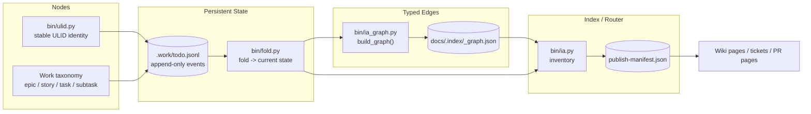
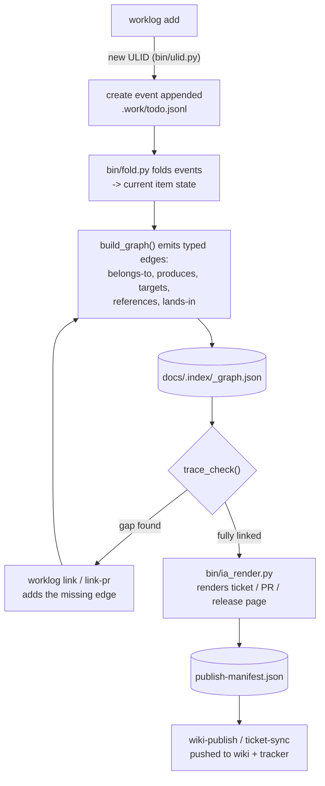

# Graph Engineering

WikiTicket SDD is a graph engineering system. Not "graph-engineering-adjacent,"
not "inspired by" — it already has the four things that name describes:
explicit nodes with stable identity, typed edges between them, state that
persists as an append-only log instead of a mutable table, and an index/router
that turns the graph into pages a human or agent can read. "Graph engineering"
just gave a name, in mid-2026, to what `bin/ia_graph.py`, the event log, and
the work taxonomy were already doing since this repo's first commits.

That's not a coincidence. This project's whole premise is **visible WIP** —
"every plan becomes tracked tickets, the history of what was done is readily
available" (`docs/user_guide/user-guide.md`). Making the graph itself explicit
and inspectable is the same instinct pointed at one more layer: not just *is
the work visible*, but *is the shape of the work visible*.

## The four primitives, mapped to real code

| Primitive | What it is here | Evidence |
|---|---|---|
| **Nodes** | Every work item gets a 128-bit ULID (48-bit timestamp + 80-bit entropy, Crockford base32) — lexicographic sort equals time sort. A deterministic variant exists specifically so two machines ingesting the same remote change produce the *same* node, not two. Level/kind taxonomy (epic → story → task → subtask; feature/bug/ops/triage) is normalized on fold, not just a label; `parent` (the hierarchy edge itself) flows through the same generic per-field fold as every other field. | `bin/ulid.py:35-58` (`new()`, `deterministic()`); `CLAUDE.md` "Work taxonomy"; `bin/fold.py:39-72` (taxonomy normalization), `:176-202` (`_apply_mutations`, the generic per-field fold that carries `parent`) |
| **Typed edges** | Ten real edge types — `produces`, `belongs-to`, `targets`, `references`, `lands-in`, `supersedes`, `snapshot-of`, `implements`, `decides`, `verified-by` — each with a derived reverse. `build_graph()` walks every doc and item and actually emits them; nothing here is illustrative. | `bin/ia_graph.py:27-31` (the `REVERSE` map), `:42-106` (`build_graph`) → `docs/.index/_graph.json` |
| **Persistent state** | State is never stored — it's *folded*. `.work/todo.jsonl` is an append-only, git-union-merged sequence of immutable events; current state is a pure function of that log (dedupe by event ID, sort by ULID, per-field last-writer-wins). This exists specifically so concurrent branches and concurrent agents don't clobber each other on merge. | `bin/fold.py`; `docs/adr/0001-event-log-fold-union-merge.md` |
| **Index / router** | Real, but modest — call it what it is: an inventory plus a publish manifest, not a routing engine. `ia.py` builds a flat `wiki_key`/`doc_type` lookup; `ia_render.py` tracks a `render_hash`/`source_hash` per page so only what changed gets republished. `build_adjacency()` turns the edge list into forward/backward maps once per render pass, and every ticket/PR/release page is a thin projection over that adjacency. | `bin/ia.py` (inventory); `bin/ia_render.py:555-660` (manifest); `bin/ia_graph.py:118-141` (`build_adjacency`, `item_links`) |

`trace_check()` (`bin/ia_graph.py:163-189`) is the sharpest proof this is a real
graph and not decoration: it walks the actual edge set to find items with no
`produces`/`references`/`lands-in` edge — i.e. work with no plan, no ticket, or
no PR — and reports the gap. You can't run that check against a metaphor.

## Diagram 1 — architecture

## Diagram 2 — an item's lifecycle through the graph

## Where this is heading

These are proposals, not commitments — ideas the graph already makes cheap,
not features anyone has shipped:

- **A `/graph:explore` skill.** `build_adjacency()` already produces forward
  and backward maps; a thin skill wrapping it could answer "what does this
  item block, what blocks it, what PR shipped it" conversationally, without
  a new data model.
- **An Obsidian-compatible export.** `_graph.json` already has nodes and
  typed edges — writing them out as Obsidian's markdown-link graph format is
  a translation layer, not new architecture.
- **A dedicated visualization layer.** A sibling repo, `wiki_ticket_sdd_ui`,
  is planned for exactly this (`docs/plans/2026-07-21-wiki-ticket-ui.md`) —
  worth saying plainly: it does not exist as running code yet. When it does,
  it will be reading the same `_graph.json` this document describes, not a
  new format invented for it.

## Further reading

"Graph engineering" as a named framing (nodes + typed edges + persistent
state + routing, as opposed to one long agent loop) emerged as a live
discussion in the AI-agent-engineering community in mid-2026, following a
widely-shared post from Peter Steinberger and a follow-up elaboration from
Carlos E. Perez. Representative write-ups from that discussion:

- [TrueFoundry — Graph Engineering for Multi-Agent Systems](https://www.truefoundry.com/blog/graph-engineering-enterprise-guide)
- [AI Builder Club — Graph Engineering Guide (2026)](https://www.aibuilderclub.com/blog/graph-engineering-guide-2026)
- [AI Builder Club — Graph Engineering vs Loop Engineering](https://www.aibuilderclub.com/blog/graph-engineering-vs-loop-engineering)

This document deliberately does not cite any single person's essay as *the*
canonical definition — the framing is still an emerging consensus, not a
settled standard, and one specific attribution circulating online (a PDF
claimed to be from Anthropic's Boris Cherny) could not be verified against
any primary source and is not referenced here.
