<!-- GENERATED by worklog roadmap-render. DO NOT EDIT. -->

> This file is generated from `.work/todo.jsonl`. Edits will be overwritten.
> To change the roadmap, change the work items: `worklog add|update|close`.

# Roadmap

_2 epic(s) in flight, 11 open item(s), 0 blocked, 0 unclassified._

## Now

_Nothing here._

## Next

### WikiTicket UI — IA-aware dashboard (supersedes wiki-ticket-ui)  ·  P1  ·  0 of 8 done
Local read-only dashboard app (new public repo wiki_ticket_sdd_ui) visualizing any worklog repo: board, roadmap, activity, releases, docs, publish plane, sync health, charts, and an interactive traceability graph. Re-based on the shipped IA & content model: the UI consumes the committed docs/.index plane (inventory, graph, publish manifest) instead of deriving document metadata itself.

| # | Item | Type | Priority | Status | Blocked by |
|---|---|---|---|---|---|
| [114](https://github.com/SpillwaveSolutions/wiki_ticket_sdd/issues/114) | Scaffold public repo wiki_ticket_sdd_ui: README, LICENSE, npm workspaces, CI | task | P2 | todo | — |
| [119](https://github.com/SpillwaveSolutions/wiki_ticket_sdd/issues/119) | Traceability panel: interactive _graph.json explorer with trace-check integrity checklist | task | P2 | todo | — |
| [116](https://github.com/SpillwaveSolutions/wiki_ticket_sdd/issues/116) | Web shell: Vite + React + Tailwind dark dashboard chrome with repo picker | task | P2 | todo | — |
| [118](https://github.com/SpillwaveSolutions/wiki_ticket_sdd/issues/118) | Panels wave 2: Releases, Docs browser (inventory-driven), Publish plane (3-way drift), Sync health, Charts | task | P2 | todo | — |
| [115](https://github.com/SpillwaveSolutions/wiki_ticket_sdd/issues/115) | Server: Hono JSON API over any worklog repo — fold, events, docs, index plane, git, gh, ledger, sync state | task | P2 | todo | — |
| [117](https://github.com/SpillwaveSolutions/wiki_ticket_sdd/issues/117) | Panels wave 1: Overview, Board, Roadmap (Mermaid), Activity feed | task | P2 | todo | — |

### (no epic)

| # | Item | Type | Priority | Status | Blocked by |
|---|---|---|---|---|---|
| [79](https://github.com/SpillwaveSolutions/wiki_ticket_sdd/issues/79) | Scrub inputs/ from main history (drop d538d15 + revert f97626a via rebase, force-with-lease) and delete local copies | task | P1 | todo | — |

## Later

### IA & content model (supersedes wiki-information-architecture)  ·  P1  ·  8 of 9 done
Reorganize the project wiki so anyone — a new developer, a PM, an auditor — can find the right page and know whether it is current or historical. Adds a formal content model, stable page identities, truth-state banners, generated navigation and indexes, and an evidence chain from plans to releases. The full design lives in the plan doc; work proceeds in phases, foundations first.

| # | Item | Type | Priority | Status | Blocked by |
|---|---|---|---|---|---|
| [98](https://github.com/SpillwaveSolutions/wiki_ticket_sdd/issues/98) | Phase 5: promote gates to hard fail; platform render adapters (GitLab/ADO/Confluence); /worklog:find + glossary | task | P3 | todo | — |

### WikiTicket UI — IA-aware dashboard (supersedes wiki-ticket-ui)  ·  P1  ·  0 of 8 done
Local read-only dashboard app (new public repo wiki_ticket_sdd_ui) visualizing any worklog repo: board, roadmap, activity, releases, docs, publish plane, sync health, charts, and an interactive traceability graph. Re-based on the shipped IA & content model: the UI consumes the committed docs/.index plane (inventory, graph, publish manifest) instead of deriving document metadata itself.

| # | Item | Type | Priority | Status | Blocked by |
|---|---|---|---|---|---|
| [121](https://github.com/SpillwaveSolutions/wiki_ticket_sdd/issues/121) | Tauri 2 desktop shell wrapping the same frontend | task | P3 | todo | — |
| [120](https://github.com/SpillwaveSolutions/wiki_ticket_sdd/issues/120) | Polish pass to the visually-stunning bar; README screenshots; tag v0.1.0 | task | P3 | todo | — |

### (no epic)

| # | Item | Type | Priority | Status | Blocked by |
|---|---|---|---|---|---|
| [108](https://github.com/SpillwaveSolutions/wiki_ticket_sdd/issues/108) | Configurable work-item field model: optional fields (estimate, risk, effort, value, confidence, owner, due_date, acceptance_criteria, blocked_by/blocks) behind work_item_fields config | story | P3 | todo | — |

## Needs attention

- Orphan events for `01KXSP27` — no create/snapshot yet.

## Visual roadmap

### Dependency graph

```mermaid
graph TD
    01KY2KHHF43KAZ54F57BQW71TD["🔧 Scrub inputs/ from main histor"]
    01KY5G9ZW0H2YMNWDFJYGRPYE5["📦 IA & content model (supersedes"]
    01KY5G9ZW0RABXWHEMEP1FAV2G["📦 Phase 5 promote gates to hard"]
    01KY5NE0ZYGBWG44N0KPEBFCZ8["📦 Configurable work-item field m"]
    01KY5VY0TDSWJE6W80CNCWA8QA["📦 WikiTicket UI — IA-aware dashb"]
    01KY5VY0TDTD7PQDT6EVD5AG9N["📦 Scaffold public repo wiki_tick"]
    01KY5VY0TE7G7ZC5W20T3KAXJ7["📦 Tauri 2 desktop shell wrapping"]
    01KY5VY0TE8B6RXVX1MQYJZ0TH["📦 Polish pass to the visually-st"]
    01KY5VY0TE8EZPWNZPZWSPTSAR["📦 Traceability panel interactive"]
    01KY5VY0TEK8XSGP2SG57GF0KT["📦 Web shell Vite + React + Tailw"]
    01KY5VY0TEKXBXK91S9ZFZTJZ5["📦 Panels wave 2 Releases Docs br"]
    01KY5VY0TEW87KK6AW6FQTYGZ9["📦 Server Hono JSON API over any"]
    01KY5VY0TEWBMZK5W6YJN5FQ9D["📦 Panels wave 1 Overview Board R"]
    01KY5G9ZW0H2YMNWDFJYGRPYE5 --> 01KY5G9ZW0RABXWHEMEP1FAV2G
    01KY5VY0TDSWJE6W80CNCWA8QA --> 01KY5VY0TDTD7PQDT6EVD5AG9N
    01KY5VY0TDSWJE6W80CNCWA8QA --> 01KY5VY0TE7G7ZC5W20T3KAXJ7
    01KY5VY0TDSWJE6W80CNCWA8QA --> 01KY5VY0TE8B6RXVX1MQYJZ0TH
    01KY5VY0TDSWJE6W80CNCWA8QA --> 01KY5VY0TE8EZPWNZPZWSPTSAR
    01KY5VY0TDSWJE6W80CNCWA8QA --> 01KY5VY0TEK8XSGP2SG57GF0KT
    01KY5VY0TDSWJE6W80CNCWA8QA --> 01KY5VY0TEKXBXK91S9ZFZTJZ5
    01KY5VY0TDSWJE6W80CNCWA8QA --> 01KY5VY0TEW87KK6AW6FQTYGZ9
    01KY5VY0TDSWJE6W80CNCWA8QA --> 01KY5VY0TEWBMZK5W6YJN5FQ9D
    classDef todo fill:#f4f4f4,stroke:#999999
    class 01KY2KHHF43KAZ54F57BQW71TD,01KY5G9ZW0H2YMNWDFJYGRPYE5,01KY5G9ZW0RABXWHEMEP1FAV2G,01KY5NE0ZYGBWG44N0KPEBFCZ8,01KY5VY0TDSWJE6W80CNCWA8QA,01KY5VY0TDTD7PQDT6EVD5AG9N,01KY5VY0TE7G7ZC5W20T3KAXJ7,01KY5VY0TE8B6RXVX1MQYJZ0TH,01KY5VY0TE8EZPWNZPZWSPTSAR,01KY5VY0TEK8XSGP2SG57GF0KT,01KY5VY0TEKXBXK91S9ZFZTJZ5,01KY5VY0TEW87KK6AW6FQTYGZ9,01KY5VY0TEWBMZK5W6YJN5FQ9D todo
```

### Hierarchy

```mermaid
graph TD
    01KY2KHHF43KAZ54F57BQW71TD["🔧 Scrub inputs/ from main histor"]
    01KY5G9ZW0H2YMNWDFJYGRPYE5["📦 IA & content model (supersedes"]
    01KY5G9ZW0RABXWHEMEP1FAV2G["📦 Phase 5 promote gates to hard"]
    01KY5NE0ZYGBWG44N0KPEBFCZ8["📦 Configurable work-item field m"]
    01KY5VY0TDSWJE6W80CNCWA8QA["📦 WikiTicket UI — IA-aware dashb"]
    01KY5VY0TDTD7PQDT6EVD5AG9N["📦 Scaffold public repo wiki_tick"]
    01KY5VY0TE7G7ZC5W20T3KAXJ7["📦 Tauri 2 desktop shell wrapping"]
    01KY5VY0TE8B6RXVX1MQYJZ0TH["📦 Polish pass to the visually-st"]
    01KY5VY0TE8EZPWNZPZWSPTSAR["📦 Traceability panel interactive"]
    01KY5VY0TEK8XSGP2SG57GF0KT["📦 Web shell Vite + React + Tailw"]
    01KY5VY0TEKXBXK91S9ZFZTJZ5["📦 Panels wave 2 Releases Docs br"]
    01KY5VY0TEW87KK6AW6FQTYGZ9["📦 Server Hono JSON API over any"]
    01KY5VY0TEWBMZK5W6YJN5FQ9D["📦 Panels wave 1 Overview Board R"]
    01KY5G9ZW0H2YMNWDFJYGRPYE5 --> 01KY5G9ZW0RABXWHEMEP1FAV2G
    01KY5VY0TDSWJE6W80CNCWA8QA --> 01KY5VY0TDTD7PQDT6EVD5AG9N
    01KY5VY0TDSWJE6W80CNCWA8QA --> 01KY5VY0TE7G7ZC5W20T3KAXJ7
    01KY5VY0TDSWJE6W80CNCWA8QA --> 01KY5VY0TE8B6RXVX1MQYJZ0TH
    01KY5VY0TDSWJE6W80CNCWA8QA --> 01KY5VY0TE8EZPWNZPZWSPTSAR
    01KY5VY0TDSWJE6W80CNCWA8QA --> 01KY5VY0TEK8XSGP2SG57GF0KT
    01KY5VY0TDSWJE6W80CNCWA8QA --> 01KY5VY0TEKXBXK91S9ZFZTJZ5
    01KY5VY0TDSWJE6W80CNCWA8QA --> 01KY5VY0TEW87KK6AW6FQTYGZ9
    01KY5VY0TDSWJE6W80CNCWA8QA --> 01KY5VY0TEWBMZK5W6YJN5FQ9D
```

