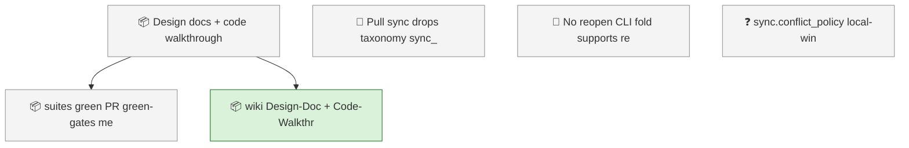
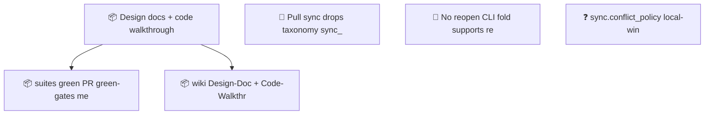

<!-- GENERATED by worklog roadmap-render. DO NOT EDIT. -->
<!-- source-hash: 389c07bc -->
<!-- generated-at: 2026-07-19T22:45:04Z -->

> This file is generated from `.work/todo.jsonl`. Edits will be overwritten.
> To change the roadmap, change the work items: `worklog add|update|close`.

# Roadmap

_1 epic(s) in flight, 5 open item(s), 0 blocked, 1 unclassified._

## Now

### Design docs + code walkthroughs with release-time doc sync  ·  P1  ·  4 of 6 done

| # | Item | Type | Priority | Status | Blocked by |
|---|---|---|---|---|---|
| [60](https://github.com/SpillwaveSolutions/wiki_ticket_sdd/issues/60) | wiki: Design-Doc + Code-Walkthrough live pages, frozen dated pages, Home links, published.json ledger keys | task | P1 | in progress | — |

## Next

### Design docs + code walkthroughs with release-time doc sync  ·  P1  ·  4 of 6 done

| # | Item | Type | Priority | Status | Blocked by |
|---|---|---|---|---|---|
| [56](https://github.com/SpillwaveSolutions/wiki_ticket_sdd/issues/56) | suites green; PR; green-gates merge; item closeout | task | P2 | todo | — |

### (no epic)

| # | Item | Type | Priority | Status | Blocked by |
|---|---|---|---|---|---|
| 01KXY8V5 | Pull sync drops taxonomy: sync_dispatch INGEST_FIELDS lacks level/kind/milestone — remote taxonomy edits silently not ingested | task | P2 | todo | — |
| 01KXY8V6 | No reopen CLI: fold supports reopen but worklog has no subcommand; update --status todo leaks stale resolution | task | P2 | todo | — |
| 01KXY8V6 | sync.conflict_policy local-wins/remote-wins documented in config but never read by dispatcher — implement or descope | task | P2 | todo | — |

## Later

_Nothing here._

## Needs classification

- 01KXY8V6 sync.conflict_policy local-wins/remote-wins documented in config but never read by dispatcher — implement or descope (task)

## Needs attention

- Orphan events for `01KXSP27` — no create/snapshot yet.

## Visual roadmap

### Dependency graph

### Hierarchy

