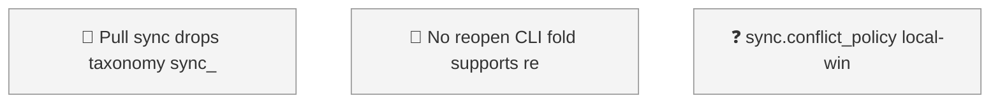

<!-- GENERATED by worklog roadmap-render. DO NOT EDIT. -->
<!-- source-hash: 98aefb92 -->
<!-- generated-at: 2026-07-19T22:52:52Z -->

> This file is generated from `.work/todo.jsonl`. Edits will be overwritten.
> To change the roadmap, change the work items: `worklog add|update|close`.

# Roadmap

_0 epic(s) in flight, 3 open item(s), 0 blocked, 1 unclassified._

## Now

_Nothing here._

## Next

### (no epic)

| # | Item | Type | Priority | Status | Blocked by |
|---|---|---|---|---|---|
| [62](https://github.com/SpillwaveSolutions/wiki_ticket_sdd/issues/62) | Pull sync drops taxonomy: sync_dispatch INGEST_FIELDS lacks level/kind/milestone — remote taxonomy edits silently not ingested | task | P2 | todo | — |
| [63](https://github.com/SpillwaveSolutions/wiki_ticket_sdd/issues/63) | No reopen CLI: fold supports reopen but worklog has no subcommand; update --status todo leaks stale resolution | task | P2 | todo | — |
| [64](https://github.com/SpillwaveSolutions/wiki_ticket_sdd/issues/64) | sync.conflict_policy local-wins/remote-wins documented in config but never read by dispatcher — implement or descope | task | P2 | todo | — |

## Later

_Nothing here._

## Needs classification

- [64](https://github.com/SpillwaveSolutions/wiki_ticket_sdd/issues/64) sync.conflict_policy local-wins/remote-wins documented in config but never read by dispatcher — implement or descope (task)

## Needs attention

- Orphan events for `01KXSP27` — no create/snapshot yet.

## Visual roadmap

### Dependency graph

### Hierarchy

