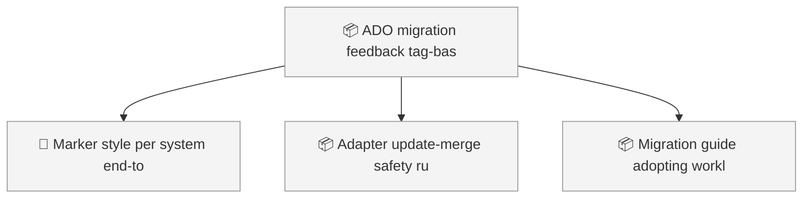
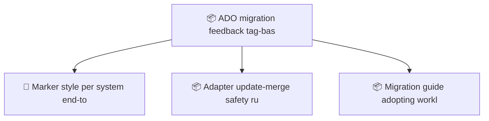

<!-- GENERATED by worklog roadmap-render. DO NOT EDIT. -->
<!-- source-hash: 77d2cc1f -->
<!-- generated-at: 2026-07-19T19:37:42Z -->

> This file is generated from `.work/todo.jsonl`. Edits will be overwritten.
> To change the roadmap, change the work items: `worklog add|update|close`.

# Roadmap

_0 epic(s) in flight, 4 open item(s), 0 blocked, 0 unclassified._

## Now

_Nothing here._

## Next

### (no epic)

| # | Item | Type | Priority | Status | Blocked by |
|---|---|---|---|---|---|
| [49](https://github.com/SpillwaveSolutions/wiki_ticket_sdd/issues/49) | ADO migration feedback: tag-based markers, update-merge safety, link-first import pattern | story | P1 | todo | — |
| 01KXXY4Q | Marker style per system end-to-end: ADO strips HTML comments from Description — marker must be a tag (worklog:<ulid>); verify dispatcher honors capabilities.marker.style/template beyond html_comment; document in ticket-sync skill + adapters/README | task | P1 | todo | — |
| 01KXXY4Q | Adapter update-merge safety rule: updates merge tags and touch only changed fields — never overwrite existing remote content; add to adapters/README authoring rules + fake adapter behavior + dumbness-compatible test | task | P1 | todo | — |
| 01KXXY4Q | Migration guide: adopting worklog with existing tickets — pre-seed external via worklog link (create-vs-update keys purely on external presence), pilot one epic, sync --dry-run acceptance gate = 0 creates | task | P2 | todo | — |

## Later

_Nothing here._

## Needs attention

- Orphan events for `01KXSP27` — no create/snapshot yet.

## Visual roadmap

### Dependency graph

### Hierarchy

