<!-- GENERATED by worklog roadmap-render. DO NOT EDIT. -->
<!-- source-hash: f3c843f7 -->
<!-- generated-at: 2026-07-22T17:15:54Z -->

> This file is generated from `.work/todo.jsonl`. Edits will be overwritten.
> To change the roadmap, change the work items: `worklog add|update|close`.

# Roadmap

_1 epic(s) in flight, 8 open item(s), 0 blocked, 0 unclassified._

## Now

_Nothing here._

## Next

### WikiTicket UI — project status dashboard (wiki_ticket_sdd_ui)  ·  P1  ·  0 of 7 done

| # | Item | Type | Priority | Status | Blocked by |
|---|---|---|---|---|---|
| [65](https://github.com/SpillwaveSolutions/wiki_ticket_sdd/issues/65) | Server: Hono JSON API over any worklog repo (fold, events, docs, git, gh, wiki ledger, sync state) | task | P2 | todo | — |
| [66](https://github.com/SpillwaveSolutions/wiki_ticket_sdd/issues/66) | Web shell: Vite + React + Tailwind dark dashboard chrome with repo picker | task | P2 | todo | — |
| [67](https://github.com/SpillwaveSolutions/wiki_ticket_sdd/issues/67) | Scaffold public repo wiki_ticket_sdd_ui: README, LICENSE, npm workspaces, CI | task | P2 | todo | — |
| [70](https://github.com/SpillwaveSolutions/wiki_ticket_sdd/issues/70) | Panels wave 2: Releases, Docs browser, Wiki drift, Sync health, Charts | task | P2 | todo | — |
| [72](https://github.com/SpillwaveSolutions/wiki_ticket_sdd/issues/72) | Panels wave 1: Overview, Board, Roadmap (Mermaid), Activity feed | task | P2 | todo | — |

### (no epic)

| # | Item | Type | Priority | Status | Blocked by |
|---|---|---|---|---|---|
| 01KY2KHH | Scrub inputs/ from main history (drop d538d15 + revert f97626a via rebase, force-with-lease) and delete local copies | task | P1 | todo | — |

## Later

### WikiTicket UI — project status dashboard (wiki_ticket_sdd_ui)  ·  P1  ·  0 of 7 done

| # | Item | Type | Priority | Status | Blocked by |
|---|---|---|---|---|---|
| [69](https://github.com/SpillwaveSolutions/wiki_ticket_sdd/issues/69) | Tauri 2 desktop shell wrapping the same frontend | task | P3 | todo | — |
| [71](https://github.com/SpillwaveSolutions/wiki_ticket_sdd/issues/71) | Polish pass to the visually-stunning bar; README screenshots; tag v0.1.0 | task | P3 | todo | — |

## Needs attention

- Orphan events for `01KXSP27` — no create/snapshot yet.

## Visual roadmap

### Dependency graph

```mermaid
graph TD
    01KY111BC71KJGNH55CB2DWMKN["📦 Server Hono JSON API over any"]
    01KY111BC7B70C7M2RF1E57G17["📦 Web shell Vite + React + Tailw"]
    01KY111BC7NJ4BE7JBDK2P6Y56["📦 Scaffold public repo wiki_tick"]
    01KY111BC7PABV8W6SDNVQACSN["📦 WikiTicket UI — project status"]
    01KY111BC842N3J7Y7H85NHSEG["📦 Tauri 2 desktop shell wrapping"]
    01KY111BC88FS6QD49JADZ9CJ5["📦 Panels wave 2 Releases Docs br"]
    01KY111BC8F9BH0T3TERYEFC3C["📦 Polish pass to the visually-st"]
    01KY111BC8QJAS9KH7N368N6RF["📦 Panels wave 1 Overview Board R"]
    01KY2KHHF43KAZ54F57BQW71TD["🔧 Scrub inputs/ from main histor"]
    01KY111BC7PABV8W6SDNVQACSN --> 01KY111BC71KJGNH55CB2DWMKN
    01KY111BC7PABV8W6SDNVQACSN --> 01KY111BC7B70C7M2RF1E57G17
    01KY111BC7PABV8W6SDNVQACSN --> 01KY111BC7NJ4BE7JBDK2P6Y56
    01KY111BC7PABV8W6SDNVQACSN --> 01KY111BC842N3J7Y7H85NHSEG
    01KY111BC7PABV8W6SDNVQACSN --> 01KY111BC88FS6QD49JADZ9CJ5
    01KY111BC7PABV8W6SDNVQACSN --> 01KY111BC8F9BH0T3TERYEFC3C
    01KY111BC7PABV8W6SDNVQACSN --> 01KY111BC8QJAS9KH7N368N6RF
    classDef todo fill:#f4f4f4,stroke:#999999
    class 01KY111BC71KJGNH55CB2DWMKN,01KY111BC7B70C7M2RF1E57G17,01KY111BC7NJ4BE7JBDK2P6Y56,01KY111BC7PABV8W6SDNVQACSN,01KY111BC842N3J7Y7H85NHSEG,01KY111BC88FS6QD49JADZ9CJ5,01KY111BC8F9BH0T3TERYEFC3C,01KY111BC8QJAS9KH7N368N6RF,01KY2KHHF43KAZ54F57BQW71TD todo
```

### Hierarchy

```mermaid
graph TD
    01KY111BC71KJGNH55CB2DWMKN["📦 Server Hono JSON API over any"]
    01KY111BC7B70C7M2RF1E57G17["📦 Web shell Vite + React + Tailw"]
    01KY111BC7NJ4BE7JBDK2P6Y56["📦 Scaffold public repo wiki_tick"]
    01KY111BC7PABV8W6SDNVQACSN["📦 WikiTicket UI — project status"]
    01KY111BC842N3J7Y7H85NHSEG["📦 Tauri 2 desktop shell wrapping"]
    01KY111BC88FS6QD49JADZ9CJ5["📦 Panels wave 2 Releases Docs br"]
    01KY111BC8F9BH0T3TERYEFC3C["📦 Polish pass to the visually-st"]
    01KY111BC8QJAS9KH7N368N6RF["📦 Panels wave 1 Overview Board R"]
    01KY2KHHF43KAZ54F57BQW71TD["🔧 Scrub inputs/ from main histor"]
    01KY111BC7PABV8W6SDNVQACSN --> 01KY111BC71KJGNH55CB2DWMKN
    01KY111BC7PABV8W6SDNVQACSN --> 01KY111BC7B70C7M2RF1E57G17
    01KY111BC7PABV8W6SDNVQACSN --> 01KY111BC7NJ4BE7JBDK2P6Y56
    01KY111BC7PABV8W6SDNVQACSN --> 01KY111BC842N3J7Y7H85NHSEG
    01KY111BC7PABV8W6SDNVQACSN --> 01KY111BC88FS6QD49JADZ9CJ5
    01KY111BC7PABV8W6SDNVQACSN --> 01KY111BC8F9BH0T3TERYEFC3C
    01KY111BC7PABV8W6SDNVQACSN --> 01KY111BC8QJAS9KH7N368N6RF
```

