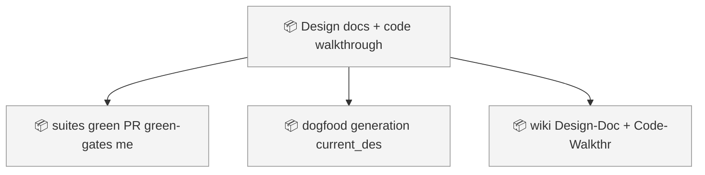
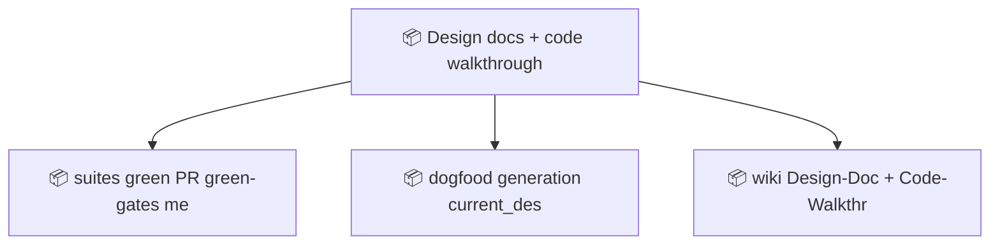

<!-- GENERATED by worklog roadmap-render. DO NOT EDIT. -->
<!-- source-hash: 18459fee -->
<!-- generated-at: 2026-07-19T22:33:27Z -->

> This file is generated from `.work/todo.jsonl`. Edits will be overwritten.
> To change the roadmap, change the work items: `worklog add|update|close`.

# Roadmap

_1 epic(s) in flight, 3 open item(s), 0 blocked, 0 unclassified._

## Now

_Nothing here._

## Next

### Design docs + code walkthroughs with release-time doc sync  ·  P1  ·  3 of 6 done

| # | Item | Type | Priority | Status | Blocked by |
|---|---|---|---|---|---|
| [59](https://github.com/SpillwaveSolutions/wiki_ticket_sdd/issues/59) | dogfood generation: current_design_doc + current_code_walkthrough + dated v0.11.0-release pair under docs/designs/ (background agent, grounded in actual repo, frontmatter tag/hash/branch/roadmap) | task | P1 | todo | — |
| [60](https://github.com/SpillwaveSolutions/wiki_ticket_sdd/issues/60) | wiki: Design-Doc + Code-Walkthrough live pages, frozen dated pages, Home links, published.json ledger keys | task | P1 | todo | — |
| [56](https://github.com/SpillwaveSolutions/wiki_ticket_sdd/issues/56) | suites green; PR; green-gates merge; item closeout | task | P2 | todo | — |

## Later

_Nothing here._

## Needs attention

- Orphan events for `01KXSP27` — no create/snapshot yet.

## Visual roadmap

### Dependency graph

### Hierarchy

