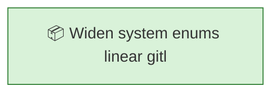
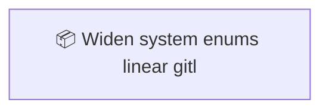

<!-- GENERATED by worklog roadmap-render. DO NOT EDIT. -->
<!-- source-hash: 92d2cf58 -->
<!-- generated-at: 2026-07-19T21:09:31Z -->

> This file is generated from `.work/todo.jsonl`. Edits will be overwritten.
> To change the roadmap, change the work items: `worklog add|update|close`.

# Roadmap

_0 epic(s) in flight, 1 open item(s), 0 blocked, 0 unclassified._

## Now

### (no epic)

| # | Item | Type | Priority | Status | Blocked by |
|---|---|---|---|---|---|
| 01KXY3CQ | Widen system enums: linear, gitlab, codecatalyst (AWS), explicit other; GCP no-native-tracker note; enum-is-advisory semantics | task | P2 | in progress | — |

## Next

_Nothing here._

## Later

_Nothing here._

## Needs attention

- Orphan events for `01KXSP27` — no create/snapshot yet.

## Visual roadmap

### Dependency graph

### Hierarchy

