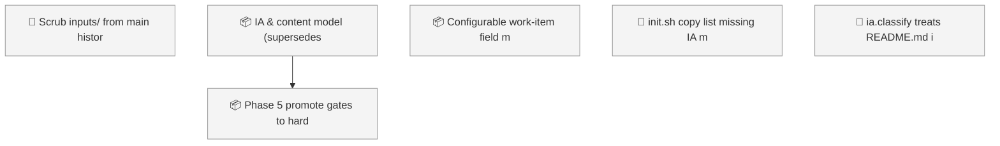
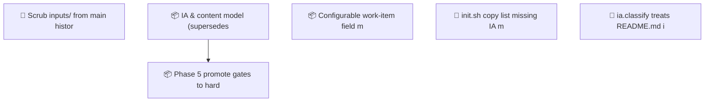

<!-- GENERATED by worklog roadmap-render. DO NOT EDIT. -->

> This file is generated from `.work/todo.jsonl`. Edits will be overwritten.
> To change the roadmap, change the work items: `worklog add|update|close`.

# Roadmap

_1 epic(s) in flight, 5 open item(s), 0 blocked, 0 unclassified._

## Now

_Nothing here._

## Next

### (no epic)

| # | Item | Type | Priority | Status | Blocked by |
|---|---|---|---|---|---|
| [79](https://github.com/SpillwaveSolutions/wiki_ticket_sdd/issues/79) | Scrub inputs/ from main history (drop d538d15 + revert f97626a via rebase, force-with-lease) and delete local copies | task | P1 | todo | — |
| 01KY5ZY3 | init.sh copy list missing IA modules (ia.py, ia_render.py, ia_graph.py, canonical.py, sync_dispatch.py) — fresh repos get worklog with broken ia-* commands | task | P2 | todo | — |

## Later

### IA & content model (supersedes wiki-information-architecture)  ·  P1  ·  8 of 9 done
Reorganize the project wiki so anyone — a new developer, a PM, an auditor — can find the right page and know whether it is current or historical. Adds a formal content model, stable page identities, truth-state banners, generated navigation and indexes, and an evidence chain from plans to releases. The full design lives in the plan doc; work proceeds in phases, foundations first.

| # | Item | Type | Priority | Status | Blocked by |
|---|---|---|---|---|---|
| [98](https://github.com/SpillwaveSolutions/wiki_ticket_sdd/issues/98) | Phase 5: promote gates to hard fail; platform render adapters (GitLab/ADO/Confluence); /worklog:find + glossary | task | P3 | todo | — |

### (no epic)

| # | Item | Type | Priority | Status | Blocked by |
|---|---|---|---|---|---|
| [108](https://github.com/SpillwaveSolutions/wiki_ticket_sdd/issues/108) | Configurable work-item field model: optional fields (estimate, risk, effort, value, confidence, owner, due_date, acceptance_criteria, blocked_by/blocks) behind work_item_fields config | story | P3 | todo | — |
| 01KY6037 | ia.classify treats README.md inside docs/plans|status|adr dirs as a doc of that type — generic repos with folder READMEs fail inventory | task | P3 | todo | — |

## Needs attention

- Orphan events for `01KXSP27` — no create/snapshot yet.

## Visual roadmap

### Dependency graph

### Hierarchy

