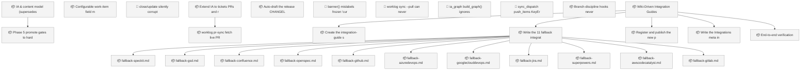
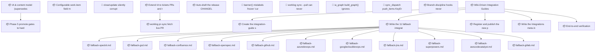

<!-- GENERATED by worklog roadmap-render. DO NOT EDIT. -->

> This file is generated from `.work/todo.jsonl`. Edits will be overwritten.
> To change the roadmap, change the work items: `worklog add|update|close`.

# Roadmap

_3 epic(s) in flight, 25 open item(s), 0 blocked, 0 unclassified._

## Now

_Nothing here._

## Next

### Extend IA to tickets, PRs, and releases (artifact pages)  ·  P1  ·  11 of 12 done
Give every ticket, PR, and release its own generated wiki page reusing the IA content model's wiki_key/truth_state/traceability-graph machinery already built for docs — so a reader sees hierarchy, related artifacts, and traceability in one place instead of hunting indexes/logs.

| # | Item | Type | Priority | Status | Blocked by |
|---|---|---|---|---|---|
| [138](https://github.com/SpillwaveSolutions/wiki_ticket_sdd/issues/138) | worklog pr-sync: fetch live PR metadata (files, review/CI status) | task | P2 | todo | — |

### Wiki-Driven Integration Guides for SDD tools and ticket/wiki systems  ·  P1  ·  0 of 16 done
Add a new integration-guide skill plus 11 markdown wiki pages (fallback copies committed to the repo) so wiki_ticket_sdd can point users at living setup guides for Superpowers, GSD, SpecKit, OpenSpec, Jira, Confluence, GitHub, GitLab, Azure DevOps, AWS CodeCatalyst, and Google Cloud DevOps, without hard-coding any of that guidance into the shipped skill set.

| # | Item | Type | Priority | Status | Blocked by |
|---|---|---|---|---|---|
| 01KYDP0B | Create the integration-guide skill | task | P1 | todo | — |
| 01KYDP0B | Write the 11 fallback integration pages | task | P2 | todo | — |
| 01KYDP0B | Register and publish the new pages | task | P2 | todo | — |
| 01KYDP0B | fallback-speckit.md | subtask | P2 | todo | — |
| 01KYDP0B | fallback-gsd.md | subtask | P2 | todo | — |
| 01KYDP0B | Write the Integrations meta index page | task | P2 | todo | — |
| 01KYDP0B | fallback-confluence.md | subtask | P2 | todo | — |
| 01KYDP0B | fallback-openspec.md | subtask | P2 | todo | — |
| 01KYDP0B | fallback-github.md | subtask | P2 | todo | — |
| 01KYDP0B | fallback-azuredevops.md | subtask | P2 | todo | — |
| 01KYDP0B | fallback-googleclouddevops.md | subtask | P2 | todo | — |
| 01KYDP0B | fallback-jira.md | subtask | P2 | todo | — |
| 01KYDP0B | fallback-superpowers.md | subtask | P2 | todo | — |
| 01KYDP0B | fallback-awscodecatalyst.md | subtask | P2 | todo | — |
| 01KYDP0B | fallback-gitlab.md | subtask | P2 | todo | — |

### (no epic)

| # | Item | Type | Priority | Status | Blocked by |
|---|---|---|---|---|---|
| [123](https://github.com/SpillwaveSolutions/wiki_ticket_sdd/issues/123) | close/update silently corrupt log when given an item-id prefix instead of the full ULID | task | P1 | todo | — |
| [136](https://github.com/SpillwaveSolutions/wiki_ticket_sdd/issues/136) | Auto-draft the release CHANGELOG unreleased section from git log | task | P2 | todo | — |
| [137](https://github.com/SpillwaveSolutions/wiki_ticket_sdd/issues/137) | banner() mislabels frozen 'current' plans as status reports | task | P2 | todo | — |
| [141](https://github.com/SpillwaveSolutions/wiki_ticket_sdd/issues/141) | worklog sync --pull can never bootstrap: cursor-less pull calls the adapter with no --since, which it requires | task | P2 | todo | — |
| [142](https://github.com/SpillwaveSolutions/wiki_ticket_sdd/issues/142) | ia_graph build_graph() ignores commit-only sidecar code links (lands-in only honors code.pr) | task | P2 | todo | — |

## Later

### IA & content model (supersedes wiki-information-architecture)  ·  P1  ·  8 of 9 done
Reorganize the project wiki so anyone — a new developer, a PM, an auditor — can find the right page and know whether it is current or historical. Adds a formal content model, stable page identities, truth-state banners, generated navigation and indexes, and an evidence chain from plans to releases. The full design lives in the plan doc; work proceeds in phases, foundations first.

| # | Item | Type | Priority | Status | Blocked by |
|---|---|---|---|---|---|
| [98](https://github.com/SpillwaveSolutions/wiki_ticket_sdd/issues/98) | Phase 5: promote gates to hard fail; platform render adapters (GitLab/ADO/Confluence); /worklog:find + glossary | task | P3 | todo | — |

### Wiki-Driven Integration Guides for SDD tools and ticket/wiki systems  ·  P1  ·  0 of 16 done
Add a new integration-guide skill plus 11 markdown wiki pages (fallback copies committed to the repo) so wiki_ticket_sdd can point users at living setup guides for Superpowers, GSD, SpecKit, OpenSpec, Jira, Confluence, GitHub, GitLab, Azure DevOps, AWS CodeCatalyst, and Google Cloud DevOps, without hard-coding any of that guidance into the shipped skill set.

| # | Item | Type | Priority | Status | Blocked by |
|---|---|---|---|---|---|
| 01KYDP0B | End-to-end verification | task | P3 | todo | — |

### (no epic)

| # | Item | Type | Priority | Status | Blocked by |
|---|---|---|---|---|---|
| [108](https://github.com/SpillwaveSolutions/wiki_ticket_sdd/issues/108) | Configurable work-item field model: optional fields (estimate, risk, effort, value, confidence, owner, due_date, acceptance_criteria, blocked_by/blocks) behind work_item_fields config | story | P3 | todo | — |
| [143](https://github.com/SpillwaveSolutions/wiki_ticket_sdd/issues/143) | sync_dispatch push_items KeyError on ext['key'] when forcing a never-remote closed item into scope via --keys | task | P3 | todo | — |

## Visual roadmap

### Dependency graph

```mermaid
graph TD
    01KY5G9ZW0H2YMNWDFJYGRPYE5["📦 IA & content model (supersedes"]
    01KY5G9ZW0RABXWHEMEP1FAV2G["📦 Phase 5 promote gates to hard"]
    01KY5NE0ZYGBWG44N0KPEBFCZ8["📦 Configurable work-item field m"]
    01KYA99TVCGX79HFNHN1DVT7Y6["🐛 close/update silently corrupt"]
    01KYABYEQP8ANXGYPBCV2T20D8["📦 Extend IA to tickets PRs and r"]
    01KYAC0AC01R4C6W7YY1X8NVRV["📦 Auto-draft the release CHANGEL"]
    01KYACFJA0SQSF4C83BJZXB5MY["🐛 banner() mislabels frozen 'cur"]
    01KYADGT9Q48EKJZVQQSH4HXWZ["📦 worklog pr-sync fetch live PR"]
    01KYAGZ8KK46SQF1MKHAHVCTJV["🐛 worklog sync --pull can never"]
    01KYAHAB3T2QXGMN4SQT4ZNZGW["🐛 ia_graph build_graph() ignores"]
    01KYAKH389T1ZKKBP94WH2HK94["🐛 sync_dispatch push_items KeyEr"]
    01KYBD2HYJVNHX698WR1JD96YC["📦 Branch-discipline hooks never"]
    01KYDP0BQG59M8QGCQY72SC0G1["📦 Create the integration-guide s"]
    01KYDP0BQGC8N7K1TE571K74JF["📦 Write the 11 fallback integrat"]
    01KYDP0BQGW4XAAGX68526C9ES["📦 Wiki-Driven Integration Guides"]
    01KYDP0BQH33AMR5ETPDF4V1M6["📦 Register and publish the new p"]
    01KYDP0BQH6389PTNGKXHSN2KR["📦 fallback-speckit.md"]
    01KYDP0BQHAE38H6VPDNVXV8JA["📦 fallback-gsd.md"]
    01KYDP0BQHAMP5AC6AP7854N9H["📦 Write the Integrations meta in"]
    01KYDP0BQHANV652NZVV8N7VX5["📦 fallback-confluence.md"]
    01KYDP0BQHDBJ50D8HZHWN3G4H["📦 fallback-openspec.md"]
    01KYDP0BQHPP0JZRK856QHN76S["📦 fallback-github.md"]
    01KYDP0BQHRM2Q3C5727FAZ7RD["📦 fallback-azuredevops.md"]
    01KYDP0BQHV6MW1XX7H7JC1EN4["📦 fallback-googleclouddevops.md"]
    01KYDP0BQHW1A3235YSF16ZZAQ["📦 fallback-jira.md"]
    01KYDP0BQHXGEBEY40SC1Q4ST3["📦 fallback-superpowers.md"]
    01KYDP0BQHXZCGTTM5PAV262RM["📦 fallback-awscodecatalyst.md"]
    01KYDP0BQHZAPBZPSSY38J33ZZ["📦 End-to-end verification"]
    01KYDP0BQHZHYH9CKM3D0ZM803["📦 fallback-gitlab.md"]
    01KY5G9ZW0H2YMNWDFJYGRPYE5 --> 01KY5G9ZW0RABXWHEMEP1FAV2G
    01KYABYEQP8ANXGYPBCV2T20D8 --> 01KYADGT9Q48EKJZVQQSH4HXWZ
    01KYDP0BQGW4XAAGX68526C9ES --> 01KYDP0BQG59M8QGCQY72SC0G1
    01KYDP0BQGW4XAAGX68526C9ES --> 01KYDP0BQGC8N7K1TE571K74JF
    01KYDP0BQGW4XAAGX68526C9ES --> 01KYDP0BQH33AMR5ETPDF4V1M6
    01KYDP0BQGC8N7K1TE571K74JF --> 01KYDP0BQH6389PTNGKXHSN2KR
    01KYDP0BQGC8N7K1TE571K74JF --> 01KYDP0BQHAE38H6VPDNVXV8JA
    01KYDP0BQGW4XAAGX68526C9ES --> 01KYDP0BQHAMP5AC6AP7854N9H
    01KYDP0BQGC8N7K1TE571K74JF --> 01KYDP0BQHANV652NZVV8N7VX5
    01KYDP0BQGC8N7K1TE571K74JF --> 01KYDP0BQHDBJ50D8HZHWN3G4H
    01KYDP0BQGC8N7K1TE571K74JF --> 01KYDP0BQHPP0JZRK856QHN76S
    01KYDP0BQGC8N7K1TE571K74JF --> 01KYDP0BQHRM2Q3C5727FAZ7RD
    01KYDP0BQGC8N7K1TE571K74JF --> 01KYDP0BQHV6MW1XX7H7JC1EN4
    01KYDP0BQGC8N7K1TE571K74JF --> 01KYDP0BQHW1A3235YSF16ZZAQ
    01KYDP0BQGC8N7K1TE571K74JF --> 01KYDP0BQHXGEBEY40SC1Q4ST3
    01KYDP0BQGC8N7K1TE571K74JF --> 01KYDP0BQHXZCGTTM5PAV262RM
    01KYDP0BQGW4XAAGX68526C9ES --> 01KYDP0BQHZAPBZPSSY38J33ZZ
    01KYDP0BQGC8N7K1TE571K74JF --> 01KYDP0BQHZHYH9CKM3D0ZM803
    classDef todo fill:#f4f4f4,stroke:#999999
    class 01KY5G9ZW0H2YMNWDFJYGRPYE5,01KY5G9ZW0RABXWHEMEP1FAV2G,01KY5NE0ZYGBWG44N0KPEBFCZ8,01KYA99TVCGX79HFNHN1DVT7Y6,01KYABYEQP8ANXGYPBCV2T20D8,01KYAC0AC01R4C6W7YY1X8NVRV,01KYACFJA0SQSF4C83BJZXB5MY,01KYADGT9Q48EKJZVQQSH4HXWZ,01KYAGZ8KK46SQF1MKHAHVCTJV,01KYAHAB3T2QXGMN4SQT4ZNZGW,01KYAKH389T1ZKKBP94WH2HK94,01KYBD2HYJVNHX698WR1JD96YC,01KYDP0BQG59M8QGCQY72SC0G1,01KYDP0BQGC8N7K1TE571K74JF,01KYDP0BQGW4XAAGX68526C9ES,01KYDP0BQH33AMR5ETPDF4V1M6,01KYDP0BQH6389PTNGKXHSN2KR,01KYDP0BQHAE38H6VPDNVXV8JA,01KYDP0BQHAMP5AC6AP7854N9H,01KYDP0BQHANV652NZVV8N7VX5,01KYDP0BQHDBJ50D8HZHWN3G4H,01KYDP0BQHPP0JZRK856QHN76S,01KYDP0BQHRM2Q3C5727FAZ7RD,01KYDP0BQHV6MW1XX7H7JC1EN4,01KYDP0BQHW1A3235YSF16ZZAQ,01KYDP0BQHXGEBEY40SC1Q4ST3,01KYDP0BQHXZCGTTM5PAV262RM,01KYDP0BQHZAPBZPSSY38J33ZZ,01KYDP0BQHZHYH9CKM3D0ZM803 todo
```

### Hierarchy

```mermaid
graph TD
    01KY5G9ZW0H2YMNWDFJYGRPYE5["📦 IA & content model (supersedes"]
    01KY5G9ZW0RABXWHEMEP1FAV2G["📦 Phase 5 promote gates to hard"]
    01KY5NE0ZYGBWG44N0KPEBFCZ8["📦 Configurable work-item field m"]
    01KYA99TVCGX79HFNHN1DVT7Y6["🐛 close/update silently corrupt"]
    01KYABYEQP8ANXGYPBCV2T20D8["📦 Extend IA to tickets PRs and r"]
    01KYAC0AC01R4C6W7YY1X8NVRV["📦 Auto-draft the release CHANGEL"]
    01KYACFJA0SQSF4C83BJZXB5MY["🐛 banner() mislabels frozen 'cur"]
    01KYADGT9Q48EKJZVQQSH4HXWZ["📦 worklog pr-sync fetch live PR"]
    01KYAGZ8KK46SQF1MKHAHVCTJV["🐛 worklog sync --pull can never"]
    01KYAHAB3T2QXGMN4SQT4ZNZGW["🐛 ia_graph build_graph() ignores"]
    01KYAKH389T1ZKKBP94WH2HK94["🐛 sync_dispatch push_items KeyEr"]
    01KYBD2HYJVNHX698WR1JD96YC["📦 Branch-discipline hooks never"]
    01KYDP0BQG59M8QGCQY72SC0G1["📦 Create the integration-guide s"]
    01KYDP0BQGC8N7K1TE571K74JF["📦 Write the 11 fallback integrat"]
    01KYDP0BQGW4XAAGX68526C9ES["📦 Wiki-Driven Integration Guides"]
    01KYDP0BQH33AMR5ETPDF4V1M6["📦 Register and publish the new p"]
    01KYDP0BQH6389PTNGKXHSN2KR["📦 fallback-speckit.md"]
    01KYDP0BQHAE38H6VPDNVXV8JA["📦 fallback-gsd.md"]
    01KYDP0BQHAMP5AC6AP7854N9H["📦 Write the Integrations meta in"]
    01KYDP0BQHANV652NZVV8N7VX5["📦 fallback-confluence.md"]
    01KYDP0BQHDBJ50D8HZHWN3G4H["📦 fallback-openspec.md"]
    01KYDP0BQHPP0JZRK856QHN76S["📦 fallback-github.md"]
    01KYDP0BQHRM2Q3C5727FAZ7RD["📦 fallback-azuredevops.md"]
    01KYDP0BQHV6MW1XX7H7JC1EN4["📦 fallback-googleclouddevops.md"]
    01KYDP0BQHW1A3235YSF16ZZAQ["📦 fallback-jira.md"]
    01KYDP0BQHXGEBEY40SC1Q4ST3["📦 fallback-superpowers.md"]
    01KYDP0BQHXZCGTTM5PAV262RM["📦 fallback-awscodecatalyst.md"]
    01KYDP0BQHZAPBZPSSY38J33ZZ["📦 End-to-end verification"]
    01KYDP0BQHZHYH9CKM3D0ZM803["📦 fallback-gitlab.md"]
    01KY5G9ZW0H2YMNWDFJYGRPYE5 --> 01KY5G9ZW0RABXWHEMEP1FAV2G
    01KYABYEQP8ANXGYPBCV2T20D8 --> 01KYADGT9Q48EKJZVQQSH4HXWZ
    01KYDP0BQGW4XAAGX68526C9ES --> 01KYDP0BQG59M8QGCQY72SC0G1
    01KYDP0BQGW4XAAGX68526C9ES --> 01KYDP0BQGC8N7K1TE571K74JF
    01KYDP0BQGW4XAAGX68526C9ES --> 01KYDP0BQH33AMR5ETPDF4V1M6
    01KYDP0BQGC8N7K1TE571K74JF --> 01KYDP0BQH6389PTNGKXHSN2KR
    01KYDP0BQGC8N7K1TE571K74JF --> 01KYDP0BQHAE38H6VPDNVXV8JA
    01KYDP0BQGW4XAAGX68526C9ES --> 01KYDP0BQHAMP5AC6AP7854N9H
    01KYDP0BQGC8N7K1TE571K74JF --> 01KYDP0BQHANV652NZVV8N7VX5
    01KYDP0BQGC8N7K1TE571K74JF --> 01KYDP0BQHDBJ50D8HZHWN3G4H
    01KYDP0BQGC8N7K1TE571K74JF --> 01KYDP0BQHPP0JZRK856QHN76S
    01KYDP0BQGC8N7K1TE571K74JF --> 01KYDP0BQHRM2Q3C5727FAZ7RD
    01KYDP0BQGC8N7K1TE571K74JF --> 01KYDP0BQHV6MW1XX7H7JC1EN4
    01KYDP0BQGC8N7K1TE571K74JF --> 01KYDP0BQHW1A3235YSF16ZZAQ
    01KYDP0BQGC8N7K1TE571K74JF --> 01KYDP0BQHXGEBEY40SC1Q4ST3
    01KYDP0BQGC8N7K1TE571K74JF --> 01KYDP0BQHXZCGTTM5PAV262RM
    01KYDP0BQGW4XAAGX68526C9ES --> 01KYDP0BQHZAPBZPSSY38J33ZZ
    01KYDP0BQGC8N7K1TE571K74JF --> 01KYDP0BQHZHYH9CKM3D0ZM803
```
