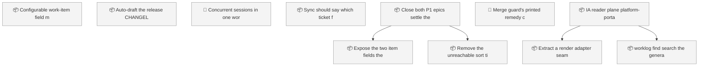
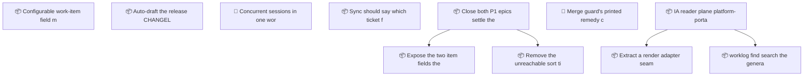

<!-- GENERATED by worklog roadmap-render. DO NOT EDIT. -->

> This file is generated from `.work/todo.jsonl`. Edits will be overwritten.
> To change the roadmap, change the work items: `worklog add|update|close`.

# Roadmap

_2 epic(s) in flight, 9 open item(s), 0 blocked, 0 unclassified._

## Now

_Nothing here._

## Next

### (no epic)

| # | Item | Type | Priority | Status | Blocked by |
|---|---|---|---|---|---|
| [136](https://github.com/SpillwaveSolutions/wiki_ticket_sdd/issues/136) | Auto-draft the release CHANGELOG unreleased section from git log | task | P2 | todo | — |
| [236](https://github.com/SpillwaveSolutions/wiki_ticket_sdd/issues/236) | Concurrent sessions in one working directory corrupt each other's work | task | P2 | todo | — |
| [269](https://github.com/SpillwaveSolutions/wiki_ticket_sdd/issues/269) | Merge guard's printed remedy cannot be run from the state it creates | task | P2 | todo | — |

## Later

### Close both P1 epics, settle the merge-strategy and GONE questions  ·  P1  ·  9 of 11 done
Follow-on session after the 2026-07-30 bug sweep cleared every defect in the tracker. Two P1 epics are each blocked on a single open leaf, so each closes for the price of one item; this plan does those first. It then records two design decisions that were left open on purpose: that no custom merge driver will be built, because hosted merges run no driver and an unconfigured one silently falls back to something worse, and that clearing a dead ticket link stays a human action, because the signal that reports a ticket missing cannot separate a deleted ticket from one the user lacks permission to read. The code that ships alongside those records is small and closes the exposure that actually exists: the merge guard built earlier runs only on developer machines today, and a project-level lookup failure would currently mark every linked item as missing in a single run.

| # | Item | Type | Priority | Status | Blocked by |
|---|---|---|---|---|---|
| [256](https://github.com/SpillwaveSolutions/wiki_ticket_sdd/issues/256) | Expose the two item fields the specification already declares | task | P3 | todo | — |
| [259](https://github.com/SpillwaveSolutions/wiki_ticket_sdd/issues/259) | Remove the unreachable sort tiebreak in the fold | task | P3 | todo | — |

### IA reader plane: platform-portable rendering and document search  ·  P3  ·  0 of 2 done
What is left of the IA content model after Phase 5's gate promotion shipped. The phase-5 ticket bundled three unrelated things: promoting the CI gates to hard failures (done, and the item on the design docs' extension roadmap), a rendering port to other wiki platforms, and a document-search command. Only the first had a user. This epic holds the rest so the parent epic can close on the value that actually shipped rather than being held open by work nobody has planned. Deliberately NOT filed here: one item per wiki platform (GitLab, Azure DevOps, Confluence). The config names github-wiki and no one has asked for another; those get filed when a platform has a user, not before. Also dropped: the glossary page, which its own plan marks optional.

| # | Item | Type | Priority | Status | Blocked by |
|---|---|---|---|---|---|
| [271](https://github.com/SpillwaveSolutions/wiki_ticket_sdd/issues/271) | Extract a render adapter seam so page naming is not hardcoded to Gollum | task | P3 | todo | — |
| [272](https://github.com/SpillwaveSolutions/wiki_ticket_sdd/issues/272) | worklog find: search the generated inventory and graph from the CLI | task | P3 | todo | — |

### (no epic)

| # | Item | Type | Priority | Status | Blocked by |
|---|---|---|---|---|---|
| [108](https://github.com/SpillwaveSolutions/wiki_ticket_sdd/issues/108) | Configurable work-item field model: optional fields (estimate, risk, effort, value, confidence, owner, due_date, acceptance_criteria, blocked_by/blocks) behind work_item_fields config | story | P3 | todo | — |
| [238](https://github.com/SpillwaveSolutions/wiki_ticket_sdd/issues/238) | Sync should say which ticket fields it is about to overwrite | task | P3 | todo | — |

## Visual roadmap

### Dependency graph

```mermaid
graph TD
    01KY5NE0ZYGBWG44N0KPEBFCZ8["📦 Configurable work-item field m"]
    01KYAC0AC01R4C6W7YY1X8NVRV["📦 Auto-draft the release CHANGEL"]
    01KYNHEV5GCR1MDNECAXFT0GK2["🔧 Concurrent sessions in one wor"]
    01KYNHEVDSD4BTASXCTV88Q80Q["📦 Sync should say which ticket f"]
    01KYTJGK2WMX6PNMYQDFFFPGTP["📦 Close both P1 epics settle the"]
    01KYTJGK2X700NYTZHB0JDE6Q1["📦 Expose the two item fields the"]
    01KYTJGK2X98H9T7VVR879B0XC["📦 Remove the unreachable sort ti"]
    01KYWGJD1QCQRM6V6S0MWN5SCW["🐛 Merge guard's printed remedy c"]
    01KYWGM3KPNQNSWV03FRG23ADB["📦 IA reader plane platform-porta"]
    01KYWGM3R13Q33YZ3PJA3V7QMD["📦 Extract a render adapter seam"]
    01KYWGM3W958F3QK4HB52X1Q1X["📦 worklog find search the genera"]
    01KYTJGK2WMX6PNMYQDFFFPGTP --> 01KYTJGK2X700NYTZHB0JDE6Q1
    01KYTJGK2WMX6PNMYQDFFFPGTP --> 01KYTJGK2X98H9T7VVR879B0XC
    01KYWGM3KPNQNSWV03FRG23ADB --> 01KYWGM3R13Q33YZ3PJA3V7QMD
    01KYWGM3KPNQNSWV03FRG23ADB --> 01KYWGM3W958F3QK4HB52X1Q1X
    classDef todo fill:#f4f4f4,stroke:#999999
    class 01KY5NE0ZYGBWG44N0KPEBFCZ8,01KYAC0AC01R4C6W7YY1X8NVRV,01KYNHEV5GCR1MDNECAXFT0GK2,01KYNHEVDSD4BTASXCTV88Q80Q,01KYTJGK2WMX6PNMYQDFFFPGTP,01KYTJGK2X700NYTZHB0JDE6Q1,01KYTJGK2X98H9T7VVR879B0XC,01KYWGJD1QCQRM6V6S0MWN5SCW,01KYWGM3KPNQNSWV03FRG23ADB,01KYWGM3R13Q33YZ3PJA3V7QMD,01KYWGM3W958F3QK4HB52X1Q1X todo
```

### Hierarchy

```mermaid
graph TD
    01KY5NE0ZYGBWG44N0KPEBFCZ8["📦 Configurable work-item field m"]
    01KYAC0AC01R4C6W7YY1X8NVRV["📦 Auto-draft the release CHANGEL"]
    01KYNHEV5GCR1MDNECAXFT0GK2["🔧 Concurrent sessions in one wor"]
    01KYNHEVDSD4BTASXCTV88Q80Q["📦 Sync should say which ticket f"]
    01KYTJGK2WMX6PNMYQDFFFPGTP["📦 Close both P1 epics settle the"]
    01KYTJGK2X700NYTZHB0JDE6Q1["📦 Expose the two item fields the"]
    01KYTJGK2X98H9T7VVR879B0XC["📦 Remove the unreachable sort ti"]
    01KYWGJD1QCQRM6V6S0MWN5SCW["🐛 Merge guard's printed remedy c"]
    01KYWGM3KPNQNSWV03FRG23ADB["📦 IA reader plane platform-porta"]
    01KYWGM3R13Q33YZ3PJA3V7QMD["📦 Extract a render adapter seam"]
    01KYWGM3W958F3QK4HB52X1Q1X["📦 worklog find search the genera"]
    01KYTJGK2WMX6PNMYQDFFFPGTP --> 01KYTJGK2X700NYTZHB0JDE6Q1
    01KYTJGK2WMX6PNMYQDFFFPGTP --> 01KYTJGK2X98H9T7VVR879B0XC
    01KYWGM3KPNQNSWV03FRG23ADB --> 01KYWGM3R13Q33YZ3PJA3V7QMD
    01KYWGM3KPNQNSWV03FRG23ADB --> 01KYWGM3W958F3QK4HB52X1Q1X
```
