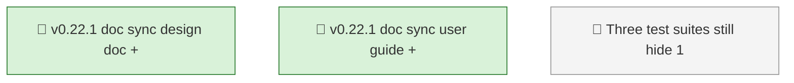
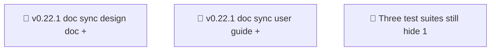

<!-- GENERATED by worklog roadmap-render. DO NOT EDIT. -->

> This file is generated from `.work/todo.jsonl`. Edits will be overwritten.
> To change the roadmap, change the work items: `worklog add|update|close`.

# Roadmap

_0 epic(s) in flight, 3 open item(s), 0 blocked, 0 unclassified._

## Now

### (no epic)

| # | Item | Type | Priority | Status | Blocked by |
|---|---|---|---|---|---|
| 01KZC7BE | v0.22.1 doc sync: design doc + code walkthrough | task | P2 | in progress | — |
| 01KZC7BE | v0.22.1 doc sync: user guide + README | task | P2 | in progress | — |

## Next

### (no epic)

| # | Item | Type | Priority | Status | Blocked by |
|---|---|---|---|---|---|
| 01KZC83E | Three test suites still hide 15 tests behind a mid-file __main__ block | task | P2 | todo | — |

## Later

_Nothing here._

## Milestones

### v0.22.1

| # | Item | Type | Priority | Status | Blocked by |
|---|---|---|---|---|---|
| 01KZC7BE | v0.22.1 doc sync: design doc + code walkthrough | task | P2 | in progress | — |
| 01KZC7BE | v0.22.1 doc sync: user guide + README | task | P2 | in progress | — |

## Visual roadmap

### Dependency graph

```mermaid
graph TD
    01KZC7BEFK020YSGQSBB1Z70PX["🔧 v0.22.1 doc sync design doc +"]
    01KZC7BEN8HXMT90Q4P033YA0Q["🔧 v0.22.1 doc sync user guide +"]
    01KZC83EFJV7S63VAXTPRB2YH3["🐛 Three test suites still hide 1"]
    classDef todo fill:#f4f4f4,stroke:#999999
    class 01KZC83EFJV7S63VAXTPRB2YH3 todo
    classDef in_progress fill:#d9f2d9,stroke:#2e7d32
    class 01KZC7BEFK020YSGQSBB1Z70PX,01KZC7BEN8HXMT90Q4P033YA0Q in_progress
```

### Hierarchy

```mermaid
graph TD
    01KZC7BEFK020YSGQSBB1Z70PX["🔧 v0.22.1 doc sync design doc +"]
    01KZC7BEN8HXMT90Q4P033YA0Q["🔧 v0.22.1 doc sync user guide +"]
    01KZC83EFJV7S63VAXTPRB2YH3["🐛 Three test suites still hide 1"]
```
