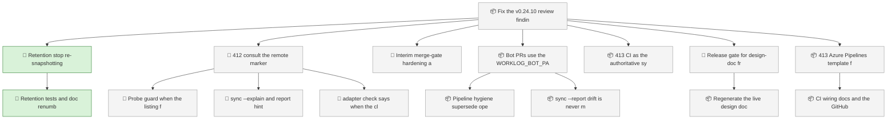
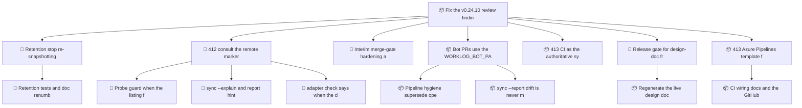

<!-- GENERATED by worklog roadmap-render. DO NOT EDIT. -->

> This file is generated from `.work/todo.jsonl`. Edits will be overwritten.
> To change the roadmap, change the work items: `worklog add|update|close`.

# Roadmap

_1 epic(s) in flight, 15 open item(s), 0 blocked, 0 unclassified._

## Now

### Fix the v0.24.10 review findings and close #412 and #413  ·  P1  ·  5 of 20 done  ·  feature 8 / bug 12
The v0.24.10 change review found a P0 in retention (archived items ping-pong back into done.jsonl), a merge gate that trusts commit statuses from any actor, and seven releases without regenerated design docs. Issues #412 and #413 add duplicate ticket creation on fresh clones and a request for CI-owned sync with Azure Pipelines support. This epic fixes all of it in one PR per workstream: retention, marker probe, gate hardening, PAT identity for bot PRs, CI sync, release gate, and an Azure template.

| # | Item | Type | Priority | Status | Blocked by |
|---|---|---|---|---|---|
| [415](https://github.com/SpillwaveSolutions/wiki_ticket_sdd/issues/415) | Retention: stop re-snapshotting archived items into done.jsonl | task | P0 | in progress | — |
| [420](https://github.com/SpillwaveSolutions/wiki_ticket_sdd/issues/420) | Retention tests and doc renumbering | subtask | P2 | in progress | — |

## Next

### Fix the v0.24.10 review findings and close #412 and #413  ·  P1  ·  5 of 20 done  ·  feature 8 / bug 12
The v0.24.10 change review found a P0 in retention (archived items ping-pong back into done.jsonl), a merge gate that trusts commit statuses from any actor, and seven releases without regenerated design docs. Issues #412 and #413 add duplicate ticket creation on fresh clones and a request for CI-owned sync with Azure Pipelines support. This epic fixes all of it in one PR per workstream: retention, marker probe, gate hardening, PAT identity for bot PRs, CI sync, release gate, and an Azure template.

| # | Item | Type | Priority | Status | Blocked by |
|---|---|---|---|---|---|
| [421](https://github.com/SpillwaveSolutions/wiki_ticket_sdd/issues/421) | #412: consult the remote marker map before creating a ticket | task | P1 | todo | — |
| [425](https://github.com/SpillwaveSolutions/wiki_ticket_sdd/issues/425) | Interim merge-gate hardening and ADR-0011 | task | P1 | todo | — |
| [426](https://github.com/SpillwaveSolutions/wiki_ticket_sdd/issues/426) | Bot PRs use the WORKLOG_BOT_PAT identity | task | P1 | todo | — |
| [422](https://github.com/SpillwaveSolutions/wiki_ticket_sdd/issues/422) | Probe guard when the listing fails and the clone has no push memory | subtask | P2 | todo | — |
| [423](https://github.com/SpillwaveSolutions/wiki_ticket_sdd/issues/423) | sync --explain and report hints | subtask | P2 | todo | — |
| [424](https://github.com/SpillwaveSolutions/wiki_ticket_sdd/issues/424) | adapter check says when the clone has no push memory | subtask | P2 | todo | — |
| [427](https://github.com/SpillwaveSolutions/wiki_ticket_sdd/issues/427) | Pipeline hygiene: supersede open bot PRs, delete-branch, explicit loop guard | subtask | P2 | todo | — |
| [428](https://github.com/SpillwaveSolutions/wiki_ticket_sdd/issues/428) | sync --report drift is never masked and the local-only comment is suppressed | subtask | P2 | todo | — |
| [429](https://github.com/SpillwaveSolutions/wiki_ticket_sdd/issues/429) | #413: CI as the authoritative syncer behind ticketing.sync_owner: ci | task | P2 | todo | — |
| [430](https://github.com/SpillwaveSolutions/wiki_ticket_sdd/issues/430) | Release gate for design-doc freshness in doc-verify --strict | task | P2 | todo | — |
| [431](https://github.com/SpillwaveSolutions/wiki_ticket_sdd/issues/431) | Regenerate the live design docs for v0.24.10 | subtask | P2 | todo | — |
| [432](https://github.com/SpillwaveSolutions/wiki_ticket_sdd/issues/432) | #413: Azure Pipelines template from init.sh | task | P2 | todo | — |
| [433](https://github.com/SpillwaveSolutions/wiki_ticket_sdd/issues/433) | CI wiring docs and the GitHub Actions to Azure Pipelines mapping table | subtask | P2 | todo | — |

## Later

_Nothing here._

## Visual roadmap

### Dependency graph

```mermaid
graph TD
    01M2XCWMV0QYM4ZRBWN1V1327B["📦 Fix the v0.24.10 review findin"]
    01M2XCWMVD7KJ01FCNEV1X822V["🐛 Retention stop re-snapshotting"]
    01M2XCWMVD7KJ01FCNEV1X8235["🐛 Retention tests and doc renumb"]
    01M2XCWMVD7KJ01FCNEV1X8237["🐛 412 consult the remote marker"]
    01M2XCWMVEH3XFP2VPS9JBD6X7["🐛 Probe guard when the listing f"]
    01M2XCWMVEH3XFP2VPS9JBD6X9["🐛 sync --explain and report hint"]
    01M2XCWMVEH3XFP2VPS9JBD6XB["🐛 adapter check says when the cl"]
    01M2XCWMVEH3XFP2VPS9JBD6XD["🐛 Interim merge-gate hardening a"]
    01M2XCWMVEH3XFP2VPS9JBD6XF["📦 Bot PRs use the WORKLOG_BOT_PA"]
    01M2XCWMVEH3XFP2VPS9JBD6XH["📦 Pipeline hygiene supersede ope"]
    01M2XCWMVEH3XFP2VPS9JBD6XK["📦 sync --report drift is never m"]
    01M2XCWMVEH3XFP2VPS9JBD6XN["📦 413 CI as the authoritative sy"]
    01M2XCWMVEH3XFP2VPS9JBD6XQ["🐛 Release gate for design-doc fr"]
    01M2XCWMVEH3XFP2VPS9JBD6XS["📦 Regenerate the live design doc"]
    01M2XCWMVEH3XFP2VPS9JBD6XV["📦 413 Azure Pipelines template f"]
    01M2XCWMVEH3XFP2VPS9JBD6XX["📦 CI wiring docs and the GitHub"]
    01M2XCWMV0QYM4ZRBWN1V1327B --> 01M2XCWMVD7KJ01FCNEV1X822V
    01M2XCWMVD7KJ01FCNEV1X822V --> 01M2XCWMVD7KJ01FCNEV1X8235
    01M2XCWMV0QYM4ZRBWN1V1327B --> 01M2XCWMVD7KJ01FCNEV1X8237
    01M2XCWMVD7KJ01FCNEV1X8237 --> 01M2XCWMVEH3XFP2VPS9JBD6X7
    01M2XCWMVD7KJ01FCNEV1X8237 --> 01M2XCWMVEH3XFP2VPS9JBD6X9
    01M2XCWMVD7KJ01FCNEV1X8237 --> 01M2XCWMVEH3XFP2VPS9JBD6XB
    01M2XCWMV0QYM4ZRBWN1V1327B --> 01M2XCWMVEH3XFP2VPS9JBD6XD
    01M2XCWMV0QYM4ZRBWN1V1327B --> 01M2XCWMVEH3XFP2VPS9JBD6XF
    01M2XCWMVEH3XFP2VPS9JBD6XF --> 01M2XCWMVEH3XFP2VPS9JBD6XH
    01M2XCWMVEH3XFP2VPS9JBD6XF --> 01M2XCWMVEH3XFP2VPS9JBD6XK
    01M2XCWMV0QYM4ZRBWN1V1327B --> 01M2XCWMVEH3XFP2VPS9JBD6XN
    01M2XCWMV0QYM4ZRBWN1V1327B --> 01M2XCWMVEH3XFP2VPS9JBD6XQ
    01M2XCWMVEH3XFP2VPS9JBD6XQ --> 01M2XCWMVEH3XFP2VPS9JBD6XS
    01M2XCWMV0QYM4ZRBWN1V1327B --> 01M2XCWMVEH3XFP2VPS9JBD6XV
    01M2XCWMVEH3XFP2VPS9JBD6XV --> 01M2XCWMVEH3XFP2VPS9JBD6XX
    classDef todo fill:#f4f4f4,stroke:#999999
    class 01M2XCWMV0QYM4ZRBWN1V1327B,01M2XCWMVD7KJ01FCNEV1X8237,01M2XCWMVEH3XFP2VPS9JBD6X7,01M2XCWMVEH3XFP2VPS9JBD6X9,01M2XCWMVEH3XFP2VPS9JBD6XB,01M2XCWMVEH3XFP2VPS9JBD6XD,01M2XCWMVEH3XFP2VPS9JBD6XF,01M2XCWMVEH3XFP2VPS9JBD6XH,01M2XCWMVEH3XFP2VPS9JBD6XK,01M2XCWMVEH3XFP2VPS9JBD6XN,01M2XCWMVEH3XFP2VPS9JBD6XQ,01M2XCWMVEH3XFP2VPS9JBD6XS,01M2XCWMVEH3XFP2VPS9JBD6XV,01M2XCWMVEH3XFP2VPS9JBD6XX todo
    classDef in_progress fill:#d9f2d9,stroke:#2e7d32
    class 01M2XCWMVD7KJ01FCNEV1X822V,01M2XCWMVD7KJ01FCNEV1X8235 in_progress
```

### Hierarchy

```mermaid
graph TD
    01M2XCWMV0QYM4ZRBWN1V1327B["📦 Fix the v0.24.10 review findin"]
    01M2XCWMVD7KJ01FCNEV1X822V["🐛 Retention stop re-snapshotting"]
    01M2XCWMVD7KJ01FCNEV1X8235["🐛 Retention tests and doc renumb"]
    01M2XCWMVD7KJ01FCNEV1X8237["🐛 412 consult the remote marker"]
    01M2XCWMVEH3XFP2VPS9JBD6X7["🐛 Probe guard when the listing f"]
    01M2XCWMVEH3XFP2VPS9JBD6X9["🐛 sync --explain and report hint"]
    01M2XCWMVEH3XFP2VPS9JBD6XB["🐛 adapter check says when the cl"]
    01M2XCWMVEH3XFP2VPS9JBD6XD["🐛 Interim merge-gate hardening a"]
    01M2XCWMVEH3XFP2VPS9JBD6XF["📦 Bot PRs use the WORKLOG_BOT_PA"]
    01M2XCWMVEH3XFP2VPS9JBD6XH["📦 Pipeline hygiene supersede ope"]
    01M2XCWMVEH3XFP2VPS9JBD6XK["📦 sync --report drift is never m"]
    01M2XCWMVEH3XFP2VPS9JBD6XN["📦 413 CI as the authoritative sy"]
    01M2XCWMVEH3XFP2VPS9JBD6XQ["🐛 Release gate for design-doc fr"]
    01M2XCWMVEH3XFP2VPS9JBD6XS["📦 Regenerate the live design doc"]
    01M2XCWMVEH3XFP2VPS9JBD6XV["📦 413 Azure Pipelines template f"]
    01M2XCWMVEH3XFP2VPS9JBD6XX["📦 CI wiring docs and the GitHub"]
    01M2XCWMV0QYM4ZRBWN1V1327B --> 01M2XCWMVD7KJ01FCNEV1X822V
    01M2XCWMVD7KJ01FCNEV1X822V --> 01M2XCWMVD7KJ01FCNEV1X8235
    01M2XCWMV0QYM4ZRBWN1V1327B --> 01M2XCWMVD7KJ01FCNEV1X8237
    01M2XCWMVD7KJ01FCNEV1X8237 --> 01M2XCWMVEH3XFP2VPS9JBD6X7
    01M2XCWMVD7KJ01FCNEV1X8237 --> 01M2XCWMVEH3XFP2VPS9JBD6X9
    01M2XCWMVD7KJ01FCNEV1X8237 --> 01M2XCWMVEH3XFP2VPS9JBD6XB
    01M2XCWMV0QYM4ZRBWN1V1327B --> 01M2XCWMVEH3XFP2VPS9JBD6XD
    01M2XCWMV0QYM4ZRBWN1V1327B --> 01M2XCWMVEH3XFP2VPS9JBD6XF
    01M2XCWMVEH3XFP2VPS9JBD6XF --> 01M2XCWMVEH3XFP2VPS9JBD6XH
    01M2XCWMVEH3XFP2VPS9JBD6XF --> 01M2XCWMVEH3XFP2VPS9JBD6XK
    01M2XCWMV0QYM4ZRBWN1V1327B --> 01M2XCWMVEH3XFP2VPS9JBD6XN
    01M2XCWMV0QYM4ZRBWN1V1327B --> 01M2XCWMVEH3XFP2VPS9JBD6XQ
    01M2XCWMVEH3XFP2VPS9JBD6XQ --> 01M2XCWMVEH3XFP2VPS9JBD6XS
    01M2XCWMV0QYM4ZRBWN1V1327B --> 01M2XCWMVEH3XFP2VPS9JBD6XV
    01M2XCWMVEH3XFP2VPS9JBD6XV --> 01M2XCWMVEH3XFP2VPS9JBD6XX
```
