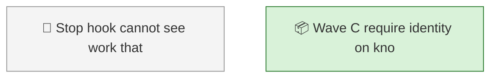
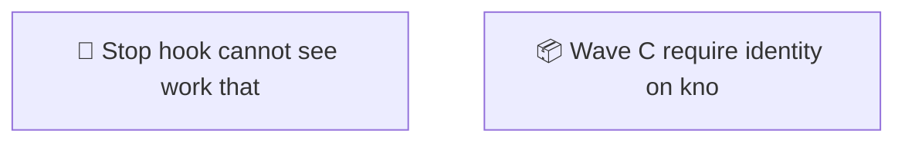

<!-- GENERATED by worklog roadmap-render. DO NOT EDIT. -->

> This file is generated from `.work/todo.jsonl`. Edits will be overwritten.
> To change the roadmap, change the work items: `worklog add|update|close`.

# Roadmap

_0 epic(s) in flight, 2 open item(s), 0 blocked, 0 unclassified._

## Now

### (no epic)

| # | Item | Type | Priority | Status | Blocked by |
|---|---|---|---|---|---|
| [356](https://github.com/SpillwaveSolutions/wiki_ticket_sdd/issues/356) | Wave C: require identity on knowledge-tree writes | task | P1 | in progress | — |

## Next

### (no epic)

| # | Item | Type | Priority | Status | Blocked by |
|---|---|---|---|---|---|
| [352](https://github.com/SpillwaveSolutions/wiki_ticket_sdd/issues/352) | Stop hook cannot see work that was recorded and then committed | task | P2 | todo | — |

## Later

_Nothing here._

## Milestones

### v0.24.1

| # | Item | Type | Priority | Status | Blocked by |
|---|---|---|---|---|---|
| [356](https://github.com/SpillwaveSolutions/wiki_ticket_sdd/issues/356) | Wave C: require identity on knowledge-tree writes | task | P1 | in progress | — |

## Visual roadmap

### Dependency graph

```mermaid
graph TD
    01M032YRXR61XAJBBNP355AVQW["🐛 Stop hook cannot see work that"]
    01M06BRQPQ8408XTDYTMY2JYFE["📦 Wave C require identity on kno"]
    classDef todo fill:#f4f4f4,stroke:#999999
    class 01M032YRXR61XAJBBNP355AVQW todo
    classDef in_progress fill:#d9f2d9,stroke:#2e7d32
    class 01M06BRQPQ8408XTDYTMY2JYFE in_progress
```

### Hierarchy

```mermaid
graph TD
    01M032YRXR61XAJBBNP355AVQW["🐛 Stop hook cannot see work that"]
    01M06BRQPQ8408XTDYTMY2JYFE["📦 Wave C require identity on kno"]
```
