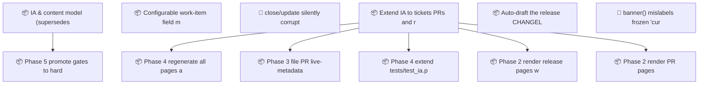

<!-- GENERATED by worklog roadmap-render. DO NOT EDIT. -->

> This file is generated from `.work/todo.jsonl`. Edits will be overwritten.
> To change the roadmap, change the work items: `worklog add|update|close`.

# Roadmap

_2 epic(s) in flight, 10 open item(s), 0 blocked, 0 unclassified._

## Now

_Nothing here._

## Next

### Extend IA to tickets, PRs, and releases (artifact pages)  ·  P1  ·  6 of 11 done
Give every ticket, PR, and release its own generated wiki page reusing the IA content model's wiki_key/truth_state/traceability-graph machinery already built for docs — so a reader sees hierarchy, related artifacts, and traceability in one place instead of hunting indexes/logs.

| # | Item | Type | Priority | Status | Blocked by |
|---|---|---|---|---|---|
| [131](https://github.com/SpillwaveSolutions/wiki_ticket_sdd/issues/131) | Phase 4: extend tests/test_ia.py for the new page shapes | task | P1 | todo | — |
| [132](https://github.com/SpillwaveSolutions/wiki_ticket_sdd/issues/132) | Phase 2: render release pages with graph-derived Change Log | task | P1 | todo | — |
| [134](https://github.com/SpillwaveSolutions/wiki_ticket_sdd/issues/134) | Phase 2: render PR pages | task | P1 | todo | — |
| [128](https://github.com/SpillwaveSolutions/wiki_ticket_sdd/issues/128) | Phase 4: regenerate all pages and confirm coverage gate holds | task | P2 | todo | — |

### (no epic)

| # | Item | Type | Priority | Status | Blocked by |
|---|---|---|---|---|---|
| [123](https://github.com/SpillwaveSolutions/wiki_ticket_sdd/issues/123) | close/update silently corrupt log when given an item-id prefix instead of the full ULID | task | P1 | todo | — |
| 01KYAC0A | Auto-draft the release CHANGELOG unreleased section from git log | task | P2 | todo | — |
| 01KYACFJ | banner() mislabels frozen 'current' plans as status reports | task | P2 | todo | — |

## Later

### IA & content model (supersedes wiki-information-architecture)  ·  P1  ·  8 of 9 done
Reorganize the project wiki so anyone — a new developer, a PM, an auditor — can find the right page and know whether it is current or historical. Adds a formal content model, stable page identities, truth-state banners, generated navigation and indexes, and an evidence chain from plans to releases. The full design lives in the plan doc; work proceeds in phases, foundations first.

| # | Item | Type | Priority | Status | Blocked by |
|---|---|---|---|---|---|
| [98](https://github.com/SpillwaveSolutions/wiki_ticket_sdd/issues/98) | Phase 5: promote gates to hard fail; platform render adapters (GitLab/ADO/Confluence); /worklog:find + glossary | task | P3 | todo | — |

### Extend IA to tickets, PRs, and releases (artifact pages)  ·  P1  ·  6 of 11 done
Give every ticket, PR, and release its own generated wiki page reusing the IA content model's wiki_key/truth_state/traceability-graph machinery already built for docs — so a reader sees hierarchy, related artifacts, and traceability in one place instead of hunting indexes/logs.

| # | Item | Type | Priority | Status | Blocked by |
|---|---|---|---|---|---|
| [129](https://github.com/SpillwaveSolutions/wiki_ticket_sdd/issues/129) | Phase 3: file PR live-metadata follow-up item | task | P3 | todo | — |

### (no epic)

| # | Item | Type | Priority | Status | Blocked by |
|---|---|---|---|---|---|
| [108](https://github.com/SpillwaveSolutions/wiki_ticket_sdd/issues/108) | Configurable work-item field model: optional fields (estimate, risk, effort, value, confidence, owner, due_date, acceptance_criteria, blocked_by/blocks) behind work_item_fields config | story | P3 | todo | — |

## Needs attention

- Orphan events for `01KYA8MD` — no create/snapshot yet.

## Visual roadmap

### Dependency graph

```mermaid
graph TD
    01KY5G9ZW0H2YMNWDFJYGRPYE5["📦 IA & content model (supersedes"]
    01KY5G9ZW0RABXWHEMEP1FAV2G["📦 Phase 5 promote gates to hard"]
    01KY5NE0ZYGBWG44N0KPEBFCZ8["📦 Configurable work-item field m"]
    01KYA99TVCGX79HFNHN1DVT7Y6["🐛 close/update silently corrupt"]
    01KYABYEQP8ANXGYPBCV2T20D8["📦 Extend IA to tickets PRs and r"]
    01KYABYEQPDS2VFQKQ7B6YXZVR["📦 Phase 4 regenerate all pages a"]
    01KYABYEQPF8N2K26ENRKREE0W["📦 Phase 3 file PR live-metadata"]
    01KYABYEQPNK7HHH5CMAR2V1JG["📦 Phase 4 extend tests/test_ia.p"]
    01KYABYEQPP82DJEN19F43YRAE["📦 Phase 2 render release pages w"]
    01KYABYEQPW8Q2RGGTNP71W88E["📦 Phase 2 render PR pages"]
    01KYAC0AC01R4C6W7YY1X8NVRV["📦 Auto-draft the release CHANGEL"]
    01KYACFJA0SQSF4C83BJZXB5MY["🐛 banner() mislabels frozen 'cur"]
    01KY5G9ZW0H2YMNWDFJYGRPYE5 --> 01KY5G9ZW0RABXWHEMEP1FAV2G
    01KYABYEQP8ANXGYPBCV2T20D8 --> 01KYABYEQPDS2VFQKQ7B6YXZVR
    01KYABYEQP8ANXGYPBCV2T20D8 --> 01KYABYEQPF8N2K26ENRKREE0W
    01KYABYEQP8ANXGYPBCV2T20D8 --> 01KYABYEQPNK7HHH5CMAR2V1JG
    01KYABYEQP8ANXGYPBCV2T20D8 --> 01KYABYEQPP82DJEN19F43YRAE
    01KYABYEQP8ANXGYPBCV2T20D8 --> 01KYABYEQPW8Q2RGGTNP71W88E
    classDef todo fill:#f4f4f4,stroke:#999999
    class 01KY5G9ZW0H2YMNWDFJYGRPYE5,01KY5G9ZW0RABXWHEMEP1FAV2G,01KY5NE0ZYGBWG44N0KPEBFCZ8,01KYA99TVCGX79HFNHN1DVT7Y6,01KYABYEQP8ANXGYPBCV2T20D8,01KYABYEQPDS2VFQKQ7B6YXZVR,01KYABYEQPF8N2K26ENRKREE0W,01KYABYEQPNK7HHH5CMAR2V1JG,01KYABYEQPP82DJEN19F43YRAE,01KYABYEQPW8Q2RGGTNP71W88E,01KYAC0AC01R4C6W7YY1X8NVRV,01KYACFJA0SQSF4C83BJZXB5MY todo
```

### Hierarchy

```mermaid
graph TD
    01KY5G9ZW0H2YMNWDFJYGRPYE5["📦 IA & content model (supersedes"]
    01KY5G9ZW0RABXWHEMEP1FAV2G["📦 Phase 5 promote gates to hard"]
    01KY5NE0ZYGBWG44N0KPEBFCZ8["📦 Configurable work-item field m"]
    01KYA99TVCGX79HFNHN1DVT7Y6["🐛 close/update silently corrupt"]
    01KYABYEQP8ANXGYPBCV2T20D8["📦 Extend IA to tickets PRs and r"]
    01KYABYEQPDS2VFQKQ7B6YXZVR["📦 Phase 4 regenerate all pages a"]
    01KYABYEQPF8N2K26ENRKREE0W["📦 Phase 3 file PR live-metadata"]
    01KYABYEQPNK7HHH5CMAR2V1JG["📦 Phase 4 extend tests/test_ia.p"]
    01KYABYEQPP82DJEN19F43YRAE["📦 Phase 2 render release pages w"]
    01KYABYEQPW8Q2RGGTNP71W88E["📦 Phase 2 render PR pages"]
    01KYAC0AC01R4C6W7YY1X8NVRV["📦 Auto-draft the release CHANGEL"]
    01KYACFJA0SQSF4C83BJZXB5MY["🐛 banner() mislabels frozen 'cur"]
    01KY5G9ZW0H2YMNWDFJYGRPYE5 --> 01KY5G9ZW0RABXWHEMEP1FAV2G
    01KYABYEQP8ANXGYPBCV2T20D8 --> 01KYABYEQPDS2VFQKQ7B6YXZVR
    01KYABYEQP8ANXGYPBCV2T20D8 --> 01KYABYEQPF8N2K26ENRKREE0W
    01KYABYEQP8ANXGYPBCV2T20D8 --> 01KYABYEQPNK7HHH5CMAR2V1JG
    01KYABYEQP8ANXGYPBCV2T20D8 --> 01KYABYEQPP82DJEN19F43YRAE
    01KYABYEQP8ANXGYPBCV2T20D8 --> 01KYABYEQPW8Q2RGGTNP71W88E
```
