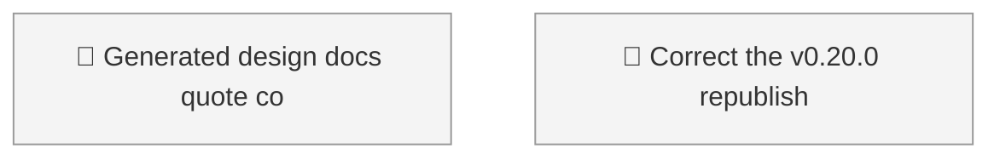
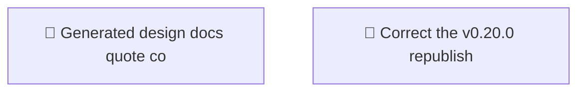

<!-- GENERATED by worklog roadmap-render. DO NOT EDIT. -->

> This file is generated from `.work/todo.jsonl`. Edits will be overwritten.
> To change the roadmap, change the work items: `worklog add|update|close`.

# Roadmap

_0 epic(s) in flight, 2 open item(s), 0 blocked, 0 unclassified._

## Now

_Nothing here._

## Next

### (no epic)

| # | Item | Type | Priority | Status | Blocked by |
|---|---|---|---|---|---|
| 294 | Generated design docs quote code that no longer exists; nothing verifies their claims | task | P2 | todo | — |

## Later

### (no epic)

| # | Item | Type | Priority | Status | Blocked by |
|---|---|---|---|---|---|
| 01KZ2PJZ | Correct the v0.20.0 republish claim in the next release notes | task | P3 | todo | — |

## Visual roadmap

### Dependency graph

```mermaid
graph TD
    01KZ2M75CEXBQHFN1AG1Z8A2YB["🐛 Generated design docs quote co"]
    01KZ2PJZF067ZS4YW231C1FM28["🔧 Correct the v0.20.0 republish"]
    classDef todo fill:#f4f4f4,stroke:#999999
    class 01KZ2M75CEXBQHFN1AG1Z8A2YB,01KZ2PJZF067ZS4YW231C1FM28 todo
```

### Hierarchy

```mermaid
graph TD
    01KZ2M75CEXBQHFN1AG1Z8A2YB["🐛 Generated design docs quote co"]
    01KZ2PJZF067ZS4YW231C1FM28["🔧 Correct the v0.20.0 republish"]
```
