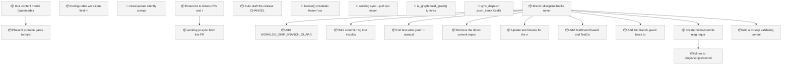
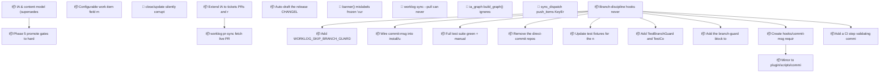

<!-- GENERATED by worklog roadmap-render. DO NOT EDIT. -->

> This file is generated from `.work/todo.jsonl`. Edits will be overwritten.
> To change the roadmap, change the work items: `worklog add|update|close`.

# Roadmap

_3 epic(s) in flight, 19 open item(s), 0 blocked, 0 unclassified._

## Now

_Nothing here._

## Next

### Extend IA to tickets, PRs, and releases (artifact pages)  ·  P1  ·  11 of 12 done
Give every ticket, PR, and release its own generated wiki page reusing the IA content model's wiki_key/truth_state/traceability-graph machinery already built for docs — so a reader sees hierarchy, related artifacts, and traceability in one place instead of hunting indexes/logs.

| # | Item | Type | Priority | Status | Blocked by |
|---|---|---|---|---|---|
| [138](https://github.com/SpillwaveSolutions/wiki_ticket_sdd/issues/138) | worklog pr-sync: fetch live PR metadata (files, review/CI status) | task | P2 | todo | — |

### Branch-discipline hooks: never commit on main, always reference work  ·  P1  ·  0 of 10 done
New git hooks (shipped in the plugin) that block authored commits directly on main/master and require every commit message to reference a worklog item or ticket -- prevents the local/origin main-drift incident that broke a release PR merge this session.

| # | Item | Type | Priority | Status | Blocked by |
|---|---|---|---|---|---|
| [147](https://github.com/SpillwaveSolutions/wiki_ticket_sdd/issues/147) | Wire commit-msg into install/uninstall/doctor/CANON | task | P1 | todo | — |
| [151](https://github.com/SpillwaveSolutions/wiki_ticket_sdd/issues/151) | Add TestBranchGuard and TestCommitMsgReference test classes | task | P1 | todo | — |
| [152](https://github.com/SpillwaveSolutions/wiki_ticket_sdd/issues/152) | Add the branch-guard block to hooks/pre-commit | task | P1 | todo | — |
| [153](https://github.com/SpillwaveSolutions/wiki_ticket_sdd/issues/153) | Create hooks/commit-msg requiring a ULID or ticket reference | task | P1 | todo | — |
| [145](https://github.com/SpillwaveSolutions/wiki_ticket_sdd/issues/145) | Add WORKLOG_SKIP_BRANCH_GUARD to the three bare pre-commit call sites | task | P2 | todo | — |
| [146](https://github.com/SpillwaveSolutions/wiki_ticket_sdd/issues/146) | Mirror to plugin/scripts/commit-msg (byte-identical canon copy) | subtask | P2 | todo | — |
| [148](https://github.com/SpillwaveSolutions/wiki_ticket_sdd/issues/148) | Full test suite green + manual verification | task | P2 | todo | — |
| [149](https://github.com/SpillwaveSolutions/wiki_ticket_sdd/issues/149) | Remove the "direct-commit repos" mode from the release skill | task | P2 | todo | — |
| [150](https://github.com/SpillwaveSolutions/wiki_ticket_sdd/issues/150) | Update test fixtures for the new hooks | task | P2 | todo | — |
| [154](https://github.com/SpillwaveSolutions/wiki_ticket_sdd/issues/154) | Add a CI step validating commit messages on PRs | task | P2 | todo | — |

### (no epic)

| # | Item | Type | Priority | Status | Blocked by |
|---|---|---|---|---|---|
| [123](https://github.com/SpillwaveSolutions/wiki_ticket_sdd/issues/123) | close/update silently corrupt log when given an item-id prefix instead of the full ULID | task | P1 | todo | — |
| [136](https://github.com/SpillwaveSolutions/wiki_ticket_sdd/issues/136) | Auto-draft the release CHANGELOG unreleased section from git log | task | P2 | todo | — |
| [137](https://github.com/SpillwaveSolutions/wiki_ticket_sdd/issues/137) | banner() mislabels frozen 'current' plans as status reports | task | P2 | todo | — |
| [141](https://github.com/SpillwaveSolutions/wiki_ticket_sdd/issues/141) | worklog sync --pull can never bootstrap: cursor-less pull calls the adapter with no --since, which it requires | task | P2 | todo | — |
| [142](https://github.com/SpillwaveSolutions/wiki_ticket_sdd/issues/142) | ia_graph build_graph() ignores commit-only sidecar code links (lands-in only honors code.pr) | task | P2 | todo | — |

## Later

### IA & content model (supersedes wiki-information-architecture)  ·  P1  ·  8 of 9 done
Reorganize the project wiki so anyone — a new developer, a PM, an auditor — can find the right page and know whether it is current or historical. Adds a formal content model, stable page identities, truth-state banners, generated navigation and indexes, and an evidence chain from plans to releases. The full design lives in the plan doc; work proceeds in phases, foundations first.

| # | Item | Type | Priority | Status | Blocked by |
|---|---|---|---|---|---|
| [98](https://github.com/SpillwaveSolutions/wiki_ticket_sdd/issues/98) | Phase 5: promote gates to hard fail; platform render adapters (GitLab/ADO/Confluence); /worklog:find + glossary | task | P3 | todo | — |

### (no epic)

| # | Item | Type | Priority | Status | Blocked by |
|---|---|---|---|---|---|
| [108](https://github.com/SpillwaveSolutions/wiki_ticket_sdd/issues/108) | Configurable work-item field model: optional fields (estimate, risk, effort, value, confidence, owner, due_date, acceptance_criteria, blocked_by/blocks) behind work_item_fields config | story | P3 | todo | — |
| [143](https://github.com/SpillwaveSolutions/wiki_ticket_sdd/issues/143) | sync_dispatch push_items KeyError on ext['key'] when forcing a never-remote closed item into scope via --keys | task | P3 | todo | — |

## Needs attention

- Orphan events for `01KYA8MD` — no create/snapshot yet.

## Visual roadmap

### Dependency graph

```mermaid
graph TD
    01KY5G9ZW0H2YMNWDFJYGRPYE5["📦 IA & content model (supersedes"]
    01KY5G9ZW0RABXWHEMEP1FAV2G["📦 Phase 5 promote gates to hard"]
    01KY5NE0ZYGBWG44N0KPEBFCZ8["📦 Configurable work-item field m"]
    01KYA99TVCGX79HFNHN1DVT7Y6["🐛 close/update silently corrupt"]
    01KYABYEQP8ANXGYPBCV2T20D8["📦 Extend IA to tickets PRs and r"]
    01KYAC0AC01R4C6W7YY1X8NVRV["📦 Auto-draft the release CHANGEL"]
    01KYACFJA0SQSF4C83BJZXB5MY["🐛 banner() mislabels frozen 'cur"]
    01KYADGT9Q48EKJZVQQSH4HXWZ["📦 worklog pr-sync fetch live PR"]
    01KYAGZ8KK46SQF1MKHAHVCTJV["🐛 worklog sync --pull can never"]
    01KYAHAB3T2QXGMN4SQT4ZNZGW["🐛 ia_graph build_graph() ignores"]
    01KYAKH389T1ZKKBP94WH2HK94["🐛 sync_dispatch push_items KeyEr"]
    01KYBD2HYJVNHX698WR1JD96YC["📦 Branch-discipline hooks never"]
    01KYBD2HYK196RQN7JNCMV6PDS["📦 Add WORKLOG_SKIP_BRANCH_GUARD"]
    01KYBD2HYK1AT1YCN3GW8Q3QQW["📦 Mirror to plugin/scripts/commi"]
    01KYBD2HYK9XY02QHSVF1849BQ["📦 Wire commit-msg into install/u"]
    01KYBD2HYKB5E4JXNYYQ9BPDAE["📦 Full test suite green + manual"]
    01KYBD2HYKET7WJARQFB2NVMFS["📦 Remove the direct-commit repos"]
    01KYBD2HYKG0DW7QJX7XG561A8["📦 Update test fixtures for the n"]
    01KYBD2HYKJHS5M2PFZ78Y585C["📦 Add TestBranchGuard and TestCo"]
    01KYBD2HYKKC2G9NW4VA3RVC6G["📦 Add the branch-guard block to"]
    01KYBD2HYKKZM22DFM16ZJXYFG["📦 Create hooks/commit-msg requir"]
    01KYBD2HYKYBBNGDMCQSW4VE2T["📦 Add a CI step validating commi"]
    01KY5G9ZW0H2YMNWDFJYGRPYE5 --> 01KY5G9ZW0RABXWHEMEP1FAV2G
    01KYABYEQP8ANXGYPBCV2T20D8 --> 01KYADGT9Q48EKJZVQQSH4HXWZ
    01KYBD2HYJVNHX698WR1JD96YC --> 01KYBD2HYK196RQN7JNCMV6PDS
    01KYBD2HYKKZM22DFM16ZJXYFG --> 01KYBD2HYK1AT1YCN3GW8Q3QQW
    01KYBD2HYJVNHX698WR1JD96YC --> 01KYBD2HYK9XY02QHSVF1849BQ
    01KYBD2HYJVNHX698WR1JD96YC --> 01KYBD2HYKB5E4JXNYYQ9BPDAE
    01KYBD2HYJVNHX698WR1JD96YC --> 01KYBD2HYKET7WJARQFB2NVMFS
    01KYBD2HYJVNHX698WR1JD96YC --> 01KYBD2HYKG0DW7QJX7XG561A8
    01KYBD2HYJVNHX698WR1JD96YC --> 01KYBD2HYKJHS5M2PFZ78Y585C
    01KYBD2HYJVNHX698WR1JD96YC --> 01KYBD2HYKKC2G9NW4VA3RVC6G
    01KYBD2HYJVNHX698WR1JD96YC --> 01KYBD2HYKKZM22DFM16ZJXYFG
    01KYBD2HYJVNHX698WR1JD96YC --> 01KYBD2HYKYBBNGDMCQSW4VE2T
    classDef todo fill:#f4f4f4,stroke:#999999
    class 01KY5G9ZW0H2YMNWDFJYGRPYE5,01KY5G9ZW0RABXWHEMEP1FAV2G,01KY5NE0ZYGBWG44N0KPEBFCZ8,01KYA99TVCGX79HFNHN1DVT7Y6,01KYABYEQP8ANXGYPBCV2T20D8,01KYAC0AC01R4C6W7YY1X8NVRV,01KYACFJA0SQSF4C83BJZXB5MY,01KYADGT9Q48EKJZVQQSH4HXWZ,01KYAGZ8KK46SQF1MKHAHVCTJV,01KYAHAB3T2QXGMN4SQT4ZNZGW,01KYAKH389T1ZKKBP94WH2HK94,01KYBD2HYJVNHX698WR1JD96YC,01KYBD2HYK196RQN7JNCMV6PDS,01KYBD2HYK1AT1YCN3GW8Q3QQW,01KYBD2HYK9XY02QHSVF1849BQ,01KYBD2HYKB5E4JXNYYQ9BPDAE,01KYBD2HYKET7WJARQFB2NVMFS,01KYBD2HYKG0DW7QJX7XG561A8,01KYBD2HYKJHS5M2PFZ78Y585C,01KYBD2HYKKC2G9NW4VA3RVC6G,01KYBD2HYKKZM22DFM16ZJXYFG,01KYBD2HYKYBBNGDMCQSW4VE2T todo
```

### Hierarchy

```mermaid
graph TD
    01KY5G9ZW0H2YMNWDFJYGRPYE5["📦 IA & content model (supersedes"]
    01KY5G9ZW0RABXWHEMEP1FAV2G["📦 Phase 5 promote gates to hard"]
    01KY5NE0ZYGBWG44N0KPEBFCZ8["📦 Configurable work-item field m"]
    01KYA99TVCGX79HFNHN1DVT7Y6["🐛 close/update silently corrupt"]
    01KYABYEQP8ANXGYPBCV2T20D8["📦 Extend IA to tickets PRs and r"]
    01KYAC0AC01R4C6W7YY1X8NVRV["📦 Auto-draft the release CHANGEL"]
    01KYACFJA0SQSF4C83BJZXB5MY["🐛 banner() mislabels frozen 'cur"]
    01KYADGT9Q48EKJZVQQSH4HXWZ["📦 worklog pr-sync fetch live PR"]
    01KYAGZ8KK46SQF1MKHAHVCTJV["🐛 worklog sync --pull can never"]
    01KYAHAB3T2QXGMN4SQT4ZNZGW["🐛 ia_graph build_graph() ignores"]
    01KYAKH389T1ZKKBP94WH2HK94["🐛 sync_dispatch push_items KeyEr"]
    01KYBD2HYJVNHX698WR1JD96YC["📦 Branch-discipline hooks never"]
    01KYBD2HYK196RQN7JNCMV6PDS["📦 Add WORKLOG_SKIP_BRANCH_GUARD"]
    01KYBD2HYK1AT1YCN3GW8Q3QQW["📦 Mirror to plugin/scripts/commi"]
    01KYBD2HYK9XY02QHSVF1849BQ["📦 Wire commit-msg into install/u"]
    01KYBD2HYKB5E4JXNYYQ9BPDAE["📦 Full test suite green + manual"]
    01KYBD2HYKET7WJARQFB2NVMFS["📦 Remove the direct-commit repos"]
    01KYBD2HYKG0DW7QJX7XG561A8["📦 Update test fixtures for the n"]
    01KYBD2HYKJHS5M2PFZ78Y585C["📦 Add TestBranchGuard and TestCo"]
    01KYBD2HYKKC2G9NW4VA3RVC6G["📦 Add the branch-guard block to"]
    01KYBD2HYKKZM22DFM16ZJXYFG["📦 Create hooks/commit-msg requir"]
    01KYBD2HYKYBBNGDMCQSW4VE2T["📦 Add a CI step validating commi"]
    01KY5G9ZW0H2YMNWDFJYGRPYE5 --> 01KY5G9ZW0RABXWHEMEP1FAV2G
    01KYABYEQP8ANXGYPBCV2T20D8 --> 01KYADGT9Q48EKJZVQQSH4HXWZ
    01KYBD2HYJVNHX698WR1JD96YC --> 01KYBD2HYK196RQN7JNCMV6PDS
    01KYBD2HYKKZM22DFM16ZJXYFG --> 01KYBD2HYK1AT1YCN3GW8Q3QQW
    01KYBD2HYJVNHX698WR1JD96YC --> 01KYBD2HYK9XY02QHSVF1849BQ
    01KYBD2HYJVNHX698WR1JD96YC --> 01KYBD2HYKB5E4JXNYYQ9BPDAE
    01KYBD2HYJVNHX698WR1JD96YC --> 01KYBD2HYKET7WJARQFB2NVMFS
    01KYBD2HYJVNHX698WR1JD96YC --> 01KYBD2HYKG0DW7QJX7XG561A8
    01KYBD2HYJVNHX698WR1JD96YC --> 01KYBD2HYKJHS5M2PFZ78Y585C
    01KYBD2HYJVNHX698WR1JD96YC --> 01KYBD2HYKKC2G9NW4VA3RVC6G
    01KYBD2HYJVNHX698WR1JD96YC --> 01KYBD2HYKKZM22DFM16ZJXYFG
    01KYBD2HYJVNHX698WR1JD96YC --> 01KYBD2HYKYBBNGDMCQSW4VE2T
```
