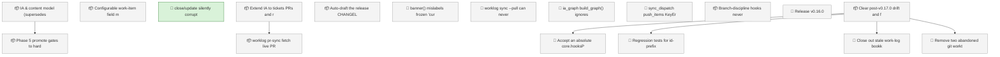
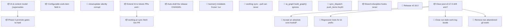

<!-- GENERATED by worklog roadmap-render. DO NOT EDIT. -->

> This file is generated from `.work/todo.jsonl`. Edits will be overwritten.
> To change the roadmap, change the work items: `worklog add|update|close`.

# Roadmap

_3 epic(s) in flight, 14 open item(s), 0 blocked, 0 unclassified._

## Now

### (no epic)

| # | Item | Type | Priority | Status | Blocked by |
|---|---|---|---|---|---|
| [123](https://github.com/SpillwaveSolutions/wiki_ticket_sdd/issues/123) | close/update silently corrupt log when given an item-id prefix instead of the full ULID | task | P1 | in progress | — |

## Next

### Extend IA to tickets, PRs, and releases (artifact pages)  ·  P1  ·  11 of 12 done
Give every ticket, PR, and release its own generated wiki page reusing the IA content model's wiki_key/truth_state/traceability-graph machinery already built for docs — so a reader sees hierarchy, related artifacts, and traceability in one place instead of hunting indexes/logs.

| # | Item | Type | Priority | Status | Blocked by |
|---|---|---|---|---|---|
| [138](https://github.com/SpillwaveSolutions/wiki_ticket_sdd/issues/138) | worklog pr-sync: fetch live PR metadata (files, review/CI status) | task | P2 | todo | — |

### Clear post-v0.17.0 drift and fix the prefix-ULID log corruption  ·  P1  ·  1 of 5 done  ·  feature 1 / bug 2 / ops 2
After v0.17.0 shipped, a sweep of the work log against the actual repo found four items that no longer match reality — a closed-out release still marked open, a finished epic still open and therefore invisible on the roadmap, a session health check that cries wolf on every start, and two abandoned worktrees. It also turned up hard evidence that a known bug has already corrupted this repo's own work log: closing an item by the short id the tool prints creates a phantom item instead. This plan clears the drift and fixes that bug at its root.

| # | Item | Type | Priority | Status | Blocked by |
|---|---|---|---|---|---|
| 01KYJYG4 | Regression tests for id-prefix resolution | task | P1 | todo | — |
| 01KYJYG4 | Accept an absolute core.hooksPath in the doctor checks | task | P2 | todo | — |
| 01KYJYG4 | Close out stale work-log bookkeeping | task | P2 | todo | — |

### (no epic)

| # | Item | Type | Priority | Status | Blocked by |
|---|---|---|---|---|---|
| [184](https://github.com/SpillwaveSolutions/wiki_ticket_sdd/issues/184) | Release v0.16.0 | task | P1 | todo | — |
| [136](https://github.com/SpillwaveSolutions/wiki_ticket_sdd/issues/136) | Auto-draft the release CHANGELOG unreleased section from git log | task | P2 | todo | — |
| [137](https://github.com/SpillwaveSolutions/wiki_ticket_sdd/issues/137) | banner() mislabels frozen 'current' plans as status reports | task | P2 | todo | — |
| [141](https://github.com/SpillwaveSolutions/wiki_ticket_sdd/issues/141) | worklog sync --pull can never bootstrap: cursor-less pull calls the adapter with no --since, which it requires | task | P2 | todo | — |
| [142](https://github.com/SpillwaveSolutions/wiki_ticket_sdd/issues/142) | ia_graph build_graph() ignores commit-only sidecar code links (lands-in only honors code.pr) | task | P2 | todo | — |

## Later

### IA & content model (supersedes wiki-information-architecture)  ·  P1  ·  8 of 9 done
Reorganize the project wiki so anyone — a new developer, a PM, an auditor — can find the right page and know whether it is current or historical. Adds a formal content model, stable page identities, truth-state banners, generated navigation and indexes, and an evidence chain from plans to releases. The full design lives in the plan doc; work proceeds in phases, foundations first.

| # | Item | Type | Priority | Status | Blocked by |
|---|---|---|---|---|---|
| [98](https://github.com/SpillwaveSolutions/wiki_ticket_sdd/issues/98) | Phase 5: promote gates to hard fail; platform render adapters (GitLab/ADO/Confluence); /worklog:find + glossary | task | P3 | todo | — |

### Clear post-v0.17.0 drift and fix the prefix-ULID log corruption  ·  P1  ·  1 of 5 done  ·  feature 1 / bug 2 / ops 2
After v0.17.0 shipped, a sweep of the work log against the actual repo found four items that no longer match reality — a closed-out release still marked open, a finished epic still open and therefore invisible on the roadmap, a session health check that cries wolf on every start, and two abandoned worktrees. It also turned up hard evidence that a known bug has already corrupted this repo's own work log: closing an item by the short id the tool prints creates a phantom item instead. This plan clears the drift and fixes that bug at its root.

| # | Item | Type | Priority | Status | Blocked by |
|---|---|---|---|---|---|
| 01KYJYG4 | Remove two abandoned git worktrees | task | P3 | todo | — |

### (no epic)

| # | Item | Type | Priority | Status | Blocked by |
|---|---|---|---|---|---|
| [108](https://github.com/SpillwaveSolutions/wiki_ticket_sdd/issues/108) | Configurable work-item field model: optional fields (estimate, risk, effort, value, confidence, owner, due_date, acceptance_criteria, blocked_by/blocks) behind work_item_fields config | story | P3 | todo | — |
| [143](https://github.com/SpillwaveSolutions/wiki_ticket_sdd/issues/143) | sync_dispatch push_items KeyError on ext['key'] when forcing a never-remote closed item into scope via --keys | task | P3 | todo | — |

## Milestones

### v0.16.0

| # | Item | Type | Priority | Status | Blocked by |
|---|---|---|---|---|---|
| [184](https://github.com/SpillwaveSolutions/wiki_ticket_sdd/issues/184) | Release v0.16.0 | task | P1 | todo | — |

## Visual roadmap

### Dependency graph

```mermaid
graph TD
    01KY5G9ZW0H2YMNWDFJYGRPYE5["📦 IA & content model (supersedes"]
    01KY5G9ZW0RABXWHEMEP1FAV2G["📦 Phase 5 promote gates to hard"]
    01KY5NE0ZYGBWG44N0KPEBFCZ8["📦 Configurable work-item field m"]
    01KYA99TVCGX79HFNHN1DVT7Y6["🐛 close/update silently corrupt"]
    01KYABYEQP8ANXGYPBCV2T20D8["📦 Extend IA to tickets PRs and r"]
    01KYAC0AC01R4C6W7YY1X8NVRV["📦 Auto-draft the release CHANGEL"]
    01KYACFJA0SQSF4C83BJZXB5MY["🐛 banner() mislabels frozen 'cur"]
    01KYADGT9Q48EKJZVQQSH4HXWZ["📦 worklog pr-sync fetch live PR"]
    01KYAGZ8KK46SQF1MKHAHVCTJV["🐛 worklog sync --pull can never"]
    01KYAHAB3T2QXGMN4SQT4ZNZGW["🐛 ia_graph build_graph() ignores"]
    01KYAKH389T1ZKKBP94WH2HK94["🐛 sync_dispatch push_items KeyEr"]
    01KYBD2HYJVNHX698WR1JD96YC["📦 Branch-discipline hooks never"]
    01KYDZRVN5HAP73465JAM65EK7["🔧 Release v0.16.0"]
    01KYJYG4PX7NVTS1CZQ8MPES7T["📦 Clear post-v0.17.0 drift and f"]
    01KYJYG4PY6TE6ZTZMF8CV2VFT["🐛 Accept an absolute core.hooksP"]
    01KYJYG4PY8S8RZNB9AYP3G8GW["🐛 Regression tests for id-prefix"]
    01KYJYG4PYFFTK74AZ7RW90M7R["🔧 Close out stale work-log bookk"]
    01KYJYG4PYJRAFEHJCP51XVCRA["🔧 Remove two abandoned git workt"]
    01KY5G9ZW0H2YMNWDFJYGRPYE5 --> 01KY5G9ZW0RABXWHEMEP1FAV2G
    01KYABYEQP8ANXGYPBCV2T20D8 --> 01KYADGT9Q48EKJZVQQSH4HXWZ
    01KYJYG4PX7NVTS1CZQ8MPES7T --> 01KYJYG4PY6TE6ZTZMF8CV2VFT
    01KYJYG4PX7NVTS1CZQ8MPES7T --> 01KYJYG4PY8S8RZNB9AYP3G8GW
    01KYJYG4PX7NVTS1CZQ8MPES7T --> 01KYJYG4PYFFTK74AZ7RW90M7R
    01KYJYG4PX7NVTS1CZQ8MPES7T --> 01KYJYG4PYJRAFEHJCP51XVCRA
    classDef todo fill:#f4f4f4,stroke:#999999
    class 01KY5G9ZW0H2YMNWDFJYGRPYE5,01KY5G9ZW0RABXWHEMEP1FAV2G,01KY5NE0ZYGBWG44N0KPEBFCZ8,01KYABYEQP8ANXGYPBCV2T20D8,01KYAC0AC01R4C6W7YY1X8NVRV,01KYACFJA0SQSF4C83BJZXB5MY,01KYADGT9Q48EKJZVQQSH4HXWZ,01KYAGZ8KK46SQF1MKHAHVCTJV,01KYAHAB3T2QXGMN4SQT4ZNZGW,01KYAKH389T1ZKKBP94WH2HK94,01KYBD2HYJVNHX698WR1JD96YC,01KYDZRVN5HAP73465JAM65EK7,01KYJYG4PX7NVTS1CZQ8MPES7T,01KYJYG4PY6TE6ZTZMF8CV2VFT,01KYJYG4PY8S8RZNB9AYP3G8GW,01KYJYG4PYFFTK74AZ7RW90M7R,01KYJYG4PYJRAFEHJCP51XVCRA todo
    classDef in_progress fill:#d9f2d9,stroke:#2e7d32
    class 01KYA99TVCGX79HFNHN1DVT7Y6 in_progress
```

### Hierarchy

```mermaid
graph TD
    01KY5G9ZW0H2YMNWDFJYGRPYE5["📦 IA & content model (supersedes"]
    01KY5G9ZW0RABXWHEMEP1FAV2G["📦 Phase 5 promote gates to hard"]
    01KY5NE0ZYGBWG44N0KPEBFCZ8["📦 Configurable work-item field m"]
    01KYA99TVCGX79HFNHN1DVT7Y6["🐛 close/update silently corrupt"]
    01KYABYEQP8ANXGYPBCV2T20D8["📦 Extend IA to tickets PRs and r"]
    01KYAC0AC01R4C6W7YY1X8NVRV["📦 Auto-draft the release CHANGEL"]
    01KYACFJA0SQSF4C83BJZXB5MY["🐛 banner() mislabels frozen 'cur"]
    01KYADGT9Q48EKJZVQQSH4HXWZ["📦 worklog pr-sync fetch live PR"]
    01KYAGZ8KK46SQF1MKHAHVCTJV["🐛 worklog sync --pull can never"]
    01KYAHAB3T2QXGMN4SQT4ZNZGW["🐛 ia_graph build_graph() ignores"]
    01KYAKH389T1ZKKBP94WH2HK94["🐛 sync_dispatch push_items KeyEr"]
    01KYBD2HYJVNHX698WR1JD96YC["📦 Branch-discipline hooks never"]
    01KYDZRVN5HAP73465JAM65EK7["🔧 Release v0.16.0"]
    01KYJYG4PX7NVTS1CZQ8MPES7T["📦 Clear post-v0.17.0 drift and f"]
    01KYJYG4PY6TE6ZTZMF8CV2VFT["🐛 Accept an absolute core.hooksP"]
    01KYJYG4PY8S8RZNB9AYP3G8GW["🐛 Regression tests for id-prefix"]
    01KYJYG4PYFFTK74AZ7RW90M7R["🔧 Close out stale work-log bookk"]
    01KYJYG4PYJRAFEHJCP51XVCRA["🔧 Remove two abandoned git workt"]
    01KY5G9ZW0H2YMNWDFJYGRPYE5 --> 01KY5G9ZW0RABXWHEMEP1FAV2G
    01KYABYEQP8ANXGYPBCV2T20D8 --> 01KYADGT9Q48EKJZVQQSH4HXWZ
    01KYJYG4PX7NVTS1CZQ8MPES7T --> 01KYJYG4PY6TE6ZTZMF8CV2VFT
    01KYJYG4PX7NVTS1CZQ8MPES7T --> 01KYJYG4PY8S8RZNB9AYP3G8GW
    01KYJYG4PX7NVTS1CZQ8MPES7T --> 01KYJYG4PYFFTK74AZ7RW90M7R
    01KYJYG4PX7NVTS1CZQ8MPES7T --> 01KYJYG4PYJRAFEHJCP51XVCRA
```
