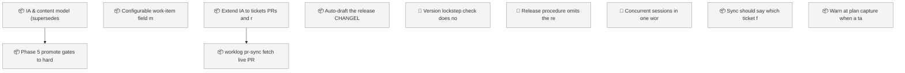
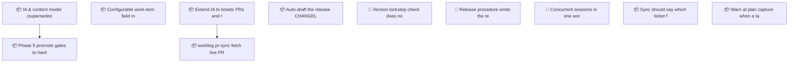

<!-- GENERATED by worklog roadmap-render. DO NOT EDIT. -->

> This file is generated from `.work/todo.jsonl`. Edits will be overwritten.
> To change the roadmap, change the work items: `worklog add|update|close`.

# Roadmap

_2 epic(s) in flight, 9 open item(s), 0 blocked, 0 unclassified._

## Now

_Nothing here._

## Next

### Extend IA to tickets, PRs, and releases (artifact pages)  ·  P1  ·  11 of 12 done
Give every ticket, PR, and release its own generated wiki page reusing the IA content model's wiki_key/truth_state/traceability-graph machinery already built for docs — so a reader sees hierarchy, related artifacts, and traceability in one place instead of hunting indexes/logs.

| # | Item | Type | Priority | Status | Blocked by |
|---|---|---|---|---|---|
| [138](https://github.com/SpillwaveSolutions/wiki_ticket_sdd/issues/138) | worklog pr-sync: fetch live PR metadata (files, review/CI status) | task | P2 | todo | — |

### (no epic)

| # | Item | Type | Priority | Status | Blocked by |
|---|---|---|---|---|---|
| [136](https://github.com/SpillwaveSolutions/wiki_ticket_sdd/issues/136) | Auto-draft the release CHANGELOG unreleased section from git log | task | P2 | todo | — |
| [223](https://github.com/SpillwaveSolutions/wiki_ticket_sdd/issues/223) | Version lockstep check does not cover the README version marker | task | P2 | todo | — |
| [236](https://github.com/SpillwaveSolutions/wiki_ticket_sdd/issues/236) | Concurrent sessions in one working directory corrupt each other's work | task | P2 | todo | — |

## Later

### IA & content model (supersedes wiki-information-architecture)  ·  P1  ·  8 of 9 done
Reorganize the project wiki so anyone — a new developer, a PM, an auditor — can find the right page and know whether it is current or historical. Adds a formal content model, stable page identities, truth-state banners, generated navigation and indexes, and an evidence chain from plans to releases. The full design lives in the plan doc; work proceeds in phases, foundations first.

| # | Item | Type | Priority | Status | Blocked by |
|---|---|---|---|---|---|
| [98](https://github.com/SpillwaveSolutions/wiki_ticket_sdd/issues/98) | Phase 5: promote gates to hard fail; platform render adapters (GitLab/ADO/Confluence); /worklog:find + glossary | task | P3 | todo | — |

### (no epic)

| # | Item | Type | Priority | Status | Blocked by |
|---|---|---|---|---|---|
| [108](https://github.com/SpillwaveSolutions/wiki_ticket_sdd/issues/108) | Configurable work-item field model: optional fields (estimate, risk, effort, value, confidence, owner, due_date, acceptance_criteria, blocked_by/blocks) behind work_item_fields config | story | P3 | todo | — |
| [224](https://github.com/SpillwaveSolutions/wiki_ticket_sdd/issues/224) | Release procedure omits the re-index required after publishing to the wiki | task | P3 | todo | — |
| [238](https://github.com/SpillwaveSolutions/wiki_ticket_sdd/issues/238) | Sync should say which ticket fields it is about to overwrite | task | P3 | todo | — |
| [242](https://github.com/SpillwaveSolutions/wiki_ticket_sdd/issues/242) | Warn at plan capture when a task title references a ticket number | task | P3 | todo | — |

## Visual roadmap

### Dependency graph

```mermaid
graph TD
    01KY5G9ZW0H2YMNWDFJYGRPYE5["📦 IA & content model (supersedes"]
    01KY5G9ZW0RABXWHEMEP1FAV2G["📦 Phase 5 promote gates to hard"]
    01KY5NE0ZYGBWG44N0KPEBFCZ8["📦 Configurable work-item field m"]
    01KYABYEQP8ANXGYPBCV2T20D8["📦 Extend IA to tickets PRs and r"]
    01KYAC0AC01R4C6W7YY1X8NVRV["📦 Auto-draft the release CHANGEL"]
    01KYADGT9Q48EKJZVQQSH4HXWZ["📦 worklog pr-sync fetch live PR"]
    01KYKDGW3DFDEQ1DEDFR6N45SM["🔧 Version lockstep check does no"]
    01KYKDGW7HJMRQ2KKF02M8CAAW["🔧 Release procedure omits the re"]
    01KYNHEV5GCR1MDNECAXFT0GK2["🔧 Concurrent sessions in one wor"]
    01KYNHEVDSD4BTASXCTV88Q80Q["📦 Sync should say which ticket f"]
    01KYNHEVZSBJ43P0CE2EBXT7Y0["📦 Warn at plan capture when a ta"]
    01KY5G9ZW0H2YMNWDFJYGRPYE5 --> 01KY5G9ZW0RABXWHEMEP1FAV2G
    01KYABYEQP8ANXGYPBCV2T20D8 --> 01KYADGT9Q48EKJZVQQSH4HXWZ
    classDef todo fill:#f4f4f4,stroke:#999999
    class 01KY5G9ZW0H2YMNWDFJYGRPYE5,01KY5G9ZW0RABXWHEMEP1FAV2G,01KY5NE0ZYGBWG44N0KPEBFCZ8,01KYABYEQP8ANXGYPBCV2T20D8,01KYAC0AC01R4C6W7YY1X8NVRV,01KYADGT9Q48EKJZVQQSH4HXWZ,01KYKDGW3DFDEQ1DEDFR6N45SM,01KYKDGW7HJMRQ2KKF02M8CAAW,01KYNHEV5GCR1MDNECAXFT0GK2,01KYNHEVDSD4BTASXCTV88Q80Q,01KYNHEVZSBJ43P0CE2EBXT7Y0 todo
```

### Hierarchy

```mermaid
graph TD
    01KY5G9ZW0H2YMNWDFJYGRPYE5["📦 IA & content model (supersedes"]
    01KY5G9ZW0RABXWHEMEP1FAV2G["📦 Phase 5 promote gates to hard"]
    01KY5NE0ZYGBWG44N0KPEBFCZ8["📦 Configurable work-item field m"]
    01KYABYEQP8ANXGYPBCV2T20D8["📦 Extend IA to tickets PRs and r"]
    01KYAC0AC01R4C6W7YY1X8NVRV["📦 Auto-draft the release CHANGEL"]
    01KYADGT9Q48EKJZVQQSH4HXWZ["📦 worklog pr-sync fetch live PR"]
    01KYKDGW3DFDEQ1DEDFR6N45SM["🔧 Version lockstep check does no"]
    01KYKDGW7HJMRQ2KKF02M8CAAW["🔧 Release procedure omits the re"]
    01KYNHEV5GCR1MDNECAXFT0GK2["🔧 Concurrent sessions in one wor"]
    01KYNHEVDSD4BTASXCTV88Q80Q["📦 Sync should say which ticket f"]
    01KYNHEVZSBJ43P0CE2EBXT7Y0["📦 Warn at plan capture when a ta"]
    01KY5G9ZW0H2YMNWDFJYGRPYE5 --> 01KY5G9ZW0RABXWHEMEP1FAV2G
    01KYABYEQP8ANXGYPBCV2T20D8 --> 01KYADGT9Q48EKJZVQQSH4HXWZ
```
