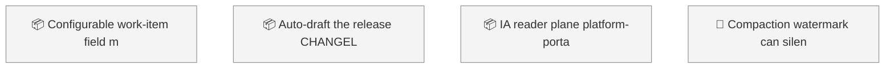
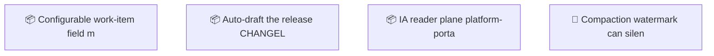

<!-- GENERATED by worklog roadmap-render. DO NOT EDIT. -->

> This file is generated from `.work/todo.jsonl`. Edits will be overwritten.
> To change the roadmap, change the work items: `worklog add|update|close`.

# Roadmap

_0 epic(s) in flight, 3 open item(s), 0 blocked, 0 unclassified._

## Now

_Nothing here._

## Next

### (no epic)

| # | Item | Type | Priority | Status | Blocked by |
|---|---|---|---|---|---|
| 01KYZ5CY | Compaction watermark can silently drop branch-local events the snapshot never folded | task | P1 | todo | — |
| [136](https://github.com/SpillwaveSolutions/wiki_ticket_sdd/issues/136) | Auto-draft the release CHANGELOG unreleased section from git log | task | P2 | todo | — |

## Later

### (no epic)

| # | Item | Type | Priority | Status | Blocked by |
|---|---|---|---|---|---|
| [108](https://github.com/SpillwaveSolutions/wiki_ticket_sdd/issues/108) | Configurable work-item field model: optional fields (estimate, risk, effort, value, confidence, owner, due_date, acceptance_criteria, blocked_by/blocks) behind work_item_fields config | story | P3 | todo | — |

## Needs attention

- **[270](https://github.com/SpillwaveSolutions/wiki_ticket_sdd/issues/270)** IA reader plane: platform-portable rendering and document search — no open children left; close the epic.

## Visual roadmap

### Dependency graph

```mermaid
graph TD
    01KY5NE0ZYGBWG44N0KPEBFCZ8["📦 Configurable work-item field m"]
    01KYAC0AC01R4C6W7YY1X8NVRV["📦 Auto-draft the release CHANGEL"]
    01KYWGM3KPNQNSWV03FRG23ADB["📦 IA reader plane platform-porta"]
    01KYZ5CY9PS60BYH1E07DF5C9P["🐛 Compaction watermark can silen"]
    classDef todo fill:#f4f4f4,stroke:#999999
    class 01KY5NE0ZYGBWG44N0KPEBFCZ8,01KYAC0AC01R4C6W7YY1X8NVRV,01KYWGM3KPNQNSWV03FRG23ADB,01KYZ5CY9PS60BYH1E07DF5C9P todo
```

### Hierarchy

```mermaid
graph TD
    01KY5NE0ZYGBWG44N0KPEBFCZ8["📦 Configurable work-item field m"]
    01KYAC0AC01R4C6W7YY1X8NVRV["📦 Auto-draft the release CHANGEL"]
    01KYWGM3KPNQNSWV03FRG23ADB["📦 IA reader plane platform-porta"]
    01KYZ5CY9PS60BYH1E07DF5C9P["🐛 Compaction watermark can silen"]
```
