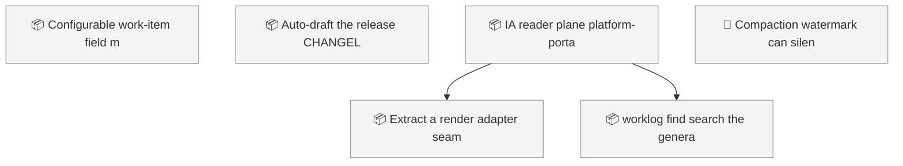
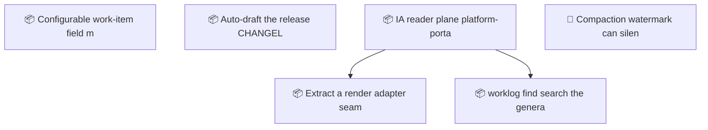

<!-- GENERATED by worklog roadmap-render. DO NOT EDIT. -->

> This file is generated from `.work/todo.jsonl`. Edits will be overwritten.
> To change the roadmap, change the work items: `worklog add|update|close`.

# Roadmap

_1 epic(s) in flight, 5 open item(s), 0 blocked, 0 unclassified._

## Now

_Nothing here._

## Next

### (no epic)

| # | Item | Type | Priority | Status | Blocked by |
|---|---|---|---|---|---|
| 01KYZ5CY | Compaction watermark can silently drop branch-local events the snapshot never folded | task | P1 | todo | — |
| [136](https://github.com/SpillwaveSolutions/wiki_ticket_sdd/issues/136) | Auto-draft the release CHANGELOG unreleased section from git log | task | P2 | todo | — |

## Later

### IA reader plane: platform-portable rendering and document search  ·  P3  ·  0 of 2 done
What is left of the IA content model after Phase 5's gate promotion shipped. The phase-5 ticket bundled three unrelated things: promoting the CI gates to hard failures (done, and the item on the design docs' extension roadmap), a rendering port to other wiki platforms, and a document-search command. Only the first had a user. This epic holds the rest so the parent epic can close on the value that actually shipped rather than being held open by work nobody has planned. Deliberately NOT filed here: one item per wiki platform (GitLab, Azure DevOps, Confluence). The config names github-wiki and no one has asked for another; those get filed when a platform has a user, not before. Also dropped: the glossary page, which its own plan marks optional.

| # | Item | Type | Priority | Status | Blocked by |
|---|---|---|---|---|---|
| [271](https://github.com/SpillwaveSolutions/wiki_ticket_sdd/issues/271) | Extract a render adapter seam so page naming is not hardcoded to Gollum | task | P3 | todo | — |
| [272](https://github.com/SpillwaveSolutions/wiki_ticket_sdd/issues/272) | worklog find: search the generated inventory and graph from the CLI | task | P3 | todo | — |

### (no epic)

| # | Item | Type | Priority | Status | Blocked by |
|---|---|---|---|---|---|
| [108](https://github.com/SpillwaveSolutions/wiki_ticket_sdd/issues/108) | Configurable work-item field model: optional fields (estimate, risk, effort, value, confidence, owner, due_date, acceptance_criteria, blocked_by/blocks) behind work_item_fields config | story | P3 | todo | — |

## Visual roadmap

### Dependency graph

```mermaid
graph TD
    01KY5NE0ZYGBWG44N0KPEBFCZ8["📦 Configurable work-item field m"]
    01KYAC0AC01R4C6W7YY1X8NVRV["📦 Auto-draft the release CHANGEL"]
    01KYWGM3KPNQNSWV03FRG23ADB["📦 IA reader plane platform-porta"]
    01KYWGM3R13Q33YZ3PJA3V7QMD["📦 Extract a render adapter seam"]
    01KYWGM3W958F3QK4HB52X1Q1X["📦 worklog find search the genera"]
    01KYZ5CY9PS60BYH1E07DF5C9P["🐛 Compaction watermark can silen"]
    01KYWGM3KPNQNSWV03FRG23ADB --> 01KYWGM3R13Q33YZ3PJA3V7QMD
    01KYWGM3KPNQNSWV03FRG23ADB --> 01KYWGM3W958F3QK4HB52X1Q1X
    classDef todo fill:#f4f4f4,stroke:#999999
    class 01KY5NE0ZYGBWG44N0KPEBFCZ8,01KYAC0AC01R4C6W7YY1X8NVRV,01KYWGM3KPNQNSWV03FRG23ADB,01KYWGM3R13Q33YZ3PJA3V7QMD,01KYWGM3W958F3QK4HB52X1Q1X,01KYZ5CY9PS60BYH1E07DF5C9P todo
```

### Hierarchy

```mermaid
graph TD
    01KY5NE0ZYGBWG44N0KPEBFCZ8["📦 Configurable work-item field m"]
    01KYAC0AC01R4C6W7YY1X8NVRV["📦 Auto-draft the release CHANGEL"]
    01KYWGM3KPNQNSWV03FRG23ADB["📦 IA reader plane platform-porta"]
    01KYWGM3R13Q33YZ3PJA3V7QMD["📦 Extract a render adapter seam"]
    01KYWGM3W958F3QK4HB52X1Q1X["📦 worklog find search the genera"]
    01KYZ5CY9PS60BYH1E07DF5C9P["🐛 Compaction watermark can silen"]
    01KYWGM3KPNQNSWV03FRG23ADB --> 01KYWGM3R13Q33YZ3PJA3V7QMD
    01KYWGM3KPNQNSWV03FRG23ADB --> 01KYWGM3W958F3QK4HB52X1Q1X
```
