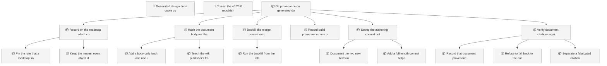
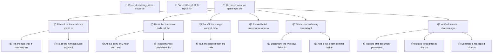

<!-- GENERATED by worklog roadmap-render. DO NOT EDIT. -->

> This file is generated from `.work/todo.jsonl`. Edits will be overwritten.
> To change the roadmap, change the work items: `worklog add|update|close`.

# Roadmap

_1 epic(s) in flight, 18 open item(s), 0 blocked, 0 unclassified._

## Now

_Nothing here._

## Next

### Git provenance on generated docs, and the verifier it enables  ·  P1  ·  0 of 16 done

| # | Item | Type | Priority | Status | Blocked by |
|---|---|---|---|---|---|
| 01KZ30X6 | Record on the roadmap which commit its data came from | task | P2 | todo | — |
| 01KZ30X6 | Hash the document body, not the whole file, when deciding what to republish | task | P2 | todo | — |
| 01KZ30X6 | Pin the rule that a roadmap snapshot inherits the roadmap's provenance | subtask | P2 | todo | — |
| 01KZ30X6 | Keep the newest event object during the scan without changing the existing helper's signature | subtask | P2 | todo | — |
| 01KZ30X6 | Add a body-only hash and use it for pages published with a banner | subtask | P2 | todo | — |
| 01KZ30X6 | Teach the wiki publisher's frozen-document guard to read it, in both skill trees | subtask | P2 | todo | — |
| 01KZ30X6 | Backfill the merge commit onto documents once they land on the default branch | task | P2 | todo | — |
| 01KZ30X6 | Run the backfill from the release routine rather than a git hook | subtask | P2 | todo | — |
| 01KZ30X6 | Stamp the authoring commit onto plans, status reports and new decision records | task | P2 | todo | — |
| 01KZ30X6 | Refuse to fall back to the current checkout when the recorded commit cannot be resolved | subtask | P2 | todo | — |
| 01KZ30X6 | Verify document citations against the commit the document was written against | task | P2 | todo | — |
| 01KZ30X6 | Separate a fabricated citation from one that merely drifted | subtask | P2 | todo | — |
| 01KZ30X6 | Add a full-length commit helper that mirrors the existing environment contract | subtask | P2 | todo | — |

### (no epic)

| # | Item | Type | Priority | Status | Blocked by |
|---|---|---|---|---|---|
| 294 | Generated design docs quote code that no longer exists; nothing verifies their claims | task | P2 | todo | — |

## Later

### Git provenance on generated docs, and the verifier it enables  ·  P1  ·  0 of 16 done

| # | Item | Type | Priority | Status | Blocked by |
|---|---|---|---|---|---|
| 01KZ30X6 | Record build provenance once on the publish manifest rather than on every rendered page | task | P3 | todo | — |
| 01KZ30X6 | Record that document provenance depends on merge commits, not squash merges | subtask | P3 | todo | — |
| 01KZ30X6 | Document the two new fields in the document schema | subtask | P3 | todo | — |

### (no epic)

| # | Item | Type | Priority | Status | Blocked by |
|---|---|---|---|---|---|
| 01KZ2PJZ | Correct the v0.20.0 republish claim in the next release notes | task | P3 | todo | — |

## Visual roadmap

### Dependency graph

```mermaid
graph TD
    01KZ2M75CEXBQHFN1AG1Z8A2YB["🐛 Generated design docs quote co"]
    01KZ2PJZF067ZS4YW231C1FM28["🔧 Correct the v0.20.0 republish"]
    01KZ30X6HZ6FKJXJX386J44CB1["📦 Git provenance on generated do"]
    01KZ30X6JD06D11ACPVF8Q5GMW["📦 Record on the roadmap which co"]
    01KZ30X6JD7M4XV6Y5194E1D32["📦 Hash the document body not the"]
    01KZ30X6JDHPRBESZDQ2CSNJZ2["📦 Pin the rule that a roadmap sn"]
    01KZ30X6JDSYHB6FQB7RRCGKQQ["📦 Keep the newest event object d"]
    01KZ30X6JDXDZ38RY6AQEYE7VY["📦 Add a body-only hash and use i"]
    01KZ30X6JDYF6YQWN6WYMVQ5Y4["📦 Teach the wiki publisher's fro"]
    01KZ30X6JE0QSQF6BE8S0YRPBW["📦 Backfill the merge commit onto"]
    01KZ30X6JE1ERVS43QVXEEGVXA["📦 Record build provenance once o"]
    01KZ30X6JE8542ERDW1B8A9P8H["📦 Run the backfill from the rele"]
    01KZ30X6JEBXN08HQTQ77ESSTV["📦 Record that document provenanc"]
    01KZ30X6JECK0M9G04ZHMS4SMA["📦 Stamp the authoring commit ont"]
    01KZ30X6JEETVQZG7YYFM7B998["📦 Refuse to fall back to the cur"]
    01KZ30X6JEF29Z5AEEWXBSJWHV["📦 Verify document citations agai"]
    01KZ30X6JEH1Z7D5AC5ZAMM5V8["📦 Document the two new fields in"]
    01KZ30X6JEWCD74E81Y555DAYP["📦 Separate a fabricated citation"]
    01KZ30X6JEXH4TTKHDNV3ZW0Q2["📦 Add a full-length commit helpe"]
    01KZ30X6HZ6FKJXJX386J44CB1 --> 01KZ30X6JD06D11ACPVF8Q5GMW
    01KZ30X6HZ6FKJXJX386J44CB1 --> 01KZ30X6JD7M4XV6Y5194E1D32
    01KZ30X6JD06D11ACPVF8Q5GMW --> 01KZ30X6JDHPRBESZDQ2CSNJZ2
    01KZ30X6JD06D11ACPVF8Q5GMW --> 01KZ30X6JDSYHB6FQB7RRCGKQQ
    01KZ30X6JD7M4XV6Y5194E1D32 --> 01KZ30X6JDXDZ38RY6AQEYE7VY
    01KZ30X6JD7M4XV6Y5194E1D32 --> 01KZ30X6JDYF6YQWN6WYMVQ5Y4
    01KZ30X6HZ6FKJXJX386J44CB1 --> 01KZ30X6JE0QSQF6BE8S0YRPBW
    01KZ30X6HZ6FKJXJX386J44CB1 --> 01KZ30X6JE1ERVS43QVXEEGVXA
    01KZ30X6JE0QSQF6BE8S0YRPBW --> 01KZ30X6JE8542ERDW1B8A9P8H
    01KZ30X6JEF29Z5AEEWXBSJWHV --> 01KZ30X6JEBXN08HQTQ77ESSTV
    01KZ30X6HZ6FKJXJX386J44CB1 --> 01KZ30X6JECK0M9G04ZHMS4SMA
    01KZ30X6JEF29Z5AEEWXBSJWHV --> 01KZ30X6JEETVQZG7YYFM7B998
    01KZ30X6HZ6FKJXJX386J44CB1 --> 01KZ30X6JEF29Z5AEEWXBSJWHV
    01KZ30X6JECK0M9G04ZHMS4SMA --> 01KZ30X6JEH1Z7D5AC5ZAMM5V8
    01KZ30X6JEF29Z5AEEWXBSJWHV --> 01KZ30X6JEWCD74E81Y555DAYP
    01KZ30X6JECK0M9G04ZHMS4SMA --> 01KZ30X6JEXH4TTKHDNV3ZW0Q2
    classDef todo fill:#f4f4f4,stroke:#999999
    class 01KZ2M75CEXBQHFN1AG1Z8A2YB,01KZ2PJZF067ZS4YW231C1FM28,01KZ30X6HZ6FKJXJX386J44CB1,01KZ30X6JD06D11ACPVF8Q5GMW,01KZ30X6JD7M4XV6Y5194E1D32,01KZ30X6JDHPRBESZDQ2CSNJZ2,01KZ30X6JDSYHB6FQB7RRCGKQQ,01KZ30X6JDXDZ38RY6AQEYE7VY,01KZ30X6JDYF6YQWN6WYMVQ5Y4,01KZ30X6JE0QSQF6BE8S0YRPBW,01KZ30X6JE1ERVS43QVXEEGVXA,01KZ30X6JE8542ERDW1B8A9P8H,01KZ30X6JEBXN08HQTQ77ESSTV,01KZ30X6JECK0M9G04ZHMS4SMA,01KZ30X6JEETVQZG7YYFM7B998,01KZ30X6JEF29Z5AEEWXBSJWHV,01KZ30X6JEH1Z7D5AC5ZAMM5V8,01KZ30X6JEWCD74E81Y555DAYP,01KZ30X6JEXH4TTKHDNV3ZW0Q2 todo
```

### Hierarchy

```mermaid
graph TD
    01KZ2M75CEXBQHFN1AG1Z8A2YB["🐛 Generated design docs quote co"]
    01KZ2PJZF067ZS4YW231C1FM28["🔧 Correct the v0.20.0 republish"]
    01KZ30X6HZ6FKJXJX386J44CB1["📦 Git provenance on generated do"]
    01KZ30X6JD06D11ACPVF8Q5GMW["📦 Record on the roadmap which co"]
    01KZ30X6JD7M4XV6Y5194E1D32["📦 Hash the document body not the"]
    01KZ30X6JDHPRBESZDQ2CSNJZ2["📦 Pin the rule that a roadmap sn"]
    01KZ30X6JDSYHB6FQB7RRCGKQQ["📦 Keep the newest event object d"]
    01KZ30X6JDXDZ38RY6AQEYE7VY["📦 Add a body-only hash and use i"]
    01KZ30X6JDYF6YQWN6WYMVQ5Y4["📦 Teach the wiki publisher's fro"]
    01KZ30X6JE0QSQF6BE8S0YRPBW["📦 Backfill the merge commit onto"]
    01KZ30X6JE1ERVS43QVXEEGVXA["📦 Record build provenance once o"]
    01KZ30X6JE8542ERDW1B8A9P8H["📦 Run the backfill from the rele"]
    01KZ30X6JEBXN08HQTQ77ESSTV["📦 Record that document provenanc"]
    01KZ30X6JECK0M9G04ZHMS4SMA["📦 Stamp the authoring commit ont"]
    01KZ30X6JEETVQZG7YYFM7B998["📦 Refuse to fall back to the cur"]
    01KZ30X6JEF29Z5AEEWXBSJWHV["📦 Verify document citations agai"]
    01KZ30X6JEH1Z7D5AC5ZAMM5V8["📦 Document the two new fields in"]
    01KZ30X6JEWCD74E81Y555DAYP["📦 Separate a fabricated citation"]
    01KZ30X6JEXH4TTKHDNV3ZW0Q2["📦 Add a full-length commit helpe"]
    01KZ30X6HZ6FKJXJX386J44CB1 --> 01KZ30X6JD06D11ACPVF8Q5GMW
    01KZ30X6HZ6FKJXJX386J44CB1 --> 01KZ30X6JD7M4XV6Y5194E1D32
    01KZ30X6JD06D11ACPVF8Q5GMW --> 01KZ30X6JDHPRBESZDQ2CSNJZ2
    01KZ30X6JD06D11ACPVF8Q5GMW --> 01KZ30X6JDSYHB6FQB7RRCGKQQ
    01KZ30X6JD7M4XV6Y5194E1D32 --> 01KZ30X6JDXDZ38RY6AQEYE7VY
    01KZ30X6JD7M4XV6Y5194E1D32 --> 01KZ30X6JDYF6YQWN6WYMVQ5Y4
    01KZ30X6HZ6FKJXJX386J44CB1 --> 01KZ30X6JE0QSQF6BE8S0YRPBW
    01KZ30X6HZ6FKJXJX386J44CB1 --> 01KZ30X6JE1ERVS43QVXEEGVXA
    01KZ30X6JE0QSQF6BE8S0YRPBW --> 01KZ30X6JE8542ERDW1B8A9P8H
    01KZ30X6JEF29Z5AEEWXBSJWHV --> 01KZ30X6JEBXN08HQTQ77ESSTV
    01KZ30X6HZ6FKJXJX386J44CB1 --> 01KZ30X6JECK0M9G04ZHMS4SMA
    01KZ30X6JEF29Z5AEEWXBSJWHV --> 01KZ30X6JEETVQZG7YYFM7B998
    01KZ30X6HZ6FKJXJX386J44CB1 --> 01KZ30X6JEF29Z5AEEWXBSJWHV
    01KZ30X6JECK0M9G04ZHMS4SMA --> 01KZ30X6JEH1Z7D5AC5ZAMM5V8
    01KZ30X6JEF29Z5AEEWXBSJWHV --> 01KZ30X6JEWCD74E81Y555DAYP
    01KZ30X6JECK0M9G04ZHMS4SMA --> 01KZ30X6JEXH4TTKHDNV3ZW0Q2
```
