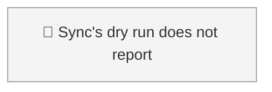
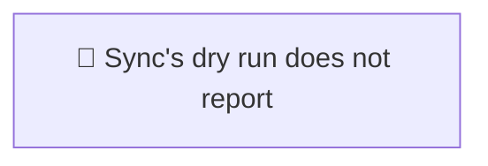

<!-- GENERATED by worklog roadmap-render. DO NOT EDIT. -->

> This file is generated from `.work/todo.jsonl`. Edits will be overwritten.
> To change the roadmap, change the work items: `worklog add|update|close`.

# Roadmap

_0 epic(s) in flight, 1 open item(s), 0 blocked, 0 unclassified._

## Now

_Nothing here._

## Next

### (no epic)

| # | Item | Type | Priority | Status | Blocked by |
|---|---|---|---|---|---|
| [320](https://github.com/SpillwaveSolutions/wiki_ticket_sdd/issues/320) | Sync's dry run does not report the field overwrites a close would make | task | P2 | todo | — |

## Later

_Nothing here._

## Visual roadmap

### Dependency graph

```mermaid
graph TD
    01KZ31DGAQ2YDP6RMEMVNAWABH["🐛 Sync's dry run does not report"]
    classDef todo fill:#f4f4f4,stroke:#999999
    class 01KZ31DGAQ2YDP6RMEMVNAWABH todo
```

### Hierarchy

```mermaid
graph TD
    01KZ31DGAQ2YDP6RMEMVNAWABH["🐛 Sync's dry run does not report"]
```
