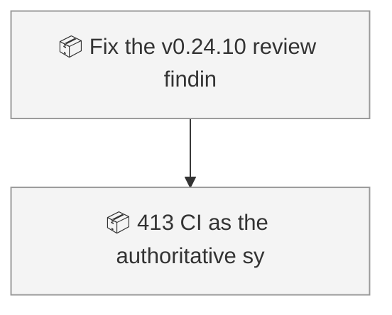
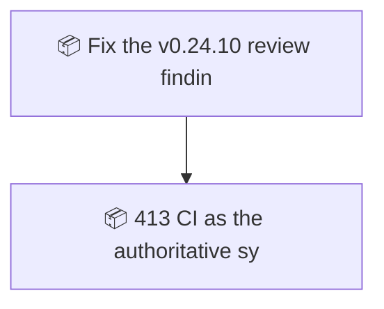

<!-- GENERATED by worklog roadmap-render. DO NOT EDIT. -->

> This file is generated from `.work/todo.jsonl`. Edits will be overwritten.
> To change the roadmap, change the work items: `worklog add|update|close`.

# Roadmap

_1 epic(s) in flight, 1 open item(s), 0 blocked, 0 unclassified._

## Now

_Nothing here._

## Next

### Fix the v0.24.10 review findings and close #412 and #413  ·  P1  ·  19 of 20 done  ·  feature 8 / bug 12
The v0.24.10 change review found a P0 in retention (archived items ping-pong back into done.jsonl), a merge gate that trusts commit statuses from any actor, and seven releases without regenerated design docs. Issues #412 and #413 add duplicate ticket creation on fresh clones and a request for CI-owned sync with Azure Pipelines support. This epic fixes all of it in one PR per workstream: retention, marker probe, gate hardening, PAT identity for bot PRs, CI sync, release gate, and an Azure template.

| # | Item | Type | Priority | Status | Blocked by |
|---|---|---|---|---|---|
| [429](https://github.com/SpillwaveSolutions/wiki_ticket_sdd/issues/429) | #413: CI as the authoritative syncer behind ticketing.sync_owner: ci | task | P2 | todo | — |

## Later

_Nothing here._

## Visual roadmap

### Dependency graph

```mermaid
graph TD
    01M2XCWMV0QYM4ZRBWN1V1327B["📦 Fix the v0.24.10 review findin"]
    01M2XCWMVEH3XFP2VPS9JBD6XN["📦 413 CI as the authoritative sy"]
    01M2XCWMV0QYM4ZRBWN1V1327B --> 01M2XCWMVEH3XFP2VPS9JBD6XN
    classDef todo fill:#f4f4f4,stroke:#999999
    class 01M2XCWMV0QYM4ZRBWN1V1327B,01M2XCWMVEH3XFP2VPS9JBD6XN todo
```

### Hierarchy

```mermaid
graph TD
    01M2XCWMV0QYM4ZRBWN1V1327B["📦 Fix the v0.24.10 review findin"]
    01M2XCWMVEH3XFP2VPS9JBD6XN["📦 413 CI as the authoritative sy"]
    01M2XCWMV0QYM4ZRBWN1V1327B --> 01M2XCWMVEH3XFP2VPS9JBD6XN
```
