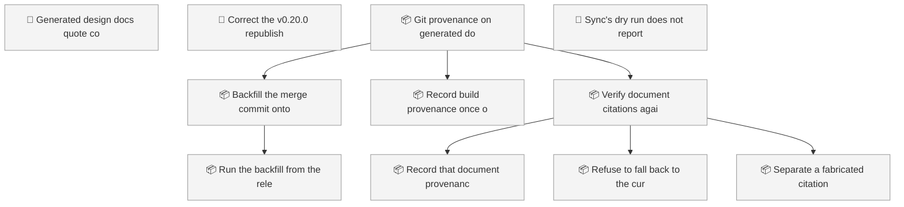
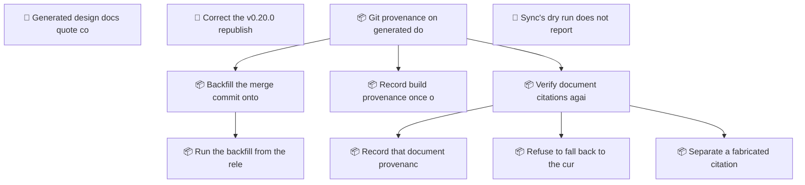

<!-- GENERATED by worklog roadmap-render. DO NOT EDIT. -->

> This file is generated from `.work/todo.jsonl`. Edits will be overwritten.
> To change the roadmap, change the work items: `worklog add|update|close`.

# Roadmap

_1 epic(s) in flight, 10 open item(s), 0 blocked, 0 unclassified._

## Now

_Nothing here._

## Next

### Git provenance on generated docs, and the verifier it enables  ·  P1  ·  9 of 16 done

| # | Item | Type | Priority | Status | Blocked by |
|---|---|---|---|---|---|
| [307](https://github.com/SpillwaveSolutions/wiki_ticket_sdd/issues/307) | Backfill the merge commit onto documents once they land on the default branch | task | P2 | todo | — |
| [309](https://github.com/SpillwaveSolutions/wiki_ticket_sdd/issues/309) | Run the backfill from the release routine rather than a git hook | subtask | P2 | todo | — |
| [312](https://github.com/SpillwaveSolutions/wiki_ticket_sdd/issues/312) | Refuse to fall back to the current checkout when the recorded commit cannot be resolved | subtask | P2 | todo | — |
| [313](https://github.com/SpillwaveSolutions/wiki_ticket_sdd/issues/313) | Verify document citations against the commit the document was written against | task | P2 | todo | — |
| [315](https://github.com/SpillwaveSolutions/wiki_ticket_sdd/issues/315) | Separate a fabricated citation from one that merely drifted | subtask | P2 | todo | — |

### (no epic)

| # | Item | Type | Priority | Status | Blocked by |
|---|---|---|---|---|---|
| 294 | Generated design docs quote code that no longer exists; nothing verifies their claims | task | P2 | todo | — |
| 01KZ31DG | Sync's dry run does not report the field overwrites a close would make | task | P2 | todo | — |

## Later

### Git provenance on generated docs, and the verifier it enables  ·  P1  ·  9 of 16 done

| # | Item | Type | Priority | Status | Blocked by |
|---|---|---|---|---|---|
| [308](https://github.com/SpillwaveSolutions/wiki_ticket_sdd/issues/308) | Record build provenance once on the publish manifest rather than on every rendered page | task | P3 | todo | — |
| [310](https://github.com/SpillwaveSolutions/wiki_ticket_sdd/issues/310) | Record that document provenance depends on merge commits, not squash merges | subtask | P3 | todo | — |

### (no epic)

| # | Item | Type | Priority | Status | Blocked by |
|---|---|---|---|---|---|
| [299](https://github.com/SpillwaveSolutions/wiki_ticket_sdd/issues/299) | Correct the v0.20.0 republish claim in the next release notes | task | P3 | todo | — |

## Visual roadmap

### Dependency graph

```mermaid
graph TD
    01KZ2M75CEXBQHFN1AG1Z8A2YB["🐛 Generated design docs quote co"]
    01KZ2PJZF067ZS4YW231C1FM28["🔧 Correct the v0.20.0 republish"]
    01KZ30X6HZ6FKJXJX386J44CB1["📦 Git provenance on generated do"]
    01KZ30X6JE0QSQF6BE8S0YRPBW["📦 Backfill the merge commit onto"]
    01KZ30X6JE1ERVS43QVXEEGVXA["📦 Record build provenance once o"]
    01KZ30X6JE8542ERDW1B8A9P8H["📦 Run the backfill from the rele"]
    01KZ30X6JEBXN08HQTQ77ESSTV["📦 Record that document provenanc"]
    01KZ30X6JEETVQZG7YYFM7B998["📦 Refuse to fall back to the cur"]
    01KZ30X6JEF29Z5AEEWXBSJWHV["📦 Verify document citations agai"]
    01KZ30X6JEWCD74E81Y555DAYP["📦 Separate a fabricated citation"]
    01KZ31DGAQ2YDP6RMEMVNAWABH["🐛 Sync's dry run does not report"]
    01KZ30X6HZ6FKJXJX386J44CB1 --> 01KZ30X6JE0QSQF6BE8S0YRPBW
    01KZ30X6HZ6FKJXJX386J44CB1 --> 01KZ30X6JE1ERVS43QVXEEGVXA
    01KZ30X6JE0QSQF6BE8S0YRPBW --> 01KZ30X6JE8542ERDW1B8A9P8H
    01KZ30X6JEF29Z5AEEWXBSJWHV --> 01KZ30X6JEBXN08HQTQ77ESSTV
    01KZ30X6JEF29Z5AEEWXBSJWHV --> 01KZ30X6JEETVQZG7YYFM7B998
    01KZ30X6HZ6FKJXJX386J44CB1 --> 01KZ30X6JEF29Z5AEEWXBSJWHV
    01KZ30X6JEF29Z5AEEWXBSJWHV --> 01KZ30X6JEWCD74E81Y555DAYP
    classDef todo fill:#f4f4f4,stroke:#999999
    class 01KZ2M75CEXBQHFN1AG1Z8A2YB,01KZ2PJZF067ZS4YW231C1FM28,01KZ30X6HZ6FKJXJX386J44CB1,01KZ30X6JE0QSQF6BE8S0YRPBW,01KZ30X6JE1ERVS43QVXEEGVXA,01KZ30X6JE8542ERDW1B8A9P8H,01KZ30X6JEBXN08HQTQ77ESSTV,01KZ30X6JEETVQZG7YYFM7B998,01KZ30X6JEF29Z5AEEWXBSJWHV,01KZ30X6JEWCD74E81Y555DAYP,01KZ31DGAQ2YDP6RMEMVNAWABH todo
```

### Hierarchy

```mermaid
graph TD
    01KZ2M75CEXBQHFN1AG1Z8A2YB["🐛 Generated design docs quote co"]
    01KZ2PJZF067ZS4YW231C1FM28["🔧 Correct the v0.20.0 republish"]
    01KZ30X6HZ6FKJXJX386J44CB1["📦 Git provenance on generated do"]
    01KZ30X6JE0QSQF6BE8S0YRPBW["📦 Backfill the merge commit onto"]
    01KZ30X6JE1ERVS43QVXEEGVXA["📦 Record build provenance once o"]
    01KZ30X6JE8542ERDW1B8A9P8H["📦 Run the backfill from the rele"]
    01KZ30X6JEBXN08HQTQ77ESSTV["📦 Record that document provenanc"]
    01KZ30X6JEETVQZG7YYFM7B998["📦 Refuse to fall back to the cur"]
    01KZ30X6JEF29Z5AEEWXBSJWHV["📦 Verify document citations agai"]
    01KZ30X6JEWCD74E81Y555DAYP["📦 Separate a fabricated citation"]
    01KZ31DGAQ2YDP6RMEMVNAWABH["🐛 Sync's dry run does not report"]
    01KZ30X6HZ6FKJXJX386J44CB1 --> 01KZ30X6JE0QSQF6BE8S0YRPBW
    01KZ30X6HZ6FKJXJX386J44CB1 --> 01KZ30X6JE1ERVS43QVXEEGVXA
    01KZ30X6JE0QSQF6BE8S0YRPBW --> 01KZ30X6JE8542ERDW1B8A9P8H
    01KZ30X6JEF29Z5AEEWXBSJWHV --> 01KZ30X6JEBXN08HQTQ77ESSTV
    01KZ30X6JEF29Z5AEEWXBSJWHV --> 01KZ30X6JEETVQZG7YYFM7B998
    01KZ30X6HZ6FKJXJX386J44CB1 --> 01KZ30X6JEF29Z5AEEWXBSJWHV
    01KZ30X6JEF29Z5AEEWXBSJWHV --> 01KZ30X6JEWCD74E81Y555DAYP
```
