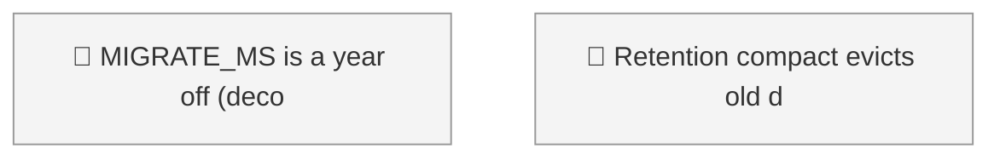
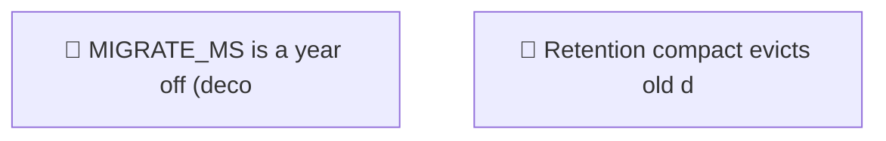

<!-- GENERATED by worklog roadmap-render. DO NOT EDIT. -->

> This file is generated from `.work/todo.jsonl`. Edits will be overwritten.
> To change the roadmap, change the work items: `worklog add|update|close`.

# Roadmap

_0 epic(s) in flight, 2 open item(s), 0 blocked, 0 unclassified._

## Now

_Nothing here._

## Next

### (no epic)

| # | Item | Type | Priority | Status | Blocked by |
|---|---|---|---|---|---|
| 01M19XRR | Retention: compact evicts old done.jsonl into an archive | story | P2 | todo | — |

## Later

### (no epic)

| # | Item | Type | Priority | Status | Blocked by |
|---|---|---|---|---|---|
| 01M19XRR | MIGRATE_MS is a year off (decodes to 2025-07-19) | task | P3 | todo | — |

## Milestones

### v0.24.10

| # | Item | Type | Priority | Status | Blocked by |
|---|---|---|---|---|---|
| 01M19XRR | Retention: compact evicts old done.jsonl into an archive | story | P2 | todo | — |
| 01M19XRR | MIGRATE_MS is a year off (decodes to 2025-07-19) | task | P3 | todo | — |

## Visual roadmap

### Dependency graph

```mermaid
graph TD
    01M19XRRWXHM72JBY29FQRRMEJ["🐛 MIGRATE_MS is a year off (deco"]
    01M19XRRZ2894K7XE59RX1EAY1["🔧 Retention compact evicts old d"]
    classDef todo fill:#f4f4f4,stroke:#999999
    class 01M19XRRWXHM72JBY29FQRRMEJ,01M19XRRZ2894K7XE59RX1EAY1 todo
```

### Hierarchy

```mermaid
graph TD
    01M19XRRWXHM72JBY29FQRRMEJ["🐛 MIGRATE_MS is a year off (deco"]
    01M19XRRZ2894K7XE59RX1EAY1["🔧 Retention compact evicts old d"]
```
