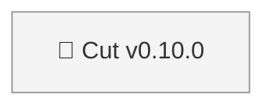

<!-- GENERATED by worklog roadmap-render. DO NOT EDIT. -->
<!-- source-hash: ef97d805 -->
<!-- generated-at: 2026-07-19T18:27:19Z -->

> This file is generated from `.work/todo.jsonl`. Edits will be overwritten.
> To change the roadmap, change the work items: `worklog add|update|close`.

# Roadmap

_0 epic(s) in flight, 1 open item(s), 0 blocked, 0 unclassified._

## Now

_Nothing here._

## Next

### (no epic)

| # | Item | Type | Priority | Status | Blocked by |
|---|---|---|---|---|---|
| 01KXXT3X | Cut v0.10.0 | task | P1 | todo | — |

## Later

_Nothing here._

## Milestones

### v0.10.0

| # | Item | Type | Priority | Status | Blocked by |
|---|---|---|---|---|---|
| 01KXXT3X | Cut v0.10.0 | task | P1 | todo | — |

## Needs attention

- Orphan events for `01KXSP27` — no create/snapshot yet.

## Visual roadmap

### Dependency graph

### Hierarchy

