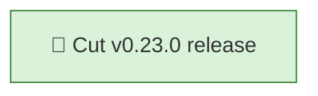
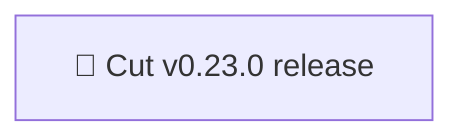

<!-- GENERATED by worklog roadmap-render. DO NOT EDIT. -->

> This file is generated from `.work/todo.jsonl`. Edits will be overwritten.
> To change the roadmap, change the work items: `worklog add|update|close`.

# Roadmap

_0 epic(s) in flight, 1 open item(s), 0 blocked, 0 unclassified._

## Now

### (no epic)

| # | Item | Type | Priority | Status | Blocked by |
|---|---|---|---|---|---|
| 01KZD8FB | Cut v0.23.0 release | task | P2 | in progress | — |

## Next

_Nothing here._

## Later

_Nothing here._

## Milestones

### v0.23.0

| # | Item | Type | Priority | Status | Blocked by |
|---|---|---|---|---|---|
| 01KZD8FB | Cut v0.23.0 release | task | P2 | in progress | — |

## Visual roadmap

### Dependency graph

### Hierarchy

