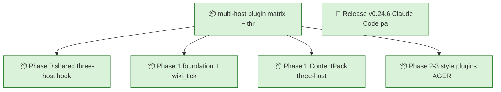
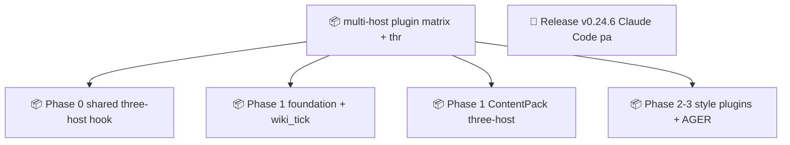

<!-- GENERATED by worklog roadmap-render. DO NOT EDIT. -->

> This file is generated from `.work/todo.jsonl`. Edits will be overwritten.
> To change the roadmap, change the work items: `worklog add|update|close`.

# Roadmap

_1 epic(s) in flight, 5 open item(s), 0 blocked, 0 unclassified._

## Now

### multi-host plugin matrix + three-host hooks  ·  P0  ·  0 of 4 done
Bring Spillwave Claude Code plugins to a five-host matrix (Claude, Grok, Codex, universal, Cursor) with three-host hooks: if Claude hooks exist, also ship Codex and Cursor-native hooks. Track all work in this worklog.

| # | Item | Type | Priority | Status | Blocked by |
|---|---|---|---|---|---|
| 01M0KCDV | Phase 0 shared three-host hook template | story | P0 | in progress | — |
| 01M0KCDV | Phase 1 foundation + wiki_ticket_sdd hosts | story | P0 | in progress | — |
| 01M0KCDV | Phase 1 ContentPack three-host hooks | story | P0 | in progress | — |
| 01M0KCDV | Phase 2-3 style plugins + AGER polish | story | P1 | in progress | — |

### (no epic)

| # | Item | Type | Priority | Status | Blocked by |
|---|---|---|---|---|---|
| 01M0TSFF | Release v0.24.6 Claude Code packaging pins | story | P2 | in progress | — |

## Next

_Nothing here._

## Later

_Nothing here._

## Milestones

### v0.24.6

| # | Item | Type | Priority | Status | Blocked by |
|---|---|---|---|---|---|
| 01M0TSFF | Release v0.24.6 Claude Code packaging pins | story | P2 | in progress | — |

## Visual roadmap

### Dependency graph

### Hierarchy

